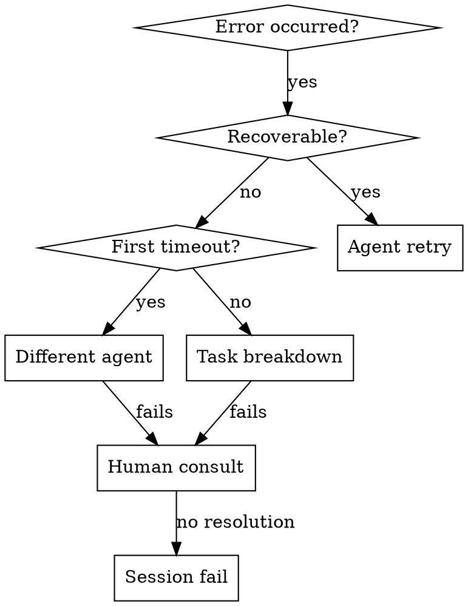

# Escalation Protocol

## Overview
**A three-level hierarchical error handling strategy: Agent Retry → Human Consultation → Session Failure.**

The core principle: Errors escalate systematically through recovery strategies before failing. Every error has a defined path forward.

## When to Use



**Use when:**
- Subagent fails or times out
- Recovery strategies exhausted
- Human decision point reached
- Critical system errors
- Ambiguous requirements blocking progress

**Don't use when:**
- Simple retryable failures (use standard retry)
- Clear error paths (fix and continue)
- Non-blocking issues

## Error Categories

| Category | Description | Escalation |
|----------|-------------|------------|
| **Recoverable** | Transient failures, network issues | Agent Retry |
| **Unrecoverable** | Code logic errors, invalid inputs | Different Agent / Human |
| **Timeout** | Agent unresponsive or stuck | Different Agent / Task Breakdown |
| **Critical** | System failures, data corruption | Human → Session Fail |

## Three-Level Escalation

### Level 1: Agent Recovery
Attempt these in order:

1. **Retry with context refresh**
   - Re-read relevant files
   - Re-summarize context
   - Attempt same approach

2. **Try different agent**
   - Switch agent type (e.g., dev → architect)
   - May handle differently

3. **Break down task**
   - Split into smaller units
   - Delegate subtasks

### Level 2: Human Consultation
Trigger when:
- Level 1 exhausted
- Ambiguous requirements
- Architectural decisions needed
- Trade-off analysis required

Format:
```
ISSUE: [what went wrong]
ATTEMPTED: [recovery strategies tried]
OPTIONS: [2-3 paths forward with trade-offs]
RECOMMENDATION: [what to do and why]
```

### Level 3: Session Failure
Declare when:
- Critical error blocks all progress
- Human consultation unavailable
- Resource limits exceeded
- Data integrity compromised

Graceful shutdown:
1. Save all state and artifacts
2. Document failure point
3. Provide recovery recommendations

## Recovery Strategies Matrix

| Error Type | Strategy 1 | Strategy 2 | Strategy 3 |
|------------|-----------|-----------|-----------|
| Agent timeout | Same agent, refresh context | Different agent type | Break down task |
| Logic error | Retry with clarification | Different agent | Human consult |
| Ambiguous spec | Make assumption + flag | Human clarify | Block for decision |
| Resource limit | Reduce scope | Different approach | Session fail |
| Data corruption | Rollback state | Human intervention | Session fail |

## Timeout Management

### First Timeout (Level 1)
- Context may be stale or agent stuck
- Action: Refresh context, retry same agent
- Duration: Reset timer

### Second Timeout (Level 2)
- Agent type may be wrong fit
- Action: Switch agent type or break down task
- Duration: Reset timer with new agent

### Third Timeout (Level 3)
- Fundamental issue with task definition
- Action: Human consultation required
- Duration: Block for human input

## Implementation Pattern

```typescript
type ErrorLevel = 1 | 2 | 3;

interface EscalationContext {
  level: ErrorLevel;
  attempts: RecoveryAttempt[];
  originalTask: Task;
  currentError: Error;
}

async function handleError(ctx: EscalationContext): Promise<Result> {
  // Level 1: Agent recovery
  if (ctx.level === 1) {
    return await agentRecovery(ctx);
  }

  // Level 2: Try different approach
  if (ctx.level === 2) {
    return await alternativeApproach(ctx);
  }

  // Level 3: Human consultation
  if (ctx.level === 3) {
    return await humanConsultation(ctx);
  }

  // Level 4: Session failure
  return await gracefulFailure(ctx);
}
```

## Human Consultation Template

```markdown
## Escalation Required

**Task**: ${originalTask.summary}

**Error**: ${currentError.message}

### Recovery Attempts
1. ${attempts[0].strategy} → ${attempts[0].result}
2. ${attempts[1].strategy} → ${attempts[1].result}

### Options Forward

| Option | Pros | Cons | Recommendation |
|--------|------|------|----------------|
| A | ${prosA} | ${consA} | ⭐ |
| B | ${prosB} | ${consB} | |
| C | ${prosC} | ${consC} | |

**Recommendation**: ${recommendedOption} because ${reason}

Awaiting human decision.
```

## Common Mistakes

| Mistake | Consequence | Fix |
|---------|-------------|-----|
| Immediate escalation on first error | No recovery attempted | Always try Level 1 first |
| No context refresh between retries | Same error repeats | Refresh files/context before retry |
| Jumping to human too soon | Unnecessary interruption | Exhaust agent-level options |
| Not documenting attempts | Wasted human effort | Track all recovery strategies |
| Continuing after critical error | Data corruption risk | Recognize when to fail fast |

## Red Flags - STOP and Escalate

- Third consecutive timeout
- Same error after two different agents
- Data integrity concerns
- Security vulnerabilities detected
- Undefined behavior in critical path

**All of these mean: Escalate immediately.**
