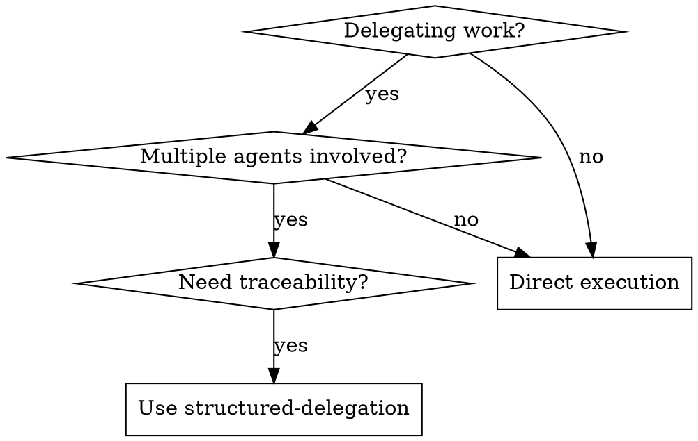

# Structured Delegation Protocol

## Overview
**A four-phase protocol for passing work between autonomous agents with artifact chaining and structured callbacks.**

The core principle: Every handoff must include context, acceptance criteria, traceability, and a defined callback path. No "fire and forget" delegations.

## When to Use



**Use when:**
- Spawning subagents for autonomous work
- Multi-agent coordination required
- Need traceability across agent boundaries
- Human-in-the-loop delegation
- Complex workflows requiring callbacks

**Don't use when:**
- Single agent executing directly
- Simple function calls
- No need for handoff tracking

## The Four Phases

### Phase 1: Pre-Delegation
Before delegating, verify:
- **Task is well-scoped** - Clear boundaries, defined success criteria
- **Agent capabilities match** - Target agent can handle this work type
- **Context is sufficient** - All necessary files/decisions included

### Phase 2: Delegation
The handoff payload must include:

| Field | Purpose | Required? |
|-------|---------|-----------|
| `handoff_id` | Unique UUID for this delegation | ✅ Yes |
| `parent_id` | Parent handoff for chaining | ✅ Yes* |
| `context_summary` | What work to do, why | ✅ Yes |
| `acceptance_criteria` | Definition of done | ✅ Yes |
| `escalation_path` | Where to go if stuck | ✅ Yes |
| `artifacts` | Related files/outputs | If applicable |

*Required except for root orchestrator

### Phase 3: During Delegation
The receiving agent:
- Acknowledges receipt with `handoff_id`
- Updates status on milestones
- Escalates via defined path if blocked

### Phase 4: Post-Delegation (Callback)
Required callback format:

```typescript
type CallbackStatus = 'success' | 'partial' | 'failed';

interface DelegationCallback {
  handoff_id: string;
  status: CallbackStatus;
  output_artifacts: string[];
  notes: string;
  next_action?: string;  // For partial/failed
}
```

## Quick Reference

| Situation | Action |
|-----------|--------|
| Spawn subagent | Create handoff with all 4 required fields |
| Subagent stuck | Use defined escalation_path |
| Work complete | Return callback with output_artifacts |
| Partial success | Return `partial` + next_action |
| Chain delegations | Set parent_id to previous handoff_id |

## Implementation Pattern

```typescript
// Pre-delegation validation
const canDelegate = taskIsWellScoped() && agentCanHandle();

if (!canDelegate) {
  refineTaskOrSelectAgent();
}

// Create handoff
const handoff: HandoffPayload = {
  handoff_id: crypto.randomUUID(),
  parent_id: currentHandoff?.id,
  context_summary: "Implement X with Y constraints",
  acceptance_criteria: ["Tests pass", "No regressions"],
  escalation_path: "human:architect",
  artifacts: [...relevantFiles]
};

// Dispatch and await callback
const result = await dispatchAgent(handoff);
```

## Common Mistakes

| Mistake | Consequence | Fix |
|---------|-------------|-----|
| No unique handoff_id | Can't trace or correlate | Always generate UUID |
| Missing escalation_path | Agent gets stuck, timeout | Always define escape hatch |
| No acceptance criteria | "Done" is subjective | Specific, measurable criteria |
| Fire-and-forget | No visibility into progress | Require callback always |
| Chaining without parent_id | Broken traceability | Always set parent_id |

## Artifact Chaining

When delegations chain (A→B→C), each `parent_id` creates a traceable lineage:

```
Orchestrator (root)
  └── Agent A (parent: root)
      └── Agent B (parent: A)
          └── Agent C (parent: B)
```

This enables:
- Full traceability from root to leaf
- Rollback at any level
- Status aggregation upward

## Red Flags - STOP and Fix

- Delegating without `handoff_id`
- No callback mechanism defined
- Acceptance criteria missing or vague
- No escalation path for blocked agents
- Chaining without `parent_id`

**All of these mean: Fix the handoff before dispatching.**
