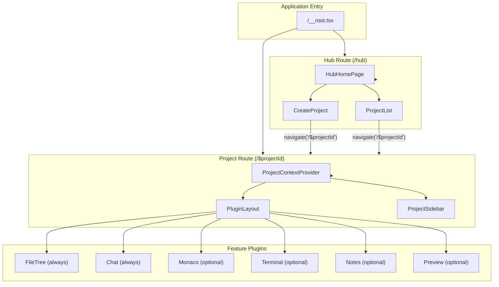

# ADR-034-AMENDMENT-002: Foundation Reset - Correcting False Completion Claims

**Status:** APPROVED
**Date:** 2026-01-26
**Decision Makers:** User (Product Owner), Architect Agent
**Amends:** ADR-034 (Project-Centric Architecture with Feature Plugins)

---

## Executive Summary

This amendment acknowledges that **EPIC-ARCH-01, EPIC-ARCH-02, and EPIC-ARCH-03 were marked complete prematurely** with false evidence. A comprehensive audit reveals the codebase does NOT align with the project-centric architecture described in ADR-034 and `new-fundamental-truths.md`.

**This amendment creates EPIC-FOUNDATION-RESET to remediate all issues.**

---

## Corrected Epic Status

| Epic | Previous Claim | TRUE Status | Gap | Root Cause |
|------|----------------|-------------|-----|------------|
| **EPIC-ARCH-01** | COMPLETE (100%) | **PARTIAL (20%)** | 80% | Legacy routes still exist, workspace terminology pervasive |
| **EPIC-ARCH-02** | COMPLETE (100%) | **PARTIAL (30%)** | 70% | Monaco is POC stub, plugins don't render properly |
| **EPIC-ARCH-03** | IN PROGRESS (85%) | **PARTIAL (15%)** | 70% | PluginLayout is 1034-line god component, layout broken |

---

## Evidence of False Completion

### 1. Legacy Routes Still Exist (Violates ADR-034 Section 5)

**ADR-034 states:**
> "Replace 9 routes with 2: /hub and /$projectId"

**Reality (20 routes found):**
```
src/routes/
├── ide.$projectId.tsx          # LEGACY - Should not exist
├── notes.$projectId.tsx        # LEGACY - Should not exist  
├── workspace/$projectId.tsx    # LEGACY - Should not exist
├── workspace/index.tsx         # LEGACY - Should not exist
├── notes.lazy.tsx              # LEGACY - Should not exist
├── ide.tsx                     # LEGACY - Should not exist
├── agents.tsx                  # LEGACY - Should redirect
├── settings.tsx                # LEGACY - Should be in /$projectId
├── projects.tsx                # LEGACY - Should be in /hub
├── about.tsx                   # ACCEPTABLE - Standalone
├── debug.tsx                   # DEV ONLY
├── $projectId.tsx              # CORRECT - But broken
├── hub.tsx                     # CORRECT
├── __root.tsx                  # CORRECT
└── ... (6 more files)
```

### 2. "Workspace" Terminology Pervasive (Violates new-fundamental-truths.md Section 1.1)

**Fundamental Truths states:**
> "The architecture has shifted from workspace-centric to project-centric model"

**Reality (170+ matches found):**
- `workspace` appears in 100+ .tsx files
- `WORKSPACE` constants in 70+ locations
- Components named `WorkspaceSwitcher`, `WorkspaceBindingDialog`, etc.
- Routes still use `/workspace/$projectId`

### 3. Monaco is POC Stub (Violates EPIC-ARCH-02 Story ARCH-02-05)

**ADR-034 claims:**
> "Convert Monaco to plugin + MIGRATE ide.$projectId route ✅"

**Reality:**
```typescript
// src/plugins/monaco/monacoPlugin.tsx line 291
// "Simplified version for proof of concept"
// Uses <textarea> instead of real Monaco editor
```

### 4. PluginLayout is God Component (Violates Governance S-014a)

**Governance rule:**
> "Components must be <400 lines"

**Reality:**
```
src/presentation/layouts/PluginLayout.tsx: 1034 lines
```

### 5. Route Structure Broken

**ADR-034 Amendment 001 states:**
> "All navigation uses /$projectId (not /ide/$projectId or /notes/$projectId)"
> "Old routes are deprecated and redirect to /$projectId"

**Reality:**
- Old routes exist and are NOT redirecting
- `/ide.$projectId.tsx` still fully functional
- `/notes.$projectId.tsx` still fully functional
- Double sidebar rendering in `__root.tsx`

---

## Decision

### 1. Acknowledge Previous Epics as INCOMPLETE

All previous epic completion certifications are **REVOKED**:
- EPIC-ARCH-01: Revoked
- EPIC-ARCH-02: Revoked  
- EPIC-ARCH-03: Revoked

### 2. Create EPIC-FOUNDATION-RESET

A new epic that:
1. **Archives all legacy routes** to `_bmad-ext/.archive/`
2. **Implements ONLY two routes**: `/hub` and `/$projectId`
3. **Removes workspace terminology** from all files
4. **Fixes PluginLayout** by splitting into <400-line components
5. **Replaces Monaco POC** with real Monaco editor
6. **Adds missing i18n keys** (40+ missing)
7. **Validates with E2E testing** before any completion claim

### 3. Mandate Evidence-Based Completion

**New Rule:** No story can be marked complete without:
1. Screenshot evidence of working UI
2. TypeScript compilation (0 errors)
3. Browser console log (0 errors)
4. Code review by separate agent

---

## Architecture: Correct Route Structure

### Before (Current - WRONG)

```
┌─────────────────────────────────────────────────────────────────┐
│                     20 ROUTES (CHAOS)                           │
├─────────────────────────────────────────────────────────────────┤
│ /hub                 │ /ide/$projectId      │ /workspace/*      │
│ /$projectId          │ /notes.$projectId    │ /agents           │
│ /settings            │ /notes.lazy          │ /projects         │
│ /ide                 │ /about               │ /debug            │
│ ... (duplicated, overlapping, broken)                           │
└─────────────────────────────────────────────────────────────────┘
```

### After (Target - CORRECT)

```
┌─────────────────────────────────────────────────────────────────┐
│                     2 ROUTES (CLEAN)                            │
├─────────────────────────────────────────────────────────────────┤
│                                                                 │
│  /hub                           /$projectId                     │
│  ├── Project list               ├── ProjectContextProvider      │
│  ├── Quick actions              ├── PluginLayout                │
│  ├── Recent projects            │   ├── FileTree (always)       │
│  └── Create project             │   ├── Chat (always)           │
│                                 │   ├── Monaco (optional)       │
│                                 │   ├── Terminal (optional)     │
│                                 │   ├── Notes (optional)        │
│                                 │   └── Preview (optional)      │
│                                 └── Settings (modal/drawer)     │
│                                                                 │
└─────────────────────────────────────────────────────────────────┘
```

---

## Mermaid: Correct Navigation Flow



---

## Files to Archive (Do NOT Modify - Archive Only)

```
_bmad-ext/.archive/legacy-routes-2026-01-26/
├── src/routes/ide.$projectId.tsx
├── src/routes/notes.$projectId.tsx
├── src/routes/workspace/$projectId.tsx
├── src/routes/workspace/index.tsx
├── src/routes/notes.lazy.tsx
├── src/routes/ide.tsx
├── src/routes/agents.tsx
├── src/routes/settings.tsx
├── src/routes/projects.tsx
└── ... (additional legacy files)
```

---

## Files to Rework (Major Changes Required)

| File | Issue | Action |
|------|-------|--------|
| `src/routes/__root.tsx` | Double sidebar, workspace imports | Simplify to single sidebar |
| `src/routes/$projectId.tsx` | Incomplete, broken | Complete implementation |
| `src/routes/hub.tsx` | May need updates | Verify alignment |
| `src/presentation/layouts/PluginLayout.tsx` | 1034 lines (god component) | Split into 4-6 files |
| `src/plugins/monaco/monacoPlugin.tsx` | POC stub (textarea) | Replace with real Monaco |
| `src/presentation/components/hub/HubHomePage.tsx` | Workspace terminology | Replace with project terminology |
| `src/presentation/components/hub/WorkspacePieChart.tsx` | Workspace concept | Remove or rename |

---

## EPIC-FOUNDATION-RESET Stories

| Story ID | Title | Priority | Effort | Dependencies |
|----------|-------|----------|--------|--------------|
| **FR-01** | Archive All Legacy Routes | P0 | 1h | None |
| **FR-02** | Implement Correct Hub Route | P0 | 2h | FR-01 |
| **FR-03** | Implement Correct Project Route | P0 | 3h | FR-01 |
| **FR-04** | Remove Workspace Terminology (40+ files) | P0 | 4h | FR-03 |
| **FR-05** | Split PluginLayout (1034 lines) | P0 | 3h | FR-03 |
| **FR-06** | Replace Monaco POC with Real Editor | P0 | 4h | FR-03 |
| **FR-07** | Add Missing i18n Keys (40+) | P1 | 2h | FR-04 |
| **FR-08** | Fix Single Sidebar Architecture | P1 | 2h | FR-05 |
| **FR-09** | E2E Validation (All User Journeys) | P0 | 3h | FR-01..FR-08 |

**Total Estimated Effort:** 24 hours (3 days)

---

## Governance Updates

### Updated Loop State

```yaml
current:
  epic_id: "EPIC-FOUNDATION-RESET"
  story_id: "FR-01"
  story_status: "pending"
  workflow: "story-dev-cycle"
  mode: "ORCHESTRATION"
```

### Epic Completion Gates

**New mandatory gates for any epic completion:**

1. **Evidence Gate**: Screenshot + console log + TypeScript output
2. **Code Review Gate**: Separate agent reviews all changes
3. **E2E Gate**: Real browser testing of user journey
4. **Governance Gate**: AGENTS.md updated with true status

---

## Approval

- [x] User (Product Owner) - APPROVED 2026-01-26
- [x] Architect Agent - APPROVED 2026-01-26

---

## Changelog

| Date | Change | Author |
|------|--------|--------|
| 2026-01-26 | ADR-034-AMENDMENT-002 created | architect-ext |
| 2026-01-26 | Revoked EPIC-ARCH-01, EPIC-ARCH-02, EPIC-ARCH-03 completion | architect-ext |
| 2026-01-26 | Created EPIC-FOUNDATION-RESET | architect-ext |
