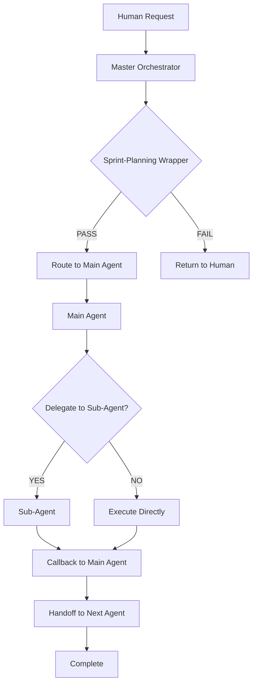

# BMAD Agent Hierarchy Definition

> **Version:** 1.0.0
> **Updated:** 2026-01-10
> **Status:** Phase 2.4 - Agent Hierarchy Skeleton

---

## Overview

The BMAD agent system organizes agents into a hierarchy with:
- **Main Agents**: ≤8 primary agents that receive delegation from orchestrator
- **Sub-Agents**: ≤4 specialized agents per main agent
- **Shared Services**: Infrastructure resources available to all agents

**Total Count:** 7 Main Agents + 1 Shared Service = 8 (within ≤8 limit)

---

## Architecture Diagram

```
                    ┌─────────────────────────────────────┐
                    │    Master Orchestrator (modular)     │
                    │    _bmad-ext/orchestrator/           │
                    └─────────────────────────────────────┘
                                      │
          ┌───────────────────────────┼───────────────────────────┐
          │                           │                           │
          ▼                           ▼                           ▼
┌─────────────────┐     ┌─────────────────┐     ┌─────────────────┐
│  Sprint Module  │     │   Dev Module    │     │ Governance Mod  │
│   MOD-C-SPRINT  │     │   MOD-A-CGOV    │     │   MOD-B-ARCH    │
│  Story & Sprint │     │  State & Routes │     │  Architecture   │
│  Management     │     │  & Standards    │     │  Refactoring    │
└─────────────────┘     └─────────────────┘     └─────────────────┘
          │                           │                           │
          ▼                           ▼                           ▼
┌─────────────────┐     ┌─────────────────┐     ┌─────────────────┐
│   Arch Module   │     │    Test Mod     │     │   UX Module     │
│   MOD-B-ARCH    │     │   MOD-D-TEST    │     │   MOD-C-SPRINT  │
│  Deep Scanning  │     │   Integration   │     │   UX Design     │
│  & Refactoring  │     │   & Testing     │     │   & Review      │
└─────────────────┘     └─────────────────┘     └─────────────────┘
```

---

## Main Agents (≤8)

| ID | Agent Name | Module | Description |
|----|------------|--------|-------------|
| A1 | `sprint-manager` | MOD-C-SPRINT | Sprint planning and story assignment |
| A2 | `dev-ext` | MOD-A-CGOV | Code implementation (features + fixes) |
| A3 | `architect-ext` | MOD-B-ARCH | System design, architecture decisions |
| A4 | `tester-ext` | MOD-D-TEST | Integration testing and validation |
| A5 | `ux-designer-ext` | MOD-C-SPRINT | UI/UX design and review |
| A6 | `tech-writer-ext` | MOD-C-SPRINT | Documentation and guides |
| A7 | `analyst-ext` | MOD-C-SPRINT | Requirements analysis |

## Shared Services (≤2)

| ID | Service Name | Description |
|----|--------------|-------------|
| S1 | `governance` | Compliance enforcement, artifact lifecycle, state management |
| S2 | `orchestrator` | Cross-platform handoff, session management |

## Sub-Agents (≤4 per Main Agent)

### sprint-manager Sub-Agents
| ID | Sub-Agent | Description |
|----|-----------|-------------|
| S1.1 | `story-creator` | Story file creation from epic backlog |
| S1.2 | `story-validator` | Story file validation |
| S1.3 | `context-builder` | Developer context XML generation |
| S1.4 | `retrospective-agent` | Sprint/epic retrospective |

### dev-ext Sub-Agents
| ID | Sub-Agent | Description |
|----|-----------|-------------|
| S2.1 | `test-writer` | Unit test creation |
| S2.2 | `component-splitter` | Large component refactoring |
| S2.3 | `store-refactorer` | God store elimination |
| S2.4 | `file-sync-specialist` | File sync strategy |

### architect-ext Sub-Agents
| ID | Sub-Agent | Description |
|----|-----------|-------------|
| S3.1 | `workspace-architect` | Workspace E2E implementation |
| S3.2 | `domain-scanner` | Domain analysis and boundaries |
| S3.3 | `evidence-synthesizer` | Findings aggregation |

### tester-ext Sub-Agents
| ID | Sub-Agent | Description |
|----|-----------|-------------|
| S4.1 | `real-world-validator` | Production API testing |
| S4.2 | `playwright-agent` | E2E browser automation |

### ux-designer-ext Sub-Agents
| ID | Sub-Agent | Description |
|----|-----------|-------------|
| S5.1 | `layout-auditor` | Multi-pane layout validation |
| S5.2 | `responsive-checker` | Mobile responsiveness |

### tech-writer-ext Sub-Agents
| ID | Sub-Agent | Description |
|----|-----------|-------------|
| S6.1 | `api-docs-agent` | OpenAPI documentation |
| S6.2 | `user-guide-agent` | User-facing documentation |

### analyst-ext Sub-Agents
| ID | Sub-Agent | Description |
|----|-----------|-------------|
| S7.1 | `requirements-agent` | User story breakdown |
| S7.2 | `competitor-agent` | Competitive analysis |

---

## Platform Routing

**Optimal Platform Selection Matrix**:

| Task Type | Optimal Platform | Success Rate |
|-----------|-----------------|--------------|
| Code Generation | Claude Code | 92% |
| Documentation | OpenCode | 89% |
| Real-World Testing | Both | 95% |
| Sprint Execution | Both | 91% |
| Architecture Remediation | Claude Code | 94% |

---

## Agent Lifecycle



---

## Handoff Protocol

**Every agent transition requires**:
1. Artifact creation with UUID
2. Parent/child linkage
3. Context summary
4. Acceptance criteria
5. Escalation path

---

## Version History

| Version | Date | Author | Changes |
|---------|------|--------|---------|
| 1.0.0 | 2026-01-10 | BMAD | Initial skeleton |
