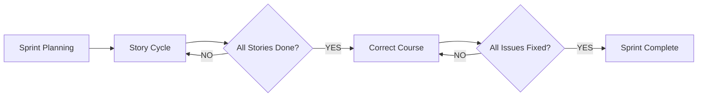

# Implementation Module

**Purpose**: Execute development work through story-cycle (new features) and correct-course (bug fixes/remediation) workflows.

## Phase Position

**PHASE 4: Implementation** - Execution layer for all development work

## Module Components

### Story Cycle (New Features)
| Component | Description | Priority |
|-----------|-------------|----------|
| `story-cycle` | Complete story development workflow | P0 |
| `story-done` | Story completion and governance update | P0 |
| `stale-check` | Context freshness validation | P1 |

### Correct Course (Bug Fixes)
| Component | Description | Priority |
|-----------|-------------|----------|
| `architecture-remediation` | Systematic technical debt elimination | P0 |
| `correct-course` | Recovery handler for stuck stories | P0 |

### Development Utilities
| Component | Description | Priority |
|-----------|-------------|----------|
| `create-story` | Story file creation | P1 |
| `validate-story` | Story file validation | P1 |
| `dev-story` | Story implementation | P0 |

---

## Integration Points

### Upstream (Phase 3)
- **Sprint Planning Wrapper**: Assigns stories to agents
- **Epic Backlog**: Provides story requirements

### Downstream (Phase 5)
- **Governance**: Updates after story completion
- **Retrospective**: Generates lessons learned

---

## Commands

### Sprint Commands
| Command | Description |
|---------|-------------|
| `/sprint-start` | Initialize sprint artifacts |
| `/sprint-status` | Show current progress |
| `/sprint-complete` | Complete sprint, trigger retrospective |

### Story Commands
| Command | Description |
|---------|-------------|
| `/story-create` | Create new story file |
| `/story-validate` | Validate story structure |
| `/story-dev` | Execute story development |
| `/story-done` | Mark story complete |

### Development Commands
| Command | Description |
|---------|-------------|
| `/dev-start` | Initialize development environment |
| `/dev-fix` | Fix issues in current branch |
| `/dev-complete` | Complete development, create PR |

---

## Version History

| Version | Date | Author | Changes |
|---------|------|--------|---------|
| 1.0.0 | 2026-01-11 | BMAD | Initial version |
