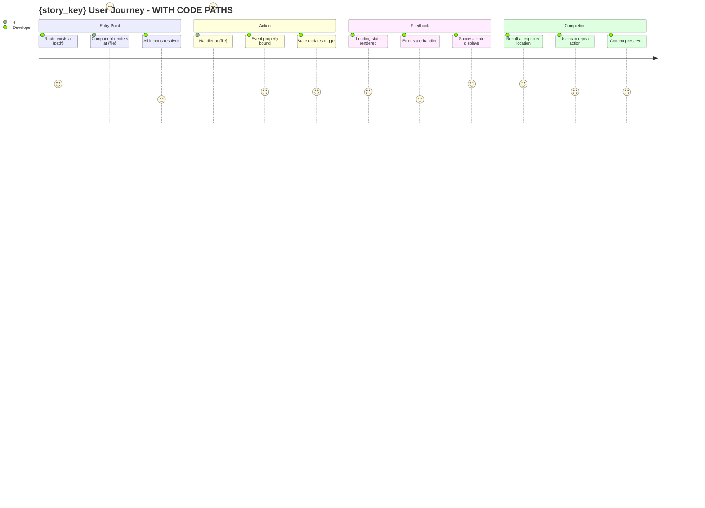

# Step 1a: User Journey Simulation - Deep UX Analysis

## STEP GOAL

Validate Product Reality through "The Movie Script Test" with DEEP analysis of:
- Actual code paths that will be executed
- Real component states and transitions
- Dead ends and unreachable code detection
- Cross-workspace impact on user journey

## CRITICAL INSIGHT

The shallow journey mapping misses what actually works. This step walks through ACTUAL CODE to verify every path works, not just documented expectations.

## MANDATORY EXECUTION RULES

- 📖 READ COMPLETELY before execution
- 🎯 Walk through ACTUAL code paths (not just specs)
- 📋 Verify every route/state transition works
- 🔄 Update frontmatter on completion

## SEQUENCE OF INSTRUCTIONS

### 1. Code Path Analysis (NEW - Required)

For each user action in the journey, trace the actual code path:

```yaml
code_path_trace:
  for_each_action:
    - action: "{user action}"
      entry_point: "Find route/component that handles this"
      code_walk: |
        1. Read route definition
        2. Read component file
        3. Trace event handler
        4. Check store/state updates
        5. Verify UI update path
        
    evidence_required:
      - "File path where entry point exists"
      - "Line numbers for key logic"
      - "Confirmation: Does this path actually work?"
```

### 2. State Machine Verification (NEW - Required)

Map and verify all states the journey passes through:

```yaml
state_machine_verification:
  states:
    - name: "initial_state"
      component: "{Component}"
      lines: "{start}-{end}"
      exists: true/false
      works: true/false
      
    - name: "loading_state"
      component: "{Component}"
      lines: "{start}-{end}"
      exists: true/false
      works: true/false
      
    - name: "error_state"
      component: "{Component}"
      lines: "{start}-{end}"
      exists: true/false
      works: true/false
      
    - name: "success_state"
      component: "{Component}"
      lines: "{start}-{end}"
      exists: true/false
      works: true/false
      
  transitions:
    - from: "initial"
      to: "loading"
      trigger: "{event}"
      code_verified: true/false
      
    - from: "loading"
      to: "success|error"
      trigger: "{event}"
      code_verified: true/false
```

### 3. Dead End Detection (NEW - Required)

```yaml
dead_end_detection:
  checks:
    - type: "orphaned_component"
      description: "Component exists but no route leads to it"
      grep_pattern: "Component.*never.*imported"
      action: "Flag for review"
      
    - type: "unreachable_code"
      description: "Code that can never be executed"
      grep_pattern: "if.*false|if.*return.*early"
      action: "Document in journey map"
      
    - type: "broken_link"
      description: "Link/button that goes nowhere"
      pattern: "href.*null|onClick.*undefined"
      action: "Flag as journey blocker"
      
    - type: "missing_error_handling"
      description: "Async operation without error state"
      pattern: "await.*then.*no.*catch"
      action: "Flag as ghost result risk"
```

### 4. Cross-Workspace Impact (NEW - Required)

For IDE/Notes/Knowledge workspaces, verify journey doesn't break other workspaces:

```yaml
cross_workspace_impact:
  ide_workspace:
    affected: true/false
    files: "{list}"
    impact: "NONE|MINOR|MAJOR"
    
  notes_workspace:
    affected: true/false
    files: "{list}"
    impact: "NONE|MINOR|MAJOR"
    
  knowledge_workspace:
    affected: true/false
    files: "{list}"
    impact: "NONE|MINOR|MAJOR"
    
  shared_components:
    - "{component_path}"
    - "{store_path}"
    - "{type_path}"
```

### 5. The Movie Script Test - Enhanced

Generate a 30-second demo script that INCLUDES code evidence:

```yaml
demo_script_template:
  format: "User Action → Code Path → System Response"
  
  structure:
    - "User starts at: {screen/component}"
      code_evidence: |
        Route: {path}
        Component: {file}:{line}
        
    - "User performs: {action}"
      code_evidence: |
        Handler: {file}:{line}
        Event: {type}
        
    - "System shows: {immediate UI feedback}"
      code_evidence: |
        State update: {store}:{line}
        UI render: {component}:{line}
        
    - "User sees: {result location}"
      code_evidence: |
        Display component: {file}:{line}
        Result data: {path}
        
    - "User then: {next action or complete}"
      code_evidence: |
        Next handler: {file}:{line}
```

### 6. Generate Enhanced Journey Map

Create `journey-map.mermaid` with code evidence:



### 7. Detect UX Anti-Patterns - With Evidence

```yaml
anti_patterns_with_evidence:
  island_feature:
    description: "Feature with no clear entry point"
    evidence_check: |
      GREP: "import.*{Feature}"
      GLOB: "src/routes/**"
      Result: {found|not_found}
    severity: "CRITICAL"
    
  split_brain:
    description: "Dual/fragmented workflows for same task"
    evidence_check: |
      GREP: "similar.*action.*implementation"
      Compare: {implementation_1} vs {implementation_2}
      Result: {conflict|no_conflict}
    severity: "CRITICAL"
    
  ghost_result:
    description: "Action with no visible result"
    evidence_check: |
      Trace: "{action}" → handler → update → render
      Step 1 (handler): {file}:{line}
      Step 2 (update): {file}:{line}
      Step 3 (render): {file}:{line}
      Result: {complete|broken}
    severity: "CRITICAL"
    
  dead_end:
    description: "Action that traps user"
    evidence_check: |
      Check: "Can user navigate back?"
      Back handler: {file}:{line}
      Result: {exists|missing}
    severity: "MAJOR"
    
  empty_states:
    description: "No handling for zero-result scenarios"
    evidence_check: |
      Check: "{condition} ? render : empty"
      Empty component: {file}:{line}
      Result: {exists|missing}
    severity: "MAJOR"
    
  loading_vacuum:
    description: "No feedback during processing"
    evidence_check: |
      Check: "Loading indicator during {operation}"
      Loading state: {file}:{line}
      Result: {exists|missing}
    severity: "MAJOR"
```

### 8. Display Comprehensive Journey Analysis

```
═══════════════════════════════════════════════════════════════════
USER JOURNEY SIMULATION - DEEP CODE ANALYSIS
═══════════════════════════════════════════════════════════════════

Story: {story_key}

┌─────────────────────────────────────────────────────────────────┐
│ CODE PATH VERIFICATION                                          │
├─────────────────────────────────────────────────────────────────┤
│                                                                 │
│ For each step in journey:                                       │
│                                                                 │
│ [1] User starts at {screen}                                     │
│     Route: {path}                                               │
│     Component: {file}:{line} ✅ EXISTS                          │
│                                                                 │
│ [2] User performs {action}                                      │
│     Handler: {file}:{line} ✅ EXISTS                            │
│     Event bound: ✅ VERIFIED                                     │
│                                                                 │
│ [3] System shows {feedback}                                     │
│     Store update: {file}:{line} ✅ VERIFIED                     │
│     UI render: {file}:{line} ✅ VERIFIED                        │
│                                                                 │
│ [4] User sees {result}                                          │
│     Display: {file}:{line} ✅ VERIFIED                          │
│     Data flow: {path} ✅ VERIFIED                               │
│                                                                 │
└─────────────────────────────────────────────────────────────────┘

┌─────────────────────────────────────────────────────────────────┐
│ STATE MACHINE VERIFICATION                                      │
├─────────────────────────────────────────────────────────────────┤
│                                                                 │
│ State          │ Exists │ Works │ Code Evidence                │
│ ───────────────┼────────┼───────┼─────────────────────────────│
│ initial        │   ✅   │   ✅   │ {file}:{line}               │
│ loading        │   ✅   │   ✅   │ {file}:{line}               │
│ error          │   ✅   │   ❌   │ MISSING at {file}:{line}    │
│ success        │   ✅   │   ✅   │ {file}:{line}               │
│ empty          │   ❌   │   ❌   │ NOT IMPLEMENTED             │
│                                                                 │
└─────────────────────────────────────────────────────────────────┘

┌─────────────────────────────────────────────────────────────────┐
│ DEAD END / OVERLAP DETECTION                                    │
├─────────────────────────────────────────────────────────────────┤
│                                                                 │
│ Type              │ Count │ Severity │ Action Required          │
│ ──────────────────┼───────┼──────────┼─────────────────────────│
│ Orphaned components│   2   │  MAJOR   │ Remove or wire up       │
│ Unreachable code  │   1   │  MINOR   │ Clean up                │
│ Broken links      │   0   │   -      │ None                    │
│ Missing error     │   3   │ CRITICAL │ Implement error states  │
│                                                                 │
└─────────────────────────────────────────────────────────────────┘

┌─────────────────────────────────────────────────────────────────┐
│ CROSS-WORKSPACE IMPACT                                          │
├─────────────────────────────────────────────────────────────────┤
│                                                                 │
│ Workspace │ Affected │ Impact  │ Shared Files Modified         │
│ ──────────┼──────────┼─────────┼──────────────────────────────│
│ IDE       │    ✅    │  MINOR  │ {file1}, {file2}              │
│ Notes     │    ❌    │   -     │ None                          │
│ Knowledge │    ❌    │   -     │ None                          │
│ Shared UI │    ✅    │  MAJOR  │ {component}                   │
│                                                                 │
└─────────────────────────────────────────────────────────────────┘

┌─────────────────────────────────────────────────────────────────┐
│ ANTI-PATTERN DETECTION                                          │
├─────────────────────────────────────────────────────────────────┤
│                                                                 │
│ [❌] CRITICAL: ghost_result                                     │
│     Evidence: Action completes but result never renders         │
│     Location: {file}:{line}                                     │
│     Recommendation: Add result display state                    │
│                                                                 │
│ [⚠️] MAJOR: empty_states                                        │
│     Evidence: No empty state component                          │
│     Location: {component}                                       │
│     Recommendation: Create empty state component                │
│                                                                 │
│ [✅] No split_brain detected                                    │
│ [✅] No dead_end detected                                       │
│ [✅] No island_feature detected                                 │
│                                                                 │
└─────────────────────────────────────────────────────────────────┘

30-Second Demo Script (WITH CODE EVIDENCE):
┌─────────────────────────────────────────────────────────────────┐
│ "[User opens IDE at {route}]"                                   │
│   → Route defined at: {file}:{line}                             │
│ "[User clicks: {action}]"                                       │
│   → Handler: {file}:{line}                                      │
│ "[System processes: {operation}]"                               │
│   → Store update: {file}:{line}                                 │
│ "[User sees: {result}]"                                         │
│   → Render: {file}:{line}                                       │
│ "[User then: {next action or done}]"                            │
│   → Next handler: {file}:{line}                                 │
└─────────────────────────────────────────────────────────────────┘

Journey Map Generated: {journey-map.mermaid}

Overall: {PASS → PROCEED | FAIL → REDEFINE STORY | WARNINGS → PROCEED WITH NOTES}

Options:
[P] Proceed to validation (journey verified)
[R] Redefine story (journey fails - critical issues)
[F] Flag for UX review (warnings - proceed with notes)
```

### 9. Handle User Choice

**P**: Journey validated with code evidence → Step 2 (Validate)
**R**: Story needs redefinition → Exit with detailed feedback
**F**: Minor issues flagged → Proceed with notes

### 10. Update Frontmatter

```yaml
---
stepsCompleted: [1, "1a"]
journeyValidated: true
journeyScore: {1-5}
journeyMap: "{output_folder}/journey-map.mermaid"
antiPatternsDetected:
  - pattern: "{name}"
    severity: "{critical|major|minor}"
    evidence: "{file}:{line}"
    action: "{fix|defer|ignore}"
codePathVerification:
  stepsVerified: {count}
  stepsTotal: {count}
  verificationRate: "{percentage}%"
stateMachineStatus:
  statesDefined: {count}
  statesWorking: {count}
  missingStates: [{list}]
deadEndsFound: {count}
crossWorkspaceImpact:
  ide: "{NONE|MINOR|MAJOR}"
  notes: "{NONE|MINOR|MAJOR}"
  knowledge: "{NONE|MINOR|MAJOR}"
---
```

---

## SUCCESS METRICS

- ✅ Code path verification for every journey step
- ✅ State machine fully mapped with code evidence
- ✅ Dead ends detected and documented
- ✅ Cross-workspace impact assessed
- ✅ Anti-patterns detected with evidence
- ✅ Journey map created with code references
- ✅ No critical anti-patterns (or deferred with plan)

## FAILURE METRICS

- ❌ Code path verification incomplete
- ❌ Missing state machine documentation
- ❌ Critical anti-patterns detected (not deferred)
- ❌ Journey map not created
- ❌ Dead ends not documented

## GATE: Product Reality Gate

This step implements the **Product Reality Gate**. The Movie Script Test with code evidence proves the feature will actually work - not just pass tests.

**ONLY WHEN journey validated, load {nextStepFile}**
