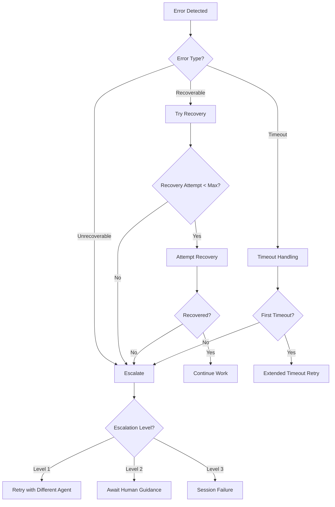

# _bmad-ext/orchestrator/escalation-protocol.md

# Escalation Protocol

> Defines what to do when things go wrong — failures, timeouts, errors, and recovery strategies.

---

## Overview



---

## Error Categories

```yaml
error_categories:
  recoverable:
    description: "Errors that can be fixed with retry or alternative approach"
    examples:
      - "Transient network errors"
      - "File system race conditions"
      - "Temporary resource locks"
      - "Test flakiness"
    action: "attempt_recovery"

  unrecoverable:
    description: "Errors that require different approach or human intervention"
    examples:
      - "TypeScript type errors"
      - "Architecture violations"
      - "Logic errors in implementation"
      - "Missing dependencies"
    action: "escalate"

  timeout:
    description: "Agent took too long to respond"
    examples:
      - "Agent exceeded timeout_minutes"
      - "No callback received"
      - "Agent hung"
    action: "timeout_handling"

  critical:
    description: "System-level failures requiring immediate attention"
    examples:
      - "Data corruption risk"
      - "Security vulnerabilities"
      - "Broken build blocking all work"
    action: "immediate_escalation"
```

---

## Recovery Strategies

### Strategy 1: Retry with Same Agent

```yaml
strategy_id: "RETRY-SAME"
description: "Retry the same agent with fresh context"

when:
  - error_category == "recoverable"
  - recovery_attempts == 0
  - error_type in ["transient_network", "file_lock", "test_flaky"]

steps:
  1. Log Retry Attempt:
     file: "_bmad-ext/state/LOOP_STATE.yaml"
     update: "errors.recovery_attempts += 1"

  2. Create Retry Handoff:
     template: "handoff-artifact.schema.yaml"
     output: "_bmad-output/handoffs/{date}/{story_id}-retry-{attempt}.md"
     include:
       - context_summary: "Retry attempt {attempt} after error"
       - error_context: "{original_error}"
       - recovery_strategy: "retry_same_agent"

  3. Re-delegate to Same Agent:
     agent: "{original_agent}"
     with: "retry handoff artifact"

  4. Await Callback:
     timeout: "extended_timeout (1.5x original)"

  5. On Success:
     - Log recovery success
     - Continue normal flow

  6. On Failure Again:
     - escalate to next strategy
```

### Strategy 2: Retry with Different Agent

```yaml
strategy_id: "RETRY-DIFFERENT"
description: "Try a different agent that might handle the task better"

when:
  - recovery_attempts >= 1
  - error_category == "unrecoverable"
  - alternative_agent_available == true

steps:
  1. Determine Alternative Agent:
     from: "_bmad-ext/orchestrator/routing-rules.yaml"
     logic: |
       if original_agent == "dev-ext" and error involves types:
         alternative = "typescript-specialist" if available
       if original_agent == "dev-ext" and error involves architecture:
         alternative = "architect-ext" for consultation

  2. Create Collaboration Handoff:
     output: "_bmad-output/handoffs/{date}/{story_id}-collaboration.md"
     include:
       - context_summary: "Collaboration: {original_agent} needs help"
       - original_error: "{error_details}"
       - original_agent: "{original_agent}"
       - collaborating_agent: "{alternative_agent}"
       - collaboration_mode: "consult"

  3. Delegate to Alternative Agent:
     agent: "{alternative_agent}"
     description: "consult and provide guidance"

  4. Process Consultation Result:
     - If guidance received: pass to original agent
     - If fixable by alternative: let alternative fix
     - If still stuck: escalate to human

  5. Update LOOP_STATE:
     - Log collaboration
     - Update recovery_attempts
```

### Strategy 3: Break Down Task

```yaml
strategy_id: "BREAK-DOWN"
description: "Break the failing task into smaller, manageable pieces"

when:
  - task_too_large == true
  - error involves "timeout" or "complexity"
  - story has multiple tasks

steps:
  1. Analyze Failure Point:
     - Identify which specific task failed
     - Determine if task can be subdivided

  2. Create Sub-Tasks:
     for: "failed task"
     create: "smaller sub-tasks"
     output: "_bmad-output/active/{story_id}/sub-tasks-{timestamp}.md"

  3. Create Handoff with Sub-Tasks:
     include: "only the next sub-task"
     not: "all remaining work"

  4. Delegate Sub-Task:
     agent: "{original_agent}"
     scope: "single sub-task"

  5. On Success:
     - Create handoff for next sub-task
     - Continue until all sub-tasks complete

  6. On Failure:
     - escalate to human
```

### Strategy 4: Human Intervention

```yaml
strategy_id: "HUMAN-INTERVENTION"
description: "Await human guidance for complex issues"

when:
  - recovery_attempts >= max_recovery_attempts (3)
  - error_category == "unrecoverable"
  - error_severity == "high" or "critical"

steps:
  1. Create Human Handoff:
     output: "_bmad-output/handoffs/{date}/{story_id}-human-intervention.md"
     type: "human_request"
     include:
       - context_summary: "Human intervention required"
       - error_details: "{full_error_context}"
       - recovery_attempts: "{count}"
       - what_was_tried: "{list of attempts}"
       - options_for_human:
           - "Fix the error manually and continue"
           - "Provide guidance on how to fix"
           - "Skip this task and continue"
           - "Abort the session"

  2. Update LOOP_STATE:
     - session.status = "PAUSED"
     - continuation.blockers.append("awaiting_human_intervention")

  3. Display Human Request:
     output: |
       ╔══════════════════════════════════════════════════════════════╗
       ║  ⚠️  HUMAN INTERVENTION REQUIRED                              ║
       ╠══════════════════════════════════════════════════════════════╣
       ║  Story: {story_id}                                            ║
       ║  Agent: {agent}                                               ║
       ║  Error: {error_summary}                                       ║
       ║  Attempts: {recovery_attempts}                                ║
       ╠══════════════════════════════════════════════════════════════╣
       ║  Please review: {handoff_path}                                ║
       ║                                                              ║
       ║  Options:                                                    ║
       ║  [F] Fix manually and continue                               ║
       ║  [G] Provide guidance                                        ║
       ║  [S] Skip this task                                         ║
       ║  [A] Abort session                                          ║
       ╚══════════════════════════════════════════════════════════════╝

  4. Wait for Human Response:
     pause: "await human input"

  5. Process Human Response:
     if: "human_choice == 'F' or 'fix'"
       then: "await_manual_fix_then_continue"

     if: "human_choice == 'G' or 'guidance'"
       then: "apply_guidance_and_retry"

     if: "human_choice == 'S' or 'skip'"
       then: "mark_task_skipped_and_continue"

     if: "human_choice == 'A' or 'abort'"
       then: "session_failed_with_reason"
```

---

## Timeout Handling

```yaml
timeout_handling:
  detection:
    - check: "time_elapsed > delegations.active.timeout_minutes"
    - check_interval: "30 seconds"

  on_first_timeout:
    strategy: "extend_timeout"
    steps:
      1. Log Timeout:
         file: "_bmad-ext/state/DELEGATION_LOG.yaml"
         entry: {action: "timeout", duration: "{time_elapsed}"}

      2. Create Extended Retry Handoff:
         timeout_multiplier: 1.5
         output: "{handoff_path}"

      3. Re-delegate with Extended Timeout:
         timeout_minutes: "{original * 1.5}"

      4. If still times out:
         → escalate to human

  on_second_timeout:
    strategy: "escalate"
    steps:
      1. Create Timeout Failure Handoff:
         include: "full timeout context"

      2. Escalate to Human:
         message: "Agent timeout twice, requires review"

      3. Options:
         - "Break down task into smaller pieces"
         - "Different approach"
         - "Manual intervention"
```

---

## Escalation Levels

```yaml
escalation_levels:
  level_1:
    name: "Agent Retry"
    trigger: "recovery_attempts < max_recovery_attempts"
    action: "retry with same or different agent"
    notification: "log only"

  level_2:
    name: "Human Consultation"
    trigger: "recovery_attempts >= max OR complex error"
    action: "await human guidance"
    notification: "prompt user"

  level_3:
    name: "Session Failure"
    trigger: "critical error OR human abort OR max attempts exhausted"
    action: "end session with failure"
    notification: "full report + archive"
```

---

## Error State Management

```yaml
error_state:
  file: "_bmad-ext/state/LOOP_STATE.yaml"
  section: "errors"

  fields:
    count: "number of errors in session"
    last_error: "summary of most recent error"
    last_error_at: "timestamp of most recent error"
    last_error_context:
      story_id: "what story was being worked on"
      agent: "which agent failed"
      task: "which task failed"
      error_type: "category of error"
      recovery_attempts: "how many times we tried to recover"

  reset_conditions:
    - "after successful story completion"
    - "on session start"
    - "when explicitly requested by human"
```

---

## Session Failure Protocol

```yaml
session_failure:
  trigger_conditions:
    - "errors.count >= critical_threshold (5)"
    - "human chooses to abort"
    - "max_recovery_attempts exceeded for critical task"

  on_failure:
    1. Set Session Status:
       file: "_bmad-ext/state/LOOP_STATE.yaml"
       update: "session.status = 'FAILED'"

    2. Create Failure Report:
       output: "_bmad-output/sessions/{session.id}/failure-report.md"
       include:
         - Session summary
         - What was attempted
         - Errors encountered
         - Recovery attempts
         - Recommendation for next steps

    3. Archive Session:
       destination: "_bmad-output/.archive/sessions/failed/{session.id}/"
       contents:
         - LOOP_STATE.yaml
         - DELEGATION_LOG.yaml
         - All handoff artifacts
         - Failure report

    4. Display Failure Summary:
       output: |
         ╔══════════════════════════════════════════════════════════════╗
         ║  ❌ SESSION FAILED                                          ║
         ╠══════════════════════════════════════════════════════════════╣
         ║  Session ID: {session.id}                                   ║
         ║  Duration: {session_duration}                               ║
         ║  Stories Attempted: {stories_attempted}                     ║
         ║  Stories Completed: {stories_completed}                     ║
         ║  Total Errors: {errors.count}                               ║
         ╠══════════════════════════════════════════════════════════════╣
         ║  Last Error: {errors.last_error}                            ║
         ║  Failure Report: {report_path}                              ║
         ╠══════════════════════════════════════════════════════════════╣
         ║  Next Steps:                                                ║
         ║  1. Review failure report                                   ║
         ║  2. Address blocking issues                                ║
         ║  3. Resume session when ready                               ║
         ╚══════════════════════════════════════════════════════════════╝

    5. Enable Recovery:
       - Session can be resumed
       - LOOP_STATE preserved
       - Partial work retained
```

---

## Recovery Checklist

```yaml
recovery_checklist:
  before_retry:
    - [ ] Error logged in LOOP_STATE
    - [ ] Recovery attempt incremented
    - [ ] Root cause analyzed
    - [ ] Strategy selected
    - [ ] Handoff artifact created

  after_recovery:
    - [ ] Error resolved
    - [ ] LOOP_STATE errors cleared
    - [ ] Delegation completed successfully
    - [ ] Progress updated

  before_escalation:
    - [ ] All recovery strategies exhausted
    - [ ] Error context fully documented
    - [ ] Human handoff created
    - [ ] Session paused
    - [ ] User notified
```

---

## Version History

| Version | Date | Changes |
|---------|------|---------|
| 1.0.0 | 2026-01-10 | Initial escalation protocol for Phase 3 |
