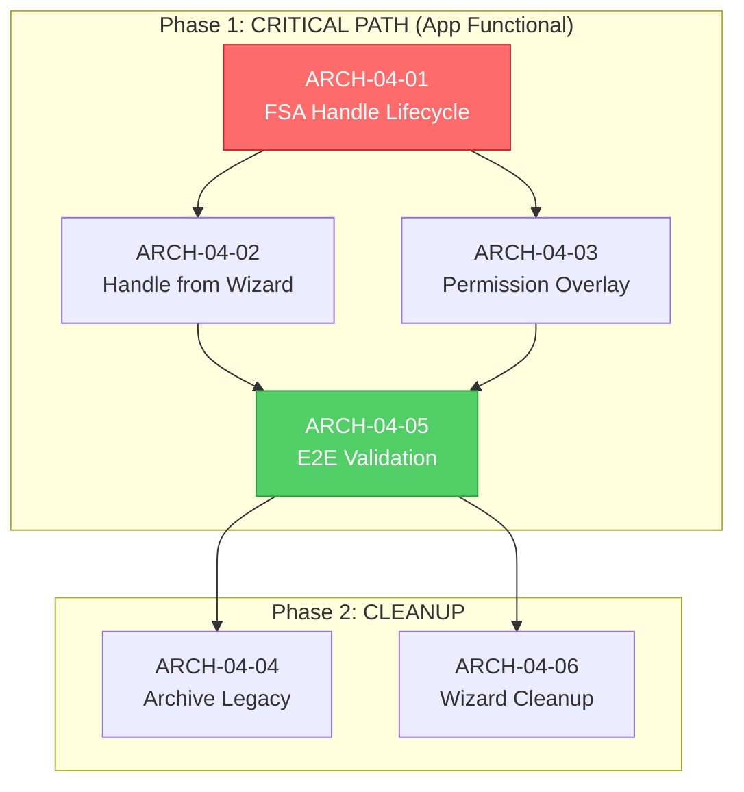

# ARCH-04 Strategic Synthesis & Architect Decision

> **Document Type:** Strategic Decision Document
> **Date:** 2026-01-25T20:20:00+07:00
> **Author:** BMAD Master (Orchestrator)
> **Status:** ARCHITECT DECISION REQUIRED
> **Priority:** P0 - CRITICAL BLOCKER

---

## Document Governance

### Input Documents (Reviewed)

| Document | Path | Date | Verdict |
|----------|------|------|---------|
| **Correct-Course Report** | `_bmad-output/planning-artifacts/ARCH-04-CORRECT-COURSE-2026-01-25.md` | 2026-01-25 | Architectural Flaw Confirmed |
| **Classification Report** | `_bmad-output/handoffs/2026-01-25/ARCH-04-03-CLASSIFICATION-2026-01-25.md` | 2026-01-25 | Project-Wide Impact |
| **Validation Report** | `_bmad-output/handoffs/2026-01-25/ARCH-04-03-VALIDATION-2026-01-25.md` | 2026-01-25 | BLOCK |
| **EPIC-ARCH-04** | `_bmad-output/planning-artifacts/epics/EPIC-ARCH-04-complete-migration-2026-01-25.md` | 2026-01-25 | 6 stories, 8-12 hours |
| **3-Phase Approach** | `docs/the-3-phase-approach.md` | 2026-01-25 | Strategic Framework |
| **Workflow Status** | `bmm-workflow-status.yaml` | 2026-01-25 | READY_FOR_SPRINT_PLANNING |

### Output Documents (Created by This Decision)

| Document | Path | Purpose |
|----------|------|---------|
| **Research Pending Notice** | `_bmad-output/notices/RESEARCH-PENDING-2026-01-25.md` | Marks research as pending |
| **Sprint Execution Directive** | To be created | Guides dev-team execution |

---

## Executive Summary

### Crisis Confirmation

> [!CAUTION]
> **ARCHITECTURAL-LEVEL FLAW CONFIRMED**
> 
> The application is **non-functional for ALL FSA desktop projects** due to missing FSA handle lifecycle integration in `ProjectContextProvider`. This is NOT a localized UI defect—it breaks the project-centric architecture defined in ADR-034.

### Root Cause Analysis

```
EPIC-ARCH-01/02/03 created NEW architecture → BUT → did NOT migrate FSA handle lifecycle from OLD architecture

OLD Context (Archived):                    NEW Context (Current):
├── fsaHandle state           ────────>    ❌ Missing
├── restoreHandleAsync()      ────────>    ❌ Missing  
├── handlePersistenceService  ────────>    ❌ Missing
├── Permission Overlay        ────────>    ❌ Missing
└── initialHandle prop        ────────>    ❌ Missing
```

### Impact Scope

| Impact Area | Severity | Description |
|-------------|----------|-------------|
| **Project Creation** | ❌ BROKEN | FSA handle discarded during wizard→route navigation |
| **Project Loading** | ❌ BROKEN | No handle restoration, no permission overlay triggered |
| **File Operations** | ❌ BROKEN | FSAStorageAdapter receives null handle |
| **Silent Restore** | ❌ UNAVAILABLE | Chrome 122+ feature not integrated |
| **User Recovery Path** | ❌ UNREACHABLE | Permission overlay never shown |

---

## Alignment with 3-Phase Approach

### User's Strategic Framework (from `the-3-phase-approach.md`)

The user has defined a strategic framework emphasizing:

1. **Progressive and Complete Refactor and Migration**
   - Track ALL new code files, slices, domains
   - Maintain lists of:
     - 100%-safe-to-archive files
     - Partially legacy files with forecast
     - Highly-inconsistent items (types, schemas with relationships)
   - Goal: Reduce 2000+ files → 1000+ files

2. **End-to-End Complete Reworks**
   - Each epic should demonstrate complete user journey
   - Zero gaps, zero drifts, zero debts, zero conflicts

3. **Complexity Layering + Trial-Errors with Human Feedback**
   - Avoid nonsensical guardrails
   - Conduct horizontal AND vertical analysis
   - Use all search capabilities: grep, glob, list, MCP tools

### ARCH-04 Alignment Assessment

| 3-Phase Principle | ARCH-04 Compliance | Evidence |
|-------------------|-------------------|----------|
| Progressive Migration | ✅ ALIGNED | Completes FSA handle migration from OLD→NEW context |
| End-to-End Journey | ✅ ALIGNED | 4 test scenarios cover full FSA lifecycle |
| Complexity Layering | ✅ ALIGNED | 3-step correct-course proposal with dependencies |
| Safe-to-Archive Tracking | ⚠️ NEEDS ADDITION | Story 4 archives but needs tracking list |
| Human Feedback Loop | ✅ ALIGNED | E2E validation (Story 5) before cleanup |

---

## Architect Decision: CORRECT-COURSE APPROVED ✅

### Decision Rationale

1. **The architectural flaw is blocking ALL FSA functionality** - this is P0 critical
2. **ARCH-04 correct-course proposal is well-structured** with clear steps and acceptance criteria
3. **Alignment with 3-phase-approach** is strong (progressive migration, end-to-end validation)
4. **Risk is manageable** - rollback plan exists (restore archived OLD context)

### Approved Execution Order



### Execution Directive

| Story | Priority | Team | Time Box | Completion Gate |
|-------|----------|------|----------|-----------------|
| **ARCH-04-01** | P0 BLOCKER | dev-ext | 4 hours | `pnpm tsc --noEmit` passes |
| **ARCH-04-02** | P0 | dev-ext | 2 hours | Console shows handle passing |
| **ARCH-04-03** | P0 | dev-ext | 2 hours | Overlay triggered on permission required |
| **ARCH-04-05** | P0 GATE | dev-ext/validator | 2 hours | All 4 scenarios pass |
| ARCH-04-04 | P1 | dev-ext | 2 hours | No legacy imports remain |
| ARCH-04-06 | P2 | dev-ext | 1 hour | Wizard simplified |

### Success Criteria (Before Cleanup Phase)

```
✅ FSA project creation works (no permission overlay for new projects)
✅ FSA project loading works (permission overlay when needed)
✅ Silent restore works (Chrome 122+ - no overlay on reload)
✅ IndexedDB projects unaffected (separate code path)
✅ TypeScript: 0 errors
✅ Build: SUCCESS
```

---

## Research Status: PENDING-FOR-FURTHER-INVESTIGATION

> [!WARNING]
> **5 Research Tasks Complete But DEFERRED**
> 
> Per user directive, the following research findings are marked as **pending-for-further-investigation** due to the more alarming ARCH-04 architectural crisis.

### Research Findings Summary (Validated but Deferred)

| Research Area | Validation Score | Decision Status | Deferral Reason |
|---------------|-----------------|-----------------|-----------------|
| **Project-Centric Architecture** | 9/10 ✅ VALID | PROCEED | Being addressed by ARCH-04 |
| **Platform-Aware Plugin Selection** | 9/10 ✅ VALID | PROCEED | No immediate action needed |
| **FSA for Desktop + Dexie for Mobile** | 10/10 ✅ VALID | PROCEED | Being addressed by ARCH-04 |
| **TanStack AI SDK** | 6/10 ⚠️ RECONSIDER | **DEFERRED** | Await Phase 2 (Chat/Thread) |
| **Orchestrator + Domain Agents** | 9/10 ✅ VALID | **DEFERRED** | Await Phase 3 (Multi-Agentic) |
| **Thread per Project + Compaction** | 8/10 ✅ VALID | **DEFERRED** | Await Phase 2 |
| **BYOK with Web Crypto** | 8/10 ✅ VALID | **DEFERRED** | Await Phase 1B (BYOK) |

### Gap Analysis Items (DEFERRED)

| Gap | Severity | Deferred Until |
|-----|----------|----------------|
| Nested project validation | Medium | Phase 1A completion |
| Mobile virtual file system | High | After ARCH-04 |
| Rate limit handling | Medium | Phase 2 |
| XSS protection for BYOK | High | Phase 1B |
| Streaming performance | Medium | Phase 2 |
| Virtual scrolling | Medium | Phase 2 |

### Research Artifact Reference

The complete research findings should be documented in:
- `_bmad-output/notices/RESEARCH-PENDING-2026-01-25.md` (to be created)
- Cross-reference: User's original research synthesis in conversation

---

## 3-Phase Alignment Recommendations

### Phase 1A: Non-AI Core & Foundation

> [!IMPORTANT]
> **ARCH-04 is MANDATORY for Phase 1A completion**
> 
> The user's Phase 1A requirements explicitly state:
> - "All project-related features - from creation, accessing, routing, id, ux, ui, scope toward different devices → must be stable"
> - "Terminal + WebContainer, Monaco editor, filetree + project, preview"
> 
> ARCH-04 directly addresses the project-related foundation.

**Recommended Additions to Phase 1A:**
1. ARCH-04 completion (FSA handle lifecycle)
2. PS-04 completion (handle persistence - already in workflow)
3. PS-05 completion (nested folder display)
4. E2E validation of create→load→reload→external-changes flow

### Phase 1B: BYOK and Notes

Per user reference to `new-fundamental-truths.md`:
- BYOK vault architecture validated (Web Crypto API)
- Notes integration with file system validated
- **Dependent on Phase 1A stability**

### Phase 2 & 3: Deferred Per User Directive

User explicitly stated:
> "Phase 2 will be done later as I need to decide and research more in-depth toward Vercel AI SDK vs TanStack AI and LangGraph"

---

## Tracking File Updates Required

### bmm-workflow-status.yaml Updates

```yaml
# CRITICAL UPDATE NEEDED
current_workflow:
  id: "epic-arch-04-execution-2026-01-25"
  status: "APPROVED_FOR_EXECUTION"  # Changed from READY_FOR_SPRINT_PLANNING
  epic: "EPIC-ARCH-04"
  story: "ARCH-04-01"
  started_at: "2026-01-25T20:20:00+07:00"
  approved_by: "bmad-master"
  approval_decision: "ARCH-04-STRATEGIC-SYNTHESIS-2026-01-25.md"

research_status:
  status: "PENDING_FOR_FURTHER_INVESTIGATION"
  reason: "ARCH-04 architectural crisis takes priority"
  findings_location: "_bmad-output/notices/RESEARCH-PENDING-2026-01-25.md"
  next_review: "After EPIC-ARCH-04 completion"
```

---

## Handoff Signature

```yaml
artifact_id: "arch_04_strategic_synthesis_20260125"
artifact_type: "strategic_decision"
created_by: "bmad-master"
created_at: "2026-01-25T20:20:00+07:00"
decision: "CORRECT-COURSE APPROVED"
priority: "P0"
target_agents: ["architect-ext", "sprint-manager", "dev-ext"]
approved_stories: ["ARCH-04-01", "ARCH-04-02", "ARCH-04-03", "ARCH-04-05", "ARCH-04-04", "ARCH-04-06"]
research_status: "PENDING_FOR_FURTHER_INVESTIGATION"
phase_alignment: "Phase 1A (non-ai core foundation)"

parent_documents:
  - "ARCH-04-CORRECT-COURSE-2026-01-25.md"
  - "ARCH-04-03-CLASSIFICATION-2026-01-25.md"
  - "ARCH-04-03-VALIDATION-2026-01-25.md"
  - "EPIC-ARCH-04-complete-migration-2026-01-25.md"
  - "the-3-phase-approach.md"

child_documents:
  - "RESEARCH-PENDING-2026-01-25.md"
```

---

## Next Actions

### Immediate (Architect Approval)
1. ✅ Review this synthesis document
2. ✅ Confirm correct-course approval
3. → Handoff to sprint-manager for execution

### Sprint Manager Actions
1. Update `bmm-workflow-status.yaml` with approval status
2. Confirm ARCH-04-01 story is ready for dev-ext
3. Monitor execution timeline

### Dev-Ext Actions
1. Begin ARCH-04-01 implementation
2. Follow acceptance criteria exactly
3. Report completion with evidence

---

**AWAITING ARCHITECT CONFIRMATION TO PROCEED**
