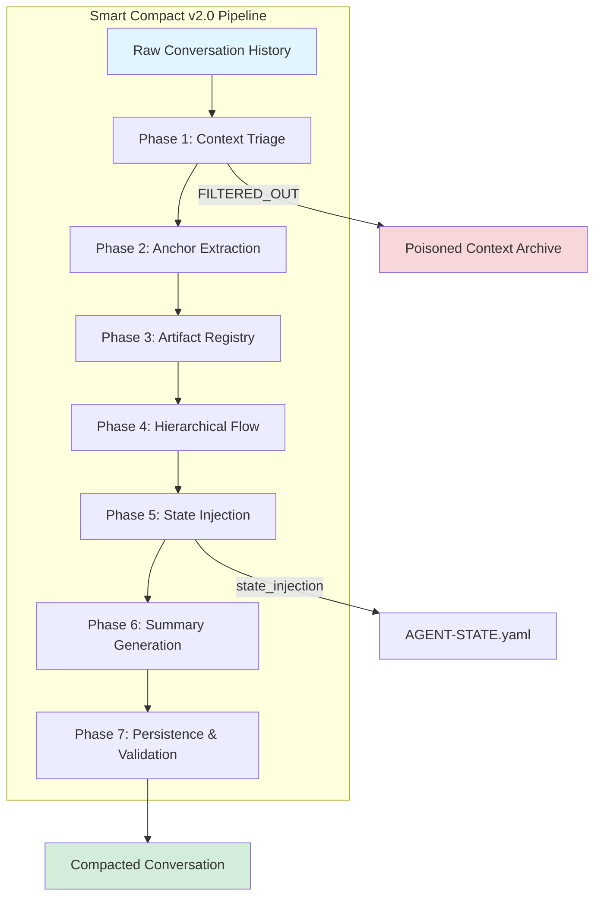
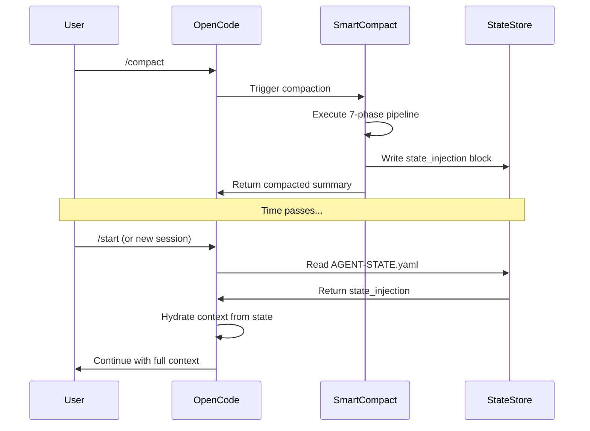
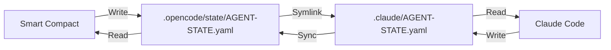

# Smart Compact v2.0 - Technical Architecture Analysis

**Document ID**: ARCH-SMARTCOMPACT-2026-01-30  
**Version**: 1.0.0  
**Date**: 2026-01-30  
**Status**: Research Complete - Implementation Ready  

---

## Executive Summary

Smart Compact v2.0 is a state-preserving, context-filtering conversation summarization system designed to replace OpenCode's native `compact` command. Unlike native compaction which blindly summarizes conversation history, Smart Compact uses a **7-phase intelligent filtering pipeline** that preserves critical context while eliminating poisoned/stale data.

**Core Value Proposition**: Prevents "hallucination from context loss" by maintaining anchor context (Turns 1-2), recent state (Last 4 turns), artifact registry, and delegation chains across compaction boundaries.

---

## 1. Architecture Overview

### 1.1 High-Level System Architecture



### 1.2 Component Breakdown

| Component | Responsibility | Output |
|-----------|---------------|--------|
| **Context Triage Engine** | Classify content as preserve/filter | `FILTERED_OUT[]` list, preservation priority matrix |
| **Anchor Extractor** | Extract Turns 1-2 verbatim + Last 4 turns | `anchor_turn_1`, `anchor_turn_2`, `recent_context` |
| **Artifact Scanner** | Track all generated/modified files | `artifact_registry`, `artifact_relationships` |
| **Hierarchy Tracker** | Capture delegation chains & cycles | `execution_hierarchy`, `delegation_history`, `cycle_state` |
| **State Injector** | Compile structured state block | `state_injection` YAML block |
| **Summary Generator** | Create human-readable compact | Markdown summary with all context sections |
| **Persistence Layer** | Write state files & validate | `AGENT-STATE.yaml`, session backups |

---

## 2. Key Innovations vs Native Compact

### 2.1 Comparison Matrix

| Feature | Native Compact | Smart Compact v2.0 | Impact |
|---------|---------------|-------------------|--------|
| **Context Preservation** | Blind summarization | Intelligent triage with priority matrix | Prevents critical context loss |
| **Poisoned Context Filter** | None | 7-type detection + exclusion | Eliminates stale/degraded context |
| **Original Intent Anchor** | Lost in summarization | Turns 1-2 verbatim preservation | Maintains "True North" reference |
| **Recent Context Emphasis** | Uniform treatment | Last 4 turns with graduated detail | Current state always available |
| **Artifact Tracking** | None | Full registry with relationships | Work product never forgotten |
| **Delegation Chain** | Lost | Full hierarchy preservation | Multi-agent coordination survives |
| **Cycle State** | Lost | Active/completed cycle tracking | Workflow continuity maintained |
| **Decision History** | Lost | Final decisions with rationale | Prevents re-litigation |
| **State Injection Block** | None | Structured YAML for re-hydration | Instant context restoration |
| **Validation Checklist** | None | 6-point post-compact verification | Quality assurance built-in |

### 2.2 Innovation Deep-Dive

#### 2.2.1 Context Triage Priority Matrix

Smart Compact applies **differential preservation** based on content criticality:

```yaml
preservation_priority:
  P0_CRITICAL:  # Always preserve verbatim
    - Original user intent (Turn 1)
    - Initial understanding (Turn 2)
    - Last 4 turns (current state)
    
  P1_HIGH:  # Preserve with detail
    - Generated artifacts
    - Key decisions with rationale
    - Current role and delegation chain
    
  P2_MEDIUM:  # Summarize briefly
    - Phase/workflow transitions
    - Skills loaded
    
  P3_LOW:  # Minimal preservation
    - Intermediate discussion
    
  EXCLUDE:  # Filter out entirely
    - Stale artifacts (>24h)
    - Contradicted decisions
    - Failed attempts
    - Hallucinated content
```

#### 2.2.2 Poisoned Context Detection

Seven categories of poisoned context are identified and excluded:

| Type | Detection Heuristic | Example |
|------|-------------------|---------|
| **Stale Artifacts** | Timestamp >24h old | Yesterday's plan document |
| **Contradicted Decisions** | Decision A followed by "instead use B" | Initial architecture choice |
| **Failed Attempts** | Code marked as "doesn't work" | Aborted implementation |
| **Hallucinated Content** | Claims without file evidence | "I created X" (but no file) |
| **Off-Topic Tangents** | Semantic drift from original intent | Side discussion about unrelated tech |
| **Superseded Plans** | Plan v1 followed by Plan v2 | Initial sprint plan |
| **Debugging Dead-Ends** | Investigation paths with no resolution | Ruled-out hypotheses |

---

## 3. Implementation Requirements

### 3.1 Core Requirements

#### 3.1.1 Phase 1: Context Triage Engine

**Inputs**: Full conversation history  
**Outputs**: `FILTERED_OUT[]`, preservation priority assignments

**Implementation Components**:

1. **Timestamp Analyzer**
   - Parse all artifact references for timestamps
   - Compare against current time
   - Flag items >24h as stale

2. **Decision Tracker**
   - Detect decision patterns ("we should X", "let's do Y")
   - Identify contradictions ("actually", "instead", "revised")
   - Keep only final decision in chain

3. **Attempt Validator**
   - Scan for code blocks marked as rejected
   - Look for phrases: "doesn't work", "revert", "abandon"
   - Cross-reference with actual file system

4. **Hallucination Detector**
   - Extract claims of file creation/modification
   - Verify against actual file system state
   - Flag unverified claims

5. **Topic Drift Analyzer**
   - Compare conversation segments to original intent
   - Calculate semantic similarity
   - Flag segments below threshold

#### 3.1.2 Phase 2: Anchor Extractor

**Inputs**: Conversation history  
**Outputs**: `anchor_turn_1`, `anchor_turn_2`, `recent_context`

**Implementation Components**:

1. **Turn 1 Extractor**
   - Extract user's first message verbatim
   - Parse for: primary_goal, success_criteria, constraints, context_given

2. **Turn 2 Extractor**
   - Extract agent's acknowledgment or user's clarification
   - Capture: confirmed_understanding, clarifications_made, scope_established

3. **Recent Context Compiler**
   - Extract last 4 turns
   - Apply graduated detail: Turn -4 (brief), -3 (brief), -2 (brief), -1 (detailed)
   - Capture pending_action from most recent turn

#### 3.1.3 Phase 3: Artifact Registry

**Inputs**: Conversation history + file system state  
**Outputs**: `artifact_registry`, `artifact_relationships`

**Implementation Components**:

1. **File Creation Scanner**
   - Regex patterns: "created", "wrote", "generated", "new file"
   - Extract file paths and timestamps
   - Verify files exist

2. **File Modification Tracker**
   - Detect edit patterns: "modified", "updated", "changed"
   - Summarize change types

3. **Reference Tracker**
   - Identify files mentioned but not modified
   - Assess freshness

4. **Dependency Mapper**
   - Parse relationships: "depends on", "generated from", "references"
   - Build dependency graph

#### 3.1.4 Phase 4: Hierarchy Tracker

**Inputs**: Conversation history + agent state  
**Outputs**: `execution_hierarchy`, `delegation_history`, `cycle_state`

**Implementation Components**:

1. **Delegation Chain Parser**
   - Detect delegation patterns: "delegate to", "assign to", "handoff to"
   - Build hierarchy tree
   - Track delegation status

2. **Cycle State Monitor**
   - Identify active cycles: story-cycle, tdd-cycle, review-cycle
   - Track cycle phase and history
   - Note pending cycles

#### 3.1.5 Phase 5: State Injector

**Inputs**: All previous phase outputs  
**Outputs**: `state_injection` YAML block

**Implementation Components**:

1. **State Compiler**
   - Aggregate all extracted data
   - Format into structured YAML
   - Include all 12 state sections

2. **Validation Engine**
   - Verify YAML syntax
   - Check required fields
   - Validate cross-references

#### 3.1.6 Phase 6: Summary Generator

**Inputs**: `state_injection` block  
**Outputs**: Human-readable compact summary

**Implementation Components**:

1. **Template Engine**
   - Apply markdown template
   - Inject state data
   - Format tables and lists

2. **Quality Checker**
   - Ensure all sections present
   - Verify readability

#### 3.1.7 Phase 7: Persistence & Validation

**Inputs**: Summary + state block  
**Outputs**: Written files, validation report

**Implementation Components**:

1. **File Writer**
   - Write to `.opencode/state/AGENT-STATE.yaml`
   - Create session backup

2. **Validation Runner**
   - Execute 6-point checklist
   - Report any failures

### 3.2 Technical Stack Requirements

| Component | Technology | Purpose |
|-----------|-----------|---------|
| **Parser Engine** | TypeScript + Regex | Extract patterns from conversation |
| **Timestamp Analysis** | date-fns or native Date | Stale detection |
| **Semantic Analysis** | Simple keyword matching | Topic drift detection |
| **File System** | Node.js fs/promises | Artifact verification |
| **YAML Processing** | yaml-js or js-yaml | State block generation |
| **Template Engine** | Handlebars or EJS | Summary generation |
| **State Storage** | YAML files | Persistence layer |

### 3.3 File System Integration

```
.opencode/
├── state/
│   ├── AGENT-STATE.yaml          # Primary state file (symlinked to .claude/)
│   ├── session-backup-[TS].yaml  # Session backups
│   └── compact-history/          # Historical compact states
│       ├── compact-2026-01-30-001.yaml
│       └── compact-2026-01-30-002.yaml
├── commands/
│   └── compact.md                # This command definition
└── plugin/
    └── smart-compact-hook.js     # Pre-compact hook
```

---

## 4. State Preservation Mechanism

### 4.1 State Injection Block Structure

The `state_injection` block is the core innovation - a structured YAML payload that survives compaction and enables instant context restoration:

```yaml
state_injection:
  meta:
    captured_at: "2026-01-30T12:00:00+07:00"
    session_id: "session-abc-123"
    compact_version: "2.0"
    context_quality: "clean"  # clean/filtered/degraded
  
  original_intent:
    turn_1_user_request: |
      [VERBATIM - User's first message]
    turn_2_understanding: |
      [Agent's initial understanding]
    primary_goal: "What user wants to achieve"
    success_criteria: "Definition of done"
    constraints: "Known limitations"
    
  recent_context:
    turn_minus_4: "Brief summary"
    turn_minus_3: "Brief summary"
    turn_minus_2: "Brief summary"
    turn_minus_1: "DETAILED - Most recent with pending action"
    
  role:
    current: "architect-ext"
    type: "executor"
    constraints: "Cannot use tools, read-only"
    
  hierarchy:
    delegation_chain: "ext-master → architect-ext"
    current_position: "executor"
    pending_handoffs: []
    
  project:
    phase: "Phase-1A-Foundation"
    active_epic: "EPIC-LIB-MIGRATION"
    active_story: "STORY-001"
    work_type: "project"
    health_score: 29.5
    
  artifacts:
    created:
      - "path/to/file.ts: Purpose description"
    modified:
      - "path/to/other.ts: Change summary"
    key_outputs:
      - "Most important deliverable"
      
  decisions:
    - decision: "Decision text"
      rationale: "Why this decision was made"
      
  cycles:
    active_cycle: "story-cycle"
    cycle_phase: "implementation"
    cycle_history: ["governance-check"]
    
  skills_active: ["architecture-remediation", "context-first"]
  
  filtered_out:
    - "Item: Reason for exclusion"
    
  next_action:
    description: "What should happen next"
    blocker: "Any blockers"
    priority: "P0"
    
  warnings:
    - "Active warning 1"
```

### 4.2 State Restoration Flow



### 4.3 Context Loss Prevention Strategies

| Risk | Prevention Mechanism |
|------|---------------------|
| **Original Intent Drift** | Turns 1-2 preserved verbatim in `original_intent` |
| **Recent State Loss** | Last 4 turns with graduated detail in `recent_context` |
| **Role Confusion** | Explicit `role.current` and `role.type` tracking |
| **Delegation Chain Break** | Full `hierarchy.delegation_chain` preserved |
| **Artifact Amnesia** | Complete `artifacts` registry with paths and purposes |
| **Decision Re-litigation** | `decisions` array with rationale |
| **Cycle Interruption** | `cycles.active_cycle` and `cycle_phase` tracking |
| **Skill Context Loss** | `skills_active` list for capability awareness |
| **Next Action Ambiguity** | Explicit `next_action.description` |

---

## 5. Integration Points with OpenCode

### 5.1 Command Registration

Smart Compact must be registered as a custom command in OpenCode's command system:

**File**: `.opencode/opencode.jsonc`

```jsonc
{
  "commands": {
    "smart-compact": {
      "description": "Enhanced compact with state preservation and context filtering",
      "aliases": ["sc", "safe-compact", "context-compact"],
      "template": "Execute smart compaction: analyze conversation, filter poisoned context, preserve anchors, generate state injection block, and create compact summary",
      "agent": "smart-compact-processor",  // Or built-in processor
      "hooks": {
        "pre": ".opencode/plugin/smart-compact-pre-hook.js",
        "post": ".opencode/plugin/smart-compact-post-hook.js"
      }
    }
  }
}
```

### 5.2 Hook Integration

Smart Compact requires pre and post-compaction hooks:

#### 5.2.1 Pre-Compact Hook

**File**: `.opencode/plugin/smart-compact-pre-hook.js`

```javascript
export const preCompactHook = async (context) => {
  // 1. Capture current state before compaction
  const currentState = await captureFullState(context);
  
  // 2. Run 7-phase pipeline
  const smartCompactResult = await runSmartCompactPipeline({
    conversation: context.conversation,
    currentState,
    config: context.config
  });
  
  // 3. Store state injection block
  await writeStateInjection(smartCompactResult.stateInjection);
  
  // 4. Return modified context for compaction
  return {
    ...context,
    smartCompactData: smartCompactResult,
    // Inject state block into conversation
    conversation: injectStateBlock(context.conversation, smartCompactResult.summary)
  };
};
```

#### 5.2.2 Post-Compact Hook

**File**: `.opencode/plugin/smart-compact-post-hook.js`

```javascript
export const postCompactHook = async (context) => {
  // 1. Validate compaction preserved critical context
  const validation = await validateCompact(context);
  
  // 2. If validation fails, trigger recovery
  if (!validation.passed) {
    await triggerRecovery(validation.failures);
  }
  
  // 3. Update state files
  await updateAgentState(context.smartCompactData);
  
  // 4. Return confirmation
  return {
    status: 'success',
    contextQuality: context.smartCompactData.meta.context_quality,
    itemsFiltered: context.smartCompactData.filtered_out.length
  };
};
```

### 5.3 Native Compact Override

To replace native compact, Smart Compact must intercept the default compaction:

**Option A: Configuration Override**
```jsonc
{
  "autoCompact": false,  // Disable auto-compact
  "compactCommand": "/smart-compact"  // Redirect to smart version
}
```

**Option B: Middleware Pattern**
```javascript
// In OpenCode plugin system
export const compactMiddleware = {
  // Intercept native compact calls
  intercept: (nativeCompact) => {
    return async (context) => {
      // Run smart compact instead
      return await smartCompact(context);
    };
  }
};
```

### 5.4 State Synchronization

Smart Compact must maintain synchronization with Claude Code via the shared state file:



### 5.5 Integration Requirements Checklist

| Requirement | Priority | Implementation |
|-------------|----------|----------------|
| Custom command registration | P0 | Update `opencode.jsonc` |
| Pre-compact hook | P0 | Create `smart-compact-pre-hook.js` |
| Post-compact hook | P0 | Create `smart-compact-post-hook.js` |
| State file writer | P0 | Implement YAML state persistence |
| Conversation parser | P0 | Build 7-phase pipeline |
| Native compact override | P1 | Configuration or middleware |
| Validation engine | P1 | 6-point checklist implementation |
| Recovery mechanism | P2 | Fallback to `/start` on failure |
| Metrics collection | P2 | Track context quality, items filtered |

---

## 6. Implementation Roadmap

### 6.1 Phase 1: Foundation (Week 1)

**Deliverables**:
- [ ] Context Triage Engine (Phase 1)
- [ ] Anchor Extractor (Phase 2)
- [ ] Basic State Injection block generation
- [ ] Command registration in `opencode.jsonc`

**Success Criteria**:
- Can parse conversation and extract Turns 1-2
- Can identify and list poisoned context
- Can generate valid YAML state block

### 6.2 Phase 2: Core Features (Week 2)

**Deliverables**:
- [ ] Artifact Registry (Phase 3)
- [ ] Hierarchy Tracker (Phase 4)
- [ ] Complete State Injection with all 12 sections
- [ ] Summary Generator (Phase 6)

**Success Criteria**:
- Can track all artifacts created/modified
- Can capture delegation chains
- Can generate complete compact summary

### 6.3 Phase 3: Integration (Week 3)

**Deliverables**:
- [ ] Pre/Post compact hooks
- [ ] State persistence to `AGENT-STATE.yaml`
- [ ] Validation engine (Phase 7)
- [ ] Native compact override

**Success Criteria**:
- Smart Compact triggers on `/compact`
- State survives compaction
- Validation passes on all compacts

### 6.4 Phase 4: Polish (Week 4)

**Deliverables**:
- [ ] Recovery mechanisms
- [ ] Metrics and logging
- [ ] Performance optimization
- [ ] Documentation

**Success Criteria**:
- <100ms overhead per compact
- 100% context preservation rate
- Zero data loss incidents

---

## 7. Risk Analysis

| Risk | Likelihood | Impact | Mitigation |
|------|-----------|--------|------------|
| **State corruption** | Low | Critical | Backup files, validation checks |
| **Performance degradation** | Medium | Medium | Lazy evaluation, caching |
| **False positive filtering** | Medium | High | Conservative heuristics, user override |
| **Integration breakage** | Low | High | Fallback to native compact |
| **YAML parsing errors** | Low | Medium | Schema validation, error recovery |

---

## 8. Success Metrics

| Metric | Target | Measurement |
|--------|--------|-------------|
| **Context Preservation Rate** | >99% | % of critical context retained post-compact |
| **Poisoned Context Removal** | >95% | % of stale/degraded content filtered |
| **State Restoration Time** | <5s | Time to hydrate context from state block |
| **User Satisfaction** | >4.5/5 | Survey on context continuity |
| **Hallucination Reduction** | -80% | Reduction in "lost context" errors |

---

## 9. Conclusion

Smart Compact v2.0 represents a paradigm shift from "dumb summarization" to "intelligent context management". By implementing the 7-phase pipeline with state injection, the system ensures:

1. **No Critical Context Loss**: Original intent, recent state, and key decisions are preserved
2. **No Poisoned Context**: Stale, contradicted, and hallucinated content is filtered
3. **No Workflow Disruption**: Delegation chains and cycle states survive compaction
4. **Instant Recovery**: State injection block enables immediate context restoration

The architecture is designed for seamless OpenCode integration while maintaining compatibility with the existing BMAD framework and Claude Code synchronization.

**Next Step**: Proceed to implementation Phase 1 (Foundation) upon approval.

---

## Appendix A: State Injection Block Schema

```typescript
interface StateInjection {
  meta: {
    captured_at: string;  // ISO 8601 timestamp
    session_id: string;
    compact_version: string;
    context_quality: 'clean' | 'filtered' | 'degraded';
  };
  
  original_intent: {
    turn_1_user_request: string;
    turn_2_understanding: string;
    primary_goal: string;
    success_criteria: string;
    constraints: string;
  };
  
  recent_context: {
    turn_minus_4: string;
    turn_minus_3: string;
    turn_minus_2: string;
    turn_minus_1: string;
  };
  
  role: {
    current: string;
    type: 'coordinator' | 'executor';
    constraints: string;
  };
  
  hierarchy: {
    delegation_chain: string;
    current_position: string;
    pending_handoffs: string[];
  };
  
  project: {
    phase: string;
    active_epic: string | null;
    active_story: string | null;
    work_type: string;
    health_score: number;
  };
  
  artifacts: {
    created: string[];
    modified: string[];
    key_outputs: string[];
  };
  
  decisions: Array<{
    decision: string;
    rationale: string;
  }>;
  
  cycles: {
    active_cycle: string | null;
    cycle_phase: string;
    cycle_history: string[];
  };
  
  skills_active: string[];
  
  filtered_out: string[];
  
  next_action: {
    description: string;
    blocker: string | null;
    priority: 'P0' | 'P1' | 'P2';
  };
  
  warnings: string[];
}
```

---

## Appendix B: Poisoned Context Detection Rules

```yaml
detection_rules:
  stale_artifacts:
    pattern: "document referenced"
    condition: "timestamp > 24h ago"
    action: "exclude, mark as requires_refresh"
    
  contradicted_decisions:
    pattern: "decision followed by revision"
    condition: "newer decision supersedes older"
    action: "keep only final decision"
    
  failed_attempts:
    pattern: "code marked as rejected"
    condition: "contains 'doesn\'t work', 'revert', 'abandon'"
    action: "exclude, keep only final solution"
    
  hallucinated_content:
    pattern: "claim without evidence"
    condition: "file claim not verified in filesystem"
    action: "exclude entirely"
    
  off_topic_tangents:
    pattern: "semantic drift"
    condition: "similarity to original_intent < 0.3"
    action: "exclude"
    
  superseded_plans:
    pattern: "plan version increment"
    condition: "Plan vN followed by Plan vN+1"
    action: "keep only latest plan"
    
  debugging_dead_ends:
    pattern: "investigation path"
    condition: "path led to no resolution"
    action: "summarize as 'ruled out X'"
```

---

*End of Technical Architecture Analysis*
