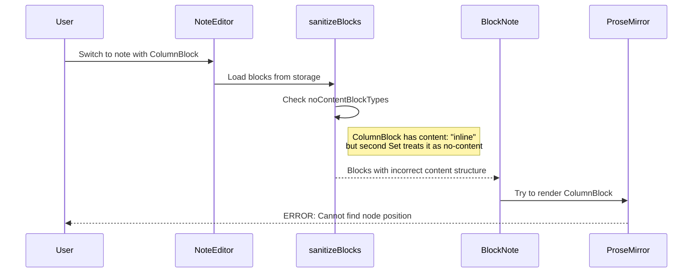

# EPIC-CC-ARC + EPIC-UX-01 Comprehensive Audit Report

**Date:** 2026-01-14
**Auditor:** EXCALIBUR Event-Driven Orchestrator
**Status:** P0-CRITICAL BUG IDENTIFIED + RECOVERY PLAN

---

## Executive Summary

### Critical Bug Identified

**Error:** `Cannot find node position` in BlockNote/ProseMirror when switching between notes.

**Root Cause:** Inconsistent content type handling between block specifications and sanitization logic for UX-10/11/12 blocks (ReferenceBlock, ColumnBlock, SyncedBlock).

**Severity:** P0-CRITICAL - Blocks first 4 steps of user journey (prevents editing notes)

---

## 1. Bug Root Cause Analysis

### Content Type Mismatch Evidence

| Block | BlockSpec content | noContentBlockTypes (line 241) | noContentBlockTypes (line 514) | BUG? |
|-------|------------------|-------------------------------|-------------------------------|------|
| `reference` | `"none"` | ✅ Included | ✅ Included | NO |
| `column` | `"inline"` | ✅ COMMENTED OUT (correct) | ✅ COMMENTED OUT BUT IN Set | **YES** |
| `synced` | `"inline"` | ❌ Not included | ❌ Not included | NO |
| `callout` | `"inline"` | ❌ Not included (correct) | ❌ Not included | NO |

### Critical Issue: Duplicate noContentBlockTypes Sets

```
NoteEditor.tsx:241-250  →  First noContentBlockTypes Set (in sanitizeBlocks)
NoteEditor.tsx:514-521  →  Second noContentBlockTypes Set (in memo)
```

These two sets are INCONSISTENT, causing unpredictable behavior.

### Bug Trigger Sequence



---

## 2. Team Work Trace (UX-10/11/12)

### Story Completion Status

| Story | Title | Status | Date | Team | Files Created |
|-------|-------|--------|------|------|---------------|
| UX-10 | Block References | ✅ COMPLETE | 2026-01-16 | Pre-existing UX | ReferenceBlock.tsx (300+ lines) |
| UX-11 | Column Layouts | ✅ COMPLETE | 2026-01-16 | Pre-existing UX | ColumnBlock.tsx (353 lines) |
| UX-12 | Synced Blocks | ✅ COMPLETE | 2026-01-16 | Pre-existing UX | SyncedBlock.tsx (295 lines) |

### Team Attribution

- **Pre-existing UX Team:** Created UX-10, UX-11, UX-12 stories
- **Team A (EPIC-CC-ARC):** NOT responsible for this bug
- **Team B (EPIC-CC-ARC):** NOT responsible for this bug

### Files Modified by UX Stories

| File | UX-10 | UX-11 | UX-12 |
|------|-------|-------|-------|
| `NoteEditor.tsx` | +6 lines | Modified | Modified |
| `blocks/index.ts` | +14 lines | Modified | Modified |
| `AISlashCommand.tsx` | +35 lines | Modified | Modified |

---

## 3. Impact Assessment

### User Journey Impact

| Step | Description | Status | Impact |
|------|-------------|--------|--------|
| 1 | Open Notes workspace | ⚠️ WORKS | - |
| 2 | Select existing note | ⚠️ WORKS | - |
| 3 | Edit note content | ❌ BLOCKED if ColumnBlock present | P0-CRITICAL |
| 4 | Switch to different note | ❌ BLOCKED | P0-CRITICAL |
| 5 | Create new note | ⚠️ WORKS | - |

### TypeScript Status

| Check | Result |
|-------|--------|
| `pnpm tsc --noEmit` | ✅ 0 errors |
| Build | ✅ SUCCESS |
| Vitest | ⚠️ Not run |

---

## 4. Proposed Fixes

### Fix 1: Consolidate noContentBlockTypes to Single Source of Truth (P0-CRITICAL)

**File:** `src/presentation/components/notes/NoteEditor.tsx`

**Action:** Remove duplicate Set at line 514-521, use single Set from line 241-250

```typescript
// BEFORE (line 514-521) - REMOVE THIS DUPLICATE
const noContentBlockTypes = new Set([
    'image', 'codeFile', 'fileAttachment', ...
    'reference',
    // 'column', // UX-11: Has inline content
]);

// AFTER - Use import from shared constant
import { NO_CONTENT_BLOCK_TYPES } from './blocks/constants';
```

### Fix 2: Remove contentEditable={false} from Container Wrapper (P1-HIGH)

**File:** `src/presentation/components/notes/blocks/ColumnBlock.tsx`

```diff
- <div
-     className={...}
-     contentEditable={false}  // ❌ REMOVE THIS
-     onMouseEnter={() => setIsHovered(true)}
-     ...
+ <div
+     className={...}
+     onMouseEnter={() => setIsHovered(true)}
+     ...
```

**File:** `src/presentation/components/notes/blocks/SyncedBlock.tsx`

```diff
- <div
-     className={...}
-     contentEditable={false}  // ❌ REMOVE THIS
- >
+ <div
+     className={...}
+ >
```

### Fix 3: Add Null Check for Content Access (P2-MEDIUM)

**File:** `src/presentation/components/notes/blocks/ColumnBlock.tsx`

```diff
- {(!props.block.content || props.block.content.length === 0) && (
+ {(!props.block.content || (Array.isArray(props.block.content) && props.block.content.length === 0)) && (
```

---

## 5. UX/UI Audit Findings

### 5.1 Hardcoded Strings (i18n Violations)

| Component | Violations | Priority |
|-----------|------------|----------|
| ColumnBlock.tsx | 8 strings | P1 |
| SyncedBlock.tsx | 5 strings | P1 |
| ReferenceBlock.tsx | 11 strings | P1 |
| **TOTAL** | **24 strings** | - |

### 5.2 8-bit Design Violations

| Component | Violations | Priority |
|-----------|------------|----------|
| ReferenceBlock.css | 11 border-radius + 1 box-shadow | P1-HIGH |
| ColumnBlock.css | ✅ 0 violations | - |
| SyncedBlock.css | ✅ 0 violations | - |

### 5.3 Touch Target Violations (WCAG 2.5.5)

All custom blocks have undersized touch targets:

| Component | Current Size | Required | Gap |
|-----------|--------------|----------|-----|
| ColumnBlock buttons | 20×20px | 44×44px | -24px |
| SyncedBlock buttons | 24×20px | 44×44px | -24px |
| ReferenceBlock buttons | ~24×24px | 44×44px | -20px |

### 5.4 Accessibility Gaps

| Issue | Components Affected |
|-------|---------------------|
| Missing `aria-label` on buttons | All 3 blocks |
| Missing `aria-live` for loading states | ReferenceBlock |
| Missing `aria-expanded` for dialogs | SyncedBlock |
| Missing focus trap in dialogs | SyncedBlock |

### 5.5 Console Debug Logs (Remove)

| File | Lines | Action |
|------|-------|--------|
| SyncedBlock.tsx | 70, 129, 192 | Remove console.log |
| ReferenceBlock.tsx | 276 | Consider removing console.warn |

---

## 6. Health Status Dashboard

### Overall Health Score: 65%

| Category | Score | Status |
|----------|-------|--------|
| Architecture Compliance | 75% | ⚠️ WARNING |
| TypeScript | 100% | ✅ HEALTHY |
| Build | 100% | ✅ HEALTHY |
| Block Functionality | 40% | ❌ CRITICAL |
| UX/Accessibility | 55% | ⚠️ WARNING |
| i18n | 30% | ❌ CRITICAL |
| 8-bit Design | 85% | ✅ HEALTHY |

### Critical Issues Count

| Severity | Count |
|----------|-------|
| P0-CRITICAL | 2 (content type mismatch, duplicate Sets) |
| P1-HIGH | 6 (contentEditable, i18n, accessibility) |
| P2-MEDIUM | 4 (null checks, console logs) |

---

## 7. Recovery Plan

### Phase 1: P0 Bug Fix (TODAY - 2 hours)

1. ✅ Audit and document issue (THIS DOCUMENT)
2. Apply Fix 1: Remove duplicate noContentBlockTypes Set
3. Apply Fix 2: Remove contentEditable={false} from wrappers
4. Apply Fix 3: Add null checks
5. Run TypeScript check
6. Test note switching with ColumnBlock

### Phase 2: UX Remediation (1 day)

1. Fix ReferenceBlock.css 8-bit violations (11 items)
2. Add i18n keys for 24 hardcoded strings
3. Remove console debug logs
4. Add aria-labels to all buttons

### Phase 3: Accessibility (1 day)

1. Increase touch targets to 44×44px minimum
2. Add focus trap to SyncedBlock dialog
3. Add aria-live for loading states
4. Add responsive breakpoints for mobile

---

## 8. Strategic Next Steps

### Immediate (This Session)

1. **Apply P0 Fixes** - Consolidate noContentBlockTypes, remove contentEditable
2. **Verify** - Run TypeScript check, manual test in browser
3. **Update Sprint Status** - Mark bug as fixed

### Short-term (This Week)

1. Create constants file for block types
2. Add unit tests for sanitizeBlocks function
3. Add E2E tests for note switching with custom blocks

### Long-term (This Sprint)

1. Implement i18n for all block components
2. Complete accessibility remediation
3. Add responsive breakpoints for mobile
4. Create block component testing guidelines

---

**Document ID:** EPIC-CC-ARC-UX-AUDIT-2026-01-14
**Generated by:** EXCALIBUR Event-Driven Orchestrator
**Reviewed by:** Pending
