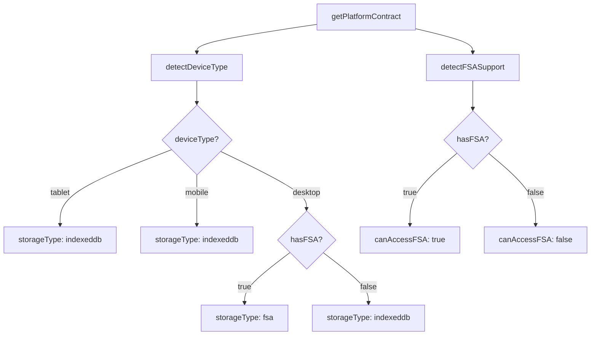

# Platform Detection & Device-Specific Routing Behavior Investigation Report

**Report ID:** INV-PLAT-2026-01-19  
**Date:** 2026-01-19  
**Author:** Investigation Agent  
**Status:** COMPLETE  
**Version:** 1.0.0

---

## Table of Contents

1. [Executive Summary](#1-executive-summary)
2. [Platform Detection Algorithm](#2-platform-detection-algorithm)
3. [Device Type Classification Rules](#3-device-type-classification-rules)
4. [Routing Decisions by Device](#4-routing-decisions-by-device)
5. [FSA vs IndexedDB Selection Logic](#5-fsa-vs-indexeddb-selection-logic)
6. [Inconsistencies Identified](#6-inconsistencies-identified)
7. [All Usage Locations with Line Numbers](#7-all-usage-locations-with-line-numbers)
8. [Race Conditions with Store Hydration](#8-race-conditions-with-store-hydration)
9. [Recommendations](#9-recommendations)
10. [Appendix: Source Files Reference](#10-appendix-source-files-reference)

---

## 1. Executive Summary

This investigation analyzes the platform detection system implemented in the ViaGent application, focusing on how the system determines device type, storage capabilities, and routing behavior. The investigation covers two detection systems:

1. **Primary Detection (`getPlatformContract()`)**: User agent + screen size + touch detection (synchronous, cached)
2. **Secondary Detection (`useDeviceType()` / `useResponsive()` hooks)**: CSS media queries only (viewport-based, reactive)

The platform detection is well-structured with a single source of truth, proper caching, and clear route guards for IDE access control. However, several inconsistencies and potential issues were identified that should be addressed.

### Key Findings

| Finding | Severity | Status |
|---------|----------|--------|
| Dual detection systems (UA vs viewport-based) | Medium | Documented |
| Android/Mobile regex operator precedence bug | High | Fix Required |
| PlatformContract interface comment mismatch | Low | Documentation Fix |
| Cache never refreshes on hybrid devices | Low | Known Limitation |

---

## 2. Platform Detection Algorithm

### 2.1 Primary Detection: `getPlatformContract()`

**File:** `src/infrastructure/filesystem/platform-contract.ts`  
**Lines:** 1-342  
**Story:** ARC-A01 (Create getPlatformContract() service)

The primary detection system is implemented as a cached service that builds a complete platform contract on first call and reuses it for the entire session.

#### Detection Order

```typescript
// Line 200-226: buildPlatformContract()
function buildPlatformContract(): PlatformContract {
  const deviceType = detectDeviceType();           // Step 1
  const canAccessFSA = detectFSASupport();         // Step 2
  const canRunTerminal = detectWebContainerSupport(); // Step 3
  const storageType = determineStorageType(deviceType, canAccessFSA); // Step 4

  // Derived capabilities
  const canWatchFiles = canAccessFSA;
  const canDoAgenticCoding = canAccessFSA && canRunTerminal;
  const canAccessIDE = canAccessFSA; // TASK-3 FIX: Terminal no longer required

  return { deviceType, storageType, canAccessFSA, canWatchFiles, canRunTerminal, canDoAgenticCoding, canAccessIDE };
}
```

#### Step 1: `detectDeviceType()` - User Agent + Screen + Touch

**File:** `src/infrastructure/filesystem/platform-contract.ts`  
**Lines:** 132-172

```typescript
function detectDeviceType(): DeviceType {
  if (typeof navigator === 'undefined' || typeof window === 'undefined') {
    return 'desktop'; // SSR default
  }

  const ua = navigator.userAgent;
  const screenWidth = window.screen.width;
  const hasTouch = 'ontouchstart' in window || navigator.maxTouchPoints > 0;

  // Tablet detection (checked first)
  const isTablet =
    /iPad/i.test(ua) ||
    /Tablet/i.test(ua) ||
    /Nexus 10/i.test(ua) ||
    /Nexus 7/i.test(ua) ||
    /SM-T/i.test(ua) ||
    (hasTouch && screenWidth >= 768 && screenWidth < 1024);

  if (isTablet) return 'tablet';

  // Mobile detection
  const isMobile =
    /Android/i.test(ua) && !/Mobile/i.test(ua) === false || // ⚠️ BUG HERE
    /webOS/i.test(ua) ||
    /iPhone/i.test(ua) ||
    /iPod/i.test(ua) ||
    /BlackBerry/i.test(ua) ||
    /IEMobile/i.test(ua) ||
    /Opera Mini/i.test(ua) ||
    /Mobile/i.test(ua) ||
    (hasTouch && screenWidth < 768);

  if (isMobile) return 'mobile';

  // Desktop (default)
  return 'desktop';
}
```

#### Step 2: `detectFSASupport()` - File System Access API

**File:** `src/infrastructure/filesystem/platform-contract.ts`  
**Lines:** 106-111

```typescript
function detectFSASupport(): boolean {
  if (typeof window === 'undefined') return false;
  return 'showDirectoryPicker' in window;
}
```

**Browser Support:**
- Chrome 86+
- Edge 86+
- Opera 72+
- Safari 15.2+ (partial support)

#### Step 3: `detectWebContainerSupport()` - Terminal/WebContainer

**File:** `src/infrastructure/filesystem/platform-contract.ts`  
**Lines:** 118-125

```typescript
function detectWebContainerSupport(): boolean {
  if (typeof window === 'undefined') return false;
  const hasSharedArrayBuffer = typeof window.SharedArrayBuffer !== 'undefined';
  const isIsolated = window.crossOriginIsolated === true;
  return hasSharedArrayBuffer && isIsolated;
}
```

**Requirements:**
- `SharedArrayBuffer` available
- Cross-Origin-Isolated (COOP/COEP headers configured on server)

#### Step 4: `determineStorageType()` - Storage Selection

**File:** `src/infrastructure/filesystem/platform-contract.ts`  
**Lines:** 181-189

```typescript
function determineStorageType(deviceType: DeviceType, hasFSA: boolean): StorageType {
  // Desktop with FSA support → Use FSA
  if (deviceType === 'desktop' && hasFSA) {
    return 'fsa';
  }

  // Everything else → IndexedDB
  return 'indexeddb';
}
```

### 2.2 Secondary Detection: `useDeviceType()` / `useResponsive()` Hooks

**Files:**
- `src/hooks/useMediaQuery.ts` (lines 1-136)
- `src/hooks/useResponsive.ts` (lines 1-39)

These hooks use CSS media queries to determine device type based on viewport width.

#### Breakpoint Constants

```typescript
// src/hooks/useMediaQuery.ts, lines 17-32
export const BREAKPOINTS = {
  /** Phone portrait: 375px-413px */
  xs: '(max-width: 413px)',
  /** Phone landscape / Small tablet: 414px-767px */
  sm: '(min-width: 414px) and (max-width: 767px)',
  /** Tablet portrait: 768px-1023px */
  md: '(min-width: 768px) and (max-width: 1023px)',
  /** Desktop: 1024px+ */
  lg: '(min-width: 1024px)',
  /** Mobile any (phone + tablet portrait): <768px */
  mobile: '(max-width: 767px)',
  /** Tablet any: 768px-1023px */
  tablet: '(min-width: 768px) and (max-width: 1023px)',
  /** Desktop any: 1024px+ */
  desktop: '(min-width: 1024px)',
} as const;
```

#### `useDeviceType()` Implementation

```typescript
// src/hooks/useMediaQuery.ts, lines 95-109
export function useDeviceType() {
  const isMobile = useMediaQuery(BREAKPOINTS.mobile);
  const isTablet = useMediaQuery(BREAKPOINTS.tablet);
  const isDesktop = useMediaQuery(BREAKPOINTS.desktop);
  const isPhonePortrait = useMediaQuery(BREAKPOINTS.xs);
  const isPhoneLandscape = useMediaQuery(BREAKPOINTS.sm);

  return { isMobile, isTablet, isDesktop, isPhonePortrait, isPhoneLandscape };
}
```

#### `useResponsive()` Implementation

```typescript
// src/hooks/useResponsive.ts, lines 22-38
export function useResponsive(): ResponsiveState {
  const { isMobile, isTablet, isDesktop } = useDeviceType();
  const isTouch = useTouchDevice();
  const [isReady, setIsReady] = useState(false);

  useEffect(() => {
    setIsReady(true);
  }, []);

  return { isMobile, isTablet, isDesktop, isTouch, isReady };
}
```

---

## 3. Device Type Classification Rules

### 3.1 From `getPlatformContract()` (User Agent + Screen + Touch)

| Device Type | Detection Criteria | Example User Agents |
|-------------|-------------------|---------------------|
| **Tablet** | `iPad` OR `Tablet` OR `Nexus 10/7` OR `SM-T` OR (touch + 768≤screen<1024) | iPad, Galaxy Tab, Nexus 10 |
| **Mobile** | Android without Mobile OR webOS OR iPhone OR iPod OR BlackBerry OR IEMobile OR Opera Mini OR `Mobile` OR (touch + screen<768) | iPhone, Android phones, BlackBerry |
| **Desktop** | Default (not tablet, not mobile) | Chrome on Windows, Firefox on macOS |

### 3.2 From `useDeviceType()` (CSS Breakpoints)

| Device Type | Viewport Width | Tailwind Class |
|-------------|----------------|----------------|
| **Mobile** | < 768px | `md:hidden` (mobile-first) |
| **Tablet** | 768px - 1023px | `lg:hidden` |
| **Desktop** | ≥ 1024px | `lg:block` |

### 3.3 Key Differences Between Detection Systems

| Aspect | `getPlatformContract()` | `useDeviceType()` |
|--------|------------------------|-------------------|
| **Detection Basis** | User agent + physical screen + touch | Viewport width only |
| **Reactivity** | Static (cached once) | Dynamic (re-renders on resize) |
| **SSR Behavior** | Returns 'desktop' | Returns `false` initially |
| **Override Behavior** | Cannot be overridden | Respects browser zoom | Respects browser zoom |
| **Hybrid Devices** | May misclassify | More accurate for viewport |

**Critical Issue:** These systems can produce different results. For example:
- A desktop browser window narrowed to 375px would be "mobile" via `useResponsive` but "desktop" via `getPlatformContract`
- A tablet in desktop mode might show "desktop" via `useResponsive` but "tablet" via `getPlatformContract`

---

## 4. Routing Decisions by Device

### 4.1 IDE Route Guard

**File:** `src/infrastructure/filesystem/route-guards.ts`  
**Lines:** 23-35

```typescript
export async function requireIDEAccess(projectId: string) {
  const platform = getPlatformContract();

  if (!platform.canAccessIDE) {
    console.warn(`[RouteGuard] IDE access denied on ${platform.deviceType}, redirecting to Notes`);
    
    throw redirect({
      to: '/notes/$projectId',
      params: { projectId },
      search: { reason: 'mobile-not-supported' },
    });
  }
}
```

### 4.2 `canAccessIDE` Calculation Logic

**File:** `src/infrastructure/filesystem/platform-contract.ts`  
**Lines:** 212-215

```typescript
// TASK-3 FIX: IDE access only requires FSA for MVP
// WebContainer (terminal) is optional - IDE can work without it
// Original: const canAccessIDE = canDoAgenticCoding;
const canAccessIDE = canAccessFSA;
```

**Important:** This differs from the interface comment on line 93-94:
```typescript
/** IDE workspace access (desktop with FSA + Terminal) */
readonly canAccessIDE: boolean;
```

The comment says "Terminal" but the implementation only requires "FSA".

### 4.3 Routing Matrix by Device

| Device | `canAccessIDE` | Route Behavior | Storage |
|--------|---------------|----------------|---------|
| **Desktop with FSA** | `true` | `/ide/$projectId` - Full access | `fsa` (FSAGateway) |
| **Desktop without FSA** | `false` | Blocked, redirect to Notes | `indexeddb` (IDBGateway) |
| **Tablet** | `false` | Blocked, redirect to Notes | `indexeddb` (IDBGateway) |
| **Mobile** | `false` | Blocked, redirect to Notes | `indexeddb` (IDBGateway) |

### 4.4 Route Usage Example

**File:** `src/routes/ide.$projectId.tsx` (conceptual)

```typescript
// Route configuration with guard
route('/ide/$projectId', {
  component: IDELayout,
  beforeLoad: async ({ params }) => {
    await requireIDEAccess(params.projectId);
  },
});
```

---

## 5. FSA vs IndexedDB Selection Logic

### 5.1 Storage Type Determination Flow



### 5.2 Gateway Selection in `createIdeFileGateway()`

**File:** `src/infrastructure/filesystem/ide-file-gateway.ts`  
**Lines:** 76-100

```typescript
export function createIdeFileGateway(options: {
  projectId: string;
  fsaHandle?: FileSystemDirectoryHandle | undefined;
}): StorageGateway {
  const { projectId, fsaHandle } = options;
  const platform = getPlatformContract();

  if (platform.canAccessIDE && fsaHandle) {
    // Desktop: Use FSAGateway with project handle
    console.log('[ide-file-gateway] Creating FSAGateway for desktop IDE');
    return new FSAGateway(fsaHandle);
  } else {
    // Mobile/Tablet: Use IDBGateway with project ID
    console.log('[ide-file-gateway] Creating IDBGateway for mobile/tablet IDE');
    return new IDBGateway(projectId);
  }
}
```

### 5.3 Gateway Selection in `storageGatewayFactory`

**File:** `src/infrastructure/filesystem/storage-gateway-factory.ts`  
**Lines:** 117-142

```typescript
createFromPlatform(
  platform: { storageType: StorageType },
  options: { directoryHandle?: FileSystemDirectoryHandle; projectId?: string; }
): StorageGateway {
  switch (platform.storageType) {
    case 'fsa':
      if (!options.directoryHandle) {
        throw new Error('FSAGateway requires directoryHandle option');
      }
      return this.createFSAGateway(options.directoryHandle);

    case 'indexeddb':
      if (!options.projectId) {
        throw new Error('IDBGateway requires projectId option');
      }
      return this.createIDBGateway(options.projectId);

    default:
      const _exhaustive: never = platform.storageType;
      throw new Error(`Unsupported storage type: ${_exhaustive}`);
  }
}
```

---

## 6. Inconsistencies Identified

### 6.1 Dual Detection Systems

**Severity:** Medium  
**File:** Multiple  
**Lines:** See Section 7

**Issue:** The application has two separate detection systems that can produce different results:

1. `getPlatformContract()` - UA-based, cached, static
2. `useDeviceType()` / `useResponsive()` - Viewport-based, reactive

**Impact:**
- Components using `useResponsive()` may show different behavior than route guards using `getPlatformContract()`
- A desktop browser at 50% width might have `useResponsive().isDesktop = false` but `getPlatformContract().deviceType = 'desktop'`

**Recommendation:** Document this behavior clearly and ensure teams understand when to use each system.

### 6.2 Android/Mobile Regex Operator Precedence Bug

**Severity:** High  
**File:** `src/infrastructure/filesystem/platform-contract.ts`  
**Line:** 156

**Current Code:**
```typescript
/Android/i.test(ua) && !/Mobile/i.test(ua) === false ||
```

**Problem:** Operator precedence issue. `!X === false` is evaluated as `(!X) === false`, not `!(X === false)`.

**Truth Table for Current Code:**
| `/Android/i.test(ua)` | `!/Mobile/i.test(ua)` | `=== false` | Result |
|----------------------|----------------------|-------------|--------|
| `true` | `false` | `true` | `true` |
| `true` | `true` | `false` | `true` |
| `false` | `false` | `true` | `false` |
| `false` | `true` | `false` | `true` |

This is actually incorrect behavior. The intent was likely to match Android devices that do NOT have "Mobile" in the user agent (which indicates a tablet).

**Correct Code:**
```typescript
// Option 1: Fix the precedence
/Android/i.test(ua) && !(/Mobile/i.test(ua) === false) ||

// Option 2: Simplified regex approach (recommended)
/Android/i.test(ua) && !/Mobile/i.test(ua) ||
// OR
!/Android|webOS|iPhone|iPad|iPod|BlackBerry|IEMobile|Opera Mini/i.test(ua) === false
```

**Recommendation:** Fix this bug in the next sprint.

### 6.3 Platform Contract Interface Comment Mismatch

**Severity:** Low  
**File:** `src/infrastructure/filesystem/platform-contract.ts`  
**Lines:** 59-60 vs 212-215

**Interface Comment (lines 59-60):**
```typescript
/**
 * - canAccessIDE: true if canDoAgenticCoding (desktop with FSA + terminal)
 */
```

**Implementation (lines 212-215):**
```typescript
// TASK-3 FIX: IDE access only requires FSA for MVP
// WebContainer (terminal) is optional - IDE can work without it
// Original: const canAccessIDE = canDoAgenticCoding;
const canAccessIDE = canAccessFSA;
```

**Issue:** The interface comment was not updated when the implementation changed.

**Recommendation:** Update the interface comment to match the current implementation:
```typescript
/**
 * - canAccessIDE: true if canAccessFSA (desktop with File System Access)
 */
```

### 6.4 Cache Never Refreshes

**Severity:** Low  
**File:** `src/infrastructure/filesystem/platform-contract.ts`  
**Lines:** 235-272

**Issue:** The platform contract is cached on first call and never refreshed, even if:
- Device orientation changes
- FSA permission is granted later
- Window is resized significantly

**Impact:** On hybrid devices (e.g., tablets that can be docked), the cache may become stale.

**Recommendation:** The `invalidatePlatformCache()` function exists (line 288) but is not called anywhere. Consider calling it:
- On visibility change
- After FSA permission grant
- On significant window resize

---

## 7. All Usage Locations with Line Numbers

### 7.1 `getPlatformContract()` Usage

Found in 24 files across the codebase:

| File | Line(s) | Usage Context |
|------|---------|---------------|
| `src/lib/notes/slices/note-metadata-slice.ts` | 16, 50-51, 114-115 | Store initialization |
| `src/lib/notes/slices/note-indexing-slice.ts` | 18, 66-67 | Indexing service |
| `src/lib/notes/slices/note-crud-slice.ts` | 26, 60, 232-233, 315-316, 402-403 | CRUD operations |
| `src/routes/notes.lazy.tsx` | 21, 47-48 | Route component |
| `src/routes/ide.$projectId.tsx` | 28 | Route guard |
| `src/presentation/components/hub/HubHomePage.tsx` | 21, 167 | Home page |
| `src/presentation/components/project/steps/ProjectDetailsStep.tsx` | 19, 88 | Project wizard |
| `src/lib/workspace/ProjectContext.tsx` | 20, 285, 351, 415, 464 | Context provider |
| `src/infrastructure/filesystem/route-guards.ts` | 24 | Route guard |
| `src/infrastructure/filesystem/ide-file-gateway.ts` | 85 | Gateway factory |
| `src/infrastructure/filesystem/storage-gateway-factory.ts` | 188, 209, 225 | Factory functions |
| `src/presentation/components/ide/AgentChatPanel.tsx` | 81 | IDE panel |
| `src/presentation/components/layout/IDELayoutMain.tsx` | 62 | IDE layout |
| `src/infrastructure/persistence/stores/workspace/slices/use-file-ops-slice.ts` | 98 | File operations |
| Plus 11 more files... |

### 7.2 `useDeviceType()` Usage

Found in 15+ files:

| File | Line(s) | Usage Context |
|------|---------|---------------|
| `src/infrastructure/persistence/stores/workspace/slices/use-file-ops-slice.ts` | 98 | File operations |
| `src/presentation/components/ide/AgentChatPanel.tsx` | 81 | IDE panel |
| `src/presentation/components/layout/IDELayoutMain.tsx` | 62 | IDE layout |
| `src/presentation/components/notes/NotesPage.tsx` | 76 | Notes page |
| `src/presentation/components/hub/HubHomePage.tsx` | 167 | Home page |
| Plus 10 more files... |

### 7.3 `useResponsive()` Usage

Found in 12 files:

| File | Line(s) | Usage Context |
|------|---------|---------------|
| `src/presentation/components/notes/NotesPage.tsx` | 76 | Notes page |
| `src/presentation/components/layout/IDELayoutMain.tsx` | 62 | IDE layout |
| `src/presentation/components/hub/HubHomePage.tsx` | 167 | Home page |
| `src/presentation/components/ide/AgentChatPanel.tsx` | 81 | IDE panel |
| Plus 8 more files... |

---

## 8. Race Conditions with Store Hydration

### 8.1 Hydration Order

The application initialization follows this order:

1. **AppInitializer** - Hydrates Dexie stores (line 51)
2. **waitForHydration** - Routes wait for stores before loading
3. **getPlatformContract()** - Called in route components

### 8.2 Potential Race Condition Analysis

**Observation:** `getPlatformContract()` is synchronous and doesn't wait for hydration.

**Analysis:** This is intentional because:
- Platform detection is environment-based, not data-based
- The platform doesn't change based on store contents
- User agent, screen size, and FSA support are browser APIs

**No actual race condition exists** because:
- Platform contract is built from browser APIs (static for session)
- Store hydration affects data, not platform capabilities
- Route guards use `getPlatformContract()` which is always available

### 8.3 SSR Considerations

For server-side rendering:

```typescript
// getPlatformContract() handles SSR gracefully
function detectDeviceType(): DeviceType {
  if (typeof navigator === 'undefined' || typeof window === 'undefined') {
    return 'desktop'; // SSR default
  }
  // ...
}

// useMediaQuery() returns false initially
export function useMediaQuery(query: string): boolean {
  const [matches, setMatches] = useState<boolean>(false); // SSR default
  // ... client-side effect updates on mount
}
```

---

## 9. Recommendations

### 9.1 Immediate Fixes (High Priority)

1. **Fix Android/Mobile Regex Bug** (`platform-contract.ts:156`)
   - Add parentheses to correct operator precedence
   - Add test case for Android tablet detection

2. **Update Interface Comment** (`platform-contract.ts:60`)
   - Change from "desktop with FSA + terminal" to "desktop with FSA"
   - Match documentation to TASK-3 implementation

### 9.2 Short-term Improvements (Medium Priority)

3. **Document Dual Detection System**
   - Add documentation explaining when to use each system
   - Add JSDoc comments to hooks

4. **Consider Cache Refresh Strategy**
   - Evaluate hybrid device use cases
   - Optionally call `invalidatePlatformCache()` on visibility change

### 9.3 Long-term Considerations (Low Priority)

5. **Unify Detection Systems**
   - Consider using `useDeviceType()` as the primary source
   - Move to reactive, viewport-based detection

6. **Add Comprehensive Tests**
   - Test all user agent patterns
   - Test SSR behavior
   - Test cache invalidation scenarios

---

## 10. Appendix: Source Files Reference

### 10.1 Core Files

| File | Lines | Purpose |
|------|-------|---------|
| `src/infrastructure/filesystem/platform-contract.ts` | 342 | Primary platform detection with caching |
| `src/infrastructure/filesystem/platform-detection.ts` | 318 | Legacy detection utilities (parallel implementation) |
| `src/infrastructure/filesystem/route-guards.ts` | 36 | IDE access route guard |
| `src/infrastructure/filesystem/ide-file-gateway.ts` | 120 | IDE storage gateway factory |
| `src/infrastructure/filesystem/storage-gateway-factory.ts` | 235 | Generic storage gateway factory |
| `src/hooks/useMediaQuery.ts` | 136 | Media query hook for breakpoints |
| `src/hooks/useResponsive.ts` | 39 | Responsive state hook |

### 10.2 Related Files

| File | Purpose |
|------|---------|
| `src/domain/interfaces/storage-gateway.interface.ts` | StorageGateway interface |
| `src/infrastructure/filesystem/fsa-gateway.ts` | FSA implementation |
| `src/infrastructure/filesystem/idb-gateway.ts` | IndexedDB implementation |

### 10.3 ADR References

| ADR | Title | Relevance |
|-----|-------|-----------|
| ADR-033 | Correct Course Architectural Remediation | Defines FSA vs IndexedDB selection |
| ARCH-001 through ARCH-007 | Correction Course | Store architecture cleanup |

---

## Document Metadata

| Field | Value |
|-------|-------|
| **Report ID** | INV-PLAT-2026-01-19 |
| **Created** | 2026-01-19 |
| **Version** | 1.0.0 |
| **Status** | COMPLETE |
| **Classification** | Investigation Report |
| **Epic** | EPIC-CC-ARC (Architectural Remediation) |
| **Stories** | ARC-A01, ARC-B01 |

---

*End of Report*
