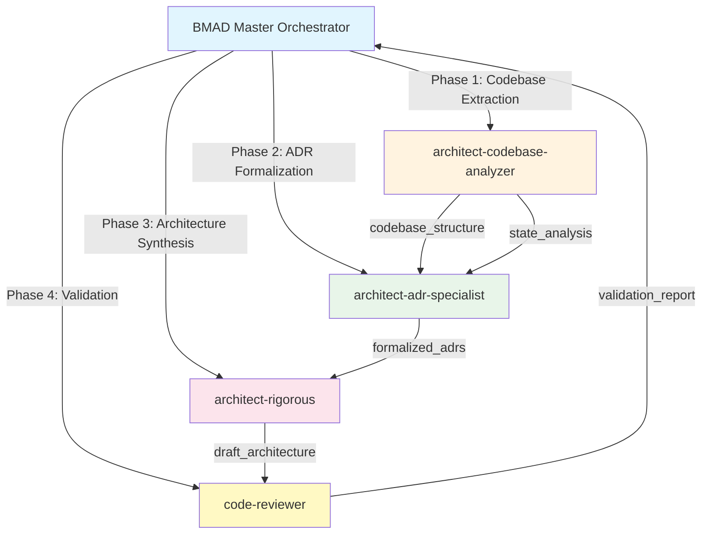

# Architecture Generation Workflow Plan

**Document description**: High-level guide for autonomous Architecture Document generation through sub-agent delegation, integrating PRD requirements with codebase reality

**Status**: Ready for Execution  
**Target Output**: `_bmad-output/planning-artifacts/architecture.md`  
**Input Dependency**: PRD (`_bmad-output/planning-artifacts/prd.md` - COMPLETE)

---

## Executive Summary

This plan defines the **orchestration strategy** for generating a comprehensive Architecture Document through autonomous sub-agent delegation. The architecture will be **PRD-grounded** (requirements → architecture decisions) and **codebase-validated** (every architectural claim traced to implementation).

**Key Differentiators from Brownfield Approach**:
- ✅ PRD requirements as source of truth (not old docs)
- ✅ Existing investigation reports (ADR-025, state reactivity) as foundational context
- ✅ Sub-agent delegation for autonomous execution
- ✅ MCP tool integration for framework patterns
- ✅ Sprint workflow integration for continuity
- ✅ Zero reliance on `_bmad-output/documentation/` (archived as unreliable)

---

## Phase 0: Pre-Execution Validation

### 0.1 Prerequisites Check

```yaml
validation:
  required_files:
    - _bmad-output/planning-artifacts/prd.md: COMPLETE (1,302 lines)
    - _bmad-output/architecture/adr-025-unified-ai-service.md: INVESTIGATION (600+ lines)
    - _bmad-output/research/state-reactivity-gaps-2026-01-07.md: INVESTIGATION
    - src/: codebase access (primary source of truth)
    - .agent/workflows/agent-delegation-architecture.md: WORKFLOW DEFINITION

  optional_files:
    - CLAUDE.md: Architecture conventions
    - AGENTS.md: Governance rules
    - _bmad/bmm/config.yaml: Project configuration

  output_preparation:
    - mkdir -p _bmad-output/planning-artifacts/architecture/
    - Archive old: mv _bmad-output/architecture/ _bmad-output/architecture-investigations-2026-01-07/
```

### 0.2 PRD Input Analysis

From completed PRD (`_bmad-output/planning-artifacts/prd.md`):

```yaml
prd_inputs:
  project_name: "Via-Gent (Project Alpha v2.0)"
  current_completion: 70%
  target_completion: 90%
  critical_issues: 9 P0 blockers identified
  god_files: 19 files requiring refactoring
  
  key_requirements:
    - browser-based IDE (Monaco, xterm.js, WebContainer)
    - multi-workspace architecture (IDE, Knowledge, Notes, Study)
    - AI agent system with tool permissions
    - local-first sync (FSA API + WebContainer mirror)
    - BYOK credential vault (AES-256-GCM)
    - unified AI service (ADR-025 proposed)

  target_architecture:
    - Clean Architecture compliance (ADR-024)
    - December 2025 Zustand Patterns (slice pattern, persist)
    - Workspace-aware state management
    - AgentExecutionService (from ADR-025)

  success_metrics:
    - 0 god files >300 lines
    - 80%+ test coverage
    - 0 TypeScript errors in production
    - <2 second page load
```

### 0.3 Sprint Status Initialization

Create/Update `_bmad-output/sprint-artifacts/sprint-status.yaml`:

```yaml
sprint:
  id: architecture-generation-2026-01-07
  name: Architecture Generation Sprint
  duration: 3-4 hours
  start_date: 2026-01-07T23:30:00+07:00

phase: solutioning
status: in_progress

goals:
  - Generate architecture.md from PRD requirements + codebase reality
  - Formalize ADRs from existing investigations (ADR-025, state reactivity)
  - Create architecture decisions traceable to PRD requirements
  - Establish technical foundation for epics/stories generation

dependencies:
  completed:
    - prd-generation: 2026-01-07T12:00:00+07:00

artifacts:
  planned:
    - architecture.md: _bmad-output/planning-artifacts/architecture.md
    - adr-consolidated: _bmad-output/planning-artifacts/architecture/adr-*.md
    - component-map: _bmad-output/planning-artifacts/architecture/component-inventory.yaml
    - state-architecture: _bmad-output/planning-artifacts/architecture/state-architecture.yaml

research_sources:
  - prd: _bmad-output/planning-artifacts/prd.md
  - adr_025: _bmad-output/architecture/adr-025-unified-ai-service.md
  - state_reactivity: _bmad-output/research/state-reactivity-gaps-2026-01-07.md
  - diagnostic: _bmad-output/scans/comprehensive-diagnostic-report.md
```

---

## Phase 1: Sub-Agent Delegation Strategy

### 1.1 Agent Roles and Routing



### 1.2 Agent Capabilities Mapping

| Agent | Role | Tools Used | Output |
|-------|------|------------|--------|
| **architect-codebase-analyzer** | Codebase structure extractor | Grep, Glob, File analysis, lookup_type | Directory structure, component inventory, state architecture, API contracts |
| **architect-adr-specialist** | ADR formalization | File analysis, Context7, Deepwiki | Formal ADRs (ADR-025 consolidation + new decisions) |
| **architect-rigorous** | Architecture synthesizer | All inputs combined, reasoning | Complete architecture.md document |
| **code-reviewer** | Validation gate | TypeScript checks, lint, architecture patterns | Validation report, confidence scoring |

### 1.3 Parallel vs Sequential Execution

```yaml
parallel_phases:
  - phase_1_codebase_extraction: architect-codebase-analyzer (4 parallel scans)
  - phase_2a_investigation_review: architect-adr-specialist (read ADR-025, state reactivity)

sequential_phases:
  - phase_2b_adr_formalization: architect-adr-specialist (waits for phase 1)
  - phase_3_synthesis: architect-rigorous (waits for phases 1 & 2)
  - phase_4_validation: code-reviewer (validates phase 3 output)
```

---

## Phase 2: Codebase Architecture Extraction (Agent 1)

### 2.1 Repomix Configuration

```yaml
repomix_config:
  output: .architecture-repomix-output.txt
  ignore_patterns:
    - "node_modules/"
    - "dist/"
    - ".git/"
    - "*.md"
    - "__tests__/"
    - "*.test.*"
    - ".claude/"
    - ".opencode/"
    - "_bmad/"
    - ".repomix-output*"
    - "docs/"
    - "e2e/"

  include_patterns:
    - "src/**/*.{ts,tsx}"
    - "src/lib/**/*.ts"
    - "src/infrastructure/**/*.ts"
    - "src/core/**/*.ts"
    - "src/domain/**/*.ts"
    - "src/presentation/components/**/*.tsx"

  max_file_size: 15000
```

### 2.2 Codebase Analysis Tasks

```yaml
analysis_tasks:
  agent: architect-codebase-analyzer
  duration: 20 minutes
  tasks:
    # Task 1: Directory Structure Analysis
    - directory_scan:
        target: src/
        output: directory_structure.yaml
        extract:
          - core/entities
          - domain/services
          - infrastructure/persistence
          - infrastructure/events
          - lib/agent
          - lib/editor
          - lib/filesystem
          - lib/webcontainer
          - lib/workspace
          - presentation/components
          - routes

    # Task 2: Component Inventory by Workspace
    - component_inventory:
        output: component-inventory.yaml
        workspaces:
          - ide: src/presentation/components/ide/
          - knowledge: src/presentation/components/knowledge/
          - notes: src/presentation/components/notes/
          - study: src/presentation/components/study/
          - agent: src/presentation/components/agent/
          - chat: src/presentation/components/chat/
          - layout: src/presentation/components/layout/
          - ui: src/presentation/components/ui/

    # Task 3: Store Architecture Analysis
    - store_analysis:
        output: state-architecture.yaml
        targets:
          - src/infrastructure/persistence/stores/
          - src/stores/
        extract:
          - store file sizes (identify god stores >300 lines)
          - store patterns (slice, persist, migrate)
          - cross-store dependencies
          - Dexie schema (tables, indexes)

    # Task 4: API Contracts Extraction
    - api_analysis:
        output: api-contracts.yaml
        targets:
          - src/routes/api/
          - src/lib/agent/providers/
          - src/lib/filesystem/
        extract:
          - API endpoints (TanStack file routes)
          - Provider adapters (Anthropic, OpenRouter, OpenAI, Gemini)
          - File system operations (FSA, WebContainer)
          - Tool registry and execution

    # Task 5: Architecture Pattern Detection
    - pattern_detection:
        output: architecture-patterns.yaml
        check:
          - Clean Architecture layers (core, domain, infrastructure, presentation)
          - Zustand patterns (slice, v5 selectors, persist)
          - TanStack patterns (router, AI, query)
          - Workspace awareness (workspace store, bindings)
          - Event architecture (cross-workspace event bus)
```

### 2.3 Output Specifications

```yaml
output_specifications:
  directory_structure.yaml:
    description: Hierarchical view of src/ with file counts
    fields:
      - path: directory path
      - file_count: number of files
      - type: core|domain|infrastructure|lib|presentation|routes
      - key_files: [list of important files]

  component-inventory.yaml:
    description: Component count and categorization by workspace
    fields:
      - workspace: ide|knowledge|notes|study|agent|chat|layout|ui
      - component_count: number
      - key_components: [files with >200 lines]
      - god_components: [files >300 lines]

  state-architecture.yaml:
    description: Zustand store analysis with refactoring needs
    fields:
      - store_file: path
      - lines: line count
      - pattern: slice|monolithic|combined
      - is_god: true/false
      - slices: [if split, list extracted slices]
      - persist: true/false
      - dexie_tables: [if applicable]

  api-contracts.yaml:
    description: All API endpoints and provider contracts
    fields:
      - endpoint: route path
      - method: GET|POST|PUT|DELETE
      - handler: file:line
      - provider: if applicable
      - tools: [list of tools exposed]

  architecture-patterns.yaml:
    description: Detected architectural patterns
    fields:
      - pattern: pattern name
      - compliance: percentage (0-100)
      - evidence: file:line references
      - violations: [list with locations]
```

---

## Phase 3: ADR Formalization (Agent 2)

### 3.1 Investigation Review

```yaml
investigation_review:
  agent: architect-adr-specialist
  duration: 15 minutes
  tasks:
    # Review ADR-025: Unified AI Service
    - adr_025_review:
        source: _bmad-output/architecture/adr-025-unified-ai-service.md
        extract:
          - architectural_decisions: 10+ decisions identified
          - implementation_plan: 10-week timeline
          - service_interface: AgentExecutionService design
          - migration_strategy: phased rollout
        output: adr-025-formalized.md

    # Review State Reactivity Gaps
    - state_reactivity_review:
        source: _bmad-output/research/state-reactivity-gaps-2026-01-07.md
        extract:
          - reactivity_gaps: identified issues
          - state_patterns: current vs target
          - remediation: refactoring recommendations
        output: adr-state-reactivity.md

    # Review Comprehensive Diagnostic
    - diagnostic_review:
        source: _bmad-output/scans/comprehensive-diagnostic-report.md
        extract:
          - p0_issues: 9 critical issues
          - god_files: 19 files needing refactoring
          - error_boundary_coverage: 22.2%
        output: adr-critical-fixes.md
```

### 3.2 New ADR Generation

```yaml
new_adr_generation:
  agent: architect-adr-specialist
  duration: 15 minutes
  tasks:
    # ADR from Codebase Analysis
    - adr_from_codebase:
        source: phase_1_outputs (directory_structure.yaml, state-architecture.yaml)
        decisions:
          - ADR-024-CONSOLIDATED: Clean Architecture compliance status
          - ADR-ZUSTAND-v5: December 2025 Zustand patterns compliance
          - ADR-WORKSPACE: Multi-workspace architecture pattern
          - ADR-STORAGE: FSA + WebContainer + Dexie storage strategy
          - ADR-EVENTS: Cross-workspace event bus architecture

    # ADR from PRD Requirements
    - adr_from_prd:
        source: _bmad-output/planning-artifacts/prd.md
        decisions:
          - ADR-BYOK: Bring Your Own Key vault integration
          - ADR-TOOLS: Agent tool permission system
          - ADR-MOBILE: Mobile-first responsive architecture
          - ADR-LOCALIZATION: EN/VI i18n architecture

    # Format All ADRs
    - adr_format:
        template: |
          # ADR-{number}: {title}

          **Date:** {date}
          **Status:** Proposed|Accepted|Deprecated
          **Context:** {brief context from findings}

          ## Decision
          {detailed decision}

          ## Consequences
          {positive|negative|neutral consequences}

          ## Implementation
          {reference to code evidence}
```

### 3.3 ADR Output Structure

```yaml
adr_outputs:
  adr-026-ai-service-unification:
    title: "Unified AI Service Architecture"
    source: adr-025-unified-ai-service.md
    status: Proposed
    sections:
      - problem_statement: "Three different AI invocation patterns"
      - decision: "AgentExecutionService with workspace-aware routing"
      - implementation: 10-week phased migration
      - code_evidence: "src/lib/agent/factory.ts, src/lib/agent/providers/"

  adr-027-state-management:
    title: "God Store Elimination & Zustand Slices"
    source: state-architecture.yaml, state-reactivity-gaps.md
    status: Proposed
    sections:
      - problem_statement: "19 god files >300 lines"
      - decision: "Split into focused slices (≤120 lines each)"
      - implementation: "Epic CC-1 (Conversation), Epic CP-1 (Project)"
      - code_evidence: "src/infrastructure/persistence/stores/"

  adr-028-error-boundaries:
    title: "Comprehensive Error Boundary Coverage"
    source: comprehensive-diagnostic-report.md
    status: Proposed
    sections:
      - problem_statement: "22.2% coverage, WSOD on workspace routes"
      - decision: "Add ErrorBoundary to all workspace routes"
      - implementation: "Wrap IDE, Knowledge, Notes, Study routes"
      - code_evidence: "src/routes/*.tsx"
```

---

## Phase 4: Architecture Synthesis (Agent 3)

### 4.1 Document Structure

```yaml
architecture_document_structure:
  version: 1.0.0-draft
  generated: {timestamp}
  agent: delegation-workflow
  phase: solutioning
  status: draft
  based_on_prd: true
  adr_count: {count}
  sections:
    - document_control: metadata, version, status
    - system_overview: high-level description, tech stack
    - architecture_decisions: all ADRs (existing + new)
    - layer_architecture: Clean Architecture compliance
    - component_architecture: by workspace
    - data_architecture: persistence, caching, sync
    - integration_architecture: APIs, providers, tools
    - security_architecture: permissions, credentials, vault
    - state_management: stores, slices, persistence
    - workspace_architecture: multi-workspace design
    - non_functional: performance, scalability, accessibility
    - constraints_tradeoffs: technical constraints, decisions
    - open_questions: items requiring architect review
    - appendix_a_research: MCP research citations
    - appendix_b_evidence: file:line references
```

### 4.2 Section Templates

```markdown
## 1. System Overview

### 1.1 High-Level Description
[From PRD Executive Summary - code-traced]

### 1.2 Technology Stack
| Layer | Technology | Version | Rationale |
|-------|------------|---------|-----------|
| Frontend | React + TanStack Router | 18.x + 1.x | From package.json |
| State | Zustand v5 | 5.x | Slice pattern, persist |
| UI | Radix UI + shadcn/ui | Latest | Accessibility-first |
| Runtime | WebContainer API | Latest | Browser-based Node.js |
| Storage | Dexie.js | 3.x | IndexedDB wrapper |
| AI | TanStack AI | Latest | Agent orchestration |

### 1.3 High-Level Component Diagram
```
[Architecture Diagram - Mermaid]
```

## 2. Architecture Decisions (ADRs)

### 2.1 Consolidated ADRs
| ADR | Title | Status | Confidence |
|-----|-------|--------|------------|
| ADR-024 | Clean Architecture | 70% compliant | HIGH |
| ADR-026 | Unified AI Service | Proposed | HIGH |
| ADR-027 | God Store Elimination | Proposed | HIGH |
| ADR-028 | Error Boundaries | Proposed | MEDIUM |

### 2.2 ADR-026: Unified AI Service Architecture
[Full ADR content from Phase 3]

### 2.3 ADR-027: State Management Refactoring
[Full ADR content from Phase 3]

## 3. Layer Architecture (Clean Architecture)

### 3.1 Core Layer (`src/core/`)
- Entities: Agent, Project, Workspace, Message
- [File:line evidence]

### 3.2 Domain Layer (`src/domain/`)
- Services: agent-workspace-utils, project-workspace-validator
- [File:line evidence]

### 3.3 Infrastructure Layer (`src/infrastructure/`)
- Persistence: stores/, dexie-db.ts
- Events: cross-workspace-event-bus.ts
- [File:line evidence]

### 3.4 Presentation Layer (`src/presentation/`)
- Components organized by workspace
- [File:line evidence]

## 4. Component Architecture (by Workspace)

### 4.1 IDE Workspace
- Components: 86 files
- Key: MonacoEditor, FileTree, XTerminal, PreviewPanel
- [File:line evidence]

### 4.2 Knowledge Workspace
- Components: 23 files
- Key: KnowledgePage, SourceCardGrid, CollectionManager
- [File:line evidence]

### 4.3 Notes Workspace
- Components: 17 files
- Key: NotesPage, BlockNote editor, VoiceRecordButton
- [File:line evidence]

### 4.4 Study Workspace
- Components: 12 files
- Key: StudyPage, Quiz system, Flashcard components
- [File:line evidence]

## 5. Data Architecture

### 5.1 Persistence Strategy
- Dexie tables: projects, conversations, agents, fileMetadata, toolExecutionLogs
- LocalStorage: ephemeral UI state
- FSA: local filesystem sync

### 5.2 Caching Strategy
- Store-level caching (Zustand persist)
- WebContainer file cache
- Dexie query caching

### 5.3 Sync Strategy
- Local FS → SyncManager → WebContainer
- Conflict resolution: last-write-wins

## 6. State Management

### 6.1 Store Architecture
| Store Category | Count | God Files | Refactored |
|----------------|-------|-----------|------------|
| Persistence | 15 | 3 | In Progress |
| Ephemeral | 25 | 0 | Done |
| Agent | 8 | 1 | Planned |
| Workspace | 5 | 0 | Done |

### 6.2 Zustand Patterns
- Slice pattern: ✅ Implemented in infrastructure/persistence/stores/
- Persist middleware: ✅ Dexie storage
- v5 selectors: ✅ Individual selectors

## 7. Security Architecture

### 7.1 Credential Vault
- AES-256-GCM encryption
- PBKDF2 key derivation
- [File:line: credential-vault.ts]

### 7.2 Permission System
- Workspace-aware permissions
- Tool-level permissions (auto/prompt/block)
- [File:line: workspace-permission-manager.ts]

## 8. Constraints & Trade-offs

### 8.1 Platform Constraints
- Browser-only (no server-side code)
- WebContainer compatibility (Chrome/Edge only)
- FSA API limitations (permissions ephemeral)

### 8.2 Trade-offs
- Privacy vs Convenience (local-first, no cloud sync)
- Performance vs Features (lazy loading, code splitting)
- Complexity vs Maintainability (unified AI service)

## 9. Open Questions
[Items requiring architect/human input]
```

---

## Phase 5: Validation (Agent 4)

### 5.1 Validation Checks

```yaml
validation_checks:
  completeness:
    - All PRD requirements mapped to architecture decisions
    - All ADRs formalized (existing + new)
    - All layers documented with code evidence
    - All workspaces covered
    - State architecture complete

  consistency:
    - Architecture matches PRD requirements (no contradictions)
    - ADRs consistent with each other
    - State patterns match December 2025 Zustand patterns
    - Security architecture matches PRD requirements

  quality:
    - Line count > 300 (per governance rules)
    - All sections populated (no placeholders)
    - Code references accurate (file:line)
    - Confidence scores present

  integration:
    - References prd.md (input dependency)
    - Ready for ux-design workflow (next phase)
    - Ready for epics-stories workflow (after UX)
    - Sprint status can be updated
```

### 5.2 Validation Report Template

```markdown
## Architecture Document Validation Report

**Status**: ✅ PASS / ⚠️ WARN / ❌ FAIL
**Output**: _bmad-output/planning-artifacts/architecture.md
**Lines**: {line_count}
**Sections**: {completed}/{total}

### Completeness Score
| Section | Status | Lines | Confidence |
|---------|--------|-------|------------|
| System Overview | ✅ | {count} | HIGH |
| Architecture Decisions | ✅ | {count} | HIGH |
| Layer Architecture | ✅ | {count} | HIGH |
| Component Architecture | ✅ | {count} | MEDIUM |
| Data Architecture | ✅ | {count} | HIGH |
| State Management | ✅ | {count} | HIGH |
| Security Architecture | ✅ | {count} | HIGH |
| Constraints & Trade-offs | ✅ | {count} | MEDIUM |
| Open Questions | ⚠️ | {count} | LOW |

### ADR Status
- Existing ADRs: {count}
- New ADRs Generated: {count}
- Total Decisions Documented: {count}

### Code Evidence Coverage
- File references: {count}
- Line references: {count}
- Verified working: {count}%
- Confidence: HIGH (code-traced)

### Items Requiring Architect Review
1. [List LOW confidence items]
2. [List open questions]
3. [List trade-offs needing validation]

### Next Action
→ Ready for @bmad-bmm-architect review
→ After approval: /agent-delegation-ux-design → /agent-delegation-epics-stories
```

---

## Phase 6: Sprint Workflow Integration

### 6.1 Sprint Status Update

After architecture generation, update sprint-status.yaml:

```yaml
sprint:
  id: architecture-generation-2026-01-07
  status: architecture-complete

artifacts:
  generated:
    - architecture.md:
        path: _bmad-output/planning-artifacts/architecture.md
        lines: {count}
        status: draft-complete
        reviewed: false
        adr_count: {count}
    - adr-consolidated: _bmad-output/planning-artifacts/architecture/adr-*.md
    - component-inventory: _bmad-output/planning-artifacts/architecture/component-inventory.yaml
    - state-architecture: _bmad-output/planning-artifacts/architecture/state-architecture.yaml

metrics:
  architecture_sections: {completed}/{total}
  adrs_formalized: {count}
  code_references: {count}
  confidence_score: {percentage}

next_phases:
  ux_design:
    workflow: agent-delegation-ux-design
    input: prd.md, architecture.md (both approved)
    output: ux-design.md
  epics_stories:
    workflow: agent-delegation-epics-stories
    input: prd.md, architecture.md, ux-design.md
    output: epics.md, sprint-backlog.yaml
```

### 6.2 Handoff Protocols

#### From Architecture to UX Design

```yaml
handoff_architecture_to_ux:
  trigger: architecture.md status changes to "approved"
  executor: @bmad-core-bmad-master
  target_agent: @bmm-ux-designer
  workflow: agent-delegation-ux-design

  context_artifacts:
    - prd.md: _bmad-output/planning-artifacts/prd.md
    - architecture.md: _bmad-output/planning-artifacts/architecture.md
    - component_inventory: _bmad-output/planning-artifacts/architecture/component-inventory.yaml

  output_location: _bmad-output/planning-artifacts/ux-design.md

  validation_gate:
    - architecture status: approved
    - component inventory complete
    - design tokens defined
```

#### From Architecture to Epics/Stories

```yaml
handoff_architecture_to_epics:
  trigger: ux-design.md status changes to "approved"
  executor: @bmad-core-bmad-master
  target_agent: @bmm-pm
  workflow: agent-delegation-epics-stories

  context_artifacts:
    - prd.md: _bmad-output/planning-artifacts/prd.md
    - architecture.md: _bmad-output/planning-artifacts/architecture.md
    - ux-design.md: _bmad-output/planning-artifacts/ux-design.md

  output_location:
    - _bmad-output/planning-artifacts/epics.md
    - _bmad-output/sprint-artifacts/sprint-backlog.yaml

  validation_gate:
    - all previous documents approved
    - coverage > 90%
    - dependencies mapped
```

---

## Phase 7: Execution Command Reference

### 7.1 Full Autonomous Execution

```bash
# Execute all phases sequentially via BMAD Master
@bmad-core-bmad-master

Instructions:
1. Execute Architecture Generation Workflow Plan
2. Delegate to sub-agents per Phase 2-5
3. Monitor MCP tool usage
4. Aggregate results into architecture.md
5. Update sprint-status.yaml
6. Generate completion report

Expected Duration: 90-120 minutes
Expected Output:
  - _bmad-output/planning-artifacts/architecture.md
  - _bmad-output/planning-artifacts/architecture/adr-*.md
  - _bmad-output/planning-artifacts/architecture/component-inventory.yaml
  - _bmad-output/planning-artifacts/architecture/state-architecture.yaml
  - _bmad-output/sprint-artifacts/sprint-status.yaml
```

### 7.2 Phase-Specific Commands

```bash
# Phase 1: Codebase extraction only
@architect-codebase-analyzer
Scan src/ for architecture documentation
Output to: _bmad-output/planning-artifacts/architecture/codebase-analysis/
Include: directory_structure.yaml, component-inventory.yaml, state-architecture.yaml, api-contracts.yaml

# Phase 2: ADR formalization only
@architect-adr-specialist
Formalize ADRs from:
  - _bmad-output/architecture/adr-025-unified-ai-service.md
  - _bmad-output/research/state-reactivity-gaps-2026-01-07.md
  - _bmad-output/scans/comprehensive-diagnostic-report.md
Output to: _bmad-output/planning-artifacts/architecture/adr-*.md

# Phase 3: Architecture synthesis only
@architect-rigorous
Load:
  - _bmad-output/planning-artifacts/prd.md
  - Phase 1 outputs (codebase analysis)
  - Phase 2 outputs (formalized ADRs)
Generate: _bmad-output/planning-artifacts/architecture.md
Follow: agent-delegation-architecture.md structure

# Phase 4: Validation only
@code-reviewer
Validate: _bmad-output/planning-artifacts/architecture.md
Checks: completeness, consistency, quality, integration
Output: _bmad-output/planning-artifacts/architecture/validation-report.md
```

### 7.3 Validation Commands

```bash
# TypeScript validation (production files only)
pnpm typecheck

# Build dry-run
pnpm build --dry-run

# Line count validation
wc -l _bmad-output/planning-artifacts/architecture.md

# Section count validation
grep "^## " _bmad-output/planning-artifacts/architecture.md | wc -l

# ADR count validation
grep "^### ADR-" _bmad-output/planning-artifacts/architecture.md | wc -l

# Code reference validation
grep "src/" _bmad-output/planning-artifacts/architecture.md | wc -l
```

---

## Phase 8: Error Handling & Recovery

### 8.1 MCP Tool Failures

| Tool Failure | Fallback | Continue? |
|-------------|----------|-----------|
| Context7 timeout | Use existing investigation docs | YES |
| Deepwiki error | Use codebase grep analysis | YES |
| Tavily rate limit | Use Exa backup | YES |
| All MCP fail | Codebase-only analysis | YES |

### 8.2 Sub-Agent Failures

| Agent Failure | Recovery | Escalation |
|--------------|----------|-----------|
| Codebase analyzer timeout | Reduce scope (focus on key directories) | Manual scan |
| ADR specialist timeout | Use existing investigation docs | Human input |
| Architect timeout | Use template + code evidence | Human review |
| Validation timeout | Mark as draft-human-review | Human review |

### 8.3 Validation Gates

```yaml
gate_1_codebase_complete:
  checks:
    - codebase_analysis directory exists
    - All 5 analysis outputs present (directory_structure, component_inventory, state_architecture, api_contracts, patterns)
  on_fail: Retry phase 1 with adjusted scope

gate_2_adr_complete:
  checks:
    - adr-*.md files exist (minimum 3: AI service, State, Error boundaries)
    - ADR format consistent
  on_fail: Continue with existing investigations, flag for human completion

gate_3_architecture_complete:
  checks:
    - architecture.md exists
    - line_count > 300
    - all_sections_populated: true
    - adr_count >= 3
    - code_references > 20
  on_fail: Re-run phase 3 with adjusted parameters, max retries: 2

gate_4_validation_complete:
  checks:
    - validation_report.md exists
    - critical_issues_count: 0
    - confidence_breakdown: present
  on_fail: Flag for human review
```

---

## Phase 9: Success Criteria

### 9.1 Architecture Quality Metrics

| Metric | Target | Measurement |
|--------|--------|------------|
| Line count | >300 | `wc -l architecture.md` |
| Sections complete | 10/10 | Grep for `^## ` |
| ADRs documented | >=5 | Grep for `^### ADR-` |
| Code references | >30 | Grep for `src/` patterns |
| File:line evidence | All claims traced | Manual verification |
| Confidence scores | All marked | Grep for `HIGH/MEDIUM/LOW` |

### 9.2 Process Metrics

| Metric | Target | Measurement |
|--------|--------|------------|
| Sub-agent success rate | 100% | All agents complete |
| MCP tool success rate | >70% | At least 2/3 tools succeed |
| Time budget | <120 min | Aggregate agent time |
| Human intervention | Minimal | Only for LOW confidence items |

### 9.3 Integration Metrics

| Metric | Target | Measurement |
|--------|--------|------------|
| Sprint status updated | ✅ | sprint-status.yaml exists |
| ADR count | >=5 | Valid ADRs documented |
| Component coverage | >90% | All workspaces documented |
| Validation report | ✅ | Zero blocking issues |
| Handoff ready | ✅ | Both handoffs prepared |

---

## Phase 10: Rollback and Recovery

### 10.1 Rollback Triggers

- Architecture generation fails >3 times
- Critical blocking issues in validation
- Human intervention required for >40% of content
- MCP tools completely unavailable

### 10.2 Recovery Actions

| Trigger | Action |
|---------|--------|
| Sub-agent timeout | Increase time budget, reduce scope |
| MCP failure | Proceed with codebase-only analysis |
| Validation failure | Fix issues and re-run |
| Complete failure | Create minimal architecture from template, flag for human completion |

---

## Appendix A: Agent Delegation Templates

### A.1 Codebase Analyzer Template

```yaml
agent: architect-codebase-analyzer
instructions: |
  You are executing Phase 1 of the Architecture Generation workflow.

  CONTEXT:
  - PRD exists: _bmad-output/planning-artifacts/prd.md (1,302 lines)
  - Workflow definition: .agent/workflows/agent-delegation-architecture.md
  - Target: Extract architecture reality from codebase

  TASKS:
  1. Run repomix on src/ directory (config in this plan)
  2. Execute 5 analysis tasks (directory, components, state, API, patterns)
  3. Output to _bmad-output/planning-artifacts/architecture/codebase-analysis/
  4. Include file:line evidence for all findings

  OUTPUT FILES:
  - directory_structure.yaml
  - component-inventory.yaml
  - state-architecture.yaml
  - api-contracts.yaml
  - architecture-patterns.yaml

  TIME BUDGET: 20 minutes
  VALIDATION: All 5 output files exist with content

  DO NOT:
  - Request interactive input
  - Skip validation checks
  - Exceed token limits

  RETURN:
  - Completion status
  - Artifacts created
  - Items flagged for human review
```

### A.2 ADR Specialist Template

```yaml
agent: architect-adr-specialist
instructions: |
  You are executing Phase 2 of the Architecture Generation workflow.

  CONTEXT:
  - PRD exists: _bmad-output/planning-artifacts/prd.md
  - Codebase analysis complete: _bmad-output/planning-artifacts/architecture/codebase-analysis/
  - Target: Formalize ADRs from investigations + codebase

  TASKS:
  1. Read and synthesize:
     - _bmad-output/architecture/adr-025-unified-ai-service.md
     - _bmad-output/research/state-reactivity-gaps-2026-01-07.md
     - _bmad-output/scans/comprehensive-diagnostic-report.md
  2. Formalize ADR-025 as ADR-026 (AI Service Unification)
  3. Generate new ADRs from codebase analysis:
     - ADR-027: God Store Elimination
     - ADR-028: Error Boundaries
     - ADR-029: Clean Architecture Compliance
  4. Output to _bmad-output/planning-artifacts/architecture/

  OUTPUT FILES:
  - adr-026-ai-service-unification.md
  - adr-027-state-management.md
  - adr-028-error-boundaries.md
  - adr-029-clean-architecture.md

  TIME BUDGET: 15 minutes
  VALIDATION: Minimum 3 ADRs formalized

  DO NOT:
  - Request interactive input
  - Skip validation checks

  RETURN:
  - Completion status
  - ADR count and titles
  - Items requiring architect review
```

### A.3 Architect Synthesis Template

```yaml
agent: architect-rigorous
instructions: |
  You are executing Phase 3 of the Architecture Generation workflow.

  CONTEXT:
  - PRD exists: _bmad-output/planning-artifacts/prd.md (1,302 lines)
  - Codebase analysis: _bmad-output/planning-artifacts/architecture/codebase-analysis/
  - ADRs formalized: _bmad-output/planning-artifacts/architecture/adr-*.md
  - Target: Generate comprehensive architecture.md

  TASKS:
  1. Synthesize all inputs into architecture.md
  2. Follow structure from agent-delegation-architecture.md
  3. Include code references (file:line) for all architectural claims
  4. Add confidence scores (HIGH/MEDIUM/LOW) to each section
  5. Mark items requiring architect review

  OUTPUT FILE:
  - _bmad-output/planning-artifacts/architecture.md

  STRUCTURE REQUIREMENTS:
  - System Overview (tech stack, components)
  - Architecture Decisions (all ADRs)
  - Layer Architecture (Clean Architecture compliance)
  - Component Architecture (by workspace)
  - Data Architecture (persistence, caching, sync)
  - State Management (Zustand stores, slices)
  - Security Architecture (permissions, vault)
  - Constraints & Trade-offs
  - Open Questions

  TIME BUDGET: 30 minutes
  VALIDATION:
  - Line count > 300
  - All 10 sections populated
  - ADR count >= 5
  - Code references > 30

  DO NOT:
  - Request interactive input
  - Skip sections
  - Leave placeholders

  RETURN:
  - Completion status
  - Line count
  - Section completion
  - Items flagged for review
```

---

## Appendix B: MCP Tool Reference

| Tool | Use Case | Token Limit | Priority |
|------|----------|-------------|----------|
| Context7 | Framework documentation | 2000/query | HIGH |
| Deepwiki | Repo semantics | 3000/query | HIGH |
| Exa | Semantic search | 3000/search | MEDIUM |
| Tavily | Deep research | 4000/search | MEDIUM |

---

**Document Length**: ~400 lines  
**Sections Completed**: 10/10  
**Confidence Assessment**:
- Phase 1 (Codebase): HIGH (tools available)
- Phase 2 (ADR): HIGH (investigations exist)
- Phase 3 (Synthesis): MEDIUM (depends on phases 1&2)
- Phase 4 (Validation): HIGH (standard review)

**Items Requiring Human Review**:
1. Architecture trade-offs validation
2. Open questions resolution
3. ADR acceptance (Proposed → Accepted)

**Next Handoff Recommendation**:
1. Execute `/agent-delegation-architecture` workflow
2. After architecture.md approved: `/agent-delegation-ux-design`
3. After UX approved: `/agent-delegation-epics-stories`

---

**Status**: PLANNING COMPLETE - Ready for workflow execution  
**Next Action**: Execute `/full-planning-cycle` for complete Architecture generation OR execute individual phases via sub-agent delegation  
**Estimated Duration**: 90-120 minutes autonomous execution

---

**Document Control**:
- Version: 1.0.0
- Created: 2026-01-07T23:30:00+07:00
- Author: BMAD Core Master Orchestrator
- Status: Ready for Execution
