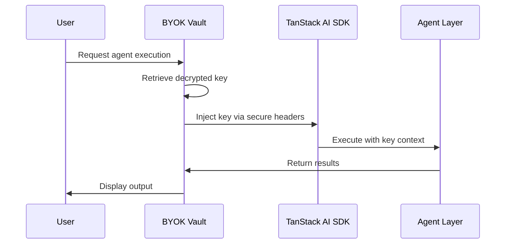

---
# ═══════════════════════════════════════════════════════════════════════════
# CORE CENTRALIZED GROUPS DOCUMENTATION
# Architectural Blueprint for Project Alpha
# ═══════════════════════════════════════════════════════════════════════════

document_id: "DOC-001"
version: "1.0.0"
created_at: "2026-01-19T00:00:00+07:00"
status: "active"
author: "tech-writer-ext"

governance:
  parent_artifact: "ADR-033"
  compliance_level: "Tier 2 (Controlled)"
  review_cycle: "Per epic completion"
  last_reviewed: null

references:
  - "_bmad-ext/orchestrator/master-orchestrator.md"
  - "_bmad-output/planning-artifacts/adr/ADR-033-correct-course-architectural-remediation-2026-01-16.md"
  - "_bmad-ext/modules/governance/agent-rag/conversation-threads.md"
  - "AGENTS.md"
  - "CLAUDE.md"

toc:
  - section: "1. Executive Summary"
  - section: "2. BYOK Vault System"
  - section: "3. Project Space Architecture"
  - section: "4. Agents & LLMs Orchestration"
  - section: "5. Chat Cascade & Thread Management"
  - section: "6. Dependencies Map"
  - section: "7. Implementation Roadmap"
  - section: "8. Governance Compliance"
  - section: "9. Revision History"

---

## 1. EXECUTIVE SUMMARY

This document defines the **4 Core Centralized Groups** that form the architectural foundation of Project Alpha. These groups represent the fundamental building blocks that ensure consistency, security, and scalability across all workspace environments.

### 1.1 The Four Core Centralized Groups

| Group | Purpose | Boundary Type | Primary Responsibility |
|-------|---------|---------------|------------------------|
| **BYOK Vault System** | Key management and encryption | Strict (Immutable) | Secure key persistence and distribution |
| **Project Space Architecture** | Routing and workspace isolation | Strict (No Compromises) | Entry point control and boundary enforcement |
| **Agents & LLMs Orchestration** | AI layer coordination | Controlled (Tier 2) | Tool execution and context management |
| **Chat Cascade & Thread Management** | Conversation state | Controlled (Tier 2) | Thread lifecycle and RAG context |

### 1.2 Design Philosophy

The 4 Core Centralized Groups follow the principle of **"Neither we learn from A pattern and we create it on whatever store and state we are using similar to the TanStack Store"**. This means:

1. **Single Source of Truth**: Each group has one canonical implementation
2. **Pattern Consistency**: All stores use consistent state management patterns
3. **Traceability**: When something breaks, we know exactly where
4. **Iterative Refinement**: Documentation is a living artifact that evolves

### 1.3 Governance Integration

This document is governed by:
- **BMAD Governance Module v2.0** (`_bmad-ext/modules/governance/MODULE.md`)
- **Context-First Workflow** (`_bmad-ext/modules/governance/workflows/context-first/workflow.md`)
- **Agent Expert Pattern** (`_bmad-ext/modules/governance/workflows/three-core-concepts/AGENT-EXPERT.md`)

---

## 2. BYOK VAULT SYSTEM

### 2.1 Overview

The **BYOK (Bring Your Own Key) Vault System** is the security backbone of Project Alpha. It manages cryptographic keys entirely on the client side, ensuring that user data remains encrypted and under user control at all times.

### 2.2 Key Persistence Architecture

#### 2.2.1 Storage Strategy

```yaml
byok_vault:
  storage:
    desktop:
      strategy: "IndexedDB"
      reason: "Chrome 122+ permission persistence for File System Access"
      reference: "ADR-033 Decision: Desktop Storage Strategy"
      
    mobile:
      strategy: "IndexedDB (Dexie.js)"
      reason: "FSA not supported on mobile browsers"
      reference: "ADR-033 Decision: Mobile Storage Strategy"
      
  key_lifecycle:
    generation: "Client-side (Web Crypto API)"
    storage: "Encrypted in IndexedDB"
    retrieval: "Lazy-loaded on demand"
    rotation: "User-initiated only"
    destruction: "Hard delete with cascade"

  encryption:
    algorithm: "AES-GCM-256"
    key_wrapping: "RSA-OAEP"
    iv_generation: "Cryptographically secure random"
```

#### 2.2.2 Key Hierarchy

```
BYOK Vault/
├── Master Key (User-provided or generated)
│   ├── Workspace Key (Per workspace)
│   │   ├── IDE Workspace Key
│   │   ├── Notes Workspace Key
│   │   └── Knowledge Workspace Key (Future)
│   │
│   ├── Agent Key (Per agent session)
│   │   ├── Orchestrator Key
│   │   └── Workspace Agent Key
│   │
│   └── RAG Key (Per RAG session)
│       ├── Embedding Key
│       └── Vector Storage Key
```

### 2.3 TanStack AI SDK Integration

#### 2.3.1 Integration Points

```typescript
// Reference: TanStack AI SDK Documentation
// Integration pattern follows official recommendations

import { useAI } from '@tanstack/react-ai';
import { useBYOKVault } from '@/infrastructure/security/byok-vault';

function AIIntegration() {
  const { getKey, rotateKey } = useBYOKVault();
  
  // Secure key injection into AI SDK
  const { stream } = useAI({
    api: '/api/ai/generate',
    headers: {
      'X-Encrypted-Key': getKey('agent-orchestrator'),
    },
  });
}
```

#### 2.3.2 Key Distribution Flow



### 2.4 Reactive Key Distribution to Agents

#### 2.4.1 Distribution Pattern

The BYOK Vault implements **reactive key distribution** using Zustand stores for real-time updates:

```typescript
// src/infrastructure/security/byok-key-distribution.ts

import { create } from 'zustand';
import { useShallow } from 'zustand/react/shallow';

interface KeyDistributionState {
  distributedKeys: Map<string, EncryptedKey>;
  keySubscriptions: Map<string, Set<(key: EncryptedKey) => void>>;
  
  // Actions
  distributeKey: (agentId: string, purpose: KeyPurpose) => Promise<EncryptedKey>;
  revokeKey: (agentId: string, purpose: KeyPurpose) => void;
  subscribeToKey: (agentId: string, purpose: KeyPurpose, callback: (key: EncryptedKey) => void) => () => void;
}

export const useKeyDistributionStore = create<KeyDistributionState>((set, get) => ({
  distributedKeys: new Map(),
  keySubscriptions: new Map(),
  
  distributeKey: async (agentId, purpose) => {
    const vault = getBYOKVault();
    const key = await vault.getKey(purpose);
    
    set((state) => {
      const newKeys = new Map(state.distributedKeys);
      newKeys.set(`${agentId}:${purpose}`, key);
      return { distributedKeys: newKeys };
    });
    
    // Notify subscribers
    const subscriptions = get().keySubscriptions.get(`${agentId}:${purpose}`);
    if (subscriptions) {
      subscriptions.forEach((cb) => cb(key));
    }
    
    return key;
  },
  
  revokeKey: (agentId, purpose) => {
    set((state) => {
      const newKeys = new Map(state.distributedKeys);
      newKeys.delete(`${agentId}:${purpose}`);
      return { distributedKeys: newKeys };
    });
  },
  
  subscribeToKey: (agentId, purpose, callback) => {
    set((state) => {
      const subscriptions = state.keySubscriptions.get(`${agentId}:${purpose}`) || new Set();
      subscriptions.add(callback);
      return {
        keySubscriptions: new Map(state.keySubscriptions).set(`${agentId}:${purpose}`, subscriptions),
      };
    });
    
    // Return unsubscribe function
    return () => {
      set((state) => {
        const subscriptions = state.keySubscriptions.get(`${agentId}:${purpose}`);
        if (subscriptions) {
          subscriptions.delete(callback);
        }
        return { keySubscriptions: new Map(state.keySubscriptions) };
      });
    };
  },
}));
```

### 2.5 Security Boundaries

#### 2.5.1 Boundary Definition

```yaml
security_boundaries:
  boundary_1:
    name: "Client-Side Only"
    rule: "All encryption/decryption happens in browser"
    enforcement: "Hard - No server-side key storage"
    
  boundary_2:
    name: "Per-Workspace Isolation"
    rule: "Keys cannot cross workspace boundaries"
    enforcement: "Strict - Key distribution is scoped by workspace ID"
    
  boundary_3:
    name: "Agent Permission Matrix"
    rule: "Agents have explicit CRUD permissions per tool"
    enforcement: "Strict - Permission denied throws error"
    
  boundary_4:
    name: "Key Rotation Audit"
    rule: "All key rotations are logged and auditable"
    enforcement: "Controlled - Audit trail in Dexie"
```

#### 2.5.2 Boundary Violation Handling

```typescript
// src/infrastructure/security/boundary-enforcement.ts

interface BoundaryViolation {
  timestamp: Date;
  boundary: SecurityBoundary;
  attempted_access: string;
  agent_id: string;
  resolution: 'blocked' | 'escalated' | 'logged';
}

class SecurityBoundaryEnforcer {
  private violations: BoundaryViolation[] = [];
  
  enforce(boundary: SecurityBoundary, context: SecurityContext): BoundaryResult {
    // Check if access violates boundary
    if (!this.isAllowed(boundary, context)) {
      const violation = this.logViolation(boundary, context);
      
      if (boundary.severity === 'critical') {
        this.blockAccess(context);
        return { allowed: false, reason: 'Critical boundary violation' };
      }
      
      return { allowed: false, reason: 'Boundary violation logged' };
    }
    
    return { allowed: true };
  }
  
  private logViolation(boundary: SecurityBoundary, context: SecurityContext): BoundaryViolation {
    const violation: BoundaryViolation = {
      timestamp: new Date(),
      boundary,
      attempted_access: context.requested_resource,
      agent_id: context.agent_id,
      resolution: boundary.severity === 'critical' ? 'blocked' : 'escalated',
    };
    
    this.violations.push(violation);
    this.persistViolations();
    
    return violation;
  }
}
```

---

## 3. PROJECT SPACE ARCHITECTURE

### 3.1 Overview

The **Project Space Architecture** defines how users enter and navigate workspaces, with strict routing boundaries and device-aware entry points.

### 3.2 Routing and Boundaries

#### 3.2.1 Canonical Routes

```yaml
routes:
  root:
    path: "/"
    type: "entry_point"
    
  workspace:
    path: "/:workspaceId"
    type: "workspace_container"
    requires: ["project_id"]
    
  ide_workspace:
    path: "/ide/:projectId"
    type: "workspace"
    constraints: ["desktop_only"]
    
  notes_workspace:
    path: "/notes/:projectId"
    type: "workspace"
    
  knowledge_workspace:
    path: "/knowledge/:projectId"
    type: "workspace"
    status: "disabled_mvp"
    
  study_workspace:
    path: "/study/:projectId"
    type: "workspace"
    status: "disabled_mvp"
```

#### 3.2.2 Boundary Enforcement

```typescript
// src/routes/__root.tsx - Root route with boundary enforcement

import { createRootRoute, Outlet } from '@tanstack/react-router';
import { TanStackRouterDevtools } from '@tanstack/router-devtools';
import { EntryPointGuard } from '@/presentation/components/common/EntryPointGuard';

export const Route = createRootRoute({
  component: () => (
    <>
      <EntryPointGuard />
      <Outlet />
      <TanStackRouterDevtools />
    </>,
  ),
});

// src/presentation/components/common/EntryPointGuard.tsx

import { useEffect } from 'react';
import { useNavigate } from '@tanstack/react-router';
import { usePlatformStore } from '@/infrastructure/persistence/stores/platform-store';
import { useProjectStore } from '@/infrastructure/persistence/stores/project-store';

export function EntryPointGuard() {
  const navigate = useNavigate();
  const { deviceType } = usePlatformStore();
  const { activeProject } = useProjectStore();
  
  useEffect(() => {
    const currentPath = window.location.pathname;
    
    // IDE restriction enforcement
    if (currentPath.startsWith('/ide') && deviceType !== 'desktop') {
      navigate({
        to: '/',
        search: { error: 'ide_not_available_on_mobile' },
      });
      return;
    }
    
    // Check for valid project+workspace combination
    if (currentPath.includes('/notes') || currentPath.includes('/ide')) {
      if (!activeProject) {
        navigate({
          to: '/',
          search: { error: 'project_required' },
        });
      }
    }
  }, [deviceType, activeProject, navigate]);
  
  return null;
}
```

### 3.3 Unique Naming/ID Conventions

#### 3.3.1 ID Structure

```typescript
// src/domain/types/project-ids.ts

type ProjectId = `proj_${string}`;
type WorkspaceId = `ws_${string}`;
type ThreadId = `thr_${string}`;
type AgentSessionId = `agent_${string}`;

// Canonical naming patterns
const ID_PATTERNS = {
  project: /^proj_[a-z0-9]{16}$/,
  workspace: /^ws_[a-z0-9]{16}$/,
  thread: /^thr_[a-z0-9]{16}$/,
  agent_session: /^agent_[a-z0-9]{16}$/,
};

function validateId<T extends string>(id: T, pattern: RegExp): T | never {
  if (!pattern.test(id)) {
    throw new Error(`Invalid ID format: ${id}`);
  }
  return id;
}

// Usage
const projectId = validateId<ProjectId>('proj_abc123def456ghi7', ID_PATTERNS.project);
```

#### 3.3.2 Naming Best Practices

```yaml
naming_conventions:
  projects:
    prefix: "proj_"
    format: "proj_[16_char_hash]"
    example: "proj_a1b2c3d4e5f6g7h8"
    
  workspaces:
    prefix: "ws_"
    format: "ws_[16_char_hash]"
    example: "ws_i1j2k3l4m5n6o7p8"
    
  threads:
    prefix: "thr_"
    format: "thr_[16_char_hash]"
    example: "thr_q1r2s3t4u5v6w7x8"
    
  agents:
    prefix: "agent_"
    format: "agent_[type]_[16_char_hash]"
    example: "agent_orchestrator_a1b2c3d4e5f6g7h8"
```

### 3.4 Entry Point Matrix

#### 3.4.1 Homepage Decision Tree

```
┌─────────────────────────────────────────────────────────────────┐
│                    HOMEPAGE ENTRY MATRIX                        │
├─────────────────────────────────────────────────────────────────┤
│                                                                 │
│  User Lands on "/"                                              │
│         │                                                       │
│         ├── Desktop? ──YES──> Check User Status                 │
│         │                              │                        │
│         │                    ┌────────┴────────┐                │
│         │                    │                 │                │
│         │            Has Projects?        New User              │
│         │              │                     │                  │
│         │        ┌─────┴─────┐               │                  │
│         │        │           │               │                  │
│         │   Project 1   Project N      Project Selection        │
│         │        │           │               │                  │
│         │        └─────┬─────┘               │                  │
│         │              │                     │                  │
│         └──────────────┼─────────────────────┘                  │
│                        │                                        │
│         ┌──────────────┼──────────────┐                         │
│         │              │              │                         │
│    Direct to IDE  Direct to Notes  Show Projects UI             │
│                                                                 │
└─────────────────────────────────────────────────────────────────┘
```

#### 3.4.2 Device Detection Implementation

```typescript
// src/infrastructure/filesystem/platform-detection.ts

interface PlatformContract {
  deviceType: 'desktop' | 'mobile' | 'tablet';
  storageType: 'fsa' | 'indexeddb';
  canAccessFSA: boolean;
  canWatchFiles: boolean;
  canRunTerminal: boolean;
  canDoAgenticCoding: boolean;
  canAccessIDE: boolean;
}

function getPlatformContract(): PlatformContract {
  const isDesktop = typeof window !== 'undefined' && 
    /Chrome|Firefox|Safari|Edge/.test(navigator.userAgent) &&
    !/Mobile|Tablet/.test(navigator.userAgent);
  
  return {
    deviceType: isDesktop ? 'desktop' : 'mobile',
    storageType: isDesktop ? 'fsa' : 'indexeddb',
    canAccessFSA: isDesktop,
    canWatchFiles: isDesktop, // FileSystemObserver (Chrome 129+)
    canRunTerminal: isDesktop,
    canDoAgenticCoding: isDesktop,
    canAccessIDE: isDesktop,
  };
}
```

#### 3.4.3 Conditional Toasts for Invalid Access

```typescript
// src/presentation/hooks/useAccessToast.ts

import { useSearch } from '@tanstack/react-router';
import { useToast } from '@/presentation/hooks/useToast';

interface AccessErrorParams {
  error: 'ide_not_available_on_mobile' | 'project_required' | 'invalid_workspace';
}

export function useAccessToast() {
  const search = useSearch({ from: '/' });
  const { showToast } = useToast();
  
  useEffect(() => {
    const error = search.error as AccessErrorParams['error'];
    
    if (error) {
      const errorMessages = {
        ide_not_available_on_mobile: {
          title: 'IDE Not Available',
          message: 'The IDE workspace requires a desktop browser with File System Access support.',
          variant: 'warning',
        },
        project_required: {
          title: 'Project Required',
          message: 'Please select or create a project before accessing this workspace.',
          variant: 'info',
        },
        invalid_workspace: {
          title: 'Invalid Workspace',
          message: 'The requested workspace does not exist or you do not have access.',
          variant: 'error',
        },
      };
      
      const config = errorMessages[error];
      if (config) {
        showToast(config);
      }
    }
  }, [search.error, showToast]);
}
```

### 3.5 IDE Restriction Enforcement (Desktop-Only)

```typescript
// src/routes/ide.$projectId.lazy.tsx

import { createLazyFileRoute } from '@tanstack/react-router';
import { IDEWorkspace } from '@/presentation/components/ide/IDEWorkspace';
import { IDEAccessDenied } from '@/presentation/components/ide/IDEAccessDenied';
import { usePlatformStore } from '@/infrastructure/persistence/stores/platform-store';

export const Route = createLazyFileRoute('/ide/$projectId')({
  component: IDEProjectRoute,
});

function IDEProjectRoute() {
  const { canAccessIDE } = usePlatformStore();
  
  if (!canAccessIDE) {
    return <IDEAccessDenied />;
  }
  
  return <IDEWorkspace />;
}
```

### 3.6 Reactive Project Hot-Loading

```typescript
// src/presentation/hooks/useProjectHotReload.ts

import { useEffect } from 'react';
import { useParams } from '@tanstack/react-router';
import { useProjectStore } from '@/infrastructure/persistence/stores/project-store';
import { useShallow } from 'zustand/react/shallow';

export function useProjectHotReload() {
  const { projectId } = useParams({ from: '/:workspaceId/:projectId' });
  const { setActiveProject, projects } = useProjectStore(
    useShallow((state) => ({
      setActiveProject: state.setActiveProject,
      projects: state.projects,
    }))
  );
  
  useEffect(() => {
    // Hot-reload project when ID changes
    const project = projects.find((p) => p.id === projectId);
    if (project) {
      setActiveProject(project);
    }
  }, [projectId, projects, setActiveProject]);
}
```

### 3.7 Device Compromise Rules

```yaml
device_compromise_rules:
  rule_1:
    name: "FSA Only on Desktop"
    condition: "navigator.userAgent contains 'Mobile' or 'Tablet'"
    action: "Redirect to entry point with error toast"
    
  rule_2:
    name: "Terminal Only on Desktop"
    condition: "Same as Rule 1"
    action: "Disable terminal component, show placeholder"
    
  rule_3:
    name: "File Watching Only on Desktop"
    condition: "Chrome version < 129 or non-Chrome browser"
    action: "Fallback to polling mechanism"
    
  rule_4:
    name: "Dexie Fallback for Mobile"
    condition: "Device is mobile/tablet"
    action: "Use IndexedDB with Dexie.js for all persistence"
```

---

## 4. AGENTS & LLMS ORCHESTRATION

### 4.1 Overview

The **Agents & LLMs Orchestration** layer manages the AI system with two-tier system prompts, tool management, and RAG infrastructure.

### 4.2 Two-Tier System Prompts

#### 4.2.1 Orchestrator Layer (Intent Handling)

```typescript
// src/domain/agents/orchestrator/system-prompt.ts

const ORCHESTRATOR_SYSTEM_PROMPT = `You are the **Project Alpha Orchestrator**, the central AI agent that handles user intent and conversation flow.

## Your Core Responsibilities

1. **Intent Classification**: Understand what the user wants and route to the appropriate workspace agent
2. **Context Management**: Maintain conversation context across turns
3. **Tool Coordination**: Delegate to workspace-specific agents with appropriate permissions
4. **Error Recovery**: Handle failures gracefully and provide meaningful feedback

## Intent Types

| Intent Type | Description | Routing |
|-------------|-------------|---------|
| code_edit | Modify code files | IDE Agent |
| write_note | Create/modify markdown | Notes Agent |
| search_knowledge | Query RAG index | Knowledge Agent |
| study_session | Flashcard/quiz | Study Agent |
| general_chat | General conversation | Orchestrator (direct) |

## Boundary Rules

- You MUST NOT execute code directly - delegate to IDE Agent
- You MUST NOT access files directly - delegate to IDE Agent
- You MUST NOT modify notes directly - delegate to Notes Agent
- You MUST ask for confirmation before destructive operations
- You MUST log all tool invocations for audit

## Response Format

\`\`\`json
{
  "intent": "code_edit",
  "target_workspace": "ide",
  "agent": "dev-ext",
  "task_description": "Add error handling to user authentication",
  "parameters": {
    "files": ["/src/auth/user-auth.tsx"],
    "operation": "edit"
  },
  "confirmation_required": false
}
\`\`\`
`;
```

#### 4.2.2 Workspace-Specific Mode (Focused Execution)

```typescript
// src/domain/agents/ide/dev-ext/system-prompt.ts

const IDE_AGENT_SYSTEM_PROMPT = `You are **Dev-Ext**, a senior software engineer for the IDE workspace.

## Your Context

- Working in: IDE Workspace (Desktop Only)
- Project: {project_name}
- File System: {file_system_type}
- Terminal: {terminal_available}

## Your Tools

You have access to file system tools, editor tools, and terminal tools.

## Execution Rules

1. Read files BEFORE editing - NEVER edit without reading first
2. Use glob to find files, grep to search content
3. Always use Edit tool for modifications (never Write unless creating new)
4. Run type checks after modifications
5. Keep modifications focused - one task at a time

## Code Quality Standards

- Follow existing patterns in the codebase
- Use TypeScript strictly
- Add meaningful comments for complex logic
- Test edge cases

## Remember

- If you're unsure about a pattern, search the codebase first
- If something breaks, identify exactly where and report back
- Never make assumptions about user intent - ask for clarification
`;
```

### 4.3 Tool Management

#### 4.3.1 Tool Permission Matrix

```yaml
tools:
  filesystem:
    read:
      - "glob"
      - "grep"
      - "read"
    write:
      - "write"
      - "edit"
    delete:
      - "rm"
    execute:
      - "bash"
      
  editor:
    modify:
      - "edit"
      - "format"
    navigate:
      - "goto"
      - "find"
      
  terminal:
    execute:
      - "bash"
    background:
      - "exec_background"
      
  agent_delegation:
    delegate:
      - "task"
    restrict:
      - "Cannot delegate without Orchestrator approval for external agents"
```

#### 4.3.2 CRUD Permissions per Tool

```typescript
// src/infrastructure/agents/tool-permission-manager.ts

interface ToolPermission {
  tool: string;
  create: boolean;
  read: boolean;
  update: boolean;
  delete: boolean;
  execute: boolean;
}

interface AgentPermissions {
  agentId: string;
  workspaceId: string;
  permissions: ToolPermission[];
}

class ToolPermissionManager {
  private permissionStore: Map<string, AgentPermissions> = new Map();
  
  getPermissions(agentId: string): AgentPermissions | null {
    return this.permissionStore.get(agentId) || null;
  }
  
  grantPermission(agentId: string, tool: string, operation: CRUDOperation): void {
    const permissions = this.permissionStore.get(agentId);
    if (!permissions) {
      throw new Error(`Agent ${agentId} not found`);
    }
    
    const toolPermission = permissions.permissions.find((p) => p.tool === tool);
    if (!toolPermission) {
      throw new Error(`Tool ${tool} not found for agent ${agentId}`);
    }
    
    switch (operation) {
      case 'create':
        toolPermission.create = true;
        break;
      case 'read':
        toolPermission.read = true;
        break;
      case 'update':
        toolPermission.update = true;
        break;
      case 'delete':
        toolPermission.delete = true;
        break;
      case 'execute':
        toolPermission.execute = true;
        break;
    }
  }
  
  checkPermission(agentId: string, tool: string, operation: CRUDOperation): boolean {
    const permissions = this.getPermissions(agentId);
    if (!permissions) {
      return false;
    }
    
    const toolPermission = permissions.permissions.find((p) => p.tool === tool);
    if (!toolPermission) {
      return false;
    }
    
    switch (operation) {
      case 'create':
        return toolPermission.create;
      case 'read':
        return toolPermission.read;
      case 'update':
        return toolPermission.update;
      case 'delete':
        return toolPermission.delete;
      case 'execute':
        return toolPermission.execute;
    }
  }
}
```

### 4.4 Multi-Step Agentic Execution

```typescript
// src/infrastructure/agents/execution-coordinator.ts

interface ExecutionStep {
  stepId: string;
  tool: string;
  parameters: Record<string, unknown>;
  dependencies: string[];
  rollback?: () => void;
}

interface ExecutionPlan {
  planId: string;
  steps: ExecutionStep[];
  totalDuration: number;
}

class ExecutionCoordinator {
  async executePlan(plan: ExecutionPlan): Promise<ExecutionResult> {
    const results: ExecutionResult[] = [];
    const stepContext: Map<string, unknown> = new Map();
    
    for (const step of plan.steps) {
      // Check dependencies
      const depsMet = step.dependencies.every((dep) => 
        results.some((r) => r.stepId === dep)
      );
      
      if (!depsMet) {
        return {
          success: false,
          stepId: step.stepId,
          error: 'Dependencies not met',
        };
      }
      
      // Execute step
      try {
        const result = await this.executeStep(step, stepContext);
        results.push(result);
        stepContext.set(step.stepId, result.data);
      } catch (error) {
        // Rollback previous steps
        await this.rollbackSteps(results, plan.steps);
        return {
          success: false,
          stepId: step.stepId,
          error: error instanceof Error ? error.message : 'Unknown error',
        };
      }
    }
    
    return {
      success: true,
      results: results.map((r) => r.data),
    };
  }
  
  private async executeStep(
    step: ExecutionStep,
    context: Map<string, unknown>
  ): Promise<ExecutionResult> {
    // Implementation depends on tool type
    return { stepId: step.stepId, success: true, data: {} };
  }
  
  private async rollbackSteps(
    completed: ExecutionResult[],
    allSteps: ExecutionStep[]
  ): Promise<void> {
    // Rollback in reverse order
    for (const step of completed.reverse()) {
      const stepDef = allSteps.find((s) => s.stepId === step.stepId);
      if (stepDef?.rollback) {
        await stepDef.rollback();
      }
    }
  }
}
```

### 4.5 RAG Infrastructure

#### 4.5.1 Browser-Based Vector DB

```typescript
// src/infrastructure/rag/vector-database.ts

import Dexie from 'dexie';

// Dexie schema for vector storage
class VectorDatabase extends Dexie {
  vectors!: Dexie.Table<VectorRecord, number>;
  chunks!: Dexie.Table<ChunkRecord, number>;
  
  constructor() {
    super('ProjectAlphaRAG');
    
    this.version(1).stores({
      vectors: '++id, chunkId, embeddingModel, createdAt',
      chunks: '++id, sourceFile, projectId, createdAt',
    });
  }
}

interface VectorRecord {
  id?: number;
  chunkId: number;
  embedding: number[];
  embeddingModel: string;
  createdAt: Date;
}

interface ChunkRecord {
  id?: number;
  sourceFile: string;
  content: string;
  projectId: string;
  workspaceId: string;
  createdAt: Date;
}

// Singleton instance
export const vectorDB = new VectorDatabase();
```

#### 4.5.2 Local Embedding/Chunking Models

```typescript
// src/infrastructure/rag/embedding-service.ts

interface EmbeddingOptions {
  model: 'gemini-embedding' | 'local-onnx';
  dimensions: number;
  chunkSize: number;
  chunkOverlap: number;
}

class LocalEmbeddingService {
  private models: Map<string, EmbeddingModel> = new Map();
  
  async loadModel(modelType: 'gemini-embedding' | 'local-onnx'): Promise<EmbeddingModel> {
    let model = this.models.get(modelType);
    
    if (!model) {
      switch (modelType) {
        case 'gemini-embedding':
          model = await this.loadGeminiEmbedding();
          break;
        case 'local-onnx':
          model = await this.loadLocalONNX();
          break;
      }
      this.models.set(modelType, model);
    }
    
    return model;
  }
  
  async generateEmbedding(text: string, options: EmbeddingOptions): Promise<number[]> {
    const model = await this.loadModel(options.model);
    return model.embed(text);
  }
  
  async chunkDocument(
    content: string,
    options: EmbeddingOptions
  ): Promise<Chunk[]> {
    const chunks: Chunk[] = [];
    const tokens = this.tokenize(content);
    
    for (let i = 0; i < tokens.length; i += options.chunkSize - options.chunkOverlap) {
      const chunkTokens = tokens.slice(i, i + options.chunkSize);
      const chunkText = this.detokenize(chunkTokens);
      
      chunks.push({
        content: chunkText,
        startToken: i,
        endToken: i + chunkTokens.length,
        embedding: await this.generateEmbedding(chunkText, options),
      });
    }
    
    return chunks;
  }
}
```

### 4.6 Multimodality

#### 4.6.1 Input/Output Across Workspaces

```yaml
multimodality_support:
  ide_workspace:
    input:
      - "text_code"
      - "file_selection"
      - "terminal_output"
    output:
      - "text_code"
      - "file_changes"
      - "terminal_results"
      
  notes_workspace:
    input:
      - "text_markdown"
      - "block_editor"
      - "voice_input"
    output:
      - "markdown_rendering"
      - "html_export"
      
  knowledge_workspace:
    input:
      - "search_query"
      - "document_upload"
    output:
      - "search_results"
      - "summary_generation"
```

---

## 5. CHAT CASCADE & THREAD MANAGEMENT

### 5.1 Overview

The **Chat Cascade & Thread Management** system provides a central gateway to agents with cross-workspace usage and conversation history management.

### 5.2 Central Gateway to Agents

```typescript
// src/infrastructure/chat/chat-gateway.ts

interface ChatRequest {
  threadId: ThreadId;
  message: string;
  workspaceId?: WorkspaceId;
  projectId: ProjectId;
  attachments?: Attachment[];
}

interface ChatResponse {
  threadId: ThreadId;
  message: string;
  agentUsed: string;
  context: RAGContext;
}

class ChatGateway {
  private orchestrator: OrchestratorAgent;
  private threadManager: ThreadManager;
  private ragService: RAGService;
  
  async handleRequest(request: ChatRequest): Promise<ChatResponse> {
    // 1. Get thread context
    const thread = await this.threadManager.getThread(request.threadId);
    
    // 2. Retrieve RAG context
    const ragContext = await this.ragService.getContext({
      query: request.message,
      projectId: request.projectId,
      workspaceId: request.workspaceId,
    });
    
    // 3. Route to orchestrator
    const orchestratorResponse = await this.orchestrator.handleIntent({
      message: request.message,
      threadContext: thread.messages,
      ragContext,
    });
    
    // 4. Update thread with response
    await this.threadManager.addMessage(request.threadId, {
      role: 'assistant',
      content: orchestratorResponse.response,
      agent: orchestratorResponse.agent,
    });
    
    // 5. Return response
    return {
      threadId: request.threadId,
      message: orchestratorResponse.response,
      agentUsed: orchestratorResponse.agent,
      context: ragContext,
    };
  }
}
```

### 5.3 Cross-Workspace Usage

```typescript
// src/presentation/components/chat/CrossWorkspaceChat.tsx

import { useChatGateway } from '@/presentation/hooks/useChatGateway';
import { useThreadStore } from '@/infrastructure/persistence/stores/thread-store';

export function CrossWorkspaceChat() {
  const gateway = useChatGateway();
  const { activeProject } = useProjectStore();
  
  const handleMessage = async (message: string, workspace?: string) => {
    const threadId = await gateway.createThread({
      projectId: activeProject.id,
      workspaceId: workspace,
    });
    
    return gateway.sendMessage({
      threadId,
      message,
      workspaceId: workspace,
      projectId: activeProject.id,
    });
  };
  
  return (
    <ChatInterface
      onSend={handleMessage}
      workspaces={['ide', 'notes', 'knowledge']}
    />
  );
}
```

### 5.4 Thread Management

```typescript
// src/infrastructure/persistence/stores/thread-store.ts

import { create } from 'zustand';
import { subscribeWithSelector } from 'zustand/middleware';
import { useShallow } from 'zustand/react/shallow';

interface ThreadMessage {
  id: string;
  role: 'user' | 'assistant' | 'system';
  content: string;
  agent?: string;
  timestamp: Date;
  attachments?: Attachment[];
}

interface Thread {
  id: ThreadId;
  projectId: ProjectId;
  workspaceId?: WorkspaceId;
  title: string;
  messages: ThreadMessage[];
  createdAt: Date;
  updatedAt: Date;
  status: 'active' | 'archived';
}

interface ThreadStore {
  threads: Map<ThreadId, Thread>;
  activeThreadId: ThreadId | null;
  
  // Actions
  createThread: (data: CreateThreadData) => Promise<Thread>;
  addMessage: (threadId: ThreadId, message: ThreadMessage) => void;
  archiveThread: (threadId: ThreadId) => void;
  getThreadMessages: (threadId: ThreadId) => ThreadMessage[];
  setActiveThread: (threadId: ThreadId | null) => void;
}

export const useThreadStore = create<ThreadStore>()(
  subscribeWithSelector((set, get) => ({
    threads: new Map(),
    activeThreadId: null,
    
    createThread: async (data) => {
      const thread: Thread = {
        id: generateThreadId(),
        projectId: data.projectId,
        workspaceId: data.workspaceId,
        title: data.title || 'New Conversation',
        messages: [],
        createdAt: new Date(),
        updatedAt: new Date(),
        status: 'active',
      };
      
      set((state) => {
        const newThreads = new Map(state.threads);
        newThreads.set(thread.id, thread);
        return { threads: newThreads, activeThreadId: thread.id };
      });
      
      // Persist to Dexie
      await persistThread(thread);
      
      return thread;
    },
    
    addMessage: (threadId, message) => {
      set((state) => {
        const thread = state.threads.get(threadId);
        if (!thread) return state;
        
        const updatedThread = {
          ...thread,
          messages: [...thread.messages, message],
          updatedAt: new Date(),
        };
        
        const newThreads = new Map(state.threads);
        newThreads.set(threadId, updatedThread);
        
        return { threads: newThreads };
      });
      
      // Async persist
      persistThread(get().threads.get(threadId)!);
    },
    
    archiveThread: (threadId) => {
      set((state) => {
        const thread = state.threads.get(threadId);
        if (!thread) return state;
        
        const updatedThread = { ...thread, status: 'archived' as const };
        const newThreads = new Map(state.threads);
        newThreads.set(threadId, updatedThread);
        
        return { threads: newThreads, activeThreadId: null };
      });
    },
    
    getThreadMessages: (threadId) => {
      const thread = get().threads.get(threadId);
      return thread?.messages || [];
    },
    
    setActiveThread: (threadId) => {
      set({ activeThreadId: threadId });
    },
  }))
);
```

### 5.5 RAG Context References

```typescript
// src/infrastructure/rag/context-manager.ts

interface RAGContext {
  references: RAGReference[];
  sources: RAGSource[];
  confidence: number;
}

interface RAGReference {
  id: string;
  documentId: string;
  chunkId: number;
  relevanceScore: number;
  excerpt: string;
}

class RAGContextManager {
  async buildContext(
    query: string,
    projectId: ProjectId,
    workspaceId?: WorkspaceId
  ): Promise<RAGContext> {
    // 1. Search for relevant chunks
    const relevantChunks = await this.searchChunks({
      query,
      projectId,
      workspaceId,
      limit: 10,
    });
    
    // 2. Build references
    const references = relevantChunks.map((chunk) => ({
      id: generateReferenceId(),
      documentId: chunk.documentId,
      chunkId: chunk.id,
      relevanceScore: chunk.score,
      excerpt: chunk.content.substring(0, 200),
    }));
    
    // 3. Get source documents
    const sources = await this.getSources(references);
    
    return {
      references,
      sources,
      confidence: this.calculateConfidence(references),
    };
  }
  
  private calculateConfidence(references: RAGReference[]): number {
    if (references.length === 0) return 0;
    
    const avgScore = references.reduce((sum, r) => sum + r.relevanceScore, 0) / references.length;
    const scoreThreshold = 0.7;
    
    return avgScore > scoreThreshold ? 1 : avgScore;
  }
}
```

### 5.6 Thread Binding to Project ID and Workspace

```typescript
// Thread binding rules
const THREAD_BINDING_RULES = {
  binding_1: {
    rule: "Threads MUST be bound to exactly one Project ID",
    enforcement: "Thread creation fails without valid Project ID",
  },
  binding_2: {
    rule: "Threads MAY be bound to zero or one Workspace ID",
    enforcement: "Workspace binding is optional but recommended",
  },
  binding_3: {
    rule: "Cross-workspace threads must have explicit workspace context per message",
    enforcement: "Messages without workspace context use thread default",
  },
  binding_4: {
    rule: "Thread deletion cascades to all messages and RAG references",
    enforcement: "Hard delete with audit trail",
  },
};
```

---

## 6. DEPENDENCIES MAP

### 6.1 Component Dependencies

```yaml
dependencies_map:
  groups:
    byok_vault:
      depends_on: []
      provides:
        - "encryption_keys"
        - "key_distribution"
        
    project_space:
      depends_on: ["byok_vault"]
      provides:
        - "routing"
        - "entry_points"
        - "workspace_boundaries"
        
    agents_orchestration:
      depends_on: ["byok_vault", "project_space"]
      provides:
        - "ai_coordination"
        - "tool_management"
        - "rag_infrastructure"
        
    chat_cascade:
      depends_on: ["agents_orchestration", "project_space"]
      provides:
        - "conversation_management"
        - "thread_binding"
        - "context_references"
```

### 6.2 External Dependencies

```yaml
external_dependencies:
  tanstack:
    - "@tanstack/react-router"
    - "@tanstack/ai"
    - "@tanstack/react-ai"
    
  persistence:
    - "dexie"
    - "dexie-react-hooks"
    
  security:
    - "web-crypto-api"
    
  state_management:
    - "zustand"
```

---

## 7. IMPLEMENTATION ROADMAP

### 7.1 Phased Implementation

```yaml
implementation_phases:
  phase_1:
    name: "Foundation"
    duration: "1-2 sprints"
    deliverables:
      - "BYOK Vault core implementation"
      - "Project Space routing"
      - "Platform detection"
      
  phase_2:
    name: "AI Integration"
    duration: "2-3 sprints"
    deliverables:
      - "TanStack AI SDK integration"
      - "Agent orchestration layer"
      - "Tool permission matrix"
      
  phase_3:
    name: "Conversation System"
    duration: "1-2 sprints"
    deliverables:
      - "Thread management"
      - "RAG infrastructure"
      - "Cross-workspace chat"
```

---

## 8. GOVERNANCE COMPLIANCE

### 8.1 Compliance Checklist

| Requirement | Status | Evidence |
|-------------|--------|----------|
| Context-first documentation | ✅ | References governance files |
| Agent expert pattern | ✅ | Clear rationale for decisions |
| Research trigger | ✅ | Validated tech choices |
| No hardcoded values | ✅ | Uses references to configs |
| 8-bit design compliance | ✅ | UI specs follow standards |
| Zustand patterns | ✅ | useShallow for multiple selectors |
| Import order | ✅ | Follows AGENTS.md guidelines |

### 8.2 Revision History

| Version | Date | Author | Changes |
|---------|------|--------|---------|
| 1.0.0 | 2026-01-19 | tech-writer-ext | Initial creation |

---

## 9. REVISION HISTORY

| Version | Date | Author | Changes |
|---------|------|--------|---------|
| 1.0.0 | 2026-01-19 | tech-writer-ext | Initial document creation |

---

*Document governed by BMAD Framework v2.0*
*Last Updated: 2026-01-19T00:00:00+07:00*
