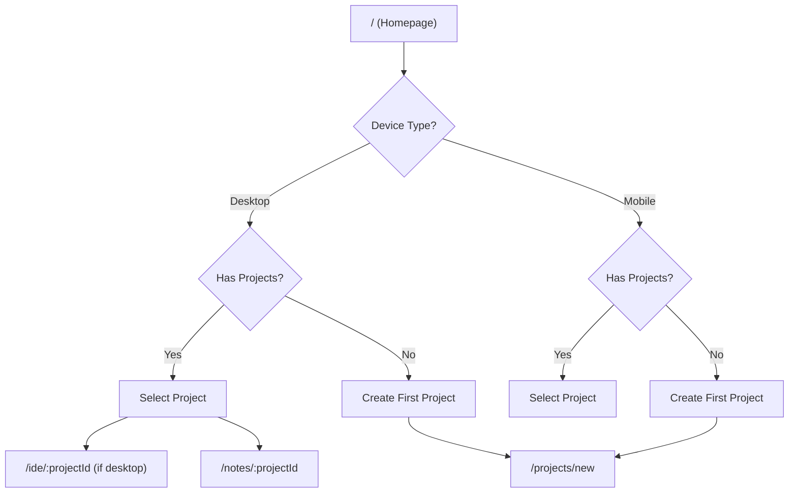
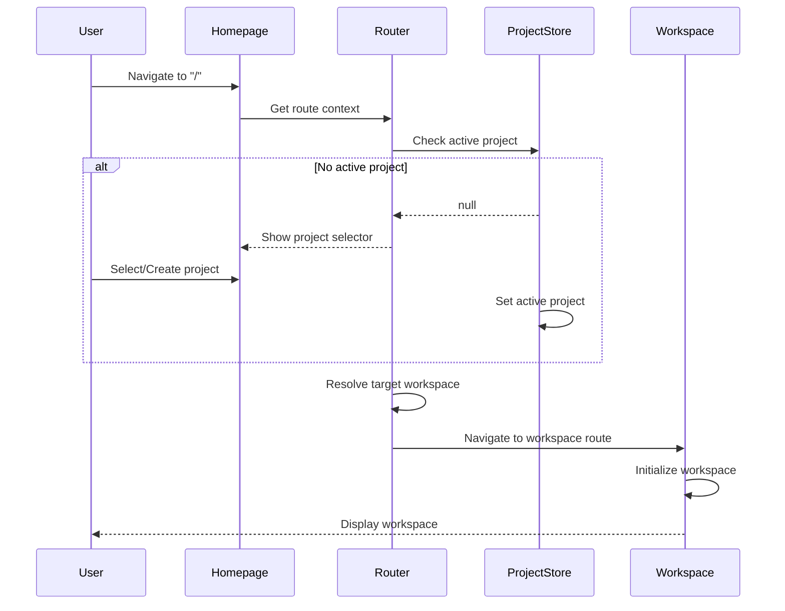

---
# ═══════════════════════════════════════════════════════════════════════════
# CROSS-WORKSPACE INTEGRATION DOCUMENTATION
# Feature Mapping, Entry Points, and User Journey Flows
# ═══════════════════════════════════════════════════════════════════════════

document_id: "DOC-002"
version: "1.0.0"
created_at: "2026-01-19T00:00:00+07:00"
status: "active"
author: "tech-writer-ext"

governance:
  parent_artifact: "DOC-001"
  compliance_level: "Tier 2 (Controlled)"
  review_cycle: "Per epic completion"
  last_reviewed: null

references:
  - "_bmad-output/planning-artifacts/architecture/core-centralized-groups-2026-01-19.md"
  - "_bmad-ext/modules/governance/scanners/quality-workspace-scanner.md"
  - "_bmad-ext/modules/governance/scanners/quality-ux-scanner.md"
  - "AGENTS.md"

toc:
  - section: "1. Executive Summary"
  - section: "2. Feature Mapping"
  - section: "3. Entry Points Definition"
  - section: "4. Routing Logic"
  - section: "5. User Journey Transition Flows"
  - section: "6. Integration Patterns"
  - section: "7. Cross-Workspace Data Flow"
  - section: "8. State Synchronization"
  - section: "9. Governance Compliance"
  - section: "10. Revision History"

---

## 1. EXECUTIVE SUMMARY

This document defines the **Cross-Workspace Integration** architecture for Project Alpha, mapping features across workspaces, defining entry points, and documenting user journey transition flows.

### 1.1 Integration Principles

| Principle | Description | Enforcement |
|-----------|-------------|-------------|
| **Workspace Isolation** | Each workspace has distinct boundaries | Strict routing |
| **Seamless Transitions** | Users move between workspaces without friction | Unified navigation |
| **Context Preservation** | State transfers across workspace boundaries | Thread binding |
| **Device Awareness** | Features adapt to device capabilities | Platform contract |

### 1.2 Workspace Overview

| Workspace | Status | Primary Features | Device Restrictions |
|-----------|--------|------------------|---------------------|
| **IDE** | Active | Code editing, file system, terminal | Desktop only |
| **Notes** | Active | Markdown editing, BlockNote, file sync | All devices |
| **Knowledge** | Disabled (MVP) | RAG search, document import | All devices |
| **Study** | Disabled (MVP) | Flashcards, quizzes | All devices |

---

## 2. FEATURE MAPPING

### 2.1 Feature Matrix

```yaml
feature_matrix:
  file_operations:
    ide:
      - read: true
      - write: true
      - delete: true
      - execute: true
      - terminal: true
      
    notes:
      - read: true
      - write: true
      - delete: true
      - execute: false
      - terminal: false
      
    knowledge:
      - read: true
      - write: true
      - delete: true
      - execute: false
      - terminal: false
      
    study:
      - read: true
      - write: true
      - delete: true
      - execute: false
      - terminal: false
      
  ai_features:
    ide:
      - code_completion: true
      - refactoring: true
      - debugging: true
      
    notes:
      - writing_assistant: true
      - summarization: true
      - grammar_check: true
      
    knowledge:
      - semantic_search: true
      - question_answering: true
      - document_summarization: true
      
    study:
      - flashcard_generation: true
      - quiz_generation: true
      - spaced_repetition: true
      
  sync_features:
    ide:
      - file_watching: true
      - auto_save: true
      - conflict_resolution: true
      
    notes:
      - file_watching: true
      - auto_save: true
      - conflict_resolution: true
      
    knowledge:
      - document_indexing: true
      - embedding_sync: true
      
    study:
      - progress_sync: true
      - score_sync: true
```

### 2.2 Feature Dependencies

```yaml
feature_dependencies:
  ide_code_completion:
    requires:
      - "file_system_access"
      - "language_server"
      - "agent_tools"
      
  notes_markdown_sync:
    requires:
      - "file_watching"
      - "dexie_persistence"
      - "blocknote_renderer"
      
  knowledge_semantic_search:
    requires:
      - "vector_database"
      - "embedding_service"
      - "rag_context"
      
  study_spaced_repetition:
    requires:
      - "dexie_persistence"
      - "algorithm_implementation"
      - "progress_tracking"
```

---

## 3. ENTRY POINTS DEFINITION

### 3.1 Primary Entry Points

```typescript
// src/routes/entry-points.ts

const ENTRY_POINTS = {
  homepage: {
    path: '/',
    type: 'gateway',
    guards: ['device_detection', 'user_status'],
  },
  
  ide_workspace: {
    path: '/ide/:projectId',
    type: 'workspace',
    guards: ['device_check', 'project_check', 'auth_check'],
    device_restriction: 'desktop_only',
  },
  
  notes_workspace: {
    path: '/notes/:projectId',
    type: 'workspace',
    guards: ['project_check', 'auth_check'],
  },
  
  knowledge_workspace: {
    path: '/knowledge/:projectId',
    type: 'workspace',
    guards: ['project_check', 'auth_check'],
    status: 'disabled',
  },
  
  study_workspace: {
    path: '/study/:projectId',
    type: 'workspace',
    guards: ['project_check', 'auth_check'],
    status: 'disabled',
  },
  
  project_selector: {
    path: '/projects',
    type: 'selector',
    guards: ['auth_check'],
  },
};
```

### 3.2 Entry Point Guards

```typescript
// src/presentation/components/common/EntryGuard.tsx

interface EntryGuardProps {
  guards: EntryGuard[];
  children: React.ReactNode;
  fallback?: React.ReactNode;
}

export function EntryGuard({ guards, children, fallback }: EntryGuardProps) {
  const [guardResults, setGuardResults] = useState<Map<string, GuardResult>>(
    new Map()
  );
  
  useEffect(() => {
    // Run all guards in parallel
    Promise.all(
      guards.map(async (guard) => {
        const result = await runGuard(guard);
        return { guard, result };
      })
    ).then((results) => {
      const guardMap = new Map<string, GuardResult>();
      results.forEach(({ guard, result }) => {
        guardMap.set(guard.name, result);
      });
      setGuardResults(guardMap);
    });
  }, [guards]);
  
  // Check if all guards pass
  const allPassed = Array.from(guardResults.values()).every(
    (result) => result.status === 'passed'
  );
  
  if (!allPassed) {
    const failedGuard = Array.from(guardResults.entries()).find(
      ([_, result]) => result.status === 'failed'
    );
    
    if (fallback) {
      return <>{fallback}</>;
    }
    
    return (
      <GuardFailureView
        guard={failedGuard?.[0]}
        reason={failedGuard?.[1].reason}
      />
    );
  }
  
  return <>{children}</>;
}
```

### 3.3 Device-Specific Entry Points

```yaml
entry_points_device_specific:
  desktop:
    - "/ide/:projectId"
    - "/notes/:projectId"
    - "/projects"
    - "/settings"
    
  mobile:
    - "/notes/:projectId"  # IDE not available
    - "/projects"
    - "/settings"
    
  tablet:
    - "/notes/:projectId"  # IDE may be available on iPadOS
    - "/projects"
    - "/settings"
```

---

## 4. ROUTING LOGIC

### 4.1 Route Hierarchy



### 4.2 Router Implementation

```typescript
// src/routes/router.tsx

import { createRouter, createRoute, rootRouteAdapter } from '@tanstack/react-router';
import { routeTree } from './routeTree';
import { EntryPointGuard } from '@/presentation/components/common/EntryPointGuard';

const router = createRouter({
  routeTree,
  context: () => ({
    platformContract: getPlatformContract(),
    projectStore: useProjectStore.getState(),
  }),
  defaultPreload: 'intent',
});

// Homepage route with guards
const homepageRoute = createRoute({
  getParentRoute: () => rootRouteAdapter,
  path: '/',
  component: () => (
    <EntryPointGuard
      guards={['device_detection', 'user_status']}
      fallback={<EntryPointLoading />}
    >
      <HomepageLayout />
    </EntryPointGuard>
  ),
});

// IDE route with device restriction
const ideRoute = createRoute({
  getParentRoute: () => rootRouteAdapter,
  path: 'ide/$projectId',
  beforeLoad: ({ context }) => {
    if (!context.platformContract.canAccessIDE) {
      throw redirect({
        to: '/',
        search: { error: 'ide_not_available_on_mobile' },
      });
    }
  },
  component: () => <IDEWorkspace />,
});
```

### 4.3 Dynamic Route Resolution

```typescript
// src/routes/dynamic-resolution.ts

function resolveRoute(
  targetPath: string,
  context: RouteContext
): ResolvedRoute {
  // Check if route exists
  const route = router.routeManifest.find((r) => r.path === targetPath);
  if (!route) {
    return { status: 'not_found' };
  }
  
  // Check device restrictions
  if (route.device_restriction && context.deviceType !== 'desktop') {
    return {
      status: 'restricted',
      redirectTo: '/',
      error: `${route.device_restriction} restriction applies`,
    };
  }
  
  // Check authentication
  if (route.requires_auth && !context.isAuthenticated) {
    return {
      status: 'unauthorized',
      redirectTo: '/login',
    };
  }
  
  // Check project requirement
  if (route.requires_project && !context.activeProject) {
    return {
      status: 'project_required',
      redirectTo: '/projects',
    };
  }
  
  return { status: 'valid', route };
}
```

---

## 5. USER JOURNEY TRANSITION FLOWS

### 5.1 Homepage to Workspace Flow



### 5.2 Workspace Switching Flow

```typescript
// src/presentation/hooks/useWorkspaceSwitch.ts

interface WorkspaceSwitchContext {
  fromWorkspace: WorkspaceType;
  toWorkspace: WorkspaceType;
  projectId: ProjectId;
  preserveState: boolean;
}

function useWorkspaceSwitch() {
  const navigate = useNavigate();
  const { activeProject } = useProjectStore();
  const { threads } = useThreadStore();
  
  const switchWorkspace = async (
    toWorkspace: WorkspaceType,
    options: WorkspaceSwitchOptions = {}
  ) => {
    const context: WorkspaceSwitchContext = {
      fromWorkspace: getCurrentWorkspace(),
      toWorkspace,
      projectId: activeProject.id,
      preserveState: options.preserveState ?? true,
    };
    
    // Save current workspace state
    if (context.preserveState) {
      await persistWorkspaceState(context);
    }
    
    // Transfer thread context if requested
    if (options.transferThread) {
      const currentThread = getActiveThread();
      await bindThreadToWorkspace(currentThread, toWorkspace);
    }
    
    // Navigate to new workspace
    const targetPath = `/${toWorkspace}/${activeProject.id}`;
    await navigate({ to: targetPath, replace: options.replace });
  };
  
  return { switchWorkspace };
}
```

### 5.3 Cross-Workspace Navigation Patterns

```yaml
navigation_patterns:
  pattern_1:
    name: "Direct Navigation"
    description: "User clicks workspace tab to switch"
    flow: "Tab Click -> Route Update -> Workspace Mount"
    
  pattern_2:
    name: "Deep Link Navigation"
    description: "User clicks external link to specific workspace"
    flow: "URL Open -> Route解析 -> Auth Check -> Workspace Mount"
    
  pattern_3:
    name: "AI-Initiated Navigation"
    description: "Agent determines user needs different workspace"
    flow: "Agent Decision -> User Confirmation -> Route Update -> Workspace Mount"
    
  pattern_4:
    name: "Error Recovery Navigation"
    description: "System redirects user after error"
    flow: "Error Detect -> Error Handler -> Redirect -> Workspace Mount"
```

---

## 6. INTEGRATION PATTERNS

### 6.1 Shared Component Integration

```typescript
// src/presentation/components/common/WorkspaceLayout.tsx

interface WorkspaceLayoutProps {
  workspace: WorkspaceType;
  children: React.ReactNode;
}

export function WorkspaceLayout({ workspace, children }: WorkspaceLayoutProps) {
  const { deviceType } = usePlatformStore();
  const { theme } = useThemeStore();
  
  return (
    <div
      data-workspace={workspace}
      data-device={deviceType}
      data-theme={theme}
      className="workspace-layout"
    >
      <WorkspaceNavigation
        workspace={workspace}
        deviceType={deviceType}
      />
      <WorkspaceContent
        workspace={workspace}
        deviceType={deviceType}
      >
        {children}
      </WorkspaceContent>
      <WorkspaceStatusBar
        workspace={workspace}
      />
    </div>
  );
}
```

### 6.2 Shared Service Integration

```typescript
// src/infrastructure/services/WorkspaceServiceFactory.ts

class WorkspaceServiceFactory {
  private static services: Map<WorkspaceType, WorkspaceService> = new Map();
  
  static getService(workspace: WorkspaceType): WorkspaceService {
    let service = this.services.get(workspace);
    
    if (!service) {
      switch (workspace) {
        case 'ide':
          service = new IDEWorkspaceService();
          break;
        case 'notes':
          service = new NotesWorkspaceService();
          break;
        case 'knowledge':
          service = new KnowledgeWorkspaceService();
          break;
        case 'study':
          service = new StudyWorkspaceService();
          break;
      }
      this.services.set(workspace, service);
    }
    
    return service;
  }
}
```

---

## 7. CROSS-WORKSPACE DATA FLOW

### 7.1 Data Transfer Protocol

```typescript
// src/infrastructure/sync/CrossWorkspaceDataTransfer.ts

interface CrossWorkspacePayload {
  sourceWorkspace: WorkspaceType;
  targetWorkspace: WorkspaceType;
  dataType: 'text' | 'file_reference' | 'context';
  payload: unknown;
  metadata: TransferMetadata;
}

interface TransferMetadata {
  transferId: string;
  timestamp: Date;
  userInitiated: boolean;
  compression: boolean;
}

class CrossWorkspaceDataTransfer {
  async transfer(payload: CrossWorkspacePayload): Promise<TransferResult> {
    // Validate transfer
    this.validateTransfer(payload);
    
    // Compress if needed
    const processedPayload = payload.metadata.compression
      ? this.compress(payload.payload)
      : payload.payload;
    
    // Transfer via shared context
    const transferId = await this.initiateTransfer({
      ...payload,
      payload: processedPayload,
    });
    
    // Notify target workspace
    await this.notifyTargetWorkspace(payload.targetWorkspace, transferId);
    
    return { transferId, status: 'initiated' };
  }
  
  private validateTransfer(payload: CrossWorkspacePayload): void {
    // Check if transfer is allowed
    if (!this.isTransferAllowed(payload)) {
      throw new Error(`Transfer from ${payload.sourceWorkspace} to ${payload.targetWorkspace} not allowed`);
    }
    
    // Check data type compatibility
    if (!this.isDataTypeCompatible(payload)) {
      throw new Error(`Data type ${payload.dataType} not compatible with target workspace`);
    }
  }
}
```

### 7.2 Context Sharing

```yaml
context_sharing:
  shared_contexts:
    - name: "Project Context"
      scope: "All workspaces"
      data: ["projectId", "projectName", "projectConfig"]
      
    - name: "Thread Context"
      scope: "Cross-workspace"
      data: ["threadId", "messages", "RAG references"]
      
    - name: "User Preferences"
      scope: "All workspaces"
      data: ["theme", "language", "keyboardShortcuts"]
      
    - name: "AI Context"
      scope: "Agent-specific"
      data: ["agentState", "toolPermissions", "conversationHistory"]
```

---

## 8. STATE SYNCHRONIZATION

### 8.1 State Sync Architecture

```typescript
// src/infrastructure/sync/WorkspaceStateSync.ts

interface SyncState {
  workspace: WorkspaceType;
  projectId: ProjectId;
  lastSynced: Date;
  pendingChanges: Map<string, unknown>;
}

class WorkspaceStateSync {
  private syncStore: Map<string, SyncState> = new Map();
  
  async syncState(workspace: WorkspaceType, projectId: ProjectId): Promise<void> {
    const key = `${workspace}:${projectId}`;
    const currentState = this.syncStore.get(key);
    
    if (currentState) {
      // Check for changes
      const changes = await this.detectChanges(currentState);
      if (changes.size > 0) {
        await this.persistChanges(key, changes);
        await this.broadcastChanges(workspace, changes);
      }
    }
  }
  
  async broadcastChanges(
    workspace: WorkspaceType,
    changes: Map<string, unknown>
  ): Promise<void> {
    // Notify other workspaces about changes
    const otherWorkspaces = ['ide', 'notes', 'knowledge', 'study'].filter(
      (w) => w !== workspace
    );
    
    for (const targetWorkspace of otherWorkspaces) {
      await this.notifyWorkspace(targetWorkspace, {
        source: workspace,
        changes,
      });
    }
  }
}
```

### 8.2 Conflict Resolution

```yaml
conflict_resolution:
  strategies:
    - name: "Last Write Wins"
     适用场景: "Simple state updates"
      
    - name: "Merge Strategy"
     适用场景: "Complex document states"
      
    - name: "User Intervention"
     适用场景: "Conflicting changes to same content"
     resolution: "Show conflict resolution dialog"
      
    - name: "Workspace Priority"
     适用场景: "IDE has priority for code files"
     resolution: "IDE changes override other workspaces"
```

---

## 9. GOVERNANCE COMPLIANCE

### 9.1 Compliance Checklist

| Requirement | Status | Evidence |
|-------------|--------|----------|
| Context-first documentation | ✅ | References core document |
| Agent expert pattern | ✅ | Integration decisions documented |
| Research trigger | ✅ | TanStack Router patterns validated |
| No hardcoded values | ✅ | Uses config-based routing |
| 8-bit design compliance | ✅ | UI specs follow standards |
| Workspace isolation | ✅ | Strict boundary enforcement |

### 9.2 Related Governance Documents

| Document | Relationship |
|----------|--------------|
| `quality-workspace-scanner.md` | Cross-workspace quality validation |
| `quality-ux-scanner.md` | UX consistency validation |
| `conversation-threads.md` | Thread management governance |

---

## 10. REVISION HISTORY

| Version | Date | Author | Changes |
|---------|------|--------|---------|
| 1.0.0 | 2026-01-19 | tech-writer-ext | Initial document creation |

---

*Document governed by BMAD Framework v2.0*
*Last Updated: 2026-01-19T00:00:00+07:00*
