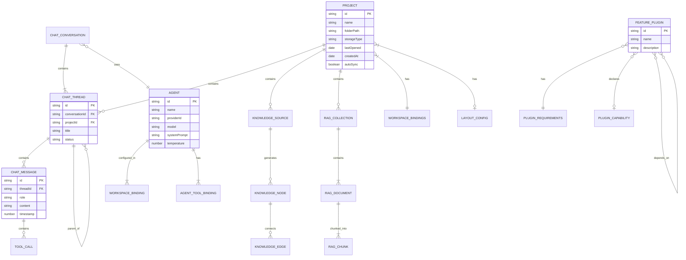

# Domain Entity Contracts

> **Purpose**: Establish single-source-of-truth for all domain entities with clear ownership boundaries, relationships, and Clean Architecture compliance.

---

## 1. Entity Catalog

### 1.1 Core Entity: Project

| Property | Type | Required | Description |
|----------|------|----------|-------------|
| `id` | `string` | Yes | UUID v4 or generated unique identifier |
| `name` | `string` | Yes | Display name (typically folder name) |
| `folderPath` | `string` | Yes | Display path for UI (not actual path due to FSA security) |
| `storageType` | `'indexeddb' \| 'fsa'` | Yes | Storage backend type |
| `lastOpened` | `Date` | Yes | Last access timestamp |
| `createdAt` | `Date` | Yes | Creation timestamp |
| `autoSync` | `boolean` | Yes | Auto-sync flag (default: true) |
| `layoutState` | `LayoutConfig` | No | Optional IDE layout restoration |
| `exclusionPatterns` | `string[]` | No | Custom exclusion patterns for sync |
| `fileSnapshotEnabled` | `boolean` | No | File snapshot feature flag |
| `description` | `string` | No | Project description |
| `tags` | `string[]` | Yes | Project tags |
| `deleted` | `boolean` | No | Soft delete flag |
| `deletedAt` | `Date` | No | Soft delete timestamp |
| `isTemp` | `boolean` | No | Temp project flag |
| `autoCreated` | `boolean` | No | System-generated flag |
| `isBrowserMode` | `boolean` | No | Browser mode flag |
| `deviceType` | `'desktop' \| 'mobile' \| 'tablet'` | No | Device type |

**Canonical Location**: `src/domain/entities/project.ts`

**Business Rules**:
- Project must have unique id (UUID v4 or generated)
- Storage type determines available features (FSA = full IDE, IndexedDB = notes only)
- Soft delete: recoverable for 30 days
- Nested projects are BLOCKED (per new-fundamental-truths.md)

**Lifecycle**:
- **Created by**: User via Project Management Plugin, System (temp projects)
- **Updated by**: User, Sync Engine (lastOpened), Layout System (layoutState)
- **Deleted by**: User (soft delete), System (purge after 30 days)

**Owner**: Project Management Domain

---

### 1.2 Entity: Agent (Class-Based)

| Property | Type | Required | Description |
|----------|------|----------|-------------|
| `id` | `string` | Yes | Unique identifier |
| `name` | `string` | Yes | Display name |
| `description` | `string` | No | Agent description |
| `providerId` | `string` | Yes | LLM provider ID |
| `model` | `string` | Yes | Model identifier |
| `modelId` | `string` | No | Alias for model |
| `systemPrompt` | `string` | Yes | System instruction |
| `topP` | `number` | No | Top-p sampling (default: 1.0) |
| `topK` | `number` | No | Top-k sampling |
| `temperature` | `number` | No | Temperature (default: 0.7) |
| `maxTokens` | `number` | No | Max tokens (default: 4096) |
| `tools` | `AgentToolBinding[]` | Yes | Tool configurations |
| `status` | `AgentStatus` | No | Current status |
| `tasksCompleted` | `number` | No | Task count |
| `successRate` | `number` | No | Success percentage |
| `tokensUsed` | `number` | No | Token consumption |
| `lastActive` | `string` | No | Last activity timestamp |
| `createdAt` | `number` | Yes | Creation timestamp |
| `updatedAt` | `number` | Yes | Update timestamp |

**Canonical Location**: `src/domain/entities/agent.ts`

**Business Rules**:
- Agent must have at least one workspace binding
- Agent must have at least one enabled tool
- At least one workspace must be available
- Agent cannot be deleted if active in any conversation

**Lifecycle**:
- **Created by**: User via Agent Configuration
- **Updated by**: User, Orchestrator (status, tasksCompleted)
- **Deleted by**: User (only if not in active conversation)

**Owner**: Agent Orchestration Domain

---

### 1.3 Entity: ChatThread

| Property | Type | Required | Description |
|----------|------|----------|-------------|
| `id` | `string` | Yes | Unique identifier |
| `conversationId` | `string` | Yes | Parent conversation ID |
| `projectId` | `string` | Yes | Associated project ID |
| `workspaceType` | `WorkspaceType` | No | Workspace scope |
| `title` | `string` | Yes | Thread title |
| `preview` | `string` | Yes | Preview text |
| `parentThreadId` | `string \| null` | No | Parent for hierarchical threads |
| `childThreadIds` | `string[]` | No | Child thread IDs |
| `folderPath` | `string` | No | Thread organization path |
| `contextWindow` | `ContextWindowConfig` | No | Token limit management |
| `status` | `'active' \| 'archived' \| 'deleted'` | Yes | Thread status |
| `createdAt` | `number` | Yes | Creation timestamp |
| `updatedAt` | `number` | Yes | Update timestamp |
| `messageCount` | `number` | Yes | Message count |

**Canonical Location**: `src/domain/entities/chat.ts`

**Business Rules**:
- Threads are project-scoped (per new-fundamental-truths.md)
- Auto-compaction at 90% context window (135K tokens default)
- Supports hierarchical organization (cascade flow)

**Lifecycle**:
- **Created by**: Chat Plugin, Agent Delegation (sub-threads)
- **Updated by**: Chat Messages, Compaction System
- **Deleted by**: User, Auto-archive

**Owner**: Chat Cascade Domain

---

### 1.4 Entity: ChatConversation

| Property | Type | Required | Description |
|----------|------|----------|-------------|
| `id` | `string` | Yes | Unique identifier |
| `projectId` | `string \| null` | Yes | Associated project (null = global) |
| `workspaceType` | `WorkspaceType` | Yes | Workspace type |
| `title` | `string` | Yes | Conversation title |
| `preview` | `string` | Yes | Preview text |
| `agentId` | `string` | Yes | Agent ID for conversation |
| `messageCount` | `number` | Yes | Total messages across threads |
| `scrollPosition` | `number` | Yes | UI scroll position |
| `status` | `'active' \| 'archived' \| 'deleted'` | Yes | Conversation status |
| `pinned` | `boolean` | No | Pinned to top |
| `tags` | `string[]` | No | Organization tags |
| `createdAt` | `number` | Yes | Creation timestamp |
| `updatedAt` | `number` | Yes | Update timestamp |

**Canonical Location**: `src/domain/entities/chat.ts`

**Owner**: Chat Cascade Domain

---

### 1.5 Entity: ChatMessage

| Property | Type | Required | Description |
|----------|------|----------|-------------|
| `id` | `string` | Yes | Unique identifier |
| `role` | `MessageRole` | Yes | Message role |
| `content` | `string` | Yes | Message content |
| `threadId` | `string` | Yes | Parent thread ID |
| `agentId` | `string` | No | Agent attribution |
| `agentName` | `string` | No | Agent display name |
| `agentModel` | `string` | No | Model used |
| `toolCalls` | `ToolCall[]` | No | Tool executions |
| `timestamp` | `number` | Yes | Creation timestamp |
| `metadata` | `Record<string, unknown>` | No | Extensibility |

**Canonical Location**: `src/domain/entities/chat.ts`

**Owner**: Chat Cascade Domain

---

### 1.6 Entity: FeaturePlugin (Interface)

| Property | Type | Required | Description |
|----------|------|----------|-------------|
| `id` | `PluginId` | Yes | Plugin identifier |
| `name` | `string` | Yes | Display name |
| `icon` | `React.ReactNode` | Yes | Icon component |
| `description` | `string` | Yes | Plugin description |
| `requirements` | `PluginRequirements` | Yes | Platform constraints |
| `MainComponent` | `React.FC` | Yes | Main render component |
| `SidebarComponent` | `React.FC` | No | Sidebar component |
| `ToolbarComponent` | `React.FC` | No | Toolbar component |
| `onMount` | `(context) => Promise<void>` | No | Mount lifecycle |
| `onUnmount` | `() => Promise<void>` | No | Unmount lifecycle |
| `onProjectChange` | `(id) => Promise<void>` | No | Project change hook |
| `capabilities` | `PluginCapability[]` | No | Capability declarations |
| `dependsOn` | `PluginId[]` | No | Dependencies |

**Canonical Location**: `src/domain/interfaces/feature-plugin.interface.ts`

**Business Rules**:
- Maximum 5 plugins per project (2 always-loaded + 3 optional)
- Platform determines available plugins
- Two always-loaded: Project Management, Chat Cascade

**Owner**: Plugin System Domain

---

### 1.7 Entity: KnowledgeSource

| Property | Type | Required | Description |
|----------|------|----------|-------------|
| `id` | `string` | Yes | Unique identifier |
| `projectId` | `string` | Yes | Parent project |
| `type` | `'file' \| 'url' \| 'note'` | Yes | Source type |
| `uri` | `string` | Yes | Resource identifier |
| `title` | `string` | Yes | Display title |
| `metadata` | `Record<string, unknown>` | Yes | Custom metadata |
| `status` | `'pending' \| 'processing' \| 'processed' \| 'error'` | Yes | Processing status |
| `keyConcepts` | `string[]` | No | Extracted concepts |
| `created` | `Date` | Yes | Creation timestamp |
| `updated` | `Date` | Yes | Update timestamp |

**Canonical Location**: `src/domain/entities/knowledge.ts`

**Owner**: Knowledge Management Domain

---

### 1.8 Entity: RagCollection / RagDocument / RagChunk

**Canonical Location**: `src/domain/entities/rag.ts`

| Entity | Key Properties | Owner |
|--------|----------------|-------|
| `RagCollection` | id, name, description, metadata | RAG Domain |
| `RagDocument` | id, collectionId, title, content, status | RAG Domain |
| `RagChunk` | id, documentId, content, embedding, index | RAG Domain |

**Business Rules**:
- Documents belong to exactly one collection
- Chunks belong to exactly one document
- Embeddings are project-scoped

**Owner**: RAG Pipeline Domain

---

### 1.9 Entity: Workspace (DEPRECATED - Transitional)

| Property | Type | Required | Description |
|----------|------|----------|-------------|
| `type` | `WorkspaceType` | Yes | Workspace type identifier |

**Canonical Location**: `src/domain/entities/workspace.ts`

**Status**: **DEPRECATED** per new-fundamental-truths.md

**Migration Path**:
- `WorkspaceConfig` → DELETE (platform determines plugins, not workspace bindings)
- `WorkspaceState` → Merge into `Project.layoutState`
- `WorkspaceType` → DELETE from entities (keep only as PluginId enum if needed)

**Owner**: Legacy (to be deleted - see new-fundamental-truths.md §1.3)

---

### 1.10 Entity: Study (Flashcard, Quiz, StudySession)

**Canonical Location**: `src/domain/entities/study.ts`

| Entity | Status | Notes |
|--------|--------|-------|
| `Flashcard` | MVP-DEFERRED | Study workspace disabled |
| `Quiz` | MVP-DEFERRED | Study workspace disabled |
| `StudySession` | MVP-DEFERRED | Study workspace disabled |

**Owner**: Study Domain (DEFERRED)

---

## 2. Entity Relationship Diagram



---

## 3. Ownership Matrix

| Entity | Owner Layer | Can Access | Cannot Access |
|--------|-------------|------------|---------------|
| **Project** | Domain | StorageAdapter (via interface) | Dexie directly, FSA directly |
| **Agent** | Domain | WorkspaceBinding, ToolBinding | Store state, LLM clients |
| **ChatThread** | Domain | ChatMessage | Zustand stores, IndexedDB |
| **ChatMessage** | Domain | ToolCall | Network, File System |
| **ChatConversation** | Domain | ChatThread | Persistence layer |
| **FeaturePlugin** | Domain/Interface | ProjectContext | Infrastructure internals |
| **KnowledgeSource** | Domain | KnowledgeNode, KnowledgeEdge | Embedding service |
| **RagCollection** | Domain | RagDocument | Vector DB internals |
| **RagDocument** | Domain | RagChunk | Embedding generation |
| **RagChunk** | Domain | embedding[] | Vector store operations |
| **WorkspaceBinding** | Domain/VO | WorkspaceType | Infrastructure |
| **AgentToolBinding** | Domain/VO | WorkspacePermissions | Tool implementations |

---

## 4. Clean Architecture Validation

### 4.1 Current Violations Found

| File | Line | Violation | Severity |
|------|------|-----------|----------|
| `src/domain/interfaces/feature-plugin.interface.ts` | 30 | `import type { ProjectContext } from '@/infrastructure/context/project-context'` | HIGH |
| `src/domain/adapters/index.ts` | 11 | `import type { FlashcardSetRecord } from '@/infrastructure/persistence/...'` | MEDIUM |
| `src/domain/adapters/index.ts` | 14 | `import type { DiagnosticTraceEventRecord } from '@/infrastructure/persistence/...'` | MEDIUM |
| `src/domain/services/project-creation-service.ts` | 15 | `import { getPlatformContract } from '@/infrastructure/filesystem/...'` | HIGH |
| `src/domain/services/project-creation-service.ts` | 16 | `import { useProjectStore } from '@/infrastructure/persistence/stores/...'` | HIGH |
| `src/domain/services/project-creation-service.ts` | 17 | `import type { CreateProjectInput } from '@/infrastructure/persistence/...'` | MEDIUM |
| `src/domain/services/note-gateway.ts` | 23 | `import type { NoteRecord } from '@/infrastructure/persistence/dexie-db'` | MEDIUM |
| `src/domain/services/file-crud/unified-file-crud.ts` | 598 | Comment references `@/infrastructure/sync/adapters/fsa-adapter` | LOW |

**Total Violations**: 8

### 4.2 Remediation Plan

#### HIGH Priority (Blocks Architecture)

1. **feature-plugin.interface.ts**
   - **Issue**: Domain interface imports infrastructure type `ProjectContext`
   - **Fix**: Define `ProjectContext` interface in domain layer
   - **Location**: Create `src/domain/interfaces/project-context.interface.ts`
   - **Effort**: 0.5 story points

2. **project-creation-service.ts**
   - **Issue**: Domain service imports infrastructure implementations
   - **Fix**: Inject dependencies via constructor or use interface
   - **Pattern**: Apply Dependency Inversion Principle
   - **Effort**: 2 story points

#### MEDIUM Priority (Type Coupling)

3. **domain/adapters/index.ts**
   - **Issue**: Domain adapters reference infrastructure types
   - **Fix**: Define adapter types in domain, implement in infrastructure
   - **Effort**: 1 story point

4. **note-gateway.ts**
   - **Issue**: Gateway imports Dexie record type
   - **Fix**: Define `NoteRecord` equivalent in domain as `Note` entity
   - **Effort**: 1 story point

#### LOW Priority (Comments)

5. **unified-file-crud.ts**
   - **Issue**: Comment references infrastructure path
   - **Fix**: Update documentation
   - **Effort**: 0.25 story points

---

## 5. Implementation Recommendations

### 5.1 Directory Structure for `src/domain/entities/`

```
src/domain/
├── entities/
│   ├── index.ts                  # Barrel export
│   ├── project.ts                # ✅ EXISTS - Clean
│   ├── agent.ts                  # ✅ EXISTS - Clean
│   ├── chat.ts                   # ✅ EXISTS - Clean
│   ├── workspace.ts              # ⚠️ DEPRECATED
│   ├── knowledge.ts              # ✅ EXISTS - Clean
│   ├── rag.ts                    # ✅ EXISTS - Clean
│   ├── study.ts                  # ✅ EXISTS - DEFERRED
│   ├── code-chunk.ts             # ✅ EXISTS - Clean
│   └── __tests__/                # Unit tests
├── value-objects/
│   ├── workspace-type.ts         # ✅ EXISTS - Clean
│   ├── workspace-binding.ts      # ✅ EXISTS - Clean
│   └── tool-permission.ts        # ✅ EXISTS - Clean
├── interfaces/
│   ├── index.ts                  # ✅ EXISTS - Barrel
│   ├── storage-adapter.interface.ts
│   ├── storage-gateway.interface.ts
│   ├── feature-plugin.interface.ts  # ⚠️ HAS VIOLATION
│   └── project-context.interface.ts  # 🆕 TO CREATE
└── types/
    ├── index.ts
    ├── plugin-types.ts           # ✅ EXISTS - Clean
    ├── plugin-coordination.types.ts
    └── project-ids.ts
```

### 5.2 Interface Contracts vs Concrete Classes

| Pattern | Use Case | Examples |
|---------|----------|----------|
| **Interface** | Cross-layer contracts | `StorageAdapter`, `FeaturePlugin`, `StorageGateway` |
| **Class** | Rich domain entities with behavior | `Agent`, `WorkspaceBinding`, `AgentToolBinding` |
| **Type Alias** | Simple data structures | `Project`, `ChatThread`, `ChatMessage` |

### 5.3 Factory Patterns Needed

1. **ProjectFactory**
   - Create projects with proper defaults
   - Validate storage type against platform
   - Generate IDs

2. **AgentFactory**
   - Create agents with default workspace bindings
   - Validate tool configurations
   - Set default model parameters

3. **PluginFactory**
   - Create plugin instances with proper lifecycle
   - Validate requirements against platform
   - Manage dependency resolution

### 5.4 Migration Recommendations

#### Immediate Actions (Sprint 1)
1. Create `ProjectContext` interface in domain layer
2. Fix `feature-plugin.interface.ts` to use domain interface
3. Create barrel export in `src/domain/entities/index.ts`

#### Near-Term Actions (Sprint 2)
1. Refactor `project-creation-service.ts` with DI
2. Define `Note` entity in domain (currently only `NoteRecord` in infra)
3. Create factory classes

#### Long-Term Actions (Sprint 3+)
1. Complete workspace entity deprecation
2. Implement event sourcing for entity lifecycle
3. Add domain validation layer

---

## 6. Entity Summary Statistics

| Metric | Count |
|--------|-------|
| **Total Entities** | 15 |
| **Clean Entities** | 12 |
| **Deprecated Entities** | 1 (Workspace) |
| **Deferred Entities** | 3 (Study domain) |
| **Value Objects** | 3 |
| **Clean Architecture Violations** | 8 |
| **High Priority Fixes** | 2 |

---

## 7. Cross-References

| Document | Purpose |
|----------|---------|
| `new-fundamental-truths.md` | Architectural decisions source |
| `type-registry-2026-01-30.md` | Type definitions registry |
| `ADR-034` | Project-centric architecture decision |
| `AGENTS.md` | Governance rules |

---

**Document Status**: COMPLETE
**Next Action**: ARCH-01c - Store Mapping Analysis

---

*Generated by architect-ext | Phase 1: Foundation Stabilization*
*Last Updated: 2026-01-30T10:00:00+07:00*
