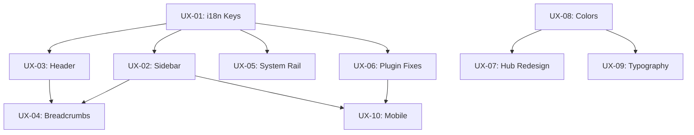

# EPIC-UX-GLOBAL-UI: Global UI System & 8-Bit Design Remediation

**Epic ID**: EPIC-UX-GLOBAL-UI
**Created**: 2026-01-26
**Priority**: P0 CRITICAL
**Status**: READY_FOR_EXECUTION
**Author**: ux-designer-ext
**Parent Handoff**: ux-emergency-2026-01-26-001

---

## Epic Summary

This epic establishes a proper global UI system that persists across all routes, remediates 8-bit design violations, and creates a professional dashboard-like application. It addresses the catastrophic UX failures identified in the audit report.

---

## Epic Goals

1. ✅ Create persistent global layout (header, sidebar, breadcrumbs, system rail)
2. ✅ Fix all 8-bit design violations (rounded corners, colors, shadows)
3. ✅ Add all missing i18n translation keys
4. ✅ Professional, dashboard-like appearance
5. ✅ Mobile responsive with proper progressive disclosure
6. ✅ Accessibility compliant (WCAG AA)

---

## Architecture Decision

### Global Layout Structure

```
┌─────────────────────────────────────────────────────────────┐
│ HEADER: Logo | Nav Menu | Search | Quick Actions | User    │
│         [Via-gent]  [Hub|IDE|Notes|Settings]   [⌘K] [⚙️] [👤] │
├─────────────────────────────────────────────────────────────┤
│ BREADCRUMB: Hub > Project Name > IDE                        │
├────────────────┬────────────────────────────────────────────┤
│ COLLAPSIBLE    │                                            │
│ SIDEBAR        │  MAIN CONTENT AREA                         │
│ [Toggle ☰]     │  (Routes render here via <Outlet />)       │
│                │                                            │
│ ┌────────────┐ │                                            │
│ │ PROJECTS   │ │                                            │
│ │ • Project1 │ │                                            │
│ │ • Project2 │ │                                            │
│ └────────────┘ │                                            │
│                │                                            │
│ ┌────────────┐ │                                            │
│ │ WORKSPACES │ │                                            │
│ │ [Hub]      │ │                                            │
│ │ [IDE]      │ │                                            │
│ │ [Notes]    │ │                                            │
│ └────────────┘ │                                            │
│                │                                            │
│ [Settings]     │                                            │
├────────────────┴────────────────────────────────────────────┤
│ SYSTEM RAIL: 🤖 Agent Ready | Ln 42, Col 8 | 0 Problems | ✓  │
└─────────────────────────────────────────────────────────────┘
```

### Design Tokens (Tailwind CSS)

```css
/* src/styles/tokens.css */

:root {
  /* Surface Colors (Tungsten & Fire) */
  --color-canvas: #09090b;      /* bg-canvas: App background */
  --color-surface: #18181b;     /* bg-surface: Panels, cards */
  --color-depth: #000000;       /* bg-depth: Inputs (recessed) */
  
  /* Text Colors */
  --color-text-primary: #fafafa;    /* text-primary */
  --color-text-muted: #a1a1aa;      /* text-muted */
  
  /* Accent Colors */
  --color-action: #f97316;      /* signal-action: Interactive only */
  --color-structural: #3f3f46;  /* border-structural */
  --color-success: #22c55e;
  --color-error: #ef4444;
  --color-warning: #eab308;
  
  /* 8-bit Tokens */
  --shadow-pixel: 4px 4px 0px 0px #000;
  --shadow-pixel-sm: 2px 2px 0px 0px #000;
  --border-width: 2px;
  --border-radius: 0px;
  
  /* Typography */
  --font-mono: 'JetBrains Mono', monospace;
  --font-sans: 'Geist', sans-serif;
}
```

---

## Stories

---

### Story UX-01: Add All Missing i18n Translation Keys

**Priority**: P0 CRITICAL
**Effort**: 2 hours
**Team**: Team A
**Status**: READY

#### Description

Add all 20 missing translation keys to `en.json` and `vi.json` files. The UI is currently displaying raw translation keys like `plugin.noPluginsTitle` instead of human-readable text.

#### Acceptance Criteria

- [ ] Add 14 plugin-related keys to en.json
- [ ] Add 6 header/sidebar keys to en.json
- [ ] Add Vietnamese translations to vi.json
- [ ] TypeScript compiles with 0 errors
- [ ] No raw translation keys visible in UI

#### Implementation Notes

**File**: `src/i18n/en.json`

Add the following keys:

```json
{
  "plugin.noPluginsTitle": "No Plugins Active",
  "plugin.noPluginsDescription": "Add plugins to customize your workspace layout",
  "plugin.addPlugin": "Add Plugin",
  "plugin.allPluginsActive": "All plugins are active",
  "plugin.clickToRemove": "Click to remove",
  "plugin.clickToAdd": "Click to add",
  "plugin.toolbar": "Plugin Toolbar",
  "plugin.layoutMode": "Layout",
  "plugin.layout1Column": "1 Column",
  "plugin.layout2Column": "2 Columns",
  "plugin.layout3Column": "3 Columns",
  "plugin.layout2Plus1": "2+1 Layout",
  "plugin.notFound": "Plugin not found",
  "plugin.closePanel": "Close {{pluginName}}",
  "plugin.activePlugins": "active plugins",
  "plugin.add": "Add",
  "plugin.dragToReorder": "Drag to reorder",
  
  "header.toggleSidebar": "Toggle sidebar",
  "sidebar.projectsHeader": "Projects",
  "sidebar.chatThreads": "Chat Threads",
  "sidebar.agentTools": "Agent Tools",
  "sidebar.resize": "Resize sidebar",
  "sidebar.closeSidebar": "Close sidebar",
  
  "layout.globalNav": "Navigation",
  "layout.breadcrumb": "Breadcrumb navigation",
  "layout.systemRail": "System Status"
}
```

---

### Story UX-02: Redesign Sidebar Component

**Priority**: P1
**Effort**: 3 hours
**Team**: Team A
**Status**: READY

#### Description

Replace the current ugly `ProjectSidebar` with a professional, 8-bit compliant collapsible sidebar that works across all routes.

#### Acceptance Criteria

- [ ] Collapsible with smooth toggle animation
- [ ] Sharp corners (`rounded-none`)
- [ ] Uses semantic color tokens (no gray-*)
- [ ] Icons + labels (collapses to icons only on narrow)
- [ ] Sections: Logo, Projects, Workspaces, Settings
- [ ] 44x44px minimum touch targets
- [ ] Keyboard accessible (Escape to close)
- [ ] i18n compliant (no hardcoded strings)

#### Visual Specification

```
┌──────────────────────┐
│ ☰  VIA-GENT          │  ← Logo + toggle
├──────────────────────┤
│ ▼ PROJECTS           │  ← Collapsible section
│   📁 My Project      │
│   📁 Demo Project    │
│   + New Project      │
├──────────────────────┤
│ ▼ WORKSPACES         │
│   🏠 Hub             │
│   💻 IDE             │
│   📝 Notes           │
│   ⚙️ Settings        │
├──────────────────────┤
│ [User] [Dark Mode]   │  ← Footer
└──────────────────────┘

/* 8-bit styling */
border-2 border-structural
bg-surface
shadow-none (not floating)
font-mono for all text
```

#### Component Structure

**File**: `src/presentation/components/layout/GlobalSidebar.tsx`

```typescript
interface GlobalSidebarProps {
  isOpen: boolean;
  onToggle: () => void;
  currentProjectId?: string;
  currentWorkspace?: 'hub' | 'ide' | 'notes' | 'settings';
}
```

---

### Story UX-03: Create Header Component

**Priority**: P1
**Effort**: 3 hours
**Team**: Team A
**Status**: READY

#### Description

Create a persistent global header that appears on all routes with navigation, search trigger, and quick actions.

#### Acceptance Criteria

- [ ] Logo (left, clickable → Hub)
- [ ] Navigation menu (Hub, IDE, Notes, Settings)
- [ ] Global search trigger (⌘K opens CommandPalette)
- [ ] Quick action buttons (theme toggle)
- [ ] User menu (right)
- [ ] 8-bit compliant styling
- [ ] Mobile: hamburger menu for navigation

#### Visual Specification

```
┌─────────────────────────────────────────────────────────────┐
│ ☰ | [Logo] VIA-GENT | [Hub][IDE][Notes][Settings] |  🔍 ⌘K  ⚙️ │
└─────────────────────────────────────────────────────────────┘

/* Desktop */
Height: 48px
Border-bottom: 2px solid var(--color-structural)
Background: var(--color-surface)

/* Mobile */
Height: 56px (larger touch targets)
Hamburger menu for navigation
```

#### Component Structure

**File**: `src/presentation/components/layout/GlobalHeader.tsx`

```typescript
interface GlobalHeaderProps {
  onToggleSidebar: () => void;
  currentWorkspace?: string;
  projectName?: string;
}
```

---

### Story UX-04: Implement Breadcrumbs

**Priority**: P1
**Effort**: 2 hours
**Team**: Team A
**Status**: READY

#### Description

Add breadcrumb navigation below the header to show context and allow quick traversal.

#### Acceptance Criteria

- [ ] Shows current path: Hub > Project Name > Workspace
- [ ] Each segment is clickable
- [ ] Current page has different styling (not clickable)
- [ ] Uses TanStack Router for navigation
- [ ] 8-bit styling (no rounded corners)

#### Visual Specification

```
┌─────────────────────────────────────────────────────────────┐
│ 🏠 Hub  >  📁 My Project  >  💻 IDE                          │
└─────────────────────────────────────────────────────────────┘

/* Styling */
Height: 32px
Background: transparent
Text: text-muted for links, text-primary for current
Separator: " > " or "›"
Padding: px-4
```

#### Component Structure

**File**: `src/presentation/components/layout/Breadcrumbs.tsx`

```typescript
interface BreadcrumbItem {
  label: string;
  href?: string;
  icon?: React.ReactNode;
  isCurrent?: boolean;
}

interface BreadcrumbsProps {
  items: BreadcrumbItem[];
}
```

---

### Story UX-05: Implement System Rail

**Priority**: P0 CRITICAL
**Effort**: 4-6 hours
**Team**: Team B
**Status**: READY

#### Description

Implement the "System Rail" pattern per UX spec - a persistent status footer that shows agent state and can expand into a terminal drawer.

#### Acceptance Criteria

- [ ] Fixed to bottom of viewport
- [ ] Shows: Agent status, Line:Col, Problems count, Sync status
- [ ] Collapsed: 32px height, single line
- [ ] Expanded: 200px height, shows terminal/logs
- [ ] Click to expand/collapse
- [ ] "Zombie Mode" for terminal (never unmounts)
- [ ] 8-bit styling

#### Visual Specification

```
COLLAPSED (32px):
┌─────────────────────────────────────────────────────────────┐
│ 🤖 AGENT_READY  │  Ln 42, Col 8  │  0 Problems  │  ✓ Synced │
└─────────────────────────────────────────────────────────────┘

EXPANDED (200px):
┌─────────────────────────────────────────────────────────────┐
│ 🤖 AGENT_EXECUTING... [████████░░░░]                    [▼] │
├─────────────────────────────────────────────────────────────┤
│ $ npm install                                               │
│ added 127 packages in 3.2s                                  │
│ $ npm run dev                                               │
│ > vite                                                      │
│ VITE v5.0.0 ready in 342 ms                                 │
│ ➜  Local:   http://localhost:5173/                          │
└─────────────────────────────────────────────────────────────┘

/* Styling */
Background: var(--color-surface)
Border-top: 2px solid var(--color-structural)
Font: font-mono
Text: text-muted (labels), text-primary (values)
Agent status colors: text-action (processing), text-success (done), text-error (error)
```

#### Component Structure

**File**: `src/presentation/components/layout/SystemRail.tsx`

```typescript
interface SystemRailProps {
  agentStatus: 'idle' | 'thinking' | 'executing' | 'error';
  agentMessage?: string;
  cursorPosition?: { line: number; column: number };
  problemsCount?: number;
  syncStatus?: 'synced' | 'syncing' | 'error';
}
```

---

### Story UX-06: Fix PluginToolbar & PluginLayout

**Priority**: P0 CRITICAL
**Effort**: 4-6 hours
**Team**: Team B
**Status**: READY

#### Description

Fix the PluginToolbar to be 8-bit compliant and ensure PluginLayout actually renders plugin content instead of an empty black void.

#### Acceptance Criteria

- [ ] Remove all `rounded-*` classes (use `rounded-none`)
- [ ] Fix text overlap (proper spacing/flex)
- [ ] Plugin content actually renders
- [ ] Toggle buttons with proper sizing (44x44 min)
- [ ] 8-bit toggle style (pressed vs unpressed)
- [ ] Layout mode buttons work correctly
- [ ] Empty state is styled properly

#### Visual Specification

```
TOOLBAR (8-bit toggle buttons):
┌─────────────────────────────────────────────────────────────┐
│ [📁 Tree][✓] [</> Editor][✓] [👁 Preview][ ] │ Layout: [═][≡]│
└─────────────────────────────────────────────────────────────┘

/* Toggle Button States */
ACTIVE:
  Background: var(--color-action) #f97316
  Text: black
  Border: 2px solid black
  Shadow: none (pressed in)

INACTIVE:
  Background: var(--color-surface)
  Text: var(--color-text-muted)
  Border: 2px solid var(--color-structural)
  Shadow: 2px 2px 0 0 #000 (raised)
```

#### Files to Modify

- `src/presentation/components/layout/PluginToolbar.tsx`
- `src/presentation/layouts/PluginLayout.tsx`
- `src/presentation/layouts/PluginPanel.tsx`

---

### Story UX-07: Hub/Front Page Redesign

**Priority**: P2
**Effort**: 3 hours
**Team**: Team A
**Status**: READY

#### Description

Improve the Hub home page to be more professional and 8-bit compliant.

#### Acceptance Criteria

- [ ] Project cards with 8-bit styling
- [ ] Proper routing to workspaces
- [ ] Quick action cards
- [ ] Storage stats visualization
- [ ] Boot sequence optional (can be skipped)
- [ ] Remove any rounded corners

#### Visual Specification

```
┌─────────────────────────────────────────────────────────────┐
│ SYSTEM INITIALIZED... v2.5.0-BETA                           │
├─────────────────────────────────────────────────────────────┤
│                                                             │
│  ┌─────────────┐  ┌─────────────┐  ┌─────────────┐         │
│  │ + NEW       │  │ 📝 NOTES    │  │ 🤖 AGENTS   │         │
│  │   PROJECT   │  │             │  │             │         │
│  └─────────────┘  └─────────────┘  └─────────────┘         │
│                                                             │
│  RECENT_PROJECTS ─────────────────────────────── VIEW_ALL > │
│  ┌───────────────────────────────────────────────────────┐ │
│  │ NAME           │ STATUS    │ LAST_MOD     │ SIZE      │ │
│  ├───────────────────────────────────────────────────────┤ │
│  │ My Project     │ ● SYNCED  │ 2 hours ago  │ 12.4 MB   │ │
│  │ Demo Project   │ ○ OFFLINE │ 3 days ago   │ 8.2 MB    │ │
│  └───────────────────────────────────────────────────────┘ │
│                                                             │
└─────────────────────────────────────────────────────────────┘

/* Card Styling */
Border: 2px solid var(--color-structural)
Background: var(--color-surface)
Shadow: 4px 4px 0 0 #000 (hover)
Border-radius: 0
```

---

### Story UX-08: Color Palette Enforcement

**Priority**: P1
**Effort**: 2 hours
**Team**: Team B
**Status**: READY

#### Description

Audit all color usage and replace hardcoded colors with semantic Tailwind tokens.

#### Acceptance Criteria

- [ ] Create `tokens.css` with CSS custom properties
- [ ] Update `tailwind.config.ts` with color tokens
- [ ] Replace all `gray-*` with semantic tokens
- [ ] Replace all `blue-600` with `action` or `primary`
- [ ] Verify WCAG AA contrast ratios

#### Color Mapping

| Old Usage | New Token |
|-----------|-----------|
| `bg-gray-50`, `bg-gray-100` | `bg-surface` |
| `bg-gray-900`, `bg-zinc-900` | `bg-canvas` |
| `text-gray-800` | `text-primary` |
| `text-gray-400`, `text-gray-500` | `text-muted` |
| `border-gray-300`, `border-gray-700` | `border-structural` |
| `bg-blue-600` | `bg-action` |
| `text-blue-600` | `text-action` |

---

### Story UX-09: Typography Audit

**Priority**: P2
**Effort**: 2 hours
**Team**: Team A
**Status**: READY

#### Description

Ensure all UI text uses JetBrains Mono, and only prose content uses Geist Sans.

#### Acceptance Criteria

- [ ] All sidebar text: `font-mono`
- [ ] All header text: `font-mono`
- [ ] All button text: `font-mono`
- [ ] All status bar text: `font-mono`
- [ ] Notes editor body: `font-sans`
- [ ] Chat messages prose: `font-sans`
- [ ] Remove any non-compliant fonts (Pixel fonts for body)

#### Implementation

Add to global CSS:

```css
/* Typography enforcement */
.font-mono {
  font-family: 'JetBrains Mono', monospace;
}

.font-sans {
  font-family: 'Geist', sans-serif;
}

/* Default for UI */
button, label, nav, header, aside, footer {
  font-family: 'JetBrains Mono', monospace;
}

/* Prose content */
.prose, [data-prose="true"] {
  font-family: 'Geist', sans-serif;
}
```

---

### Story UX-10: Mobile Responsive Fixes

**Priority**: P2
**Effort**: 4 hours
**Team**: Team B
**Status**: READY

#### Description

Fix mobile responsive issues including collapsible sidebar, bottom navigation, and sheet patterns.

#### Acceptance Criteria

- [ ] Sidebar collapses on tablet (overlay mode)
- [ ] Bottom navigation on mobile
- [ ] Sheet stack pattern for panels
- [ ] Safe area compliance (iOS notch/home indicator)
- [ ] 44x44px minimum touch targets everywhere
- [ ] Plugin layout adapts to viewport

#### Breakpoint Strategy

```
/* Mobile (<768px) */
- Sidebar: Hidden, sheet overlay
- Header: Hamburger menu
- Bottom nav: Visible
- Plugin layout: Single column

/* Tablet (768px - 1024px) */
- Sidebar: Collapsible overlay
- Header: Condensed nav
- Bottom nav: Hidden
- Plugin layout: 2-column max

/* Desktop (>1024px) */
- Sidebar: Persistent, collapsible
- Header: Full nav
- Bottom nav: Hidden
- Plugin layout: User-selected
```

#### Mobile Bottom Navigation

```
┌─────────────────────────────────────────────────────────────┐
│  [🏠]    [💻]    [📝]    [🤖]    [⚙️]                        │
│  Hub     IDE    Notes   Agent  Settings                     │
└─────────────────────────────────────────────────────────────┘

Height: 56px + safe-area-inset-bottom
Background: var(--color-surface)
Border-top: 2px solid var(--color-structural)
```

---

## Story Dependencies



---

## Team Assignments

| Story | Team | Effort | Dependencies |
|-------|------|--------|--------------|
| UX-01 | A | 2h | None |
| UX-02 | A | 3h | UX-01 |
| UX-03 | A | 3h | UX-01 |
| UX-04 | A | 2h | UX-02, UX-03 |
| UX-05 | B | 4-6h | UX-01 |
| UX-06 | B | 4-6h | UX-01 |
| UX-07 | A | 3h | UX-08 |
| UX-08 | B | 2h | None |
| UX-09 | A | 2h | UX-08 |
| UX-10 | B | 4h | UX-06, UX-02 |

**Total Estimated Effort**: 29-33 hours

---

## Success Metrics

1. ✅ Zero raw translation keys visible in UI
2. ✅ Zero `rounded-lg`, `rounded-md` in codebase (only `rounded-none`)
3. ✅ System Rail visible on all project pages
4. ✅ Plugin content renders correctly
5. ✅ Professional dashboard appearance
6. ✅ All touch targets ≥44x44px
7. ✅ WCAG AA contrast compliance

---

## References

- **UX Spec**: `_bmad-output/project-planning-artifacts/ux-design-specification.md`
- **Audit Report**: `_bmad-output/handoffs/2026-01-26/UX-AUDIT-VIOLATIONS-2026-01-26.md`
- **ADR-033**: `_bmad-output/planning-artifacts/adr/ADR-033-correct-course-architectural-remediation-2026-01-16.md`
- **ADR-034**: Plugin system architecture

---

**Epic Author**: ux-designer-ext
**Status**: READY_FOR_EXECUTION
**Next Action**: Begin with UX-01 (i18n keys) and UX-08 (color tokens) in parallel
