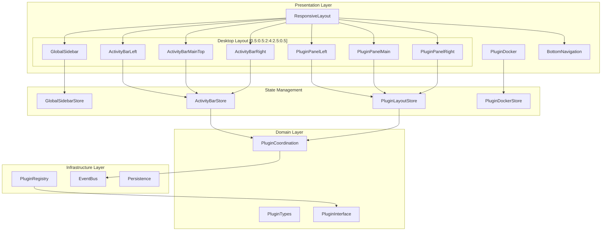
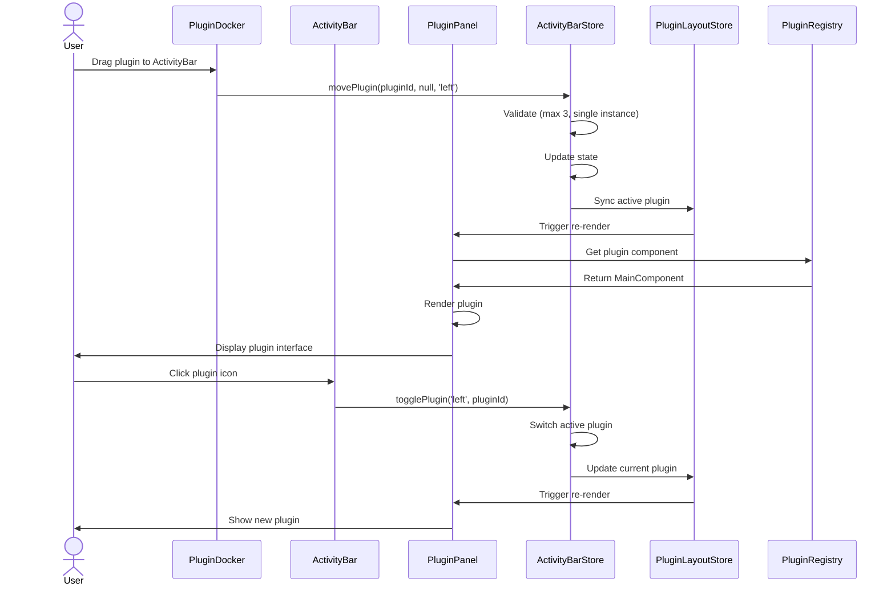

# EPIC-UXUI-04-R2: True Plugin Layout Architecture
## Detailed Technical Specification

**Version:** 2.0.0  
**Status:** DRAFT  
**Date:** 2026-01-30  
**Author:** architect-ext  
**Classification:** Architecture Specification

---

## 📋 EXECUTIVE SUMMARY

This document provides comprehensive technical specifications for EPIC-UXUI-04-R2, a corrective epic that implements the true plugin layout architecture as originally specified. The current implementation (EPIC-UXUI-03) created a generic plugin system that does not match the required 3-bar architecture with specific grid ratios.

### Key Requirements
- **3 Activity Bars**: Left (0.5), Main-Top (4), Right (0.5) with specific behaviors
- **Grid Layout**: [0.5:0.5:2:4:2.5:0.5] for desktop
- **Plugin Docker**: Source of plugins, not destination
- **Single Instance Rule**: No duplicate plugins across bars
- **Toggle Behavior**: Single click/tap switches plugins within a bar
- **Max 3 Plugins Per Bar**: 9 total maximum
- **Responsive Design**: Desktop, tablet landscape, tablet portrait, mobile

### Critical Design Decisions
1. **Zustand v5** for state management with project-specific persistence
2. **CSS Grid** for layout (not JS calculations) for 60fps performance
3. **8-bit Design System** compliance (sharp corners, pixel shadows)
4. **ActivityBarMainTop** integrated into PluginPanelMain (not separate)
5. **PluginDocker** as collapsible sidebar (not floating panel)

---

## 🏗️ 1. ARCHITECTURE OVERVIEW

### 1.1 System Architecture Diagram



### 1.2 Component Hierarchy

```
ResponsiveLayout (Root)
├── DesktopLayout
│   ├── GlobalSidebar (0.5 width)
│   ├── ActivityBarLeft (0.5 width)
│   ├── PluginPanelLeft (2 width)
│   │   └── PluginRenderer (active plugin from left bar)
│   ├── PluginPanelMain (4 width)
│   │   ├── ActivityBarMainTop (horizontal, inside main)
│   │   └── PluginRenderer (active plugin from main-top bar)
│   ├── PluginPanelRight (2.5 width)
│   │   └── PluginRenderer (active plugin from right bar)
│   └── ActivityBarRight (0.5 width)
├── TabletLandscapeLayout
│   └── [Adjusted ratios: 0.5:0.5:3:4:2:0.5]
├── SinglePanelLayout (Tablet Portrait & Mobile)
│   ├── PluginPanelMain
│   └── BottomNavigation
└── PluginDocker (Overlay/Sidebar)
    └── PluginDockerItem[]
```

### 1.3 Data Flow Diagram



### 1.4 Integration Points

| Integration | Source | Target | Protocol |
|-------------|--------|--------|----------|
| Plugin Coordination | EPIC-0.6 | ActivityBarStore | Context API |
| File Events | FileTree | Monaco/Notes | EventBus |
| WebContainer | Terminal | Preview | Custom Events |
| Persistence | All Stores | localStorage | Zustand Persist |
| Project Context | ProjectStore | All Layout Stores | localStorage |

---

## 🧩 2. COMPONENT SPECIFICATIONS

### 2.1 GlobalSidebar

**Purpose:** Auto-collapsible global navigation sidebar with icons and tooltips

**File:** `src/presentation/components/layout/GlobalSidebar.tsx`

**Props Interface:**
```typescript
interface GlobalSidebarProps {
  className?: string;
  navItems?: SidebarNavItem[];
  bottomItems?: SidebarNavItem[];
  showWorkspaceSelector?: boolean;
  onWorkspaceChange?: (workspaceId: string) => void;
}

interface SidebarNavItem {
  id: string;
  label: string;
  icon: React.ComponentType<{ size?: number; className?: string }>;
  path: string;
  badge?: number;
  disabled?: boolean;
}
```

**State Requirements:**
- `collapsed: boolean` - Current collapse state
- `mobileOpen: boolean` - Mobile overlay state
- Persisted in `GlobalSidebarStore`

**Event Handlers:**
- `onToggleCollapse()` - Toggle collapsed state
- `onNavItemClick(id: string)` - Handle navigation
- `onMobileClose()` - Close mobile overlay

**CSS Requirements (8-bit Design):**
```css
.global-sidebar {
  width: var(--sidebar-expanded-width, 240px);
  border-right: 2px solid var(--color-border);
  background: var(--color-surface);
  border-radius: 0; /* Sharp corners */
}

.global-sidebar--collapsed {
  width: var(--sidebar-collapsed-width, 48px);
}

.global-sidebar__item {
  padding: 12px;
  border: 2px solid transparent;
  transition: none; /* No smooth transitions for 8-bit */
}

.global-sidebar__item:hover {
  background: var(--color-surface-hover);
  border-color: var(--color-border);
  box-shadow: 4px 4px 0 0 var(--color-shadow); /* Pixel shadow */
}
```

**Responsive Behavior:**
- Desktop: Collapsible (48px ↔ 240px)
- Tablet: Auto-collapsed, overlay on expand
- Mobile: Hidden, hamburger menu opens overlay

---

### 2.2 ActivityBarLeft

**Purpose:** Vertical activity bar for left plugin panel (max 3 plugins)

**File:** `src/presentation/components/layout/ActivityBarLeft.tsx`

**Props Interface:**
```typescript
interface ActivityBarLeftProps extends ActivityBarBaseProps {
  plugins?: PluginId[];
  activePluginId?: PluginId | null;
  onPluginClick?: (pluginId: PluginId) => void;
}

interface ActivityBarBaseProps {
  className?: string;
  orientation?: 'vertical' | 'horizontal';
}
```

**State Requirements:**
- Uses `useActivityBarLeft()` hook
- Reads from `ActivityBarStore`
- No local state (pure presentational)

**Event Handlers:**
- `onPluginClick(pluginId: PluginId)` - Toggle plugin visibility
- `onPluginDragStart(pluginId: PluginId)` - Initiate drag
- `onPluginDragEnd()` - Complete drag

**CSS Requirements:**
```css
.activity-bar-left {
  width: 48px; /* 0.5 grid unit */
  display: flex;
  flex-direction: column;
  background: var(--color-surface);
  border-right: 2px solid var(--color-border);
}

.activity-bar-left__item {
  width: 40px;
  height: 40px;
  margin: 4px;
  border: 2px solid var(--color-border);
  background: var(--color-surface);
  cursor: pointer;
  display: flex;
  align-items: center;
  justify-content: center;
}

.activity-bar-left__item--active {
  background: var(--color-primary);
  border-color: var(--color-primary-border);
  box-shadow: 4px 4px 0 0 var(--color-shadow);
}

.activity-bar-left__indicator {
  position: absolute;
  left: 0;
  width: 4px;
  height: 100%;
  background: var(--color-accent);
}
```

**Integration:**
- Connected to `ActivityBarStore` via `useActivityBarLeft()`
- Triggers plugin toggle in `PluginPanelLeft`
- Accepts drag-drop from `PluginDocker`

---

### 2.3 ActivityBarMainTop

**Purpose:** Horizontal activity bar integrated into main panel

**File:** `src/presentation/components/layout/ActivityBarMainTop.tsx`

**Props Interface:**
```typescript
interface ActivityBarMainTopProps extends ActivityBarBaseProps {
  plugins?: PluginId[];
  activePluginId?: PluginId | null;
  onPluginClick?: (pluginId: PluginId) => void;
}
```

**Key Difference:**
- Horizontal orientation (not vertical)
- Sits INSIDE PluginPanelMain (not separate column)
- Default plugin: `notes`
- PC users can also load `monaco` here

**CSS Requirements:**
```css
.activity-bar-main-top {
  height: 48px;
  display: flex;
  flex-direction: row;
  background: var(--color-surface);
  border-bottom: 2px solid var(--color-border);
  padding: 0 8px;
}

.activity-bar-main-top__item {
  min-width: 80px;
  height: 40px;
  margin: 4px;
  padding: 0 12px;
  border: 2px solid var(--color-border);
  display: flex;
  align-items: center;
  gap: 8px;
}

.activity-bar-main-top__item--active {
  background: var(--color-primary);
  box-shadow: 4px 4px 0 0 var(--color-shadow);
}
```

---

### 2.4 ActivityBarRight

**Purpose:** Vertical activity bar for right plugin panel (max 3 plugins)

**File:** `src/presentation/components/layout/ActivityBarRight.tsx`

**Props Interface:**
```typescript
interface ActivityBarRightProps extends ActivityBarBaseProps {
  plugins?: PluginId[];
  activePluginId?: PluginId | null;
  onPluginClick?: (pluginId: PluginId) => void;
}
```

**Implementation:**
- Mirror of ActivityBarLeft
- Positioned on right side
- Default plugin: `chat`

---

### 2.5 PluginPanelLeft

**Purpose:** Left plugin panel (2 grid units) - renders active plugin from left bar

**File:** `src/presentation/components/layout/PluginPanelLeft.tsx`

**Props Interface:**
```typescript
interface PluginPanelLeftProps {
  className?: string;
}
```

**State Requirements:**
- Reads `activePluginId` from `ActivityBarStore.left`
- Gets plugin component from `PluginRegistry`

**CSS Requirements:**
```css
.plugin-panel-left {
  flex: 2; /* 2 grid units */
  min-width: 240px;
  background: var(--color-background);
  border-right: 2px solid var(--color-border);
  overflow: hidden;
  display: flex;
  flex-direction: column;
}

.plugin-panel-left__content {
  flex: 1;
  overflow: auto;
  padding: 8px;
}
```

**Plugin Rendering:**
```typescript
// Pseudo-code
const activePluginId = useActivityBarStore(selectLeftBar).activePluginId;
const plugin = pluginRegistry.get(activePluginId);
const PluginComponent = plugin.MainComponent;

return (
  <div className="plugin-panel-left">
    <PluginComponent width={0} height={0} />
  </div>
);
```

---

### 2.6 PluginPanelMain

**Purpose:** Main plugin panel (4 grid units) with integrated ActivityBarMainTop

**File:** `src/presentation/components/layout/PluginPanelMain.tsx`

**Props Interface:**
```typescript
interface PluginPanelMainProps {
  className?: string;
  showActivityBar?: boolean;
}
```

**Structure:**
```
PluginPanelMain
├── ActivityBarMainTop (horizontal bar)
└── PluginContent (active plugin from main-top bar)
```

**CSS Requirements:**
```css
.plugin-panel-main {
  flex: 4; /* 4 grid units */
  min-width: 480px;
  background: var(--color-background);
  display: flex;
  flex-direction: column;
}

.plugin-panel-main__activity-bar {
  flex-shrink: 0;
}

.plugin-panel-main__content {
  flex: 1;
  overflow: auto;
  position: relative;
}
```

---

### 2.7 PluginPanelRight

**Purpose:** Right plugin panel (2.5 grid units) - renders active plugin from right bar

**File:** `src/presentation/components/layout/PluginPanelRight.tsx`

**Props Interface:**
```typescript
interface PluginPanelRightProps {
  className?: string;
}
```

**CSS Requirements:**
```css
.plugin-panel-right {
  flex: 2.5; /* 2.5 grid units */
  min-width: 300px;
  background: var(--color-background);
  border-left: 2px solid var(--color-border);
  overflow: hidden;
  display: flex;
  flex-direction: column;
}
```

---

### 2.8 PluginDocker

**Purpose:** Collapsible panel showing available plugins (filtered by device)

**File:** `src/presentation/components/layout/PluginDocker.tsx`

**Props Interface:**
```typescript
interface PluginDockerProps {
  className?: string;
  onExpandedChange?: (isExpanded: boolean) => void;
  onPluginDragStart?: (plugin: DockerPluginDefinition) => void;
  onPluginDragEnd?: () => void;
}

interface DockerPluginDefinition {
  id: PluginId;
  name: string;
  icon: LucideIcon;
  availability: 'always' | 'pc_only';
  description?: string;
  shortcut?: string;
}
```

**State Requirements:**
- `isExpanded: boolean` - Collapse state
- `isDragging: boolean` - Drag state
- `draggedPlugin: DockerPluginDefinition | null` - Current drag

**Key Behaviors:**
1. Shows ALL plugins filtered by device type
2. Hides plugins already in activity bars
3. Acts as drag SOURCE (not destination)
4. PC-only plugins hidden on non-PC devices

**CSS Requirements:**
```css
.plugin-docker {
  width: 240px; /* Expanded */
  background: var(--color-surface);
  border-left: 2px solid var(--color-border);
  display: flex;
  flex-direction: column;
  transition: width 0.2s steps(5, end); /* 8-bit animation */
}

.plugin-docker--collapsed {
  width: 48px;
}

.plugin-docker__item {
  padding: 12px;
  border: 2px solid var(--color-border);
  margin: 4px 8px;
  display: flex;
  align-items: center;
  gap: 12px;
  cursor: grab;
}

.plugin-docker__item:hover {
  background: var(--color-surface-hover);
  box-shadow: 4px 4px 0 0 var(--color-shadow);
}

.plugin-docker__item--dragging {
  opacity: 0.5;
  cursor: grabbing;
}
```

---

### 2.9 ResponsiveLayout

**Purpose:** Main layout wrapper that switches between responsive variants

**File:** `src/presentation/components/layout/ResponsiveLayout.tsx`

**Props Interface:**
```typescript
interface ResponsiveLayoutProps {
  children?: React.ReactNode;
  className?: string;
  onBreakpointChange?: (breakpoint: Breakpoint) => void;
  onLayoutModeChange?: (mode: LayoutMode) => void;
}

type Breakpoint = 'desktop' | 'tabletLandscape' | 'tabletPortrait' | 'mobile';
type LayoutMode = 'desktop' | 'tablet' | 'mobile';
```

**State Requirements:**
- `breakpoint: Breakpoint` - Current breakpoint
- `layoutMode: LayoutMode` - Current layout mode
- `isTransitioning: boolean` - Transition state

**Layout Variants:**

| Breakpoint | Grid | Layout |
|------------|------|--------|
| Desktop (≥1024px) | [0.5:0.5:2:4:2.5:0.5] | Full 6-column |
| Tablet Landscape (768-1023px) | [0.5:0.5:3:4:2:0.5] | Adjusted ratios |
| Tablet Portrait (600-767px) | Single panel | Bottom nav |
| Mobile (<600px) | Single panel | Bottom nav |

**CSS Requirements:**
```css
.responsive-layout {
  width: 100vw;
  height: 100vh;
  overflow: hidden;
  display: flex;
}

.responsive-layout__desktop {
  display: flex;
  width: 100%;
  height: 100%;
}

.responsive-layout__tablet-landscape {
  display: flex;
  width: 100%;
  height: 100%;
}

.responsive-layout__single-panel {
  display: flex;
  flex-direction: column;
  width: 100%;
  height: 100%;
}
```

---

### 2.10 Hooks Specifications

#### useActivityBar

**File:** `src/presentation/hooks/useActivityBar.ts`

**Return Interface:**
```typescript
interface UseActivityBarReturn {
  state: {
    left: ActivityBarState;
    mainTop: ActivityBarState;
    right: ActivityBarState;
  };
  setBarPlugins: (position: ActivityBarPosition, plugins: PluginId[]) => void;
  setActivePlugin: (position: ActivityBarPosition, pluginId: PluginId | null) => void;
  togglePlugin: (position: ActivityBarPosition, pluginId: PluginId) => void;
  movePlugin: (pluginId: PluginId, from: ActivityBarPosition, to: ActivityBarPosition) => void;
  isPluginActive: (pluginId: PluginId) => boolean;
  getPluginBar: (pluginId: PluginId) => ActivityBarPosition | null;
  isBarFull: (position: ActivityBarPosition) => boolean;
}
```

**Usage:**
```typescript
const { state, togglePlugin, movePlugin } = useActivityBar();

// Toggle plugin in left bar
togglePlugin('left', 'filetree');

// Move plugin from left to right
movePlugin('filetree', 'left', 'right');
```

#### usePluginDocker

**File:** `src/presentation/hooks/usePluginDocker.ts`

**Return Interface:**
```typescript
interface UsePluginDockerReturn {
  state: PluginDockerState;
  toggleExpanded: () => void;
  setExpanded: (expanded: boolean) => void;
  getAvailablePlugins: () => DockerPluginDefinition[];
  isPluginAvailableOnDevice: (pluginId: PluginId) => boolean;
  isPluginInActivityBar: (pluginId: PluginId) => boolean;
  getFilteredPlugins: () => DockerPluginDefinition[];
}
```

#### useResponsiveLayout

**File:** `src/presentation/hooks/useResponsiveLayout.ts`

**Return Interface:**
```typescript
interface UseResponsiveLayoutReturn {
  breakpoint: Breakpoint;
  layoutMode: LayoutMode;
  isTransitioning: boolean;
  layoutConfig: LayoutConfig;
  visiblePlugins: PluginId[];
}
```

---

## 🗄️ 3. STATE MANAGEMENT SPECIFICATION

### 3.1 Zustand Store Architecture

```mermaid
graph TB
    subgraph "ActivityBarStore"
        ABS_STATE[State Slice]
        ABS_ACTIONS[Actions Slice]
        
        subgraph "State"
            LEFT[left: {plugins, activePluginId}]
            MAINTOP[mainTop: {plugins, activePluginId}]
            RIGHT[right: {plugins, activePluginId}]
            HYDRATED[_hasHydrated]
        end
        
        subgraph "Actions"
            SETBAR[setBarPlugins]
            SETACTIVE[setActivePlugin]
            TOGGLE[togglePlugin]
            MOVE[movePlugin]
            ADD[addPluginToBar]
            REMOVE[removePluginFromBar]
        end
    end
    
    subgraph "PluginLayoutStore"
        PLS[Existing Store]
    end
    
    subgraph "PluginDockerStore"
        PDS[Local State]
    end
    
    subgraph "Persistence"
        LS[localStorage]
        PS[Project-Specific Keys]
    end
    
    ABS_STATE --> LS
    ABS_ACTIONS --> ABS_STATE
    PLS --> LS
    PDS -.-> LS
    LS --> PS
```

### 3.2 ActivityBarStore Structure

**File:** `src/infrastructure/persistence/stores/activity-bar/index.ts`

**State Interface:**
```typescript
interface ActivityBarState {
  // State
  _hasHydrated: boolean;
  left: {
    plugins: PluginId[];
    activePluginId: PluginId | null;
  };
  mainTop: {
    plugins: PluginId[];
    activePluginId: PluginId | null;
  };
  right: {
    plugins: PluginId[];
    activePluginId: PluginId | null;
  };
  
  // Actions
  setHasHydrated: (value: boolean) => void;
  resetToDefaults: () => void;
  setBarPlugins: (position: ActivityBarPosition, plugins: PluginId[]) => void;
  setActivePlugin: (position: ActivityBarPosition, pluginId: PluginId | null) => void;
  togglePlugin: (position: ActivityBarPosition, pluginId: PluginId) => void;
  movePlugin: (pluginId: PluginId, from: ActivityBarPosition, to: ActivityBarPosition) => void;
  addPluginToBar: (position: ActivityBarPosition, pluginId: PluginId) => boolean;
  removePluginFromBar: (position: ActivityBarPosition, pluginId: PluginId) => void;
}
```

**Default State:**
```typescript
const defaultState = {
  left: { plugins: ['filetree'], activePluginId: 'filetree' },
  mainTop: { plugins: ['notes'], activePluginId: 'notes' },
  right: { plugins: ['chat'], activePluginId: 'chat' },
};
```

**Persistence Configuration:**
```typescript
{
  name: 'activity-bar-storage',
  version: 1,
  storage: projectSpecificStorage, // Key: activity-bar-{projectId}
  onRehydrateStorage: () => (state) => {
    if (state) state.setHasHydrated(true);
  },
}
```

### 3.3 State Slices

#### State Slice

**File:** `src/infrastructure/persistence/stores/activity-bar/slices/state-slice.ts`

```typescript
export interface ActivityBarStateSlice extends ActivityBarsState {
  _hasHydrated: boolean;
  setHasHydrated: (value: boolean) => void;
  resetToDefaults: () => void;
}

const defaultState: ActivityBarsState = {
  left: { plugins: ['filetree'], activePluginId: 'filetree' },
  mainTop: { plugins: ['notes'], activePluginId: 'notes' },
  right: { plugins: ['chat'], activePluginId: 'chat' },
};
```

#### Actions Slice

**File:** `src/infrastructure/persistence/stores/activity-bar/slices/actions-slice.ts`

**Key Actions:**

1. **setBarPlugins** - Replace all plugins in a bar
   - Enforces max 3 plugins per bar
   - Removes duplicates from other bars
   - Updates active plugin if needed

2. **togglePlugin** - Toggle plugin visibility in a bar
   - If active: deactivate (hide)
   - If inactive: activate (show)
   - Only works for plugins already in bar

3. **movePlugin** - Move plugin between bars
   - Validates source bar has plugin
   - Validates destination bar not full
   - Updates both bars atomically

4. **addPluginToBar** - Add plugin to bar (from docker)
   - Validates max 3 constraint
   - Removes from other bars (single instance)
   - Returns success/failure

### 3.4 Selectors

```typescript
// Select individual bars
export const selectLeftBar = (state: ActivityBarState) => state.left;
export const selectMainTopBar = (state: ActivityBarState) => state.mainTop;
export const selectRightBar = (state: ActivityBarState) => state.right;
export const selectHasHydrated = (state: ActivityBarState) => state._hasHydrated;

// Check if plugin is active anywhere
export const selectIsPluginActiveAnywhere = (
  state: ActivityBarState,
  pluginId: PluginId
): boolean => {
  return (
    state.left.activePluginId === pluginId ||
    state.mainTop.activePluginId === pluginId ||
    state.right.activePluginId === pluginId
  );
};

// Get which bar contains a plugin
export const selectPluginBar = (
  state: ActivityBarState,
  pluginId: PluginId
): ActivityBarPosition | null => {
  if (state.left.plugins.includes(pluginId)) return 'left';
  if (state.mainTop.plugins.includes(pluginId)) return 'main-top';
  if (state.right.plugins.includes(pluginId)) return 'right';
  return null;
};
```

### 3.5 Per-Project Isolation

**Implementation:**
```typescript
const projectSpecificStorage = {
  getItem: (name: string) => {
    const projectId = getCurrentProjectId();
    const key = projectId ? `activity-bar-${projectId}` : name;
    // ... read from localStorage
  },
  setItem: (name: string, value) => {
    const projectId = getCurrentProjectId();
    const key = projectId ? `activity-bar-${projectId}` : name;
    // ... write to localStorage
  },
};
```

**Storage Keys:**
- Global: `activity-bar-storage`
- Project-specific: `activity-bar-{projectId}`

---

## 🔌 4. PLUGIN SYSTEM SPECIFICATION

### 4.1 Plugin Interface

**File:** `src/domain/interfaces/feature-plugin.interface.ts`

```typescript
export interface FeaturePlugin {
  id: PluginId;
  name: string;
  icon: ReactNode;
  description: string;
  requirements: {
    storageType: 'any' | 'fsa' | 'indexeddb';
    deviceType: 'any' | 'desktop' | 'mobile';
    minWidth: number;
    maxInstances: number;
  };
  MainComponent: React.ComponentType<PluginMainProps>;
  onMount?: (context: ProjectContext) => Promise<void>;
  onUnmount?: () => Promise<void>;
  onProjectChange?: (newProjectId: string) => Promise<void>;
}

export interface PluginMainProps {
  width: number;
  height: number;
}
```

### 4.2 Plugin Registry

**File:** `src/infrastructure/plugins/plugin-registry.ts`

```typescript
class PluginRegistry {
  private plugins = new Map<PluginId, FeaturePlugin>();
  
  register(plugin: FeaturePlugin): void;
  unregister(pluginId: PluginId): void;
  get(pluginId: PluginId): FeaturePlugin | undefined;
  getAll(): FeaturePlugin[];
  getByCategory(category: PluginCategory): FeaturePlugin[];
  isAvailable(pluginId: PluginId, deviceType: string): boolean;
}

export const pluginRegistry = new PluginRegistry();
```

### 4.3 Device Filtering Logic

**File:** `src/presentation/hooks/usePluginDocker.ts`

```typescript
function isPCDevice(): boolean {
  if (typeof navigator === 'undefined') return true;
  const mobileRegex = /Android|webOS|iPhone|iPad|iPod|BlackBerry|IEMobile|Opera Mini/i;
  return !mobileRegex.test(navigator.userAgent);
}

const DEFAULT_PLUGINS: Record<PluginId, Omit<DockerPluginDefinition, 'id'>> = {
  filetree: { name: 'Files', icon: FolderOpen, availability: 'always' },
  notes: { name: 'Notes', icon: FileText, availability: 'always' },
  chat: { name: 'Chat', icon: MessageSquare, availability: 'always' },
  monaco: { name: 'Editor', icon: Code, availability: 'pc_only' },
  terminal: { name: 'Terminal', icon: Terminal, availability: 'pc_only' },
  agents: { name: 'Agents', icon: Bot, availability: 'always' },
  preview: { name: 'Preview', icon: Eye, availability: 'always' },
};
```

**Filtering Algorithm:**
```typescript
const getFilteredPlugins = useCallback((): DockerPluginDefinition[] => {
  return allPlugins.filter((plugin) => {
    // Must be available on current device
    if (plugin.availability === 'pc_only' && !isPC) {
      return false;
    }
    
    // Must NOT be in any activity bar
    if (assignedPlugins.has(plugin.id)) {
      return false;
    }
    
    return true;
  });
}, [allPlugins, isPC, assignedPlugins]);
```

### 4.4 Drag-and-Drop Implementation

**Libraries:** `@dnd-kit/core`, `@dnd-kit/sortable`

**Implementation Plan:**

1. **PluginDockerItem** - Drag source
```typescript
const { attributes, listeners, setNodeRef, transform } = useDraggable({
  id: plugin.id,
  data: { plugin },
});
```

2. **ActivityBar** - Drop target
```typescript
const { setNodeRef, isOver } = useDroppable({
  id: `activity-bar-${position}`,
  data: { position },
});
```

3. **DragOverlay** - Visual feedback
```typescript
<DragOverlay>
  {activePlugin ? <PluginDockerItem plugin={activePlugin} isDragging /> : null}
</DragOverlay>
```

**Constraints:**
- Max 3 plugins per bar
- Single instance across all bars
- Visual feedback during drag
- Touch support for mobile

### 4.5 Plugin Coordination Integration

**File:** `src/presentation/hooks/usePluginCoordination.ts`

**Integration Points:**
1. Write-lock mechanism per plugin
2. File open tracking across plugins
3. Plugin capability interface enforcement
4. Graceful fallback for unsupported operations

**Usage in ActivityBar:**
```typescript
const { registerPlugin, unregisterPlugin } = usePluginCoordination();

useEffect(() => {
  if (activePluginId) {
    registerPlugin(activePluginId);
    return () => unregisterPlugin(activePluginId);
  }
}, [activePluginId]);
```

---

## 📱 5. RESPONSIVE DESIGN SPECIFICATION

### 5.1 Breakpoint Definitions

```typescript
const BREAKPOINTS = {
  mobile: { max: 599 },
  tabletPortrait: { min: 600, max: 767 },
  tabletLandscape: { min: 768, max: 1023 },
  desktop: { min: 1024, max: 1439 },
  wide: { min: 1440 },
} as const;
```

### 5.2 Layout Transformations

#### Desktop (≥1024px)
```
Grid: [0.5:0.5:2:4:2.5:0.5]
┌─────┬─────┬───────────┬────────────────────┬──────────┬─────┐
│Glob │ Act │  Plugin   │      Main-Top      │  Plugin  │ Act │
│Side │ Bar │  Panel    │    Activity Bar    │  Panel   │ Bar │
│(col)│(L)  │  (File)   │    (Notes default) │  (Chat)  │(R)  │
└─────┴─────┴───────────┴────────────────────┴──────────┴─────┘
```

#### Tablet Landscape (768-1023px)
```
Grid: [0.5:0.5:3:4:2:0.5]
┌─────┬─────┬───────────┬────────────────────┬──────────┬─────┐
│Glob │ Act │  Plugin   │      Main-Top      │  Plugin  │ Act │
│Side │ Bar │  Panel    │    Activity Bar    │  Panel   │ Bar │
│(col)│(L)  │  (File)   │    (Notes default) │  (Chat)  │(R)  │
└─────┴─────┴───────────┴────────────────────┴──────────┴─────┘
```

#### Tablet Portrait (600-767px)
```
Layout: Single panel + bottom nav
┌─────────────────────────────────────────────┐
│                                             │
│              PluginPanelMain                │
│           (Active plugin only)              │
│                                             │
├─────────────────────────────────────────────┤
│  [File]  [Notes]  [Chat]  [More...]        │
└─────────────────────────────────────────────┘
```

#### Mobile (<600px)
```
Layout: Single panel + bottom nav (compact)
┌─────────────────────────────────────────────┐
│                                             │
│              PluginPanelMain                │
│           (Active plugin only)              │
│                                             │
├─────────────────────────────────────────────┤
│ [F] [N] [C] [...]                          │
└─────────────────────────────────────────────┘
```

### 5.3 Responsive CSS Strategy

```css
/* Desktop (default) */
.responsive-layout__desktop {
  display: flex;
}

/* Tablet Landscape */
@media (max-width: 1023px) {
  .responsive-layout__panel-left {
    flex: 3; /* Increased from 2 */
  }
  .responsive-layout__panel-right {
    flex: 2; /* Decreased from 2.5 */
  }
}

/* Tablet Portrait & Mobile */
@media (max-width: 767px) {
  .responsive-layout__desktop,
  .responsive-layout__tablet-landscape {
    display: none;
  }
  
  .responsive-layout__single-panel {
    display: flex;
  }
}
```

### 5.4 Breakpoint Detection Hook

```typescript
export function useBreakpoint(): Breakpoint {
  const [breakpoint, setBreakpoint] = useState<Breakpoint>('desktop');
  
  useEffect(() => {
    const handleResize = () => {
      const width = window.innerWidth;
      if (width < 600) setBreakpoint('mobile');
      else if (width < 768) setBreakpoint('tabletPortrait');
      else if (width < 1024) setBreakpoint('tabletLandscape');
      else setBreakpoint('desktop');
    };
    
    window.addEventListener('resize', handleResize);
    handleResize();
    
    return () => window.removeEventListener('resize', handleResize);
  }, []);
  
  return breakpoint;
}
```

---

## ✅ 6. ACCEPTANCE CRITERIA

### 6.1 Functional Criteria

| ID | Criterion | Priority | Verification |
|----|-----------|----------|--------------|
| F-01 | Global sidebar auto-collapses to 48px with icons | P0 | Visual test |
| F-02 | Sidebar tooltips appear on hover (desktop) / tap (mobile) | P0 | Manual test |
| F-03 | Sidebar expansion affects main interface sizing | P0 | Visual test |
| F-04 | All 3 activity bars render in correct positions | P0 | Visual test |
| F-05 | Activity bars accept drag-drop from docker | P0 | E2E test |
| F-06 | Max 3 plugins per bar enforced (9 total max) | P0 | Unit test |
| F-07 | Single instance rule enforced across all bars | P0 | Unit test |
| F-08 | Docker shows available plugins filtered by device | P0 | Unit test |
| F-09 | Plugins in bars are hidden from docker | P0 | Unit test |
| F-10 | Single click/tap toggles between same-bar plugins | P0 | E2E test |
| F-11 | Desktop layout matches [0.5:0.5:2:4:2.5:0.5] grid | P0 | Visual test |
| F-12 | Tablet landscape layout adjusts ratios correctly | P1 | Visual test |
| F-13 | Tablet portrait shows single panel + bottom nav | P1 | Visual test |
| F-14 | Mobile shows simplified layout | P1 | Visual test |
| F-15 | Real plugins load (FileTree, Monaco, Notes, Chat) | P0 | E2E test |
| F-16 | PC-only plugins (Monaco, Terminal) hidden on non-PC | P1 | Unit test |
| F-17 | Plugin state preserved when toggled off/on | P1 | E2E test |
| F-18 | Per-project layout isolation works | P1 | E2E test |

### 6.2 Non-Functional Criteria

| ID | Criterion | Target | Verification |
|----|-----------|--------|--------------|
| NF-01 | 8-bit design compliance | 100% | Visual review |
| NF-02 | Performance (no jank) | 60fps | Chrome DevTools |
| NF-03 | Accessibility (WCAG 2.1 AA) | Pass | axe-core |
| NF-04 | TypeScript strict mode | 0 errors | `pnpm typecheck:fast` |
| NF-05 | File size limits | <300 LOC | `pnpm governance:size` |
| NF-06 | Import path compliance | 0 violations | `pnpm governance:imports` |
| NF-07 | Test coverage | >80% | `pnpm test:fast` |
| NF-08 | Build success | Pass | `pnpm build` |

### 6.3 8-Bit Design Compliance Checklist

- [ ] All corners use `border-radius: 0` or `2px` max
- [ ] Shadows use `box-shadow: 4px 4px 0 0` pattern
- [ ] No `backdrop-filter: blur()` usage
- [ ] No `opacity` values < 1 (use solid colors)
- [ ] Animations use `steps(N, end)` timing
- [ ] No gradients (solid colors only)
- [ ] Borders are 2px solid
- [ ] Pixel-perfect icon alignment

---

## 🔍 7. VALIDATION CHECKLIST

### 7.1 Code Review Requirements

**Before merging each story:**
- [ ] Code follows project conventions (AGENTS.md)
- [ ] All TypeScript types are explicit (no `any`)
- [ ] Components are <300 lines (extract hooks if needed)
- [ ] useShallow used for all Zustand selectors
- [ ] Error boundaries implemented for plugin panels
- [ ] i18n strings extracted (EN + VI)
- [ ] JSDoc comments for all public APIs

### 7.2 Adversarial Review Requirements

**Security & Edge Cases:**
- [ ] XSS prevention in plugin names/descriptions
- [ ] LocalStorage quota exceeded handling
- [ ] Corrupted state recovery
- [ ] Plugin ID validation (prevent injection)
- [ ] Drag-drop validation (prevent invalid drops)
- [ ] Race condition handling (rapid toggles)

### 7.3 Browser Testing Requirements

| Browser | Desktop | Tablet | Mobile |
|---------|---------|--------|--------|
| Chrome | ✅ | ✅ | ✅ |
| Firefox | ✅ | ⚠️ | ⚠️ |
| Safari | ✅ | ✅ | ✅ |
| Edge | ✅ | N/A | N/A |

**Test Scenarios:**
1. Resize from desktop to mobile and back
2. Drag plugin between all 3 bars
3. Toggle plugins rapidly
4. Refresh page (state persistence)
5. Switch projects (isolation)
6. Offline mode (graceful degradation)

### 7.4 Governance Check Requirements

```bash
# Run before each story completion
pnpm typecheck:fast    # Must pass
pnpm test:fast         # Must pass  
pnpm governance        # Must pass
pnpm build             # Must pass
```

---

## 📊 8. SUCCESS METRICS

### 8.1 Completion Criteria

| Metric | Target | Measurement |
|--------|--------|-------------|
| Acceptance criteria met | 100% | Checklist |
| TypeScript errors | 0 | `pnpm typecheck:fast` |
| Governance violations | 0 | `pnpm governance` |
| Test coverage | >80% | `pnpm test:fast --coverage` |
| Build success | Pass | `pnpm build` |
| Browser tests | Pass | Manual + E2E |
| User requirements | 100% | Spec comparison |

### 8.2 Performance Targets

| Metric | Target | Worst Case |
|--------|--------|------------|
| First paint | <1s | <2s |
| Layout shift | 0 | <0.1 |
| Resize FPS | 60 | 30 |
| Plugin toggle | <100ms | <300ms |
| Drag-drop latency | <50ms | <100ms |

### 8.3 Quality Gates

**Between Each Story:**
1. Code review (clean code standards)
2. Build verification
3. Status update
4. **Approval to proceed**

**Final Gate:**
- All acceptance criteria met
- No TypeScript errors
- No governance violations
- Performance targets met
- Documentation complete

---

## ⚠️ 9. RISK ANALYSIS

### 9.1 Integration Risks

| Risk | Likelihood | Impact | Mitigation |
|------|------------|--------|------------|
| Plugin coordination conflicts | Medium | High | Use EPIC-0.6 context |
| State synchronization issues | Medium | High | Zustand + useShallow |
| Drag-drop library conflicts | Low | Medium | Test @dnd-kit thoroughly |
| Responsive layout jank | Medium | High | CSS Grid (not JS) |
| Persistence corruption | Low | High | Validation + defaults |

### 9.2 Performance Risks

| Risk | Likelihood | Impact | Mitigation |
|------|------------|--------|------------|
| Re-render cascades | Medium | High | useShallow, memoization |
| Plugin memory leaks | Medium | Medium | Proper cleanup in useEffect |
| Large bundle size | Low | Medium | Code splitting |
| Resize observer thrashing | Low | Medium | Debounce resize handlers |

### 9.3 Complexity Risks

| Risk | Likelihood | Impact | Mitigation |
|------|------------|--------|------------|
| State management complexity | High | Medium | Clear slice separation |
| Plugin interface changes | Medium | High | Versioned interfaces |
| Responsive logic complexity | Medium | Medium | Breakpoint hook abstraction |
| CSS specificity wars | Medium | Low | CSS Modules or BEM |

### 9.4 Mitigation Strategies

1. **Archive-First Approach**: Keep old components until new ones verified
2. **Incremental Implementation**: One story at a time, full validation
3. **Daily Checkpoints**: Catch issues early
4. **Comprehensive Testing**: Unit + integration + E2E
5. **Performance Budget**: Monitor bundle size and render times

---

## 🚀 10. IMPLEMENTATION PHASES

### Phase 1: Core Layout Components (Stories 1-2)
**Duration:** 2-3 days
**Stories:** UXUI-04-01, UXUI-04-02

**Deliverables:**
- Archive manifest complete
- GlobalSidebar component
- Basic responsive layout structure

**Validation:**
- Build passes
- Sidebar collapses/expands
- No console errors

### Phase 2: Activity Bars (Story 3)
**Duration:** 2-3 days
**Story:** UXUI-04-03

**Deliverables:**
- ActivityBarLeft component
- ActivityBarMainTop component
- ActivityBarRight component
- ActivityBarStore with persistence

**Validation:**
- All 3 bars render correctly
- Toggle behavior works
- State persists on refresh

### Phase 3: Plugin Panels (Story 5)
**Duration:** 2-3 days
**Story:** UXUI-04-05

**Deliverables:**
- PluginPanelLeft component
- PluginPanelMain component
- PluginPanelRight component
- Plugin rendering integration

**Validation:**
- Real plugins load in panels
- Toggle switches plugins
- State preserved when hidden

### Phase 4: Docker and Drag-Drop (Stories 4, 6)
**Duration:** 3-4 days
**Stories:** UXUI-04-04, UXUI-04-06

**Deliverables:**
- PluginDocker component
- Drag-drop implementation
- Device filtering
- Single instance enforcement

**Validation:**
- Drag from docker to bars works
- Max 3 per bar enforced
- Device filtering works

### Phase 5: Responsive Layouts (Story 7)
**Duration:** 2-3 days
**Story:** UXUI-04-07

**Deliverables:**
- Desktop layout
- Tablet landscape layout
- Tablet portrait layout
- Mobile layout
- BottomNavigation component

**Validation:**
- All breakpoints work
- Smooth transitions
- Plugin assignments preserved

### Phase 6: Integration and Testing (Stories 8-10)
**Duration:** 3-4 days
**Stories:** UXUI-04-08, UXUI-04-09, UXUI-04-10

**Deliverables:**
- Plugin coordination integration
- Persistence finalization
- E2E tests
- Performance validation
- Documentation

**Validation:**
- All user flows work
- Performance targets met
- All acceptance criteria met

---

## 📁 11. FILE STRUCTURE

### New Files to Create

```
src/
├── presentation/
│   ├── components/
│   │   └── layout/
│   │       ├── GlobalSidebar.tsx           # [NEW]
│   │       ├── GlobalSidebar.css           # [NEW]
│   │       ├── GlobalSidebarNavItem.tsx    # [NEW]
│   │       ├── GlobalSidebarTooltip.tsx    # [NEW]
│   │       ├── ActivityBarLeft.tsx         # [NEW]
│   │       ├── ActivityBarLeft.css         # [NEW]
│   │       ├── ActivityBarMainTop.tsx      # [NEW]
│   │       ├── ActivityBarMainTop.css      # [NEW]
│   │       ├── ActivityBarRight.tsx        # [NEW]
│   │       ├── ActivityBarRight.css        # [NEW]
│   │       ├── PluginPanelLeft.tsx         # [NEW]
│   │       ├── PluginPanelLeft.css         # [NEW]
│   │       ├── PluginPanelMain.tsx         # [NEW]
│   │       ├── PluginPanelMain.css         # [NEW]
│   │       ├── PluginPanelRight.tsx        # [NEW]
│   │       ├── PluginPanelRight.css        # [NEW]
│   │       ├── PluginDocker.tsx            # [NEW]
│   │       ├── PluginDocker.css            # [NEW]
│   │       ├── PluginDockerItem.tsx        # [NEW]
│   │       ├── ResponsiveLayout.tsx        # [NEW]
│   │       ├── ResponsiveLayout.css        # [NEW]
│   │       ├── BottomNavigation.tsx        # [NEW]
│   │       ├── BottomNavigation.css        # [NEW]
│   │       ├── activity-bar-types.ts       # [NEW]
│   │       ├── docker-types.ts             # [NEW]
│   │       ├── responsive-types.ts         # [NEW]
│   │       └── types.ts                    # [NEW]
│   └── hooks/
│       ├── useActivityBar.ts               # [NEW]
│       ├── usePluginDocker.ts              # [NEW]
│       ├── useResponsiveLayout.ts          # [NEW]
│       ├── useGlobalSidebar.ts             # [NEW]
│       └── useDragAndDrop.ts               # [NEW]
├── infrastructure/
│   └── persistence/
│       └── stores/
│           └── activity-bar/
│               ├── index.ts                # [NEW]
│               ├── slices/
│               │   ├── state-slice.ts      # [NEW]
│               │   └── actions-slice.ts    # [NEW]
│               └── types.ts                # [NEW]
└── domain/
    └── types/
        └── activity-bar-types.ts           # [NEW]
```

### Files to Archive

```
_bmad-ext/.archive/epic-uxui-04/
├── ActivityBar.tsx                    # [ARCHIVE]
├── FloatingPluginDocker.tsx           # [ARCHIVE]
├── MainContentRenderer.tsx            # [ARCHIVE]
└── [other old layout components]      # [ARCHIVE]
```

---

## 🔗 12. REFERENCES

### Related Documents
- [EPIC-UXUI-04 Epic](../epics/EPIC-UXUI-04-true-plugin-layout-architecture-2026-01-30.md)
- [Phase 1A Plugin Coordination Problems](../../../docs/analysis/phase-1a-plugin-coordination-problems-2026-01-27.md)
- [EPIC-0.6 Plugin Coordination](../epics/EPIC-0.6-plugin-coordination-layer.md)
- [AGENTS.md](../../../../AGENTS.md)
- [8-Bit Design System](../../../design/8-bit-design-system.md)

### External References
- [Zustand Documentation](https://docs.pmnd.rs/zustand)
- [@dnd-kit Documentation](https://dndkit.com/)
- [CSS Grid Guide](https://css-tricks.com/snippets/css/complete-guide-grid/)
- [WCAG 2.1 Guidelines](https://www.w3.org/WAI/WCAG21/quickref/)

---

## 📝 13. APPENDICES

### Appendix A: TypeScript Interfaces

```typescript
// Complete type definitions for reference

// Activity Bar Types
interface ActivityBarState {
  plugins: PluginId[];
  activePluginId: PluginId | null;
}

interface ActivityBarsState {
  left: ActivityBarState;
  mainTop: ActivityBarState;
  right: ActivityBarState;
}

type ActivityBarPosition = 'left' | 'main-top' | 'right';

interface ActivityBarBaseProps {
  className?: string;
  orientation?: 'vertical' | 'horizontal';
}

// Docker Types
interface DockerPluginDefinition {
  id: PluginId;
  name: string;
  icon: LucideIcon;
  availability: 'always' | 'pc_only';
  description?: string;
  shortcut?: string;
}

interface PluginDockerState {
  isExpanded: boolean;
  expandedWidth: number;
  availablePlugins: DockerPluginDefinition[];
}

// Responsive Types
type Breakpoint = 'desktop' | 'tabletLandscape' | 'tabletPortrait' | 'mobile';
type LayoutMode = 'desktop' | 'tablet' | 'mobile';

interface LayoutConfig {
  maxPlugins: number;
  layoutMode: string;
  sidebarMode: 'overlay' | 'collapsible' | 'persistent';
  showBottomNav: boolean;
}
```

### Appendix B: CSS Variables

```css
:root {
  /* Layout */
  --sidebar-collapsed-width: 48px;
  --sidebar-expanded-width: 240px;
  --activity-bar-width: 48px;
  --docker-collapsed-width: 48px;
  --docker-expanded-width: 240px;
  
  /* 8-Bit Design Tokens */
  --color-background: #1a1a2e;
  --color-surface: #16213e;
  --color-surface-hover: #0f3460;
  --color-border: #e94560;
  --color-primary: #e94560;
  --color-primary-border: #ff6b6b;
  --color-accent: #00fff5;
  --color-shadow: rgba(0, 0, 0, 0.5);
  
  /* Spacing */
  --spacing-xs: 4px;
  --spacing-sm: 8px;
  --spacing-md: 12px;
  --spacing-lg: 16px;
  --spacing-xl: 24px;
  
  /* Borders */
  --border-width: 2px;
  --border-radius: 0;
  --border-radius-sm: 2px;
  
  /* Shadows */
  --shadow-pixel: 4px 4px 0 0 var(--color-shadow);
  --shadow-pixel-sm: 2px 2px 0 0 var(--color-shadow);
}
```

### Appendix C: Testing Strategy

```typescript
// Example test structure

describe('ActivityBarLeft', () => {
  it('renders up to 3 plugins', () => {
    // Test implementation
  });
  
  it('toggles plugin on click', () => {
    // Test implementation
  });
  
  it('shows active indicator for active plugin', () => {
    // Test implementation
  });
  
  it('accepts drag-drop from docker', () => {
    // Test implementation
  });
});

describe('ActivityBarStore', () => {
  it('enforces max 3 plugins per bar', () => {
    // Test implementation
  });
  
  it('enforces single instance across bars', () => {
    // Test implementation
  });
  
  it('persists state to localStorage', () => {
    // Test implementation
  });
  
  it('isolates state per project', () => {
    // Test implementation
  });
});
```

---

## ✅ SIGN-OFF

**Document Status:** DRAFT  
**Ready for Review:** YES  
**Implementation Blocker:** NO  

**Required Approvals:**
- [ ] Technical Lead
- [ ] Product Manager
- [ ] UX Designer

**Next Steps:**
1. Review and approve specification
2. Create implementation stories
3. Begin Phase 1: Archive & Core Layout

---

*End of Technical Specification*

**Document ID:** SPEC-UXUI-04-R2-2026-01-30  
**Version:** 2.0.0  
**Last Updated:** 2026-01-30T18:00:00+07:00
