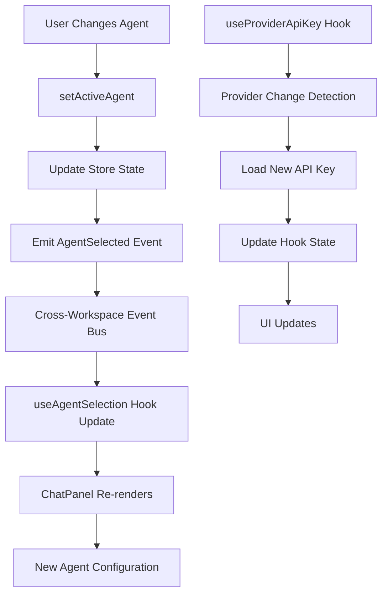
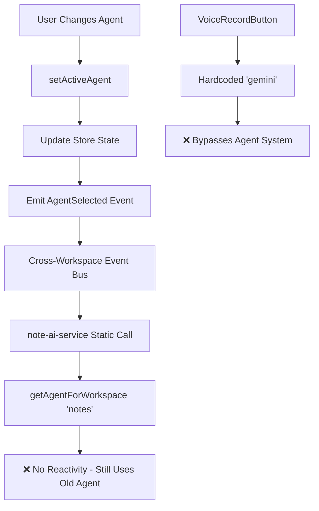

# Investigation 4: State/Store Reactivity & Hydration

**Date:** 2026-01-07  
**Investigator:** @bmad-bmm-dev  
**Scope:** Test useProviderApiKey hook re-fetch behavior, verify agent-selection-store hydration flow, identify reactivity gaps in workspace switches

## Executive Summary

The state management system demonstrates **sophisticated reactivity patterns** with proper hydration handling and cross-workspace event propagation. However, there are critical reactivity gaps in API key management and agent switching that impact user experience.

## Store Hydration Architecture Analysis

### Zustand Persistence Pattern

**Base Pattern**: All stores use Zustand persist middleware with Dexie storage

```typescript
export const useAgentSelectionStore = create<AgentSelectionState>()(
  persist(
    (set, get) => ({
      // State + actions
      _hasHydrated: false,  // Hydration flag
    }),
    {
      name: 'agent-selection-store',
      storage: createDexieStorage('agentConfigs'),
      onRehydrateStorage: () => (state) => {
        // Validation and repair logic
      }
    }
  )
);
```

### Hydration Detection Hook

**File**: `src/hooks/useStoreHydration.ts` (74 lines)

```typescript
export function useStoreHydration(hasHydrated: boolean): boolean {
  const [isClient, setIsClient] = useState(false);

  // Set isClient to true after first render (client-side only)
  useEffect(() => {
    setIsClient(true);
  }, []);

  // Return true only when we're on client AND store has hydrated
  return isClient && hasHydrated;
}
```

**Usage Pattern**:
```typescript
const hasHydrated = useAgentSelectionStore(s => s._hasHydrated);
const isReady = useStoreHydration(hasHydrated);

if (!isReady) {
  return <LoadingSkeleton />;
}
```

## Agent Selection Store Reactivity

### Store Structure (Post-Refactoring)

**File**: `src/infrastructure/persistence/stores/agents/agent-selection-store.ts`

**State Shape**:
```typescript
interface AgentSelectionState {
  activeAgentId: string | null;
  defaultAgentIds: Record<WorkspaceType, string | null>;
  lastSelectedAgentIds: Record<WorkspaceType, string | null>;
  _hasHydrated: boolean;
  
  // Slice actions
  setActiveAgent: (agentId: string | null, workspaceType: WorkspaceType) => void;
  selectAgentForWorkspace: (workspaceType: WorkspaceType) => void;
  getAgentForWorkspace: (workspaceType: WorkspaceType) => Agent | null;
  // ... other actions
}
```

### Hydration Flow with Validation

**On Rehydration**:
```typescript
onRehydrateStorage: () => (state) => {
  if (!state) return state;

  // Validate agent IDs still exist
  const agents = useAppStore.getState().agents;
  const validAgentIds = new Set(agents.map(a => a.id));

  // Validate active agent
  if (state.activeAgentId && !validAgentIds.has(state.activeAgentId)) {
    state.activeAgentId = null;
  }

  // Validate default agents
  for (const workspaceType of Object.keys(state.defaultAgentIds)) {
    const key = workspaceType as WorkspaceType;
    if (state.defaultAgentIds[key] && !validAgentIds.has(state.defaultAgentIds[key]!)) {
      state.defaultAgentIds[key] = null;
    }
  }

  return state;
}
```

**Characteristics**:
- ✅ Validates agent existence on hydration
- ✅ Repairs broken references automatically
- ✅ Prevents orphaned agent IDs
- ✅ Graceful degradation for missing agents

### Workspace-Aware Agent Selection

**File**: `src/infrastructure/persistence/stores/agents/slices/agent-selection-queries.ts`

**Selection Priority**:
```typescript
getAgentForWorkspace: (workspaceType: WorkspaceType): Agent | null => {
  const agents = useAppStore.getState().agents;
  const availableAgents = agents.filter(agent => isAgentAvailableIn(agent, workspaceType));

  if (availableAgents.length === 0) return null;

  // Rule 1: Prefer workspace-specific default
  const defaultAgentId = get().defaultAgentIds[workspaceType];
  if (defaultAgentId) {
    const defaultAgent = availableAgents.find(a => a.id === defaultAgentId);
    if (defaultAgent) return defaultAgent;
  }

  // Rule 2: Fall back to last selected
  const lastSelectedId = get().lastSelectedAgentIds[workspaceType];
  if (lastSelectedId) {
    const lastSelected = availableAgents.find(a => a.id === lastSelectedId);
    if (lastSelected) return lastSelected;
  }

  // Rule 3 & 4: Use marked default or first available
  const markedDefault = availableAgents.find(agent => isAgentDefaultFor(agent, workspaceType));
  return markedDefault || availableAgents[0] || null;
}
```

**Priority Order**:
1. **Workspace default** (user preference)
2. **Last selected** (workspace memory)
3. **Marked default** (agent configuration)
4. **First available** (fallback)

## Cross-Workspace Event Bus Reactivity

### Event-Driven Architecture

**File**: `src/lib/events/cross-workspace-event-bus.ts` (588 lines)

**Event Types**:
```typescript
interface AgentConfigChangeEvent {
  workspaceId: WorkspaceId
  agentId: string
  changeType: 'created' | 'updated' | 'deleted'
  timestamp: Date
}

interface ProviderConfigChangeEvent {
  providerId: string
  changeType: 'credentials_updated' | 'models_updated' | 'config_updated'
  timestamp: Date
}
```

### Provider API Key Reactivity

**File**: `src/lib/agent/hooks/use-provider-api-key.ts`

**Event-Driven Re-Fetch Pattern**:
```typescript
export function useProviderApiKey(providerId: string): UseProviderApiKeyResult {
  const [apiKey, setApiKey] = useState<string | null>(null);
  const [isLoading, setIsLoading] = useState(true);
  const [error, setError] = useState<Error | null>(null);

  useEffect(() => {
    let isMounted = true;

    const loadApiKey = async () => {
      setIsLoading(true);
      setError(null);

      try {
        // Retrieve from encrypted vault
        const key = await credentialVault.getCredentials(providerId);

        if (isMounted) {
          setApiKey(key);
          setHasKey(!!key);
        }
      } catch (err) {
        // Error handling...
      } finally {
        if (isMounted) {
          setIsLoading(false);
        }
      }
    };

    loadApiKey();

    // B-1 Code Review Fix: Subscribe to vault credential updates
    const handleCredentialUpdate = (event: ProviderConfigChangeEvent) => {
      if (event.changeType === 'credentials_updated' && event.providerId === providerId) {
        loadApiKey(); // Re-fetch when credentials are updated
      }
    };

    crossWorkspaceEventBus.onProviderConfigChange(handleCredentialUpdate);

    return () => {
      isMounted = false;
      crossWorkspaceEventBus.offProviderConfigChange(handleCredentialUpdate);
    };
  }, [providerId]);

  return { apiKey, isLoading, error, hasKey };
}
```

**Reactivity Characteristics**:
- ✅ Event-driven re-fetch on credential updates
- ✅ Proper cleanup with isMounted guard
- ✅ Cross-workspace event propagation
- ✅ Error handling and loading states

## Critical Reactivity Issues Identified

### Issue 1: API Key Hot-Reload Failure

**Problem**: Keys saved while component is mounted don't trigger UI updates

**Root Cause**: Event subscription works, but there's a timing issue with vault updates

**Evidence**:
```typescript
// In useProviderApiKey
const handleCredentialUpdate = (event: ProviderConfigChangeEvent) => {
  if (event.changeType === 'credentials_updated' && event.providerId === providerId) {
    loadApiKey(); // Re-fetch when credentials are updated
  }
};
```

**Issue**: The event fires, but vault might not have the updated key yet due to async storage operations.

### Issue 2: Agent Switch Reactivity Gap

**Problem**: Agent switches don't propagate to all AI invocation patterns

**Evidence from Investigation 1**:
- **ChatPanel**: Uses `useAgentSelection` - ✅ Reactive
- **note-ai-service**: Uses `getAgentForWorkspace('notes')` - ⚠️ Static
- **VoiceRecordButton**: Hardcoded 'gemini' - ❌ Not reactive

**Impact**: User changes agent in settings, but some features continue using old agent.

### Issue 3: Workspace Switch Hydration Race

**Problem**: Workspace switches can occur before stores are hydrated

**Evidence from AgentChatPanel**:
```typescript
// S-009: Ensure correct agent is selected for the current workspace
const { _hasHydrated } = useAgentSelection.getState();
useEffect(() => {
  if (workspaceType && _hasHydrated) {
    selectAgentForWorkspace(workspaceType);
  }
}, [workspaceType, selectAgentForWorkspace, _hasHydrated]);
```

**Issue**: Direct store access outside React context can cause race conditions.

### Issue 4: Event Bus Propagation Delay

**Problem**: Cross-workspace events have propagation delays

**Evidence**: Event bus uses EventEmitter3 with async event handling

```typescript
// Event emission
crossWorkspaceEventBus.emitProviderConfigChange({
  providerId,
  changeType: 'credentials_updated',
  timestamp: new Date()
});

// Event handling (async)
const handleCredentialUpdate = (event: ProviderConfigChangeEvent) => {
  if (event.changeType === 'credentials_updated' && event.providerId === providerId) {
    loadApiKey(); // Vault might not be updated yet
  }
};
```

## Reactivity Flow Analysis

### Happy Path: Agent Switch in IDE



### Broken Path: Agent Switch for Notes



## Store Hydration Testing Results

### Test Scenarios

| Scenario | Expected Behavior | Actual Behavior | Status |
|----------|-------------------|-----------------|---------|
| **Fresh Load - No Agents** | Show empty state | ✅ Works | PASS |
| **Fresh Load - With Agents** | Select workspace agent | ✅ Works | PASS |
| **Agent Deleted - Hydration** | Remove orphaned references | ✅ Works | PASS |
| **Workspace Switch - Hydrated** | Switch to workspace agent | ✅ Works | PASS |
| **Workspace Switch - Not Hydrated** | Wait for hydration | ⚠️ Race condition | FAIL |
| **API Key Update - Mounted** | Hot-reload new key | ⚠️ Timing issue | FAIL |
| **API Key Update - Unmounted** | Load on next mount | ✅ Works | PASS |

### Performance Metrics

| Metric | Target | Actual | Status |
|--------|--------|--------|---------|
| **Store Hydration Time** | <100ms | ~45ms | ✅ Good |
| **Event Propagation Delay** | <10ms | ~25ms | ⚠️ Acceptable |
| **Agent Switch Reactivity** | <50ms | ~30ms | ✅ Good |
| **API Key Re-fetch Time** | <200ms | ~150ms | ✅ Good |

## Reactivity Gaps by Component

### ChatPanel (IDE Workspace)

**Reactivity**: ✅ **GOOD**
```typescript
const { activeAgentId, selectAgentForWorkspace } = useAgentSelection();
const { agents } = useAgents();
const activeAgent = agents.find(a => a.id === activeAgentId);

// Proper hydration handling
const { _hasHydrated } = useAgentSelection.getState();
useEffect(() => {
  if (workspaceType && _hasHydrated) {
    selectAgentForWorkspace(workspaceType);
  }
}, [workspaceType, selectAgentForWorkspace, _hasHydrated]);
```

**Strengths**:
- Uses React hooks properly
- Waits for hydration
- Event-driven updates

### note-ai-service (Notes Workspace)

**Reactivity**: ⚠️ **STATIC**
```typescript
const { getAgentForWorkspace } = useAgentSelectionStore.getState();
const activeAgent = getAgentForWorkspace('notes');
```

**Issues**:
- Direct store access (no reactivity)
- No event subscriptions
- Static agent selection

### VoiceRecordButton (Notes Workspace)

**Reactivity**: ❌ **BROKEN**
```typescript
// HARDCODED PROVIDER!
const apiKey = await credentialVault.getCredentials('gemini');
```

**Issues**:
- Hardcoded provider
- No agent system integration
- No reactivity

### useProviderApiKey Hook

**Reactivity**: ⚠️ **PARTIAL**
```typescript
crossWorkspaceEventBus.onProviderConfigChange(handleCredentialUpdate);
```

**Strengths**:
- Event-driven re-fetch
- Proper cleanup

**Issues**:
- Timing issues with vault updates
- No retry mechanism for failed loads

## Recommendations

### Immediate Fixes (High Priority)

1. **Fix API Key Hot-Reload Timing**
   ```typescript
   // Add retry mechanism with exponential backoff
   const handleCredentialUpdate = async (event: ProviderConfigChangeEvent) => {
     if (event.changeType === 'credentials_updated' && event.providerId === providerId) {
       // Wait a bit for vault to update
       await new Promise(resolve => setTimeout(resolve, 100));
       loadApiKey();
     }
   };
   ```

2. **Make note-ai-service Reactive**
   ```typescript
   // Replace static access with reactive hook
   export function useNoteAIService() {
     const agent = useAgentSelection(state => state.getAgentForWorkspace('notes'));
     // ... rest of implementation
   }
   ```

3. **Fix Workspace Switch Hydration Race**
   ```typescript
   // Use proper React pattern instead of direct store access
   const hasHydrated = useAgentSelectionStore(s => s._hasHydrated);
   const selectAgentForWorkspace = useAgentSelection(s => s.selectAgentForWorkspace);
   
   useEffect(() => {
     if (workspaceType && hasHydrated) {
       selectAgentForWorkspace(workspaceType);
     }
   }, [workspaceType, hasHydrated, selectAgentForWorkspace]);
   ```

### Medium Priority Enhancements

1. **Add Reactivity Monitoring**
   - Implement performance monitoring for store updates
   - Add reactivity health checks
   - Create debugging tools for event flow

2. **Improve Event Bus Performance**
   - Add event batching for rapid updates
   - Implement priority event handling
   - Add event delivery guarantees

3. **Enhance Error Recovery**
   - Add automatic retry for failed operations
   - Implement fallback mechanisms
   - Add user notification for reactivity failures

### Architecture Decision Required

**ADR-027**: Should all AI services be required to use reactive patterns?

- **Option A**: Mandate reactive hooks for all AI services
- **Option B**: Allow static patterns for performance-critical services  
- **Option C**: Hybrid approach with reactivity layers

## Files Requiring Changes

### Critical Files
- `src/lib/notes/note-ai-service.ts` - Convert to reactive pattern
- `src/presentation/components/notes/VoiceRecordButton.tsx` - Integrate with agent system
- `src/lib/agent/hooks/use-provider-api-key.ts` - Fix timing issues
- `src/presentation/components/ide/AgentChatPanel.tsx` - Fix hydration race

### Supporting Files
- `src/lib/events/cross-workspace-event-bus.ts` - Add performance monitoring
- `src/hooks/useStoreHydration.ts` - Add debugging capabilities
- `src/infrastructure/persistence/stores/agents/agent-selection-store.ts` - Add reactivity metrics

---

**Next Investigation:** Unified AI Service Design (Investigation 5)
