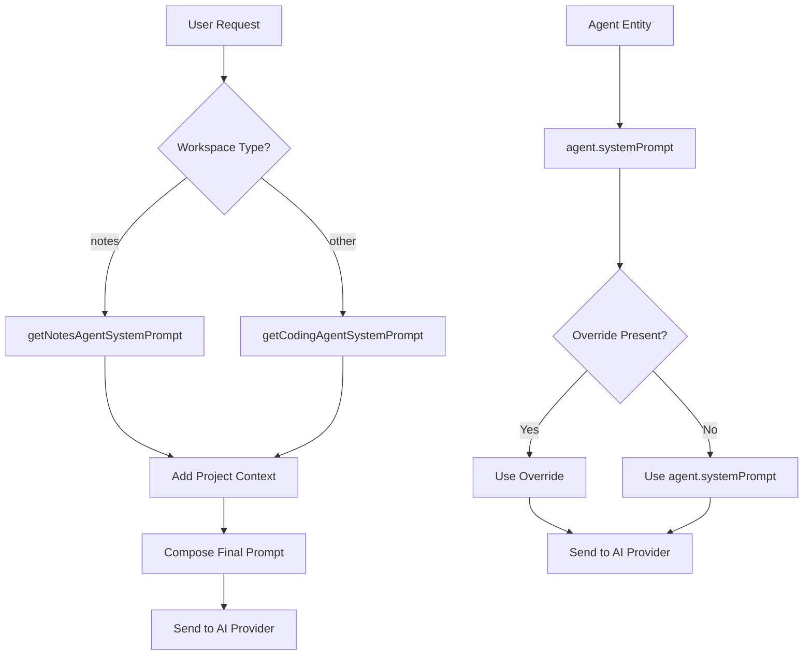
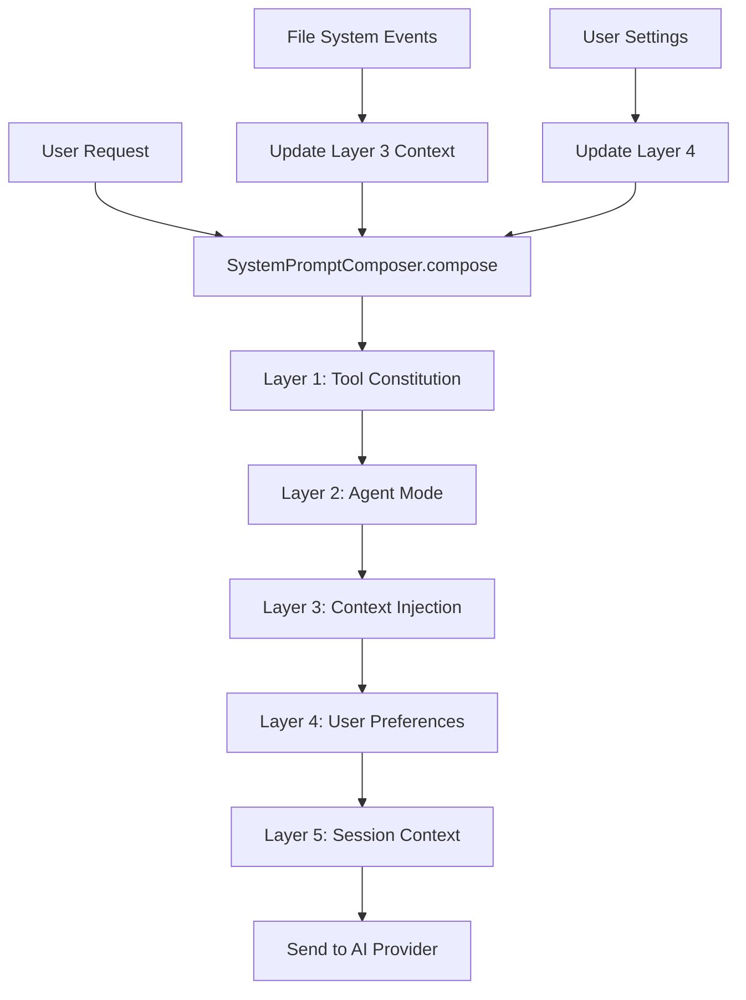

# Investigation 3: System Prompt Configuration Layers

**Date:** 2026-01-07  
**Investigator:** @bmad-bmm-analyst  
**Scope:** Trace agent.systemPrompt usage locations, identify workspace-specific prompt additions, map client-configurable prompt injection points

## Executive Summary

The system prompt architecture has **evolved into a sophisticated 5-layer system** with multiple configuration layers. However, there are significant gaps between the designed architecture and actual implementation, with inconsistent usage patterns across AI invocation pathways.

## System Prompt Architecture Analysis

### Current Implementation: Two Coexisting Systems

#### System 1: Legacy 2-Layer Architecture (`system-prompt.ts`)
**File:** `src/lib/agent/system-prompt.ts` (374 lines)

```typescript
// Layer 1: Tool Constitution (hidden, always sent)
export const TOOL_CONSTITUTION = `## TOOL USE CONSTITUTION...`;

// Layer 2: Agent Modes (selectable personas)
export const AGENT_MODES: Record<string, AgentMode> = {
    'solo-dev': MODE_SOLO_DEV,
    'code': MODE_CODE,
    'notes': MODE_NOTES,
};
```

**Builder Function:**
```typescript
export function buildSystemPrompt(
    mode: AgentMode = MODE_SOLO_DEV,
    projectContext?: string,
    workspaceType: 'ide' | 'notes' | 'knowledge' | 'study' = 'ide'
): string {
    // Composes: mode.persona + TOOL_CONSTITUTION + mode.cognitivePhase + 
    //          mode.communicationStyle + mode.rules + workspace context
}
```

#### System 2: Advanced 5-Layer Architecture (`prompt-composer.ts`)
**File:** `src/lib/agent/prompt-composer.ts` (468 lines)

```typescript
// Layer 1: Tool Constitution (hidden, always sent as system role)
// Layer 2: Agent Mode (user-selectable persona)  
// Layer 3: Context Injection (open files + project summary, dynamic)
// Layer 4: User Preferences (deferred to Phase 2)
// Layer 5: Session Context (deferred to Phase 2)
```

**Composer Class:**
```typescript
export class SystemPromptComposer {
    public compose(context: LayerContext): Array<{ role: 'system' | 'user'; content: string }> {
        // Returns array of system messages for TanStack AI
        // Order: Layer 1 → Layer 2 → Layer 3
    }
}
```

### Critical Finding: Architecture Disjoint

**Issue**: Two systems coexist but are used inconsistently:
- **Legacy system** (`system-prompt.ts`) - Used in ChatPanel and note-ai-service
- **Advanced system** (`prompt-composer.ts`) - Designed but not fully implemented

## System Prompt Usage Analysis

### 1. Agent Entity Configuration

**File:** `src/domain/entities/agent.ts`

```typescript
export interface AgentProps {
    id: string;
    name: string;
    providerId: string;
    model: string;
    systemPrompt: string;        // ← Agent-level system prompt
    temperature?: number;
    maxTokens?: number;
    // ... other properties
}
```

**Usage Pattern**: Agent stores a single `systemPrompt` string as base configuration.

### 2. ChatPanel Implementation

**File:** `src/presentation/components/ide/AgentChatPanel.tsx`

```typescript
// Import legacy functions
import { getCodingAgentSystemPrompt, getNotesAgentSystemPrompt } from '@/lib/agent/system-prompt';

// Workspace-specific system prompt selection
const systemPrompt = useMemo(() => {
    const context = workspaceType === 'notes'
        ? `Notebook: ${projectName}`
        : `Project: ${projectName}`;

    return workspaceType === 'notes'
        ? getNotesAgentSystemPrompt(context)
        : getCodingAgentSystemPrompt(context);
}, [projectName, workspaceType]);

// Pass to useAgentChatWithTools hook
const { messages, isLoading, ... } = useAgentChatWithTools({
    // ...
    systemMessage: systemPrompt,
    // ...
});
```

**Pattern**: Uses legacy 2-layer system with workspace-specific selection.

### 3. Notes AI Service Implementation

**File:** `src/lib/notes/note-ai-service.ts`

```typescript
// System prompt selection with override support
const systemPrompt = options?.systemPromptOverride || agent.systemPrompt ||
    'You are a helpful AI assistant for note-taking. Generate clear, concise content.';
```

**Pattern**: 
1. **Priority 1**: `systemPromptOverride` parameter
2. **Priority 2**: `agent.systemPrompt` from entity
3. **Priority 3**: Hardcoded fallback

### 4. Agent Configuration Forms

**Files**: 
- `src/presentation/components/agent/useAgentConfigForm.ts`
- `src/presentation/components/agent/hooks/useAgentFormState.ts`

**Pattern**: Direct manipulation of `agent.systemPrompt` property without layer composition.

## System Prompt Layers Deep Dive

### Layer 1: Tool Constitution

**Content**: Rules for tool usage, safety guidelines, execution patterns

```typescript
export const TOOL_CONSTITUTION = `
## TOOL USE CONSTITUTION

You have access to tools that execute upon user approval. You MUST use tools to accomplish tasks...

### CRITICAL RULES
1. **ACTION, NOT INSTRUCTION**
2. **STEP-BY-STEP EXECUTION**  
3. **TOOL SELECTION PRIORITY**
4. **SAFETY GUIDELINES**
5. **OUTPUT FORMAT**
`;
```

**Characteristics**:
- ✅ Hidden from user (always sent)
- ✅ Provider-agnostic
- ✅ Tool-focused rules
- ⚠️ Static content (no dynamic updates)

### Layer 2: Agent Modes

**Available Modes**:
```typescript
export const AGENT_MODES: Record<string, AgentMode> = {
    'solo-dev': MODE_SOLO_DEV,      // Quick Flow Solo Dev
    'code': MODE_CODE,              // Pure Executor  
    'notes': MODE_NOTES,            // Note-taking Assistant
};
```

**Mode Structure**:
```typescript
interface AgentMode {
    id: string;
    name: string;
    icon: string;
    cognitivePhase: string;    // How to analyze user intent
    persona: string;          // Who the agent is
    communicationStyle: string;
    rules: string;
}
```

**Example: Notes Mode**
```typescript
export const MODE_NOTES: AgentMode = {
    id: 'notes',
    name: 'Notes Assistant',
    cognitivePhase: `## COGNITIVE ANALYSIS PHASE
        1. Intent Classification (QUESTION ANSWERING, NOTE CREATION, etc.)
        2. Note Context Awareness
        3. Planning (before action)`,
    persona: `You are a Knowledge Management Assistant...`,
    communicationStyle: `- For Questions: Helpful and thorough...`,
    rules: `1. READ-ONLY DEFAULT: Always read notes first...`
};
```

### Layer 3: Context Injection (Advanced System Only)

**File**: `prompt-composer.ts` - Layer 3 implementation

```typescript
private generateLayer3Content(context: LayerContext): string {
    const { openFiles, activeFile, projectPackageJson, workspaceReady } = context;
    
    const parts: string[] = [];
    
    // Open files section (max 10)
    if (openFiles && openFiles.length > 0) {
        const fileList = openFiles
            .slice(0, this.getConfig().maxOpenFiles || DEFAULT_CONFIG.maxOpenFiles)
            .map(f => `  - ${f.name} (${f.path})`);
        
        parts.push(`## Open Files\n\n${fileList.join('\n')}`);
    }
    
    // Active file section
    if (activeFile) {
        parts.push(`\n## Active File\n\nCurrently editing: ${activeFile.name}`);
    }
    
    // Project summary section  
    if (projectPackageJson && workspaceReady) {
        parts.push(`\n## Project Summary\n\nProject: ${projectPackageJson.name}...`);
    }
    
    return parts.join('\n');
}
```

**Characteristics**:
- ✅ Dynamic content (file system events)
- ✅ Workspace-aware
- ✅ Debounced updates (300ms)
- ❌ **Not used in production** (only in advanced system)

### Layer 4 & 5: Future Layers (Not Implemented)

- **Layer 4**: User Preferences (custom instructions, style preferences)
- **Layer 5**: Session Context (conversation history, user patterns)

## Workspace-Specific Prompt Additions

### Current Implementation

**In `buildSystemPrompt()` function:**
```typescript
// Workspace-specific environment
if (workspaceType === 'notes') {
    parts.push(`
## ENVIRONMENT (NOTES WORKSPACE)
- You are helping with note-taking and knowledge management
- Reading notes is encouraged
- Writing notes requires user approval
- Do NOT suggest running terminal commands
- Do NOT suggest modifying code files
- Focus on information clarity and organization
`);
} else if (workspaceType === 'knowledge') {
    parts.push(`
## ENVIRONMENT (KNOWLEDGE WORKSPACE)
- You are helping with research and knowledge synthesis
- Focus on source analysis and citation
- Reading documents is encouraged
- Do NOT suggest running terminal commands
`);
} else if (workspaceType === 'study') {
    parts.push(`
## ENVIRONMENT (STUDY WORKSPACE)  
- You are helping with learning and studying
- Focus on quiz generation and flashcards
- Encourage active recall and spaced repetition
`);
} else {
    parts.push(`
## ENVIRONMENT (IDE WORKSPACE)
- React/TypeScript project
- Tailwind CSS styling
- Files sync to WebContainer
- Your tools actually work - USE THEM
`);
}
```

### Workspace Prompt Matrix

| Workspace | Environment Focus | Tool Restrictions | Special Instructions |
|-----------|-------------------|------------------|---------------------|
| **ide** | Development | Full tool access | "USE THEM" - encourage tool usage |
| **notes** | Knowledge management | No terminal/code | Focus on clarity, read-first |
| **knowledge** | Research synthesis | No terminal | Source analysis, citation |
| **study** | Learning | No terminal | Quiz generation, active recall |

## Client-Configurable Prompt Injection Points

### 1. Agent Configuration UI

**Location**: Agent settings dialog

**Capabilities**:
- ✅ Modify `agent.systemPrompt` directly
- ✅ Change agent mode (solo-dev, code, notes)
- ❌ No access to advanced layer system
- ❌ No workspace-specific customizations

### 2. note-ai-service Override

**Function Signature**:
```typescript
export async function generateNoteContent(
    prompt: string,
    options?: NoteAIOptions
): Promise<string>

interface NoteAIOptions {
    agentId?: string;
    contextBlocks?: Block[];
    systemPromptOverride?: string;  // ← Client override point
}
```

**Usage Pattern**: Direct override of entire system prompt.

### 3. ChatPanel Workspace Selection

**Implementation**: 
```typescript
const systemPrompt = useMemo(() => {
    const context = workspaceType === 'notes' ? `Notebook: ${projectName}` : `Project: ${projectName}`;
    return workspaceType === 'notes' 
        ? getNotesAgentSystemPrompt(context) 
        : getCodingAgentSystemPrompt(context);
}, [projectName, workspaceType]);
```

**Capabilities**:
- ✅ Workspace-specific prompt selection
- ✅ Project context injection
- ❌ No user customization options

## Critical Issues Identified

### 1. Architecture Fragmentation

**Issue**: Two coexisting systems with inconsistent usage
- **Legacy system**: Used in production (ChatPanel, note-ai-service)
- **Advanced system**: Designed but not implemented
- **Impact**: Maintenance complexity, inconsistent behavior

### 2. Limited Client Customization

**Issue**: No user-configurable prompt layers
- Users cannot add custom instructions
- No workspace-specific custom prompts
- No session-aware prompt adaptations
- **Impact**: One-size-fits-all approach

### 3. Static Tool Constitution

**Issue**: Tool rules are hardcoded and static
- No dynamic tool capability injection
- No workspace-specific tool guidance
- No user preference integration
- **Impact**: Suboptimal tool usage guidance

### 4. Missing Context Integration

**Issue**: Advanced Layer 3 (Context Injection) not used
- No open files context in prompts
- No project summary injection
- No dynamic workspace awareness
- **Impact**: Agents lack contextual awareness

### 5. Inconsistent Workspace Prompts

**Issue**: Workspace-specific prompts only in legacy system
- Advanced system has no workspace awareness
- Different prompts across AI invocation patterns
- **Impact**: Inconsistent agent behavior

## System Prompt Flow Analysis

### Current Flow (Legacy System)



### Designed Flow (Advanced System - Not Implemented)



## Configuration Sources Mapping

### Source Hierarchy (Current Implementation)

| Priority | Source | Location | Scope | Usage |
|----------|--------|----------|-------|-------|
| 1 | `systemPromptOverride` | Function parameter | Call-specific | note-ai-service |
| 2 | `agent.systemPrompt` | Agent entity | Agent-level | All invocations |
| 3 | Legacy functions | `system-prompt.ts` | Workspace-level | ChatPanel |
| 4 | Hardcoded fallback | Function default | Emergency | note-ai-service |

### Missing Sources

| Missing Source | Intended Layer | description | Impact |
|---------------|---------------|---------|--------|
| User custom instructions | Layer 4 | Personalization | High |
| Workspace-specific rules | Layer 3 | Environment adaptation | Medium |
| Dynamic tool capabilities | Layer 1 | Tool awareness | Medium |
| Session context | Layer 5 | Conversation awareness | Low |

## Recommendations

### Immediate Fixes (High Priority)

1. **Unify System Prompt Architecture**
   - Migrate all usage to advanced 5-layer system
   - Deprecate legacy `system-prompt.ts` functions
   - Implement missing layers 4-5

2. **Implement Client Customization**
   - Add user instruction input to agent settings
   - Create workspace-specific prompt customization
   - Implement Layer 4 (User Preferences)

3. **Enable Context Injection**
   - Integrate file system events with Layer 3
   - Add project summary injection
   - Implement dynamic workspace awareness

### Medium Priority Enhancements

1. **Dynamic Tool Constitution**
   - Generate tool rules based on available tools
   - Add workspace-specific tool guidance
   - Integrate with permission system

2. **Session-Aware Prompts**
   - Implement Layer 5 (Session Context)
   - Add conversation history awareness
   - Create adaptive prompt patterns

### Architecture Decision Required

**ADR-026**: Should the legacy 2-layer system be deprecated in favor of the 5-layer system?

- **Option A**: Migrate entirely to 5-layer system
- **Option B**: Maintain both systems for different use cases
- **Option C**: Hybrid approach with unified interface

## Files Requiring Changes

### Critical Files
- `src/lib/agent/system-prompt.ts` - Deprecate or integrate with composer
- `src/lib/agent/prompt-composer.ts` - Complete implementation
- `src/presentation/components/ide/AgentChatPanel.tsx` - Migrate to composer
- `src/lib/notes/note-ai-service.ts` - Use composer instead of override

### New Files Needed
- `src/lib/agent/prompt-composer-types.ts` - Type definitions
- `src/lib/agent/prompt-composer-config.ts` - Configuration management
- `src/presentation/components/agent/PromptCustomization.tsx` - UI for customization

---

**Next Investigation:** State/Store Reactivity & Hydration (Investigation 4)
