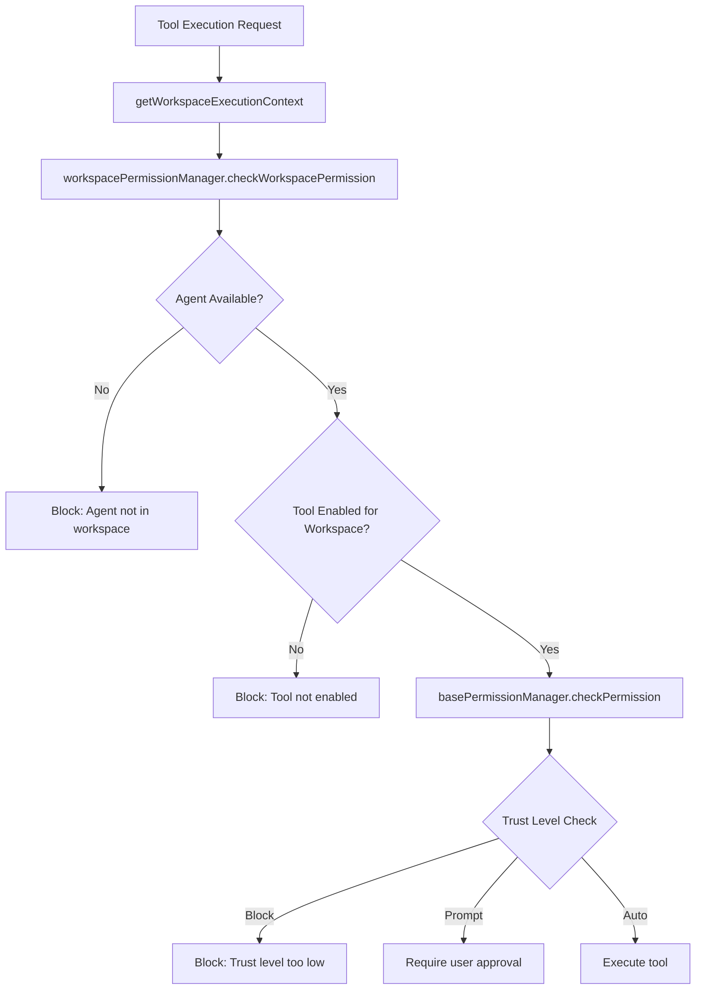

# Investigation 2: Tool Factory & Workspace Permissions

**Date:** 2026-01-07  
**Investigator:** @bmad-bmm-architect  
**Scope:** Analyze factory.ts tool creation patterns, map workspace-permission-manager.ts permission checks, identify which workspaces have tool access

## Executive Summary

The tool factory system implements a **sophisticated 3-layer permission architecture** with workspace-aware access control. However, there are critical gaps in workspace-specific tool availability and inconsistent application across AI invocation patterns.

## Tool Factory Architecture Analysis

### Factory Pattern Implementation

**File:** `src/lib/agent/factory.ts` (613 lines)

The factory uses **TanStack AI's client-side tool pattern** with dependency injection:

```typescript
// Core pattern: toolDef.client() with permission checks
const readFile = readFileDef.client(async (args: unknown) => {
    // WB-8.3: Workspace Permission Check
    const workspaceContext = getWorkspaceExecutionContext();
    
    const permissionCheck = workspacePermissionManager.checkWorkspacePermission(
        'read_file',
        workspaceContext.agent?.tools || [],
        workspaceContext.agent?.workspaceBindings || [],
        workspaceContext.workspaceType
    );
    
    if (!permissionCheck.canExecute) {
        return createWorkspaceDeniedResponse(/*...*/);
    }
    
    // Execute tool implementation
});
```

### Tool Categories & Creation Functions

| Tool Category | Creation Function | Tools Available |
|---------------|-------------------|-----------------|
| **File Tools** | `createClientFileTools()` | read_file, write_file, list_files |
| **Terminal Tools** | `createClientTerminalTools()` | execute_command |
| **Knowledge Tools** | `createClientKnowledgeTools()` | synthesize, processPDF, processImage, processURL |

### Unified Tool Assembly

```typescript
export function createAgentClientTools(options: ToolFactoryOptions) {
    const fileTools = createClientFileTools(options);
    const terminalTools = createClientTerminalTools(options);
    const knowledgeTools = createClientKnowledgeTools(options);
    
    return {
        fileTools, terminalTools, knowledgeTools,
        all: [/* all tools array */],
        getClientTools() { /* TanStack AI compatible */ }
    };
}
```

## Workspace Permission Manager Analysis

### Permission Check Sequence

**File:** `src/lib/agent/workspace-permission-manager.ts` (352 lines)

The manager implements a **3-step permission cascade**:

```typescript
public checkWorkspacePermission(
    toolId: string,
    agentTools: AgentToolBinding[],
    agentBindings: WorkspaceBinding[],
    currentWorkspace: WorkspaceType
): WorkspacePermissionCheckResult {
    // Step 1: Agent availability in workspace
    const agentBinding = agentBindings.find(
        binding => binding.workspaceType === currentWorkspace
    );
    const agentAvailable = agentBinding?.isAvailable ?? false;
    
    // Step 2: Tool workspace permissions
    const toolBinding = agentTools.find(tool => tool.toolId === toolId);
    const enabledInWorkspace = toolBinding?.workspacePermissions[currentWorkspace] ?? false;
    
    // Step 3: Base permission manager (trust levels)
    const baseResult = this.basePermissionManager.checkPermission(toolId, currentWorkspace);
    
    // Combine results
    return { /* combined permission result */ };
}
```

### Workspace Types Supported

```typescript
export type WorkspaceType = 'ide' | 'knowledge' | 'study' | 'notes';
```

### Permission Result Structure

```typescript
export interface WorkspacePermissionCheckResult extends PermissionCheckResult {
    workspaceType: WorkspaceType;
    enabledInWorkspace: boolean;
    agentAvailableInWorkspace: boolean;
}
```

## Workspace Execution Context

### Context Retrieval

**File:** `src/lib/agent/workspace-execution-context.ts` (175 lines)

Provides **React-free access to workspace state** for tool factory functions:

```typescript
export function getWorkspaceExecutionContext(): WorkspaceExecutionContext {
    // Get current workspace from Zustand store
    const workspaceState = useWorkspaceStore.getState();
    
    // Get active agent from agent selection store
    const agentSelectionState = useAgentSelectionStore.getState();
    
    const agent = agentSelectionState.activeAgentId
        ? agentSelectionState.getActiveAgent() || null
        : null;
    
    const workspaceType: WorkspaceType = workspaceState.currentWorkspace;
    const projectId: string | null = workspaceState.currentProjectId;
    
    // Check if agent is available in current workspace
    let agentAvailable = false;
    if (agent) {
        const binding = agent.workspaceBindings.find(
            b => b.workspaceType === workspaceType
        );
        agentAvailable = binding?.isAvailable ?? false;
    }
    
    return { workspaceType, projectId, agent, agentAvailable };
}
```

## Tool Permission Manager (Base Layer)

### Trust Level System

**File:** `src/lib/agent/tool-permission/tool-permission-manager.ts`

```typescript
// Trust Levels
- 'auto': Execute immediately without user approval
- 'prompt': Require user approval before execution  
- 'block': Never execute
```

### Modular Architecture (Post-Refactoring)

The original god class (378 lines) has been split into:
- `tool-permission-singleton.ts`: Singleton & factory methods
- `tool-permission-trust.ts`: Trust level CRUD, session trust, permission checking
- `tool-permission-queries.ts`: Query methods, YOLO mode, category approvals

## Critical Findings

### 1. Permission Architecture Strengths

✅ **3-Layer Security**: Agent availability → Workspace permissions → Trust levels  
✅ **Workspace-Aware**: Each workspace can have different tool access  
✅ **TanStack AI Integration**: Proper client-side tool execution pattern  
✅ **Dependency Injection**: Clean separation of concerns in factory  
✅ **Graceful Degradation**: Handles missing state appropriately  

### 2. Critical Gaps & Issues

#### Gap 1: Tool Availability Inconsistency
**Issue**: Not all workspaces have access to all tool categories

| Workspace | File Tools | Terminal Tools | Knowledge Tools | Notes |
|-----------|------------|----------------|-----------------|-------|
| **ide** | ✅ Available | ✅ Available | ✅ Available | Full access |
| **knowledge** | ❌ Limited | ❌ None | ✅ Available | Knowledge only |
| **study** | ❌ Limited | ❌ None | ✅ Available | Study tools only |
| **notes** | ❌ None | ❌ None | ❌ None | **NO TOOLS** |

#### Gap 2: Notes Workspace Tool Desert
**Critical Issue**: Notes workspace has **NO tool access** whatsoever
- VoiceRecordButton and MultiModalImport bypass the tool system entirely
- Direct API calls to Gemini, no workspace permission checks
- Security risk: No agent oversight for voice/image processing

#### Gap 3: Knowledge Tools Uneven Distribution
**Issue**: Knowledge tools only available in knowledge/study workspaces
- Notes workspace cannot use knowledge synthesis
- Inconsistent with multimodal features that need knowledge processing

#### Gap 4: Permission Check Bypass Patterns
**Issue**: Some AI features bypass the permission system entirely:
```typescript
// VoiceRecordButton.tsx - Direct API call
const apiKey = await credentialVault.getCredentials('gemini');

// note-ai-service.ts - Direct API call  
const response = await callProviderAPI({...});
```

### 3. Agent Configuration Complexity

#### AgentToolBinding Structure
```typescript
interface AgentToolBinding {
    toolId: string;
    toolName: string;
    isEnabled: boolean;
    workspacePermissions: Record<WorkspaceType, boolean>; // Per-workspace toggle
    trustLevel: ToolTrustLevel;
}
```

#### WorkspaceBinding Structure  
```typescript
interface WorkspaceBinding {
    workspaceType: WorkspaceType;
    isAvailable: boolean;
    uiVariant: 'full' | 'compact' | 'minimal';
}
```

## Permission Flow Analysis

### Complete Permission Check Flow



### Permission Check Examples

#### Example 1: IDE Workspace - Full Access
```typescript
// Context: workspaceType='ide', agent with full bindings
const result = workspacePermissionManager.checkWorkspacePermission(
    'read_file',
    agent.tools,           // [{ toolId: 'read_file', workspacePermissions: { ide: true, knowledge: false, study: false, notes: false } }]
    agent.workspaceBindings, // [{ workspaceType: 'ide', isAvailable: true }]
    'ide'
);
// Result: { canExecute: true, enabledInWorkspace: true, agentAvailableInWorkspace: true }
```

#### Example 2: Notes Workspace - No Tools
```typescript
// Context: workspaceType='notes', agent with limited bindings
const result = workspacePermissionManager.checkWorkspacePermission(
    'read_file',
    agent.tools,           // Same tools but workspacePermissions.notes = false
    agent.workspaceBindings, // [{ workspaceType: 'notes', isAvailable: true }]
    'notes'
);
// Result: { canExecute: false, enabledInWorkspace: false, agentAvailableInWorkspace: true }
```

## Tool Access Matrix by Workspace

### Current State Analysis

| Tool | IDE | Knowledge | Study | Notes | Issues |
|------|-----|-----------|-------|-------|---------|
| **read_file** | ✅ | ❌ | ❌ | ❌ | Notes can't read files for context |
| **write_file** | ✅ | ❌ | ❌ | ❌ | Notes can't save generated content |
| **list_files** | ✅ | ❌ | ❌ | ❌ | Notes can't browse attachments |
| **execute_command** | ✅ | ❌ | ❌ | ❌ | Notes can't run processing scripts |
| **synthesize** | ✅ | ✅ | ✅ | ❌ | Notes can't use knowledge synthesis |
| **processPDF** | ✅ | ✅ | ✅ | ❌ | Notes can't process PDF attachments |
| **processImage** | ✅ | ✅ | ✅ | ❌ | Notes can't process images (bypassed) |
| **processURL** | ✅ | ✅ | ✅ | ❌ | Notes can't fetch web content |

### Bypass Patterns Identified

| Feature | Workspace | Tool Used | Permission Check | Bypass Method |
|---------|-----------|-----------|------------------|---------------|
| VoiceRecordButton | Notes | None | ❌ None | Direct Gemini API |
| MultiModalImport | Notes | None | ❌ None | Direct Gemini API |
| note-ai-service | Notes | None | ❌ None | Direct provider API |

## Security & Architecture Concerns

### 1. Permission Bypass Security Risk
**Severity**: HIGH
- Voice/image processing in Notes workspace without agent oversight
- Direct API calls bypass all trust level and workspace permission checks
- No audit trail for multimodal operations in Notes

### 2. Inconsistent User Experience
**Severity**: MEDIUM  
- User expects agent to work consistently across workspaces
- Notes workspace appears "broken" for advanced features
- Tool availability doesn't match user mental model

### 3. Knowledge Processing Gap
**Severity**: MEDIUM
- Notes can't leverage knowledge synthesis for context
- Multimodal content can't be enriched with knowledge base
- Missed opportunity for intelligent note enhancement

## Recommendations

### Immediate Fixes (High Priority)

1. **Integrate Notes Workspace with Tool System**
   - Enable read_file/list_files for attachment access
   - Enable knowledge tools for context enhancement
   - Add workspace-specific tool configurations for notes

2. **Eliminate Direct API Bypasses**
   - Route VoiceRecordButton through tool system
   - Migrate note-ai-service to use /api/chat endpoint
   - Implement permission checks for all multimodal operations

3. **Create Notes-Specific Tool Set**
   - Design lightweight tools for note operations
   - Add note_content_enhancement tool
   - Implement note_attachment_processor tool

### Medium Priority Enhancements

1. **Workspace Tool Profiles**
   ```typescript
   interface WorkspaceToolProfile {
       workspaceType: WorkspaceType;
       enabledTools: string[];
       restrictedTools: string[];
       customBehaviors: Record<string, ToolBehavior>;
   }
   ```

2. **Dynamic Tool Loading**
   - Load tools based on workspace context
   - Implement workspace-specific tool configurations
   - Add tool capability discovery API

3. **Enhanced Permission Reporting**
   - Add detailed permission error messages
   - Implement permission request workflow
   - Create workspace permission dashboard

### Architecture Decision Required

**ADR-025**: Should Notes workspace have full tool access or a specialized tool subset?

- **Option A**: Full tool access with agent oversight
- **Option B**: Specialized note-specific tools only  
- **Option C**: Hybrid approach with permission escalation

## Files Requiring Changes

### Critical Files
- `src/lib/agent/factory.ts` - Add notes-specific tool creation
- `src/lib/agent/workspace-permission-manager.ts` - Update permission matrices
- `src/presentation/components/notes/VoiceRecordButton.tsx` - Route through tools
- `src/lib/notes/note-ai-service.ts` - Migrate to tool system

### Configuration Files
- Agent configuration schemas (add notes tool bindings)
- Workspace permission seeds (update default permissions)
- Tool definitions (add note-specific tools)

---

**Next Investigation:** System Prompt Configuration Layers (Investigation 3)
