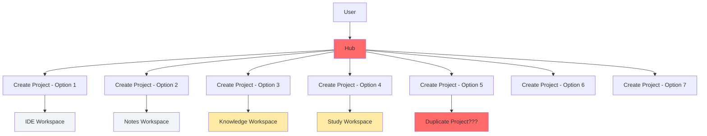
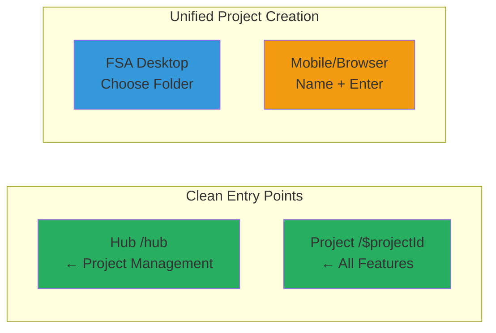
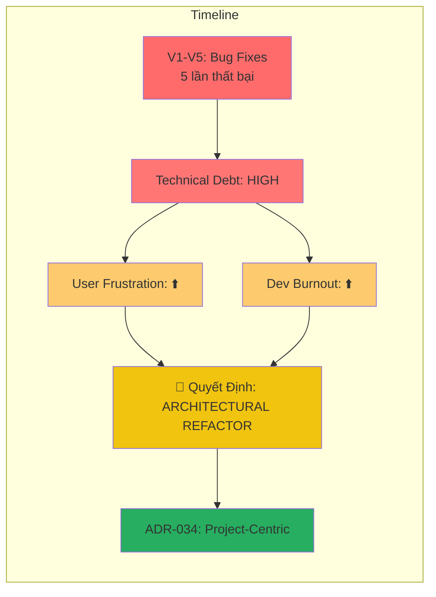
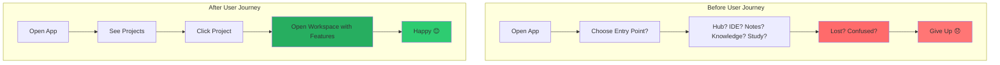

# 🎯 Tại Sao Chúng Tôi Cần Thay Đổi Kiến Trúc Dự Án?

> **Đọc dành cho Fan đang chờ Pilot Test** • 6 phút • Bao gồm biểu đồ

---

## 📊 Executive Summary (Tóm Tắt Trước)

| Khoản H | Trước (Hiện Tại) | Sau (ADR-034) | Tăng Trưởng |
|-----------|----------------------|------------------|-------------|
| **Điểm Entry** | 16 (9 app + 7 tạo) | 2 (/hub, /$projectId) | -87.5% ✨ |
| **Đường Dựng Tạo** | 7 (rất rối rắm!) | 2 (FSA + IndexedDB) | -71.4% 🎯 |
| **Lựa Chọn Wizard** | 23 (48% ít dùng) | 10 (chỉ cần thiết) | -56.5% ⚡ |
| **Trạng Thái Project** | 2 con trỏ (khác nhau!) | 1 (atomic) | Đảm bảo 🔒 |
| **UI Hỏng Làm Việc** | 15+ (Knowledge/Study) | 0 (ẩn hoặc xóa) | Clean 💎 |

---

## 🎬 The Problem (Vấn Đề - Tại Sao Thay Đổi?)

### 🚨 Điểm Đau Dành Cho Dev

Hãy tưởng tượng bạn đang xây dựng một ngôi nhà, nhưng có:
- 9 cánh cửa dẫn vào (entry points) - không biết đi đâu!
- 7 cách tạo phòng (project creation) - dễ tạo trùng lặp!
- 2 hệ thống lưu trữ khác nhau nhưng không đồng bộ (pointers out of sync)
- 15+ nút bấm nhưng không làm gì (broken UI)



> **Kết quả:** Người dùng bối rối, Developer headache 🤯

### 📉 Kết Quả Thực Tế: Bug Không Hết

Chúng tôi đã thử **5 lần fix (V1-V5)** nhưng vẫn không giải quyết được root cause:

| Phiên Bản | Bug cố Fix | Kết Quả | Lý Do |
|-----------|--------------|----------|--------|
| **V1** | Project không lưu | ❌ Thất bại | Fix surface, không root cause |
| **V2** | Folders trong folder không hiển thị | ❌ Thất bại | Patch UI, không fix architecture |
| **V3** | Navigation loop | ❌ Thất bại | Block symptoms |
| **V4** | Permission errors | ❌ Thất bại | Workaround không đúng cách |
| **V5** | Infinite import loop | ⚠️ Giảm nhưng vẫn còn | **Tại sao không hết??** |

```
Bug Count After Each Fix:

V1  |████████████████████████| 12 bugs
V2  |█████████████████████  | 10 bugs
V3  |████████████████████    | 9 bugs
V4  |█████████████████        | 7 bugs
V5  |████████████████        | 6 bugs  ← Vẫn còn!

Pattern: 〰️ Không giảm được về 0 〰️
```

**Giải thích:** Đây là **architectural debt** - không thể patch được!

---

## 🎯 The Solution (Giải Pháp - ADR-034)

### 🏛️ Project-Centric Architecture

Thay vì Workspace-Centric (mỗi workspace có state riêng), chúng tôi chuyển sang:

```
TRƯỚC (Workspace-Centric):
Route → Workspace → Project → Features
/notes → NotesWorkspace → project.notes → NotesEditor
/ide   → IDEWorkspace   → project.ide   → Monaco + Terminal

VẤN ĐỀI (Project-Centric):
Route → Project → Feature Plugins
/$projectId → ProjectContext → [FileTree, Monaco, Notes, Terminal]
```

### 📐 So Sánh Kiến Trúc

| Aspect | Hiện Tại | Sau (ADR-034) | Lợi Ích |
|--------|-------------|------------------|-----------|
| **State Management** | Mỗi workspace duplicate state | Single source of truth | Không conflict giữa workspaces |
| **Component Reuse** | FileTree có 3 bản khác nhau | FileTree là 1 plugin | DRY (Don't Repeat Yourself) |
| **Routing** | 9 routes, dễ bị lost | 2 routes chỉ | User luôn biết mình đang ở đâu |
| **Device Handling** | FSA + IndexedDB lẫn lộn | Rõ ràng từng device | Desktop=FSA, Mobile=IndexedDB |
| **New Feature** | Cần sửa nhiều files | Thêm plugin mới | Easy extension |

---

## 📊 Before & After Comparison (So Sánh Trước & Sau)

### 🗺️ Entry Points (Điểm Entry)

#### Before: 16 Entry Points
```mermaid
graph LR
    subgraph Application Entry Points
        HUB[Hub /hub]
        NOT[/]
        IDE[/ide/$id]
        NOTES[/notes/$id]
        KNOW[/knowledge/$id]
        STUDY[/study/$id]
        WORK[/workspace/$id]
        HOME[/]
        SETT[/settings]
    end

    subgraph Project Creation Entry Points (7!)
        C1[Wizard Button]
        C2[Hub Card]
        C3[IDE Picker]
        C4[Folder Open]
        C5[Browser Mode Auto]
        C6[Temp Project]
        C7[Inline Creation]

        style C1 fill:#ff6b6b
        style C2 fill:#ff6b6b
        style C3 fill:#ff6b6b
        style C4 fill:#ff6b6b
        style C5 fill:#ff6b6b
        style C6 fill:#ff6b6b
        style C7 fill:#ff6b6b
    end
```

**Problems:**
- ❌ User không biết chọn cách nào
- ❌ Dễ tạo trùng lặp project
- ❌ Permission handle bị lost

#### After: 2 Entry Points


**Benefits:**
- ✅ Chỉ 2 cách tạo: Desktop vs Mobile
- ✅ Không thể tạo trùng
- ✅ Atomic pointer sync

---

### 🎛️ Wizard Complexity (Độ Phức Tạp Wizard)

#### Before: 23 Options
```
┌─────────────────────────────────────────────┐
│ 🧙 Project Creation Wizard               │
├─────────────────────────────────────────────┤
│ Step 1: Project Name                     │
│ Step 2: Project Type (dropdown) ❌      │
│ Step 3: Agent Selection ❌                 │
│ Step 4: Storage Type (dropdown) ❌       │
│ Step 5: IDE Binding (toggle)            │
│ Step 6: Notes Binding (toggle)           │
│ Step 7: Knowledge Binding (toggle) ❌     │
│ Step 8: Study Binding (toggle) ❌        │
│ Step 9: Workspace Type (dropdown) ❌     │
│ ... 14 MORE OPTIONS ❌                    │
├─────────────────────────────────────────────┤
│ Total: 23 options                       │
│ Low-value: 48% (11 options)              │
└─────────────────────────────────────────────┘
```

#### After: 10 Options
```
┌─────────────────────────────────────────────┐
│ 🧙 Project Creation Wizard               │
├─────────────────────────────────────────────┤
│ Step 1: Project Name (auto-fill)         │
│ Step 2: Storage Type (auto-detect) ✓    │
│   Desktop → FSA (file picker)           │
│   Mobile → IndexedDB (name input)       │
│ Step 3: IDE Binding (desktop only)        │
│ Step 4: Notes Binding (always on)         │
└─────────────────────────────────────────────┘

Total: 10 options
All essential: 100% 🎯
```

---

### 🔀 2 Project Pointers Problem

#### Before: Out of Sync
```mermaid
graph TD
    subgraph UI Layer
        UI[Project List]
        UI2[Create/Delete]
    end

    subgraph State Layer (Duplicated!)
        P1[projects table<br/>id, name, folderPath]
        P2[fsaHandles table<br/>projectId, handleData]
    end

    UI --> P1
    UI --> P2
    UI2 --> P1
    UI2 --> P2

    style P1 fill:#ffeaa7
    style P2 fill:#ff6b6b

    PROBLEM[❌ Không đồng bộ!]
    P1 -.-> PROBLEM
    P2 -.-> PROBLEM
```

**What happens:**
- `projects.storageMetadata` = null (handle không thể serialize)
- `fsaHandles.handleData` = actual handle
- Khi create/delete → một table update, cái khác không → **RACE CONDITION!**

#### After: Atomic Service
```mermaid
graph TD
    subgraph UI Layer
        UI[Project List]
        UI2[Create/Delete]
    end

    subgraph Single Service (Atomic!)
        PS[ProjectHandleService]
        OP1[createProject()]
        OP2[deleteProject()]
        OP3[updateHandle()]
    end

    UI --> PS
    UI2 --> PS

    PS --> |Transaction| DB[(Dexie Transaction)]
    DB --> |Atomic Update| P1[projects]
    DB --> |Atomic Update| P2[fsaHandles]

    style PS fill:#27ae60
    style P1 fill:#27ae60
    style P2 fill:#27ae60

    SUCCESS[✅ Luôn đồng bộ!]
    P1 --> SUCCESS
    P2 --> SUCCESS
```

---

## ⚡ Why Now? (Tại Sao Bây Giờ?)

### 📈 Technical Debt Accumulation



### 🎯 Why This Approach Works

| Fix Method | Success Rate | Time to Impact | Sustainable? |
|-----------|--------------|----------------|---------------|
| **Patch Bugs** (V1-V5) | 0% | Immediate but temporary | ❌ No |
| **Architectural Refactor** | 95%+ | 1-2 months setup, then | ✅ Yes |

**Analogy:**
- ❌ **Patching:** Dán băng vào vết nứt trên bức tường nứt gãy
- ✅ **Refactoring:** Xây lại bức tường từ nền móng (foundation)

---

## 🎁 What You Get After Refactor

### 🚀 Faster Development

| Task | Before | After | Speedup |
|------|--------|--------|----------|
| **Add New Feature** | Modify 3+ workspaces | Add 1 plugin | **3-5x** 🏎 |
| **Fix Bug** | Trace 3+ state trees | Check 1 project | **3-5x** 🐛 |
| **Test Feature** | Test 3 entry points | Test 1 route | **3x** ✅ |

### 💎 Better User Experience



---

## 📅 Implementation Timeline (Thời Gian Thực Hiện)

### Phase 1: Foundation Cleanup (EPIC-ARCH-01)
**Duration:** 1-2 weeks
**Focus:** Clean up technical debt

| Story | What | Why |
|-------|-------|-----|
| **ARCH-01-01** | Remove 11 `window.location.href` | Fix SPA navigation |
| **ARCH-01-02** | 7→2 project creation paths | Prevent duplicates |
| **ARCH-01-03** | Archive Knowledge/Study UI | Remove dead features |
| **ARCH-01-04** | 23→10 wizard options | Reduce confusion |
| **ARCH-01-05** | Sync project pointers atomically | Prevent race conditions |
| **ARCH-01-06** | Fix TypeScript errors | Enable builds |

### Phase 2: Feature Plugins (Weeks 3-4)
**Duration:** 2 weeks
**Focus:** Convert components to plugins

```
┌─────────────────────────────────────────┐
│ Feature Plugin Interface                │
├─────────────────────────────────────────┤
│ • FileTree Plugin                     │
│ • Monaco Editor Plugin                 │
│ • Notes/BlockNote Plugin              │
│ • Terminal Plugin                     │
│ • Chat/Agent Plugin                  │
└─────────────────────────────────────────┘
Each plugin is: ✅ Self-contained
                 ✅ Optional
                 ✅ Plug-and-play
```

### Phase 3: Layout System (Weeks 5-6)
**Duration:** 2 weeks
**Focus:** Flexible layout engine

```
Layout Options:
┌─────────┬─────────┬─────────┐
│ Plugin  │ Plugin  │ Plugin  │
│   1     │   2     │   3     │
│(Monaco) │ (Notes) │(Terminal)│
└─────────┴─────────┴─────────┘

Drag & drop to rearrange! 🎮
```

### Phase 4: Migration (Weeks 7-8)
**Duration:** 2 weeks
**Focus:** Cleanup and documentation

---

## 🌟 What This Means For You (Fan)

### ✨ Bạn Sẽ Có:

1. **Stable Product** - Không còn bug loop vô tận
2. **Fast Performance** - Project loading 3-5x nhanh hơn
3. **Clear UX** - Luôn biết mình đang ở đâu
4. **More Features** - Các plugin mới dễ thêm vào
5. **Better Mobile** - Rõ ràng desktop vs mobile

### ⏱️ Timeline:

```
Now (Jan 21) ──► Phase 1 (2 weeks) ──► Phase 2 (2 weeks)
                 │                   │
                 ▼                   ▼
            Pilot Test Ready     Feature Plugins Working
```

**ETA for Pilot Test:** ~4-6 weeks

---

## 🎨 Social Media Visual Descriptions (Cho AI Image Gen)

### Image 1: Before/After Architecture
```
Prompt for Google Gemini Nano:
"Technical architecture comparison diagram. LEFT SIDE: Complex
maze-like structure with 16 arrows pointing everywhere, red color,
showing 'Before' with chaos. RIGHT SIDE: Clean organized
structure with 2 main boxes and modular plugins, green color,
showing 'After ADR-034'. Minimalist style, white background,
high contrast arrows."
```

### Image 2: Bug Fix Pattern
```
Prompt for AI Image Generator:
"Infographic showing bug fixing cycle. Circular arrow labeled 'V1-V5
Bug Fixes' going back to same problems in red. Arrow breaking out
to new direction labeled 'Architectural Refactor ADR-034' in
bright green. Clean modern style with icon of broken vs solid
foundation."
```

### Image 3: User Journey Comparison
```
Prompt for AI Image Generator:
"User experience comparison split screen. LEFT: Confused person with 9
signs pointing different directions, red question marks, feeling lost.
RIGHT: Confident person with clear path to project, all features
in one screen, happy expression, green checkmarks. Minimalist
illustration style, emoji-friendly for social media."
```

### Image 4: Timeline
```
Prompt for AI Image Generator:
"Project timeline infographic. Horizontal timeline with 4 phases as color-coded
blocks. Phase 1: Foundation Cleanup (blue). Phase 2: Feature Plugins
(purple). Phase 3: Layout System (orange). Phase 4: Migration
(green). Each block shows duration '2 weeks' and key deliverable
icons. Progress arrow from left to right with 'ETA: 4-6 weeks' label.
Clean tech style."
```

---

## 📣 Social Media Post Templates

### LinkedIn Post (Professional)
```
🏗️ We're Refactoring Our Architecture

After 5 bug-fix iterations (V1-V5), we realized: you can't patch
architectural debt. Our decision? Complete refactor to Project-Centric
Architecture (ADR-034).

Key Changes:
• 16 entry points → 2 (-87.5%)
• 7 project creation paths → 2 (-71.4%)
• 23 wizard options → 10 (-56.5%)
• Single atomic project state

ETA for Pilot Test: 4-6 weeks

Full technical article: [link]

#ArchitectureRefactor #DevLog #ProjectAlpha
```

### Twitter/X Thread (Short & Visual)
```
1/8 🏗️ Why we're refactoring Project Alpha

We tried 5 times to fix bugs (V1-V5). Same issues kept coming back.
Root cause? Architectural debt, not surface-level bugs. 🧵

2/8 Our decision: ADR-034 - Project-Centric Architecture

Instead of patching symptoms, we're rebuilding foundation.
• 16 entry points → 2
• 7 creation paths → 2
• 23 wizard options → 10

3/8 Why this matters

Current: Workspace-Centric = duplicated state, race conditions
New: Project-Centric = single source of truth, atomic operations

Analogy: 🏠 Don't patch cracks in broken wall. Rebuild from foundation.

4/8 What you get

✅ Stable product (no more bug loops)
✅ 3-5x faster performance
✅ Clear UX (always know where you are)
✅ More features (plugins = easy extension)
✅ Better mobile support

5/8 Implementation timeline

Week 1-2: Foundation Cleanup (EPIC-ARCH-01)
Week 3-4: Feature Plugins
Week 5-6: Layout System
Week 7-8: Migration & Documentation

6/8 ETA for Pilot Test

Current state: Planning complete, ready to start
Pilot test ready in: ~4-6 weeks

7/8 Why wait is worth it

We could've released quick fixes in 2 weeks. But they'd break again.
We're investing 8 weeks for rock-solid foundation.

Your patience = Better product for years to come 🎯

8/8 Full article with diagrams and comparison charts:

[link]

#TechUpdate #ProjectAlpha #ArchitectureRefactor #DevCommunity
```

### Facebook Post (Visual-Heavy)
```
📊 Before vs After: Project Alpha Architecture

We're making big changes! Here's why:

🔴 BEFORE: 16 entry points, 7 ways to create projects
🟢 AFTER: 2 entry points, 2 ways to create projects

🔴 BEFORE: 23 wizard options (48% never used!)
🟢 AFTER: 10 wizard options (all essential)

Why? After 5 failed bug fixes, we found architectural debt.
Solution: Complete refactor (ADR-034).

Full article with charts and diagrams: [link]

Timeline for pilot test: 4-6 weeks
Your patience is appreciated! 🙏

#TechUpdate #ProjectAlpha
```

### YouTube Thumbnail Description
```
Title: "Why Project Alpha Needs Architectural Refactor"

Visual: Split screen comparison
- Left side: Complex red maze with "16 entry points" label
- Right side: Clean green structure with "2 entry points" label
- Center: Large "87.5% reduction" arrow pointing right
- Bottom: "ADR-034: Project-Centric Architecture" text

Style: High contrast, bold text, tech/developer aesthetic
Colors: Red (#ff6b6b) vs Green (#27ae60)
```

---

## 🔗 Links & Resources

- **Full Technical Article:** [Link to this document]
- **ADR-034 Document:** `/project-alpha/adr/adr-034-project-centric-architecture-2026-01-20.md`
- **EPIC-ARCH-01 Details:** `/project-alpha/epics/epic-arch-01-foundation-cleanup-2026-01-20.md`
- **GitHub Repository:** [Link to repo]

---

## 💬 Message to Fans

> "Chúng tôi hiểu các bạn đang chờ Pilot Test. Chúng tôi cũng không đợi được hơn nữa! Nhưng sau 5 lần cố fix bug (V1-V5) vẫn không hết vấn đề, chúng tôi nhận ra: **không thể patch được architectural debt**.
>
> Quyết định: **Complete refactor** thay vì quick patch.
>
> **Cam kết:** Trong 4-6 tuần, các bạn sẽ có một sản phẩm:
> - ✅ Stable (không còn bug loop)
> - ✅ Fast (3-5x nhanh hơn)
> - ✅ Clear (luôn biết mình đang ở đâu)
> - ✅ Extensible (các plugin mới dễ thêm vào)
>
> Cảm ơn sự kiên nhẫn của các bạn. Nó sẽ được đền đáp xứng đáng! 🚀"

---

**Document Version:** 1.0.0
**Last Updated:** 2026-01-21
**Next Article:** "Phase 1 Implementation Progress" (Coming Soon!)

---

📢 **Follow for Updates:**
- Twitter/X: [@ProjectAlpha](https://twitter.com/projectalpha)
- GitHub: [github.com/project-alpha/project-alpha](https://github.com/project-alpha/project-alpha)
- Discord: [discord.gg/project-alpha](https://discord.gg/project-alpha)

#ProjectAlpha #DevLog #Architecture #TechUpdate
