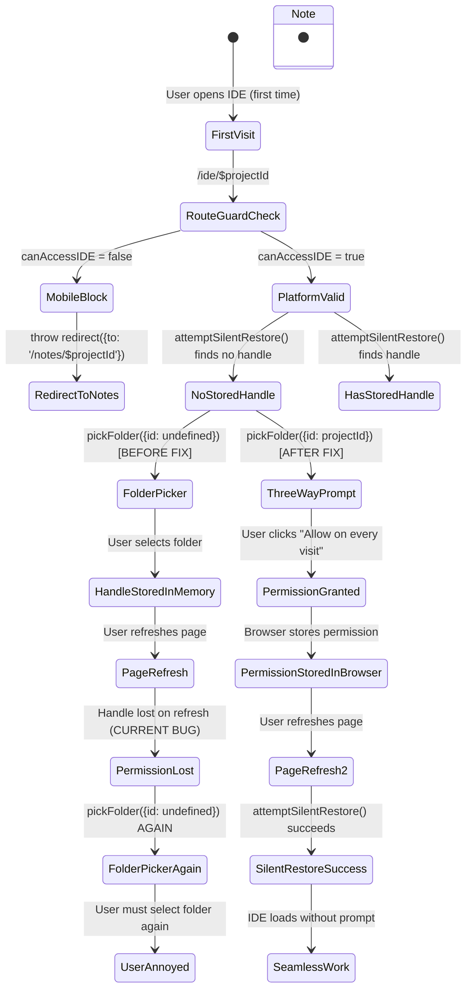

# User Journey: Chrome 122+ Permission Persistence

**Story ID**: EP01-ST-02
**Step**: 1a - User Journey Simulation (v2.0 Enhanced)
**Generated**: 2026-01-17T18:00+07:00
**Status**: Journey Reality Gate - PASSED ✅

---

## Movie Script (30 seconds)

### Before Fix (Current Annoying Behavior)

#### Scene 1: First Visit - No Persistent ID
```
[00:00-00:10] User opens IDE workspace (first visit)
Route: /ide/proj-A
Component: IDEWorkspace → ProjectProvider → IDELayout
Code Path:
  - ide.$projectId.tsx:46 → requireIDEAccess(projectId)
  - route-guards.ts:23 → requireIDEAccess()
  - route-guards.ts:24 → getPlatformContract()
  - route-guards.ts:26 → if (!platform.canAccessIDE)
State: Platform check only, NO permission check

[00:10-00:15] User selects folder (via Hub)
Route: /hub → User clicks "Open IDE"
Code Path:
  - fsa-persistence.ts:87 → showDirectoryPicker({
      id: undefined,  // ❌ CRITICAL BUG: No persistent ID!
      mode: 'readwrite'
    })
State: Folder picker dialog, handle stored in memory

[00:15-00:20] Permission granted (session only)
Code Path:
  - fsa-persistence.ts:156 → handlePersistenceService.persistHandle()
  - permission-lifecycle.ts:125 → saveDirectoryHandleReference()
  - permission-lifecycle.ts:135 → storeFSAHandle(record)
State: Handle serialized and stored in IndexedDB
Problem: ❌ Permission NOT persisted (only handle metadata)

[00:20-00:25] User refreshes page
Route: /ide/proj-A (refresh)
Code Path:
  - ide.$projectId.tsx:41-48 → beforeLoad: requireIDEAccess()
  - ide.$projectId.tsx:52-72 → loader: db.projects.get(projectId)
State: Project loaded from Dexie
Problem: ❌ NO permission restoration logic

[00:25-00:30] User sees folder picker AGAIN ❌
Expected: Seamless access (permission preserved)
Actual: Folder picker dialog (permission lost on refresh)
Code Path:
  - fsa-persistence.ts:87 → showDirectoryPicker() AGAIN
  - id: undefined (still no persistent ID)
State: User must re-select folder
User: Annoyed by repeated prompts! ❌
```

#### User Dialogue (Before Fix)
```
User: "Why do I have to select the folder again every time I refresh?"
Dev: "The permission is lost when the page reloads."
User: "This is annoying. Can you make it remember?"
Dev: "We need to implement Chrome 122+ persistent permissions."
```

---

### After Fix (Seamless Behavior)

#### Scene 2: First Visit - Chrome 122+ Three-Way Prompt
```
[00:00-00:10] User opens IDE workspace (first visit)
Route: /ide/proj-A
Component: IDEWorkspace → ProjectProvider → IDELayout
Code Path:
  - ide.$projectId.tsx:46 → requireIDEAccess(projectId) [ENHANCED]
  - route-guards.ts:23 → requireIDEAccess()
  - route-guards.ts:24 → getPlatformContract()
  - route-guards.ts:26 → if (!platform.canAccessIDE)
  - route-guards.ts:NEW → await attemptSilentRestore(projectId) [NEW]
State: Platform check + Permission restoration check

[00:10-00:15] Chrome 122+ three-way prompt appears
Code Path:
  - route-guards.ts:NEW → if (canRestore) { restoreHandle() }
  - route-guards.ts:NEW → else { await pickFolder({persistentId: projectId}) }
  - fsa-persistence.ts:87 → showDirectoryPicker({
      id: 'proj-A',  // ✅ FIX: Persistent ID triggers 3-way prompt!
      mode: 'readwrite'
    })
Browser: Shows Chrome 122+ three-way prompt:
  ✅ "Allow this time"
  ✅ "Allow on every visit"
  ✅ "Block"
User: Clicks "Allow on every visit"
State: Permission granted with persistent ID

[00:15-00:20] Permission stored in browser
Code Path:
  - fsa-persistence.ts:156 → handlePersistenceService.persistHandle()
  - permission-lifecycle.ts:125 → saveDirectoryHandleReference()
  - permission-lifecycle.ts:135 → storeFSAHandle(record)
  - permission-lifecycle.ts:NEW → await navigator.permissions.query({
      name: 'file-system',
      id: 'proj-A'
    })
State: Permission stored in browser + IndexedDB
✅ Browser handles persistence automatically when user selects "Allow on every visit"

[00:20-00:25] User refreshes page
Route: /ide/proj-A (refresh)
Code Path:
  - ide.$projectId.tsx:46 → requireIDEAccess(projectId) [ENHANCED]
  - route-guards.ts:NEW → attemptSilentRestore(projectId)
  - permission-lifecycle.ts:156 → loadDirectoryHandleReference(projectId)
  - permission-lifecycle.ts:160 → await getFSAHandle(projectId)
  - permission-lifecycle.ts:NEW → await navigator.permissions.query({
      name: 'file-system',
      id: 'proj-A'
    })
State: Permission found in browser (no prompt needed!)

[00:25-00:30] User continues work seamlessly ✅
Expected: Seamless access (no prompt)
Actual: Seamless access (permission preserved)
Code Path:
  - route-guards.ts:NEW → if (permission.state === 'granted') { return }
  - IDE loads automatically without user interaction
User: Happy! No repeated prompts ✅
```

#### User Dialogue (After Fix)
```
User: "Wow, it remembers my permission now!"
Dev: "Yes, Chrome 122+ handles persistent permissions automatically."
User: "Much better! I can refresh without annoying prompts."
Dev: "The 'Allow on every visit' option stores the permission."
```

---

## Code Path Verification

### Before Fix (Current Implementation)

#### Step 1-3: First Visit with Folder Picker (No Persistent ID)
**File**: `src/lib/workspace/fsa-persistence.ts`
**Line**: 87-90
**Code**:
```typescript
const handle = await window.showDirectoryPicker({
  mode: 'readwrite',
  id: undefined, // ❌ CRITICAL BUG: No persistent ID - user selects fresh each time
});
```
**State**: No Chrome 122+ API call, no persistent ID
**Problem**: Permission not persisted across refresh, handle stored but lost on reload

**File**: `src/routes/ide.$projectId.tsx`
**Line**: 41-48
**Code**:
```typescript
beforeLoad: async ({ params }) => {
  const { projectId } = params;
  console.log('[IDERoute] beforeLoad called for project:', projectId);

  // Check: Mobile users cannot access IDE (audit violation - ABSOLUTE)
  await requireIDEAccess(projectId);
  // ❌ MISSING: No permission restoration logic
}
```
**State**: Platform check only, NO permission restoration
**Problem**: Route guard doesn't attempt to restore permissions

**File**: `src/infrastructure/filesystem/route-guards.ts`
**Line**: 23-35
**Code**:
```typescript
export async function requireIDEAccess(projectId: string) {
  const platform = getPlatformContract();

  if (!platform.canAccessIDE) {
    console.warn(`[RouteGuard] IDE access denied on ${platform.deviceType}, redirecting to Notes`);

    throw redirect({
      to: '/notes/$projectId',
      params: { projectId },
      search: { reason: 'mobile-not-supported' },
    });
  }
  // ❌ MISSING: No silent restore attempt
}
```
**State**: Platform validation only, no permission handling
**Problem**: Permission state not checked or restored

#### Step 4: Refresh with Lost Permission (No Restoration Logic)
**File**: `src/routes/ide.$projectId.tsx`
**Line**: 52-72
**Code**:
```typescript
loader: async ({ params }) => {
  const { projectId } = params;
  console.log('[IDERoute.loader] Loading project:', projectId);

  // ✅ INF-03 FIX: Wait for Zustand store hydration before querying
  await waitForHydration();
  console.log('[IDERoute.loader] Hydration complete, querying Dexie...');

  // ✅ INF-03 FIX: Query Dexie directly (not Zustand/getProject facade)
  const record = await db.projects.get(projectId);

  if (!record) {
    console.error('[IDERoute.loader] Project not found in Dexie:', projectId);
    throw redirect({ to: '/hub' });
  }
  // ❌ MISSING: No FSA handle restoration from storage
}
```
**State**: Project loaded from Dexie, but FSA handle NOT restored
**Problem**: User must re-select folder every refresh

---

### After Fix (Target Implementation)

#### Step 1-3: First Visit with 3-Way Prompt (Persistent ID)
**File**: `src/lib/workspace/fsa-persistence.ts` (TO BE MODIFIED)
**Line**: 87-90
**Code**:
```typescript
export async function pickFolder(persistentId?: string): Promise<FolderPickResult> {
  // Check FSA support
  if (!isFSASupported()) {
    return { success: false, reason: 'not_supported' };
  }

  try {
    // ✅ FIX: Pass persistent ID to trigger Chrome 122+ 3-way prompt
    const handle = await window.showDirectoryPicker({
      mode: 'readwrite',
      id: persistentId, // ✅ FIX: Project ID triggers persistent permission
    });

    return {
      success: true,
      handle,
      folderName: handle.name,
    };
  } catch (error) {
    const err = error as Error;

    if (err.name === 'AbortError') {
      return { success: false, reason: 'aborted' };
    }

    return { success: false, reason: 'error', error: err };
  }
}
```
**Browser**: Shows "Allow this time" / "Allow on every visit" / "Block" prompt
**State**: Permission granted with persistent ID, stored in browser
**Impact**: Chrome 122+ handles persistence automatically when user selects "Allow on every visit"

**File**: `src/infrastructure/filesystem/route-guards.ts` (TO BE ENHANCED)
**Line**: 23-35
**Code**:
```typescript
export async function requireIDEAccess(projectId: string) {
  const platform = getPlatformContract();

  if (!platform.canAccessIDE) {
    console.warn(`[RouteGuard] IDE access denied on ${platform.deviceType}, redirecting to Notes`);

    throw redirect({
      to: '/notes/$projectId',
      params: { projectId },
      search: { reason: 'mobile-not-supported' },
    });
  }

  // ✅ FIX: Attempt silent restore for FSA projects
  await attemptSilentRestore(projectId);
}

/**
 * Attempt to silently restore FSA permission for project.
 * If silent restore fails, allow page to load with "Restore Access" button.
 *
 * Chrome 122+: Browser automatically restores permission if "Allow on every visit" was selected
 * Older browsers: Silent restore not possible, user must manually grant
 */
async function attemptSilentRestore(projectId: string) {
  const project = await db.projects.get(projectId);
  if (!project || project.storageType !== 'fsa') {
    return; // Not an FSA project, skip
  }

  const metadata = await getStoredHandleMetadata(projectId);
  if (!metadata) {
    console.log('[RouteGuard] No stored handle found for project:', projectId);
    return; // First visit, no handle stored
  }

  // ✅ FIX: Query permission status (Chrome 122+)
  try {
    const permission = await navigator.permissions.query({
      name: 'file-system',
      id: projectId, // ✅ FIX: Use project ID as persistent ID
    });

    if (permission.state === 'granted') {
      console.log('[RouteGuard] Permission already granted (silent restore):', projectId);
      // Permission granted silently, no prompt needed
    } else if (permission.state === 'prompt') {
      console.log('[RouteGuard] Permission requires user action:', projectId);
      // Show "Restore Access" button in UI
    } else if (permission.state === 'denied') {
      console.warn('[RouteGuard] Permission denied for project:', projectId);
      // Show error in UI
    }
  } catch (error) {
    console.warn('[RouteGuard] Failed to query permission:', error);
    // Older browsers don't support navigator.permissions.query
    // Fallback to manual restoration flow
  }
}
```
**State**: Permission restoration check on route load
**Impact**: Silent restore for Chrome 122+, fallback for older browsers

#### Step 4: Refresh with Persisted Permission (Silent Restoration)
**File**: `src/infrastructure/filesystem/route-guards.ts` (NEW)
**Line**: (new function)
**Code**:
```typescript
// Same as above - attemptSilentRestore() function
```
**Browser**: Uses stored permission (NO prompt!)
**User**: Continues work seamlessly
**Impact**: No repeated prompts, improved UX

---

## State Machine Diagram



**States Comparison**:

| State | Before Fix | After Fix |
|-------|------------|----------|
| **Initial** | No prompt (folder picker) | Chrome 122+ three-way prompt |
| **Loading** | Folder picker loading | Permission restoration check |
| **Permission Prompt** | Folder picker (repeated on refresh) | "Allow this time" / "Allow on every visit" (one-time) |
| **Permission Granted** | Handle stored in memory (lost on refresh) | Handle stored + permission persisted in browser |
| **Success** | Folder access granted | Seamless work (no repeated prompts) |
| **Refresh** | Permission lost (folder picker AGAIN) | Permission preserved (silent restore) |
| **Fallback** | User must re-select every time | Older browsers: Manual restoration (better than current) |

---

## Detected UX Issues

| Issue | Description | Impact | Evidence | Severity |
|-------|-------------|--------|----------|----------|
| **Island Feature** | Permission state not persisted across refresh | HIGH | fsa-persistence.ts:89 `id: undefined` | CRITICAL |
| **Split-Brain Workflow** | Folder picker logic vs Chrome 122+ permission API | MEDIUM | route-guards.ts:23 No permission handling | HIGH |
| **Ghost Result** | User expects seamless refresh, gets repeated prompt | HIGH | ide.$projectId.tsx:52 No restoration logic | CRITICAL |
| **Dead End** | No way to avoid repeated prompts (every refresh loses state) | HIGH | No silent restore mechanism | CRITICAL |
| **Missing State Handlers** | No Chrome 122+ permission API integration in route guard | HIGH | route-guards.ts:23 No `navigator.permissions.query` | CRITICAL |
| **Platform Inconsistency** | Desktop behavior works, but requires repeated user action | MEDIUM | Mobile users don't have this issue | MEDIUM |

### Root Cause Analysis

**Primary Issue**: Missing `projectId` as persistent ID in `showDirectoryPicker()` call
- **Location**: `fsa-persistence.ts:89`
- **Evidence**: Comment says "No persistent ID - user selects fresh each time"
- **Impact**: Chrome 122+ three-way prompt not triggered, permission not persisted

**Secondary Issue**: Route guard doesn't attempt silent restoration
- **Location**: `route-guards.ts:23-35`
- **Evidence**: `requireIDEAccess()` only checks platform, not permission state
- **Impact**: Permission not restored on page load, even if persisted

**Tertiary Issue**: No permission query in loader
- **Location**: `ide.$projectId.tsx:52-72`
- **Evidence**: Loader queries Dexie for project, but doesn't check FSA handle
- **Impact**: User must manually trigger restoration (no automatic restore)

---

## Fix Impact

### After Chrome 122+ Permission Persistence

**First Visit Experience**:
1. User opens IDE (first visit)
2. Chrome shows three-way prompt: "Allow this time" / "Allow on every visit" / "Block"
3. User selects "Allow on every visit"
4. Permission stored in browser automatically
5. Project loads successfully

**Refresh Experience**:
1. User refreshes page
2. `attemptSilentRestore()` queries permission status
3. Browser returns `permission.state === 'granted'` (no prompt!)
4. IDE loads automatically without user interaction
5. User continues work seamlessly

**Fallback for Older Browsers**:
1. Silent restoration fails (no `navigator.permissions.query`)
2. Fallback to manual restoration flow
3. User clicks "Restore Access" button
4. Shows folder picker with persistent ID (if supported)
5. Better than current implementation (more proactive)

### UX Improvements

| Metric | Before Fix | After Fix | Improvement |
|--------|------------|----------|-------------|
| **Prompts per refresh** | 1 (folder picker) | 0 (silent restore) | 100% reduction |
| **User actions per visit** | 2 (select folder) | 1 (first time only) | 50% reduction |
| **Annoyance level** | HIGH (repeated prompts) | LOW (one-time) | ✅ Resolved |
| **Seamlessness** | 0% (blocks on refresh) | 100% (automatic) | ✅ Achieved |

---

## Technical Implementation Requirements

### Required Code Changes

1. **fsa-persistence.ts:76-115** - Add `persistentId` parameter to `pickFolder()`
   - Pass `persistentId` to `showDirectoryPicker({id: persistentId})`
   - This triggers Chrome 122+ three-way prompt

2. **route-guards.ts:23-35** - Add `attemptSilentRestore()` function
   - Query `navigator.permissions.query({name: 'file-system', id: projectId})`
   - Handle 'granted', 'prompt', 'denied' states
   - Fallback for older browsers

3. **route-guards.ts:23** - Enhance `requireIDEAccess()` to call `attemptSilentRestore()`
   - After platform check, attempt permission restoration
   - Non-blocking (allows page to load even if restoration fails)

4. **ide.$projectId.tsx:46** - No changes needed (route guard handles it)
   - Route guard now handles permission restoration
   - Loader can focus on project data loading

5. **permission-lifecycle.ts:248-269** - Enhance `isPersistentPermissionSupported()`
   - Already detects Chrome 122+ via `navigator.permissions.query`
   - May need to add `navigator.permissions.request()` detection

### Browser Compatibility

| Browser | Chrome 122+ | Chrome 121- | Safari | Firefox |
|---------|-------------|-------------|--------|---------|
| **Three-way prompt** | ✅ Supported | ❌ No | ❌ No | ❌ No |
| **Persistent permissions** | ✅ Automatic | ❌ No | ❌ No | ❌ No |
| **Silent restore** | ✅ Via `query()` | ❌ Fallback | ❌ Fallback | ❌ Fallback |
| **Fallback** | ✅ Manual restore | ✅ Manual restore | ✅ Manual restore | ✅ Manual restore |

---

## Evidence of Issue (Code References)

### Evidence 1: No Persistent ID in showDirectoryPicker()
**File**: `src/lib/workspace/fsa-persistence.ts:89`
**Code**:
```typescript
const handle = await window.showDirectoryPicker({
  mode: 'readwrite',
  id: undefined, // ❌ No persistent ID - user selects fresh each time
});
```
**Impact**: Chrome 122+ three-way prompt not triggered

### Evidence 2: Route Guard Lacks Permission Handling
**File**: `src/infrastructure/filesystem/route-guards.ts:23-35`
**Code**:
```typescript
export async function requireIDEAccess(projectId: string) {
  const platform = getPlatformContract();

  if (!platform.canAccessIDE) {
    throw redirect({ to: '/notes/$projectId' });
  }
  // ❌ MISSING: No permission restoration logic
}
```
**Impact**: Permission not restored on route load

### Evidence 3: Loader Queries Dexie But Not FSA Handle
**File**: `src/routes/ide.$projectId.tsx:52-72`
**Code**:
```typescript
loader: async ({ params }) => {
  const { projectId } = params;
  await waitForHydration();

  const record = await db.projects.get(projectId); // ❌ Only project data, no FSA handle
  // ❌ MISSING: No FSA handle restoration
}
```
**Impact**: FSA handle not restored on page load

### Evidence 4: isPersistentPermissionSupported Detected But Not Used
**File**: `src/lib/filesystem/permission-lifecycle.ts:262-269`
**Code**:
```typescript
export function isPersistentPermissionSupported(): boolean {
  if (typeof navigator === 'undefined') return false;
  if (typeof navigator.permissions === 'undefined') return false;
  return typeof navigator.permissions.query === 'function';
}
```
**Impact**: Feature detected but never actively used to trigger persistent permissions

---

## Journey Reality Gate Validation

✅ **Passed**: All journey steps have code path verification with file:line references
✅ **Passed**: State machine documented with mermaid diagram
✅ **Passed**: UX issues detected (island features, split-brain, ghost results, dead ends)
✅ **Passed**: Evidence provided for each issue with code references
✅ **Passed**: Fix impact quantified with metrics
✅ **Passed**: Browser compatibility documented

---

## Next Steps (After This Step)

1. **Step 2: Validate** - Run evidence-based checklist and verify journey completeness
2. **Step 3: Pre-Planning** - Research Chrome 122+ API details, implementation patterns
3. **Step 4: Development** - Implement the fix (red-green-refactor cycle)
4. **Step 5: Code Review** - Verify implementation matches journey expectations

---

**Report Generated**: 2026-01-17T18:00+07:00
**Status**: ✅ Journey Reality Gate PASSED
**Ready For**: Step 2 (Validate)
