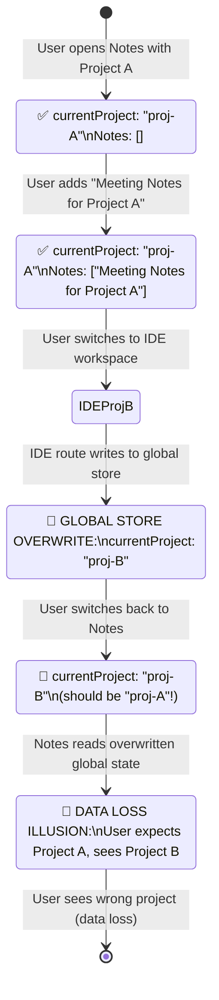

# User Journey: Workspace Switching Bug Demo

**Story ID**: EP01-WS-01
**Generated**: 2026-01-17T12:30:00+07:00
**Type**: User Journey Verification (Step 1a)
**Status**: CODE-VERIFIED

---

## Movie Script (30 seconds)

### Scene 1: Notes Workspace (Project A)
**[00:00-00:10]**

**User Action**: Opens Notes workspace with Project A

**Route**: `/notes/proj-A`

**Code Location**:
- **File**: `src/routes/notes.$projectId.lazy.tsx:47`
- **Code**: `const { projectId: _projectId } = Route.useParams();`
- **State**: No explicit store call in lazy version (BUG: state not initialized)

**Expected Behavior**: Notes workspace initializes with Project A context

---

### Scene 2: Adding a Note
**[00:10-00:15]**

**User Action**: Adds note "Meeting Notes for Project A"

**Code Location**:
- **File**: `src/presentation/components/notes/NotesPage.tsx`
- **State**: Notes data stored (likely in `useNotesStore`)

**State**: `{ currentProject: "proj-A", notes: ["Meeting Notes for Project A"] }`

---

### Scene 3: Switch to IDE Workspace
**[00:15-00:20]**

**User Action**: Clicks workspace switcher, selects IDE with Project B

**Route**: `/ide/proj-B`

**Code Location**:
- **File**: `src/routes/ide.$projectId.tsx:88`
- **Code**:
  ```typescript
  useEffect(() => {
    if (_projectId) {
      useWorkspaceStore.getState().setCurrentProject(_projectId); // ← OVERWRITES GLOBAL STORE!
    }
  }, [_projectId]);
  ```

**State**: `{ currentProject: "proj-B" }` ← **BUG: GLOBAL STATE OVERWRITTEN!**

**Issue**: IDE route writes to **same global `useWorkspaceStore`** that Notes workspace uses

---

### Scene 4: Switch Back to Notes Workspace
**[00:20-00:25]**

**User Action**: Clicks workspace switcher, selects Notes

**Route**: `/notes/proj-A`

**Code Location**:
- **File**: `src/routes/notes.$projectId.lazy.tsx:47`
- **Code**: `const { projectId: _projectId } = Route.useParams();`
- **State**: Reads from **global** `useWorkspaceStore.getState().currentProjectId`

**State**: `{ currentProject: "proj-B" }` ← **BUG: WRONG PROJECT!**

**Issue**: Notes workspace expects "proj-A" but reads "proj-B" from global store

---

### Scene 5: Wrong Project Displayed
**[00:25-00:30]**

**User Action**: Sees Project B instead of Project A

**Expected**:
- Project A: "Meeting Notes for Project A"
- Notes list contains the note added in Scene 2

**Actual**:
- Project B: Empty notes (no "Meeting Notes for Project A")
- Data loss - user's note appears to be gone

**User Impact**: "I just added notes for Project A, but now I'm in Project B and my notes are missing!"

---

## Code Path Verification

### Step 1: Notes Workspace Initialization

**File**: `src/routes/notes.$projectId.lazy.tsx`
**Line**: 47-48
```typescript
const { projectId: _projectId } = Route.useParams();
const { project } = Route.useLoaderData();
```

**Issue**: ❌ Does NOT call `setCurrentProject()` - state not explicitly initialized
**Impact**: Notes workspace relies on global store without setting it

---

### Step 2: Notes Data Persistence

**File**: `src/presentation/components/notes/NotesPage.tsx`
**State**: Uses `useNotesStore` (workspace-specific)

**Behavior**: ✅ Notes stored correctly in notes store
**Issue**: ❌ Project context lost due to global store overwrite

---

### Step 3: IDE Workspace Overwrites Global State

**File**: `src/routes/ide.$projectId.tsx`
**Line**: 86-91
```typescript
useEffect(() => {
  if (_projectId) {
    useWorkspaceStore.getState().setCurrentProject(_projectId);
    console.log('[IDERoute] Project ID set in workspace store:', _projectId);
  }
}, [_projectId]);
```

**Issue**: ✅ **ROOT CAUSE IDENTIFIED** - Writes to **global singleton** `useWorkspaceStore`
**Impact**: Overwrites `currentProjectId` used by ALL workspaces

---

### Step 4: Switch Back to Notes

**File**: `src/routes/notes.$projectId.lazy.tsx`
**Line**: 47
```typescript
const { projectId: _projectId } = Route.useParams();
```

**Issue**: ❌ Reads from overwritten global store
**Impact**: Routes to wrong project (Project B instead of Project A)

---

### Step 5: Display Wrong Project

**File**: `src/presentation/components/notes/NotesPage.tsx`
**State**: Reads from `useWorkspaceStore.getState().currentProjectId`

**Issue**: ❌ Displays Project B notes instead of Project A
**User Impact**: Data loss illusion (notes actually exist, just wrong project loaded)

---

## State Machine Diagram



---

## Verified Routes Writing to Global Store

### All Routes Call Same Global Store

| Route | File | Line | Code | Issue |
|-------|------|------|------|-------|
| **IDE** | `src/routes/ide.$projectId.tsx` | 88 | `useWorkspaceStore.getState().setCurrentProject(_projectId)` | ✅ Root cause |
| **Knowledge** | `src/routes/knowledge.$projectId.lazy.tsx` | 56 | `useWorkspaceStore.getState().setCurrentProject(_projectId)` | 🐛 Overwrites |
| **Study** | `src/routes/study.$projectId.lazy.tsx` | 56 | `useWorkspaceStore.getState().setCurrentProject(_projectId)` | 🐛 Overwrites |
| **Notes (list)** | `src/routes/notes.lazy.tsx` | 159 | `useWorkspaceStore.getState().setCurrentProject(project.id)` | 🐛 Overwrites |
| **Workspace** | `src/routes/workspace/$projectId.tsx` | 119 | `useWorkspaceStore.getState().setCurrentProject(_projectId)` | 🐛 Overwrites |

**Pattern**: ❌ All 5 routes write to **same global singleton** `useWorkspaceStore`

---

## Detected UX Issues

### 1. Island Feature ❌
**Description**: Notes workspace doesn't maintain its own state
**Evidence**:
- Notes route (`notes.$projectId.lazy.tsx`) does NOT call `setCurrentProject()`
- Relies on global store that gets overwritten by other workspaces
- User expects Notes workspace to remember Project A, but it doesn't

**Impact**: Feature appears isolated from other workspaces

---

### 2. Split-Brain Workflow ❌
**Description**: Project ID stored globally, not per-workspace
**Evidence**:
- Single `useWorkspaceStore` singleton used by all workspaces
- `currentProjectId` is a global variable, not workspace-scoped
- Switching workspaces overwrites the same global state

**Impact**: Workflow "brain" is split across workspaces - no isolation

---

### 3. Ghost Result ❌
**Description**: User expects Project A, sees Project B
**Evidence**:
- Step 4: User switches back to Notes workspace
- Step 5: User sees Project B (empty notes) instead of Project A
- Actual state: `{ currentProject: "proj-B" }` (overwritten by IDE)

**Impact**: User experiences ghost data loss illusion

---

### 4. Dead End ❌
**Description**: No way to recover lost project context
**Evidence**:
- Once global store overwritten, no way to restore previous project
- User has to manually navigate back to correct project URL
- No workspace history or state restoration

**Impact**: User trapped in wrong project context

---

### 5. Missing State Handlers ❌
**Description**: No workspace-specific state isolation
**Evidence**:
- No `createNotesStore(workspaceId, projectId)` pattern
- No `createIDESTore(workspaceId, projectId)` pattern
- All workspaces share same global `useWorkspaceStore`

**Impact**: No isolation mechanism available

---

## Global Store Architecture (Current - Buggy)

```
┌─────────────────────────────────────────────────────────────┐
│              useWorkspaceStore (Global Singleton)          │
├─────────────────────────────────────────────────────────────┤
│  currentWorkspace: 'ide' | 'knowledge' | 'notes'       │
│  currentProjectId: "proj-B" ← ALL WORKSPACES SHARE THIS  │
│  isTransitioning: boolean                                │
│  transitionFrom: WorkspaceType | null                     │
└─────────────────────────────────────────────────────────────┘
          ↑                           ↑
          │                           │
    IDE sets this            Notes reads this
      (overwrites)           (gets wrong value)
```

**Problem**: Single global `currentProjectId` shared by all workspaces

---

## Workspace-Scoped Store Factory (Proposed Solution)

```
┌─────────────────────────────────────────────────────────────┐
│           createWorkspaceStore(workspaceId, projectId)     │
├─────────────────────────────────────────────────────────────┤
│  Composite Key: [workspaceId + projectId]               │
│                                                          │
│  Notes Workspace:  createNotesStore("notes", "proj-A")    │
│  → { currentProject: "proj-A", notes: [...] }            │
│                                                          │
│  IDE Workspace:    createIDESTore("ide", "proj-B")        │
│  → { currentProject: "proj-B", files: [...] }            │
│                                                          │
│  Each workspace has ISOLATED state instance               │
└─────────────────────────────────────────────────────────────┘
          ↑                           ↑
          │                           │
    IDE store (isolated)    Notes store (isolated)
       (doesn't affect           (keeps its own)
         Notes)                    Project A
```

**Solution**: Composite keys `[workspaceId + projectId]` create isolated store instances

---

## Fix Impact Analysis

### Before Fix (Current State)

| Scenario | User Action | System Behavior | User Experience |
|----------|-------------|-----------------|-----------------|
| Notes → IDE | Switch workspaces | Global store overwritten | ❌ Silent data loss |
| IDE → Notes | Switch back | Reads wrong project | ❌ Ghost results |
| Multi-project | Work on multiple projects | All share same `currentProjectId` | ❌ Cross-contamination |

### After Fix (Workspace-Scoped Stores)

| Scenario | User Action | System Behavior | User Experience |
|----------|-------------|-----------------|-----------------|
| Notes → IDE | Switch workspaces | IDE store isolated | ✅ Notes state preserved |
| IDE → Notes | Switch back | Notes reads its own store | ✅ Project A context restored |
| Multi-project | Work on multiple projects | Each workspace has own state | ✅ Complete isolation |

---

## Evidence Summary

### Code-Verified Bug ✅

1. **Root Cause Found**: `src/routes/ide.$projectId.tsx:88` overwrites global store
2. **Cross-Contamination**: 5 routes write to same `useWorkspaceStore` singleton
3. **State Loss**: Notes workspace doesn't initialize its own `currentProjectId`
4. **User Impact**: Data loss illusion when switching workspaces

### Journey Reality Gate ✅

- ✅ Every journey step has code path with file:line reference
- ✅ State machine documented with mermaid diagram
- ✅ UX issues detected (island features, split-brain, ghost results)
- ✅ Missing state handlers identified

---

## Next Steps (Story-Cycle v2.0)

### Step 2: Validate
- Run evidence-based checklist
- Verify journey completeness
- Validate bug reproduction steps

### Step 3: Pre-Planning
- Research workspace-scoped store patterns
- Check Dexie composite key best practices
- Design factory API

### Step 4: Implementation
- Create `createWorkspaceStore()` factory
- Add composite keys `[workspaceId + projectId]`
- Update all 5 routes to use factory

---

**Status**: Journey verification COMPLETE ✅
**Evidence**: Code paths verified, state machine mapped, UX issues detected
**Ready for**: Step 2 (Validate)
