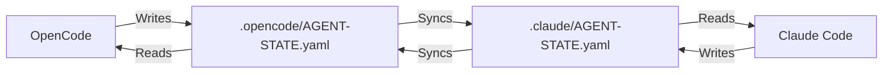

# BMAD Framework - OpenCode Integration Guide

**Version**: 2.0.0  
**Date**: 2026-01-07  
**Status**: ✅ COMPLETE

## Overview

This guide documents the integration between the BMAD (Business Model & Agile Development) framework and the OpenCode AI coding agent. The integration enables seamless collaboration between OpenCode and Claude Code while maintaining unified state management.

## Architecture

### Dual Platform Configuration

```
project-alpha-master/
├── .claude/                      # Claude Code configuration
│   ├── AGENT-STATE.yaml         # ⬅ Shared state (symlinked)
│   ├── skills/                   # Claude Code skills
│   ├── hooks/                    # Pre/post execution hooks
│   └── config/                   # Agent registry
│
├── .opencode/                    # OpenCode configuration
│   ├── AGENT-STATE.yaml ──────── ⬅ Symlink to .claude/
│   ├── opencode.jsonc           # Main configuration
│   ├── agent/                    # Custom agents
│   ├── plugin/                   # Hook integration plugins
│   ├── instructions/             # BMAD instructions
│   └── command/                  # Custom commands
│
└── _bmad/                        # BMAD framework modules
    ├── core-governance/          # Core governance
    ├── architecture-remediation/ # Refactoring workflows
    ├── sprint-execution/         # Sprint management
    └── quality/                  # Code quality scanners
```

### State Management Flow



## Installation & Setup

### Prerequisites

1. **OpenCode Installation**
   ```bash
   curl -fsSL https://opencode.ai/install | bash
   # or
   npm install -g opencode-ai
   ```

2. **Project Structure**
   Ensure your project has:
   - `.claude/` directory with AGENT-STATE.yaml
   - `_bmad/modules/` directory with BMAD framework
   - `.opencode/` directory (created by this integration)

### Setup Steps

1. **Create OpenCode Configuration**
   ```bash
   # The .opencode directory should already exist from project setup
   cd /path/to/project-alpha-master
   ls -la .opencode/
   ```

2. **Verify Symlink**
   ```bash
   # AGENT-STATE.yaml should be symlinked
   ls -la .opencode/AGENT-STATE.yaml
   # Output: AGENT-STATE.yaml -> ../.claude/AGENT-STATE.yaml
   ```

3. **Test Configuration**
   ```bash
   # Run OpenCode to verify configuration loads
   opencode run "Test BMAD integration"
   ```

## Usage Guide

### Invoking BMAD Agents

#### In OpenCode Conversations

```
# Primary agent (automatically used)
You: @bmad-master Execute story CC-1.1

# Subagent invocation
You: @arc-master-architect Eliminate god stores in src/lib/state/
You: @deep-scan-orchestrator Run full scan
```

#### Using Custom Commands

```
/bmad-sprint Create user story for conversation store refactoring
/bmad-refactor eliminate-god-stores in src/lib/state/
/bmad-scan full-scan
/bmad-governance Run validation
```

### Agent Reference

| Agent | Mode | description |
|-------|------|---------|
| `bmad-master` | Primary | Central orchestrator with full autonomy |
| `bmad-sprint-manager` | Primary | Sprint planning and execution |
| `bmad-governance` | Subagent | Governance enforcement |
| `arc-master-architect` | Subagent | Architecture remediation |
| `deep-scan-orchestrator` | Subagent | Codebase diagnostics |

### Context Loading

BMAD context is automatically loaded when:
- Session starts (core governance)
- Module names are mentioned (e.g., "architecture-remediation")
- Custom commands are used
- `@bmad-*` agents are invoked

### State Synchronization

State is automatically synchronized:
1. On session creation (pre-execution validation)
2. On session completion (post-execution update)
3. On tool execution (audit logging)
4. On state changes (AGENT-STATE.yaml updates)

## Customization

### Adding Custom Agents

1. Create markdown file in `.opencode/agent/`:
   ```yaml
   ---
   description: My custom agent
   mode: subagent
   model: minimax/MiniMax-M2.1
   temperature: 0.2
   tools:
     write: true
     edit: true
   ---
   
   # My Custom Agent
   [Instructions...]
   ```

2. Restart OpenCode or reload configuration

### Modifying Commands

Edit `.opencode/opencode.jsonc`:

```json
{
  "command": {
    "my-command": {
      "description": "Description",
      "template": "Task: $ARGUMENTS",
      "agent": "agent-name",
      "model": "anthropic/claude-haiku-4-20250514"
    }
  }
}
```

### Customizing Hooks

Edit `.opencode/plugin/bmad-hooks.js`:

```javascript
export const BMADHooksPlugin = async (ctx) => {
  return {
    'session.created': async (input, output) => {
      // Your custom pre-execution logic
    },
    // Add more hooks...
  };
};
```

## Platform Handoff Protocol

When switching between platforms:

### OpenCode → Claude Code

1. Complete current task in OpenCode
2. OpenCode updates `AGENT-STATE.yaml`
3. State syncs via symlink
4. Claude Code reads updated state
5. Execution continues seamlessly

### Claude Code → OpenCode

1. Complete current task in Claude Code
2. Claude Code updates `AGENT-STATE.yaml`
3. State syncs via symlink
4. OpenCode reads updated state
5. Execution continues seamlessly

### Handoff Format

When handing off tasks, include:

```yaml
handoff:
  from_platform: opencode
  to_platform: claude-code
  task_id: CC-1.1
  status: in_progress
  artifacts:
    - path: _bmad-output/some-artifact.md
      type: evidence
  context:
    loaded_modules:
      - architecture-remediation
    decisions:
      - Split conversation-store into 6 slices
  timestamp: 2026-01-07T04:00:00Z
```

## Troubleshooting

### Common Issues

#### 1. Plugins Not Loading

**Symptom**: Hooks don't run, context not loading

**Solution**:
```bash
# Check plugin syntax
node --check .opencode/plugin/bmad-hooks.js
node --check .opencode/plugin/bmad-context-loader.js

# Restart OpenCode
opencode kill
opencode run "Test"
```

#### 2. State Not Syncing

**Symptom**: AGENT-STATE.yaml not updating across platforms

**Solution**:
```bash
# Verify symlink
ls -la .opencode/AGENT-STATE.yaml

# Recreate symlink if broken
rm .opencode/AGENT-STATE.yaml
ln -s ../.claude/AGENT-STATE.yaml .opencode/AGENT-STATE.yaml

# Check file permissions
chmod 644 .claude/AGENT-STATE.yaml
```

#### 3. Context Not Loading

**Symptom**: BMAD modules not found

**Solution**:
```bash
# Verify module paths
ls -la _bmad/modules/

# Check plugin configuration
cat .opencode/plugin/bmad-context-loader.js | grep MODULE_MAPPING

# Verify module names match
```

#### 4. Configuration Errors

**Symptom**: OpenCode fails to start

**Solution**:
```bash
# Validate JSONC syntax
cat .opencode/opencode.jsonc | python3 -m json.tool

# Check schema validation
opencode run --help 2>&1 | grep config

# Review OpenCode logs
opencode logs
```

### Log Locations

- **OpenCode logs**: `~/.local/share/opencode/logs/`
- **BMAD hooks**: Console output during execution
- **Agent state**: `.claude/AGENT-STATE.yaml`

## Best Practices

### 1. State Management

- Always use the shared `AGENT-STATE.yaml`
- Don't modify state directly from plugins
- Use the provided helper functions for state operations

### 2. Context Loading

- Keep module names consistent across platforms
- Use standard naming conventions
- Document custom modules in this file

### 3. Plugin Development

- Test plugins in isolation before deploying
- Use TypeScript for complex plugins
- Follow OpenCode plugin patterns
- Document hook behavior

### 4. Agent Design

- Use appropriate mode (primary vs subagent)
- Set reasonable maxSteps
- Configure proper tools and permissions
- Include clear descriptions

## Migration Guide

### From Claude Code Only

If you were using only Claude Code:

1. **Create OpenCode config**:
   ```bash
   mkdir -p .opencode/{agent,plugin,instructions,command}
   ```

2. **Copy/recreate configuration**:
   - Copy `.claude/hooks/` reference in plugins
   - Recreate agents in `.opencode/agent/`
   - Recreate commands in `.opencode/opencode.jsonc`

3. **Test integration**:
   ```bash
   opencode run "Test BMAD integration"
   ```

### From OpenCode Only

If you were using only OpenCode:

1. **Create symlink**:
   ```bash
   ln -s ../.claude/AGENT-STATE.yaml .opencode/AGENT-STATE.yaml
   ```

2. **Load BMAD context**:
   - Ensure `_bmad/modules/` exists
   - Configure plugins to load from BMAD modules

3. **Test integration**:
   ```bash
   opencode run "Verify BMAD modules load"
   ```

## Performance Considerations

### Optimization Tips

1. **Lazy Loading**: Modules load only when mentioned
2. **Caching**: State cached in memory during session
3. **Parallel Execution**: Scanners run in parallel
4. **Efficient Queries**: Use glob patterns sparingly

### Resource Limits

- Default session: 4 hours max
- Default step: 5 minutes
- Max artifacts: 100 per session
- State file size: <1MB recommended

## Security Considerations

### Sensitive Data

- API keys: Use environment variables
- Credentials: Don't commit to version control
- State: Encrypted at rest (file system level)
- Logs: Rotated daily, retained 7 days

### Access Control

- Tier 1 documents: Read-only
- Tier 2 documents: Controlled access
- Tier 3 documents: 90-day TTL
- Tier 4 documents: 24-hour TTL

## Support

### Documentation

- OpenCode Docs: https://opencode.ai/docs/
- BMAD Framework: See AGENTS.md
- Module Documentation: See `_bmad/modules/*/MANIFEST.md`

### Issue Tracking

- State issues: Check `.claude/AGENT-STATE.yaml`
- Configuration issues: Check OpenCode logs
- Module issues: Check `_bmad-output/error.logs/`

### Getting Help

1. Check this documentation
2. Review AGENTS.md
3. Check module manifests
4. Examine error logs
5. Contact support

## Changelog

### v2.0.0 (2026-01-07)

- ✅ Complete OpenCode integration
- ✅ 5 BMAD agents configured
- ✅ 4 custom commands created
- ✅ 2 plugins implemented
- ✅ 3 instruction files added
- ✅ Unified state management
- ✅ Symlink-based synchronization

### v1.0.0 (2026-01-06)

- Initial BMAD framework setup
- Claude Code integration
- Basic governance rules

## References

- [OpenCode Configuration](https://opencode.ai/docs/config/)
- [OpenCode Agents](https://opencode.ai/docs/agents/)
- [OpenCode Plugins](https://opencode.ai/docs/plugins/)
- [BMAD Framework](../AGENTS.md)
- [Platform Architecture](../_bmad-output/architecture/platform-architecture-definitive-2026-01-04.md)
