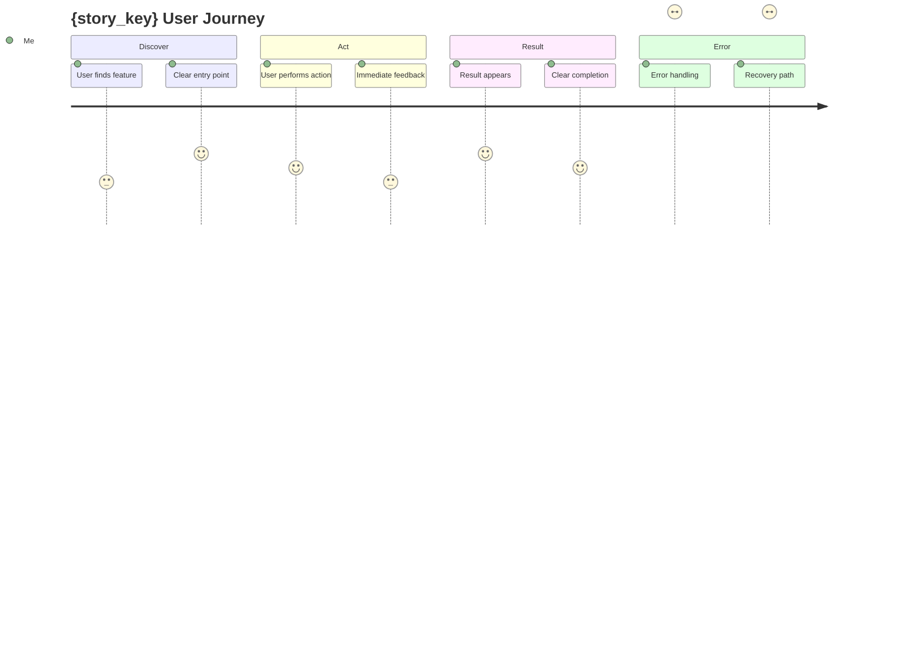

# Step 1a: User Journey Simulation

## STEP GOAL

Validate Product Reality through "The Movie Script Test" - simulate a 30-second demo to detect fragmented UX, nonsensical flows, and "island" features BEFORE implementation.

## MANDATORY EXECUTION RULES

- 📖 READ COMPLETELY before execution
- 🎯 Generate 30-second demo script
- 📋 Verify every UI action has a clear result
- 🔄 Update frontmatter on completion

## SEQUENCE OF INSTRUCTIONS

### 1. The Movie Script Test

Generate a **30-second demo script** that tells the story of a user using this feature:

```yaml
demo_script_template:
  format: "User Action → System Response"

  structure:
    - "User starts at: {screen/state}"
    - "User performs: {action}"
    - "System shows: {immediate UI feedback}"
    - "User sees: {result location}"
    - "User then: {next action or complete}"
```

**Critical Questions**:
1. Where does the user START?
2. What does the user CLICK/TYPE/ASK?
3. Where does the RESULT APPEAR?
4. What does the user SEE while waiting?
5. What happens if it FAILS?

### 2. Detect UX Anti-Patterns

```yaml
anti_patterns_to_detect:
  island_feature:
    description: "Feature with no clear entry point"
    check: "Where does user discover this feature?"

  split_brain:
    description: "Dual/fragmented workflows for same task"
    check: "Are there multiple ways to do this that conflict?"

  ghost_result:
    description: "Action with no visible result"
    check: "After clicking, where does the result appear?"

  dead_end:
    description: "Action that traps user"
    check: "Can user get back to where they were?"

  empty_states:
    description: "No handling for zero-result scenarios"
    check: "What if there's nothing to show?"

  loading_vacuum:
    description: "No feedback during processing"
    check: "What does user see while waiting?"
```

### 3. Generate Journey Map

Create `journey-map.mermaid` file:



**Rating Scale**: 1 = Painful, 3 = OK, 5 = Delightful

### 4. Display Journey Summary

```
═══════════════════════════════════════════════════════════
USER JOURNEY SIMULATION - THE MOVIE SCRIPT TEST
═══════════════════════════════════════════════════════════

Story: {story_key}

30-Second Demo Script:
┌─────────────────────────────────────────────────────────┐
│ "[User opens app at {screen}]"                         │
│ "[User clicks/taps/asks: {action}]"                    │
│ "[System shows: {immediate feedback}]"                 │
│ "[Result appears: {location}]"                         │
│ "[User then: {next action}]"                           │
└─────────────────────────────────────────────────────────┘

Journey Map Generated: {journey-map.mermaid}

Anti-Patterns Detected:
{list of any detected issues}

Cohesion Score: {1-5}
- Entry Point: {rating} - {notes}
- Action Clarity: {rating} - {notes}
- Result Visibility: {rating} - {notes}
- Error Handling: {rating} - {notes}

Overall: {PASS → PROCEED | FAIL → REDEFINE STORY}

Options:
[P] Proceed to validation (journey passes)
[R] Redefine story (journey fails)
[F] Flag for UX review (minor issues)
```

### 5. Handle User Choice

**P**: Journey validated → Step 2 (Validate)
**R**: Story needs redefinition → Exit with feedback
**F**: Minor issues flagged → Proceed with notes

### 6. Update Frontmatter

```yaml
---
stepsCompleted: [1, "1a"]
journey_validated: true
journey_score: {1-5}
journey_map: "{output_folder}/journey-map.mermaid"
anti_patterns_detected: [{list}]
---
```

---

## SUCCESS METRICS

- ✅ 30-second demo script generated
- ✅ Every action has clear result location
- ✅ Loading/error states defined
- ✅ Journey map created
- ✅ No critical anti-patterns

## FAILURE METRICS

- ❌ Can't describe result location
- ❌ No entry point defined
- ❌ Missing error/empty states
- ❌ Fragmented workflow detected
- ❌ Cohesion score < 3

## GATE: Product Reality Gate

This step implements the **Product Reality Gate**. A story that can't pass the Movie Script Test will fail in production, regardless of code quality.

**ONLY WHEN journey validated, load {nextStepFile}**
