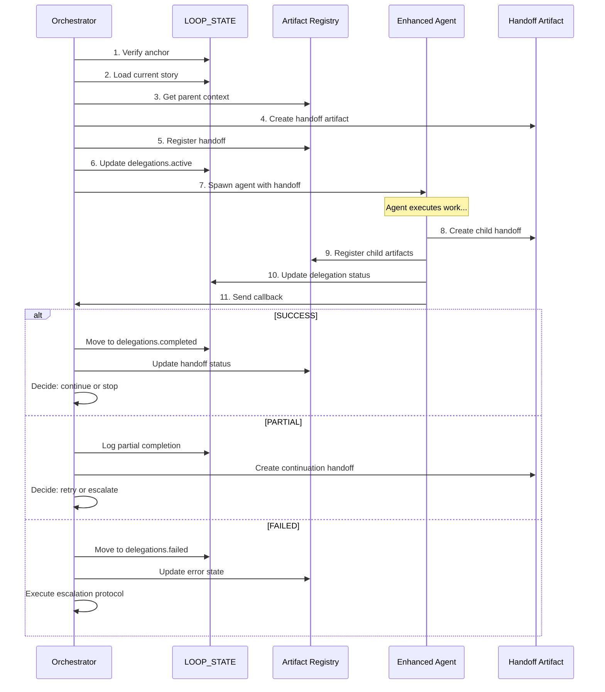

# _bmad-ext/orchestrator/delegation-protocol.md

# Delegation Protocol

> Defines how the master orchestrator delegates work to enhanced agents and receives callbacks.

---

## Overview

```
┌─────────────────┐    HANDOFF ARTIFACT    ┌─────────────────┐
│                 │ ──────────────────────▶│                 │
│   ORCHESTRATOR  │                        │  ENHANCED AGENT │
│                 │◀────────────────────── │                 │
└─────────────────┘     CALLBACK PAYLOAD    └─────────────────┘
```

---

## Protocol Phases

### Phase 1: Pre-Delegation

Before delegating, the orchestrator MUST:

```yaml
pre_delegation:
  1. Verify Anchor:
     check: "human_intent_timestamp freshness"
     threshold: "4 hours"
     on_stale: "Prompt user for confirmation"

  2. Load Parent Context:
     files:
       - "_bmad-ext/state/LOOP_STATE.yaml"
       - "_bmad-ext/state/ARTIFACT_REGISTRY.yaml"
       - "bmm-workflow-status.yaml"
     extract:
       - current_story
       - session_context
       - previous_artifacts

  3. Determine Target Agent:
     source: "_bmad-ext/orchestrator/routing-rules.yaml"
     decision: "story_type → enhanced_agent"

  4. Create Handoff Artifact:
     template: "_bmad-ext/schemas/handoff-artifact.schema.yaml"
     output: "_bmad-output/handoffs/{date}/{story_id}-orchestrator-handoff.md"
     include:
       - artifact_id (UUID)
       - parent_id (null for root handoff)
       - source_agent: "master-orchestrator"
       - target_agent: "{selected_agent}"
       - context_summary
       - handoff_data
       - acceptance_criteria
       - validation_commands
       - escalation_path

  5. Register Handoff:
     file: "_bmad-ext/state/ARTIFACT_REGISTRY.yaml"
     action: "add_artifact"
     entry:
       id: "{handoff.artifact_id}"
       type: "handoff"
       parent_id: null
       status: "PENDING"
```

---

### Phase 2: Delegation

Spawning the enhanced agent:

```yaml
delegation:
  1. Update Loop State:
     file: "_bmad-ext/state/LOOP_STATE.yaml"
     updates:
       - current.agent = "{target_agent}"
       - current.workflow = "{workflow_name}"
       - current.step = 1
       - current.step_started_at = NOW()
       - delegations.active:
           delegation_id: "{generate_uuid}"
           parent_agent: "master-orchestrator"
           child_agent: "{target_agent}"
           handoff_artifact: "{handoff_path}"
           started_at: NOW()
           timeout_minutes: 60

  2. Log Delegation:
     file: "_bmad-ext/state/DELEGATION_LOG.yaml"
     append:
       - timestamp: NOW()
         delegation_id: "{delegation_id}"
         action: "started"
         parent: "master-orchestrator"
         child: "{target_agent}"
         handoff: "{handoff_path}"

  3. Spawn Agent:
     method: "load_and_execute"
     agent: "_bmad-ext/agents/{target_agent}.md"
     context:
       - handoff_artifact: "{handoff_path}"
       - loop_state: "_bmad-ext/state/LOOP_STATE.yaml"
       - delegation_id: "{delegation_id}"
       - parent_artifact_id: "{handoff.artifact_id}"

  4. Await Callback:
     timeout: "60 minutes"
     check_interval: "30 seconds"
     on_timeout:
       - Log timeout
       - Move delegation to failed
       - Create timeout handoff
       - Decide: retry OR escalate
```

---

### Phase 3: During Delegation

While agent is executing:

```yaml
during_delegation:
  orchestrator_state: "WAITING"

  monitor:
    - check_time_elapsed: "every 30 seconds"
    - check_timeout: "after 60 minutes"

  enhanced_agent_state: "EXECUTING"
    agent_tasks:
      1. Load handoff artifact
      2. Verify parent delegation
      3. Execute assigned work
      4. Create child handoff
      5. Report completion
```

---

### Phase 4: Post-Delegation (Callback)

Receiving the callback from enhanced agent:

```yaml
callback:
  expected_format:
    payload:
      delegation_id: "{delegation_id}"
      status: "SUCCESS | PARTIAL | FAILED"
      agent: "{agent_name}"
      story_id: "{story_id}"
      artifacts_created: []
      validation_results:
        typescript_errors: 0
        tests_passed: true
        test_count: 0
        lint_errors: 0
      next_recommendation: "..."
      execution_time_seconds: 0

  on_success:
    steps:
      1. Validate Callback:
         - delegation_id matches active delegation
         - status is SUCCESS
         - validation_results show no critical errors

      2. Move Delegation:
         from: "delegations.active"
         to: "delegations.completed"
         preserve: "all metadata + callback payload"

      3. Update Story Status:
         file: "bmm-workflow-status.yaml"
         update: "story.status = DONE"

      4. Update Handoff Status:
         file: "{handoff_artifact}"
         update: "status = CONSUMED"

      5. Register Child Artifacts:
         for: "each artifact in callback.artifacts_created"
         action: "add_to_registry"
         parent_id: "{handoff.artifact_id}"

      6. Update Progress:
         - progress.stories_completed_this_session += 1
         - errors.count = 0

      7. Log Success:
         file: "_bmad-ext/state/DELEGATION_LOG.yaml"

      8. Display Success Summary:
         show: "agent, story, artifacts, validation results"

      9. Decide Next Action:
         options: [continue_to_next_story, pause_for_review, exit_session]

  on_partial:
    steps:
      1. Validate Callback:
         - status is PARTIAL
         - partial_results provided

      2. Log Partial Completion:
         file: "_bmad-ext/state/DELEGATION_LOG.yaml"
         reason: "{callback.reason}"

      3. Create Continuation Handoff:
         template: "handoff-artifact.schema.yaml"
         context: "partial completion"
         include: "remaining_work"

      4. Decide Next Action:
         options:
           - "retry_same_agent"
           - "escalate_to_different_agent"
           - "await_human_guidance"

  on_failed:
    steps:
      1. Validate Callback:
         - status is FAILED
         - error_details provided

      2. Move Delegation:
         from: "delegations.active"
         to: "delegations.failed"

      3. Update Error State:
         file: "_bmad-ext/state/LOOP_STATE.yaml"
         updates:
           - errors.count += 1
           - errors.last_error = "{error_details}"
           - errors.last_error_at = NOW()
           - errors.recovery_attempts += 1

      4. Log Failure:
         file: "_bmad-ext/state/DELEGATION_LOG.yaml"
         include: "full_error_context"

      5. Execute Escalation Protocol:
         file: "_bmad-ext/orchestrator/escalation-protocol.md"
         follow: "failure_handling"

      6. Decide Next Action:
         if: "errors.recovery_attempts < max_recovery_attempts"
         then: "retry_with_different_approach"
         else: "escalate_to_human"
```

---

## Callback Payload Schema

```yaml
callback_payload:
  required_fields:
    - delegation_id: "UUID from active delegation"
    - status: "SUCCESS | PARTIAL | FAILED"
    - agent: "Agent name (e.g., 'dev-ext')"
    - story_id: "Story identifier"

  optional_fields:
    - artifacts_created: ["path/to/artifact1", ...]
    - validation_results:
        typescript_errors: 0
        tests_passed: true
        test_count: 42
        lint_errors: 0
    - next_recommendation: "string"
    - execution_time_seconds: 120
    - partial_results: {}  # when status is PARTIAL
    - error_details: "string"  # when status is FAILED

example_success_payload:
  delegation_id: "abc-123-def"
  status: "SUCCESS"
  agent: "dev-ext"
  story_id: "FS-05"
  artifacts_created:
    - "_bmad-output/handoffs/2026-01-10/FS-05-dev-handoff.md"
  validation_results:
    typescript_errors: 0
    tests_passed: true
    test_count: 15
    lint_errors: 0
  next_recommendation: "Ready for code review"
  execution_time_seconds: 180

example_partial_payload:
  delegation_id: "abc-123-def"
  status: "PARTIAL"
  agent: "dev-ext"
  story_id: "FS-05"
  reason: "External API dependency unavailable"
  partial_results:
    completed_tasks: [1, 2, 3]
    remaining_tasks: [4, 5]
    blocker: "API rate limit exceeded"
  next_recommendation: "Retry after API quota resets"

example_failed_payload:
  delegation_id: "abc-123-def"
  status: "FAILED"
  agent: "dev-ext"
  story_id: "FS-05"
  error_details: |
    TypeScript compilation failed with 5 errors:
    - src/domain/services/FileLockService.ts:42 - Type 'string' is not assignable to type 'number'
    - src/infrastructure/persistence/stores/note-store.ts:15 - Property 'doesNotExist' does not exist
    ...
  recovery_attempts: 2
  next_recommendation: "Escalate to human for type system review"
```

---

## Delegation Timeout Handling

```yaml
timeout_handling:
  timeout_duration: "60 minutes"
  check_interval: "30 seconds"

  on_timeout_reached:
    1. Log Timeout:
       file: "_bmad-ext/state/DELEGATION_LOG.yaml"
       entry:
         - timestamp: NOW()
           delegation_id: "{id}"
           action: "timeout"
           duration: "{time_elapsed}"

    2. Move Delegation:
       from: "delegations.active"
       to: "delegations.failed"

    3. Create Timeout Handoff:
       output: "_bmad-output/handoffs/{date}/{story_id}-timeout.md"
       status: "TIMEOUT"
       include:
         - what_was_attempted
         - time_elapsed
         - last_known_state

    4. Decide Recovery:
       if: "first_timeout"
       then: "retry_with_extended_timeout"
       else: "escalate_to_orchestrator_for_decision"
```

---

## Handoff Artifact Chaining

```yaml
chaining:
  # First level: Orchestrator → Agent
  handoff_1:
    artifact_id: "aaa-111"
    parent_id: null
    source_agent: "master-orchestrator"
    target_agent: "dev-ext"
    story_id: "FS-05"

  # Second level: Agent → Output
  handoff_2:
    artifact_id: "bbb-222"
    parent_id: "aaa-111"
    source_agent: "dev-ext"
    target_agent: "master-orchestrator"
    story_id: "FS-05"

  # Registry traceability:
  registry_entry_bbb:
    id: "bbb-222"
    parent_id: "aaa-111"
    children_ids: []
    # Can trace back: bbb-222 → aaa-111 → (human intent)

  # When querying for story artifacts:
  query_result:
    story_id: "FS-05"
    artifacts:
      - "aaa-111" (orchestrator → dev-ext)
      - "bbb-222" (dev-ext → orchestrator)
      - "ccc-333" (any code files created)
      - "ddd-444" (test files created)
```

---

## Delegation Flow Diagram



---

## Version History

| Version | Date | Changes |
|---------|------|---------|
| 1.0.0 | 2026-01-10 | Initial delegation protocol for Phase 3 |
