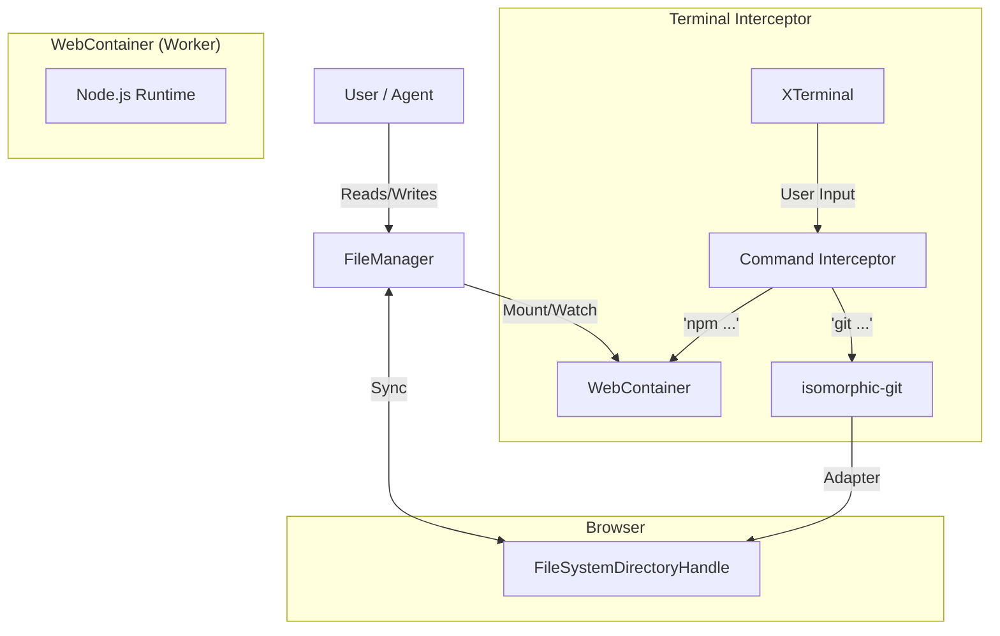

# Advanced IDE Spike Specification: WebContainers + Git + Local FS

**Date:** 2025-12-10
**Phase:** 3 - Advanced Architecture Spike
**Status:** Specification (updated to reflect current TanStack Start + Vite implementation; some sections remain target design)
**Based on:** `technical-via-gent-client-side-agentic-ide-stack-research-2025-12-10.md`

## 1. Purpose

To build a **comprehensive proof-of-concept** that validates the "Holy Grail" of client-side IDEs:
1.  **Zero-Network Latency**: Running entirely in the browser (WebContainers).
2.  **Real Persistence**: Editing files directly on the user's local machine (File System Access API).
3.  **Real Version Control**: Full Git capabilities (isomorphic-git) without a proxy server.
4.  **Agentic Integration**: AI agents modifying the *local* file system securely.

## 2. Architecture

### 2.1 The "Sync Layer" (Heart of the Spike)

The critical component is the **FileManager** which acts as the bridge between:
1.  **Local FS** (`FileSystemDirectoryHandle` from Browser) - *The Source of Truth*
2.  **Virtual FS** (`WebContainer` instance) - *The Runtime*
3.  **Git Layer** (`isomorphic-git`) - *The Version Control*



### 2.2 Routing Strategy (`src/routes/workspace/ide.tsx`)

**Current implementation (spike):**

*   **Route file**: `src/routes/workspace/ide.tsx`
*   **Runtime path**: `/workspace/ide`
*   **SSR behaviour**: `ssr: false` for this route to allow WebContainers + File System Access APIs.

**Target design (not yet implemented in spike):**

Using **TanStack Router** with `zodValidator` to manage IDE state in the URL, ensuring shareability and deep-linking.

*   **Intended logical route** (for a future multi-project workspace): `/workspace/$projectId/ide`
*   **Search Params Schema** (`IdeSearchSchema`):
    *   `folder`: `string` (Current open folder path, virtual)
    *   `file`: `string` (Current active file)
    *   `view`: `'code' | 'diff' | 'mcp'`
    *   `terminals`: `array` (Active terminal IDs)
    *   `mode`: `'local' | 'memory'` (Backing store type)

## 3. Implementation Requirements

### 3.1 Dependencies (aligned with current spike)

The advanced-ide spike currently uses the following core dependencies (see `spikes/advanced-ide-spike/package.json`):

```json
{
  "dependencies": {
    "@webcontainer/api": "^1.4.0",
    "isomorphic-git": "^1.27.0",
    "browser-fs-access": "^0.35.0",
    "@tanstack/react-router": "^1.140.0",
    "@tanstack/react-start": "^1.140.0",
    "@tanstack/router-plugin": "^1.140.0",
    "zod": "^4.1.11"
  }
}
```

Additional routing/search param validation using `@tanstack/zod-adapter` remains **planned** and is not yet wired into the spike.

### 3.2 Component Specifications

#### A. FileManager Service
*   **Interface**:
    *   `selectDirectory()`: Prompts user -> `FileSystemDirectoryHandle`.
    *   `mount()`: Crawls handle -> `FileSystemTree` -> `webcontainer.mount()`.
    *   `writeFile(path, content)`: Writes to handled AND WebContainer (optimistic UI).
    *   `readFile(path)`: Reads from handle (primary) or WebContainer (fallback).
    *   `watch()`: (Optional) Polling/Event based sync.

#### B. Git Service
*   **Interface**:
    *   `clone(url, dir)`
    *   `commit(message)`
    *   `push(remote, token)`
    *   `clone(url, dir)`
    *   `commit(message)`
    *   `push(remote, token)`
    *   **Architecture**:
        *   **Interceptor**: Detects `git` commands from Terminal input.
        *   **LocalGitFS**: Custom adapter implementing `isomorphic-git`'s `fs` interface (promises) backed by `FileSystemDirectoryHandle`.
        *   *Note*: Does not run INSIDE WebContainer. Runs in Main Thread, updates visible FS.

#### C. Agent Tools Integration
*   Verify that `TanStack AI` tools (`write_file`, `execute_command`) call `FileManager` methods.
*   *Security Check*: Agent should not be able to write outside the mounted handle.

## 4. Spike Steps (Execution Plan)

1.  **Setup**: Clone `via-gent` (or use existing spike repo).
2.  **Install**: Add `isomorphic-git`, `@webcontainer/api`.
3.  **Implement `FileManager`**: Create the bidirectional sync logic.
4.  **Implement `GitService`**: Create the `fs` adapter for isomorphic-git.
5.  **Wire UI**: Add "Open Folder" button, File Tree, and Terminal.
6.  **Wire Agent**: Connect `TanStack AI` tools to `FileManager`.
7.  **Verify**:
    *   User opens a local folder.
    *   WebContainer boots and runs `npm install`.
    *   Agent creates a file.
    *   User sees file on *Real Disk*.
    *   User commits via UI.

## 5. Success Criteria

*   [ ] **Local Edit**: Editing a file in Monaco updates the file on the user's hard drive.
*   [ ] **Runtime Sync**: Running `cat file.txt` in WebContainer terminal shows the updated content.
*   [ ] **Git Ops**: `git status` (via isomorphic-git) correctly shows the modified file.
*   [ ] **Agent Action**: An agent can write `hello.txt` and it appears in Windows Explorer.
