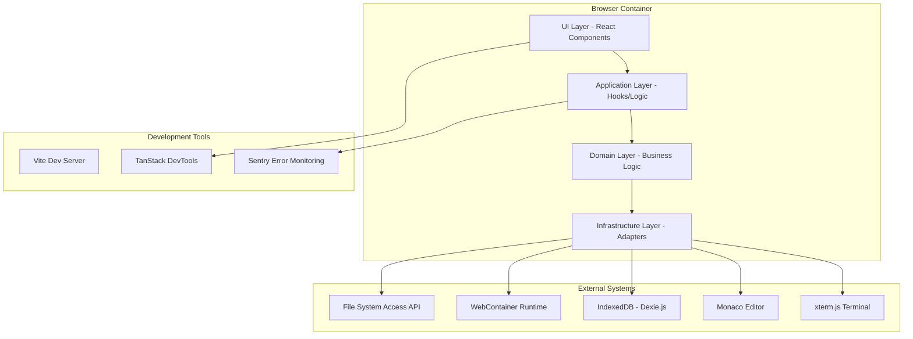
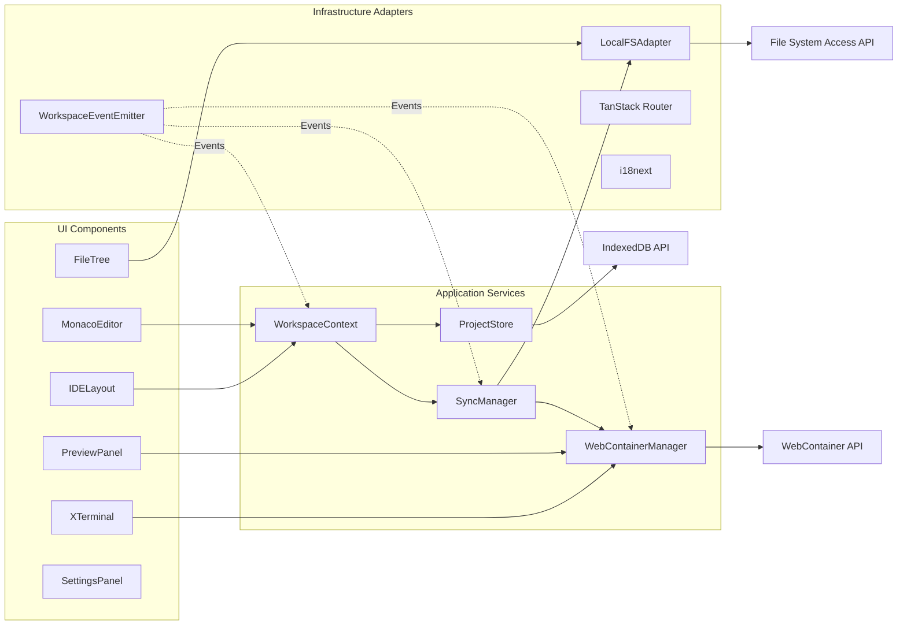
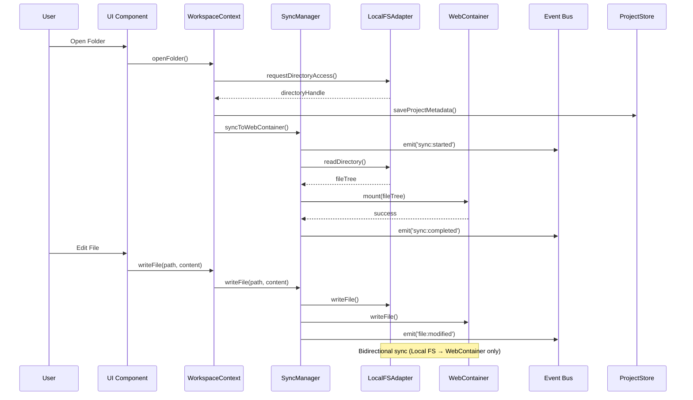

# Via-gent Runtime Architecture Analysis

**Date:** 2025-12-22  
**Phase:** 2 - Architectural Slices  
**Status:** Draft  
**Author:** @bmad-bmm-architect

## Executive Summary

Via-gent is a 100% client-side browser-based IDE that leverages WebContainers to provide a local development environment with bidirectional file synchronization between the browser's File System Access API and WebContainer's in-memory filesystem. This document provides a comprehensive runtime architecture analysis focusing on domains/modules, layers, and integration surfaces.

## 1. System Context

### 1.1 High-Level Architecture

```
┌─────────────────────────────────────────────────────────────────────┐
│                         Browser Environment                         │
├─────────────────────────────────────────────────────────────────────┤
│  ┌──────────────┐  ┌──────────────┐  ┌──────────────────────────┐  │
│  │   UI Layer   │  │ Application  │  │       Domain Layer       │  │
│  │  (React)     │◄─┤   Layer      │◄─┤  (Business Logic)        │  │
│  │              │  │  (Hooks)     │  │                          │  │
│  └──────┬───────┘  └──────┬───────┘  └──────────────┬───────────┘  │
│         │                  │                         │              │
│         ▼                  ▼                         ▼              │
│  ┌──────────────┐  ┌──────────────┐  ┌──────────────────────────┐  │
│  │   TanStack   │  │   Event Bus  │  │   State Management       │  │
│  │   Router     │  │ (eventemitter3)│  │ (TanStack Store +       │  │
│  │              │  │              │  │    React Context)        │  │
│  └──────┬───────┘  └──────┬───────┘  └──────────────┬───────────┘  │
│         │                  │                         │              │
│         ▼                  ▼                         ▼              │
│  ┌─────────────────────────────────────────────────────────────────┐ │
│  │                    Infrastructure Layer                         │ │
│  │  ┌──────────────┐  ┌──────────────┐  ┌──────────────────────┐  │ │
│  │  │ File System  │  │ WebContainer │  │    Persistence       │  │ │
│  │  │   Sync       │  │   Manager    │  │   (IndexedDB)        │  │ │
│  │  │              │  │              │  │                      │  │ │
│  │  └──────┬───────┘  └──────┬───────┘  └──────────┬───────────┘  │ │
│  │         │                  │                     │              │ │
│  │         ▼                  ▼                     ▼              │ │
│  │  ┌────────────────────────────────────────────────────────────┐│ │
│  │  │                Browser APIs                                ││ │
│  │  │  ┌────────────┐  ┌────────────┐  ┌─────────────────────┐  ││ │
│  │  │  │ File System│  │ WebContainer│  │   IndexedDB        │  ││ │
│  │  │  │ Access API │  │   Runtime   │  │   (Dexie.js)       │  ││ │
│  │  │  └────────────┘  └────────────┘  └─────────────────────┘  ││ │
│  │  └────────────────────────────────────────────────────────────┘│ │
│  └─────────────────────────────────────────────────────────────────┘ │
└─────────────────────────────────────────────────────────────────────┘
```

## 2. Architectural Layers

### 2.1 UI Layer (Presentation)
**Location:** `src/components/`, `src/routes/`

**Responsibilities:**
- Render React components
- Handle user interactions
- Provide visual feedback
- Internationalization (i18next)

**Key Components:**
- **IDE Components** (`src/components/ide/`): Editor, Terminal, File Tree, Preview
- **UI Components** (`src/components/ui/`): Reusable components (Button, Card, etc.)
- **Layout Components** (`src/components/layout/`): IDELayout, IDEHeaderBar, PanelShell
- **Routes** (`src/routes/`): TanStack Router file-based routing

**Integration Surfaces:**
- **Props Interface:** Component props for data flow
- **Event Handlers:** User interaction callbacks
- **Context Consumers:** `useWorkspace()`, `useTheme()`, etc.

### 2.2 Application Layer (Business Logic)
**Location:** `src/lib/workspace/hooks/`, `src/lib/editor/`

**Responsibilities:**
- Coordinate between UI and Domain layers
- Manage application state transitions
- Handle side effects
- Orchestrate complex workflows

**Key Modules:**
- **Workspace Hooks** (`useWorkspaceActions.ts`, `useSyncOperations.ts`): Business logic for workspace operations
- **Editor Integration** (`src/lib/editor/`): Monaco editor configuration and management
- **Sync Operations:** File synchronization coordination

**Integration Surfaces:**
- **Custom Hooks:** `useWorkspace()`, `useSyncManager()`
- **Event Bus Subscriptions:** React to domain events
- **State Updates:** Modify TanStack Store state

### 2.3 Domain Layer (Core Business Logic)
**Location:** `src/lib/workspace/`, `src/lib/filesystem/`, `src/lib/webcontainer/`

**Responsibilities:**
- Core business rules and entities
- File system synchronization logic
- WebContainer lifecycle management
- Project persistence and metadata

**Key Modules:**
- **Workspace Context** (`WorkspaceContext.tsx`): Centralized state management
- **Sync Manager** (`sync-manager.ts`): Bidirectional file synchronization
- **WebContainer Manager** (`manager.ts`): Singleton WebContainer lifecycle
- **Project Store** (`project-store.ts`): IndexedDB persistence with Dexie.js

**Integration Surfaces:**
- **Event Bus:** `WorkspaceEventEmitter` for cross-component communication
- **API Contracts:** TypeScript interfaces for data exchange
- **Error Boundaries:** Custom error classes (`SyncError`, `PermissionDeniedError`)

### 2.4 Infrastructure Layer (External Services)
**Location:** `src/lib/filesystem/local-fs-adapter.ts`, `src/lib/persistence/`

**Responsibilities:**
- Interface with browser APIs and external services
- Abstract platform-specific details
- Provide adapters for external systems

**Key Modules:**
- **LocalFSAdapter:** File System Access API wrapper
- **WebContainer API:** `@webcontainer/api` integration
- **IndexedDB Persistence:** Dexie.js schema and migrations
- **Event System:** `eventemitter3` for decoupled communication

**Integration Surfaces:**
- **Browser APIs:** File System Access API, IndexedDB, Web Workers
- **Third-party Libraries:** Monaco Editor, xterm.js, TanStack Router
- **External Services:** (Future) AI/LLM integration via TanStack AI

## 3. Integration Surfaces

### 3.1 Event Bus System
**Location:** `src/lib/events/workspace-events.ts`

**Event Categories:**
1. **File System Events:** `file:created`, `file:modified`, `file:deleted`
2. **Sync Events:** `sync:started`, `sync:progress`, `sync:completed`, `sync:error`
3. **WebContainer Events:** `container:booted`, `container:mounted`, `container:error`
4. **Terminal/Process Events:** `process:started`, `process:output`, `process:exited`
5. **Permission Events:** `permission:requested`, `permission:granted`, `permission:denied`
6. **Project Events:** `project:opened`, `project:closed`, `project:switched`

**Integration Pattern:**
```typescript
// Publisher
eventBus.emit('file:created', { path: 'src/index.ts', source: 'editor' });

// Subscriber
eventBus.on('file:created', (event) => {
  console.log(`File created: ${event.path} from ${event.source}`);
});
```

### 3.2 File System Sync API
**Location:** `src/lib/filesystem/sync-manager.ts`

**Core Methods:**
- `syncToWebContainer(): Promise<SyncResult>` - Full directory sync
- `writeFile(path: string, content: string): Promise<void>` - Dual write
- `deleteFile(path: string): Promise<void>` - Dual delete
- `createDirectory(path: string): Promise<void>` - Directory creation
- `deleteDirectory(path: string): Promise<void>` - Directory deletion

**Sync Strategy:**
```
Local FS (Source of Truth) ←→ LocalFSAdapter ←→ SyncManager ←→ WebContainer FS
        ↑                                           ↑
   IndexedDB (ProjectStore)                File Change Events
```

### 3.3 State Management API
**Location:** `src/lib/workspace/WorkspaceContext.tsx`

**State Interface:**
```typescript
interface WorkspaceState {
  projectId: string | null;
  projectMetadata: ProjectMetadata | null;
  directoryHandle: FileSystemDirectoryHandle | null;
  permissionState: FsaPermissionState;
  syncStatus: SyncStatus;
  syncProgress: SyncProgress | null;
  lastSyncTime: Date | null;
  syncError: string | null;
  autoSync: boolean;
  isOpeningFolder: boolean;
  exclusionPatterns: string[];
  isWebContainerBooted: boolean;
  initialSyncCompleted: boolean;
}
```

**Actions Interface:**
```typescript
interface WorkspaceActions {
  openFolder(): Promise<void>;
  switchFolder(): Promise<void>;
  syncNow(): Promise<void>;
  setAutoSync(enabled: boolean): Promise<void>;
  setExclusionPatterns(patterns: string[]): Promise<void>;
  closeProject(): void;
  setIsWebContainerBooted(booted: boolean): void;
  restoreAccess(): Promise<void>;
}
```

### 3.4 WebContainer Integration
**Location:** `src/lib/webcontainer/manager.ts`

**Singleton Pattern:**
```typescript
class WebContainerManager {
  private static instance: WebContainerManager | null = null;
  private webcontainer: WebContainerInstance | null = null;
  
  static getInstance(): WebContainerManager;
  async boot(): Promise<void>;
  async mount(files: FileSystemTree): Promise<void>;
  getFileSystem(): FileSystemAPI;
  isBooted(): boolean;
}
```

**Lifecycle Events:**
1. **Boot:** Initialize WebContainer runtime (3-5 seconds)
2. **Mount:** Load file system tree from Local FS
3. **Shell:** Spawn terminal with project directory
4. **Teardown:** Cleanup on page unload

## 4. Component Architecture

### 4.1 Container Diagram (C4 Level 2)



### 4.2 Component Diagram (C4 Level 3)



### 4.3 Data Flow Diagram



## 5. Key Architectural Decisions

### 5.1 Local FS as Source of Truth
**Decision:** Local File System Access API is the single source of truth for all file operations.

**Rationale:**
- WebContainer file system is ephemeral (in-memory)
- Local files persist across browser sessions
- Enables offline editing capabilities
- Aligns with user expectations (files saved to their machine)

**Implementation:**
- `LocalFSAdapter` wraps File System Access API
- `SyncManager` ensures WebContainer mirrors Local FS
- No reverse sync from WebContainer to Local FS (except via explicit exports)

### 5.2 Singleton WebContainer Pattern
**Decision:** Single WebContainer instance per page with lazy initialization.

**Rationale:**
- WebContainer boot is expensive (3-5 seconds)
- Memory-intensive (requires SharedArrayBuffer)
- Cross-origin isolation requirements
- Simplifies state management

**Implementation:**
- `WebContainerManager` singleton with static `getInstance()`
- Lazy boot on first access
- Centralized lifecycle management

### 5.3 Event-Driven Architecture
**Decision:** Use `eventemitter3` for decoupled component communication.

**Rationale:**
- Loose coupling between UI and business logic
- Real-time updates across components
- Extensible event system
- Debuggable with event logging

**Implementation:**
- Typed events in `workspace-events.ts`
- Centralized `WorkspaceEventEmitter`
- Components subscribe to relevant events

### 5.4 TanStack Store + React Context
**Decision:** Combine TanStack Store for reactive state with React Context for dependency injection.

**Rationale:**
- TanStack Store provides fine-grained reactivity
- React Context provides component tree access
- Separation of state management from UI components
- Type-safe with TypeScript interfaces

**Implementation:**
- `WorkspaceContext` provides state and actions
- TanStore Store for reactive updates
- Custom hooks (`useWorkspace()`) for component access

## 6. Cross-Cutting Concerns

### 6.1 Error Handling
**Strategy:** Custom error classes with specific error codes.

**Error Hierarchy:**
- `SyncError` - File synchronization failures
- `PermissionDeniedError` - File System Access API permission issues
- `FileSystemError` - General file system operations
- `WebContainerError` - WebContainer runtime errors

### 6.2 Internationalization
**Implementation:** i18next with React integration.

**Structure:**
- `src/i18n/en.json`, `src/i18n/vi.json`
- Automatic key extraction via `i18next-scanner`
- React hook: `useTranslation()`
- Language detection and persistence

### 6.3 Security & Permissions
**Concerns:**
- Cross-origin isolation (COOP/COEP headers)
- File System Access API permission lifecycle
- WebContainer sandboxing
- No server-side data transmission

**Implementation:**
- Vite plugin for security headers
- `permission-lifecycle.ts` utilities
- Graceful permission degradation

### 6.4 Performance Optimization
**Strategies:**
- Debounced file sync operations
- Exclusion of `node_modules` and `.git` from sync
- Lazy loading of Monaco Editor languages
- Virtualized file tree rendering
- IndexedDB caching of project metadata

## 7. Integration Points & Dependencies

### 7.1 Internal Dependencies
```
src/components/ → src/lib/workspace/ (via WorkspaceContext)
src/lib/workspace/ → src/lib/filesystem/ (via SyncManager)
src/lib/filesystem/ → src/lib/webcontainer/ (via WebContainerManager)
src/lib/webcontainer/ → @webcontainer/api (external)
```

### 7.2 External Dependencies
| Dependency | Purpose | Version |
|------------|---------|---------|
| `@webcontainer/api` | Browser-based Node.js runtime | ^1.6.1 |
| `@monaco-editor/react` | Code editor component | ^4.7.0 |
| `@xterm/xterm` | Terminal emulator | ^5.5.0 |
| `@tanstack/react-router` | Client-side routing | ^1.141.8 |
| `@tanstack/store` | Reactive state management | ^0.8.0 |
| `zustand` | State management (legacy) | ^5.0.9 |
| `dexie` + `dexie-react-hooks` | IndexedDB wrapper | ^4.2.1 |
| `eventemitter3` | Event bus | ^5.0.1 |
| `i18next` + `react-i18next` | Internationalization | ^23.10.1 |

### 7.3 Build & Tooling
- **Bundler:** Vite 7.3.0 with cross-origin isolation plugin
- **Language:** TypeScript 5.9.3 with strict mode
- **Styling:** Tailwind CSS 4.1.18 + shadcn/ui components
- **Testing:** Vitest 3.2.4 with jsdom
- **Linting:** ESLint with TypeScript support
- **Formatting:** Prettier

## 8. Known Constraints & Limitations

### 8.1 Browser Compatibility
- **Required:** Chrome/Edge 89+ (File System Access API)
- **Required:** SharedArrayBuffer support (COOP/COEP headers)
- **Optional:** Firefox/Safari have limited FSA API support

### 8.2 Performance Considerations
- **WebContainer Boot:** 3-5 seconds initial load
- **File Sync:** Linear time with file count (excludes `node_modules`)
- **Memory:** WebContainer requires significant memory for large projects
- **Network:** 100% client-side, no server dependencies

### 8.3 Security Constraints
- **Cross-Origin Isolation:** Required for WebContainer (Vite plugin)
- **Permission Persistence:** File handles are session-based by default
- **Sandboxing:** WebContainer runs in isolated iframe
- **No Server Code Execution:** All execution happens in browser

### 8.4 Architectural Trade-offs
- **No Reverse Sync:** WebContainer → Local FS sync not implemented (by design)
- **Singleton WebContainer:** Limits multiple project instances
- **Local FS Dependency:** Requires user permission grants
- **IndexedDB Schema:** Manual migration handling required

## 9. Future Evolution Points

### 9.1 Scalability Improvements
- **Multi-project Support:** Multiple WebContainer instances
- **Background Sync:** Service Worker for offline operations
- **Incremental Sync:** Delta-based file synchronization
- **Cloud Backup:** Optional cloud persistence

### 9.2 Extensibility Hooks
- **Plugin System:** Extend IDE functionality
- **Language Server Protocol:** LSP integration
- **Custom Terminal:** Plugin-based terminal extensions
- **Theme System:** Dynamic UI theming

### 9.3 Performance Optimizations
- **Virtual File System:** Caching layer for frequently accessed files
- **Lazy Loading:** Dynamic import of heavy dependencies
- **Web Worker:** Offload sync operations to background threads
- **Compression:** Gzip compression for stored projects

## 10. Conclusion

The Via-gent architecture demonstrates a sophisticated client-side IDE built on modern web technologies. The layered architecture with clear separation of concerns enables maintainability while the event-driven design provides flexibility for future extensions. The critical design decision of treating Local FS as the source of truth while using WebContainer as an execution environment provides a unique balance between user control and development environment capabilities.

**Key Strengths:**
1. **Clean Separation:** UI, Application, Domain, Infrastructure layers
2. **Event-Driven:** Decoupled communication via typed events
3. **Type Safety:** Comprehensive TypeScript coverage
4. **Modern Stack:** React 19, TanStack ecosystem, WebContainers
5. **Browser-Native:** Leverages cutting-edge browser APIs

**Areas for Monitoring:**
1. **WebContainer Performance:** Boot time and memory usage
2. **File Sync Reliability:** Edge cases in bidirectional sync
3. **Permission UX:** User experience around file system access
4. **Cross-Browser Compatibility:** Firefox/Safari support limitations

---

*Document generated as part of Phase 2 - Architectural Slices analysis*
*Next: Data & Contracts Slice analysis*