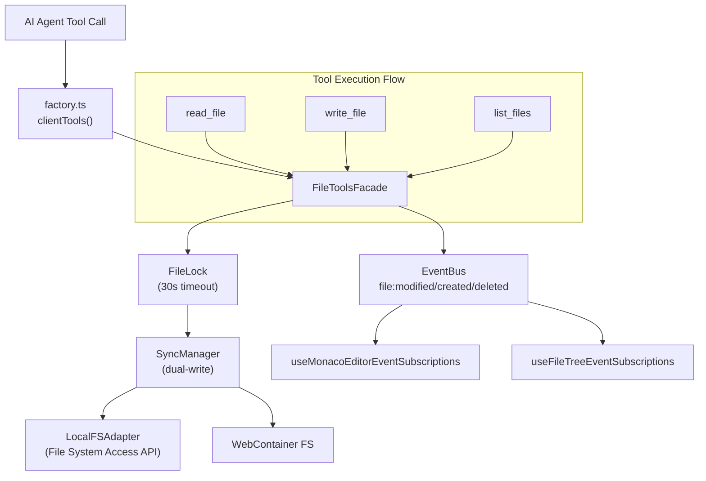

# Comprehensive File Tools Edge Case Analysis

**Document ID:** TECH-2025-12-25-FileTools-EdgeCaseAnalysis  
**Created:** 2025-12-25T19:00:00+07:00  
**Epic Traceability:** MVP-3, MVP-4, Epic 12, Epic 25, Epic 29  
**Status:** Living Document (Update on Implementation)

---

## Architecture Overview



---

## Tool: `read_file`

### Current Implementation

| Layer | File | Function |
|-------|------|----------|
| Tool Def | `read-file-tool.ts` | `createReadFileClientTool()` |
| Facade | `file-tools-impl.ts` | `readFile(path)` |
| Adapter | `local-fs-adapter.ts` | `readFile(path, options)` |
| FS Ops | `file-ops.ts` | `readFile(root, path, options)` |

### Current Behavior
- ✅ Path normalization (strips leading `/`, `./`, Windows `\`)
- ✅ Returns `null` if file not found
- ✅ No lock required (reads are non-blocking)
- ❌ No binary file detection
- ❌ No symlink handling

### Edge Cases & Gaps

| Edge Case | Current Status | Fix Required | Epic |
|-----------|----------------|--------------|------|
| Binary files (images, PDFs) | ❌ Returns garbled text | Detect MIME, return base64 | 29 |
| Symlinks | ❌ Will fail silently | Error with clear message | 29 |
| File locked by write | ⚠️ Reads stale content | Wait for lock or flag | 29 |
| Permission denied (FSA) | ✅ Throws FileSystemError | - | - |
| Path traversal (`../`) | ✅ Blocked by validatePath | - | - |
| Empty path | ⚠️ Reads root directory | Should error | MVP-3 |
| Unicode filenames | ✅ Supported | - | - |
| Very large files (>10MB) | ⚠️ No streaming | Add chunked read | 29 |

### Implementation Notes for Epic 29

```typescript
// binary-detection.ts (new file)
export async function detectFileType(content: ArrayBuffer): Promise<'text' | 'binary'> {
    const bytes = new Uint8Array(content.slice(0, 8192));
    const nullCount = bytes.filter(b => b === 0).length;
    return nullCount > 0 ? 'binary' : 'text';
}

// read-file-tool.ts enhancement
if (isAwaitingLock) {
    return { 
        success: false, 
        error: 'File is being modified by another operation. Please wait.',
        retryable: true
    };
}
```

---

## Tool: `write_file`

### Current Implementation

| Layer | File | Function |
|-------|------|----------|
| Tool Def | `write-file-tool.ts` | `createWriteFileClientTool()` |
| Facade | `file-tools-impl.ts` | `writeFile(path, content)` |
| Lock | `file-lock.ts` | `FileLock.acquire(path)` |
| Sync | `sync-manager.ts` | `writeFile(path, content)` |
| Adapter | `local-fs-adapter.ts` | `writeFile(path, content)` |
| WC | WebContainer | `fs.writeFile(path, content)` |

### Current Behavior
- ✅ Path normalization
- ✅ File-level locking (30s timeout)
- ✅ Dual-write to LocalFS + WebContainer
- ✅ Emits `file:modified` event with `source: 'agent'`
- ✅ Monaco subscribes and updates content
- ✅ Clears dirty flag on agent modification

### Concurrency Scenarios

#### Scenario 1: User Editing While Agent Writes (RACE CONDITION)

```
T0: User opens file, starts typing
T1: Agent receives write_file command
T2: Agent acquires FileLock
T3: User saves (blocked? or writes?)
T4: Agent writes, emits file:modified
T5: Monaco updates, user loses edits?
```

**Current Behavior:**
- FileLock is agent-only, user saves bypass it
- Monaco `file:modified` handler clears dirty flag
- **USER EDITS ARE LOST** ❌

**Required Fix (Epic 29):**
- Check Monaco dirty state before writing
- Show approval dialog: "AI wants to modify file with unsaved changes"
- Options: Allow, Cancel, Merge (3-way merge)

```typescript
// file-tools-impl.ts enhancement
async writeFile(path: string, content: string): Promise<void> {
    // Query Monaco dirty state via eventBus
    const isDirty = await this.eventBus.query('editor:isDirty', { path });
    if (isDirty) {
        throw new ConflictError(
            `File ${path} has unsaved changes. Approval required.`,
            'EDIT_CONFLICT'
        );
    }
    // ... proceed with write
}
```

#### Scenario 2: Agent Writes Nested Path That Doesn't Exist

```
write_file('src/new-feature/components/Button.tsx', content)
```

**Current Behavior:**
- SyncManager calls `fs.mkdir(parentPath, { recursive: true })`
- ✅ Parent directories created automatically

#### Scenario 3: WebContainer Not Booted

**Current Behavior:**
- SyncManager checks `isBooted()` before WebContainer write
- ✅ Gracefully skips WC write if not booted

---

## Tool: `list_files`

### Current Implementation

| Layer | File | Function |
|-------|------|----------|
| Tool Def | `list-files-tool.ts` | `createListFilesClientTool()` |
| Facade | `file-tools-impl.ts` | `listDirectory(path, recursive)` |
| Adapter | `local-fs-adapter.ts` | `listDirectory(path)` |
| FS Ops | `dir-ops.ts` | `listDirectory(root, path)` |

### Current Behavior
- ✅ Path normalization (fixed CC-2025-12-25-001)
- ✅ Recursive listing supported
- ❌ No pagination for large directories

### Edge Cases

| Edge Case | Current Status | Fix Required |
|-----------|----------------|--------------|
| Empty path ("") | ✅ Lists root | - |
| 1000+ files | ⚠️ Returns all | Add pagination |
| Hidden files (.gitignore) | ✅ Included | Consider filter option |
| Excluded patterns (node_modules) | ❌ Not filtered | Use excludePatterns |

---

## Cross-Slice Integration Points

### 1. Monaco Editor ↔ Agent Write

**Event Flow:**
```
write_file() 
  → file:modified { path, content, source: 'agent' }
  → useMonacoEditorEventSubscriptions.handleFileModified()
  → setOpenFiles(prev => prev.map(...))
  → Monaco model updated
```

**Cursor Preservation:**
- Currently NOT preserving cursor position
- `useMonacoEditorEventSubscriptions.ts` line 107: just updates content state
- Monaco re-renders, cursor resets to (0,0)

**Fix Required (Epic 29 Story 29-2):**
```typescript
// Save cursor before update
const position = editorRef.current?.getPosition();
const selection = editorRef.current?.getSelection();

setOpenFiles(prevFiles => prevFiles.map(...));

// Restore after React re-render
useEffect(() => {
    if (position) editorRef.current?.setPosition(position);
    if (selection) editorRef.current?.setSelection(selection);
}, [openFiles]);
```

### 2. FileTree ↔ Agent Create/Delete

**Event Flow:**
```
createFile() 
  → file:created { path, source: 'agent' }
  → useFileTreeEventSubscriptions.handleFileEvent()
  → refreshTree() (debounced 100ms)
```

**Current Issues:**
- Debounce may miss rapid file creates
- No expand-to-new-file behavior

### 3. SyncManager Error Handling

**Current Gap:**
- Errors thrown but not surfaced to agent/user
- Agent gets { success: false, error: message } but no retry hint

**Fix (Epic 29 Story 29-4):**
```typescript
return {
    success: false,
    error: message,
    errorCode: 'SYNC_FAILED',
    retryable: true,
    suggestedAction: 'Wait 5 seconds and retry'
};
```

---

## Epic 29 Agentic Loop Integration

### Iteration Visibility (Story 29-2)

When agent is in agentic loop doing multiple file operations:
- Show "Step X/10" in chat UI
- Collapsible sections for each tool result
- Progress bar in approval overlay

### Error Recovery (Story 29-4)

```typescript
// Automatic retry for transient errors
const RETRYABLE_ERRORS = [
    'SYNC_FAILED',
    'LOCK_TIMEOUT',
    'NETWORK_ERROR'
];

if (RETRYABLE_ERRORS.includes(error.code) && retryCount < 3) {
    await delay(1000 * retryCount);
    return executeToolWithRetry(tool, args, retryCount + 1);
}
```

### Tool Result Streaming

For long-running tools (read large file, list 1000+ files):
- Emit progress events
- Stream partial results
- Allow abort mid-operation

---

## Recommendations Summary

| Priority | Issue | File(s) | Effort |
|----------|-------|---------|--------|
| P0 | User edit conflict handling | file-tools-impl.ts | M |
| P0 | Cursor preservation on agent write | useMonacoEditorEventSubscriptions | M |
| P1 | Binary file detection | read-file-tool.ts, file-ops.ts | S |
| P1 | Large directory pagination | list-files-tool.ts | M |
| P2 | Tool result streaming | All tools | L |
| P2 | Symlink error messages | handle-utils.ts | S |

---

## Test Scenarios for E2E Validation

### Scenario 1: Basic Read-Write Cycle
1. Open project in IDE
2. Ask agent: "Read package.json and update version"
3. Verify: File read, content displayed, write with approval, Monaco updates

### Scenario 2: Concurrent Edit Detection
1. Open file in Monaco, type changes (dirty)
2. Ask agent: "Add a comment to the file"
3. Expect: Conflict dialog appears

### Scenario 3: Nested File Creation
1. Ask agent: "Create src/new/deep/file.ts with hello world"
2. Verify: All parent dirs created, FileTree expands

### Scenario 4: Large Directory Listing
1. Open project with 500+ files
2. Ask agent: "List all TypeScript files"
3. Verify: Results returned without timeout

---

## Cross-Document References

| Document | Purpose |
|----------|---------|
| `mvp-3-path-handling-bugs-2025-12-25.md` | CC for path fixes |
| `mvp-3-agentic-execution-loop-2025-12-25.md` | CC for execution issues |
| `epic-29-agentic-execution-loop.md` | Epic planning |
| `agent-architecture-guidelines-2025-12-24.md` | Architecture patterns |
| `AGENTS.md` | Dev guidelines |
