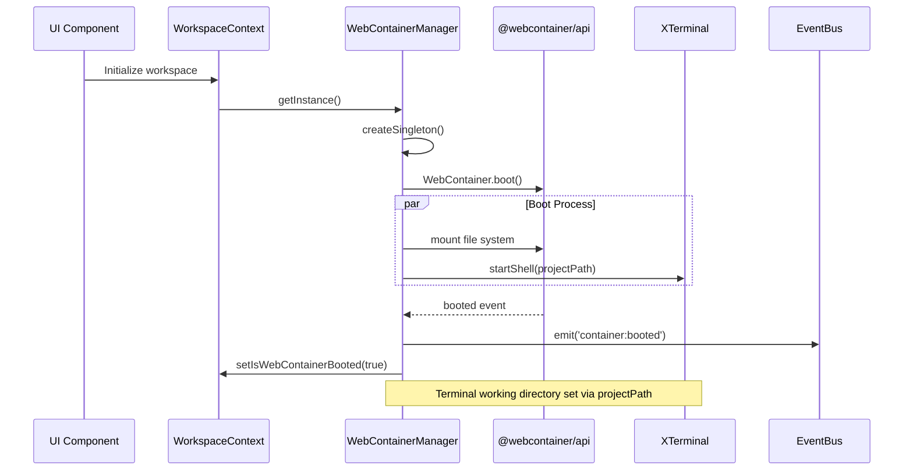

# Via-gent Control & Workflow Analysis

**Date:** 2025-12-22  
**Author:** @bmad-bmm-architect  
**Status:** Analysis Complete  
**Related Documents:** [architecture.md](./architecture.md), [data-and-contracts-2025-12-22-1105.md](./data-and-contracts-2025-12-22-1105.md)

## Overview

This document analyzes the control flows, state machines, orchestrators, and multi-step processes within the Via-gent IDE. The system employs several key workflow patterns for file synchronization, permission management, WebContainer lifecycle, and AI agent orchestration.

## Key Workflow Categories

### 1. File System Sync Workflow
**Orchestrator:** `SyncManager` (`src/lib/filesystem/sync-manager.ts`)  
**State Machine:** `idle` → `syncing` → `idle` | `error` → `paused` → `resumed`

**Sequence Diagram:**


**State Transitions:**
```
┌─────────┐     ┌──────────┐     ┌─────────┐
│  idle   │────▶│ syncing  │────▶│  idle   │
└─────────┘     └──────────┘     └─────────┘
     │               │                │
     │               ▼                │
     │         ┌──────────┐          │
     └────────▶│  error   │◀─────────┘
               └──────────┘
                     │
               ┌─────┴─────┐
               ▼           ▼
         ┌──────────┐ ┌──────────┐
         │  paused  │ │ resumed  │
         └──────────┘ └──────────┘
```

### 2. Permission Lifecycle Workflow
**Orchestrator:** `useWorkspaceActions` (`src/lib/workspace/hooks/useWorkspaceActions.ts`)  
**State Machine:** `unknown` → `prompt` → `granted` | `denied` → `expired` → `restored`

**Sequence Diagram:**


### 3. WebContainer Boot Workflow
**Orchestrator:** `WebContainerManager` (`src/lib/webcontainer/manager.ts`)  
**Singleton Pattern:** Ensures single instance per page  
**Lifecycle:** `uninitialized` → `booting` → `ready` | `error` → `disposed`

**Sequence Diagram:**


### 4. Project Management Workflow
**Multi-step Process:** Open → Sync → Persist → Restore  
**Orchestrator:** `useWorkspaceActions.openFolder()`

**Detailed Steps:**
1. **Permission Request:** `window.showDirectoryPicker()`
2. **Project Creation:** Generate UUID, metadata
3. **IndexedDB Persistence:** Save to `ProjectStore`
4. **File System Tree Building:** Recursive directory scan
5. **WebContainer Mount:** Mount files to sandbox
6. **Terminal Initialization:** Start shell with project path
7. **Event Emission:** `project:opened`, `container:mounted`
8. **State Update:** Update React context

### 5. Event-Driven Communication
**Event Bus:** `eventemitter3` (`src/lib/events/workspace-events.ts`)  
**Event Categories:**
- **File System:** `file:created`, `file:modified`, `file:deleted`
- **Sync:** `sync:started`, `sync:progress`, `sync:completed`, `sync:error`
- **WebContainer:** `container:booted`, `container:mounted`, `container:error`
- **Permission:** `permission:granted`, `permission:denied`, `permission:expired`
- **Project:** `project:opened`, `project:closed`, `project:switched`
- **Process/Terminal:** `process:started`, `process:output`, `terminal:input`

**Event Flow Pattern:**
```
Component A ──emit()──▶ EventBus ──on()──▶ Component B
      │                                      │
      └─────────────state update─────────────┘
```

### 6. AI Agent Orchestration Workflow
**Data Model:** `TaskContextRecord` in Dexie DB (`src/lib/state/dexie-db.ts`)  
**State Machine:** `pending` → `running` → `completed` | `failed` | `cancelled`

**Agent Loop Pattern:**
```typescript
interface TaskContextRecord {
    id: string;
    projectId: string;
    agentId: string;           // Which agent is executing
    status: TaskStatus;        // 'pending' | 'running' | 'completed' | 'failed' | 'cancelled'
    description: string;       // Human-readable task description
    targetFiles: string[];     // Files the agent is working on
    checkpoint?: unknown;      // LangGraph checkpoint data
    createdAt: Date;
    updatedAt: Date;
}

interface ToolExecutionRecord {
    id: string;
    taskId: string;            // Reference to TaskContext
    toolName: string;          // e.g., 'file_read', 'execute_command'
    input: unknown;            // Tool input parameters
    output?: unknown;          // Tool output (null if pending)
    status: 'pending' | 'success' | 'error';
    duration?: number;         // Execution time in ms
    createdAt: Date;
}
```

**Agent Execution Flow:**
```
┌─────────────┐     ┌──────────────┐     ┌─────────────┐
│   Task      │────▶│   Agent      │────▶│   Tool      │
│  Context    │     │  Execution   │     │ Execution   │
│ (Dexie DB)  │     │   Loop       │     │  Audit      │
└─────────────┘     └──────────────┘     └─────────────┘
       │                    │                    │
       ▼                    ▼                    ▼
┌─────────────┐     ┌──────────────┐     ┌─────────────┐
│  Status     │     │  Checkpoint  │     │  Results    │
│  Updates    │     │  Persistence │     │  Storage    │
└─────────────┘     └──────────────┘     └─────────────┘
```

### 7. Error Recovery Workflows

#### 7.1 Sync Error Recovery


#### 7.2 Permission Restoration (Story 13-5)
```typescript
// Permission restoration workflow
async function restoreAccess(projectId: string): Promise<boolean> {
    // 1. Query IndexedDB for project metadata
    const project = await ProjectStore.get(projectId);
    if (!project?.fsaHandle) return false;
    
    // 2. Check permission state
    const permission = await project.fsaHandle.queryPermission({ mode: 'readwrite' });
    
    // 3. Request permission if needed
    if (permission === 'prompt') {
        const granted = await project.fsaHandle.requestPermission({ mode: 'readwrite' });
        if (granted === 'granted') {
            emit('permission:restored', { projectId });
            return true;
        }
    }
    
    // 4. Update workspace state
    setPermissionState(permission);
    return permission === 'granted';
}
```

### 8. Background Jobs & Schedulers

**Current Implementation:** No traditional background job schedulers (cron, setInterval).  
**Alternative Patterns:**
- **Event-Driven Polling:** React effects watch for changes
- **Debounced Operations:** File sync uses debounced watchers
- **RequestIdleCallback:** Potential for low-priority background tasks
- **Web Workers:** Not currently implemented but planned for heavy processing

**Planned Scheduler Patterns (from Epic 25 - AI Foundation):**
```typescript
// Future AI agent scheduler concept
interface AgentScheduler {
    queueTask(task: AgentTask): Promise<TaskContextRecord>;
    cancelTask(taskId: string): Promise<void>;
    getTaskStatus(taskId: string): Promise<TaskStatus>;
    listPendingTasks(): Promise<TaskContextRecord[]>;
}
```

### 9. Multi-Step Process: File Save with Sync

**Process:** Editor Save → Local Write → Sync to WebContainer → Terminal Notification


## Key Orchestrators Identified

### 1. SyncManager (`src/lib/filesystem/sync-manager.ts`)
- **Primary Role:** File synchronization orchestration
- **State Management:** `idle`, `syncing`, `error`, `paused`
- **Error Handling:** Custom `SyncError` with recovery strategies
- **Progress Tracking:** Real-time progress events with file counts

### 2. WorkspaceContext (`src/lib/workspace/WorkspaceContext.tsx`)
- **Primary Role:** Application state orchestration
- **Composition:** Combines `useWorkspaceState`, `useSyncOperations`, `useWorkspaceActions`, `useEventBusEffects`
- **Lifecycle Management:** Project open/close, permission restoration, auto-sync

### 3. WebContainerManager (`src/lib/webcontainer/manager.ts`)
- **Primary Role:** Singleton WebContainer lifecycle
- **Boot Sequence:** Initialize → mount files → start shell → emit events
- **Error Recovery:** Automatic retry with exponential backoff

### 4. useWorkspaceActions (`src/lib/workspace/hooks/useWorkspaceActions.ts`)
- **Primary Role:** User action orchestration
- **Multi-step Flows:** `openFolder()`, `switchFolder()`, `restoreAccess()`
- **Permission Management:** FSA API interaction with state persistence

## State Machines

### Sync State Machine
```typescript
type SyncStatus = 'idle' | 'syncing' | 'error' | 'paused';

// Transitions:
// idle -> syncing (on sync request)
// syncing -> idle (on completion)
// syncing -> error (on failure)
// error -> idle (after recovery)
// syncing -> paused (user action)
// paused -> syncing (resume)
```

### Permission State Machine
```typescript
type FsaPermissionState = 'unknown' | 'prompt' | 'granted' | 'denied' | 'expired';

// Transitions:
// unknown -> prompt (initial request)
// prompt -> granted (user allows)
// prompt -> denied (user denies)
// granted -> expired (session timeout)
// expired -> prompt (re-request)
```

### WebContainer State Machine
```typescript
type WebContainerState = 'uninitialized' | 'booting' | 'ready' | 'error' | 'disposed';

// Transitions:
// uninitialized -> booting (on first use)
// booting -> ready (successful boot)
// booting -> error (boot failure)
// ready -> disposed (cleanup)
// error -> booting (retry)
```

## Workflow Integration Points

### Cross-Workflow Dependencies
1. **File Sync depends on:** Permission state + WebContainer ready state
2. **WebContainer boot depends on:** Cross-origin isolation headers (Vite plugin)
3. **Permission restoration depends on:** IndexedDB project metadata
4. **Auto-sync depends on:** File watchers + debounced triggers

### Event-Driven Coordination
```typescript
// Example: Coordinated startup sequence
eventBus.on('container:booted', () => {
    if (permissionState === 'granted') {
        syncManager.syncToWebContainer();
    }
});

eventBus.on('sync:completed', () => {
    workspace.setLastSyncTime(new Date());
    if (autoSync) {
        // Schedule next sync
    }
});
```

## Recommendations & Observations

### Strengths
1. **Clear Separation:** Each orchestrator has well-defined responsibilities
2. **Event-Driven Architecture:** Loose coupling between components
3. **Error Recovery:** Comprehensive error handling with state machines
4. **Progress Tracking:** Real-time sync progress with events

### Gaps & Opportunities
1. **Missing Background Scheduler:** No cron-like scheduler for periodic tasks
2. **Limited Retry Logic:** Basic retry but no exponential backoff for WebContainer
3. **No Circuit Breaker:** Sync failures could benefit from circuit breaker pattern
4. **Agent Orchestration:** AI agent workflows defined in schema but not fully implemented

### Future Workflow Enhancements
1. **Epic 25 (AI Foundation):** Implement `AgentScheduler` with LangGraph checkpoints
2. **Batch Operations:** Add workflow for bulk file operations
3. **Conflict Resolution:** Implement merge strategies for concurrent edits
4. **Offline Queue:** Background sync queue for offline operation

## Conclusion

The Via-gent system employs a sophisticated but clean workflow architecture centered around:
- **Event-driven communication** via `eventemitter3`
- **State machines** for sync, permission, and container lifecycle
- **Singleton orchestrators** for critical resources (WebContainer)
- **Multi-step user workflows** with comprehensive error handling
- **Future-ready** AI agent orchestration patterns

The control flows are well-structured with clear separation of concerns, making the system maintainable and extensible for future enhancements like AI agent integration and advanced scheduling.

---
**Next Steps:** 
- Implement `AgentScheduler` for Epic 25 AI workflows
- Add circuit breaker pattern for sync operations  
- Enhance retry logic with exponential backoff
- Develop conflict resolution workflow for concurrent edits