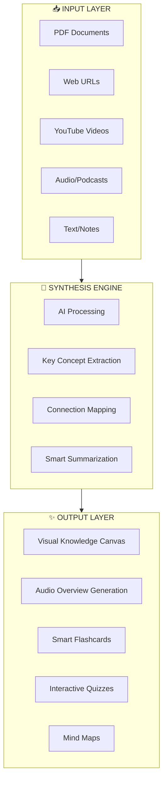

# 🧠 Knowledge Synthesis Station
## Concept Document - Via-gent Extension

**Date:** 2025-12-26  
**Facilitated by:** Carson (Brainstorming Coach) 🧠 + Maya (Design Thinking Coach) 🎨  
**Orchestrated by:** BMAD Master  

---

## 🎯 Executive Vision

> **"Transform scattered knowledge into living, interactive wisdom that Vietnamese students can SEE, FEEL, and EXPERIENCE"**

A new tab interface within Via-gent that hybridizes:
- **Google NotebookLM** → AI-powered research synthesis, audio overviews, source grounding
- **Notion** → Flexible knowledge blocks, collaborative workspace, beautiful design

**Target:** Vietnamese educational sector (students, teachers, schools)

---

## 🔥 The "WOW" Factor Analysis

### What Vietnamese Users Want (Market Research Insights)

| Insight | Implication |
|---------|-------------|
| 25% CAGR EdTech growth in Vietnam | Massive hungry market |
| 79% internet penetration, 170% mobile connections | Browser-first is perfect |
| AI-integrated products leading (Testglider, IELTS Science) | AI is expected, not optional |
| Visual learners dominate | **SEEING is BELIEVING** |
| Generative AI fatigue ("surplus") | Need differentiation beyond chat |

### The Differentiation Play

```
Current AI Tools (ChatGPT, etc.)     →  Text-heavy, ephemeral, no persistence
Google NotebookLM                     →  Powerful but English-centric, no coding
Notion                                →  Beautiful but manual, passive knowledge
───────────────────────────────────────────────────────────────────────────────
Knowledge Synthesis Station           →  VISUAL + INTERACTIVE + PERSISTENT + LOCAL
```

---

## 💡 Core Concept: "Knowledge Canvas"

### The Metaphor
Instead of "notes" or "documents", users work on a **living canvas** where:
1. **Sources** become **visual nodes**
2. **AI synthesis** creates **connection lines**
3. **Insights** emerge as **interactive cards**
4. **Everything persists** locally (browser IndexedDB + File System Access)

### The Three Pillars



---

## 🎨 Design Thinking: User Personas (Vietnam Focus)

### Persona 1: Minh - Grade 11 Student
- **Context:** Studying for university entrance exams
- **Pain:** Too many textbooks, no way to connect concepts
- **Dream:** "I wish my notes could talk to me and show me how Physics connects to Math"
- **WOW Moment:** Upload 5 PDFs → See interactive concept map → Generate audio review in Vietnamese

### Persona 2: Thảo - University Student
- **Context:** Writing thesis, researching multiple papers
- **Pain:** Drowning in PDFs, can't synthesize findings
- **Dream:** "I want to ask questions TO my research papers"
- **WOW Moment:** Upload research papers → AI creates synthesis table → Export as formatted citation

### Persona 3: Cô Lan - High School Teacher
- **Context:** Creating lesson materials for 5 classes
- **Pain:** Manual work to create engaging content
- **Dream:** "Turn my lesson notes into interactive student materials"
- **WOW Moment:** Upload curriculum → Generate student-ready flashcards + quizzes

---

## 🚀 Feature Brainstorm (Prioritized)

### 🟢 Phase 1: MVP "WOW" Features (Fast Execution - 2-3 weeks)

| Feature | WOW Factor | Technical Feasibility | Priority |
|---------|------------|----------------------|----------|
| **Visual Source Cards** | See all your sources as beautiful cards | Easy (UI) | P0 |
| **AI Chat with Sources** | Ask questions, get answers WITH citations | Medium (existing infra) | P0 |
| **Auto-Summary** | 1-click summary of any source | Easy (AI call) | P0 |
| **Concept Mind Map** | Visual connections between ideas | Medium (visualization) | P0 |
| **Vietnamese Language** | Full i18n support | Easy (existing) | P0 |

### 🟡 Phase 2: Engagement Features (4-6 weeks)

| Feature | WOW Factor | Technical Feasibility | Priority |
|---------|------------|----------------------|----------|
| **Audio Overview** (NotebookLM-style) | Listen to your notes as podcasts | Medium (TTS API) | P1 |
| **Smart Flashcards** | Auto-generate flashcards from content | Medium | P1 |
| **Quiz Generator** | Create quizzes from study materials | Medium | P1 |
| **Study Timer + Analytics** | Pomodoro + progress tracking | Easy | P1 |
| **Export to PDF/Notion** | Share your synthesis | Easy | P1 |

### 🔴 Phase 3: Delight Features (Future)

| Feature | WOW Factor | Technical Feasibility | Priority |
|---------|------------|----------------------|----------|
| **Collaborative Canvases** | Study groups share knowledge | Complex (P2P) | P2 |
| **Spaced Repetition** | AI-optimized review schedule | Medium | P2 |
| **Video Summaries** | YouTube → Key points | Medium (API) | P2 |
| **AR/3D Concept Maps** | Immersive visualization | Complex | P3 |

---

## 🏗️ Technical Architecture (Leveraging Existing Via-gent)

### What We Already Have ✅

```typescript
// Via-gent existing infrastructure we can reuse:

✅ TanStack Start/Router     → Routing, SSR/CSR
✅ IndexedDB (idb)           → Local persistence for sources
✅ File System Access API    → Local file storage
✅ Monaco Editor             → Rich text/markdown editing
✅ TanStack AI + Gemini      → AI chat infrastructure
✅ i18next                   → Internationalization (Vietnamese ready)
✅ Zustand stores            → State management
✅ Event bus system          → Component communication
✅ Lucide icons              → Beautiful iconography
✅ Tailwind CSS              → Styling system
```

### What We Need to Build 🔨

```typescript
// New components for Knowledge Synthesis Station:

📦 SourceManager           → Handle PDF, URL, audio sources
📦 SynthesisEngine         → AI-powered content extraction
📦 KnowledgeCanvas         → Visual node-based canvas (react-flow?)
📦 FlashcardSystem         → Spaced repetition logic
📦 QuizGenerator           → Quiz creation from content
📦 AudioOverviewGenerator  → TTS integration
📦 ExportManager           → PDF, Notion, Markdown export
```

### Proposed File Structure

```
src/
├── routes/
│   └── knowledge/           # New route: /knowledge
│       ├── index.tsx        # Knowledge Station dashboard
│       ├── $notebookId.tsx  # Individual notebook view
│       └── canvas.tsx       # Visual canvas view
├── components/
│   └── knowledge/
│       ├── SourceCard.tsx
│       ├── KnowledgeCanvas.tsx
│       ├── SynthesisPanel.tsx
│       ├── FlashcardDeck.tsx
│       ├── QuizView.tsx
│       └── AudioPlayer.tsx
├── lib/
│   └── knowledge/
│       ├── source-manager.ts
│       ├── synthesis-engine.ts
│       ├── flashcard-generator.ts
│       └── quiz-generator.ts
└── stores/
    └── knowledge-store.ts
```

---

## 🎭 The "First 5 Minutes" Experience (Design Thinking)

### Onboarding Flow

```
1. User lands on Knowledge tab
   ↓
2. Beautiful empty state: "Drop your first source here" 
   (Drag & drop zone - PDF, URL, or paste text)
   ↓
3. Source card appears with loading animation
   ↓
4. AI auto-generates:
   - 3-sentence summary
   - 5 key concepts (as tags)
   - Suggested questions
   ↓
5. User clicks "Ask a question" → Instant AI response with citations
   ↓
6. WOW: "Add more sources and watch connections emerge" 
   → Second source creates automatic connection visualization
```

### Visual Language (Vietnamese-Friendly)

| Element | Style | Rationale |
|---------|-------|-----------|
| Colors | Warm gradients (orange, coral, teal) | Energetic, approachable |
| Typography | Modern sans-serif, larger sizes | Easy reading |
| Icons | Filled, colorful | Higher visibility |
| Animations | Smooth, purposeful | Feels premium |
| Empty states | Illustrated, encouraging | Not intimidating |

---

## 📊 Success Metrics

### "WOW" Metrics

| Metric | Target | Measurement |
|--------|--------|-------------|
| Time to first insight | <60 seconds | From source upload to AI summary |
| Sources per notebook | >3 average | Users adding multiple sources |
| Return rate | >40% D7 | Students coming back |
| Share rate | >10% | Users sharing notebooks |

### Educational Metrics

| Metric | Target | Measurement |
|--------|--------|-------------|
| Flashcards created | >10/user/week | Active learning engagement |
| Quiz completion | >70% | Knowledge retention |
| Study time | >2 hours/week | Platform stickiness |

---

## 🏃 Fast Execution Plan

### Week 1: Foundation
- [ ] Create `/knowledge` route
- [ ] Build SourceCard component
- [ ] Implement source upload (PDF, URL, text)
- [ ] Connect to existing AI infrastructure
- [ ] Basic Vietnamese i18n

### Week 2: Core Experience
- [ ] AI summary generation
- [ ] Chat with sources
- [ ] Visual canvas (basic version)
- [ ] Source persistence (IndexedDB)

### Week 3: Polish & WOW
- [ ] Beautiful animations
- [ ] Flashcard generator
- [ ] Export functionality
- [ ] Onboarding flow
- [ ] Mobile responsive

---

## 🎯 Competitive Positioning

```
┌─────────────────────────────────────────────────────────────────┐
│                    KNOWLEDGE SYNTHESIS STATION                  │
│                                                                 │
│   "The first browser-based, offline-capable, Vietnamese-ready  │
│    knowledge synthesis tool for students"                       │
│                                                                 │
│   ✅ Works offline (IndexedDB + FSA)                           │
│   ✅ No account required (local-first)                         │
│   ✅ Vietnamese language native                                │
│   ✅ Visual + Interactive (not just text)                      │
│   ✅ AI-powered but SOURCE-GROUNDED                            │
│   ✅ Integrated with coding IDE (unique positioning)           │
└─────────────────────────────────────────────────────────────────┘
```

---

## 💬 Brainstorming Wild Ideas (Carson's Picks 🧠)

> *"YES AND... what if we went WILDER?"*

1. **"Knowledge DJ"** - Mix concepts from different sources like a DJ mixes tracks
2. **"Study Buddy AI"** - An AI character that studies WITH you, not just FOR you
3. **"Concept Battles"** - Gamified quizzes where concepts "fight" each other
4. **"Time Capsule Notes"** - Record audio notes your future self will hear
5. **"Learning Streaks"** - Duolingo-style streaks for consistent studying
6. **"Source Party"** - Visualize sources as characters at a party, introducing each other

---

## 🎨 Design Thinking Insights (Maya's Perspective 🎨)

> *"Design is about THEM not us..."*

### Key Empathy Insights

1. **Vietnamese students feel overwhelmed** → Solution: Clean, minimal UI that breathes
2. **Parents value visible progress** → Solution: Exportable progress reports
3. **Teachers need reusable materials** → Solution: Template library
4. **Mobile is primary device** → Solution: Mobile-first design
5. **Social validation matters** → Solution: Shareable achievements

### Prototype First, Perfect Later

> "Don't wait for perfect. Ship something VISUAL in week 1 that students can FEEL."

---

## ✅ Recommendation: Go / No-Go

### 🟢 GO - Here's Why:

| Factor | Assessment |
|--------|------------|
| Market fit | Strong - Vietnam EdTech 25% CAGR |
| Technical feasibility | High - Reuses 80% existing infra |
| Differentiation | Clear - Local-first + Visual + Vietnamese |
| Execution speed | Fast - 3 weeks to MVP |
| WOW factor | High - Visual canvas + AI synthesis |

### Suggested Next Steps

1. ✅ **Approve this concept** → Proceed to implementation planning
2. 📝 **Create Epic** → "Epic 24: Knowledge Synthesis Station"
3. 🎨 **Design wireframes** → Low-fidelity canvas mockups
4. 🏗️ **Build MVP** → Week 1-3 sprint

---

*Synthesized by BMAD Creative Intelligence System*  
*Brainstorming Coach (Carson) 🧠 + Design Thinking Coach (Maya) 🎨*
