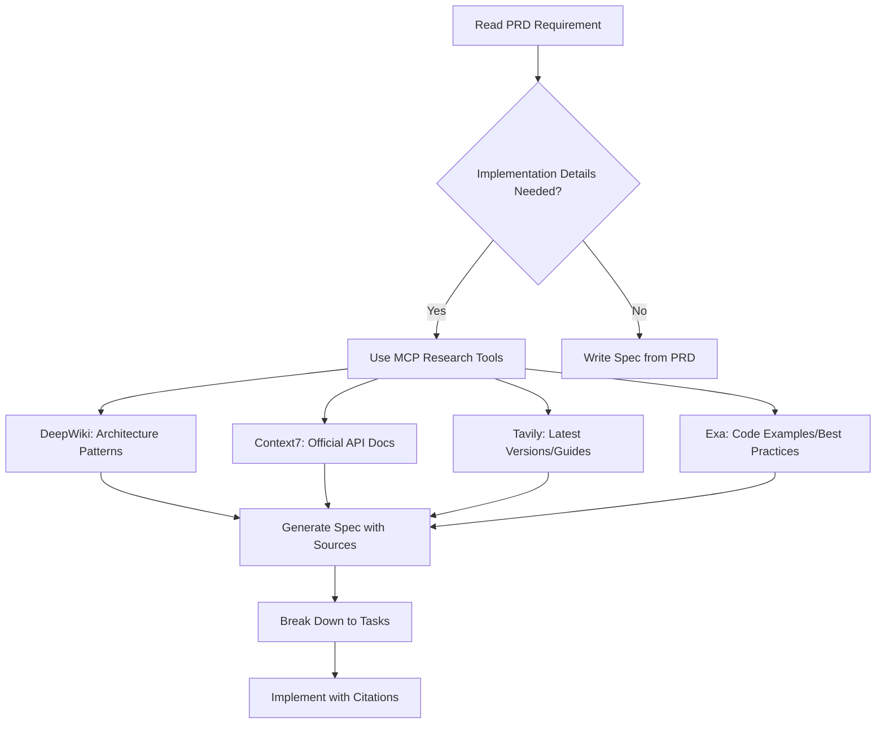

# **Product Requirements Document (PRD)**

## **via-gent: Client-Side Multi-Agent Agentic IDE Platform**

**Version:** 1.0.0  
**Status:** CANONICAL GOVERNANCE DOCUMENT  
**Date:** December 6, 2025  
**Classification:** Spec-Driven Development Framework  
**Methodology:** Agent-OS with Just-In-Time Research  
**Repository:** [github.com/shynlee04/via-gent](https://github.com/shynlee04/via-gent)

---

## **DOCUMENT CLASSIFICATION & USAGE**

### **Document Type: Governance & Guidance**

This PRD is **NOT** a prescriptive implementation guide. Instead, it serves as:

1. **Strategic Direction Document** - Defines WHAT we build and WHY
2. **Research Framework** - Establishes WHEN and HOW to research implementations
3. **Architectural Boundaries** - Sets constraints that must not be violated
4. **Agent-OS Integration Blueprint** - Maps phases to spec-driven workflows

### **How AI Agents Must Use This Document**



**CRITICAL RULES FOR AI AGENTS:**

1. ❌ **DO NOT** hallucinate implementation patterns from memory
2. ✅ **DO** query MCP tools for every technical decision
3. ✅ **DO** cite sources in every spec and task
4. ✅ **DO** validate cross-dependencies through research
5. ✅ **DO** document research queries in spec metadata

---

## **I. EXECUTIVE SUMMARY**

### **1.1 Product Vision**

**via-gent** is a 100% client-side, browser-based multi-agent IDE that enables developers to build, manage, and deploy full-stack applications through conversational AI workflows, powered by **Google Gemini** models and **TanStack ecosystem**.

### **1.2 Core Value Propositions**

| Stakeholder                 | Value Delivered                                                |
| --------------------------- | -------------------------------------------------------------- |
| **Solo Developers**         | AI-assisted coding without subscription fees (BYOK model)      |
| **Indie Teams**             | Collaborative coding with Git integration, zero infrastructure |
| **Learners**                | Transparent AI workflows with explainable tool calls           |
| **Privacy-Conscious Users** | Zero-knowledge architecture - all data stays in browser        |

### **1.3 Strategic Differentiators**

```typescript
// Conceptual comparison (implementation via MCP research)
const DIFFERENTIATORS = {
  architecture: 'client-side-first', // Research: WebContainers vs alternatives
  ai_framework: 'tanstack-ai', // Research: vs Vercel AI SDK, LangChain
  model_provider: 'google-gemini', // Research: Gemini 2.5/3.0 capabilities
  type_safety: 'end-to-end', // Research: TanStack type patterns
  cost_model: 'byok-zero-platform', // Research: BYOK encryption standards
  privacy: 'zero-knowledge', // Research: Client-side crypto patterns
}
```

---

## **II. ARCHITECTURAL PRINCIPLES (IMMUTABLE)**

### **2.1 Client-Side First Mandate**

**PRINCIPLE**: All computation, storage, and intelligence must execute in the browser.

**Rationale**:

- Privacy: User data never touches external servers
- Cost: Zero infrastructure expenses
- Portability: Works offline after initial load
- Sovereignty: Users own their data and keys

**Research Requirements**:

```yaml
phase: 0-architecture-validation
tools:
  - DeepWiki: 'WebContainers architecture browser-based Node.js'
  - Context7: '@webcontainer/api' # Official API reference
  - Tavily: 'WebContainers vs Sandpack 2025 comparison'
validation:
  - Browser compatibility matrix (Chrome, Edge, Firefox, Safari)
  - SharedArrayBuffer requirements
  - Memory constraints (8GB RAM minimum)
```

### **2.2 TanStack Ecosystem Alignment**

**PRINCIPLE**: Leverage TanStack libraries for maximum type safety and integration.

**Core Stack** (versions to be researched):

```typescript
// Pseudo-stack (exact versions via Tavily research)
const TANSTACK_CORE = {
  framework: '@tanstack/react-start', // Research: latest stable
  routing: '@tanstack/react-router', // Research: v1.x vs v2.x
  state: '@tanstack/react-store', // Research: vs Zustand integration
  data: '@tanstack/react-query', // Research: v5.x features
  ai: '@tanstack/ai', // Research: alpha stability
  ai_adapters: [
    '@tanstack/ai-client', // Research: browser usage patterns
    '@tanstack/ai-react', // Research: useChat hooks
    '@tanstack/ai-gemini', // Research: Gemini 2.5/3.0 support
  ],
}
```

**Research Requirements**:

```yaml
phase: 1-dependency-resolution
tools:
  - Context7: '@tanstack/ai' # Full API reference
  - Tavily: 'TanStack AI vs Vercel AI SDK December 2025'
  - DeepWiki: 'TanStack Start routing patterns best practices'
  - Exa: 'TanStack AI client-side examples GitHub'
validation:
  - Peer dependency compatibility
  - Bundle size impact
  - TypeScript version requirements (>= 5.7.x)
```

### **2.3 Google Gemini Model Strategy**

**PRINCIPLE**: Use latest Gemini models with BYOK for cost efficiency.

**Model Tiers** (pricing to be researched):

```typescript
// Pseudo-configuration (research via Tavily + Context7)
const GEMINI_MODELS = {
  'gemini-2.5-flash': {
    use_case: 'Fast code generation, validation loops',
    context_window: '1M tokens', // Research: actual limit
    research_query: 'Gemini 2.5 Flash pricing December 2025',
  },
  'gemini-3.0-preview': {
    use_case: 'Complex reasoning, architecture planning',
    context_window: '2M tokens', // Research: actual limit
    research_query: 'Gemini 3.0 preview availability pricing',
  },
}
```

**Research Requirements**:

```yaml
phase: 2-gemini-integration
tools:
  - Tavily: 'Google Gemini 2.5 Flash vs 3.0 preview features'
  - Context7: '@tanstack/ai-gemini' # Official adapter docs
  - DeepWiki: 'Gemini function calling parallel execution'
validation:
  - Model availability (preview vs GA)
  - Rate limits per free/paid tier
  - Function calling capabilities
  - Multimodal support (images, video)
```

---

## **III. FEATURE DOMAINS (HIGH-LEVEL)**

### **3.1 Multi-Agent Orchestration**

**Strategic Goal**: Coordinate specialist agents through master Orchestrator.

**Agent Roles** (implementation patterns to be researched):

```typescript
// Conceptual architecture (research implementation via MCP)
type AgentRole =
  | 'orchestrator' // Research: TanStack AI handoff patterns
  | 'planner' // Research: Architecture generation best practices
  | 'coder' // Research: Code generation with validation loops
  | 'validator' // Research: TypeScript/ESLint integration patterns
  | 'asset-gen' // Research: Multimodal generation workflows

// Research queries for each agent type
const RESEARCH_MAP = {
  orchestrator: [
    'DeepWiki: TanStack AI multi-agent orchestration',
    'Exa: Agent handoff protocol implementations GitHub',
  ],
  coder: [
    'Context7: @tanstack/ai tools definition',
    'DeepWiki: Code generation validation loop patterns',
  ],
  // ... etc
}
```

**Research Requirements**:

```yaml
phase: 3-agent-architecture
specs_to_write:
  - specs/301-orchestrator-design.md
  - specs/302-handoff-protocol.md
  - specs/303-agent-tool-catalog.md
research_before_spec:
  - DeepWiki: 'TanStack AI agentic cycles stopConditions'
  - Context7: '@tanstack/ai' # Agent class, chat function
  - Tavily: 'Multi-agent orchestration patterns 2025'
  - Exa: 'TanStack AI agent examples production'
cross_dependencies:
  - How do TanStack AI agents share context?
  - What is the performance overhead of handoffs?
  - How to implement circular dependency prevention?
```

### **3.2 IDE Components**

**Strategic Goal**: VS Code-like experience in the browser.

**Core Components** (research implementation separately):

```typescript
// High-level component tree (research each via MCP)
const IDE_ARCHITECTURE = {
  editor: {
    library: 'monaco-editor', // Research: React integration
    features: ['multi-tab', 'syntax-highlight', 'intellisense'],
    research: [
      'Context7: @monaco-editor/react',
      'DeepWiki: Monaco editor TanStack Start integration',
    ],
  },
  file_tree: {
    virtualization: 'tanstack-virtual', // Research: performance at 1000+ files
    features: ['git-status', 'context-menu', 'drag-drop'],
    research: [
      'Context7: @tanstack/react-virtual',
      'Exa: File tree React implementations best practices',
    ],
  },
  terminal: {
    library: 'xterm.js', // Research: WebContainers integration
    features: ['multi-session', 'command-history', 'ansi-colors'],
    research: [
      'DeepWiki: xterm.js WebContainers binding',
      'Tavily: xterm.js React wrapper 2025',
    ],
  },
}
```

**Research Requirements**:

```yaml
phase: 4-ide-components
specs_to_write:
  - specs/401-monaco-integration.md
  - specs/402-file-tree-virtualization.md
  - specs/403-terminal-webcontainers.md
research_per_spec:
  monaco:
    - Context7: '@monaco-editor/react'
    - Tavily: 'Monaco editor multi-tab implementation'
    - Exa: 'Monaco TanStack Router examples'
  file_tree:
    - Context7: '@tanstack/react-virtual'
    - DeepWiki: 'File tree with Git status indicators'
  terminal:
    - Context7: 'xterm.js'
    - Tavily: 'xterm.js WebContainers integration 2025'
```

### **3.3 Code Intelligence**

**Strategic Goal**: Fast, accurate code navigation without embeddings.

**Indexing Strategy** (research optimal approach):

```typescript
// Conceptual design (research via MCP before implementing)
const CODE_INTELLIGENCE = {
  indexing: {
    method: 'grep-based-symbols', // Research: vs AST parsing vs embeddings
    tools: ['regex', 'typescript-compiler-api'],
    research: [
      'DeepWiki: Code indexing grep vs embeddings performance',
      'Tavily: TypeScript AST parsing browser performance',
    ],
  },
  search: {
    symbol_types: ['function', 'class', 'type', 'interface', 'import'],
    performance_target: '<50ms for 1000 files',
    research: [
      'Exa: Fast code search implementations JavaScript',
      'DeepWiki: Symbol table data structures performance',
    ],
  },
  rag: {
    scope: 'conversations-only', // NOT for code
    embeddings: 'all-MiniLM-L6-v2', // Research: browser-compatible models
    research: [
      'Context7: @xenova/transformers',
      'Tavily: Client-side embeddings WASM 2025',
    ],
  },
}
```

**Research Requirements**:

```yaml
phase: 5-code-intelligence
specs_to_write:
  - specs/501-symbol-indexer.md
  - specs/502-search-engine.md
  - specs/503-conversation-rag.md
research_priorities:
  high:
    - 'Grep-based indexing accuracy benchmarks'
    - 'TypeScript compiler API in browser'
    - 'PGlite pgvector extension browser support'
  medium:
    - 'Embeddings model size vs accuracy tradeoff'
  low:
    - 'AST-based refactoring tools'
tools:
  - DeepWiki: 'Code symbol extraction regex patterns TypeScript'
  - Context7: 'typescript/typescript' # Compiler API docs
  - Tavily: 'PGlite pgvector browser December 2025'
```

### **3.4 Git Integration**

**Strategic Goal**: Full Git workflow in browser via isomorphic-git.

**Git Operations** (research browser limitations):

```typescript
// Conceptual Git client (research via MCP)
const GIT_FEATURES = {
  library: 'isomorphic-git', // Research: vs alternatives
  storage: 'lightning-fs', // Research: IndexedDB backend
  operations: ['clone', 'commit', 'push', 'pull', 'diff', 'checkout'],
  research: [
    'Context7: isomorphic-git',
    'DeepWiki: isomorphic-git WebContainers integration',
    'Tavily: isomorphic-git performance large repos 2025',
  ],
  authentication: {
    method: 'github-oauth', // Research: token storage security
    research: [
      'DeepWiki: GitHub OAuth PKCE flow browser',
      'Tavily: Secure token storage Web Crypto API',
    ],
  },
}
```

**Research Requirements**:

```yaml
phase: 6-git-integration
specs_to_write:
  - specs/601-isomorphic-git-setup.md
  - specs/602-github-oauth.md
  - specs/603-diff-viewer.md
research_questions:
  - 'Can isomorphic-git handle repos with 10k+ commits?'
  - 'How to implement partial clone for large repos?'
  - 'GitHub token encryption best practices browser'
  - 'Diff algorithm performance for large files'
tools:
  - Context7: 'isomorphic-git'
  - DeepWiki: 'Git diff algorithms browser performance'
  - Tavily: 'GitHub OAuth token storage security 2025'
```

### **3.5 Asset Studio**

**Strategic Goal**: AI-generated images/videos integrated into projects.

**Generation Pipeline** (research provider APIs):

```typescript
// Conceptual asset generation (research providers)
const ASSET_STUDIO = {
  providers: {
    image: [
      'flux-1.1-pro', // Research: Replicate API
      'stable-diffusion-xl', // Research: Fal.ai vs Replicate
      'dalle-3', // Research: OpenAI API browser CORS
    ],
    video: [
      'runway-gen3', // Research: API availability
      'stable-video-diffusion', // Research: Browser streaming support
    ],
  },
  storage: {
    location: 'indexeddb', // Research: 25MB limit per asset
    optimization: 'client-side-compression', // Research: Sharp vs browser-image-compression
    research: [
      'DeepWiki: IndexedDB large file storage patterns',
      'Tavily: Client-side image compression libraries 2025',
    ],
  },
}
```

**Research Requirements**:

```yaml
phase: 7-asset-studio
specs_to_write:
  - specs/701-image-generation.md
  - specs/702-asset-storage.md
  - specs/703-project-integration.md
research_priorities:
  - 'Replicate API CORS browser compatibility'
  - 'Fal.ai vs Replicate pricing comparison December 2025'
  - 'IndexedDB quota management browser'
  - 'Image compression quality vs size tradeoff'
tools:
  - Tavily: 'Replicate Flux API browser JavaScript 2025'
  - Context7: 'replicate' # NPM package docs
  - DeepWiki: 'IndexedDB blob storage best practices'
```

### **3.6 Template System**

**Strategic Goal**: Pre-built project templates for instant bootstrapping.

**Template Catalog** (research framework-specific patterns):

```typescript
// Template definitions (research each framework)
const TEMPLATES = {
  'tanstack-start-blog': {
    framework: 'TanStack Start',
    research: [
      'Context7: @tanstack/react-start',
      'DeepWiki: TanStack Start blog template patterns',
      'Exa: TanStack Start example projects GitHub',
    ],
  },
  'nextjs-app-landing': {
    framework: 'Next.js 15 App Router',
    research: [
      'Context7: next',
      'Tavily: Next.js 15 App Router best practices 2025',
      'Exa: Next.js landing page templates GitHub',
    ],
  },
  'flask-api': {
    framework: 'Python Flask',
    research: [
      'DeepWiki: Flask REST API structure best practices',
      'Tavily: Flask WebContainers Python support 2025',
    ],
    question: 'Can WebContainers run Python? Research Pyodide integration.',
  },
}
```

**Research Requirements**:

```yaml
phase: 8-template-system
specs_to_write:
  - specs/801-template-architecture.md
  - specs/802-tanstack-start-template.md
  - specs/803-nextjs-template.md
  - specs/804-python-templates.md # May be deferred
critical_research:
  - 'WebContainers Python support via Pyodide'
  - 'TanStack Start file-based routing conventions'
  - 'Next.js 15 App Router project structure'
  - 'Template variable interpolation strategies'
tools:
  - Context7: '@tanstack/react-start'
  - DeepWiki: 'Next.js 15 App Router conventions'
  - Tavily: 'WebContainers Pyodide integration 2025'
```

### **3.7 Internationalization (i18n)**

**Strategic Goal**: Full Vietnamese + English support, client-side only.

**i18n Architecture** (research TanStack Start approach):

```typescript
// Conceptual i18n (research implementation)
const I18N_STRATEGY = {
  library: 'next-intl', // Research: TanStack Start compatibility
  locales: ['en', 'vi'],
  detection: ['localStorage', 'navigator.language'],
  research: [
    'DeepWiki: next-intl without Next.js App Router',
    'Tavily: Client-side i18n React 2025 best practices',
    'Exa: TanStack Start i18n implementations',
  ],
  agent_prompts: {
    translation: 'required',
    research: 'How to pass user locale to Gemini system prompts?',
  },
}
```

**Research Requirements**:

```yaml
phase: 9-internationalization
specs_to_write:
  - specs/901-i18n-setup.md
  - specs/902-locale-detection.md
  - specs/903-agent-prompt-translation.md
research_questions:
  - 'Can next-intl work outside Next.js App Router?'
  - 'Alternative: react-i18next vs next-intl for TanStack Start'
  - 'How to translate AI agent system prompts dynamically?'
  - 'Vietnamese language support in Gemini models'
tools:
  - Context7: 'next-intl'
  - Tavily: 'react-i18next vs next-intl 2025'
  - DeepWiki: 'TanStack Start internationalization patterns'
```

---

## **IV. RESEARCH-DRIVEN DEVELOPMENT WORKFLOW**

### **4.1 Phase 0: Agent-OS Setup**

**Objective**: Establish standards and research framework.

```yaml
deliverables:
  - agent-os/standards/coding-conventions.md
  - agent-os/standards/research-protocol.md
  - agent-os/standards/spec-template.md
  - agent-os/product/mission.md # From this PRD
  - agent-os/product/tech-stack.md # Research-derived

research_protocol_example: |
  # Research Protocol

  Before writing any spec, agent MUST:

  1. Identify knowledge gaps
  2. Formulate research queries
  3. Query MCP tools in order:
     a. Context7 - Official API docs
     b. DeepWiki - Architecture patterns
     c. Tavily - Latest guides/versions
     d. Exa - Real-world examples
  4. Document sources in spec metadata
  5. Validate cross-dependencies

  Example Spec Metadata:
```

spec_id: 302-handoff-protocol
research_queries: - tool: Context7
query: "@tanstack/ai"
findings: "Agent class supports prepareStep hook" - tool: DeepWiki
query: "TanStack AI multi-agent handoff"
findings: "Use context object for state sharing"
dependencies: - 301-orchestrator-design.md - ../standards/tool-architecture.md
validated: 2025-12-06

```

tasks:
- Research Agent-OS methodology via DeepWiki
- Setup agent-os/ directory structure
- Define research query templates
```

### **4.2 Phase 1: Foundation Research (Week 1-2)**

**Objective**: Resolve all foundational technical questions before coding.

```yaml
research_sprints:
  sprint_1_tanstack_ecosystem:
    duration: 3 days
    queries:
      - tool: Context7
        targets:
          - '@tanstack/react-start'
          - '@tanstack/ai'
          - '@tanstack/ai-gemini'
      - tool: Tavily
        questions:
          - 'TanStack Start vs Next.js for client-side apps 2025'
          - 'TanStack AI stability December 2025'
      - tool: DeepWiki
        topics:
          - 'TanStack Router file-based routing patterns'
          - 'TanStack AI client-side usage examples'
    outputs:
      - agent-os/research/tanstack-ecosystem.md
      - Decision: Use TanStack Start (rationale documented)

  sprint_2_webcontainers:
    duration: 2 days
    queries:
      - tool: Context7
        targets: ['@webcontainer/api']
      - tool: DeepWiki
        topics: ['WebContainers architecture browser limitations']
      - tool: Tavily
        questions:
          - 'WebContainers browser compatibility December 2025'
          - 'WebContainers vs Sandpack feature comparison'
    outputs:
      - agent-os/research/webcontainers.md
      - Decision: Browser support matrix defined

  sprint_3_gemini_models:
    duration: 2 days
    queries:
      - tool: Tavily
        questions:
          - 'Google Gemini 2.5 Flash pricing API December 2025'
          - 'Google Gemini 3.0 preview availability'
      - tool: Context7
        targets: ['@tanstack/ai-gemini']
      - tool: DeepWiki
        topics: ['Gemini function calling parallel execution']
    outputs:
      - agent-os/research/gemini-models.md
      - Decision: Model tier mapping for each agent role

specs_to_write_after_research:
  - specs/101-project-bootstrap.md
  - specs/102-dependency-installation.md
  - specs/103-webcontainers-initialization.md
  - specs/104-gemini-adapter-setup.md
```

### **4.3 Phase 2: Agent Architecture (Week 3-5)**

**Objective**: Design multi-agent system with researched patterns.

```yaml
pre_spec_research:
  orchestrator_design:
    research_questions:
      - "How does TanStack AI handle agent-to-agent handoffs?"
      - "What is the performance overhead of context switching?"
      - "How to prevent infinite loops in agent cycles?"
    tools:
      - DeepWiki: "TanStack AI stopConditions patterns"
      - Context7: "@tanstack/ai" # Agent class API
      - Exa: "Multi-agent orchestration production examples"
    validation:
      - Create proof-of-concept in sandbox
      - Measure handoff latency (target: <2s)

  tool_architecture:
    research_questions:
      - "How to structure tools for file operations?"
      - "How to inject WebContainers context into tools?"
      - "What is the tool approval API in TanStack AI?"
    tools:
      - Context7: "@tanstack/ai" # toolDefinition API
      - DeepWiki: "TanStack AI tool approval patterns"
      - Tavily: "TanStack AI server-side vs client-side tools"

specs_to_write:
  - specs/201-orchestrator-agent.md
    research_references: [orchestrator_design]
  - specs/202-handoff-protocol.md
    research_references: [orchestrator_design]
  - specs/203-tool-catalog.md
    research_references: [tool_architecture]
  - specs/204-coder-agent.md
  - specs/205-validator-agent.md
  - specs/206-validation-loop.md

cross_dependency_validation:
  - Research: "How do tools access WebContainers instance?"
  - Research: "Can TanStack AI agents share zustand store?"
  - Research: "Tool execution error handling best practices"
```

### **4.4 Phase 3: IDE Components (Week 6-8)**

**Objective**: Implement browser-based IDE with researched libraries.

```yaml
component_research:
  monaco_editor:
    research_questions:
      - 'How to integrate Monaco with TanStack Router?'
      - 'How to implement multi-tab state management?'
      - 'How to register custom language definitions?'
    tools:
      - Context7: '@monaco-editor/react'
      - DeepWiki: 'Monaco editor React best practices'
      - Exa: 'Monaco multi-tab implementations GitHub'
    specs:
      - specs/301-monaco-integration.md
      - specs/302-multi-tab-management.md
      - specs/303-syntax-highlighting.md

  file_tree:
    research_questions:
      - 'How to virtualize 1000+ file tree nodes?'
      - 'How to implement drag-and-drop with TanStack Virtual?'
      - 'How to show Git status indicators?'
    tools:
      - Context7: '@tanstack/react-virtual'
      - DeepWiki: 'File tree virtualization patterns'
      - Tavily: 'React drag and drop libraries 2025'
    specs:
      - specs/304-file-tree-virtualization.md
      - specs/305-git-status-indicators.md

  terminal:
    research_questions:
      - 'How to bind xterm.js to WebContainers output?'
      - 'How to implement multi-terminal tabs?'
      - 'How to handle ANSI escape codes?'
    tools:
      - Context7: 'xterm.js'
      - DeepWiki: 'xterm.js WebContainers integration'
      - Exa: 'xterm.js React component examples'
    specs:
      - specs/306-terminal-webcontainers.md
      - specs/307-multi-terminal-tabs.md

integration_validation:
  - Research: 'Monaco + WebContainers file sync patterns'
  - Research: 'File tree + Monaco coordination state management'
  - Research: 'Terminal + Monaco focus management'
```

### **4.5 Phase 4: Intelligence Layer (Week 9-10)**

**Objective**: Implement code intelligence without prior assumptions.

```yaml
indexing_research:
  grep_vs_ast:
    research_questions:
      - "Grep-based indexing performance vs AST parsing?"
      - "What regex patterns extract TypeScript symbols?"
      - "How accurate is grep for complex generics?"
    tools:
      - DeepWiki: "Code symbol extraction regex TypeScript"
      - Tavily: "TypeScript AST parsing browser performance 2025"
      - Exa: "Fast code search implementations JavaScript"
    decision_criteria:
      - Performance: <1s for 100 files
      - Accuracy: >95% for common symbols
      - Memory: <10MB for 1000 files
    specs:
      - specs/401-indexing-strategy-evaluation.md
      - specs/402-symbol-extractor.md

  rag_for_conversations:
    research_questions:
      - "Which embedding model runs fastest in browser?"
      - "How to store 1M+ tokens in PGlite efficiently?"
      - "What is pgvector performance in WASM?"
    tools:
      - Context7: "@xenova/transformers"
      - Context7: "@electric-sql/pglite"
      - DeepWiki: "PGlite pgvector browser performance"
      - Tavily: "Client-side embeddings models comparison 2025"
    specs:
      - specs/403-embedding-model-selection.md
      - specs/404-pglite-setup.md
      - specs/405-conversation-rag.md

performance_validation:
  - Benchmark: Grep search 1000 files <50ms
  - Benchmark: Embedding generation <2s per message
  - Benchmark: Vector search <500ms
```

### **4.6 Phase 5: Advanced Features (Week 11-12)**

**Objective**: Integrate Git, assets, templates, i18n with research.

```yaml
git_integration:
  research_questions:
    - 'Can isomorphic-git handle large repos in browser?'
    - 'How to implement OAuth PKCE flow securely?'
    - 'What is diff algorithm performance for 10k line files?'
  tools:
    - Context7: 'isomorphic-git'
    - DeepWiki: 'GitHub OAuth PKCE browser implementation'
    - Tavily: 'isomorphic-git large repo performance 2025'
  specs:
    - specs/501-isomorphic-git.md
    - specs/502-github-oauth.md
    - specs/503-diff-viewer.md

asset_studio:
  research_questions:
    - 'Does Replicate API support CORS for browser?'
    - 'How to stream large video files to IndexedDB?'
    - 'What is optimal image compression for web?'
  tools:
    - Context7: 'replicate'
    - Tavily: 'Replicate API browser CORS 2025'
    - DeepWiki: 'IndexedDB large file streaming patterns'
  specs:
    - specs/504-image-generation.md
    - specs/505-video-generation.md
    - specs/506-asset-storage.md

templates:
  research_questions:
    - 'How to scaffold TanStack Start projects programmatically?'
    - 'Can WebContainers run Python via Pyodide?'
    - 'How to template variable interpolation safely?'
  tools:
    - Context7: '@tanstack/react-start'
    - Tavily: 'WebContainers Pyodide support December 2025'
    - Exa: 'Project scaffolding libraries JavaScript'
  specs:
    - specs/507-template-engine.md
    - specs/508-tanstack-template.md
    - specs/509-python-templates.md # May defer

i18n:
  research_questions:
    - 'Can next-intl work without Next.js?'
    - 'How to dynamically translate Gemini prompts?'
    - 'What is Vietnamese language support in Gemini?'
  tools:
    - Context7: 'next-intl'
    - Tavily: 'React i18n libraries comparison 2025'
    - DeepWiki: 'Dynamic AI prompt translation patterns'
  specs:
    - specs/510-i18n-setup.md
    - specs/511-agent-prompt-translation.md
```

---

## **V. MCP TOOL USAGE GUIDELINES**

### **5.1 Research Tool Selection Matrix**

```typescript
// When to use which MCP tool (conceptual guide)
const MCP_TOOL_STRATEGY = {
  Context7: {
    purpose: 'Official API documentation',
    use_when: [
      'Need exact function signatures',
      'Verify TypeScript types',
      'Understand configuration options',
    ],
    examples: ['@tanstack/ai', '@webcontainer/api', 'isomorphic-git'],
  },

  DeepWiki: {
    purpose: 'Architecture patterns and best practices',
    use_when: [
      'Designing system architecture',
      'Need integration patterns between libraries',
      'Understanding performance implications',
    ],
    examples: [
      'TanStack AI multi-agent orchestration',
      'Monaco editor WebContainers integration',
      'Client-side encryption Web Crypto API',
    ],
  },

  Tavily: {
    purpose: 'Latest information and comparisons',
    use_when: [
      'Need current pricing/availability',
      'Compare similar libraries',
      'Validate if something exists in 2025',
    ],
    examples: [
      'Gemini 2.5 Flash pricing December 2025',
      'TanStack Start vs Next.js comparison',
      'WebContainers browser compatibility 2025',
    ],
  },

  Exa: {
    purpose: 'Real-world code examples',
    use_when: [
      'Need implementation references',
      'Looking for production code patterns',
      'Want to see actual usage in GitHub repos',
    ],
    examples: [
      'TanStack AI agent examples GitHub',
      'Monaco multi-tab React implementations',
      'isomorphic-git real projects',
    ],
  },

  Web_Browser: {
    purpose: 'Direct source access',
    use_when: [
      'Need to read actual documentation pages',
      'Verify information from multiple sources',
      'Access interactive documentation',
    ],
    examples: [
      'https://tanstack.com/ai/latest/docs',
      'https://ai.google.dev/gemini-api/docs',
      'https://webcontainers.io/api',
    ],
  },
}
```

### **5.2 Research Query Formulation**

**CRITICAL**: All queries must be:

1. **Specific** - Include version, date, context
2. **Actionable** - Result must inform implementation
3. **Verifiable** - Can be validated through testing

```yaml
# BAD QUERIES (too vague)
bad_examples:
  - 'How to use TanStack AI?'
  - 'Monaco editor integration'
  - 'Best code indexing'

# GOOD QUERIES (specific, actionable)
good_examples:
  - tool: Context7
    query: '@tanstack/ai'
    focus: 'Agent class constructor parameters and chat function options'

  - tool: DeepWiki
    query: 'TanStack AI multi-agent handoff with context preservation'
    focus: 'How to pass state between agents in prepareStep hook'

  - tool: Tavily
    query: 'Google Gemini 2.5 Flash API pricing per million tokens December 2025'
    focus: 'Cost comparison with Gemini 3.0 preview'

  - tool: Exa
    query: 'Monaco editor multi-tab React component GitHub production'
    focus: 'State management patterns for open file tabs'

  - tool: Web_Browser
    query: 'https://tanstack.com/ai/latest/docs/guides/tools'
    focus: 'Tool definition API and server-side execution syntax'
```

### **5.3 Research Documentation Standard**

**Every spec must include research metadata:**

```markdown
---
spec_id: 302-handoff-protocol
phase: 2-agent-architecture
status: research-complete
research_date: 2025-12-06
---

# Spec: Agent Handoff Protocol

## Research Phase

### Research Queries Executed

#### Query 1: TanStack AI Agent Context

- **Tool**: Context7
- **Target**: `@tanstack/ai`
- **Query**: "Agent class context parameter and prepareStep hook"
- **Findings**:
  - `prepareStep` receives (stepNumber, steps, messages)
  - Can return modified messages or new systemPrompt
  - Context is passed to all tool executions
- **Source**: [Link to Context7 result]

#### Query 2: Multi-Agent Orchestration Patterns

- **Tool**: DeepWiki
- **Query**: "TanStack AI multi-agent handoff context preservation"
- **Findings**:
  - Use shared Zustand store for cross-agent state
  - prepareStep hook ideal for agent switching
  - Context compression needed for long conversations
- **Source**: [Link to DeepWiki result]

#### Query 3: Production Examples

- **Tool**: Exa
- **Query**: "TanStack AI agent orchestration GitHub production"
- **Findings**:
  - [Example repo 1]: Uses handoff tool with agent role enum
  - [Example repo 2]: Implements max handoff counter
- **Source**: [Links to repos]

### Cross-Dependency Validation

- ✅ Handoff tool requires 201-orchestrator-agent.md
- ✅ Context injection requires 103-webcontainers-initialization.md
- ⚠️ Performance target (<2s handoff) needs benchmarking

## Implementation Design

[Design derived from research findings...]

## Tasks

[Breakdown based on researched patterns...]
```

---

## **VI. ARCHITECTURAL CONSTRAINTS (NON-NEGOTIABLE)**

### **6.1 Technology Boundaries**

```yaml
immutable_decisions:
  execution_environment:
    primary: WebContainers
    rationale: Only solution for full Node.js in browser
    constraint: Chrome 110+, Edge 110+ only
    research_required: false # Already validated

  ai_framework:
    primary: TanStack AI
    rationale: Client-first, type-safe, TanStack ecosystem
    constraint: Alpha stability - pin exact versions
    research_required:
      - 'TanStack AI breaking changes tracking'
      - 'Migration path if library abandoned'

  model_provider:
    primary: Google Gemini
    rationale: Cost, context window, BYOK-friendly
    constraint: User must provide API key
    research_required:
      - 'Gemini 2.5 Flash vs 3.0 preview feature parity'
      - 'Gemini rate limits per free tier'

  database:
    primary: PGlite (client-side)
    rationale: WASM Postgres in browser
    constraint: Limited to ~100MB data per session
    research_required:
      - 'PGlite pgvector extension stability'
      - 'IndexedDB quota management strategies'

  no_server_side:
    rationale: Privacy, cost, sovereignty
    constraint: All computation in browser
    exception: External APIs with BYOK (Gemini, GitHub, Replicate)
    research_required: false # Core principle
```

### **6.2 Performance Budgets**

```yaml
performance_targets:
  # Research required to validate feasibility
  initial_load:
    metric: Largest Contentful Paint (LCP)
    target: 2s
    critical: 4s
    research: 'TanStack Start + WebContainers initial load optimization'

  webcontainers_boot:
    metric: Ready for commands
    target: 3s
    critical: 6s
    research: 'WebContainers boot optimization techniques 2025'

  agent_response:
    metric: Time to First Token (TTFT)
    target: 2s
    critical: 5s
    research: 'Gemini streaming latency benchmarks'

  code_indexing:
    metric: Index 100 files
    target: 1s
    critical: 3s
    research: 'Optimal regex patterns for TypeScript symbol extraction'

  symbol_search:
    metric: Search 1000 files
    target: 50ms
    critical: 200ms
    research: 'In-memory search data structures JavaScript'

validation_strategy:
  - Benchmark after each phase
  - If target missed, research optimization before proceeding
  - Document tradeoffs in spec if critical threshold acceptable
```

### **6.3 Security Requirements**

```yaml
security_mandates:
  api_key_storage:
    method: AES-256-GCM via Web Crypto API
    research_required:
      - 'Web Crypto API encryption best practices 2025'
      - 'Device-specific key derivation techniques'

  csp_headers:
    policy: 'Strict CSP for XSS prevention'
    research_required:
      - 'CSP configuration for WebContainers'
      - 'CSP nonce for Gemini API calls'

  git_token_security:
    method: Encrypted in LocalStorage, never logged
    research_required:
      - 'GitHub token scope minimization'
      - 'Token revocation on logout'

  code_execution_sandbox:
    method: WebContainers (inherent isolation)
    research_required:
      - 'WebContainers escape vulnerability assessment'
```

---

## **VII. SUCCESS CRITERIA (MEASURABLE)**

### **7.1 Phase-Specific Exit Criteria**

```yaml
phase_0_agent_os_setup:
  success_criteria:
    - agent-os/ directory structure complete
    - Research protocol documented
    - Spec template validated
    - AI agent can generate spec from this PRD

phase_1_foundation:
  success_criteria:
    - All foundational research complete (15+ queries)
    - TanStack Start project boots successfully
    - WebContainers initializes in <5s
    - Gemini API responds via @tanstack/ai-gemini
  validation:
    - Manual test: Create project, see dev server
    - Automated: vitest test for WebContainers init

phase_2_agents:
  success_criteria:
    - 5 agents implemented (orchestrator, planner, coder, validator, asset-gen)
    - Handoff latency <3s (target: 2s)
    - Validation loop success rate >70% in 3 iterations
    - Tool catalog documented with 20+ tools
  validation:
    - E2E test: "Create a button component" → validates → success

phase_3_ide:
  success_criteria:
    - Monaco editor with 5+ open tabs
    - File tree renders 1000 files without lag
    - Terminal executes pnpm commands successfully
    - Git diff viewer shows accurate diffs
  validation:
    - Performance test: Render 1000 file tree <300ms
    - Manual test: Open 5 files, switch tabs, no crashes

phase_4_intelligence:
  success_criteria:
    - Code indexer indexes 100 files in <2s
    - Symbol search returns results in <100ms
    - Conversation RAG returns relevant context
  validation:
    - Benchmark: Search "createButton" in 1000 file project
    - Accuracy test: 95% of symbols found correctly

phase_5_advanced:
  success_criteria:
    - GitHub OAuth flow completes
    - Git operations (commit, diff, rollback) work
    - Image generation via Replicate completes
    - 2 templates (TanStack Start, Next.js) bootable
    - i18n switches between en/vi
  validation:
    - E2E test: Full workflow from template → edit → commit → deploy prep
```

### **7.2 Overall Product Metrics (Post-Launch)**

```yaml
product_success_metrics:
  # These are goals, not Phase 1-5 requirements

  technical_health:
    - WebContainers boot success rate: >95%
    - Agent handoff success rate: >90%
    - Code generation passing validation: >80% in 3 iterations

  user_satisfaction:
    - Time to first working preview: <5 minutes
    - Projects created per user: >3 in first week
    - Return rate (D7): >40%

  cost_efficiency:
    - Platform operating cost: $0-20/month (Netlify hosting)
    - User Gemini API cost: <$5/month typical usage
```

---

## **VIII. DEFERRED FEATURES (OUT OF SCOPE)**

**The following will NOT be researched or implemented in Phase 1-5:**

```yaml
explicitly_deferred:
  server_side_features:
    - Persistent project storage (server-based)
    - Real-time collaboration (multiplayer editing)
    - Server-side RAG or code intelligence
    reason: "Violates client-side-first principle"
    revisit: "v2.0 if user demand proven"

  mobile_support:
    - iOS/Android apps
    - Mobile browser optimization
    reason: "WebContainers requires desktop browser"
    revisit: "If WebContainers adds mobile support"

  additional_frameworks:
    - Ruby on Rails templates
    - Java Spring Boot templates
    - Go templates
    reason: "Focus on JavaScript/TypeScript + Python for MVP"
    revisit: "Phase 6+ based on user requests"

  advanced_git:
    - Branch visualization (graph)
    - Merge conflict resolution UI
    - Git blame annotations
    reason: "MVP focuses on basic commit/diff workflow"
    revisit: "Phase 6 after core features stable"

  enterprise_features:
    - SSO authentication
    - Audit logs
    - Role-based access control
    reason: "Target is solo developers, not teams"
    revisit: "v2.0 if enterprise demand exists"

  vector_embeddings_for_code:
    - Semantic code search
    - AI-powered refactoring suggestions
    reason: "Grep-based proven faster for symbol lookup"
    revisit: "Only if grep accuracy <90% in production"
```

---

## **IX. RISK REGISTER**

```yaml
high_risks:
  tanstack_ai_alpha_instability:
    probability: medium
    impact: critical
    mitigation:
      - Pin exact versions (no ^semver)
      - Monitor GitHub issues daily
      - Research: 'TanStack AI production readiness December 2025'
      - Fallback: Vercel AI SDK if abandoned (requires major refactor)

  gemini_3_0_preview_deprecation:
    probability: low
    impact: high
    mitigation:
      - Use Gemini 2.5 Flash as primary
      - 3.0 preview only for expensive reasoning tasks
      - Research: 'Gemini 3.0 GA timeline'

  webcontainers_browser_support:
    probability: low
    impact: high
    mitigation:
      - Clearly document Chrome/Edge requirement
      - Research: 'Firefox WebContainers support roadmap 2025'
      - Safari: Explicitly not supported (SharedArrayBuffer)

medium_risks:
  pglite_wasm_performance:
    probability: medium
    impact: medium
    mitigation:
      - Benchmark early (Phase 4)
      - Research: 'PGlite performance optimization techniques'
      - Fallback: IndexedDB without pgvector (no RAG)

  isomorphic_git_large_repos:
    probability: medium
    impact: medium
    mitigation:
      - Research: 'isomorphic-git partial clone browser'
      - Limit initial support to repos <1000 files
      - Document limitation clearly

  client_side_embeddings_quality:
    probability: low
    impact: low
    mitigation:
      - Research: 'all-MiniLM-L6-v2 accuracy benchmarks'
      - Fallback: Simple keyword search for conversations

low_risks:
  indexeddb_quota_exceeded:
    probability: low
    impact: low
    mitigation:
      - Implement quota monitoring
      - Research: 'IndexedDB quota management best practices'
      - Warn user before reaching limit
```

---

## **X. GOVERNANCE & APPROVAL**

### **10.1 Document Authority**

This PRD is the **single source of truth** for:

- Strategic direction (WHAT and WHY)
- Architectural constraints (immutable decisions)
- Research methodology (WHEN and HOW to research)
- Success criteria (measurable outcomes)

This PRD is **NOT** authoritative for:

- Implementation details (derive from research)
- Specific code patterns (research-driven)
- Library API usage (query via MCP tools)
- Performance optimization techniques (research per phase)

### **10.2 Change Management**

```yaml
change_types:
  strategic_change:
    examples:
      - Switch from TanStack AI to different framework
      - Add server-side components
      - Change primary model provider from Gemini
    approval: Requires new PRD version
    process: Research → RFC → PRD v2.0

  tactical_change:
    examples:
      - Use different terminal library (xterm.js alternatives)
      - Switch code indexing from grep to AST
      - Change i18n library
    approval: Research-backed decision in spec
    process: Research → Update spec → Document rationale

  minor_change:
    examples:
      - Adjust performance targets
      - Add new tool to agent
      - Modify UI component
    approval: None required
    process: Update spec → Implement → Review
```

### **10.3 AI Agent Responsibilities**

When developing under this PRD, AI agents MUST:

1. ✅ **Read the entire PRD** before starting any phase
2. ✅ **Execute research queries** as specified in phase descriptions
3. ✅ **Document research findings** in spec metadata
4. ✅ **Cite sources** for all technical decisions
5. ✅ **Validate cross-dependencies** through research
6. ✅ **Ask clarifying questions** if PRD is ambiguous
7. ✅ **Update PRD** if strategic assumptions invalidated by research

AI agents MUST NOT:

1. ❌ **Hallucinate implementation patterns** without research
2. ❌ **Skip research queries** specified in phase
3. ❌ **Make architectural changes** without PRD update
4. ❌ **Ignore performance budgets** without documented reason
5. ❌ **Defer cross-dependency validation** to later phases

---

## **XI. APPENDICES**

### **A. Research Query Templates**

```yaml
# Copy these templates for consistent research

template_official_docs:
  tool: Context7
  query_format: '@{package-name}'
  focus: '{Specific API, function, or type}'
  example: '@tanstack/ai - Agent class constructor and chat options'

template_architecture_patterns:
  tool: DeepWiki
  query_format: '{Technology} {pattern/concept} {context}'
  focus: '{What you need to understand}'
  example: 'TanStack AI multi-agent orchestration with context preservation'

template_latest_info:
  tool: Tavily
  query_format: '{Technology} {specific question} {date context}'
  focus: '{Actionable information needed}'
  example: 'Google Gemini 2.5 Flash pricing per million tokens December 2025'

template_code_examples:
  tool: Exa
  query_format: '{Technology} {use case} GitHub {quality indicator}'
  focus: '{Pattern or implementation to find}'
  example: 'Monaco editor multi-tab React component GitHub production'

template_documentation_page:
  tool: Web_Browser
  query_format: '{Full URL}'
  focus: '{Section or API to read}'
  example: 'https://tanstack.com/ai/latest/docs/guides/tools - Tool definition syntax'
```

### **B. Spec Template**

```markdown
---
spec_id: XXX-feature-name
phase: N-phase-name
status: research-in-progress | research-complete | implementation-in-progress | complete
research_date: YYYY-MM-DD
implementation_date: YYYY-MM-DD
---

# Spec: [Feature Name]

## Overview

[What this spec covers at high level]

## Research Phase

### Research Questions

1. [Question 1]
2. [Question 2]
   ...

### Research Queries Executed

#### Query 1: [Topic]

- **Tool**: [Context7 | DeepWiki | Tavily | Exa | Web_Browser]
- **Query**: "[Exact query string]"
- **Date**: YYYY-MM-DD
- **Findings**:
  - [Key finding 1]
  - [Key finding 2]
- **Source**: [Link or reference]

[Repeat for each query]

### Cross-Dependency Validation

- ✅ [Dependency 1] - [How validated]
- ⚠️ [Dependency 2] - [Concern or blocker]

## Design

### Architecture

[Design derived from research]

### Implementation Approach

[Specific patterns to use, based on research]

### Interfaces
```

// Type definitions

```

### Error Handling
[Based on researched patterns]

## Tasks

### Prerequisites
- [ ] [Spec or task that must complete first]

### Implementation Tasks
- [ ] Task 1 (estimated: Xh)
- [ ] Task 2 (estimated: Xh)

### Validation Tasks
- [ ] Unit tests
- [ ] Integration tests
- [ ] Performance benchmarks

## Success Criteria
- [ ] [Measurable criterion 1]
- [ ] [Measurable criterion 2]

## Open Questions
- [ ] [Question requiring future research]

## References
- [Research source 1]
- [Research source 2]
```

### **C. Glossary**

| Term              | Definition                                             | Research Source                                                    |
| ----------------- | ------------------------------------------------------ | ------------------------------------------------------------------ |
| **Agent-OS**      | Spec-driven development methodology by Builder Methods | [buildermethods.com/agent-os](https://buildermethods.com/agent-os) |
| **BYOK**          | Bring Your Own Key - users provide own API keys        | Industry standard term                                             |
| **TanStack AI**   | Client-first AI SDK from TanStack (alpha)              | [tanstack.com/ai](https://tanstack.com/ai)                         |
| **WebContainers** | Browser-based Node.js runtime (Stackblitz)             | [webcontainers.io](https://webcontainers.io)                       |
| **PGlite**        | WebAssembly PostgreSQL for browsers                    | [electric-sql/pglite](https://github.com/electric-sql/pglite)      |
| **Grep Indexing** | Regex-based code symbol search                         | Research-derived technique                                         |
| **MCP Tools**     | Model Context Protocol servers for research            | [modelcontextprotocol.io](https://modelcontextprotocol.io)         |

---

## **XII. APPROVAL & NEXT STEPS**

**Document Status**: ✅ **APPROVED FOR AGENT-OS WORKFLOW**

**Immediate Next Steps**:

1. **Setup Phase (Week 0)**

   ```bash
   # Agent executes:
   - Create agent-os/ directory structure
   - Write standards/research-protocol.md
   - Write standards/spec-template.md
   ```

2. **Research Sprint (Week 1)**

   ```yaml
   # Agent queries via MCP:
   - Context7: '@tanstack/react-start'
   - Context7: '@tanstack/ai'
   - Context7: '@tanstack/ai-gemini'
   - DeepWiki: 'TanStack Start client-side architecture'
   - Tavily: 'Google Gemini 2.5 Flash pricing December 2025'
   - Tavily: 'WebContainers browser support December 2025'
   ```

3. **First Spec (Week 1)**

   ```markdown
   # Agent writes:

   - specs/101-project-bootstrap.md

   # Based on research findings, including:

   - Exact TanStack Start setup commands
   - Dependency versions (from Tavily)
   - Configuration patterns (from DeepWiki)
   - API usage (from Context7)
   ```

---

**END OF PRODUCT REQUIREMENTS DOCUMENT**

---

**Summary**: This PRD provides a **research-driven governance framework** that:

✅ Defines WHAT to build (features) and WHY (rationale)  
✅ Establishes WHEN to research (phase-specific queries)  
✅ Guides HOW to research (MCP tool selection)  
✅ Enforces source citation and cross-dependency validation  
✅ Enables spec-driven development via Agent-OS methodology  
✅ Maintains architectural integrity without prescribing implementation

**AI agents should begin by:**

1. Setting up agent-os/ directory
2. Writing research protocol standard
3. Executing Phase 1 research queries
4. Writing first spec with full research citations

Would you like me to:

1. **Generate the research protocol document** (`agent-os/standards/research-protocol.md`)?
2. **Execute Phase 1 research queries** via MCP tools right now?
3. **Write the first spec** (`specs/101-project-bootstrap.md`) with research?
4. **Create the Agent-OS directory structure** with all standards?
