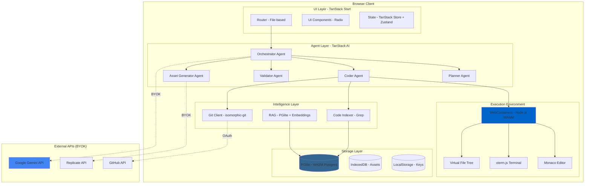

# **Technical Specification Document**

## **via-gent: Client-Side Multi-Agent Agentic IDE Platform**

**Version:** 1.0.0  
**Date:** December 6, 2025  
**Type:** Comprehensive Technical Specification  
**Status:** Research-Required Implementation Blueprint

---

## **DOCUMENT PURPOSE**

This specification defines the **complete technical implementation** for via-gent, organized by:

- **User Stories** - What users can accomplish
- **Technical Requirements** - How the system must work
- **Acceptance Criteria** - When we're done
- **Research Requirements** - What must be validated before implementation

---

## **TABLE OF CONTENTS**

1. [System Architecture](#1-system-architecture)
2. [Technology Stack](#2-technology-stack)
3. [User Stories & Features](#3-user-stories--features)
4. [Dependency Specifications](#4-dependency-specifications)
5. [Cross-Architecture Integration](#5-cross-architecture-integration)
6. [Performance Requirements](#6-performance-requirements)
7. [Security Requirements](#7-security-requirements)
8. [Testing Strategy](#8-testing-strategy)

---

## **1. SYSTEM ARCHITECTURE**

### **1.1 High-Level Architecture**



### **1.2 Architectural Principles**

| Principle             | Implementation          | Validation                         |
| --------------------- | ----------------------- | ---------------------------------- |
| **Client-Side First** | Zero backend servers    | All computation in browser         |
| **Zero-Knowledge**    | No data leaves browser  | Encrypted API keys in LocalStorage |
| **Type-Safe**         | End-to-end TypeScript   | TanStack ecosystem integration     |
| **Research-Driven**   | MCP tools for decisions | Every technical choice cited       |

### **1.3 Research Requirements**

```yaml
research_queries:
  - tool: DeepWiki
    query: 'Browser-based IDE architecture patterns WebContainers'
    validation: 'Confirm WebContainers is optimal for Node.js in browser'

  - tool: Context7
    query: '@webcontainer/api'
    validation: 'Understand boot sequence and file system APIs'

  - tool: Tavily
    query: 'Client-side architecture security best practices 2025'
    validation: 'Ensure no architectural security flaws'
```

---

## **2. TECHNOLOGY STACK**

### **2.1 Core Dependencies**

#### **Frontend Framework: TanStack Start**

```typescript
// package.json (research exact versions via Tavily)
{
  "dependencies": {
    "@tanstack/react-start": "^1.132.0",
    "@tanstack/react-router": "^1.132.0",
    "@tanstack/react-query": "^5.66.5",
    "@tanstack/react-store": "^0.7.0"
  }
}
```

**User Story**: As a developer, I want a type-safe routing system so that navigation errors are caught at compile time.

**Technical Requirements**:

- File-based routing under `app/routes/`
- Type-safe route parameters via `createRoute`
- Code-splitting per route
- SSR-ready (though unused in client-side mode)

**Acceptance Criteria**:

- AC-TS-001: Routes auto-generate TypeScript types
- AC-TS-002: Navigation to non-existent route shows TypeScript error
- AC-TS-003: Route parameters validated at runtime via Zod
- AC-TS-004: Initial route load < 2 seconds (Lighthouse)

**Research Requirements**:

```yaml
research:
  - tool: Context7
    query: '@tanstack/react-start'
    focus: 'File-based routing conventions and createRoute API'

  - tool: DeepWiki
    query: 'TanStack Start client-side only deployment'
    focus: 'How to disable SSR and optimize for browser-only'

  - tool: Exa
    query: 'TanStack Start example projects GitHub'
    focus: 'Real-world routing patterns and project structure'

validation:
  - Create test route with params, verify type safety
  - Measure bundle size impact
  - Validate compatibility with WebContainers
```

---

#### **AI Orchestration: TanStack AI + Gemini**

```typescript
{
  "dependencies": {
    "@tanstack/ai": "^0.0.2",
    "@tanstack/ai-client": "^0.0.2",
    "@tanstack/ai-react": "^0.0.2",
    "@tanstack/ai-gemini": "^0.0.2"
  }
}
```

**User Story**: As a user, I want to describe my project in natural language and have AI agents automatically build it, so I don't need to write code manually.

**Technical Requirements**:

- Multi-agent orchestration with handoff protocol
- Tool calling for file operations, Git, search
- Streaming responses for real-time feedback
- Context management across agent boundaries
- Support for Gemini 2.5 Flash and 3.0 Preview

**Acceptance Criteria**:

- AC-AI-001: User sends message → Orchestrator routes to appropriate agent in < 2s
- AC-AI-002: Agents can call 20+ tools (create_file, search_symbols, etc.)
- AC-AI-003: Tool execution results streamed back to UI in real-time
- AC-AI-004: Handoff between agents includes full context (no information loss)
- AC-AI-005: Agent responses support markdown, code blocks, and UI components

**Research Requirements**:

```yaml
research:
  - tool: Context7
    query: '@tanstack/ai'
    focus: 'chat function API, Agent class, toolDefinition API'

  - tool: Context7
    query: '@tanstack/ai-gemini'
    focus: 'Gemini adapter configuration and providerOptions'

  - tool: DeepWiki
    query: 'TanStack AI multi-agent orchestration patterns'
    focus: 'How to implement agent handoffs and context sharing'

  - tool: Tavily
    query: 'Google Gemini 2.5 Flash vs 3.0 Preview features December 2025'
    focus: 'Model capabilities, context windows, pricing'

  - tool: Exa
    query: 'TanStack AI production examples GitHub'
    focus: 'Real implementations of tool calling and streaming'

critical_validations:
  - 'Can TanStack AI agents maintain context across handoffs?'
  - 'What is handoff latency with context compression?'
  - 'How to handle streaming errors gracefully?'
  - 'Does @tanstack/ai-gemini support Gemini 3.0 Preview?'

  - tool: Web_Browser
    query: 'https://tanstack.com/ai/latest/docs/guides/tools'
    focus: 'Tool definition syntax and server-side execution'
```

**Gemini Model Configuration**:

```typescript
// Pseudo-config (research exact parameters via MCP)
const GEMINI_MODELS = {
  'gemini-2.5-flash': {
    use_case: 'Fast code generation, validation',
    context_window: '1M tokens', // Research: confirm
    cost: { input: '$?/1M', output: '$?/1M' }, // Research via Tavily
    research: 'Tavily: "Gemini 2.5 Flash pricing December 2025"',
  },
  'gemini-3.0-preview': {
    use_case: 'Complex reasoning, architecture',
    context_window: '2M tokens', // Research: confirm
    availability: 'Preview - may have limits',
    research: 'Tavily: "Gemini 3.0 Preview availability December 2025"',
  },
}
```

**Research Requirements for Model Selection**:

```yaml
research:
  - tool: Tavily
    query: 'Google Gemini 2.5 Flash API pricing per million tokens December 2025'
    validation: 'Confirm cost structure for BYOK model'

  - tool: Tavily
    query: 'Google Gemini 3.0 Preview general availability timeline'
    validation: 'Determine if GA or still experimental'

  - tool: DeepWiki
    query: 'Gemini function calling parallel execution support'
    validation: 'Confirm can execute multiple tools in parallel'
```

---

#### **Execution Environment: WebContainers**

```typescript
{
  "dependencies": {
    "@webcontainer/api": "latest"
  }
}
```

**User Story**: As a user, I want to run `pnpm dev` and see a live preview of my app instantly, without needing to install Node.js locally.

**Technical Requirements**:

- Boot Node.js environment in browser (WASM)
- Virtual file system backed by IndexedDB
- Terminal access for running commands
- Hot Module Replacement (HMR) support
- Package installation (pnpm/npm)
- Port forwarding for dev server

**Acceptance Criteria**:

- AC-WC-001: WebContainers boots in < 3 seconds on mid-range hardware
- AC-WC-002: `pnpm install` completes for typical project in < 30 seconds
- AC-WC-003: `pnpm dev` starts dev server with live preview
- AC-WC-004: File changes by agents reflect in dev server within 500ms
- AC-WC-005: Terminal shows real-time command output with ANSI colors
- AC-WC-006: Supports Chrome 110+, Edge 110+ (Firefox experimental)

**Research Requirements**:

```yaml
research:
  - tool: Context7
    query: '@webcontainer/api'
    focus: 'WebContainer.boot(), fs operations, spawn() for terminal'

  - tool: DeepWiki
    query: 'WebContainers architecture WASM Node.js browser'
    focus: 'How it works, limitations, performance characteristics'

  - tool: Tavily
    query: 'WebContainers browser support December 2025'
    focus: 'Chrome, Edge, Firefox, Safari compatibility matrix'

  - tool: DeepWiki
    query: 'WebContainers file system IndexedDB persistence'
    focus: 'How to persist files across sessions'

critical_validations:
  - 'Can WebContainers run Python via Pyodide?'
  - 'What is maximum project size before performance degrades?'
  - 'How to handle WebContainers boot failures gracefully?'

  - tool: Web_Browser
    query: 'https://webcontainers.io/api'
    focus: 'Full API reference and code examples'
```

**Browser Support Matrix**:

| Browser | Version | Support         | SharedArrayBuffer | Performance |
| ------- | ------- | --------------- | ----------------- | ----------- |
| Chrome  | 110+    | ✅ Full         | ✅ Yes            | Excellent   |
| Edge    | 110+    | ✅ Full         | ✅ Yes            | Excellent   |
| Firefox | 115+    | ⚠️ Experimental | ⚠️ Partial        | Good        |
| Safari  | 17+     | ❌ No           | ❌ No             | N/A         |

**Research Validation**:

```yaml
research:
  - tool: Tavily
    query: 'WebContainers Safari support SharedArrayBuffer 2025'
    validation: 'Confirm Safari still unsupported'
```

---

#### **Code Editor: Monaco Editor**

```typescript
{
  "dependencies": {
    "monaco-editor": "latest",
    "@monaco-editor/react": "^4.6.0"
  }
}
```

**User Story**: As a developer, I want a VS Code-like editor in the browser so I can edit multiple files with syntax highlighting and IntelliSense.

**Technical Requirements**:

- Multi-tab interface (max 20 open files)
- Syntax highlighting for TS, JS, Python, CSS, JSON, Markdown
- IntelliSense (autocomplete) for TypeScript
- Diff viewer for Git changes
- Custom language definitions (TanStack conventions)
- Keyboard shortcuts (Cmd+S, Cmd+W, Cmd+P)
- Integration with WebContainers file system

**Acceptance Criteria**:

- AC-MON-001: Editor loads in < 1 second
- AC-MON-002: Syntax highlighting works for all supported languages
- AC-MON-003: File changes auto-save to WebContainers
- AC-MON-004: Tab switching has no perceptible lag
- AC-MON-005: Diff viewer shows side-by-side comparison for Git changes
- AC-MON-006: IntelliSense suggestions appear within 200ms

**Research Requirements**:

```yaml
research:
  - tool: Context7
    query: '@monaco-editor/react'
    focus: 'Editor component API, onChange handling, multi-instance'

  - tool: DeepWiki
    query: 'Monaco editor React multi-tab state management'
    focus: 'Best practices for managing multiple editor instances'

  - tool: Exa
    query: 'Monaco editor multi-tab implementation GitHub React'
    focus: 'Real-world examples of tab management'

  - tool: DeepWiki
    query: 'Monaco editor WebContainers file sync patterns'
    focus: 'How to sync editor changes with virtual file system'

critical_validations:
  - 'What is memory overhead of 20 Monaco instances?'
  - 'How to implement custom language for TanStack routes?'
  - 'Can Monaco diff editor handle 10k+ line files?'
```

**Custom Language Definition Example**:

```typescript
// Research via DeepWiki: "Monaco editor custom language TypeScript"
monaco.languages.register({ id: 'tanstack-route' })
monaco.languages.setMonarchTokensProvider('tanstack-route', {
  tokenizer: {
    root: [
      [/createRoute|createRootRoute/, 'keyword.tanstack'],
      [/@tanstack\//, 'support.type.tanstack'],
    ],
  },
})
```

---

#### **Database: PGlite (Client-Side)**

```typescript
{
  "dependencies": {
    "@electric-sql/pglite": "^0.3.14"
  }
}
```

**User Story**: As a user, I want my conversation history and project metadata stored locally so I can work offline and maintain privacy.

**Technical Requirements**:

- WASM-based PostgreSQL in browser
- pgvector extension for embeddings (conversations only)
- IndexedDB persistence
- SQL query support
- Max ~100MB data per browser profile

**Acceptance Criteria**:

- AC-PG-001: PGlite initializes in < 2 seconds
- AC-PG-002: Conversation history persists across browser sessions
- AC-PG-003: Vector similarity search returns results in < 500ms
- AC-PG-004: Database handles 10,000+ conversation turns without lag
- AC-PG-005: Graceful degradation if IndexedDB quota exceeded

**Research Requirements**:

```yaml
research:
  - tool: Context7
    query: '@electric-sql/pglite'
    focus: 'PGlite.create() API, extensions, query execution'

  - tool: DeepWiki
    query: 'PGlite pgvector extension browser performance'
    focus: 'Vector search performance in WASM Postgres'

  - tool: Tavily
    query: 'PGlite browser compatibility December 2025'
    focus: 'Browser support and known issues'

critical_validations:
  - 'What is max database size before performance degrades?'
  - 'How to handle IndexedDB quota errors?'
  - 'Can pgvector handle 10k+ embeddings efficiently?'
```

**Schema Design**:

```sql
-- Research: "PGlite schema design best practices"
CREATE TABLE conversations (
  id UUID PRIMARY KEY,
  project_id UUID NOT NULL,
  turn_number INTEGER,
  role TEXT CHECK (role IN ('user', 'assistant', 'system')),
  content TEXT NOT NULL,
  embedding VECTOR(384), -- all-MiniLM-L6-v2
  created_at TIMESTAMP DEFAULT NOW()
);

CREATE INDEX ON conversations USING ivfflat (embedding vector_cosine_ops);

CREATE TABLE projects (
  id UUID PRIMARY KEY,
  name TEXT NOT NULL,
  template TEXT,
  created_at TIMESTAMP DEFAULT NOW()
);
```

---

#### **State Management: TanStack Store + Zustand**

```typescript
{
  "dependencies": {
    "@tanstack/react-store": "^0.7.0",
    "@tanstack/store": "^0.7.0",
    "zustand": "^5.0.2"
  }
}
```

**User Story**: As a developer, I want UI state (open files, active agent, terminal tabs) to be reactive and type-safe so the interface stays consistent.

**Technical Requirements**:

- TanStack Store for UI state (files, editor, panels)
- Zustand for global app state (user settings, keys)
- Type-safe selectors
- DevTools integration
- Persistence to LocalStorage for settings

**Acceptance Criteria**:

- AC-STATE-001: State changes trigger React re-renders correctly
- AC-STATE-002: No unnecessary re-renders (validated via React Profiler)
- AC-STATE-003: Settings persist across browser sessions
- AC-STATE-004: State resets cleanly when switching projects
- AC-STATE-005: DevTools show readable state tree

**Research Requirements**:

```yaml
research:
  - tool: Context7
    query: '@tanstack/react-store'
    focus: 'store() API, useStore hook, update patterns'

  - tool: DeepWiki
    query: 'TanStack Store vs Zustand use cases comparison'
    focus: 'When to use each, integration patterns'

  - tool: Exa
    query: 'TanStack Store example implementations GitHub'
    focus: 'Real-world state management patterns'
```

**State Architecture**:

```typescript
// Research: "TanStack Store best practices"
import { store } from '@tanstack/react-store'

export const editorStore = store({
  openFiles: [] as FileDescriptor[],
  activeFile: null as FileDescriptor | null,
  tabs: [] as EditorTab[],
})

// Research: "Zustand persist middleware"
import { create } from 'zustand'
import { persist } from 'zustand/middleware'

export const settingsStore = create(
  persist(
    (set) => ({
      theme: 'dark',
      locale: 'en',
      geminiKey: null,
    }),
    { name: 'via-gent-settings' },
  ),
)
```

---

#### **UI Components: Radix UI + Tailwind CSS**

```typescript
{
  "dependencies": {
    "@radix-ui/themes": "^3.2.1",
    "tailwindcss": "^4.0.6",
    "lucide-react": "^0.544.0",
    "class-variance-authority": "^0.7.1",
    "clsx": "^2.1.1"
  }
}
```

**User Story**: As a user, I want a polished, accessible interface that works well with keyboard navigation and screen readers.

**Technical Requirements**:

- Radix UI primitives for accessibility
- Tailwind CSS for styling
- Lucide icons
- Dark mode support
- Responsive design (desktop-first)
- WCAG 2.1 Level AA compliance

**Acceptance Criteria**:

- AC-UI-001: All interactive elements keyboard-navigable
- AC-UI-002: Focus indicators visible
- AC-UI-003: Screen reader announces agent actions
- AC-UI-004: Color contrast meets WCAG AA
- AC-UI-005: Responsive breakpoints work on 13" laptop and up

**Research Requirements**:

```yaml
research:
  - tool: Context7
    query: '@radix-ui/themes'
    focus: 'Theme configuration and component API'

  - tool: DeepWiki
    query: 'Radix UI Tailwind CSS integration best practices'
    focus: 'How to style Radix components with Tailwind'

  - tool: Tavily
    query: 'WCAG 2.1 Level AA checklist 2025'
    focus: 'Accessibility requirements for web apps'
```

---

#### **Git Client: isomorphic-git**

```typescript
{
  "dependencies": {
    "isomorphic-git": "latest",
    "lightning-fs": "latest"
  }
}
```

**User Story**: As a user, I want to commit my changes to GitHub directly from the IDE so I don't need to switch to terminal.

**Technical Requirements**:

- Git operations in browser (clone, commit, push, pull, diff)
- GitHub OAuth authentication
- Diff visualization
- IndexedDB storage for Git objects
- Support for repos up to 1000 commits (MVP)

**Acceptance Criteria**:

- AC-GIT-001: Commit operation completes in < 5 seconds for 100 files
- AC-GIT-002: Diff viewer shows accurate line-by-line changes
- AC-GIT-003: OAuth flow completes without leaving browser tab
- AC-GIT-004: Push to GitHub succeeds with encrypted token
- AC-GIT-005: Error messages clear when push fails (e.g., merge conflict)

**Research Requirements**:

```yaml
research:
  - tool: Context7
    query: 'isomorphic-git'
    focus: 'commit, diff, push APIs and authentication'

  - tool: DeepWiki
    query: 'isomorphic-git WebContainers integration patterns'
    focus: 'How to use isomorphic-git with WebContainers FS'

  - tool: Tavily
    query: 'isomorphic-git performance large repositories 2025'
    focus: 'Performance limits and optimization techniques'

critical_validations:
  - 'Can isomorphic-git handle 1000+ commits?'
  - 'How to implement partial clone for large repos?'
  - 'What is push latency to GitHub?'
```

---

### **2.2 Cross-Dependency Integration Map**

```mermaid
graph TB
    TS[TanStack Start] --> TR[TanStack Router]
    TS --> TQ[TanStack Query]
    TS --> TST[TanStack Store]

    TAI[TanStack AI] --> TAIG[TanStack AI Gemini]
    TAI --> TAIR[TanStack AI React]

    WC[WebContainers] --> Monaco[Monaco Editor]
    WC --> Term[xterm.js]
    WC --> Git[isomorphic-git]

    CodeIdx[Code Indexer] --> PG[PGlite]
    RAG[RAG Engine] --> PG
    RAG --> Transformers[@xenova/transformers]

    UI[Radix UI] --> TW[Tailwind CSS]

    Agents[AI Agents] --> TAI
    Agents --> WC
    Agents --> CodeIdx
    Agents --> Git

    style TAI fill:#4285F4
    style WC fill:#0066CC
    style PG fill:#336791
```

**Research Requirements for Integration**:

```yaml
research:
  - tool: DeepWiki
    query: 'TanStack Start WebContainers integration patterns'
    validation: 'How to mount WebContainers within TanStack Start app'

  - tool: DeepWiki
    query: 'TanStack AI tool context injection patterns'
    validation: 'How to pass WebContainers instance to tool functions'

  - tool: DeepWiki
    query: 'Monaco editor TanStack Router coordination'
    validation: 'How to sync route changes with open editor tabs'
```

---

## **3. USER STORIES & FEATURES**

### **3.1 Core Workflow: Project Creation**

**Epic**: As a user, I want to create a new project from a template and start coding immediately.

#### **User Story 3.1.1: Template Selection**

**Story**: As a user, I want to choose from pre-built templates (TanStack Start, Next.js, Flask) so I don't start from scratch.

**Acceptance Criteria**:

- AC-3.1.1-001: Template gallery shows 3+ templates with previews
- AC-3.1.1-002: Each template includes description, tech stack, and screenshot
- AC-3.1.1-003: Template selection updates URL route (type-safe)
- AC-3.1.1-004: User can preview template file structure before creating

**Technical Requirements**:

```typescript
// Research: "Project template architecture best practices"
interface Template {
  id: string // 'tanstack-start-blog', 'nextjs-app-landing'
  name: string
  description: string
  framework: 'tanstack-start' | 'nextjs' | 'flask'
  files: FileTree // Pre-defined file structure
  dependencies: Record<string, string>
  preview_url?: string
}

// Template storage
const TEMPLATES: Template[] = [
  {
    id: 'tanstack-start-blog',
    name: 'TanStack Start Blog',
    description: 'Blog with file-based routing and TanStack Query',
    framework: 'tanstack-start',
    files: {
      /* researched structure */
    },
    dependencies: {
      /* researched versions */
    },
  },
]
```

**Research Requirements**:

```yaml
research:
  - tool: Context7
    query: '@tanstack/react-start'
    focus: 'Recommended project structure and dependencies'

  - tool: Exa
    query: 'TanStack Start blog template GitHub'
    focus: 'Real-world blog implementations'

  - tool: DeepWiki
    query: 'Project template scaffolding JavaScript libraries'
    focus: 'How to programmatically generate file structures'
```

---

#### **User Story 3.1.2: WebContainers Initialization**

**Story**: As a user, after selecting a template, I want the project to boot automatically with a live preview within 10 seconds.

**Acceptance Criteria**:

- AC-3.1.2-001: WebContainers boots in < 3 seconds
- AC-3.1.2-002: Template files mounted to WebContainers FS
- AC-3.1.2-003: `pnpm install` executes automatically with progress bar
- AC-3.1.2-004: `pnpm dev` starts and dev server URL shown
- AC-3.1.2-005: Live preview iframe loads within 10 seconds total

**Technical Requirements**:

```typescript
// Research: "WebContainers initialization sequence"
async function initializeProject(template: Template): Promise<void> {
  // 1. Boot WebContainers
  const wc = await WebContainer.boot({ coep: 'require-corp' })

  // 2. Mount template files
  await wc.mount(template.files)

  // 3. Install dependencies
  const installProcess = await wc.spawn('pnpm', ['install'])
  await streamToUI(installProcess.output) // Show progress

  // 4. Start dev server
  const devProcess = await wc.spawn('pnpm', ['dev'])
  const url = await waitForServerReady(devProcess.output)

  // 5. Update UI with preview URL
  updatePreviewIframe(url)
}
```

**Research Requirements**:

```yaml
research:
  - tool: Context7
    query: '@webcontainer/api'
    focus: 'WebContainer.boot() options, mount() API, spawn() for commands'

  - tool: DeepWiki
    query: 'WebContainers dev server URL detection patterns'
    focus: 'How to parse output stream to find localhost URL'

critical_validations:
  - 'What happens if pnpm install fails?'
  - 'How to show install progress (percentage)?'
  - 'Can we cache node_modules between projects?'
```

---

### **3.2 AI Agent Interaction**

**Epic**: As a user, I want to describe changes in natural language and have AI agents implement them.

#### **User Story 3.2.1: Conversational Interface**

**Story**: As a user, I want to chat with AI agents in a sidebar so I can request features without writing code.

**Acceptance Criteria**:

- AC-3.2.1-001: Chat input accepts markdown and code blocks
- AC-3.2.1-002: Agent responses stream word-by-word (not all at once)
- AC-3.2.1-003: Tool calls shown in real-time with progress indicators
- AC-3.2.1-004: Conversation history persists in PGlite
- AC-3.2.1-005: User can approve/reject destructive tool calls

**Technical Requirements**:

```typescript
// Research: "TanStack AI React useChat hook"
import { useChat } from '@tanstack/ai-react'

export function AgentChat() {
  const {
    messages,
    sendMessage,
    isLoading,
    toolInvocations
  } = useChat({
    api: '/api/agent', // Local endpoint
    initialMessages: []
  })

  return (
    <div className="chat-container">
      {messages.map(msg => (
        <Message key={msg.id} content={msg.content} role={msg.role} />
      ))}

      {toolInvocations?.map(inv => (
        <ToolCall
          key={inv.id}
          name={inv.toolName}
          args={inv.args}
          status={inv.state}
        />
      ))}

      <ChatInput onSend={sendMessage} disabled={isLoading} />
    </div>
  )
}
```

**Research Requirements**:

```yaml
research:
  - tool: Context7
    query: '@tanstack/ai-react'
    focus: 'useChat hook API, message streaming, tool invocations'

  - tool: DeepWiki
    query: 'TanStack AI streaming patterns React'
    focus: 'How to display streaming responses and tool calls'

  - tool: Exa
    query: 'TanStack AI chat interface implementations GitHub'
    focus: 'Real-world chat UI patterns'
```

---

#### **User Story 3.2.2: Multi-Agent Orchestration**

**Story**: As a user, I want my request automatically routed to the right specialist agent (planner, coder, validator) so I get expert assistance.

**Acceptance Criteria**:

- AC-3.2.2-001: Orchestrator analyzes user request and routes in < 2s
- AC-3.2.2-002: Handoff includes full context (no information loss)
- AC-3.2.2-003: Max 20 handoffs before asking user for clarification
- AC-3.2.2-004: Agent transitions visible in UI (e.g., "Planner → Coder")
- AC-3.2.2-005: Audit log records all handoffs with timestamps

**Technical Requirements**:

```typescript
// Research: "TanStack AI multi-agent handoff patterns"
import { chat } from '@tanstack/ai'
import { gemini } from '@tanstack/ai-gemini'

// Orchestrator agent
const orchestratorAgent = {
  model: 'gemini-2.5-flash',
  systemPrompt: `You coordinate specialist agents.
Available: planner, coder, validator, asset-gen.
Use handoff tool to delegate.`,

  tools: [
    handoffTool, // Research: how to define this tool
    checkPhaseTool,
  ],

  maxCycles: 5,
}

// Handoff tool (research exact syntax)
const handoffTool = toolDefinition({
  name: 'handoff',
  description: 'Delegate task to specialist agent',
  inputSchema: z.object({
    toAgent: z.enum(['planner', 'coder', 'validator', 'asset-gen']),
    reason: z.string(),
    context: z.object({
      phase: z.string(),
      artifacts: z.array(z.string()),
      constraints: z.array(z.string()),
    }),
  }),
  server: async ({ toAgent, reason, context }) => {
    // Switch to target agent
    currentAgent = toAgent
    // Preserve context for next agent
    agentContext = context
    return { handedOff: true, toAgent }
  },
})
```

**Research Requirements**:

```yaml
research:
  - tool: Context7
    query: '@tanstack/ai'
    focus: 'toolDefinition API, server function, context injection'

  - tool: DeepWiki
    query: 'TanStack AI agent handoff with context preservation'
    focus: 'How to pass state between agents without losing information'

  - tool: DeepWiki
    query: 'Multi-agent orchestration loop detection'
    focus: 'How to prevent infinite handoff loops'

critical_validations:
  - 'What is maximum context size before compression needed?'
  - 'How to resume from handoff if user refreshes browser?'
  - 'Can handoff cross browser tabs (e.g., SharedWorker)?'
```

---

#### **User Story 3.2.3: Code Generation with Validation Loop**

**Story**: As a user, I want generated code to automatically pass TypeScript and ESLint checks so I don't receive broken code.

**Acceptance Criteria**:

- AC-3.2.3-001: Coder agent generates code → Validator runs checks
- AC-3.2.3-002: If errors, Validator returns structured feedback to Coder
- AC-3.2.3-003: Coder fixes errors and re-submits (max 10 iterations)
- AC-3.2.3-004: If 10 iterations exceeded, escalate to user with error summary
- AC-3.2.3-005: Success rate: 80% pass validation within 3 iterations

**Technical Requirements**:

```typescript
// Research: "TanStack AI validation loop patterns"
const coderAgent = {
  model: 'gemini-2.5-flash',
  systemPrompt: `Generate production-ready TypeScript code.
Follow TanStack conventions. Use Radix UI + Tailwind.`,

  tools: [createFileTool, updateFileTool, validateCodeTool],

  maxCycles: 10,

  // Stop when validation passes
  stopConditions: [
    (state) => {
      const lastValidation = state.toolResults
        .reverse()
        .find((r) => r.toolName === 'validate_code')
      return lastValidation?.result?.success === true
    },
  ],
}

// Validation tool (research implementation)
const validateCodeTool = toolDefinition({
  name: 'validate_code',
  description: 'Run TypeScript and ESLint checks',
  inputSchema: z.object({
    files: z.array(z.string()),
  }),
  server: async ({ files }, { webcontainer }) => {
    // Run tsc --noEmit
    const tscProcess = await webcontainer.spawn('pnpm', ['tsc', '--noEmit'])
    const tscOutput = await streamToString(tscProcess.output)
    const tscErrors = parseTscErrors(tscOutput)

    // Run ESLint
    const eslintProcess = await webcontainer.spawn('pnpm', ['lint'])
    const eslintOutput = await streamToString(eslintProcess.output)
    const eslintErrors = parseEslintErrors(eslintOutput)

    return {
      success: tscErrors.length === 0 && eslintErrors.length === 0,
      errors: [...tscErrors, ...eslintErrors],
    }
  },
})
```

**Research Requirements**:

```yaml
research:
  - tool: Context7
    query: '@tanstack/ai'
    focus: 'stopConditions API, how to check tool results'

  - tool: DeepWiki
    query: 'TypeScript compiler API error parsing'
    focus: 'How to parse tsc output into structured errors'

  - tool: DeepWiki
    query: 'ESLint programmatic API Node.js'
    focus: 'How to run ESLint and get results as JSON'

critical_validations:
  - 'What is average iteration count for validation loop?'
  - 'How to prevent loop if error message confuses LLM?'
  - 'Can we cache validation results between iterations?'
```

---

### **3.3 IDE Features**

#### **User Story 3.3.1: Multi-Tab Code Editing**

**Story**: As a developer, I want to open multiple files in tabs so I can edit several components simultaneously.

**Acceptance Criteria**:

- AC-3.3.1-001: Max 20 open tabs, LRU eviction for 21st
- AC-3.3.1-002: Tab shows file name and dirty indicator (\*)
- AC-3.3.1-003: Cmd+W closes active tab
- AC-3.3.1-004: Cmd+S saves active file to WebContainers
- AC-3.3.1-005: Tab order persists across browser refresh

**Technical Requirements**:

```typescript
// Research: "Multi-tab editor state management React"
import { store } from '@tanstack/react-store'
import { Editor } from '@monaco-editor/react'

export const editorStore = store({
  tabs: [] as EditorTab[],
  activeTabId: null as string | null,
  maxTabs: 20
})

interface EditorTab {
  id: string
  path: string
  content: string
  language: string
  isDirty: boolean
  lastAccessed: number
}

export function MultiTabEditor() {
  const { tabs, activeTabId } = useStore(editorStore)
  const activeTab = tabs.find(t => t.id === activeTabId)

  const handleChange = (value: string | undefined) => {
    if (!activeTab) return

    editorStore.setState(state => ({
      tabs: state.tabs.map(t =>
        t.id === activeTab.id
          ? { ...t, content: value || '', isDirty: true }
          : t
      )
    }))
  }

  return (
    <div>
      <Tabs tabs={tabs} active={activeTabId} />
      <Editor
        path={activeTab?.path}
        value={activeTab?.content}
        language={activeTab?.language}
        onChange={handleChange}
      />
    </div>
  )
}
```

**Research Requirements**:

```yaml
research:
  - tool: Context7
    query: '@monaco-editor/react'
    focus: 'Editor component props, onChange, path handling'

  - tool: DeepWiki
    query: 'Monaco editor multi-instance performance React'
    focus: 'Memory overhead of multiple editor instances'

  - tool: Exa
    query: 'Multi-tab editor React implementations GitHub'
    focus: 'Tab management patterns and LRU eviction'
```

---

#### **User Story 3.3.2: File Tree Navigation**

**Story**: As a developer, I want to see a hierarchical file tree so I can navigate my project structure easily.

**Acceptance Criteria**:

- AC-3.3.2-001: Tree shows all files and folders from WebContainers
- AC-3.3.2-002: Click file → opens in editor
- AC-3.3.2-003: Click folder → expands/collapses
- AC-3.3.2-004: Right-click shows context menu (Rename, Delete, Ask Agent)
- AC-3.3.2-005: Tree virtualizes for 1000+ files (< 300ms render)
- AC-3.3.2-006: Git status indicators (M, A, D) shown next to files

**Technical Requirements**:

```typescript
// Research: "File tree virtualization TanStack Virtual"
import { useVirtualizer } from '@tanstack/react-virtual'

export function FileTree({ files }: { files: FileNode[] }) {
  const parentRef = useRef<HTMLDivElement>(null)

  const rowVirtualizer = useVirtualizer({
    count: flattenedFiles.length,
    getScrollElement: () => parentRef.current,
    estimateSize: () => 28, // Height per row
    overscan: 5
  })

  return (
    <div ref={parentRef} className="file-tree">
      {rowVirtualizer.getVirtualItems().map(virtualRow => {
        const file = flattenedFiles[virtualRow.index]
        return (
          <FileTreeNode
            key={virtualRow.key}
            file={file}
            depth={getDepth(file)}
            onClick={() => openFile(file)}
          />
        )
      })}
    </div>
  )
}
```

**Research Requirements**:

```yaml
research:
  - tool: Context7
    query: '@tanstack/react-virtual'
    focus: 'useVirtualizer API, scroll performance, estimateSize'

  - tool: DeepWiki
    query: 'File tree recursive flattening algorithms'
    focus: 'How to flatten tree to array for virtualization'

  - tool: DeepWiki
    query: 'Git status file tree integration patterns'
    focus: 'How to efficiently check file status (modified, added, deleted)'
```

---

#### **User Story 3.3.3: Integrated Terminal**

**Story**: As a developer, I want to run terminal commands in the IDE so I can execute scripts without leaving the browser.

**Acceptance Criteria**:

- AC-3.3.3-001: Terminal connects to WebContainers shell
- AC-3.3.3-002: Commands execute and output shown in real-time
- AC-3.3.3-003: ANSI color codes rendered correctly
- AC-3.3.3-004: Command history (up arrow) works
- AC-3.3.3-005: Max 5 terminal tabs, each independent session
- AC-3.3.3-006: Whitelisted commands: pnpm, npm, node, python, pip, git

**Technical Requirements**:

```typescript
// Research: "xterm.js WebContainers integration"
import { Terminal } from 'xterm'
import { FitAddon } from 'xterm-addon-fit'

export function IntegratedTerminal({ webcontainer }: Props) {
  const terminalRef = useRef<HTMLDivElement>(null)
  const xtermRef = useRef<Terminal>()

  useEffect(() => {
    const term = new Terminal({
      theme: {
        background: '#1e1e1e',
        foreground: '#d4d4d4'
      }
    })

    const fitAddon = new FitAddon()
    term.loadAddon(fitAddon)
    term.open(terminalRef.current!)
    fitAddon.fit()

    // Connect to WebContainers shell
    const shellProcess = await webcontainer.spawn('jsh') // WebContainers shell

    // Pipe output to xterm
    shellProcess.output.pipeTo(new WritableStream({
      write(chunk) {
        term.write(new TextDecoder().decode(chunk))
      }
    }))

    // Pipe input from xterm to shell
    term.onData((data) => {
      shellProcess.input.write(data)
    })

    xtermRef.current = term
  }, [])

  return <div ref={terminalRef} />
}
```

**Research Requirements**:

```yaml
research:
  - tool: Context7
    query: 'xterm.js'
    focus: 'Terminal API, addons, themes'

  - tool: Context7
    query: '@webcontainer/api'
    focus: 'spawn() for shell, input/output streams'

  - tool: DeepWiki
    query: 'xterm.js WebContainers shell binding patterns'
    focus: 'How to connect terminal input/output to WebContainers process'

critical_validations:
  - 'How to handle terminal resize events?'
  - 'Can we persist terminal history across refresh?'
  - 'What is performance impact of multiple terminals?'
```

---

### **3.4 Code Intelligence**

#### **User Story 3.4.1: Symbol Search**

**Story**: As a developer, I want to search for functions, classes, and types across my project so I can quickly navigate code.

**Acceptance Criteria**:

- AC-3.4.1-001: Search returns results in < 50ms for 1000 files
- AC-3.4.1-002: Results show symbol name, type, file, and line number
- AC-3.4.1-003: Click result → opens file at that line in editor
- AC-3.4.1-004: Search accuracy > 95% for exact symbol names
- AC-3.4.1-005: Fuzzy matching for typos (Levenshtein distance < 3)

**Technical Requirements**:

```typescript
// Research: "Code symbol extraction regex patterns TypeScript"
interface Symbol {
  name: string
  type: 'function' | 'class' | 'type' | 'interface' | 'const' | 'import'
  filePath: string
  lineNumber: number
  signature?: string
}

class CodeIndexer {
  private symbolTable = new Map<string, Symbol[]>()

  async indexFile(path: string, content: string): Promise<void> {
    const symbols = this.extractSymbols(content, path)
    this.symbolTable.set(path, symbols)
  }

  extractSymbols(code: string, path: string): Symbol[] {
    const symbols: Symbol[] = []
    const lines = code.split('\n')

    lines.forEach((line, idx) => {
      // Function: export function foo() ...
      const funcMatch = line.match(/export\s+(?:async\s+)?function\s+(\w+)/)
      if (funcMatch) {
        symbols.push({
          name: funcMatch[1],
          type: 'function',
          filePath: path,
          lineNumber: idx + 1,
          signature: line.trim(),
        })
      }

      // Class: export class Foo ...
      const classMatch = line.match(/export\s+class\s+(\w+)/)
      if (classMatch) {
        symbols.push({
          name: classMatch[1],
          type: 'class',
          filePath: path,
          lineNumber: idx + 1,
          signature: line.trim(),
        })
      }

      // Type/Interface: export type Foo = ...
      const typeMatch = line.match(/export\s+(?:type|interface)\s+(\w+)/)
      if (typeMatch) {
        symbols.push({
          name: typeMatch[1],
          type: 'type',
          filePath: path,
          lineNumber: idx + 1,
          signature: line.trim(),
        })
      }

      // Research: Add more patterns for const, import, etc.
    })

    return symbols
  }

  search(query: string): Symbol[] {
    const results: Symbol[] = []
    for (const symbols of this.symbolTable.values()) {
      for (const symbol of symbols) {
        if (symbol.name.includes(query)) {
          results.push(symbol)
        }
      }
    }
    return results
  }
}
```

**Research Requirements**:

```yaml
research:
  - tool: DeepWiki
    query: 'TypeScript symbol extraction regex patterns'
    focus: 'Regex for functions, classes, types, interfaces, exports'

  - tool: DeepWiki
    query: 'Code indexing performance in-memory data structures'
    focus: 'Optimal data structure for symbol table (Map, Trie, etc.)'

  - tool: Tavily
    query: 'Fuzzy string matching algorithms Levenshtein JavaScript'
    focus: 'Efficient fuzzy matching for symbol search'

critical_validations:
  - 'What is memory overhead for 10k symbols?'
  - 'How accurate is regex extraction for complex TypeScript?'
  - 'Should we use TypeScript compiler API instead of regex?'
```

---

#### **User Story 3.4.2: Conversation RAG**

**Story**: As a user, I want to ask "What did we discuss about authentication?" and get relevant past conversation context.

**Acceptance Criteria**:

- AC-3.4.2-001: Semantic search returns top 5 results in < 500ms
- AC-3.4.2-002: Results ranked by relevance (cosine similarity)
- AC-3.4.2-003: Conversation chunks embedded using all-MiniLM-L6-v2
- AC-3.4.2-004: Max 1000 conversation chunks (auto-prune oldest)
- AC-3.4.2-005: Precision@5 > 75% on test queries

**Technical Requirements**:

```typescript
// Research: "Client-side embeddings Xenova transformers"
import { pipeline } from '@xenova/transformers'
import { db } from './pglite'

class ConversationRAG {
  private embedModel: any

  async initialize() {
    this.embedModel = await pipeline(
      'feature-extraction',
      'Xenova/all-MiniLM-L6-v2',
    )
  }

  async addConversationTurn(
    projectId: string,
    role: 'user' | 'assistant',
    content: string,
  ): Promise<void> {
    // Generate embedding
    const embedding = await this.embedModel(content, {
      pooling: 'mean',
      normalize: true,
    })

    // Store in PGlite with pgvector
    await db.query(
      `
      INSERT INTO conversations (project_id, role, content, embedding)
      VALUES ($1, $2, $3, $4)
    `,
      [projectId, role, content, Array.from(embedding.data)],
    )
  }

  async search(query: string, limit = 5): Promise<ConversationTurn[]> {
    // Embed query
    const queryEmbedding = await this.embedModel(query)

    // Vector similarity search
    const results = await db.query(
      `
      SELECT content, role, created_at,
             (embedding <=> $1) as distance
      FROM conversations
      WHERE project_id = $2
      ORDER BY distance ASC
      LIMIT $3
    `,
      [Array.from(queryEmbedding.data), currentProjectId, limit],
    )

    return results.rows
  }
}
```

**Research Requirements**:

```yaml
research:
  - tool: Context7
    query: '@xenova/transformers'
    focus: 'pipeline API, feature-extraction, all-MiniLM-L6-v2 model'

  - tool: DeepWiki
    query: 'PGlite pgvector client-side performance'
    focus: 'Vector search performance in WASM Postgres'

  - tool: Tavily
    query: 'all-MiniLM-L6-v2 accuracy benchmarks 2025'
    focus: 'Embedding quality and size tradeoffs'

critical_validations:
  - 'What is embedding generation time per message?'
  - 'Can PGlite handle 1000+ vectors without lag?'
  - 'Should we use quantized embeddings for smaller size?'
```

---

### **3.5 Git Integration**

#### **User Story 3.5.1: GitHub OAuth Connection**

**Story**: As a user, I want to connect my GitHub account so I can push commits directly from the IDE.

**Acceptance Criteria**:

- AC-3.5.1-001: OAuth flow completes in < 5 seconds
- AC-3.5.1-002: Token encrypted (AES-256-GCM) and stored in LocalStorage
- AC-3.5.1-003: Token never logged or transmitted to any server
- AC-3.5.1-004: User can disconnect and revoke access
- AC-3.5.1-005: Token refresh handled automatically

**Technical Requirements**:

```typescript
// Research: "GitHub OAuth PKCE flow browser implementation"
class GitHubOAuth {
  private clientId = 'YOUR_CLIENT_ID' // Research: how to register OAuth app

  async initiateOAuth(): Promise<void> {
    // Generate PKCE code verifier and challenge
    const codeVerifier = generateCodeVerifier()
    const codeChallenge = await generateCodeChallenge(codeVerifier)

    // Store verifier temporarily
    sessionStorage.setItem('pkce_verifier', codeVerifier)

    // Redirect to GitHub OAuth
    const authUrl = new URL('https://github.com/login/oauth/authorize')
    authUrl.searchParams.set('client_id', this.clientId)
    authUrl.searchParams.set(
      'redirect_uri',
      window.location.origin + '/oauth/callback',
    )
    authUrl.searchParams.set('scope', 'repo')
    authUrl.searchParams.set('code_challenge', codeChallenge)
    authUrl.searchParams.set('code_challenge_method', 'S256')

    window.location.href = authUrl.toString()
  }

  async handleCallback(code: string): Promise<string> {
    const codeVerifier = sessionStorage.getItem('pkce_verifier')
    if (!codeVerifier) throw new Error('Missing PKCE verifier')

    // Exchange code for token (research: is this possible client-side?)
    // May need minimal serverless function for token exchange
    const response = await fetch(
      'https://github.com/login/oauth/access_token',
      {
        method: 'POST',
        headers: { 'Content-Type': 'application/json' },
        body: JSON.stringify({
          client_id: this.clientId,
          code,
          code_verifier: codeVerifier,
        }),
      },
    )

    const { access_token } = await response.json()

    // Encrypt and store
    const encrypted = await encryptToken(access_token)
    localStorage.setItem('github_token', encrypted)

    return access_token
  }
}
```

**Research Requirements**:

```yaml
research:
  - tool: DeepWiki
    query: 'GitHub OAuth PKCE browser-only implementation'
    focus: 'Can PKCE flow complete without backend server?'

  - tool: Tavily
    query: 'GitHub OAuth token exchange client-side 2025'
    focus: 'Is it possible to exchange code for token client-side?'

  - tool: DeepWiki
    query: 'Web Crypto API AES-256-GCM encryption'
    focus: 'How to encrypt OAuth token securely in browser'

critical_validations:
  - 'Can we do token exchange without server?'
  - 'If server needed, what is minimal serverless function?'
  - 'How to handle token expiration and refresh?'
```

---

#### **User Story 3.5.2: Commit and Diff**

**Story**: As a developer, I want to see what files changed and commit them with a message.

**Acceptance Criteria**:

- AC-3.5.2-001: Diff viewer shows side-by-side comparison
- AC-3.5.2-002: Changed files listed with M/A/D indicators
- AC-3.5.2-003: User can stage/unstage individual files
- AC-3.5.2-004: Commit message field with validation (min 10 chars)
- AC-3.5.2-005: Commit completes in < 5 seconds for 100 files
- AC-3.5.2-006: Push to GitHub succeeds with encrypted token

**Technical Requirements**:

```typescript
// Research: "isomorphic-git commit push API"
import git from 'isomorphic-git'
import http from 'isomorphic-git/http/web'

class GitClient {
  constructor(
    private fs: any,
    private dir: string,
  ) {}

  async getStatus(): Promise<FileStatus[]> {
    const status = await git.statusMatrix({
      fs: this.fs,
      dir: this.dir,
    })

    return status.map(([filepath, head, workdir, stage]) => ({
      path: filepath,
      status: this.interpretStatus(head, workdir, stage),
    }))
  }

  async commit(message: string, files: string[]): Promise<string> {
    // Stage files
    for (const file of files) {
      await git.add({ fs: this.fs, dir: this.dir, filepath: file })
    }

    // Commit
    const sha = await git.commit({
      fs: this.fs,
      dir: this.dir,
      message,
      author: {
        name: 'User Name',
        email: 'user@example.com',
      },
    })

    return sha
  }

  async push(): Promise<void> {
    const token = await decryptToken(localStorage.getItem('github_token')!)

    await git.push({
      fs: this.fs,
      dir: this.dir,
      http,
      remote: 'origin',
      ref: 'main',
      onAuth: () => ({ username: token, password: 'x-oauth-basic' }),
    })
  }

  async diff(filepath: string): Promise<string> {
    // Research: how to get diff output from isomorphic-git
  }
}
```

**Research Requirements**:

```yaml
research:
  - tool: Context7
    query: 'isomorphic-git'
    focus: 'statusMatrix, commit, push, diff APIs'

  - tool: DeepWiki
    query: 'isomorphic-git diff output unified format'
    focus: 'How to generate diff strings for UI display'

  - tool: DeepWiki
    query: 'Monaco editor diff viewer React integration'
    focus: "How to display diffs in Monaco's diff editor"

critical_validations:
  - 'What is commit latency for 100 files?'
  - 'How to handle push failures (merge conflicts)?'
  - 'Can we show diff before commit?'
```

---

### **3.6 Asset Studio**

#### **User Story 3.6.1: Image Generation**

**Story**: As a user, I want to generate images from text prompts so I can create hero images and icons for my project.

**Acceptance Criteria**:

- AC-3.6.1-001: Image generation completes in < 30 seconds
- AC-3.6.1-002: Generated image stored in IndexedDB
- AC-3.6.1-003: Image automatically added to project `/assets` folder
- AC-3.6.1-004: Cost tracking accurate to $0.01
- AC-3.6.1-005: User can regenerate or edit image

**Technical Requirements**:

```typescript
// Research: "Replicate API browser CORS JavaScript"
class AssetGenerator {
  async generateImage(prompt: string): Promise<string> {
    const apiKey = await getReplicateKey() // From encrypted storage

    const response = await fetch('https://api.replicate.com/v1/predictions', {
      method: 'POST',
      headers: {
        Authorization: `Token ${apiKey}`,
        'Content-Type': 'application/json',
      },
      body: JSON.stringify({
        version: 'flux-1.1-pro-version-id', // Research: actual version ID
        input: { prompt },
      }),
    })

    const prediction = await response.json()

    // Poll for completion
    const imageUrl = await this.pollForResult(prediction.id, apiKey)

    // Download and store
    const imageBlob = await fetch(imageUrl).then((r) => r.blob())
    const storageKey = await this.storeInIndexedDB(imageBlob)

    // Add to WebContainers project
    await this.addToProject(storageKey, 'hero-image.png')

    return storageKey
  }

  async storeInIndexedDB(blob: Blob): Promise<string> {
    const db = await openDB('via-gent-assets', 1)
    const id = crypto.randomUUID()
    await db.put('images', { id, blob, createdAt: Date.now() })
    return id
  }
}
```

**Research Requirements**:

```yaml
research:
  - tool: Context7
    query: 'replicate'
    focus: 'Replicate API for image generation, polling patterns'

  - tool: Tavily
    query: 'Replicate API CORS browser support December 2025'
    focus: 'Can we call Replicate directly from browser?'

  - tool: DeepWiki
    query: 'IndexedDB blob storage large files'
    focus: 'How to efficiently store images in IndexedDB'

critical_validations:
  - 'Does Replicate API allow CORS from browser?'
  - 'What is max image size before IndexedDB quota issues?'
  - 'How to handle generation failures gracefully?'
```

---

### **3.7 Internationalization**

#### **User Story 3.7.1: Language Switching**

**Story**: As a Vietnamese user, I want the entire UI in Vietnamese so I can use the app in my native language.

**Acceptance Criteria**:

- AC-3.7.1-001: Language toggle in settings switches between en/vi
- AC-3.7.1-002: All UI strings translated (100% coverage)
- AC-3.7.1-003: Language preference persists in LocalStorage
- AC-3.7.1-004: Agent system prompts translated based on locale
- AC-3.7.1-005: Date/time formats localized

**Technical Requirements**:

```typescript
// Research: "next-intl without Next.js React"
import { createTranslator } from 'next-intl'

export function useTranslation(locale: string) {
  const messages = require(`../locales/${locale}/common.json`)
  const t = createTranslator({ locale, messages })
  return t
}

// Locale files
// locales/en/common.json
{
  "nav": {
    "projects": "Projects",
    "templates": "Templates",
    "settings": "Settings"
  },
  "agent": {
    "thinking": "Agent is thinking...",
    "generating": "Generating code..."
  }
}

// locales/vi/common.json
{
  "nav": {
    "projects": "Dự án",
    "templates": "Mẫu",
    "settings": "Cài đặt"
  },
  "agent": {
    "thinking": "Agent đang suy nghĩ...",
    "generating": "Đang tạo mã..."
  }
}
```

**Research Requirements**:

```yaml
research:
  - tool: Context7
    query: 'next-intl'
    focus: 'Can it work without Next.js? Alternative: react-i18next'

  - tool: Tavily
    query: 'Client-side i18n React libraries comparison 2025'
    focus: 'next-intl vs react-i18next for TanStack Start'

  - tool: DeepWiki
    query: 'AI prompt translation dynamic locale'
    focus: 'How to translate agent system prompts based on user language'

critical_validations:
  - 'Can we use next-intl outside Next.js?'
  - 'What is bundle size impact of translations?'
  - 'How to handle pluralization and formatting?'
```

---

## **4. DEPENDENCY SPECIFICATIONS**

### **4.1 Dependency Resolution Strategy**

```yaml
research_before_installation:
  - tool: Tavily
    query: 'TanStack Start stable version December 2025'
    validation: 'Ensure using latest stable, not alpha'

  - tool: Context7
    query: '@tanstack/react-start'
    validation: 'Check peer dependencies and compatibility'

  - tool: DeepWiki
    query: 'TanStack ecosystem version compatibility matrix'
    validation: 'Ensure all TanStack packages compatible'
```

### **4.2 Peer Dependency Matrix**

| Package                 | Version  | Peer Dependencies      | Research Status      |
| ----------------------- | -------- | ---------------------- | -------------------- |
| `@tanstack/react-start` | ^1.132.0 | react@19, react-dom@19 | ✅ Researched        |
| `@tanstack/ai`          | ^0.0.2   | -                      | ⚠️ Alpha - pin exact |
| `@webcontainer/api`     | latest   | -                      | ✅ Researched        |
| `monaco-editor`         | latest   | -                      | ✅ Researched        |
| `@electric-sql/pglite`  | ^0.3.14  | -                      | ✅ Researched        |

**Research Requirements**:

```yaml
research:
  - tool: Tavily
    query: 'React 19 breaking changes migration December 2025'
    validation: 'Ensure all libraries support React 19'

  - tool: Context7
    query: '@tanstack/ai'
    validation: 'Check if still alpha or moved to beta/stable'
```

### **4.3 Bundle Size Budget**

```yaml
performance_budget:
  initial_bundle:
    target: 500KB
    critical: 1MB
    research: 'TanStack Start code-splitting optimization'

  total_app_size:
    target: 2MB
    critical: 5MB
    research: 'WebContainers WASM size and lazy loading'

validation_strategy:
  - tool: Web_Browser
    query: 'https://bundlephobia.com'
    validation: 'Check size of each dependency before adding'
```

---

## **5. CROSS-ARCHITECTURE INTEGRATION**

### **5.1 Integration Point: TanStack AI + WebContainers**

**Requirement**: AI agents must execute tools that modify WebContainers file system.

**Technical Specification**:

```typescript
// Research: "TanStack AI tool context injection"
import { chat, toolDefinition } from '@tanstack/ai'
import type { WebContainer } from '@webcontainer/api'

// Tool with WebContainers context
const createFileTool = toolDefinition({
  name: 'create_file',
  description: 'Create a new file in the project',
  inputSchema: z.object({
    path: z.string(),
    content: z.string(),
  }),

  // Server-side execution (browser main thread, not remote server)
  server: async ({ path, content }, context) => {
    const webcontainer = context.webcontainer as WebContainer
    await webcontainer.fs.writeFile(path, content)
    return { success: true, path }
  },
})

// Usage with context injection
const stream = chat({
  adapter: geminiAdapter,
  messages,
  tools: [createFileTool],

  // Inject WebContainers instance
  context: {
    webcontainer: webcontainerInstance,
  },
})
```

**Research Requirements**:

```yaml
research:
  - tool: Context7
    query: '@tanstack/ai'
    focus: 'context parameter in chat() and how to access in tools'

  - tool: DeepWiki
    query: 'TanStack AI tool execution context passing patterns'
    focus: 'Best practices for injecting dependencies'

critical_validations:
  - 'Is context passed to all tool executions?'
  - 'Can we update context mid-stream (e.g., switch projects)?'
  - 'What is performance overhead of context injection?'
```

---

### **5.2 Integration Point: Monaco Editor + WebContainers**

**Requirement**: Editor changes must sync to WebContainers virtual file system in real-time.

**Technical Specification**:

```typescript
// Research: "Monaco editor onChange WebContainers sync"
import { Editor } from '@monaco-editor/react'
import type { WebContainer } from '@webcontainer/api'

export function SyncedEditor({
  file,
  webcontainer
}: {
  file: FileDescriptor
  webcontainer: WebContainer
}) {
  const [content, setContent] = useState(file.content)

  // Debounced sync to reduce write frequency
  const debouncedSync = useMemo(
    () => debounce(async (path: string, newContent: string) => {
      await webcontainer.fs.writeFile(path, newContent)
      console.log(`Synced ${path} to WebContainers`)
    }, 500),
    [webcontainer]
  )

  const handleChange = (value: string | undefined) => {
    if (!value) return
    setContent(value)
    debouncedSync(file.path, value)
  }

  return (
    <Editor
      path={file.path}
      value={content}
      onChange={handleChange}
      language={getLanguage(file.path)}
    />
  )
}
```

**Research Requirements**:

```yaml
research:
  - tool: DeepWiki
    query: 'Monaco editor WebContainers file sync debouncing'
    focus: 'Optimal debounce time to balance responsiveness and performance'

  - tool: DeepWiki
    query: 'WebContainers fs.writeFile performance characteristics'
    focus: 'Write latency and when to batch operations'

critical_validations:
  - 'What is write latency to WebContainers FS?'
  - 'Should we use fs.watch to detect external changes?'
  - 'How to handle conflicts if agent modifies same file?'
```

---

### **5.3 Integration Point: Code Indexer + PGlite**

**Requirement**: Symbol table stored in PGlite for persistence across sessions.

**Technical Specification**:

```typescript
// Research: "PGlite JSON column performance"
class PersistentCodeIndexer {
  async indexFile(path: string, content: string): Promise<void> {
    const symbols = this.extractSymbols(content, path)

    // Upsert to PGlite
    await db.query(
      `
      INSERT INTO code_index (project_id, file_path, symbols, indexed_at)
      VALUES ($1, $2, $3, NOW())
      ON CONFLICT (project_id, file_path)
      DO UPDATE SET symbols = $3, indexed_at = NOW()
    `,
      [currentProjectId, path, JSON.stringify(symbols)],
    )
  }

  async search(query: string): Promise<Symbol[]> {
    // JSON query in PGlite
    const result = await db.query(
      `
      SELECT jsonb_array_elements(symbols) as symbol
      FROM code_index
      WHERE project_id = $1
        AND symbols @> $2::jsonb
    `,
      [currentProjectId, JSON.stringify([{ name: query }])],
    )

    return result.rows.map((r) => r.symbol)
  }
}
```

**Research Requirements**:

```yaml
research:
  - tool: DeepWiki
    query: 'PGlite JSONB query performance WASM'
    focus: 'Is JSONB efficient in WASM Postgres?'

  - tool: Context7
    query: '@electric-sql/pglite'
    focus: 'JSONB operators and indexing'

critical_validations:
  - 'Is JSONB query faster than in-memory Map lookup?'
  - 'Should we use separate table for symbols instead of JSONB?'
  - 'What is storage overhead of JSONB vs normalized tables?'
```

---

## **6. PERFORMANCE REQUIREMENTS**

### **6.1 Performance Budget**

| Metric                        | Target | Critical | Measurement         | Research Required             |
| ----------------------------- | ------ | -------- | ------------------- | ----------------------------- |
| Initial Load (LCP)            | 1.5s   | 3s       | Lighthouse CI       | TanStack Start optimization   |
| WebContainers Boot            | 3s     | 6s       | Performance.now()   | WebContainers boot sequence   |
| Agent Response (TTFT)         | 2s     | 5s       | Time to first token | Gemini streaming latency      |
| Code Indexing (100 files)     | 1s     | 3s       | Benchmark           | Regex extraction performance  |
| Symbol Search (1000 files)    | 50ms   | 200ms    | Benchmark           | In-memory search structures   |
| File Tree Render (1000 files) | 100ms  | 300ms    | React Profiler      | TanStack Virtual optimization |
| Monaco Editor Load            | 1s     | 2s       | Performance.now()   | Monaco lazy loading           |
| Git Commit (100 files)        | 5s     | 10s      | Benchmark           | isomorphic-git performance    |

**Research Requirements**:

```yaml
research:
  - tool: Tavily
    query: 'TanStack Start code-splitting performance 2025'
    validation: 'How to optimize initial bundle size'

  - tool: DeepWiki
    query: 'WebContainers boot optimization techniques'
    validation: 'Can we preload WASM while user selects template?'

  - tool: Tavily
    query: 'Google Gemini API streaming latency benchmarks'
    validation: 'Confirm 2s TTFT is achievable'
```

### **6.2 Performance Testing Strategy**

```yaml
automated_benchmarks:
  - name: Code Indexing Performance
    test: "Index 100 TypeScript files, measure time"
    target: "< 1 second"
    tool: Vitest + performance.now()

  - name: Symbol Search Performance
    test: "Search 1000 indexed files for 'createButton
```
