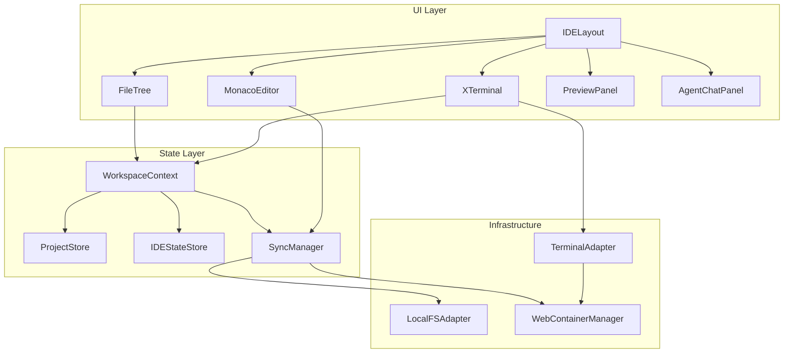

# Project Alpha - Component Inventory

> **Generated:** 2025-12-20 | **Scan Level:** Exhaustive

## IDE Components

### Core IDE Components (`src/components/ide/`)

| Component | File | Description |
|-----------|------|-------------|
| **XTerminal** | `XTerminal.tsx` | Terminal emulator using xterm.js, bridges to WebContainer jsh shell |
| **AgentChatPanel** | `AgentChatPanel.tsx` | AI agent conversation interface (future: full tool-calling support) |
| **SyncStatusIndicator** | `SyncStatusIndicator.tsx` | Displays file sync status (synced/syncing/error) |
| **FileTree** | `FileTree/` | File explorer with folder navigation, context menus |
| **MonacoEditor** | `MonacoEditor/` | Code editor wrapper with language detection, themes |
| **PreviewPanel** | `PreviewPanel/` | iframe-based preview of WebContainer dev server |

### Layout Components (`src/components/layout/`)

| Component | Description |
|-----------|-------------|
| **IDELayout** | Main IDE shell with resizable panels (react-resizable-panels) |
| **TerminalPanel** | Terminal container with tab interface |
| **SidePanel** | Left sidebar containing FileTree |
| **EditorPanel** | Central editor container |
| **Header** | Top navigation bar |

### UI Components (`src/components/ui/`)

Shared UI primitives for consistent styling across the application.

---

## Library Modules

### Filesystem Module (`src/lib/filesystem/`)

20 files - Handles all File System Access API operations.

| File | LOC | Purpose |
|------|-----|---------|
| `sync-manager.ts` | ~450 | Main sync orchestration, dual-write strategy |
| `local-fs-adapter.ts` | ~250 | FSA adapter implementation |
| `sync-executor.ts` | ~200 | Executes sync plans |
| `sync-planner.ts` | ~100 | Generates sync plans from directory diff |
| `sync-operations.ts` | ~200 | Individual sync operations |
| `sync-types.ts` | ~150 | Type definitions |
| `sync-utils.ts` | ~100 | Utility functions |
| `permission-lifecycle.ts` | ~150 | FSA permission grant/revoke/restore |
| `exclusion-config.ts` | ~150 | Sync exclusion patterns (.git, node_modules) |
| `path-guard.ts` | ~80 | Path validation and sanitization |
| `path-utils.ts` | ~100 | Path manipulation utilities |
| `directory-walker.ts` | ~80 | Recursive directory traversal |
| `fs-types.ts` | ~100 | FS type definitions |
| `fs-errors.ts` | ~100 | Custom error classes |
| `file-ops.ts` | ~180 | File read/write operations |
| `dir-ops.ts` | ~180 | Directory create/delete operations |
| `handle-utils.ts` | ~100 | FSA handle utilities |
| `index.ts` | ~50 | Public API exports |

### WebContainer Module (`src/lib/webcontainer/`)

5 files - Manages WebContainer lifecycle.

| File | LOC | Purpose |
|------|-----|---------|
| `manager.ts` | ~250 | Singleton container boot/mount |
| `terminal-adapter.ts` | ~280 | xterm.js ↔ jsh shell binding |
| `process-manager.ts` | ~300 | Process lifecycle tracking |
| `types.ts` | ~50 | Type definitions |
| `index.ts` | ~40 | Public API exports |

### Workspace Module (`src/lib/workspace/`)

11 files - Centralized state management.

| File | LOC | Purpose |
|------|-----|---------|
| `WorkspaceContext.tsx` | ~100 | React context provider |
| `project-store.ts` | ~350 | Project metadata (IndexedDB) |
| `ide-state-store.ts` | ~100 | UI state (open tabs, panels) |
| `conversation-store.ts` | ~120 | Chat history storage |
| `file-sync-status-store.ts` | ~80 | Per-file sync status |
| `workspace-types.ts` | ~100 | Type definitions |
| `index.ts` | ~50 | Public API exports |
| **hooks/** | | |
| ├ `useWorkspaceState.ts` | ~60 | State hook |
| ├ `useSyncOperations.ts` | ~80 | Sync action hooks |
| ├ `useEventBusEffects.ts` | ~60 | Event bus subscription |
| ├ `useInitialSync.ts` | ~70 | Initial project sync |
| └ `useWorkspaceActions.ts` | ~80 | Workspace action hooks |

### Events Module (`src/lib/events/`)

Event bus infrastructure for cross-component communication.

| Event Category | Events |
|----------------|--------|
| Sync | `sync:started`, `sync:completed`, `sync:error`, `sync:progress` |
| File | `file:created`, `file:modified`, `file:deleted` |
| Editor | `editor:open`, `editor:close`, `editor:save` |
| Terminal | `terminal:command`, `terminal:output` |

### Persistence Module (`src/lib/persistence/`)

IndexedDB operations for offline data storage.

| Store | Purpose |
|-------|---------|
| `projects` | Project metadata, FSA handles |
| `conversations` | Chat history |
| `ide-state` | UI preferences |

---

## Route Components (`src/routes/`)

| Route | File | Description |
|-------|------|-------------|
| `/` | `index.tsx` | Dashboard with recent projects |
| `/workspace/:projectId` | `workspace/$projectId.tsx` | IDE workspace |
| `/test-fs-adapter` | `test-fs-adapter.tsx` | FSA testing page |
| `/demo/*` | `demo/` | Demo routes |

---

## Component Dependencies

---

*Generated by BMAD Document Project Workflow v1.2.0*
