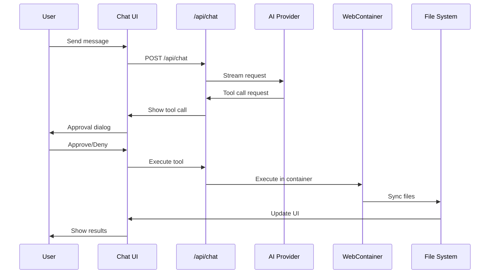

# User Journey Definition: AI Coding Agent in Via-gent IDE
**Date**: 2025-12-24
**Purpose**: Define the practical user journey for AI coding agent implementation

## User Persona

**Primary User**: Full-stack developer working on web applications
- Expertise: React, TypeScript, Node.js
- Environment: Browser-based development
- Goals: Faster coding, automated refactoring, intelligent debugging
- Constraints: Works within browser security model

## Core User Journey

### Phase 1: Setup & Onboarding (5 minutes)
```
User opens Via-gent IDE → Grant file permissions → Load project → Configure AI agent
```

**Key Actions**:
1. Open IDE in browser
2. Grant File System Access API permissions
3. Select/open project folder
4. Open Agent Configuration panel
5. Choose AI provider (OpenRouter/Anthropic)
6. Enter API key
7. Select model (e.g., mistralai/devstral-2512:free)
8. Save configuration

**Success Criteria**:
- Agent configuration persists across sessions
- Provider connection test passes
- User sees "Agent Ready" status

### Phase 2: Initial Interaction (2 minutes)
```
User opens chat panel → Sends first message → Sees streaming response
```

**Key Actions**:
1. Click Agent Chat panel to open
2. Type initial message: "Help me refactor this component"
3. Send message
4. See AI response streaming in real-time
5. AI asks clarifying questions about the component

**Success Criteria**:
- Message sends successfully
- Response streams without errors
- Rich text formatting works
- Code blocks are properly highlighted

### Phase 3: Tool Execution - File Operations (3 minutes)
```
AI requests to read file → User approves → AI reads file → AI suggests changes → User approves → AI writes file
```

**Key Actions**:
1. AI requests: "Can I read src/components/UserProfile.tsx?"
2. User sees approval dialog with file path
3. User clicks "Approve"
4. Tool execution log shows: "Reading file..."
5. AI analyzes code and suggests refactoring
6. AI requests: "Can I update this file with the refactored version?"
7. User sees diff preview in approval dialog
8. User clicks "Approve"
9. File is updated and syncs to WebContainer

**Success Criteria**:
- Approval dialogs show clear context
- Tool execution is logged in real-time
- File changes appear in Monaco editor
- File tree shows updated file status

### Phase 4: Tool Execution - Terminal Commands (2 minutes)
```
AI needs to test → Requests terminal command → User approves → Command executes → Results shown
```

**Key Actions**:
1. AI suggests: "Let's run the tests to verify the changes"
2. AI requests: "Can I run 'npm test -- --watchAll=false'?"
3. User sees approval dialog with command
4. User clicks "Approve"
5. Terminal panel shows command execution
6. Test results display in terminal
7. AI interprets results and suggests next steps

**Success Criteria**:
- Terminal commands execute in WebContainer
- Output is captured and displayed
- AI can interpret command results
- Error handling works for failed commands

### Phase 5: Iterative Development (Ongoing)
```
User and AI iterate through changes → Multiple tool executions → Real-time updates → Complete task
```

**Key Actions**:
1. AI suggests additional improvements
2. User provides feedback
3. Multiple read/write operations
4. Terminal commands for testing
5. Real-time file synchronization
6. Continuous conversation flow

**Success Criteria**:
- No page refreshes needed
- State persists across interactions
- All IDE panels stay synchronized
- User maintains control throughout

## Error Handling & Edge Cases

### Permission Errors
- Clear error messages when file access denied
- Guidance to re-grant permissions
- Fallback to read-only operations

### Network Issues
- Offline indicator when provider unreachable
- Queue messages when connection restored
- Auto-save conversation state

### Tool Failures
- Clear error messages for failed operations
- Retry options for transient failures
- Fallback suggestions when tools fail

### Context Limits
- Intelligent file prioritization
- Context window management
- Summarization for long conversations

## Technical Implementation Flow



## Success Metrics

### Primary Metrics
- Time from project load to first successful tool execution: < 10 minutes
- Approval response time: < 2 seconds
- File sync latency: < 1 second
- Chat message latency: < 500ms

### Secondary Metrics
- User retention: > 80% return within 24 hours
- Task completion rate: > 90% for simple refactoring tasks
- Error rate: < 5% for tool executions
- User satisfaction: > 4.5/5 rating

## Non-Functional Requirements

### Security
- API keys stored locally (never sent to server)
- File access limited to selected project
- Tool execution sandboxed in WebContainer
- No system command access

### Performance
- Streaming responses with < 100ms chunk latency
- File operations complete in < 2 seconds
- Terminal commands execute with < 1s startup time
- UI remains responsive during operations

### Reliability
- Graceful degradation when provider unavailable
- Auto-recovery from network interruptions
- State persistence across page refreshes
- Error recovery with clear guidance

## Future Enhancements (Post-MVP)

### Multi-Agent Support
- Specialized agents for different tasks
- Agent collaboration workflows
- Custom agent creation

### Advanced Features
- Code generation from templates
- Automated testing strategies
- Performance optimization suggestions
- Security vulnerability scanning

### Enterprise Features
- Team collaboration
- Project templates
- Custom provider integrations
- Advanced analytics

## Conclusion

This user journey focuses on the core value proposition: an AI coding assistant that helps developers write better code faster through natural conversation and safe tool execution. The journey emphasizes user control, transparency, and real-time feedback while working within browser constraints.

The implementation should prioritize the vertical slice from configuration through tool execution to ensure a working MVP before expanding to additional features.
