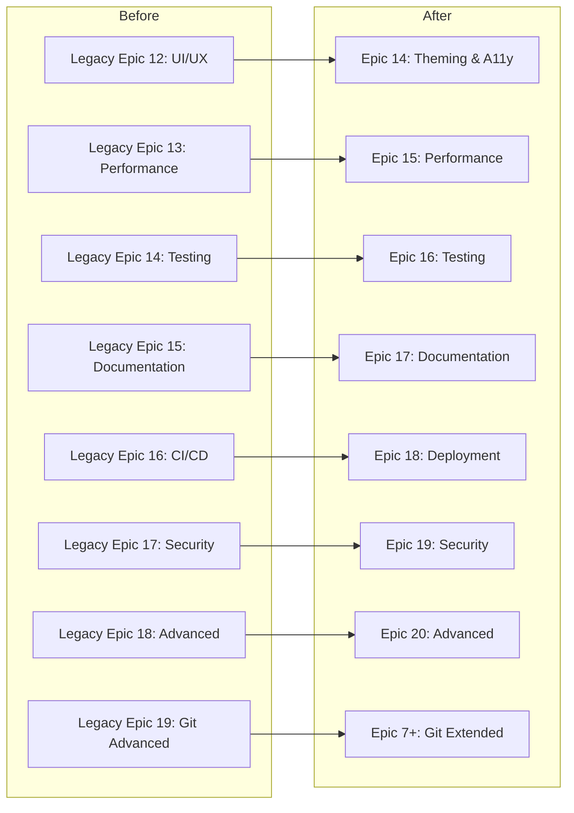

# Document Consolidation & Validation Walkthrough

> **Date:** 2025-12-20
> **Duration:** ~20 minutes
> **Confidence:** High

---

## Executive Summary

Successfully completed comprehensive document consolidation for Project Alpha, integrating Sprint Change Proposal v5 (Epic 13), migrating governance documents to `_bmad-output/`, and transforming legacy Epics 12-18 into project-specific epics for this 100% client-side, open-source AI-powered IDE.

---

## Completed Tasks

### ✅ Phase 1: Epic 13 Integration

| Item | Status | Details |
|------|--------|---------|
| Add Epic 13 to epic list | ✅ | Line 182 in [epics.md](file:///c:/Users/Admin/Documents/coding-project/project-alpha-master/project-alpha-master/_bmad-output/epics.md) |
| Add to status summary table | ✅ | P0 priority, Ready status |
| Add 5 stories with ACs | ✅ | Stories 13-1 to 13-5 |
| Add bug severity matrix | ✅ | BUG-01 to BUG-05 tracked |

**Files Modified:**
- [epics.md](file:///c:/Users/Admin/Documents/coding-project/project-alpha-master/project-alpha-master/_bmad-output/epics.md)

### ✅ Phase 2: Architecture Updates

| Item | Status | Details |
|------|--------|---------|
| Terminal Integration section | ✅ | SpawnOptions.cwd pattern |
| Sync Behavior section | ✅ | One-way sync design |
| Known Issues table | ✅ | BUG-01, BUG-02 |
| Course Correction v5 status | ✅ | Updates Applied table |

**Files Modified:**
- [architecture.md](file:///c:/Users/Admin/Documents/coding-project/project-alpha-master/project-alpha-master/_bmad-output/architecture.md)

### ✅ Phase 3: Document Migration

| Source | Destination | Status |
|--------|-------------|--------|
| [docs/legacy-unfiltered/architecture.md](file:///c:/Users/Admin/Documents/coding-project/project-alpha-master/project-alpha-master/docs/legacy-unfiltered/architecture.md) | [_bmad-output/architecture.md](file:///c:/Users/Admin/Documents/coding-project/project-alpha-master/project-alpha-master/_bmad-output/architecture.md) | ✅ |
| [docs/legacy-unfiltered/epics.md](file:///c:/Users/Admin/Documents/coding-project/project-alpha-master/project-alpha-master/docs/legacy-unfiltered/epics.md) | [_bmad-output/epics.md](file:///c:/Users/Admin/Documents/coding-project/project-alpha-master/project-alpha-master/_bmad-output/epics.md) | ✅ |
| `docs/legacy-unfiltered/prd-*.md` | [_bmad-output/prd.md](file:///c:/Users/Admin/Documents/coding-project/project-alpha-master/project-alpha-master/_bmad-output/prd.md) | ✅ |
| [docs/legacy-unfiltered/ux-design-specification.md](file:///c:/Users/Admin/Documents/coding-project/project-alpha-master/project-alpha-master/docs/legacy-unfiltered/ux-design-specification.md) | [_bmad-output/ux-design.md](file:///c:/Users/Admin/Documents/coding-project/project-alpha-master/project-alpha-master/_bmad-output/ux-design.md) | ✅ |

**Files Modified:**
- [index.md](file:///c:/Users/Admin/Documents/coding-project/project-alpha-master/project-alpha-master/_bmad-output/index.md) - Updated references
- [bmm-workflow-status.yaml](file:///c:/Users/Admin/Documents/coding-project/project-alpha-master/project-alpha-master/_bmad-output/bmm-workflow-status.yaml) - Updated paths and status

### ✅ Phase 4: Legacy Epic Transformation

Transformed 8 legacy epics (12-19) into 7 new project-specific epics:

| Legacy | New | Name | Stories |
|--------|-----|------|---------|
| Epic 12 | Epic 14 | IDE Theming & Accessibility | 5 |
| Epic 13 | Epic 15 | Performance & Optimization | 5 |
| Epic 14 | Epic 16 | Test Framework & Quality Gates | 5 |
| Epic 15 | Epic 17 | Open-Source Documentation | 5 |
| Epic 16 | Epic 18 | Static Deployment & PWA | 5 |
| Epic 17 | Epic 19 | Client-Side Security | 5 |
| Epic 18 | Epic 20 | Advanced IDE Features | 5 |
| Epic 19 | Epic 7+ | Git Integration Extended | 4 |
| Epic 20 | REMOVED | Database Integration (N/A) | - |

**Total New Stories:** 39 + 5 (Epic 13) = 44 stories

---

## Key Changes Summary

### Epic Status Update



### Document Migration Map

```
_bmad-output/
├── architecture.md      ← docs/legacy-unfiltered/architecture.md
├── epics.md            ← docs/legacy-unfiltered/epics.md
├── prd.md              ← docs/legacy-unfiltered/prd-via-gent-*.md
├── ux-design.md        ← docs/legacy-unfiltered/ux-design-specification.md
├── bmm-workflow-status.yaml  (Updated with new paths)
└── index.md            (Updated with new references)
```

---

## Verification Results

### Document Validation

| Document | Status | Notes |
|----------|--------|-------|
| [epics.md](file:///c:/Users/Admin/Documents/coding-project/project-alpha-master/project-alpha-master/_bmad-output/epics.md) | ✅ VALID | Epic 13 added, Epics 14-20 transformed |
| [architecture.md](file:///c:/Users/Admin/Documents/coding-project/project-alpha-master/project-alpha-master/docs/legacy-unfiltered/architecture.md) | ✅ VALID | Terminal Integration section added |
| `prd.md` | ✅ VALID | No changes needed |
| `ux-design.md` | ✅ VALID | No changes needed |
| [bmm-workflow-status.yaml](file:///c:/Users/Admin/Documents/coding-project/project-alpha-master/project-alpha-master/_bmad-output/bmm-workflow-status.yaml) | ✅ VALID | All paths updated, Epic 13 APPROVED |

### Epic Count Verification

| Category | Count |
|----------|-------|
| Foundation Epics (1-5) | 5 ✅ Done |
| Core Epics (6-13) | 8 (13 = P0 Ready) |
| Transformed Epics (14-20, 7+) | 8 (44 stories) |
| **Total Epics** | **20+** |

---

## Files Changed Summary

````carousel
### Primary Governance Documents

```diff:epics.md
---
stepsCompleted: [1]
inputDocuments:
  - docs/prd-via-gent-foundational-architectural-slice-2025-12-10.md
  - docs/architecture.md
  - docs/ux-design-specification.md
  - docs/analysis/product-brief-via-gent-2025-12-10-architectural-slice.md
  - docs/analysis/research/technical-via-gent-foundational-architectural-slice-spike-research-2025-12-10.md
workflowType: 'epics-stories'
lastStep: 1
project_name: 'via-gent'
user_name: 'Apple'
date: '2025-12-10'
starterTemplate: 'TanStack Start (SPA Mode)'
---

# Via-Gent Project Alpha - Epic Breakdown

## Overview

This document provides the complete epic and story breakdown for Via-Gent's **Foundational Architectural Slice (Project Alpha)**, decomposing the requirements from the PRD, Architecture, and UX Design into implementable stories.

**Implementation Root (Non-Negotiable):** All Project Alpha Epic 3/4 implementation work must be made under `spikes/project-alpha/` (e.g. `spikes/project-alpha/src/...`). The repository root `src/` is a separate codebase and must not be used to fulfill Project Alpha Epic 3/4 stories.

**Project Goal:** Prove or falsify the viability of a fully client-side, AI-powered IDE that can execute tools, write files to WebContainers, sync to local disk via File System Access API, commit via isomorphic-git, and persist state to IndexedDB.

---

## Requirements Inventory

### Functional Requirements

#### FR-IDE: IDE Shell (6 Requirements)
- **FR-IDE-01:** TanStack Start SPA with file-based routing - Routes: `/`, `/workspace/:projectId`
- **FR-IDE-02:** IDE layout with resizable panels - FileTree, Editor, Terminal, Preview, Chat
- **FR-IDE-03:** Monaco editor integration - Syntax highlighting, auto-save, multiple tabs
- **FR-IDE-04:** xterm.js terminal bound to WebContainers - Interactive shell, command history
- **FR-IDE-05:** Live preview iframe for dev server - Hot-reload, device frame options
- **FR-IDE-06:** Agent chat panel - Streaming responses, tool execution badges

#### FR-WC: WebContainers Integration (6 Requirements)
- **FR-WC-01:** Boot WebContainers on workspace open - `WebContainer.boot()` succeeds
- **FR-WC-02:** Mount project files from FileTree - 100+ files mounted without error
- **FR-WC-03:** Spawn interactive shell - `jsh` responsive to user input
- **FR-WC-04:** Run npm commands - `npm install`, `npm run dev` work correctly
- **FR-WC-05:** Stream stdout/stderr to terminal - Real-time output display
- **FR-WC-06:** Track process lifecycle - Exit codes surfaced to UI

#### FR-FS: File System Access Integration (6 Requirements)
- **FR-FS-01:** Request directory access via `showDirectoryPicker()` - Permission granted and handle stored
- **FR-FS-02:** Read all files from local directory - Complete file tree retrieved
- **FR-FS-03:** Write files back to local directory - Changes persist to disk
- **FR-FS-04:** Create/delete/rename files and folders - All CRUD operations work
- **FR-FS-05:** Permission persistence via handle storage - Handles survive page reload
- **FR-FS-06:** Fallback mode for denied permissions - Virtual FS only if access denied (P1)

#### FR-SYNC: Dual Sync Layer (4 Requirements)
- **FR-SYNC-01:** Initial sync: Local FS → WebContainers - Full tree mounted on project open
- **FR-SYNC-02:** Editor save: dual write to disk + WebContainers - Both systems updated on save
- **FR-SYNC-03:** Exclusion rules for `node_modules`, `.git` - Heavy directories not synced to disk
- **FR-SYNC-04:** Debounced sync (2s) to prevent storms - Rapid changes don't cause loops (P1)

#### FR-GIT: Git Integration (6 Requirements)
- **FR-GIT-01:** `fs` adapter for isomorphic-git over FSA - Git operations use local folder
- **FR-GIT-02:** Git status display - Show modified/staged/untracked
- **FR-GIT-03:** Git add/remove operations - Stage/unstage files
- **FR-GIT-04:** Git commit with message - Commit created in local `.git`
- **FR-GIT-05:** Git push to GitHub - Changes uploaded to remote (P1)
- **FR-GIT-06:** Git pull from GitHub - Changes downloaded to local (P1)

#### FR-PERSIST: Persistence Layer (6 Requirements)
- **FR-PERSIST-01:** Conversation history per project - Messages survive page reload
- **FR-PERSIST-02:** Tool execution history - Tool results logged and retrievable
- **FR-PERSIST-03:** IDE layout state - Panel sizes, open tabs restored
- **FR-PERSIST-04:** Project metadata (recent projects) - Dashboard shows recent projects
- **FR-PERSIST-05:** FSA handle storage in IndexedDB - Handles serialized and restored
- **FR-PERSIST-06:** Schema versioning for migrations - Data survives schema changes (P1)

#### FR-AGENT: AI Agent Layer (7 Requirements)
- **FR-AGENT-01:** TanStack AI `useChat` integration - Streaming chat functional
- **FR-AGENT-02:** Client-side tools via `clientTools()` - Tools execute in browser
- **FR-AGENT-03:** File tools: read, write, list, create, delete - All operations work
- **FR-AGENT-04:** Terminal tool: `run_command` - Commands execute in WebContainers
- **FR-AGENT-05:** Git tools: status, add, commit - Git operations via agent (P1)
- **FR-AGENT-06:** Tool → UI sync - Tool writes file → editor updates
- **FR-AGENT-07:** Gemini adapter with BYOK - User provides own API key

---

### Non-Functional Requirements

#### NFR-PERF: Performance (6 Requirements)
- **NFR-PERF-01:** WebContainer boot time < 5s
- **NFR-PERF-02:** File mount (100 files) < 3s
- **NFR-PERF-03:** Dev server start < 30s
- **NFR-PERF-04:** Agent first token (TTFT) < 2s
- **NFR-PERF-05:** Preview hot-reload < 2s
- **NFR-PERF-06:** File save to disk < 500ms

#### NFR-REL: Reliability (4 Requirements)
- **NFR-REL-01:** File sync reliability 99%+
- **NFR-REL-02:** State restoration 99%+
- **NFR-REL-03:** WebContainer stability - No crash per session
- **NFR-REL-04:** No data corruption - 0 incidents

#### NFR-USE: Usability (4 Requirements)
- **NFR-USE-01:** Time to first project < 2 min
- **NFR-USE-02:** Onboarding completion > 70%
- **NFR-USE-03:** Error recovery path < 10s to understand
- **NFR-USE-04:** Keyboard accessibility - Full

#### NFR-SEC: Security (4 Requirements)
- **NFR-SEC-01:** No server data transmission - 100%
- **NFR-SEC-02:** API keys client-only - User controls keys
- **NFR-SEC-03:** FSA scoped to user-approved dirs - Per session
- **NFR-SEC-04:** WebContainers sandboxed - Per browser spec

#### NFR-COMPAT: Compatibility (4 Requirements)
- **NFR-COMPAT-01:** Chrome 86+ - Full support
- **NFR-COMPAT-02:** Edge 86+ - Full support
- **NFR-COMPAT-03:** Safari 15.2+ - FSA support
- **NFR-COMPAT-04:** Firefox 115+ - IndexedDB fallback

---

### Additional Requirements

#### From Architecture Document
- **ARCH-STARTER:** Project initialized using TanStack Start with SPA mode: `npx -y create-tanstack-start@latest ./ --template default --package-manager pnpm`
- **ARCH-SSR:** IDE routes must use `ssr: false` for WebContainers compatibility
- **ARCH-HEADERS:** Deployment requires `Cross-Origin-Opener-Policy: same-origin` and `Cross-Origin-Embedder-Policy: require-corp` headers
- **ARCH-STRUCTURE:** Project follows layered architecture: UI → Store → Domain → Adapter → Browser/System
- **ARCH-NAMING:** Consistent naming conventions per Architecture patterns section
- **ARCH-STATE:** TanStack Store + TanStack Query for state management

#### From UX Design Specification
- **UX-DESIGN:** Shadcn/ui component library with dark theme default
- **UX-TYPOGRAPHY:** Inter for UI, JetBrains Mono for code
- **UX-LAYOUT:** Resizable panels with min 1024px viewport requirement
- **UX-A11Y:** WCAG AA compliance, keyboard accessibility required
- **UX-FEEDBACK:** All actions produce visible response within 2 seconds
- **UX-COMPONENTS:** Custom components needed: FileTree, Terminal, AgentChat, PreviewPanel, DiffViewer

#### From Technical Research
- **TECH-FSA-ADAPTER:** Custom `fs.promises` adapter required for isomorphic-git over File System Access API
- **TECH-SYNC-STRATEGY:** Local FS as source of truth; WebContainers mirrors it
- **TECH-EXCLUSIONS:** Do not sync `node_modules`, `.git` to local disk from WebContainers
- **TECH-CLIENT-TOOLS:** AI tools must be client-side via `toolDefinition().client()` pattern

---

### FR Coverage Map

| Epic | Requirements Covered | Priority |
|------|---------------------|----------|
| Epic 1: Project Foundation | ARCH-STARTER, FR-IDE-01, FR-IDE-02 | P0 |
| Epic 2: WebContainers Integration | FR-WC-01 to FR-WC-06, FR-IDE-04 | P0 |
| Epic 3: File System Access | FR-FS-01 to FR-FS-05, FR-SYNC-01 to FR-SYNC-03 | P0 |
| Epic 4: IDE Components | FR-IDE-03, FR-IDE-05, FR-IDE-06, UX-COMPONENTS | P0 |
| Epic 5: Persistence Layer | FR-PERSIST-01 to FR-PERSIST-05 | P0 |
| Epic 6: AI Agent Integration | FR-AGENT-01 to FR-AGENT-04, FR-AGENT-06, FR-AGENT-07 | P0 |
| Epic 7: Git Integration | FR-GIT-01 to FR-GIT-04 | P0 |
| Epic 8: Polish & Validation | NFR-PERF-*, NFR-REL-*, 14-step validation | P0 |

---

## Epic List

1. **Epic 1: Project Foundation & IDE Shell** - Initialize TanStack Start project with routing and layout structure ✅
2. **Epic 2: WebContainers Integration** - Boot and manage WebContainers with terminal integration ✅
3. **Epic 3: File System Access Layer** - Local folder access, file operations, and sync to WebContainers ✅
4. **Epic 4: IDE Components** - Monaco editor, preview panel, and chat panel integration ✅
5. **Epic 5: Persistence Layer** - IndexedDB storage for projects, conversations, and state ✅
6. **Epic 10: Event Bus Architecture** - Transform sync layer to event-driven for AI observability *(NEW - Course Correction v3)*
7. **Epic 12: AI Tool Interface Layer** - Facades exposing subsystems to AI agents *(NEW - Course Correction v3)*
8. **Epic 6: AI Agent Integration** - TanStack AI with client-side tools for file and terminal operations
9. **Epic 7: Git Integration** - isomorphic-git with FSA adapter for local Git operations
10. **Epic 11: Code Splitting & Module Refactor** - Reduce file complexity (parallel track) *(NEW - Course Correction v3)*
11. **Epic 4.5: Project Fugu Enhancements** - Enhanced permissions, file watcher, clipboard, badges
12. **Epic 8: Validation & Polish** - End-to-end testing, performance validation, and UX polish
13. **Epic 9: Multi-Root Workspaces** - VS Code-style multi-root workspace support *(POST-MVP)*
14. **Epic 13: Terminal & Sync Stability** - Critical bug fixes for terminal CWD, auto-sync, and UX *(NEW - Course Correction v5)*

### Epic Status Summary (Updated 2025-12-20)

| Epic | Status | Stories | Tests | Priority | Notes |
|------|--------|---------|-------|----------|-------|
| Epic 1 | ✅ Done | 5/5 | - | - | Foundation |
| Epic 2 | ✅ Done | 4/4 | - | - | WebContainers |
| Epic 3 | ✅ Done | 8/8 | 60 | - | File System (4 hotfix) |
| Epic 4 | ✅ Done | 6/6 | 66 | P0 | IDE Components |
| Epic 5 | ✅ Done | 4/4 | - | P0 | Persistence |
| Epic 10 | ⏳ Backlog | 0/5 | - | **P1** | Event Bus (Course Correction v3) |
| Epic 12 | ⏳ Backlog | 0/5 | - | **P1** | AI Tool Facades |
| Epic 6 | ⏳ Backlog | 0/5 | - | P1 | AI Agent Integration |
| Epic 7 | ⏳ Backlog | 0/4 | - | P2 | Git Integration |
| Epic 11 | ⏳ Backlog | 0/7 | - | P2 | Code Splitting (parallel) |
| Epic 4.5 | ⏳ Backlog | 0/6 | - | P3 | Project Fugu |
| Epic 8 | ⏳ Backlog | 0/8 | - | P3 | Validation & Polish |
| Epic 9 | ⏳ Backlog | 0/7 | - | P4 | Multi-Root (post-MVP) |
| **Epic 13** | **⏳ Ready** | **0/5** | - | **P0** | **Terminal/Sync Bugs (v5)** |

### Recommended Implementation Order (CHAM Audit 2025-12-13)

```
Phase 1: Foundation      → Epic 4 (complete), Epic 5 (complete)
Phase 2: AI Enablement   → Epic 10 (Event Bus) → Epic 12 (AI Facades) → Epic 6 (AI Agent)
Phase 3: Full Workflow   → Epic 7 (Git)
Phase 4: Optimization    → Epic 11 (Code Splitting) - can run parallel
Phase 5: Enhancements    → Epic 4.5, 8, 9
```

**Rationale:** Event Bus (Epic 10) must come before AI Agent (Epic 6) because AI agents need to observe file/sync/terminal events. AI Tool Facades (Epic 12) abstracts subsystems for AI consumption.


---

## Epic 1: Project Foundation & IDE Shell

**Goal:** Establish the foundational TanStack Start SPA with file-based routing and the core IDE layout structure with resizable panels.

**Requirements Covered:** ARCH-STARTER, FR-IDE-01, FR-IDE-02, ARCH-SSR, ARCH-STRUCTURE, UX-LAYOUT

### Story 1.1: Initialize TanStack Start Project

As a **developer**,
I want **the project initialized with TanStack Start using the default template**,
So that **I have a working foundation with file-based routing and Vite bundling**.

**Acceptance Criteria:**

**Given** no existing project structure
**When** I run `npx -y create-tanstack-start@latest ./ --template default --package-manager pnpm`
**Then** the project scaffolds successfully with TanStack Start 1.140.0+
**And** `pnpm dev` starts the development server
**And** TypeScript strict mode is enabled

---

### Story 1.2: Configure Core Dependencies

As a **developer**,
I want **all core dependencies installed and configured**,
So that **the project has access to WebContainers, Monaco, xterm, and other required libraries**.

**Acceptance Criteria:**

**Given** an initialized TanStack Start project
**When** I add dependencies via pnpm
**Then** the following packages are installed:
  - `@webcontainer/api`
  - `@monaco-editor/react` + `monaco-editor`
  - `xterm` + `xterm-addon-fit`
  - `isomorphic-git`
  - `idb`
  - `@tanstack/store`
  - `@tanstack/ai` + `@tanstack/ai-react` + `@tanstack/ai-gemini`
  - `zod` 4.x
**And** TypeScript compiles without errors

---

### Story 1.3: Create Route Structure

As a **developer**,
I want **the basic route structure established**,
So that **navigation between dashboard and workspace is functional**.

**Acceptance Criteria:**

**Given** the TanStack Start project with routing
**When** I create routes at `src/routes/`
**Then** the following routes exist:
  - `index.tsx` → Dashboard route (`/`)
  - `workspace/$projectId.tsx` → IDE workspace (`/workspace/:projectId`)
**And** the workspace route has `ssr: false` configured
**And** navigation between routes works correctly

---

### Story 1.4: Implement IDE Layout Shell

As a **developer**,
I want **the resizable panel layout structure for the IDE**,
So that **all major panels (FileTree, Editor, Terminal, Preview, Chat) have their positions**.

**Acceptance Criteria:**

**Given** the workspace route
**When** I navigate to `/workspace/:projectId`
**Then** I see a layout with resizable panels:
  - Left sidebar (240px default, resizable): FileTree placeholder
  - Center main area: Editor tabs + Monaco placeholder
  - Right panel (40% width, resizable): Preview panel placeholder
  - Bottom panel (200px, resizable): Terminal placeholder
  - Right sidebar (collapsible): Chat panel placeholder
**And** panels can be resized by dragging dividers
**And** minimum viewport width of 1024px is enforced

---

### Story 1.5: Configure COOP/COEP Headers

As a **developer**,
I want **proper COOP/COEP headers configured for WebContainers**,
So that **SharedArrayBuffer is available for WebContainers to function**.

**Acceptance Criteria:**

**Given** the Vite configuration
**When** I configure the dev server and production build
**Then** the following headers are set:
  - `Cross-Origin-Opener-Policy: same-origin`
  - `Cross-Origin-Embedder-Policy: require-corp`
**And** WebContainers can boot successfully in the browser

---

## Epic 2: WebContainers Integration

**Goal:** Integrate WebContainers for running Node.js in the browser with terminal access and process management.

**Requirements Covered:** FR-WC-01 to FR-WC-06, FR-IDE-04, NFR-PERF-01

### Story 2.1: Create WebContainers Manager

As a **developer**,
I want **a WebContainers manager module**,
So that **I can boot, mount, and manage WebContainers instances**.

**Acceptance Criteria:**

**Given** the `src/lib/webcontainer/` directory
**When** I implement the manager module
**Then** the module provides:
  - `boot()` → boots WebContainer instance
  - `mount(files)` → mounts virtual file tree
  - `getFileSystem()` → returns fs operations
  - `spawn(cmd, args)` → spawns processes
**And** boot completes within 5 seconds
**And** boot errors are clearly surfaced

---

### Story 2.2: Implement Terminal Adapter

As a **developer**,
I want **an xterm.js terminal bound to WebContainers shell**,
So that **users can interact with the WebContainers environment**.

**Acceptance Criteria:**

**Given** a booted WebContainer
**When** I spawn `jsh` shell
**Then** terminal input is streamed to shell stdin
**And** shell stdout/stderr streams to terminal output
**And** terminal resize events are handled correctly
**And** command history works via up/down arrows

---

### Story 2.3: Create XTerminal Component

As a **developer**,
I want **an xterm.js React component**,
So that **I can embed the terminal in the IDE layout**.

**Acceptance Criteria:**

**Given** the terminal adapter
**When** I render the XTerminal component
**Then** the terminal renders with proper styling
**And** the terminal uses the fit addon for responsive sizing
**And** the terminal cleans up on unmount
**And** multiple terminal tabs are supported

---

### Story 2.4: Implement Process Management

As a **developer**,
I want **process lifecycle tracking for WebContainers**,
So that **I can run npm commands and track their status**.

**Acceptance Criteria:**

**Given** a booted WebContainer with shell
**When** I run `npm install`
**Then** the command executes in WebContainers
**And** stdout/stderr streams to terminal in real-time
**And** exit code is captured when process completes
**And** I can run `npm run dev` after install

---

## Epic 3: File System Access Layer

**Goal:** Implement local folder access via File System Access API with bidirectional sync to WebContainers.

**Requirements Covered:** FR-FS-01 to FR-FS-05, FR-SYNC-01 to FR-SYNC-03, TECH-FSA-ADAPTER, TECH-SYNC-STRATEGY

### Story 3.1: Implement Local FS Adapter

As a **developer**,
I want **a File System Access API wrapper module**,
So that **I can request and manage access to local folders**.

**Acceptance Criteria:**

**Given** the `src/lib/filesystem/` directory
**When** I implement the local-fs-adapter
**Then** the module provides:
  - `requestDirectoryAccess()` → `showDirectoryPicker()` wrapper
  - `readFile(path)` → reads file content as string
  - `writeFile(path, content)` → writes content to file
  - `listDirectory(path)` → lists directory contents
  - `createFile/createDirectory/deleteFile/deleteDirectory/rename`
**And** permission errors are gracefully handled

---

### Story 3.2: Implement FileTree Component

As a **developer**,
I want **a file tree component that displays project structure**,
So that **users can navigate and manage project files**.

**Acceptance Criteria:**

**Given** a directory handle from FSA
**When** I render the FileTree component
**Then** all files and folders are displayed hierarchically
**And** folders can be expanded/collapsed
**And** files show appropriate icons by extension
**And** right-click shows context menu (create, rename, delete)
**And** keyboard navigation works (arrows, Enter)

---

### Story 3.3: Implement Sync Manager

As a **developer**,
I want **a sync manager that keeps Local FS and WebContainers in sync**,
So that **file changes are reflected in both systems**.

**Acceptance Criteria:**

**Given** both FSA handle and WebContainers instance
**When** project opens
**Then** all files sync from local FS → WebContainers
**And** `.git` and `node_modules` are excluded from sync to disk
**When** a file is saved in Monaco
**Then** file writes to both local FS and WebContainers
**And** sync completes within 500ms for individual files
**And** sync errors surface to the user

---

### Story 3.4: Handle Directory Permission Lifecycle

As a **developer**,
I want **FSA handles persisted and permission re-checks on reload**,
So that **users don't lose access between sessions**.

**Acceptance Criteria:**

**Given** a granted directory handle
**When** page reloads
**Then** handle is restored from IndexedDB
**And** `queryPermission()` is called to check status
**And** if permission is `prompt`, user is asked to re-grant
**And** if permission is `denied`, fallback to virtual FS is offered

---

## Epic 3: File System Access Layer - REOPENED

**Status:** REOPENED (2025-12-12) - Course Correction Required  
**Stories:** 8/8 (4 original + 4 hotfix)  
**Tests:** 60 passing  
**Change Proposal:** [docs/sprint-artifacts/sprint-change-proposal-2025-12-12.md](docs/sprint-artifacts/sprint-change-proposal-2025-12-12.md)

### Original Deliverables (Complete)

| Story | Component | Status |
|-------|-----------|--------|
| 3-1 | LocalFSAdapter | ✅ 42 tests |
| 3-2 | FileTree Component | ✅ Complete |
| 3-3 | SyncManager | ✅ 5 tests |
| 3-4 | Permission Lifecycle | ✅ 5 tests |

### Hotfix Stories (Course Correction 2025-12-12)

> **Root Cause:** Original stories focused on feature completion without adequate UX integration. See [Sprint Change Proposal](docs/sprint-artifacts/sprint-change-proposal-2025-12-12.md) for detailed analysis.

---

### Story 3.5: Implement Folder Switching *(HOTFIX)*

As a **user**,
I want **to switch to a different project folder without closing the app**,
So that **I can work on multiple projects in one session**.

**Priority:** P0  
**Blocked By:** Story 3-7 (ProjectStore)

**Acceptance Criteria:**

- **AC-3-5-1:** Given user is in workspace with folder open, when user clicks "Open Different Folder" button (distinct from sync), then directory picker dialog appears (NOT re-sync of current folder)
- **AC-3-5-2:** Given user selects different folder in picker, when selection confirmed, then:
  - Old handle is released (cleared from state, not revoked)
  - New handle stored in IndexedDB keyed by new projectId
  - FileTree refreshes with new folder contents
  - WebContainer receives new mount (not cumulative)
- **AC-3-5-3:** Given user cancels directory picker, when dialog closes, then current folder remains active (no state change)
- **AC-3-5-4:** Given user is in workspace with no folder open, when clicking "Open Folder", then directory picker appears normally

**Implementation Tasks:**
- [ ] T1: Add explicit "Open Different Folder" button to header
- [ ] T2: Modify `handleOpenFolder` to always show picker when called from new button
- [ ] T3: Clear WebContainer mount before new mount
- [ ] T4: Update `permission-lifecycle.ts` to support multi-workspace keys
- [ ] T5: Write integration tests for folder switch flow

---

### Story 3.6: Implement Sync Status UI *(HOTFIX)*

As a **user**,
I want **to see the current sync status and trigger manual sync**,
So that **I know when my files are saved and can force sync if needed**.

**Priority:** P0  
**Blocked By:** Story 3-8 (WorkspaceContext)

**Acceptance Criteria:**

- **AC-3-6-1:** Given sync is in progress, when viewing FileTree header, then animated sync indicator shows with file count (e.g., "Syncing 45/120 files...")
- **AC-3-6-2:** Given sync is idle, when viewing FileTree header, then static checkmark shows with last sync time
- **AC-3-6-3:** Given sync has errors, when viewing FileTree header, then warning icon shows with error count, clickable to show details
- **AC-3-6-4:** Given user wants to trigger manual sync, when clicking sync button, then full re-sync from LocalFS to WebContainer occurs
- **AC-3-6-5:** Sync status persists across component remounts (stored in WorkspaceContext)

**Implementation Tasks:**
- [ ] T1: Create `SyncStatusIndicator` component with states: idle/syncing/error
- [ ] T2: Add `syncStatus$` observable to SyncManager using EventEmitter
- [ ] T3: Wire SyncStatusIndicator to SyncManager via WorkspaceContext
- [ ] T4: Add "Sync Now" button
- [ ] T5: Store last sync timestamp in IndexedDB
- [ ] T6: Write unit tests for all sync states

---

### Story 3.7: Implement Project Metadata Persistence *(HOTFIX - PRIORITIZED)*

As a **user**,
I want **my recent projects remembered with their access status**,
So that **I can quickly resume work from the dashboard**.

**Priority:** P0 (Must implement first - blocks 3-5, 3-8, 4-0-2)

**Acceptance Criteria:**

- **AC-3-7-1:** Given user opens folder, when folder is synced, then project metadata stored in IndexedDB:
  ```typescript
  interface ProjectMetadata {
    id: string;                              // UUID or derived
    name: string;                            // Folder name
    folderPath: string;                      // Display path
    fsaHandle: FileSystemDirectoryHandle;   // Stored handle
    lastOpened: Date;
    layoutState?: LayoutConfig;             // Future: panel sizes
  }
  ```
- **AC-3-7-2:** Given user visits dashboard, when page loads, then real recent projects load from IndexedDB (not mock)
- **AC-3-7-3:** Given project handle has expired permission, when shown in dashboard, then visual indicator shows "needs re-authorization"
- **AC-3-7-4:** Given user clicks expired project, when clicked, then permission prompt appears
- **AC-3-7-5:** Given user wants to remove project from recents, when clicking remove, then project deleted from IndexedDB

**Implementation Tasks:**
- [ ] T1: Create `src/lib/workspace/project-store.ts` with IndexedDB schema
- [ ] T2: Create CRUD: `saveProject`, `getProject`, `listProjects`, `deleteProject`
- [ ] T3: Add `checkHandlePermission` helper
- [ ] T4: Migrate Dashboard to use `listProjects()`
- [ ] T5: Add permission status indicator to project cards
- [ ] T6: Write integration tests

---

### Story 3.8: Implement Workspace Context *(HOTFIX - ARCHITECTURE)*

As a **developer**,
I want **a centralized WorkspaceContext for IDE-wide state**,
So that **all components access sync status and folder state without prop drilling**.

**Priority:** P0  
**Blocked By:** Story 3-7 (ProjectStore)

**Acceptance Criteria:**

- **AC-3-8-1:** WorkspaceContext provides:
  ```typescript
  interface WorkspaceState {
    projectId: string | null;
    projectMetadata: ProjectMetadata | null;
    directoryHandle: FileSystemDirectoryHandle | null;
    permissionState: FsaPermissionState;
    syncStatus: 'idle' | 'syncing' | 'error';
    syncProgress: SyncProgress | null;
    lastSyncTime: Date | null;
    syncError: string | null;
  }
  
  interface WorkspaceActions {
    openFolder(): Promise<void>;
    switchFolder(): Promise<void>;
    syncNow(): Promise<void>;
    closeProject(): void;
  }
  ```
- **AC-3-8-2:** IDELayout refactored to consume WorkspaceContext instead of local useState
- **AC-3-8-3:** FileTree receives only `onFileSelect` prop, gets handle from context
- **AC-3-8-4:** Header components get sync status from context
- **AC-3-8-5:** Context provider wraps workspace route, not entire app

**Implementation Tasks:**
- [ ] T1: Create `src/lib/workspace/WorkspaceContext.tsx`
- [ ] T2: Implement `WorkspaceProvider` with all state and actions
- [ ] T3: Refactor `IDELayout` to use context
- [ ] T4: Refactor `FileTree` to use context for handle
- [ ] T5: Add `useWorkspace()` hook
- [ ] T6: Write unit tests for state transitions

---

### Implementation Order

```
3-7 (ProjectStore)     ← Foundation
      ↓
3-8 (WorkspaceContext) ← Architecture
      ↓
3-5 (Folder Switching) ← Uses both
      ↓
3-6 (Sync Status UI)   ← Uses Context
```

### Integration Points for Epic 4

- **Monaco Editor**: Use `SyncManager.writeFile()` for save operations
- **FileTree → Editor**: Wire `onFileSelect` callback to open files
- **Save Flow**: `Monaco → SyncManager → LocalFS + WebContainer`

---

## Epic 4: IDE Components

**Goal:** Implement Monaco editor, preview panel, and foundational chat panel UI.

**Requirements Covered:** FR-IDE-03, FR-IDE-05, FR-IDE-06, UX-COMPONENTS, UX-DESIGN

**Dependencies:** Epic 3 (SyncManager, FileTree) ✅

### Story 4.0.2: Wire Dashboard to ProjectStore *(Course Correction v3)*

As a **returning developer**,  
I want **the dashboard to list and open recent projects backed by ProjectStore with sync-aware status**,  
So that **I can reopen workspaces confidently with FSA + WebContainer parity**.

**Acceptance Criteria (summary):**
- Dashboard lists recent projects with name, last opened, and source (FSA handle vs WebContainer snapshot).
- Open action bootstraps WorkspaceContext + SyncManager before navigation; FileTree/Editor hydrate selected project.
- Stale FSA handles trigger restore prompt with fallback to virtual FS.
- SyncStatus indicator shows idle/syncing/error consistently in dashboard + header during open.
- Emit `dashboard:loaded` hook with project and stale-handle counts for tests/analytics.

**Tasks (summary):** Load ProjectStore recents; wire open flow to WorkspaceContext/SyncManager; permission restore UX; sync status propagation; instrumentation hook; tests.

### Story 4.1: Implement Monaco Editor Component

As a **developer**,
I want **a Monaco editor component integrated with the IDE**,
So that **users can edit code with syntax highlighting and IntelliSense**.

**Acceptance Criteria:**

**Given** the IDE layout
**When** I click a file in the FileTree
**Then** the file opens in Monaco editor
**And** syntax highlighting works for TypeScript/JavaScript/CSS/HTML
**And** auto-save triggers after 2 seconds of inactivity
**And** multiple files can be open as tabs
**And** unsaved changes show indicator

---

### Story 4.2: Wire Editor to Sync Manager

As a **developer**,
I want **editor saves to write to both FS systems**,
So that **changes persist immediately to disk and WebContainers**.

**Acceptance Criteria:**

**Given** a file open in Monaco
**When** I edit and save (Cmd+S or auto-save)
**Then** content writes to local FS via FSA
**And** content writes to WebContainers FS
**And** file tree reflects any new files
**And** save errors display toast notification

---

### Story 4.3: Implement Preview Panel

As a **developer**,
I want **a preview panel showing the dev server output**,
So that **users can see their application running**.

**Acceptance Criteria:**

**Given** a dev server running in WebContainers
**When** I view the preview panel
**Then** an iframe displays the dev server URL
**And** changes trigger hot-reload within 2 seconds
**And** device frame options are available (desktop, tablet, mobile)
**And** refresh button reloads the preview
**And** open in new tab button works

---

### Story 4.4: Implement Chat Panel Shell

As a **developer**,
I want **a chat panel UI shell**,
So that **users can interact with AI agents**.

**Acceptance Criteria:**

**Given** the IDE layout
**When** I view the chat panel
**Then** I see a message list area
**And** I see a text input with send button
**And** messages display with user/agent styling
**And** the panel can be collapsed/expanded
**And** Cmd+K opens the chat panel

---

## Epic 4.5: Project Fugu Enhancements *(NEW)*

**Goal:** Enhance browser capabilities using Project Fugu APIs for better file system integration, external change detection, and improved UX.

**Status:** Research Complete - Ready for Implementation  
**Prerequisite:** Epic 3 Complete ✅, Epic 4 Complete  
**Reference:** [docs/proposal/project-fugu.md](docs/proposal/project-fugu.md), [docs/agent-instructions/project-fugu-integration-guide.md](docs/agent-instructions/project-fugu-integration-guide.md)

### Story 4.5.1: Enhanced FSA Permission Persistence

As a **user**,
I want **my folder access permissions to persist across browser sessions**,
So that **I don't have to re-grant permissions every time I return**.

**Acceptance Criteria:**

**Given** Chrome 122+ browser
**When** I grant folder access and select "Allow on every visit"
**Then** permission persists across browser sessions
**And** files load automatically on return visit
**And** "Restore Access" button shown only when needed
**And** graceful fallback for older browsers

---

### Story 4.5.2: File Watcher (Polling Implementation)

As a **user**,
I want **Via-Gent to detect when files change outside the IDE**,
So that **I can see external edits without manual refresh**.

**Acceptance Criteria:**

**Given** a project open in Via-Gent
**When** I edit a file in VS Code or another editor
**Then** Via-Gent detects the change within 5 seconds
**And** shows "External Change Detected" notification
**And** offers options: "Keep Mine", "Load External", "Show Diff"
**And** polling can be paused/resumed to save resources

---

### Story 4.5.3: Async Clipboard with Syntax Highlighting

As a **user**,
I want **to copy code with syntax highlighting preserved**,
So that **I can paste styled code into documents and presentations**.

**Acceptance Criteria:**

**Given** code selected in Monaco editor
**When** I use "Copy with Highlighting" (Cmd+Shift+C)
**Then** code copies as both plain text and HTML
**And** syntax highlighting matches current theme
**And** pasting in rich text editors shows styled code
**And** standard Cmd+C still copies plain text

---

### Story 4.5.4: Build Status Badging

As a **user**,
I want **build errors shown in the browser tab badge**,
So that **I can see build status even when the tab is in background**.

**Acceptance Criteria:**

**Given** a build running in terminal
**When** TypeScript or ESLint errors occur
**Then** browser tab shows badge with error count
**And** badge clears when I focus the tab
**And** badge clears when errors are fixed
**And** feature detection skips unsupported browsers

---

### Story 4.5.5: Local Font Selection *(P3)*

As a **user**,
I want **to use my installed system fonts in the editor**,
So that **I can code with my preferred typography**.

**Acceptance Criteria:**

**Given** Chrome 103+ browser with local fonts API
**When** I open editor preferences
**Then** I see a list of installed monospace fonts
**And** selecting a font applies it to Monaco editor
**And** font preference persists across sessions

---

### Story 4.5.6: Project Snippet Sharing *(P3)*

As a **user**,
I want **to share code snippets via the Web Share API**,
So that **I can quickly send code to collaborators**.

**Acceptance Criteria:**

**Given** code selected in the editor
**When** I click "Share" button
**Then** native share sheet opens (on supported platforms)
**And** share includes code, file path, and optional link
**And** fallback to clipboard copy on unsupported browsers

---

## Epic 5: Persistence Layer

**Goal:** Implement IndexedDB-based persistence for projects, conversations, and IDE state.

**Requirements Covered:** FR-PERSIST-01 to FR-PERSIST-05, NFR-REL-02

### Story 5.1: Set Up IndexedDB Schema

As a **developer**,
I want **an IndexedDB database with proper schema**,
So that **application state can be persisted**.

**Acceptance Criteria:**

**Given** the `src/lib/persistence/` directory
**When** I implement the db module using `idb`
**Then** the database opens with stores for:
  - `projects` (metadata, FSA handle)
  - `conversations` (messages, tool results)
  - `ideState` (layout, open files)
**And** schema version is tracked for migrations
**And** errors surface clearly if storage fails

---

### Story 5.2: Implement Project Store

As a **developer**,
I want **project metadata persistence**,
So that **recent projects appear on the dashboard**.

**Acceptance Criteria:**

**Given** a project opened in the IDE
**When** project metadata is saved
**Then** project appears in recent projects list
**And** last opened timestamp is recorded
**And** FSA handle reference is stored
**And** deleting a project removes it from the list

---

### Story 5.3: Implement Conversation Store

As a **developer**,
I want **conversation history persistence per project**,
So that **chat history survives page reload**.

**Acceptance Criteria:**

**Given** a chat conversation in a project
**When** page reloads
**Then** conversation history is restored
**And** tool execution results are preserved
**And** new messages append correctly
**And** conversation can be cleared

---

### Story 5.4: Implement IDE State Store

As a **developer**,
I want **IDE layout state persistence**,
So that **panel sizes and open files restore on reload**.

**Acceptance Criteria:**

**Given** IDE layout customizations
**When** page reloads
**Then** panel sizes restore to previous values
**And** open file tabs restore
**And** active file/scroll position restores
**And** terminal tab state restores

---

## Epic 6: AI Agent Integration

**Goal:** Integrate TanStack AI with Gemini adapter and implement client-side tools for file and terminal operations.

**Requirements Covered:** FR-AGENT-01 to FR-AGENT-04, FR-AGENT-06, FR-AGENT-07

**Prerequisites:** Epic 4 (Chat Panel Shell), Epic 5 (Persistence Layer), Epic 12 (Agent Tool Interface Layer)  
*Note:* Stories 6.1–6.2 can proceed once Epic 4 is ready; Stories 6.3+ require Epic 12 facades.

### Story 6.1: Set Up TanStack AI Chat Endpoint

As a **developer**,
I want **a `/api/chat` endpoint for AI streaming**,
So that **the chat panel can communicate with Gemini**.

**Acceptance Criteria:**

**Given** the API routes structure
**When** I create the chat endpoint
**Then** POST requests stream SSE responses
**And** Gemini adapter uses BYOK pattern
**And** tool definitions are passed to the model
**And** streaming errors are handled gracefully

---

### Story 6.2: Implement useAgentChat Hook

As a **developer**,
I want **a custom hook wrapping TanStack AI useChat**,
So that **the chat panel has a clean interface**.

**Acceptance Criteria:**

**Given** the TanStack AI useChat hook
**When** I create useAgentChat wrapper
**Then** messages stream from `/api/chat`
**And** tool executions are tracked
**And** conversation state syncs with persistence
**And** API key can be set by user

---

### Story 6.3: Implement File Tools

As a **developer**,
I want **client-side tools for file operations**,
So that **the AI agent can read and write files**.

**Acceptance Criteria:**

**Given** the agent tool registry
**When** I implement file tools
**Then** the following tools are available:
  - `read_file(path)` → returns file content
  - `write_file(path, content)` → creates/updates file
  - `list_files(path)` → returns directory contents
  - `create_directory(path)` → creates folder
  - `delete_file(path)` → deletes file/folder
**And** tools use the sync manager
**And** tool results appear in chat

---

### Story 6.4: Implement Terminal Tool

As a **developer**,
I want **a tool for running commands in WebContainers**,
So that **the AI agent can execute npm commands**.

**Acceptance Criteria:**

**Given** the agent tool registry
**When** I implement the run_command tool
**Then** the tool:
  - Accepts command and optional args
  - Executes in WebContainers shell
  - Streams output to terminal
  - Returns exit code and output summary
**And** long-running commands have timeout option

---

### Story 6.5: Wire Tool Execution to UI

As a **developer**,
I want **tool execution visible in the UI**,
So that **users see what the agent is doing**.

**Acceptance Criteria:**

**Given** an agent tool execution
**When** a tool runs
**Then** badge appears in chat: [Tool: read_file]
**And** file tree updates if files change
**And** editor content refreshes if open file changes
**And** terminal shows command output if terminal tool used
**And** success/failure is clearly indicated

---

## Epic 7: Git Integration

**Goal:** Implement isomorphic-git with FSA adapter for local Git operations.

**Requirements Covered:** FR-GIT-01 to FR-GIT-04, TECH-FSA-ADAPTER

### Story 7.1: Implement FSA Git Adapter

As a **developer**,
I want **an fs.promises adapter for File System Access API**,
So that **isomorphic-git can operate on local folders**.

**Acceptance Criteria:**

**Given** the `src/lib/git/` directory
**When** I implement the fsa-adapter
**Then** it provides `fs.promises`-compatible interface:
  - `readFile`, `writeFile`
  - `mkdir`, `readdir`, `stat`
  - `rm`, `rename`
**And** isomorphic-git operations use this adapter
**And** adapter handles FSA permission errors

---

### Story 7.2: Implement Git Status Display

As a **developer**,
I want **Git status visible in the file tree**,
So that **users see modified, staged, and untracked files**.

**Acceptance Criteria:**

**Given** a Git repository in the project folder
**When** files are modified
**Then** file tree shows status indicators:
  - M (modified)
  - A (staged/added)
  - D (deleted)
  - ? (untracked)
**And** status updates after file operations

---

### Story 7.3: Implement Git Stage/Commit

As a **developer**,
I want **staging and commit functionality**,
So that **users can create commits from the browser**.

**Acceptance Criteria:**

**Given** modified files in the repo
**When** I stage files via UI or agent
**Then** files are added to Git index via `git.add()`
**When** I enter a commit message and commit
**Then** a commit is created in the local `.git`
**And** commit hash is returned
**And** file status updates to reflect commit

---

### Story 7.4: Implement Git Agent Tools

As a **developer**,
I want **Git tools available for the AI agent**,
So that **the agent can check status, stage, and commit**.

**Acceptance Criteria:**

**Given** the agent tool registry
**When** I implement Git tools
**Then** the following tools are available:
  - `git_status()` → returns status matrix
  - `git_add(paths)` → stages files
  - `git_commit(message)` → creates commit
**And** tools use the FSA Git adapter
**And** tool results appear in chat

---

## Epic 8: Validation & Polish

**Goal:** Execute the 14-step validation sequence, optimize performance, and polish the user experience.

**Requirements Covered:** NFR-PERF-*, NFR-REL-*, NFR-USE-*, Success Criteria, 14-Step Validation

### Story 8.1: Implement Dashboard UI

As a **developer**,
I want **a dashboard showing recent projects**,
So that **users can quickly access their projects**.

**Acceptance Criteria:**

**Given** the dashboard route
**When** I visit `/`
**Then** I see "Open Local Folder" button
**And** I see recent projects from IndexedDB
**And** clicking a project navigates to workspace
**And** project shows last opened timestamp

---

### Story 8.2: Implement API Key Setup

As a **developer**,
I want **onboarding for API key entry**,
So that **users can provide their Gemini API key**.

**Acceptance Criteria:**

**Given** first-time user experience
**When** user tries to use AI chat
**Then** prompt appears for API key entry
**And** key is validated format before saving
**And** key is stored in IndexedDB (encrypted)
**And** key persists across sessions

---

### Story 8.3: Execute 14-Step Validation

As a **tester**,
I want **to validate the complete user journey**,
So that **the architecture is proven working**.

**Acceptance Criteria:**

The following sequence completes successfully:
1. User opens app → Dashboard loads
2. Click "Open Local Folder" → FSA grants permission
3. Local files appear in FileTree → Mounted to WebContainer
4. Click a file → Monaco opens it
5. Type in Monaco → File saves to local disk
6. Open terminal → jsh shell interactive
7. Run `npm install` → Dependencies install in WebContainer
8. Run `npm run dev` → Dev server starts, preview shows
9. Open chat → AI agent available
10. Say "Create a button component" → Agent uses tools
11. Tool writes file → Monaco shows new file, local disk has it
12. Refresh page → Everything restores from IndexedDB + local FS
13. Commit changes → isomorphic-git creates commit
14. (Stretch) Push to GitHub → Changes appear on GitHub

---

### Story 8.4: Performance Optimization

As a **developer**,
I want **performance within target budgets**,
So that **the user experience is responsive**.

**Acceptance Criteria:**

**Given** performance requirements
**When** I measure key metrics
**Then** the following targets are met:
  - WebContainer boot: < 5s
  - File mount (100 files): < 3s
  - Dev server start: < 30s
  - Agent TTFT: < 2s
  - Preview hot-reload: < 2s
  - File save: < 500ms

---

### Story 8.5: Error Handling Polish

As a **developer**,
I want **clear error messages and recovery paths**,
So that **users understand failures and can recover**.

**Acceptance Criteria:**

**Given** potential error scenarios
**When** errors occur
**Then** toast notifications explain what happened
**And** recovery actions are suggested
**And** no data is corrupted on error
**And** users can retry failed operations

---

### Story 8.6: Fix XTerminal Fit Lifecycle Console Error

As a **developer**,
I want **terminal initialization/disposal to avoid intermittent xterm runtime errors**,
So that **the workspace runs with a clean console and predictable terminal behavior**.

**Acceptance Criteria:**

**Given** I navigate from `/` to `/workspace/:projectId` repeatedly
**When** the terminal mounts/unmounts (including React StrictMode behavior)
**Then** the console does not log `Cannot read properties of undefined (reading 'dimensions')`
**And** terminal still resizes correctly on container resize
**And** terminal cleanup does not leak observers, timers, or references

---

### Story 8.7: Fix Vitest Shutdown Hanging Handles

As a **developer**,
I want **unit tests to shut down cleanly without hanging handles**,
So that **CI and local testing are reliable and deterministic**.

**Acceptance Criteria:**

**Given** I run `pnpm test`
**When** tests complete
**Then** Vitest does not report `close timed out` or hanging `FILEHANDLE` handles
**And** any open IndexedDB/database handles are closed
**And** timers (debouncers/intervals) are cleared in test teardown

---

### Story 8.8: Create Project Alpha E2E Verification Checklist

As a **developer**,
I want **an app-specific E2E checklist for Project Alpha**,
So that **manual verification matches the actual routes/features of this spike**.

**Acceptance Criteria:**

**Given** the Project Alpha app (TanStack Start + WebContainers)
**When** I follow the checklist
**Then** the checklist validates Dashboard + Workspace flows
**And** it does not assume unrelated routes like `/admin`
**And** it requires capturing console + network observations
**And** it includes a terminal + preview + sync validation loop

---

## Epic 9: Multi-Root Workspace Support *(POST-MVP)*

**Goal:** Implement VS Code-style multi-root workspaces with multiple folder roots, workspace files, and synchronized state across git repositories.

**Requirements Covered:** Multi-project management, permanent state synchronization, VS Code workspace compatibility

**Priority:** Post-MVP (after Epic 8 validation complete)  
**Prerequisites:** Epic 5 (Persistence), Epic 7 (Git Integration), Epic 10 (Event Bus), Epic 11 (Code Splitting)

### Story 9.1: Implement Workspace File Format

As a **user**,
I want **to save and load workspace configurations**,
So that **I can quickly restore my multi-folder setup**.

**Acceptance Criteria:**

- **AC-9-1-1:** Workspace file format (`.via-gent-workspace.json`):
  ```json
  {
    "folders": [
      { "name": "ROOT", "path": "./" },
      { "name": "packages/app1", "path": "./packages/app1" },
      { "name": "external-lib", "path": "/absolute/path/to/lib" }
    ],
    "settings": {
      "excludePatterns": [".git", "node_modules"]
    }
  }
  ```
- **AC-9-1-2:** Save Workspace: File → Save Workspace As → creates `.via-gent-workspace.json`
- **AC-9-1-3:** Open Workspace: File → Open Workspace → loads workspace file
- **AC-9-1-4:** Recent Workspaces: Dashboard shows recent workspaces with "(Workspace)" suffix
- **AC-9-1-5:** Close Workspace: Clears all folder roots, returns to dashboard

---

### Story 9.2: Implement Multi-Root FileTree

As a **user**,
I want **multiple folder roots displayed in the file explorer**,
So that **I can navigate all project folders in one view**.

**Acceptance Criteria:**

- **AC-9-2-1:** FileTree shows collapsible root for each workspace folder
- **AC-9-2-2:** Each root folder has independent FSA handle (separate permission)
- **AC-9-2-3:** Add Folder: Button to add new root folder via directory picker
- **AC-9-2-4:** Remove Folder: Context menu to remove folder from workspace (not delete)
- **AC-9-2-5:** Rename Folder: Context menu to change display name (not filesystem name)
- **AC-9-2-6:** Folder order persists in workspace file

---

### Story 9.3: Implement Multi-Root Sync Manager

As a **developer**,
I want **SyncManager to handle multiple root folders**,
So that **each folder syncs independently to WebContainers**.

**Acceptance Criteria:**

- **AC-9-3-1:** Each root folder mounts to WebContainers at its display name path
- **AC-9-3-2:** Sync status tracked per-root (some syncing, others idle)
- **AC-9-3-3:** Sync errors isolated to affected root (don't block others)
- **AC-9-3-4:** Adding folder triggers sync for new folder only
- **AC-9-3-5:** Removing folder unmounts from WebContainers

---

### Story 9.4: Implement Multi-Git Repository Support

As a **user**,
I want **Git integration for each folder root that contains a `.git` directory**,
So that **I can manage commits across multiple repositories**.

**Acceptance Criteria:**

- **AC-9-4-1:** Source Control panel shows "Source Control Repositories" list
- **AC-9-4-2:** Each folder with `.git` appears as separate repository
- **AC-9-4-3:** Selecting repository shows its status, staged, and unstaged files
- **AC-9-4-4:** Commit, stage, unstage scoped to selected repository
- **AC-9-4-5:** Status badges on FileTree reflect correct repository
- **AC-9-4-6:** Nested `.git` directories detected (submodules)

---

### Story 9.5: Handle Git Submodules

As a **user**,
I want **Git submodules displayed and managed correctly**,
So that **I can work with monorepos using submodules**.

**Acceptance Criteria:**

- **AC-9-5-1:** Submodules detected via `.gitmodules` file parsing
- **AC-9-5-2:** Submodule folders show special icon indicator
- **AC-9-5-3:** Submodule status shows: initialized, uninitialized, modified
- **AC-9-5-4:** Submodule update command available via context menu
- **AC-9-5-5:** Nested submodules recursively detected (up to 3 levels)

---

### Story 9.6: Implement Workspace State Synchronization

As a **user**,
I want **IDE state synchronized across all workspace roots**,
So that **my layout, open files, and preferences persist correctly**.

**Acceptance Criteria:**

- **AC-9-6-1:** Workspace state stored in IndexedDB keyed by workspace file path
- **AC-9-6-2:** Open file tabs show `[folder-name]/path/to/file` for disambiguation
- **AC-9-6-3:** Search scopes to selected root or all roots
- **AC-9-6-4:** Terminal can be opened in any root folder
- **AC-9-6-5:** Per-folder settings override workspace settings

---

### Story 9.7: Implement Workspace-Aware Agent Tools

As a **developer**,
I want **AI agent tools that understand multi-root context**,
So that **the agent operates on the correct folder**.

**Acceptance Criteria:**

- **AC-9-7-1:** File tools accept `root` parameter (optional, defaults to active)
- **AC-9-7-2:** Agent tool `list_workspace_roots()` returns all roots with paths
- **AC-9-7-3:** Git tools accept `repository` parameter for multi-repo workspace
- **AC-9-7-4:** When user mentions "app1", agent resolves to correct root
- **AC-9-7-5:** Tool results show root context: `[packages/app1] Created file...`

---

## Multi-Root Workspace Architecture Reference

### State Synchronization Layers

```
┌─────────────────────────────────────────────────────────────────┐
│                     Persistence Layer                           │
├─────────────────────────────────────────────────────────────────┤
│  WorkspaceStore (IndexedDB)                                     │
│  ├── workspaces: WorkspaceConfig[]                             │
│  ├── recentWorkspaces: { path, lastOpened }[]                  │
│  └── workspaceState: { openFiles, layout, activeRoot }         │
├─────────────────────────────────────────────────────────────────┤
│  ProjectStore (IndexedDB) - per folder root                     │
│  ├── fsaHandle: FileSystemDirectoryHandle                      │
│  ├── gitState: { branch, status, remote }                      │
│  └── folderSettings: { excludePatterns, formatOnSave }         │
├─────────────────────────────────────────────────────────────────┤
│  Local Storage (browser)                                        │
│  └── .via-gent-workspace.json files on user's disk             │
└─────────────────────────────────────────────────────────────────┘
```

### Git Integration Hierarchy

```
Workspace
├── Root 1: "frontend" → .git (main repo)
│   └── Status: main, 3 modified
├── Root 2: "backend" → .git (separate repo)
│   └── Status: develop, 1 staged
└── Root 3: "monorepo" → .git (main)
    ├── packages/shared → .git (submodule)
    │   └── Status: v1.2.0, clean
    └── packages/ui → .git (submodule)
        └── Status: v2.0.0, 2 modified
```

---

## Epic 10: Sync Architecture Refactor

**Goal:** Transform sync layer from callback-based to event-driven architecture for AI agent observability and future multi-root support.

**Prerequisites:** Epic 3 hotfix stories complete  
**Status:** PROPOSED (Course Correction v3)  
**Priority:** P1

### Story 10.1: Create Event Bus Infrastructure

As a **developer**,
I want **a typed event bus for workspace-wide events**,
So that **components can observe state changes without direct coupling**.

**Acceptance Criteria:**

- **AC-10-1-1:** `WorkspaceEvents` interface defines all event types with typed payloads
- **AC-10-1-2:** `createWorkspaceEventBus()` returns typed EventEmitter3 instance
- **AC-10-1-3:** `useWorkspaceEvent()` React hook with automatic cleanup
- **AC-10-1-4:** Event bus instance accessible via WorkspaceContext
- **AC-10-1-5:** Unit tests for event subscription/emission

---

### Story 10.2: Refactor SyncManager to Emit Events

As a **developer**,
I want **SyncManager to emit progress and status events**,
So that **UI components and AI agents can observe sync activity**.

**Acceptance Criteria:**

- **AC-10-2-1:** `sync:started` event emitted with file count and direction
- **AC-10-2-2:** `sync:progress` event emitted for each file processed
- **AC-10-2-3:** `sync:completed` event emitted with success status and timestamp
- **AC-10-2-4:** `sync:error` event emitted on failures with error details
- **AC-10-2-5:** Existing callback behavior preserved for backwards compatibility

---

### Story 10.3: Add Manual Sync Toggle

As a **user**,
I want **to enable/disable auto-sync and trigger manual sync**,
So that **I control when files are synchronized**.

**Acceptance Criteria:**

- **AC-10-3-1:** WorkspaceContext exposes `autoSync` state and `setAutoSync()` action
- **AC-10-3-2:** Header shows toggle for auto-sync on/off
- **AC-10-3-3:** "Sync Now" button triggers immediate full sync
- **AC-10-3-4:** Sync preference persisted in ProjectStore
- **AC-10-3-5:** Visual indicator shows when auto-sync is off

---

### Story 10.4: Implement Per-File Sync Status

As a **user**,
I want **to see which files are synced, pending, or have errors**,
So that **I know the exact state of my project files**.

**Acceptance Criteria:**

- **AC-10-4-1:** FileTree shows sync status icon per file (synced/pending/error)
- **AC-10-4-2:** `file:modified` events tracked to compute pending status
- **AC-10-4-3:** Clicking error icon shows error details tooltip
- **AC-10-4-4:** "Retry sync" action available for failed files
- **AC-10-4-5:** Batch status shown in FileTree header

---

### Story 10.5: Create Sync Exclusion Configuration

As a **user**,
I want **to configure which files/folders are excluded from sync**,
So that **I can customize sync behavior beyond defaults**.

**Acceptance Criteria:**

- **AC-10-5-1:** Default exclusions: `.git`, `node_modules`, `.DS_Store`
- **AC-10-5-2:** Settings panel allows adding custom exclusion patterns
- **AC-10-5-3:** Exclusion patterns use glob syntax
- **AC-10-5-4:** Exclusions persisted in ProjectStore per project
- **AC-10-5-5:** Excluded files shown differently in FileTree (greyed out)

---

## Epic 11: Code Splitting & Module Refactor

**Goal:** Reduce file complexity to meet quality standards (≤250 lines, focused responsibilities).

**Prerequisites:** Epic 10 complete (event bus needed for some refactors)  
**Status:** PROPOSED (Course Correction v3)  
**Priority:** P2

### Story 11.1: Extract PathGuard Module

As a **developer**,
I want **path validation logic extracted from local-fs-adapter**,
So that **validation is reusable and testable independently**.

**Acceptance Criteria:**

- **AC-11-1-1:** `path-guard.ts` module with `validatePath()`, `isTraversalAttempt()`
- **AC-11-1-2:** All path validation in local-fs-adapter uses PathGuard
- **AC-11-1-3:** PathGuard has dedicated unit tests
- **AC-11-1-4:** Module ≤100 lines

---

### Story 11.2: Extract DirectoryWalker Module

As a **developer**,
I want **directory traversal logic extracted from local-fs-adapter**,
So that **walking directories is a focused, testable module**.

**Acceptance Criteria:**

- **AC-11-2-1:** `directory-walker.ts` with `walkDirectory()`, `walkDirectorySegments()`
- **AC-11-2-2:** Async iterator pattern for memory efficiency
- **AC-11-2-3:** DirectoryWalker used by local-fs-adapter and SyncManager
- **AC-11-2-4:** Module ≤150 lines

---

### Story 11.3: Extract SyncPlanner Module

As a **developer**,
I want **sync planning logic separated from execution**,
So that **planning is a pure, testable function**.

**Acceptance Criteria:**

- **AC-11-3-1:** `sync-planner.ts` with `planSync()` returning SyncPlan
- **AC-11-3-2:** SyncPlan includes files to add, modify, delete
- **AC-11-3-3:** No side effects in planner (pure function)
- **AC-11-3-4:** Module ≤150 lines

---

### Story 11.4: Extract SyncExecutor Module

As a **developer**,
I want **sync execution logic separated from planning**,
So that **execution handles side effects with clear boundaries**.

**Acceptance Criteria:**

- **AC-11-4-1:** `sync-executor.ts` with `executeSyncPlan()`
- **AC-11-4-2:** Executor emits events via event bus
- **AC-11-4-3:** Executor handles WebContainer mount/write operations
- **AC-11-4-4:** Module ≤200 lines

---

### Story 11.5: Create LayoutShell Component

As a **developer**,
I want **a thin layout shell extracted from IDELayout**,
So that **layout concerns are separate from workspace orchestration**.

**Acceptance Criteria:**

- **AC-11-5-1:** `LayoutShell.tsx` handles only panel structure and resizing
- **AC-11-5-2:** Receives children components as props
- **AC-11-5-3:** No workspace state or side effects
- **AC-11-5-4:** IDELayout becomes thin orchestrator using LayoutShell
- **AC-11-5-5:** LayoutShell ≤150 lines

---

### Story 11.6: Extract useXTerminal Hook

As a **developer**,
I want **terminal lifecycle logic in a custom hook**,
So that **XTerminal component is purely presentational**.

**Acceptance Criteria:**

- **AC-11-6-1:** `useXTerminal()` hook manages terminal instance lifecycle
- **AC-11-6-2:** Hook handles resize, cleanup, boot coordination
- **AC-11-6-3:** XTerminal.tsx becomes thin view component
- **AC-11-6-4:** Hook ≤100 lines, component ≤80 lines

---

### Story 11.7: Extract FileTreeDataSource

As a **developer**,
I want **file tree data fetching separated from UI**,
So that **data source is testable and reusable**.

**Acceptance Criteria:**

- **AC-11-7-1:** `FileTreeDataSource.ts` handles LocalFSAdapter interaction
- **AC-11-7-2:** Returns normalized TreeNode[] for rendering
- **AC-11-7-3:** `useFileTreeData()` hook wraps data source with React state
- **AC-11-7-4:** FileTree.tsx becomes pure view component
- **AC-11-7-5:** Data source ≤150 lines

---

## Epic 12: Agent Tool Interface Layer

**Goal:** Expose stable facade interfaces for AI agent CRUD operations on all IDE subsystems.

**Prerequisites:** Epic 10 (event bus), Epic 3 hotfix stories complete  
**Status:** PROPOSED (Course Correction v3)  
**Priority:** P1 (enables Epic 6 completion)

### Story 12.1: Create AgentFileTools Facade

As a **developer**,
I want **a stable file operations facade for AI agents**,
So that **agents have a clean API that doesn't change with implementation**.

**Acceptance Criteria:**

- **AC-12-1-1:** `AgentFileTools` interface with readFile, writeFile, listDirectory, createFile, delete, searchFiles
- **AC-12-1-2:** Implementation wraps LocalFSAdapter + SyncManager
- **AC-12-1-3:** Operations emit events via event bus
- **AC-12-1-4:** Path validation applied to all operations
- **AC-12-1-5:** Facade ≤150 lines

---

### Story 12.2: Create AgentTerminalTools Facade

As a **developer**,
I want **a stable terminal operations facade for AI agents**,
So that **agents can execute commands consistently**.

**Acceptance Criteria:**

- **AC-12-2-1:** `AgentTerminalTools` interface with runCommand, streamCommand, killProcess, listProcesses
- **AC-12-2-2:** Implementation wraps WebContainer + ProcessManager
- **AC-12-2-3:** Commands emit process events
- **AC-12-2-4:** Timeout handling for long-running commands
- **AC-12-2-5:** Facade ≤120 lines

---

### Story 12.3: Create AgentSyncTools Facade

As a **developer**,
I want **a stable sync operations facade for AI agents**,
So that **agents can query and control sync behavior**.

**Acceptance Criteria:**

- **AC-12-3-1:** `AgentSyncTools` interface with getSyncStatus, triggerSync, setAutoSync, getSyncConfig, updateSyncConfig
- **AC-12-3-2:** Implementation wraps SyncManager + WorkspaceContext
- **AC-12-3-3:** Sync status observable via events
- **AC-12-3-4:** Facade ≤100 lines

---

### Story 12.4: Create AgentGitTools Facade (Stub)

As a **developer**,
I want **a stub Git operations facade for AI agents**,
So that **Epic 7 Git tools have a defined contract**.

**Acceptance Criteria:**

- **AC-12-4-1:** `AgentGitTools` interface with getStatus, stage, unstage, commit, getLog
- **AC-12-4-2:** Stub implementation throws "Not implemented" until Epic 7
- **AC-12-4-3:** Interface matches Epic 7 requirements
- **AC-12-4-4:** Facade ≤50 lines (stub)

---

### Story 12.5: Wire Facades to TanStack AI Tools

As a **developer**,
I want **agent facades wired as TanStack AI client tools**,
So that **AI agents can use them via useChat**.

**Acceptance Criteria:**

- **AC-12-5-1:** `createAgentTools()` function creates all tool definitions
- **AC-12-5-2:** Tools use `toolDefinition().client()` pattern for browser execution
- **AC-12-5-3:** Tool parameters validated with Zod schemas
- **AC-12-5-4:** Tool results include context (file paths, operation type)
- **AC-12-5-5:** Integration tested with mock AI conversation

---

## Epic 13: Terminal & Sync Stability

**Goal:** Fix critical bugs blocking the 14-step validation sequence, ensuring terminal commands work correctly and sync is reliable.

**Priority:** 🔴 P0 - Highest  
**Status:** Ready for Implementation  
**Added By:** Course Correction v5 (2025-12-20)  
**Reference:** [Sprint Change Proposal v5](../_bmad-output/sprint-change-proposal-v5-2025-12-20.md)

**Bug Severity Matrix:**

| ID | Bug | Severity | Blocks Validation |
|----|-----|----------|-------------------|
| BUG-01 | Terminal CWD Mismatch | 🔴 CRITICAL | Steps 4, 5, 8 |
| BUG-02 | Auto-Sync Not Triggering | 🟠 HIGH | Step 3 |
| BUG-03 | Sync Status Opacity | 🟡 MEDIUM | - |
| BUG-04 | Permission Persistence | 🟡 MEDIUM | Step 2 |
| BUG-05 | File Tree State Reset | 🟡 MEDIUM | - |

---

### Story 13-1: Fix Terminal Working Directory

As a **user**,  
I want **the terminal to start in my project directory**,  
So that **npm/pnpm commands can find package.json**.

**Priority:** P0  
**Story Points:** 2

**Acceptance Criteria:**

- **AC-13-1-1:** Terminal spawns with CWD set to mounted project path using `SpawnOptions.cwd`
- **AC-13-1-2:** Running `ls` in terminal shows project files, not WebContainer root
- **AC-13-1-3:** `npm install` executes successfully from project root
- **AC-13-1-4:** `pnpm create @tanstack/start@latest` completes without hanging

**Implementation Tasks:**
- [ ] T1: Modify `terminal-adapter.ts` to accept `projectPath` parameter in `startShell()`
- [ ] T2: Update `XTerminal.tsx` to pass project path from WorkspaceContext
- [ ] T3: Ensure shell spawns AFTER project mount completes
- [ ] T4: Add integration test for terminal CWD verification

**Files to Modify:**
- `src/lib/webcontainer/terminal-adapter.ts`
- `src/components/ide/XTerminal.tsx`
- `src/lib/workspace/WorkspaceContext.tsx`

---

### Story 13-2: Fix Auto-Sync on Project Load

As a **user**,  
I want **files to automatically sync when I open a project**,  
So that **I don't have to manually click "Sync Now"**.

**Priority:** P0  
**Story Points:** 3

**Acceptance Criteria:**

- **AC-13-2-1:** Opening a project triggers automatic sync to WebContainer
- **AC-13-2-2:** Sync waits for WebContainer to be fully ready before starting
- **AC-13-2-3:** UI shows syncing indicator during auto-sync
- **AC-13-2-4:** Files are available in terminal after sync completes

**Implementation Tasks:**
- [ ] T1: Add `webContainerReady` dependency to `useInitialSync` hook
- [ ] T2: Expose `isReady` state from WebContainer manager
- [ ] T3: Add guard to prevent sync before container boot
- [ ] T4: Emit `sync:completed` event after initial sync

**Files to Modify:**
- `src/lib/workspace/hooks/useInitialSync.ts`
- `src/lib/webcontainer/manager.ts`

---

### Story 13-3: Add Sync Progress Indicator

As a **user**,  
I want **to see sync progress with file count**,  
So that **I know when it's safe to work**.

**Priority:** P1  
**Story Points:** 2

**Acceptance Criteria:**

- **AC-13-3-1:** SyncStatusIndicator shows "Syncing X of Y files" during sync
- **AC-13-3-2:** Current file being synced is visible in tooltip or expanded view
- **AC-13-3-3:** Warning shown if user tries to edit during active sync
- **AC-13-3-4:** Progress updates in real-time via event bus

**Implementation Tasks:**
- [ ] T1: Add `sync:progress` event type with `{ current, total, currentFile }` payload
- [ ] T2: Emit progress events from SyncManager during file iteration
- [ ] T3: Update SyncStatusIndicator to consume progress events
- [ ] T4: Add "Edit during sync" warning dialog

**Files to Modify:**
- `src/lib/filesystem/sync-manager.ts`
- `src/components/ide/SyncStatusIndicator.tsx`
- `src/lib/events/workspace-events.ts`

---

### Story 13-4: Preserve File Tree State

As a **user**,  
I want **the file tree to maintain my expanded folders**,  
So that **I don't lose context after file operations**.

**Priority:** P1  
**Story Points:** 2

**Acceptance Criteria:**

- **AC-13-4-1:** Creating a file preserves expanded folder state
- **AC-13-4-2:** Saving a file preserves expanded folder state
- **AC-13-4-3:** New files are auto-selected in tree
- **AC-13-4-4:** Parent folder of new file auto-expands

**Implementation Tasks:**
- [ ] T1: Add `expandedPaths: Set<string>` to FileTree state
- [ ] T2: Persist expanded paths to WorkspaceContext
- [ ] T3: Update `handleFileCreated` to preserve and expand parent path
- [ ] T4: Update `handleFileDeleted` to clean up removed paths

**Files to Modify:**
- `src/components/ide/FileTree/index.tsx`
- `src/components/ide/FileTree/TreeNode.tsx`

---

### Story 13-5: Improve Permission Restoration

As a **user**,  
I want **my project access to persist between sessions**,  
So that **I don't have to re-authorize frequently**.

**Priority:** P1  
**Story Points:** 3

**Acceptance Criteria:**

- **AC-13-5-1:** Persistent permissions used if available (Chrome 122+)
- **AC-13-5-2:** "Restore Access" button shown for handles with `prompt` state
- **AC-13-5-3:** Permission state tracked in project metadata
- **AC-13-5-4:** Graceful fallback for non-supporting browsers

**Implementation Tasks:**
- [ ] T1: Add `queryPermission()` check on project load
- [ ] T2: Show "Restore Access" UI for `prompt` state
- [ ] T3: Track permission state in ProjectStore metadata
- [ ] T4: Add feature detection for persistent permissions API

**Files to Modify:**
- `src/lib/filesystem/permission-lifecycle.ts`
- `src/components/ide/FileTree/index.tsx`
- `src/lib/workspace/project-store.ts`

---

### Implementation Order

```
Day 1: Story 13-1 (Terminal CWD) - Unblocks validation steps 4-5-8
Day 1: Story 13-2 (Auto-Sync) - Fixes step 3
Day 2: Story 13-3 (Progress) - UX improvement
Day 2: Story 13-4 (Tree State) - UX improvement  
Day 3: Story 13-5 (Permissions) - Reliability improvement
```

---

## Epic Summary Updates

| Epic | Status | Stories | Added By |
|------|--------|---------|----------|
| Epic 10 | PROPOSED | 5 | Course Correction v3 |
| Epic 11 | PROPOSED | 7 | Course Correction v3 |
| Epic 12 | PROPOSED | 5 | Course Correction v3 |
| **Epic 13** | **READY** | **5** | **Course Correction v5** |

---

**Document Complete** ✅

*Generated via BMAD Create Epics and Stories Workflow*  
*Updated: 2025-12-20 - Added Epic 13: Terminal & Sync Stability per Course Correction v5*  
*Project: Via-Gent Foundational Architectural Slice (Project Alpha)*

===
---
stepsCompleted: [1]
inputDocuments:
  - docs/prd-via-gent-foundational-architectural-slice-2025-12-10.md
  - docs/architecture.md
  - docs/ux-design-specification.md
  - docs/analysis/product-brief-via-gent-2025-12-10-architectural-slice.md
  - docs/analysis/research/technical-via-gent-foundational-architectural-slice-spike-research-2025-12-10.md
workflowType: 'epics-stories'
lastStep: 1
project_name: 'via-gent'
user_name: 'Apple'
date: '2025-12-10'
starterTemplate: 'TanStack Start (SPA Mode)'
---

# Via-Gent Project Alpha - Epic Breakdown

## Overview

This document provides the complete epic and story breakdown for Via-Gent's **Foundational Architectural Slice (Project Alpha)**, decomposing the requirements from the PRD, Architecture, and UX Design into implementable stories.

**Implementation Root (Non-Negotiable):** All Project Alpha Epic 3/4 implementation work must be made under `spikes/project-alpha/` (e.g. `spikes/project-alpha/src/...`). The repository root `src/` is a separate codebase and must not be used to fulfill Project Alpha Epic 3/4 stories.

**Project Goal:** Prove or falsify the viability of a fully client-side, AI-powered IDE that can execute tools, write files to WebContainers, sync to local disk via File System Access API, commit via isomorphic-git, and persist state to IndexedDB.

---

## Requirements Inventory

### Functional Requirements

#### FR-IDE: IDE Shell (6 Requirements)
- **FR-IDE-01:** TanStack Start SPA with file-based routing - Routes: `/`, `/workspace/:projectId`
- **FR-IDE-02:** IDE layout with resizable panels - FileTree, Editor, Terminal, Preview, Chat
- **FR-IDE-03:** Monaco editor integration - Syntax highlighting, auto-save, multiple tabs
- **FR-IDE-04:** xterm.js terminal bound to WebContainers - Interactive shell, command history
- **FR-IDE-05:** Live preview iframe for dev server - Hot-reload, device frame options
- **FR-IDE-06:** Agent chat panel - Streaming responses, tool execution badges

#### FR-WC: WebContainers Integration (6 Requirements)
- **FR-WC-01:** Boot WebContainers on workspace open - `WebContainer.boot()` succeeds
- **FR-WC-02:** Mount project files from FileTree - 100+ files mounted without error
- **FR-WC-03:** Spawn interactive shell - `jsh` responsive to user input
- **FR-WC-04:** Run npm commands - `npm install`, `npm run dev` work correctly
- **FR-WC-05:** Stream stdout/stderr to terminal - Real-time output display
- **FR-WC-06:** Track process lifecycle - Exit codes surfaced to UI

#### FR-FS: File System Access Integration (6 Requirements)
- **FR-FS-01:** Request directory access via `showDirectoryPicker()` - Permission granted and handle stored
- **FR-FS-02:** Read all files from local directory - Complete file tree retrieved
- **FR-FS-03:** Write files back to local directory - Changes persist to disk
- **FR-FS-04:** Create/delete/rename files and folders - All CRUD operations work
- **FR-FS-05:** Permission persistence via handle storage - Handles survive page reload
- **FR-FS-06:** Fallback mode for denied permissions - Virtual FS only if access denied (P1)

#### FR-SYNC: Dual Sync Layer (4 Requirements)
- **FR-SYNC-01:** Initial sync: Local FS → WebContainers - Full tree mounted on project open
- **FR-SYNC-02:** Editor save: dual write to disk + WebContainers - Both systems updated on save
- **FR-SYNC-03:** Exclusion rules for `node_modules`, `.git` - Heavy directories not synced to disk
- **FR-SYNC-04:** Debounced sync (2s) to prevent storms - Rapid changes don't cause loops (P1)

#### FR-GIT: Git Integration (6 Requirements)
- **FR-GIT-01:** `fs` adapter for isomorphic-git over FSA - Git operations use local folder
- **FR-GIT-02:** Git status display - Show modified/staged/untracked
- **FR-GIT-03:** Git add/remove operations - Stage/unstage files
- **FR-GIT-04:** Git commit with message - Commit created in local `.git`
- **FR-GIT-05:** Git push to GitHub - Changes uploaded to remote (P1)
- **FR-GIT-06:** Git pull from GitHub - Changes downloaded to local (P1)

#### FR-PERSIST: Persistence Layer (6 Requirements)
- **FR-PERSIST-01:** Conversation history per project - Messages survive page reload
- **FR-PERSIST-02:** Tool execution history - Tool results logged and retrievable
- **FR-PERSIST-03:** IDE layout state - Panel sizes, open tabs restored
- **FR-PERSIST-04:** Project metadata (recent projects) - Dashboard shows recent projects
- **FR-PERSIST-05:** FSA handle storage in IndexedDB - Handles serialized and restored
- **FR-PERSIST-06:** Schema versioning for migrations - Data survives schema changes (P1)

#### FR-AGENT: AI Agent Layer (7 Requirements)
- **FR-AGENT-01:** TanStack AI `useChat` integration - Streaming chat functional
- **FR-AGENT-02:** Client-side tools via `clientTools()` - Tools execute in browser
- **FR-AGENT-03:** File tools: read, write, list, create, delete - All operations work
- **FR-AGENT-04:** Terminal tool: `run_command` - Commands execute in WebContainers
- **FR-AGENT-05:** Git tools: status, add, commit - Git operations via agent (P1)
- **FR-AGENT-06:** Tool → UI sync - Tool writes file → editor updates
- **FR-AGENT-07:** Gemini adapter with BYOK - User provides own API key

---

### Non-Functional Requirements

#### NFR-PERF: Performance (6 Requirements)
- **NFR-PERF-01:** WebContainer boot time < 5s
- **NFR-PERF-02:** File mount (100 files) < 3s
- **NFR-PERF-03:** Dev server start < 30s
- **NFR-PERF-04:** Agent first token (TTFT) < 2s
- **NFR-PERF-05:** Preview hot-reload < 2s
- **NFR-PERF-06:** File save to disk < 500ms

#### NFR-REL: Reliability (4 Requirements)
- **NFR-REL-01:** File sync reliability 99%+
- **NFR-REL-02:** State restoration 99%+
- **NFR-REL-03:** WebContainer stability - No crash per session
- **NFR-REL-04:** No data corruption - 0 incidents

#### NFR-USE: Usability (4 Requirements)
- **NFR-USE-01:** Time to first project < 2 min
- **NFR-USE-02:** Onboarding completion > 70%
- **NFR-USE-03:** Error recovery path < 10s to understand
- **NFR-USE-04:** Keyboard accessibility - Full

#### NFR-SEC: Security (4 Requirements)
- **NFR-SEC-01:** No server data transmission - 100%
- **NFR-SEC-02:** API keys client-only - User controls keys
- **NFR-SEC-03:** FSA scoped to user-approved dirs - Per session
- **NFR-SEC-04:** WebContainers sandboxed - Per browser spec

#### NFR-COMPAT: Compatibility (4 Requirements)
- **NFR-COMPAT-01:** Chrome 86+ - Full support
- **NFR-COMPAT-02:** Edge 86+ - Full support
- **NFR-COMPAT-03:** Safari 15.2+ - FSA support
- **NFR-COMPAT-04:** Firefox 115+ - IndexedDB fallback

---

### Additional Requirements

#### From Architecture Document
- **ARCH-STARTER:** Project initialized using TanStack Start with SPA mode: `npx -y create-tanstack-start@latest ./ --template default --package-manager pnpm`
- **ARCH-SSR:** IDE routes must use `ssr: false` for WebContainers compatibility
- **ARCH-HEADERS:** Deployment requires `Cross-Origin-Opener-Policy: same-origin` and `Cross-Origin-Embedder-Policy: require-corp` headers
- **ARCH-STRUCTURE:** Project follows layered architecture: UI → Store → Domain → Adapter → Browser/System
- **ARCH-NAMING:** Consistent naming conventions per Architecture patterns section
- **ARCH-STATE:** TanStack Store + TanStack Query for state management

#### From UX Design Specification
- **UX-DESIGN:** Shadcn/ui component library with dark theme default
- **UX-TYPOGRAPHY:** Inter for UI, JetBrains Mono for code
- **UX-LAYOUT:** Resizable panels with min 1024px viewport requirement
- **UX-A11Y:** WCAG AA compliance, keyboard accessibility required
- **UX-FEEDBACK:** All actions produce visible response within 2 seconds
- **UX-COMPONENTS:** Custom components needed: FileTree, Terminal, AgentChat, PreviewPanel, DiffViewer

#### From Technical Research
- **TECH-FSA-ADAPTER:** Custom `fs.promises` adapter required for isomorphic-git over File System Access API
- **TECH-SYNC-STRATEGY:** Local FS as source of truth; WebContainers mirrors it
- **TECH-EXCLUSIONS:** Do not sync `node_modules`, `.git` to local disk from WebContainers
- **TECH-CLIENT-TOOLS:** AI tools must be client-side via `toolDefinition().client()` pattern

---

### FR Coverage Map

| Epic | Requirements Covered | Priority |
|------|---------------------|----------|
| Epic 1: Project Foundation | ARCH-STARTER, FR-IDE-01, FR-IDE-02 | P0 |
| Epic 2: WebContainers Integration | FR-WC-01 to FR-WC-06, FR-IDE-04 | P0 |
| Epic 3: File System Access | FR-FS-01 to FR-FS-05, FR-SYNC-01 to FR-SYNC-03 | P0 |
| Epic 4: IDE Components | FR-IDE-03, FR-IDE-05, FR-IDE-06, UX-COMPONENTS | P0 |
| Epic 5: Persistence Layer | FR-PERSIST-01 to FR-PERSIST-05 | P0 |
| Epic 6: AI Agent Integration | FR-AGENT-01 to FR-AGENT-04, FR-AGENT-06, FR-AGENT-07 | P0 |
| Epic 7: Git Integration | FR-GIT-01 to FR-GIT-04 | P0 |
| Epic 8: Polish & Validation | NFR-PERF-*, NFR-REL-*, 14-step validation | P0 |

---

## Epic List

1. **Epic 1: Project Foundation & IDE Shell** - Initialize TanStack Start project with routing and layout structure ✅
2. **Epic 2: WebContainers Integration** - Boot and manage WebContainers with terminal integration ✅
3. **Epic 3: File System Access Layer** - Local folder access, file operations, and sync to WebContainers ✅
4. **Epic 4: IDE Components** - Monaco editor, preview panel, and chat panel integration ✅
5. **Epic 5: Persistence Layer** - IndexedDB storage for projects, conversations, and state ✅
6. **Epic 10: Event Bus Architecture** - Transform sync layer to event-driven for AI observability *(NEW - Course Correction v3)*
7. **Epic 12: AI Tool Interface Layer** - Facades exposing subsystems to AI agents *(NEW - Course Correction v3)*
8. **Epic 6: AI Agent Integration** - TanStack AI with client-side tools for file and terminal operations
9. **Epic 7: Git Integration** - isomorphic-git with FSA adapter for local Git operations
10. **Epic 11: Code Splitting & Module Refactor** - Reduce file complexity (parallel track) *(NEW - Course Correction v3)*
11. **Epic 4.5: Project Fugu Enhancements** - Enhanced permissions, file watcher, clipboard, badges
12. **Epic 8: Validation & Polish** - End-to-end testing, performance validation, and UX polish
13. **Epic 9: Multi-Root Workspaces** - VS Code-style multi-root workspace support *(POST-MVP)*
14. **Epic 13: Terminal & Sync Stability** - Critical bug fixes for terminal CWD, auto-sync, and UX *(NEW - Course Correction v5)*

### Epic Status Summary (Updated 2025-12-20)

| Epic | Status | Stories | Tests | Priority | Notes |
|------|--------|---------|-------|----------|-------|
| Epic 1 | ✅ Done | 5/5 | - | - | Foundation |
| Epic 2 | ✅ Done | 4/4 | - | - | WebContainers |
| Epic 3 | ✅ Done | 8/8 | 60 | - | File System (4 hotfix) |
| Epic 4 | ✅ Done | 6/6 | 66 | P0 | IDE Components |
| Epic 5 | ✅ Done | 4/4 | - | P0 | Persistence |
| Epic 10 | ⏳ Backlog | 0/5 | - | **P1** | Event Bus (Course Correction v3) |
| Epic 12 | ⏳ Backlog | 0/5 | - | **P1** | AI Tool Facades |
| Epic 6 | ⏳ Backlog | 0/5 | - | P1 | AI Agent Integration |
| Epic 7 | ⏳ Backlog | 0/4 | - | P2 | Git Integration |
| Epic 11 | ⏳ Backlog | 0/7 | - | P2 | Code Splitting (parallel) |
| Epic 4.5 | ⏳ Backlog | 0/6 | - | P3 | Project Fugu |
| Epic 8 | ⏳ Backlog | 0/8 | - | P3 | Validation & Polish |
| Epic 9 | ⏳ Backlog | 0/7 | - | P4 | Multi-Root (post-MVP) |
| **Epic 13** | **⏳ Ready** | **0/5** | - | **P0** | **Terminal/Sync Bugs (v5)** |

### Recommended Implementation Order (CHAM Audit 2025-12-13)

```
Phase 1: Foundation      → Epic 4 (complete), Epic 5 (complete)
Phase 2: AI Enablement   → Epic 10 (Event Bus) → Epic 12 (AI Facades) → Epic 6 (AI Agent)
Phase 3: Full Workflow   → Epic 7 (Git)
Phase 4: Optimization    → Epic 11 (Code Splitting) - can run parallel
Phase 5: Enhancements    → Epic 4.5, 8, 9
```

**Rationale:** Event Bus (Epic 10) must come before AI Agent (Epic 6) because AI agents need to observe file/sync/terminal events. AI Tool Facades (Epic 12) abstracts subsystems for AI consumption.


---

## Epic 1: Project Foundation & IDE Shell

**Goal:** Establish the foundational TanStack Start SPA with file-based routing and the core IDE layout structure with resizable panels.

**Requirements Covered:** ARCH-STARTER, FR-IDE-01, FR-IDE-02, ARCH-SSR, ARCH-STRUCTURE, UX-LAYOUT

### Story 1.1: Initialize TanStack Start Project

As a **developer**,
I want **the project initialized with TanStack Start using the default template**,
So that **I have a working foundation with file-based routing and Vite bundling**.

**Acceptance Criteria:**

**Given** no existing project structure
**When** I run `npx -y create-tanstack-start@latest ./ --template default --package-manager pnpm`
**Then** the project scaffolds successfully with TanStack Start 1.140.0+
**And** `pnpm dev` starts the development server
**And** TypeScript strict mode is enabled

---

### Story 1.2: Configure Core Dependencies

As a **developer**,
I want **all core dependencies installed and configured**,
So that **the project has access to WebContainers, Monaco, xterm, and other required libraries**.

**Acceptance Criteria:**

**Given** an initialized TanStack Start project
**When** I add dependencies via pnpm
**Then** the following packages are installed:
  - `@webcontainer/api`
  - `@monaco-editor/react` + `monaco-editor`
  - `xterm` + `xterm-addon-fit`
  - `isomorphic-git`
  - `idb`
  - `@tanstack/store`
  - `@tanstack/ai` + `@tanstack/ai-react` + `@tanstack/ai-gemini`
  - `zod` 4.x
**And** TypeScript compiles without errors

---

### Story 1.3: Create Route Structure

As a **developer**,
I want **the basic route structure established**,
So that **navigation between dashboard and workspace is functional**.

**Acceptance Criteria:**

**Given** the TanStack Start project with routing
**When** I create routes at `src/routes/`
**Then** the following routes exist:
  - `index.tsx` → Dashboard route (`/`)
  - `workspace/$projectId.tsx` → IDE workspace (`/workspace/:projectId`)
**And** the workspace route has `ssr: false` configured
**And** navigation between routes works correctly

---

### Story 1.4: Implement IDE Layout Shell

As a **developer**,
I want **the resizable panel layout structure for the IDE**,
So that **all major panels (FileTree, Editor, Terminal, Preview, Chat) have their positions**.

**Acceptance Criteria:**

**Given** the workspace route
**When** I navigate to `/workspace/:projectId`
**Then** I see a layout with resizable panels:
  - Left sidebar (240px default, resizable): FileTree placeholder
  - Center main area: Editor tabs + Monaco placeholder
  - Right panel (40% width, resizable): Preview panel placeholder
  - Bottom panel (200px, resizable): Terminal placeholder
  - Right sidebar (collapsible): Chat panel placeholder
**And** panels can be resized by dragging dividers
**And** minimum viewport width of 1024px is enforced

---

### Story 1.5: Configure COOP/COEP Headers

As a **developer**,
I want **proper COOP/COEP headers configured for WebContainers**,
So that **SharedArrayBuffer is available for WebContainers to function**.

**Acceptance Criteria:**

**Given** the Vite configuration
**When** I configure the dev server and production build
**Then** the following headers are set:
  - `Cross-Origin-Opener-Policy: same-origin`
  - `Cross-Origin-Embedder-Policy: require-corp`
**And** WebContainers can boot successfully in the browser

---

## Epic 2: WebContainers Integration

**Goal:** Integrate WebContainers for running Node.js in the browser with terminal access and process management.

**Requirements Covered:** FR-WC-01 to FR-WC-06, FR-IDE-04, NFR-PERF-01

### Story 2.1: Create WebContainers Manager

As a **developer**,
I want **a WebContainers manager module**,
So that **I can boot, mount, and manage WebContainers instances**.

**Acceptance Criteria:**

**Given** the `src/lib/webcontainer/` directory
**When** I implement the manager module
**Then** the module provides:
  - `boot()` → boots WebContainer instance
  - `mount(files)` → mounts virtual file tree
  - `getFileSystem()` → returns fs operations
  - `spawn(cmd, args)` → spawns processes
**And** boot completes within 5 seconds
**And** boot errors are clearly surfaced

---

### Story 2.2: Implement Terminal Adapter

As a **developer**,
I want **an xterm.js terminal bound to WebContainers shell**,
So that **users can interact with the WebContainers environment**.

**Acceptance Criteria:**

**Given** a booted WebContainer
**When** I spawn `jsh` shell
**Then** terminal input is streamed to shell stdin
**And** shell stdout/stderr streams to terminal output
**And** terminal resize events are handled correctly
**And** command history works via up/down arrows

---

### Story 2.3: Create XTerminal Component

As a **developer**,
I want **an xterm.js React component**,
So that **I can embed the terminal in the IDE layout**.

**Acceptance Criteria:**

**Given** the terminal adapter
**When** I render the XTerminal component
**Then** the terminal renders with proper styling
**And** the terminal uses the fit addon for responsive sizing
**And** the terminal cleans up on unmount
**And** multiple terminal tabs are supported

---

### Story 2.4: Implement Process Management

As a **developer**,
I want **process lifecycle tracking for WebContainers**,
So that **I can run npm commands and track their status**.

**Acceptance Criteria:**

**Given** a booted WebContainer with shell
**When** I run `npm install`
**Then** the command executes in WebContainers
**And** stdout/stderr streams to terminal in real-time
**And** exit code is captured when process completes
**And** I can run `npm run dev` after install

---

## Epic 3: File System Access Layer

**Goal:** Implement local folder access via File System Access API with bidirectional sync to WebContainers.

**Requirements Covered:** FR-FS-01 to FR-FS-05, FR-SYNC-01 to FR-SYNC-03, TECH-FSA-ADAPTER, TECH-SYNC-STRATEGY

### Story 3.1: Implement Local FS Adapter

As a **developer**,
I want **a File System Access API wrapper module**,
So that **I can request and manage access to local folders**.

**Acceptance Criteria:**

**Given** the `src/lib/filesystem/` directory
**When** I implement the local-fs-adapter
**Then** the module provides:
  - `requestDirectoryAccess()` → `showDirectoryPicker()` wrapper
  - `readFile(path)` → reads file content as string
  - `writeFile(path, content)` → writes content to file
  - `listDirectory(path)` → lists directory contents
  - `createFile/createDirectory/deleteFile/deleteDirectory/rename`
**And** permission errors are gracefully handled

---

### Story 3.2: Implement FileTree Component

As a **developer**,
I want **a file tree component that displays project structure**,
So that **users can navigate and manage project files**.

**Acceptance Criteria:**

**Given** a directory handle from FSA
**When** I render the FileTree component
**Then** all files and folders are displayed hierarchically
**And** folders can be expanded/collapsed
**And** files show appropriate icons by extension
**And** right-click shows context menu (create, rename, delete)
**And** keyboard navigation works (arrows, Enter)

---

### Story 3.3: Implement Sync Manager

As a **developer**,
I want **a sync manager that keeps Local FS and WebContainers in sync**,
So that **file changes are reflected in both systems**.

**Acceptance Criteria:**

**Given** both FSA handle and WebContainers instance
**When** project opens
**Then** all files sync from local FS → WebContainers
**And** `.git` and `node_modules` are excluded from sync to disk
**When** a file is saved in Monaco
**Then** file writes to both local FS and WebContainers
**And** sync completes within 500ms for individual files
**And** sync errors surface to the user

---

### Story 3.4: Handle Directory Permission Lifecycle

As a **developer**,
I want **FSA handles persisted and permission re-checks on reload**,
So that **users don't lose access between sessions**.

**Acceptance Criteria:**

**Given** a granted directory handle
**When** page reloads
**Then** handle is restored from IndexedDB
**And** `queryPermission()` is called to check status
**And** if permission is `prompt`, user is asked to re-grant
**And** if permission is `denied`, fallback to virtual FS is offered

---

## Epic 3: File System Access Layer - REOPENED

**Status:** REOPENED (2025-12-12) - Course Correction Required  
**Stories:** 8/8 (4 original + 4 hotfix)  
**Tests:** 60 passing  
**Change Proposal:** [docs/sprint-artifacts/sprint-change-proposal-2025-12-12.md](docs/sprint-artifacts/sprint-change-proposal-2025-12-12.md)

### Original Deliverables (Complete)

| Story | Component | Status |
|-------|-----------|--------|
| 3-1 | LocalFSAdapter | ✅ 42 tests |
| 3-2 | FileTree Component | ✅ Complete |
| 3-3 | SyncManager | ✅ 5 tests |
| 3-4 | Permission Lifecycle | ✅ 5 tests |

### Hotfix Stories (Course Correction 2025-12-12)

> **Root Cause:** Original stories focused on feature completion without adequate UX integration. See [Sprint Change Proposal](docs/sprint-artifacts/sprint-change-proposal-2025-12-12.md) for detailed analysis.

---

### Story 3.5: Implement Folder Switching *(HOTFIX)*

As a **user**,
I want **to switch to a different project folder without closing the app**,
So that **I can work on multiple projects in one session**.

**Priority:** P0  
**Blocked By:** Story 3-7 (ProjectStore)

**Acceptance Criteria:**

- **AC-3-5-1:** Given user is in workspace with folder open, when user clicks "Open Different Folder" button (distinct from sync), then directory picker dialog appears (NOT re-sync of current folder)
- **AC-3-5-2:** Given user selects different folder in picker, when selection confirmed, then:
  - Old handle is released (cleared from state, not revoked)
  - New handle stored in IndexedDB keyed by new projectId
  - FileTree refreshes with new folder contents
  - WebContainer receives new mount (not cumulative)
- **AC-3-5-3:** Given user cancels directory picker, when dialog closes, then current folder remains active (no state change)
- **AC-3-5-4:** Given user is in workspace with no folder open, when clicking "Open Folder", then directory picker appears normally

**Implementation Tasks:**
- [ ] T1: Add explicit "Open Different Folder" button to header
- [ ] T2: Modify `handleOpenFolder` to always show picker when called from new button
- [ ] T3: Clear WebContainer mount before new mount
- [ ] T4: Update `permission-lifecycle.ts` to support multi-workspace keys
- [ ] T5: Write integration tests for folder switch flow

---

### Story 3.6: Implement Sync Status UI *(HOTFIX)*

As a **user**,
I want **to see the current sync status and trigger manual sync**,
So that **I know when my files are saved and can force sync if needed**.

**Priority:** P0  
**Blocked By:** Story 3-8 (WorkspaceContext)

**Acceptance Criteria:**

- **AC-3-6-1:** Given sync is in progress, when viewing FileTree header, then animated sync indicator shows with file count (e.g., "Syncing 45/120 files...")
- **AC-3-6-2:** Given sync is idle, when viewing FileTree header, then static checkmark shows with last sync time
- **AC-3-6-3:** Given sync has errors, when viewing FileTree header, then warning icon shows with error count, clickable to show details
- **AC-3-6-4:** Given user wants to trigger manual sync, when clicking sync button, then full re-sync from LocalFS to WebContainer occurs
- **AC-3-6-5:** Sync status persists across component remounts (stored in WorkspaceContext)

**Implementation Tasks:**
- [ ] T1: Create `SyncStatusIndicator` component with states: idle/syncing/error
- [ ] T2: Add `syncStatus$` observable to SyncManager using EventEmitter
- [ ] T3: Wire SyncStatusIndicator to SyncManager via WorkspaceContext
- [ ] T4: Add "Sync Now" button
- [ ] T5: Store last sync timestamp in IndexedDB
- [ ] T6: Write unit tests for all sync states

---

### Story 3.7: Implement Project Metadata Persistence *(HOTFIX - PRIORITIZED)*

As a **user**,
I want **my recent projects remembered with their access status**,
So that **I can quickly resume work from the dashboard**.

**Priority:** P0 (Must implement first - blocks 3-5, 3-8, 4-0-2)

**Acceptance Criteria:**

- **AC-3-7-1:** Given user opens folder, when folder is synced, then project metadata stored in IndexedDB:
  ```typescript
  interface ProjectMetadata {
    id: string;                              // UUID or derived
    name: string;                            // Folder name
    folderPath: string;                      // Display path
    fsaHandle: FileSystemDirectoryHandle;   // Stored handle
    lastOpened: Date;
    layoutState?: LayoutConfig;             // Future: panel sizes
  }
  ```
- **AC-3-7-2:** Given user visits dashboard, when page loads, then real recent projects load from IndexedDB (not mock)
- **AC-3-7-3:** Given project handle has expired permission, when shown in dashboard, then visual indicator shows "needs re-authorization"
- **AC-3-7-4:** Given user clicks expired project, when clicked, then permission prompt appears
- **AC-3-7-5:** Given user wants to remove project from recents, when clicking remove, then project deleted from IndexedDB

**Implementation Tasks:**
- [ ] T1: Create `src/lib/workspace/project-store.ts` with IndexedDB schema
- [ ] T2: Create CRUD: `saveProject`, `getProject`, `listProjects`, `deleteProject`
- [ ] T3: Add `checkHandlePermission` helper
- [ ] T4: Migrate Dashboard to use `listProjects()`
- [ ] T5: Add permission status indicator to project cards
- [ ] T6: Write integration tests

---

### Story 3.8: Implement Workspace Context *(HOTFIX - ARCHITECTURE)*

As a **developer**,
I want **a centralized WorkspaceContext for IDE-wide state**,
So that **all components access sync status and folder state without prop drilling**.

**Priority:** P0  
**Blocked By:** Story 3-7 (ProjectStore)

**Acceptance Criteria:**

- **AC-3-8-1:** WorkspaceContext provides:
  ```typescript
  interface WorkspaceState {
    projectId: string | null;
    projectMetadata: ProjectMetadata | null;
    directoryHandle: FileSystemDirectoryHandle | null;
    permissionState: FsaPermissionState;
    syncStatus: 'idle' | 'syncing' | 'error';
    syncProgress: SyncProgress | null;
    lastSyncTime: Date | null;
    syncError: string | null;
  }
  
  interface WorkspaceActions {
    openFolder(): Promise<void>;
    switchFolder(): Promise<void>;
    syncNow(): Promise<void>;
    closeProject(): void;
  }
  ```
- **AC-3-8-2:** IDELayout refactored to consume WorkspaceContext instead of local useState
- **AC-3-8-3:** FileTree receives only `onFileSelect` prop, gets handle from context
- **AC-3-8-4:** Header components get sync status from context
- **AC-3-8-5:** Context provider wraps workspace route, not entire app

**Implementation Tasks:**
- [ ] T1: Create `src/lib/workspace/WorkspaceContext.tsx`
- [ ] T2: Implement `WorkspaceProvider` with all state and actions
- [ ] T3: Refactor `IDELayout` to use context
- [ ] T4: Refactor `FileTree` to use context for handle
- [ ] T5: Add `useWorkspace()` hook
- [ ] T6: Write unit tests for state transitions

---

### Implementation Order

```
3-7 (ProjectStore)     ← Foundation
      ↓
3-8 (WorkspaceContext) ← Architecture
      ↓
3-5 (Folder Switching) ← Uses both
      ↓
3-6 (Sync Status UI)   ← Uses Context
```

### Integration Points for Epic 4

- **Monaco Editor**: Use `SyncManager.writeFile()` for save operations
- **FileTree → Editor**: Wire `onFileSelect` callback to open files
- **Save Flow**: `Monaco → SyncManager → LocalFS + WebContainer`

---

## Epic 4: IDE Components

**Goal:** Implement Monaco editor, preview panel, and foundational chat panel UI.

**Requirements Covered:** FR-IDE-03, FR-IDE-05, FR-IDE-06, UX-COMPONENTS, UX-DESIGN

**Dependencies:** Epic 3 (SyncManager, FileTree) ✅

### Story 4.0.2: Wire Dashboard to ProjectStore *(Course Correction v3)*

As a **returning developer**,  
I want **the dashboard to list and open recent projects backed by ProjectStore with sync-aware status**,  
So that **I can reopen workspaces confidently with FSA + WebContainer parity**.

**Acceptance Criteria (summary):**
- Dashboard lists recent projects with name, last opened, and source (FSA handle vs WebContainer snapshot).
- Open action bootstraps WorkspaceContext + SyncManager before navigation; FileTree/Editor hydrate selected project.
- Stale FSA handles trigger restore prompt with fallback to virtual FS.
- SyncStatus indicator shows idle/syncing/error consistently in dashboard + header during open.
- Emit `dashboard:loaded` hook with project and stale-handle counts for tests/analytics.

**Tasks (summary):** Load ProjectStore recents; wire open flow to WorkspaceContext/SyncManager; permission restore UX; sync status propagation; instrumentation hook; tests.

### Story 4.1: Implement Monaco Editor Component

As a **developer**,
I want **a Monaco editor component integrated with the IDE**,
So that **users can edit code with syntax highlighting and IntelliSense**.

**Acceptance Criteria:**

**Given** the IDE layout
**When** I click a file in the FileTree
**Then** the file opens in Monaco editor
**And** syntax highlighting works for TypeScript/JavaScript/CSS/HTML
**And** auto-save triggers after 2 seconds of inactivity
**And** multiple files can be open as tabs
**And** unsaved changes show indicator

---

### Story 4.2: Wire Editor to Sync Manager

As a **developer**,
I want **editor saves to write to both FS systems**,
So that **changes persist immediately to disk and WebContainers**.

**Acceptance Criteria:**

**Given** a file open in Monaco
**When** I edit and save (Cmd+S or auto-save)
**Then** content writes to local FS via FSA
**And** content writes to WebContainers FS
**And** file tree reflects any new files
**And** save errors display toast notification

---

### Story 4.3: Implement Preview Panel

As a **developer**,
I want **a preview panel showing the dev server output**,
So that **users can see their application running**.

**Acceptance Criteria:**

**Given** a dev server running in WebContainers
**When** I view the preview panel
**Then** an iframe displays the dev server URL
**And** changes trigger hot-reload within 2 seconds
**And** device frame options are available (desktop, tablet, mobile)
**And** refresh button reloads the preview
**And** open in new tab button works

---

### Story 4.4: Implement Chat Panel Shell

As a **developer**,
I want **a chat panel UI shell**,
So that **users can interact with AI agents**.

**Acceptance Criteria:**

**Given** the IDE layout
**When** I view the chat panel
**Then** I see a message list area
**And** I see a text input with send button
**And** messages display with user/agent styling
**And** the panel can be collapsed/expanded
**And** Cmd+K opens the chat panel

---

## Epic 4.5: Project Fugu Enhancements *(NEW)*

**Goal:** Enhance browser capabilities using Project Fugu APIs for better file system integration, external change detection, and improved UX.

**Status:** Research Complete - Ready for Implementation  
**Prerequisite:** Epic 3 Complete ✅, Epic 4 Complete  
**Reference:** [docs/proposal/project-fugu.md](docs/proposal/project-fugu.md), [docs/agent-instructions/project-fugu-integration-guide.md](docs/agent-instructions/project-fugu-integration-guide.md)

### Story 4.5.1: Enhanced FSA Permission Persistence

As a **user**,
I want **my folder access permissions to persist across browser sessions**,
So that **I don't have to re-grant permissions every time I return**.

**Acceptance Criteria:**

**Given** Chrome 122+ browser
**When** I grant folder access and select "Allow on every visit"
**Then** permission persists across browser sessions
**And** files load automatically on return visit
**And** "Restore Access" button shown only when needed
**And** graceful fallback for older browsers

---

### Story 4.5.2: File Watcher (Polling Implementation)

As a **user**,
I want **Via-Gent to detect when files change outside the IDE**,
So that **I can see external edits without manual refresh**.

**Acceptance Criteria:**

**Given** a project open in Via-Gent
**When** I edit a file in VS Code or another editor
**Then** Via-Gent detects the change within 5 seconds
**And** shows "External Change Detected" notification
**And** offers options: "Keep Mine", "Load External", "Show Diff"
**And** polling can be paused/resumed to save resources

---

### Story 4.5.3: Async Clipboard with Syntax Highlighting

As a **user**,
I want **to copy code with syntax highlighting preserved**,
So that **I can paste styled code into documents and presentations**.

**Acceptance Criteria:**

**Given** code selected in Monaco editor
**When** I use "Copy with Highlighting" (Cmd+Shift+C)
**Then** code copies as both plain text and HTML
**And** syntax highlighting matches current theme
**And** pasting in rich text editors shows styled code
**And** standard Cmd+C still copies plain text

---

### Story 4.5.4: Build Status Badging

As a **user**,
I want **build errors shown in the browser tab badge**,
So that **I can see build status even when the tab is in background**.

**Acceptance Criteria:**

**Given** a build running in terminal
**When** TypeScript or ESLint errors occur
**Then** browser tab shows badge with error count
**And** badge clears when I focus the tab
**And** badge clears when errors are fixed
**And** feature detection skips unsupported browsers

---

### Story 4.5.5: Local Font Selection *(P3)*

As a **user**,
I want **to use my installed system fonts in the editor**,
So that **I can code with my preferred typography**.

**Acceptance Criteria:**

**Given** Chrome 103+ browser with local fonts API
**When** I open editor preferences
**Then** I see a list of installed monospace fonts
**And** selecting a font applies it to Monaco editor
**And** font preference persists across sessions

---

### Story 4.5.6: Project Snippet Sharing *(P3)*

As a **user**,
I want **to share code snippets via the Web Share API**,
So that **I can quickly send code to collaborators**.

**Acceptance Criteria:**

**Given** code selected in the editor
**When** I click "Share" button
**Then** native share sheet opens (on supported platforms)
**And** share includes code, file path, and optional link
**And** fallback to clipboard copy on unsupported browsers

---

## Epic 5: Persistence Layer

**Goal:** Implement IndexedDB-based persistence for projects, conversations, and IDE state.

**Requirements Covered:** FR-PERSIST-01 to FR-PERSIST-05, NFR-REL-02

### Story 5.1: Set Up IndexedDB Schema

As a **developer**,
I want **an IndexedDB database with proper schema**,
So that **application state can be persisted**.

**Acceptance Criteria:**

**Given** the `src/lib/persistence/` directory
**When** I implement the db module using `idb`
**Then** the database opens with stores for:
  - `projects` (metadata, FSA handle)
  - `conversations` (messages, tool results)
  - `ideState` (layout, open files)
**And** schema version is tracked for migrations
**And** errors surface clearly if storage fails

---

### Story 5.2: Implement Project Store

As a **developer**,
I want **project metadata persistence**,
So that **recent projects appear on the dashboard**.

**Acceptance Criteria:**

**Given** a project opened in the IDE
**When** project metadata is saved
**Then** project appears in recent projects list
**And** last opened timestamp is recorded
**And** FSA handle reference is stored
**And** deleting a project removes it from the list

---

### Story 5.3: Implement Conversation Store

As a **developer**,
I want **conversation history persistence per project**,
So that **chat history survives page reload**.

**Acceptance Criteria:**

**Given** a chat conversation in a project
**When** page reloads
**Then** conversation history is restored
**And** tool execution results are preserved
**And** new messages append correctly
**And** conversation can be cleared

---

### Story 5.4: Implement IDE State Store

As a **developer**,
I want **IDE layout state persistence**,
So that **panel sizes and open files restore on reload**.

**Acceptance Criteria:**

**Given** IDE layout customizations
**When** page reloads
**Then** panel sizes restore to previous values
**And** open file tabs restore
**And** active file/scroll position restores
**And** terminal tab state restores

---

## Epic 6: AI Agent Integration

**Goal:** Integrate TanStack AI with Gemini adapter and implement client-side tools for file and terminal operations.

**Requirements Covered:** FR-AGENT-01 to FR-AGENT-04, FR-AGENT-06, FR-AGENT-07

**Prerequisites:** Epic 4 (Chat Panel Shell), Epic 5 (Persistence Layer), Epic 12 (Agent Tool Interface Layer)  
*Note:* Stories 6.1–6.2 can proceed once Epic 4 is ready; Stories 6.3+ require Epic 12 facades.

### Story 6.1: Set Up TanStack AI Chat Endpoint

As a **developer**,
I want **a `/api/chat` endpoint for AI streaming**,
So that **the chat panel can communicate with Gemini**.

**Acceptance Criteria:**

**Given** the API routes structure
**When** I create the chat endpoint
**Then** POST requests stream SSE responses
**And** Gemini adapter uses BYOK pattern
**And** tool definitions are passed to the model
**And** streaming errors are handled gracefully

---

### Story 6.2: Implement useAgentChat Hook

As a **developer**,
I want **a custom hook wrapping TanStack AI useChat**,
So that **the chat panel has a clean interface**.

**Acceptance Criteria:**

**Given** the TanStack AI useChat hook
**When** I create useAgentChat wrapper
**Then** messages stream from `/api/chat`
**And** tool executions are tracked
**And** conversation state syncs with persistence
**And** API key can be set by user

---

### Story 6.3: Implement File Tools

As a **developer**,
I want **client-side tools for file operations**,
So that **the AI agent can read and write files**.

**Acceptance Criteria:**

**Given** the agent tool registry
**When** I implement file tools
**Then** the following tools are available:
  - `read_file(path)` → returns file content
  - `write_file(path, content)` → creates/updates file
  - `list_files(path)` → returns directory contents
  - `create_directory(path)` → creates folder
  - `delete_file(path)` → deletes file/folder
**And** tools use the sync manager
**And** tool results appear in chat

---

### Story 6.4: Implement Terminal Tool

As a **developer**,
I want **a tool for running commands in WebContainers**,
So that **the AI agent can execute npm commands**.

**Acceptance Criteria:**

**Given** the agent tool registry
**When** I implement the run_command tool
**Then** the tool:
  - Accepts command and optional args
  - Executes in WebContainers shell
  - Streams output to terminal
  - Returns exit code and output summary
**And** long-running commands have timeout option

---

### Story 6.5: Wire Tool Execution to UI

As a **developer**,
I want **tool execution visible in the UI**,
So that **users see what the agent is doing**.

**Acceptance Criteria:**

**Given** an agent tool execution
**When** a tool runs
**Then** badge appears in chat: [Tool: read_file]
**And** file tree updates if files change
**And** editor content refreshes if open file changes
**And** terminal shows command output if terminal tool used
**And** success/failure is clearly indicated

---

## Epic 7: Git Integration

**Goal:** Implement isomorphic-git with FSA adapter for local Git operations.

**Requirements Covered:** FR-GIT-01 to FR-GIT-04, TECH-FSA-ADAPTER

### Story 7.1: Implement FSA Git Adapter

As a **developer**,
I want **an fs.promises adapter for File System Access API**,
So that **isomorphic-git can operate on local folders**.

**Acceptance Criteria:**

**Given** the `src/lib/git/` directory
**When** I implement the fsa-adapter
**Then** it provides `fs.promises`-compatible interface:
  - `readFile`, `writeFile`
  - `mkdir`, `readdir`, `stat`
  - `rm`, `rename`
**And** isomorphic-git operations use this adapter
**And** adapter handles FSA permission errors

---

### Story 7.2: Implement Git Status Display

As a **developer**,
I want **Git status visible in the file tree**,
So that **users see modified, staged, and untracked files**.

**Acceptance Criteria:**

**Given** a Git repository in the project folder
**When** files are modified
**Then** file tree shows status indicators:
  - M (modified)
  - A (staged/added)
  - D (deleted)
  - ? (untracked)
**And** status updates after file operations

---

### Story 7.3: Implement Git Stage/Commit

As a **developer**,
I want **staging and commit functionality**,
So that **users can create commits from the browser**.

**Acceptance Criteria:**

**Given** modified files in the repo
**When** I stage files via UI or agent
**Then** files are added to Git index via `git.add()`
**When** I enter a commit message and commit
**Then** a commit is created in the local `.git`
**And** commit hash is returned
**And** file status updates to reflect commit

---

### Story 7.4: Implement Git Agent Tools

As a **developer**,
I want **Git tools available for the AI agent**,
So that **the agent can check status, stage, and commit**.

**Acceptance Criteria:**

**Given** the agent tool registry
**When** I implement Git tools
**Then** the following tools are available:
  - `git_status()` → returns status matrix
  - `git_add(paths)` → stages files
  - `git_commit(message)` → creates commit
**And** tools use the FSA Git adapter
**And** tool results appear in chat

---

## Epic 8: Validation & Polish

**Goal:** Execute the 14-step validation sequence, optimize performance, and polish the user experience.

**Requirements Covered:** NFR-PERF-*, NFR-REL-*, NFR-USE-*, Success Criteria, 14-Step Validation

### Story 8.1: Implement Dashboard UI

As a **developer**,
I want **a dashboard showing recent projects**,
So that **users can quickly access their projects**.

**Acceptance Criteria:**

**Given** the dashboard route
**When** I visit `/`
**Then** I see "Open Local Folder" button
**And** I see recent projects from IndexedDB
**And** clicking a project navigates to workspace
**And** project shows last opened timestamp

---

### Story 8.2: Implement API Key Setup

As a **developer**,
I want **onboarding for API key entry**,
So that **users can provide their Gemini API key**.

**Acceptance Criteria:**

**Given** first-time user experience
**When** user tries to use AI chat
**Then** prompt appears for API key entry
**And** key is validated format before saving
**And** key is stored in IndexedDB (encrypted)
**And** key persists across sessions

---

### Story 8.3: Execute 14-Step Validation

As a **tester**,
I want **to validate the complete user journey**,
So that **the architecture is proven working**.

**Acceptance Criteria:**

The following sequence completes successfully:
1. User opens app → Dashboard loads
2. Click "Open Local Folder" → FSA grants permission
3. Local files appear in FileTree → Mounted to WebContainer
4. Click a file → Monaco opens it
5. Type in Monaco → File saves to local disk
6. Open terminal → jsh shell interactive
7. Run `npm install` → Dependencies install in WebContainer
8. Run `npm run dev` → Dev server starts, preview shows
9. Open chat → AI agent available
10. Say "Create a button component" → Agent uses tools
11. Tool writes file → Monaco shows new file, local disk has it
12. Refresh page → Everything restores from IndexedDB + local FS
13. Commit changes → isomorphic-git creates commit
14. (Stretch) Push to GitHub → Changes appear on GitHub

---

### Story 8.4: Performance Optimization

As a **developer**,
I want **performance within target budgets**,
So that **the user experience is responsive**.

**Acceptance Criteria:**

**Given** performance requirements
**When** I measure key metrics
**Then** the following targets are met:
  - WebContainer boot: < 5s
  - File mount (100 files): < 3s
  - Dev server start: < 30s
  - Agent TTFT: < 2s
  - Preview hot-reload: < 2s
  - File save: < 500ms

---

### Story 8.5: Error Handling Polish

As a **developer**,
I want **clear error messages and recovery paths**,
So that **users understand failures and can recover**.

**Acceptance Criteria:**

**Given** potential error scenarios
**When** errors occur
**Then** toast notifications explain what happened
**And** recovery actions are suggested
**And** no data is corrupted on error
**And** users can retry failed operations

---

### Story 8.6: Fix XTerminal Fit Lifecycle Console Error

As a **developer**,
I want **terminal initialization/disposal to avoid intermittent xterm runtime errors**,
So that **the workspace runs with a clean console and predictable terminal behavior**.

**Acceptance Criteria:**

**Given** I navigate from `/` to `/workspace/:projectId` repeatedly
**When** the terminal mounts/unmounts (including React StrictMode behavior)
**Then** the console does not log `Cannot read properties of undefined (reading 'dimensions')`
**And** terminal still resizes correctly on container resize
**And** terminal cleanup does not leak observers, timers, or references

---

### Story 8.7: Fix Vitest Shutdown Hanging Handles

As a **developer**,
I want **unit tests to shut down cleanly without hanging handles**,
So that **CI and local testing are reliable and deterministic**.

**Acceptance Criteria:**

**Given** I run `pnpm test`
**When** tests complete
**Then** Vitest does not report `close timed out` or hanging `FILEHANDLE` handles
**And** any open IndexedDB/database handles are closed
**And** timers (debouncers/intervals) are cleared in test teardown

---

### Story 8.8: Create Project Alpha E2E Verification Checklist

As a **developer**,
I want **an app-specific E2E checklist for Project Alpha**,
So that **manual verification matches the actual routes/features of this spike**.

**Acceptance Criteria:**

**Given** the Project Alpha app (TanStack Start + WebContainers)
**When** I follow the checklist
**Then** the checklist validates Dashboard + Workspace flows
**And** it does not assume unrelated routes like `/admin`
**And** it requires capturing console + network observations
**And** it includes a terminal + preview + sync validation loop

---

## Epic 9: Multi-Root Workspace Support *(POST-MVP)*

**Goal:** Implement VS Code-style multi-root workspaces with multiple folder roots, workspace files, and synchronized state across git repositories.

**Requirements Covered:** Multi-project management, permanent state synchronization, VS Code workspace compatibility

**Priority:** Post-MVP (after Epic 8 validation complete)  
**Prerequisites:** Epic 5 (Persistence), Epic 7 (Git Integration), Epic 10 (Event Bus), Epic 11 (Code Splitting)

### Story 9.1: Implement Workspace File Format

As a **user**,
I want **to save and load workspace configurations**,
So that **I can quickly restore my multi-folder setup**.

**Acceptance Criteria:**

- **AC-9-1-1:** Workspace file format (`.via-gent-workspace.json`):
  ```json
  {
    "folders": [
      { "name": "ROOT", "path": "./" },
      { "name": "packages/app1", "path": "./packages/app1" },
      { "name": "external-lib", "path": "/absolute/path/to/lib" }
    ],
    "settings": {
      "excludePatterns": [".git", "node_modules"]
    }
  }
  ```
- **AC-9-1-2:** Save Workspace: File → Save Workspace As → creates `.via-gent-workspace.json`
- **AC-9-1-3:** Open Workspace: File → Open Workspace → loads workspace file
- **AC-9-1-4:** Recent Workspaces: Dashboard shows recent workspaces with "(Workspace)" suffix
- **AC-9-1-5:** Close Workspace: Clears all folder roots, returns to dashboard

---

### Story 9.2: Implement Multi-Root FileTree

As a **user**,
I want **multiple folder roots displayed in the file explorer**,
So that **I can navigate all project folders in one view**.

**Acceptance Criteria:**

- **AC-9-2-1:** FileTree shows collapsible root for each workspace folder
- **AC-9-2-2:** Each root folder has independent FSA handle (separate permission)
- **AC-9-2-3:** Add Folder: Button to add new root folder via directory picker
- **AC-9-2-4:** Remove Folder: Context menu to remove folder from workspace (not delete)
- **AC-9-2-5:** Rename Folder: Context menu to change display name (not filesystem name)
- **AC-9-2-6:** Folder order persists in workspace file

---

### Story 9.3: Implement Multi-Root Sync Manager

As a **developer**,
I want **SyncManager to handle multiple root folders**,
So that **each folder syncs independently to WebContainers**.

**Acceptance Criteria:**

- **AC-9-3-1:** Each root folder mounts to WebContainers at its display name path
- **AC-9-3-2:** Sync status tracked per-root (some syncing, others idle)
- **AC-9-3-3:** Sync errors isolated to affected root (don't block others)
- **AC-9-3-4:** Adding folder triggers sync for new folder only
- **AC-9-3-5:** Removing folder unmounts from WebContainers

---

### Story 9.4: Implement Multi-Git Repository Support

As a **user**,
I want **Git integration for each folder root that contains a `.git` directory**,
So that **I can manage commits across multiple repositories**.

**Acceptance Criteria:**

- **AC-9-4-1:** Source Control panel shows "Source Control Repositories" list
- **AC-9-4-2:** Each folder with `.git` appears as separate repository
- **AC-9-4-3:** Selecting repository shows its status, staged, and unstaged files
- **AC-9-4-4:** Commit, stage, unstage scoped to selected repository
- **AC-9-4-5:** Status badges on FileTree reflect correct repository
- **AC-9-4-6:** Nested `.git` directories detected (submodules)

---

### Story 9.5: Handle Git Submodules

As a **user**,
I want **Git submodules displayed and managed correctly**,
So that **I can work with monorepos using submodules**.

**Acceptance Criteria:**

- **AC-9-5-1:** Submodules detected via `.gitmodules` file parsing
- **AC-9-5-2:** Submodule folders show special icon indicator
- **AC-9-5-3:** Submodule status shows: initialized, uninitialized, modified
- **AC-9-5-4:** Submodule update command available via context menu
- **AC-9-5-5:** Nested submodules recursively detected (up to 3 levels)

---

### Story 9.6: Implement Workspace State Synchronization

As a **user**,
I want **IDE state synchronized across all workspace roots**,
So that **my layout, open files, and preferences persist correctly**.

**Acceptance Criteria:**

- **AC-9-6-1:** Workspace state stored in IndexedDB keyed by workspace file path
- **AC-9-6-2:** Open file tabs show `[folder-name]/path/to/file` for disambiguation
- **AC-9-6-3:** Search scopes to selected root or all roots
- **AC-9-6-4:** Terminal can be opened in any root folder
- **AC-9-6-5:** Per-folder settings override workspace settings

---

### Story 9.7: Implement Workspace-Aware Agent Tools

As a **developer**,
I want **AI agent tools that understand multi-root context**,
So that **the agent operates on the correct folder**.

**Acceptance Criteria:**

- **AC-9-7-1:** File tools accept `root` parameter (optional, defaults to active)
- **AC-9-7-2:** Agent tool `list_workspace_roots()` returns all roots with paths
- **AC-9-7-3:** Git tools accept `repository` parameter for multi-repo workspace
- **AC-9-7-4:** When user mentions "app1", agent resolves to correct root
- **AC-9-7-5:** Tool results show root context: `[packages/app1] Created file...`

---

## Multi-Root Workspace Architecture Reference

### State Synchronization Layers

```
┌─────────────────────────────────────────────────────────────────┐
│                     Persistence Layer                           │
├─────────────────────────────────────────────────────────────────┤
│  WorkspaceStore (IndexedDB)                                     │
│  ├── workspaces: WorkspaceConfig[]                             │
│  ├── recentWorkspaces: { path, lastOpened }[]                  │
│  └── workspaceState: { openFiles, layout, activeRoot }         │
├─────────────────────────────────────────────────────────────────┤
│  ProjectStore (IndexedDB) - per folder root                     │
│  ├── fsaHandle: FileSystemDirectoryHandle                      │
│  ├── gitState: { branch, status, remote }                      │
│  └── folderSettings: { excludePatterns, formatOnSave }         │
├─────────────────────────────────────────────────────────────────┤
│  Local Storage (browser)                                        │
│  └── .via-gent-workspace.json files on user's disk             │
└─────────────────────────────────────────────────────────────────┘
```

### Git Integration Hierarchy

```
Workspace
├── Root 1: "frontend" → .git (main repo)
│   └── Status: main, 3 modified
├── Root 2: "backend" → .git (separate repo)
│   └── Status: develop, 1 staged
└── Root 3: "monorepo" → .git (main)
    ├── packages/shared → .git (submodule)
    │   └── Status: v1.2.0, clean
    └── packages/ui → .git (submodule)
        └── Status: v2.0.0, 2 modified
```

---

## Epic 10: Sync Architecture Refactor

**Goal:** Transform sync layer from callback-based to event-driven architecture for AI agent observability and future multi-root support.

**Prerequisites:** Epic 3 hotfix stories complete  
**Status:** PROPOSED (Course Correction v3)  
**Priority:** P1

### Story 10.1: Create Event Bus Infrastructure

As a **developer**,
I want **a typed event bus for workspace-wide events**,
So that **components can observe state changes without direct coupling**.

**Acceptance Criteria:**

- **AC-10-1-1:** `WorkspaceEvents` interface defines all event types with typed payloads
- **AC-10-1-2:** `createWorkspaceEventBus()` returns typed EventEmitter3 instance
- **AC-10-1-3:** `useWorkspaceEvent()` React hook with automatic cleanup
- **AC-10-1-4:** Event bus instance accessible via WorkspaceContext
- **AC-10-1-5:** Unit tests for event subscription/emission

---

### Story 10.2: Refactor SyncManager to Emit Events

As a **developer**,
I want **SyncManager to emit progress and status events**,
So that **UI components and AI agents can observe sync activity**.

**Acceptance Criteria:**

- **AC-10-2-1:** `sync:started` event emitted with file count and direction
- **AC-10-2-2:** `sync:progress` event emitted for each file processed
- **AC-10-2-3:** `sync:completed` event emitted with success status and timestamp
- **AC-10-2-4:** `sync:error` event emitted on failures with error details
- **AC-10-2-5:** Existing callback behavior preserved for backwards compatibility

---

### Story 10.3: Add Manual Sync Toggle

As a **user**,
I want **to enable/disable auto-sync and trigger manual sync**,
So that **I control when files are synchronized**.

**Acceptance Criteria:**

- **AC-10-3-1:** WorkspaceContext exposes `autoSync` state and `setAutoSync()` action
- **AC-10-3-2:** Header shows toggle for auto-sync on/off
- **AC-10-3-3:** "Sync Now" button triggers immediate full sync
- **AC-10-3-4:** Sync preference persisted in ProjectStore
- **AC-10-3-5:** Visual indicator shows when auto-sync is off

---

### Story 10.4: Implement Per-File Sync Status

As a **user**,
I want **to see which files are synced, pending, or have errors**,
So that **I know the exact state of my project files**.

**Acceptance Criteria:**

- **AC-10-4-1:** FileTree shows sync status icon per file (synced/pending/error)
- **AC-10-4-2:** `file:modified` events tracked to compute pending status
- **AC-10-4-3:** Clicking error icon shows error details tooltip
- **AC-10-4-4:** "Retry sync" action available for failed files
- **AC-10-4-5:** Batch status shown in FileTree header

---

### Story 10.5: Create Sync Exclusion Configuration

As a **user**,
I want **to configure which files/folders are excluded from sync**,
So that **I can customize sync behavior beyond defaults**.

**Acceptance Criteria:**

- **AC-10-5-1:** Default exclusions: `.git`, `node_modules`, `.DS_Store`
- **AC-10-5-2:** Settings panel allows adding custom exclusion patterns
- **AC-10-5-3:** Exclusion patterns use glob syntax
- **AC-10-5-4:** Exclusions persisted in ProjectStore per project
- **AC-10-5-5:** Excluded files shown differently in FileTree (greyed out)

---

## Epic 11: Code Splitting & Module Refactor

**Goal:** Reduce file complexity to meet quality standards (≤250 lines, focused responsibilities).

**Prerequisites:** Epic 10 complete (event bus needed for some refactors)  
**Status:** PROPOSED (Course Correction v3)  
**Priority:** P2

### Story 11.1: Extract PathGuard Module

As a **developer**,
I want **path validation logic extracted from local-fs-adapter**,
So that **validation is reusable and testable independently**.

**Acceptance Criteria:**

- **AC-11-1-1:** `path-guard.ts` module with `validatePath()`, `isTraversalAttempt()`
- **AC-11-1-2:** All path validation in local-fs-adapter uses PathGuard
- **AC-11-1-3:** PathGuard has dedicated unit tests
- **AC-11-1-4:** Module ≤100 lines

---

### Story 11.2: Extract DirectoryWalker Module

As a **developer**,
I want **directory traversal logic extracted from local-fs-adapter**,
So that **walking directories is a focused, testable module**.

**Acceptance Criteria:**

- **AC-11-2-1:** `directory-walker.ts` with `walkDirectory()`, `walkDirectorySegments()`
- **AC-11-2-2:** Async iterator pattern for memory efficiency
- **AC-11-2-3:** DirectoryWalker used by local-fs-adapter and SyncManager
- **AC-11-2-4:** Module ≤150 lines

---

### Story 11.3: Extract SyncPlanner Module

As a **developer**,
I want **sync planning logic separated from execution**,
So that **planning is a pure, testable function**.

**Acceptance Criteria:**

- **AC-11-3-1:** `sync-planner.ts` with `planSync()` returning SyncPlan
- **AC-11-3-2:** SyncPlan includes files to add, modify, delete
- **AC-11-3-3:** No side effects in planner (pure function)
- **AC-11-3-4:** Module ≤150 lines

---

### Story 11.4: Extract SyncExecutor Module

As a **developer**,
I want **sync execution logic separated from planning**,
So that **execution handles side effects with clear boundaries**.

**Acceptance Criteria:**

- **AC-11-4-1:** `sync-executor.ts` with `executeSyncPlan()`
- **AC-11-4-2:** Executor emits events via event bus
- **AC-11-4-3:** Executor handles WebContainer mount/write operations
- **AC-11-4-4:** Module ≤200 lines

---

### Story 11.5: Create LayoutShell Component

As a **developer**,
I want **a thin layout shell extracted from IDELayout**,
So that **layout concerns are separate from workspace orchestration**.

**Acceptance Criteria:**

- **AC-11-5-1:** `LayoutShell.tsx` handles only panel structure and resizing
- **AC-11-5-2:** Receives children components as props
- **AC-11-5-3:** No workspace state or side effects
- **AC-11-5-4:** IDELayout becomes thin orchestrator using LayoutShell
- **AC-11-5-5:** LayoutShell ≤150 lines

---

### Story 11.6: Extract useXTerminal Hook

As a **developer**,
I want **terminal lifecycle logic in a custom hook**,
So that **XTerminal component is purely presentational**.

**Acceptance Criteria:**

- **AC-11-6-1:** `useXTerminal()` hook manages terminal instance lifecycle
- **AC-11-6-2:** Hook handles resize, cleanup, boot coordination
- **AC-11-6-3:** XTerminal.tsx becomes thin view component
- **AC-11-6-4:** Hook ≤100 lines, component ≤80 lines

---

### Story 11.7: Extract FileTreeDataSource

As a **developer**,
I want **file tree data fetching separated from UI**,
So that **data source is testable and reusable**.

**Acceptance Criteria:**

- **AC-11-7-1:** `FileTreeDataSource.ts` handles LocalFSAdapter interaction
- **AC-11-7-2:** Returns normalized TreeNode[] for rendering
- **AC-11-7-3:** `useFileTreeData()` hook wraps data source with React state
- **AC-11-7-4:** FileTree.tsx becomes pure view component
- **AC-11-7-5:** Data source ≤150 lines

---

## Epic 12: Agent Tool Interface Layer

**Goal:** Expose stable facade interfaces for AI agent CRUD operations on all IDE subsystems.

**Prerequisites:** Epic 10 (event bus), Epic 3 hotfix stories complete  
**Status:** PROPOSED (Course Correction v3)  
**Priority:** P1 (enables Epic 6 completion)

### Story 12.1: Create AgentFileTools Facade

As a **developer**,
I want **a stable file operations facade for AI agents**,
So that **agents have a clean API that doesn't change with implementation**.

**Acceptance Criteria:**

- **AC-12-1-1:** `AgentFileTools` interface with readFile, writeFile, listDirectory, createFile, delete, searchFiles
- **AC-12-1-2:** Implementation wraps LocalFSAdapter + SyncManager
- **AC-12-1-3:** Operations emit events via event bus
- **AC-12-1-4:** Path validation applied to all operations
- **AC-12-1-5:** Facade ≤150 lines

---

### Story 12.2: Create AgentTerminalTools Facade

As a **developer**,
I want **a stable terminal operations facade for AI agents**,
So that **agents can execute commands consistently**.

**Acceptance Criteria:**

- **AC-12-2-1:** `AgentTerminalTools` interface with runCommand, streamCommand, killProcess, listProcesses
- **AC-12-2-2:** Implementation wraps WebContainer + ProcessManager
- **AC-12-2-3:** Commands emit process events
- **AC-12-2-4:** Timeout handling for long-running commands
- **AC-12-2-5:** Facade ≤120 lines

---

### Story 12.3: Create AgentSyncTools Facade

As a **developer**,
I want **a stable sync operations facade for AI agents**,
So that **agents can query and control sync behavior**.

**Acceptance Criteria:**

- **AC-12-3-1:** `AgentSyncTools` interface with getSyncStatus, triggerSync, setAutoSync, getSyncConfig, updateSyncConfig
- **AC-12-3-2:** Implementation wraps SyncManager + WorkspaceContext
- **AC-12-3-3:** Sync status observable via events
- **AC-12-3-4:** Facade ≤100 lines

---

### Story 12.4: Create AgentGitTools Facade (Stub)

As a **developer**,
I want **a stub Git operations facade for AI agents**,
So that **Epic 7 Git tools have a defined contract**.

**Acceptance Criteria:**

- **AC-12-4-1:** `AgentGitTools` interface with getStatus, stage, unstage, commit, getLog
- **AC-12-4-2:** Stub implementation throws "Not implemented" until Epic 7
- **AC-12-4-3:** Interface matches Epic 7 requirements
- **AC-12-4-4:** Facade ≤50 lines (stub)

---

### Story 12.5: Wire Facades to TanStack AI Tools

As a **developer**,
I want **agent facades wired as TanStack AI client tools**,
So that **AI agents can use them via useChat**.

**Acceptance Criteria:**

- **AC-12-5-1:** `createAgentTools()` function creates all tool definitions
- **AC-12-5-2:** Tools use `toolDefinition().client()` pattern for browser execution
- **AC-12-5-3:** Tool parameters validated with Zod schemas
- **AC-12-5-4:** Tool results include context (file paths, operation type)
- **AC-12-5-5:** Integration tested with mock AI conversation

---

## Epic 13: Terminal & Sync Stability

**Goal:** Fix critical bugs blocking the 14-step validation sequence, ensuring terminal commands work correctly and sync is reliable.

**Priority:** 🔴 P0 - Highest  
**Status:** Ready for Implementation  
**Added By:** Course Correction v5 (2025-12-20)  
**Reference:** [Sprint Change Proposal v5](../_bmad-output/sprint-change-proposal-v5-2025-12-20.md)

**Bug Severity Matrix:**

| ID | Bug | Severity | Blocks Validation |
|----|-----|----------|-------------------|
| BUG-01 | Terminal CWD Mismatch | 🔴 CRITICAL | Steps 4, 5, 8 |
| BUG-02 | Auto-Sync Not Triggering | 🟠 HIGH | Step 3 |
| BUG-03 | Sync Status Opacity | 🟡 MEDIUM | - |
| BUG-04 | Permission Persistence | 🟡 MEDIUM | Step 2 |
| BUG-05 | File Tree State Reset | 🟡 MEDIUM | - |

---

### Story 13-1: Fix Terminal Working Directory

As a **user**,  
I want **the terminal to start in my project directory**,  
So that **npm/pnpm commands can find package.json**.

**Priority:** P0  
**Story Points:** 2

**Acceptance Criteria:**

- **AC-13-1-1:** Terminal spawns with CWD set to mounted project path using `SpawnOptions.cwd`
- **AC-13-1-2:** Running `ls` in terminal shows project files, not WebContainer root
- **AC-13-1-3:** `npm install` executes successfully from project root
- **AC-13-1-4:** `pnpm create @tanstack/start@latest` completes without hanging

**Implementation Tasks:**
- [ ] T1: Modify `terminal-adapter.ts` to accept `projectPath` parameter in `startShell()`
- [ ] T2: Update `XTerminal.tsx` to pass project path from WorkspaceContext
- [ ] T3: Ensure shell spawns AFTER project mount completes
- [ ] T4: Add integration test for terminal CWD verification

**Files to Modify:**
- `src/lib/webcontainer/terminal-adapter.ts`
- `src/components/ide/XTerminal.tsx`
- `src/lib/workspace/WorkspaceContext.tsx`

---

### Story 13-2: Fix Auto-Sync on Project Load

As a **user**,  
I want **files to automatically sync when I open a project**,  
So that **I don't have to manually click "Sync Now"**.

**Priority:** P0  
**Story Points:** 3

**Acceptance Criteria:**

- **AC-13-2-1:** Opening a project triggers automatic sync to WebContainer
- **AC-13-2-2:** Sync waits for WebContainer to be fully ready before starting
- **AC-13-2-3:** UI shows syncing indicator during auto-sync
- **AC-13-2-4:** Files are available in terminal after sync completes

**Implementation Tasks:**
- [ ] T1: Add `webContainerReady` dependency to `useInitialSync` hook
- [ ] T2: Expose `isReady` state from WebContainer manager
- [ ] T3: Add guard to prevent sync before container boot
- [ ] T4: Emit `sync:completed` event after initial sync

**Files to Modify:**
- `src/lib/workspace/hooks/useInitialSync.ts`
- `src/lib/webcontainer/manager.ts`

---

### Story 13-3: Add Sync Progress Indicator

As a **user**,  
I want **to see sync progress with file count**,  
So that **I know when it's safe to work**.

**Priority:** P1  
**Story Points:** 2

**Acceptance Criteria:**

- **AC-13-3-1:** SyncStatusIndicator shows "Syncing X of Y files" during sync
- **AC-13-3-2:** Current file being synced is visible in tooltip or expanded view
- **AC-13-3-3:** Warning shown if user tries to edit during active sync
- **AC-13-3-4:** Progress updates in real-time via event bus

**Implementation Tasks:**
- [ ] T1: Add `sync:progress` event type with `{ current, total, currentFile }` payload
- [ ] T2: Emit progress events from SyncManager during file iteration
- [ ] T3: Update SyncStatusIndicator to consume progress events
- [ ] T4: Add "Edit during sync" warning dialog

**Files to Modify:**
- `src/lib/filesystem/sync-manager.ts`
- `src/components/ide/SyncStatusIndicator.tsx`
- `src/lib/events/workspace-events.ts`

---

### Story 13-4: Preserve File Tree State

As a **user**,  
I want **the file tree to maintain my expanded folders**,  
So that **I don't lose context after file operations**.

**Priority:** P1  
**Story Points:** 2

**Acceptance Criteria:**

- **AC-13-4-1:** Creating a file preserves expanded folder state
- **AC-13-4-2:** Saving a file preserves expanded folder state
- **AC-13-4-3:** New files are auto-selected in tree
- **AC-13-4-4:** Parent folder of new file auto-expands

**Implementation Tasks:**
- [ ] T1: Add `expandedPaths: Set<string>` to FileTree state
- [ ] T2: Persist expanded paths to WorkspaceContext
- [ ] T3: Update `handleFileCreated` to preserve and expand parent path
- [ ] T4: Update `handleFileDeleted` to clean up removed paths

**Files to Modify:**
- `src/components/ide/FileTree/index.tsx`
- `src/components/ide/FileTree/TreeNode.tsx`

---

### Story 13-5: Improve Permission Restoration

As a **user**,  
I want **my project access to persist between sessions**,  
So that **I don't have to re-authorize frequently**.

**Priority:** P1  
**Story Points:** 3

**Acceptance Criteria:**

- **AC-13-5-1:** Persistent permissions used if available (Chrome 122+)
- **AC-13-5-2:** "Restore Access" button shown for handles with `prompt` state
- **AC-13-5-3:** Permission state tracked in project metadata
- **AC-13-5-4:** Graceful fallback for non-supporting browsers

**Implementation Tasks:**
- [ ] T1: Add `queryPermission()` check on project load
- [ ] T2: Show "Restore Access" UI for `prompt` state
- [ ] T3: Track permission state in ProjectStore metadata
- [ ] T4: Add feature detection for persistent permissions API

**Files to Modify:**
- `src/lib/filesystem/permission-lifecycle.ts`
- `src/components/ide/FileTree/index.tsx`
- `src/lib/workspace/project-store.ts`

---

### Implementation Order

```
Day 1: Story 13-1 (Terminal CWD) - Unblocks validation steps 4-5-8
Day 1: Story 13-2 (Auto-Sync) - Fixes step 3
Day 2: Story 13-3 (Progress) - UX improvement
Day 2: Story 13-4 (Tree State) - UX improvement  
Day 3: Story 13-5 (Permissions) - Reliability improvement
```

---

## Epic 14: IDE Theming & Accessibility

**Goal:** Implement user-customizable theming with dark/light modes and comprehensive accessibility features for WCAG compliance.

**Priority:** P3  
**Status:** Backlog  
**Added By:** Course Correction v6 (2025-12-20) - Transformed from legacy Epic 12  
**Prerequisites:** Epic 8 (Core validation complete)

### Story 14-1: Implement Dark/Light Theme Toggle

As a **user**,  
I want **to switch between dark and light themes**,  
So that **I can work comfortably in different lighting conditions**.

**Story Points:** 2

**Acceptance Criteria:**

- **AC-14-1-1:** Toggle button in IDE header switches between dark/light themes
- **AC-14-1-2:** Theme preference persisted to IndexedDB
- **AC-14-1-3:** CSS variables updated via `.dark` class on root element
- **AC-14-1-4:** All shadcn/ui components respond to theme change
- **AC-14-1-5:** Monaco editor theme synced with IDE theme

---

### Story 14-2: Add High-Contrast Accessibility Theme

As a **user with visual impairment**,  
I want **a high-contrast theme option**,  
So that **I can distinguish UI elements clearly**.

**Story Points:** 3

**Acceptance Criteria:**

- **AC-14-2-1:** High-contrast theme defined with WCAG AAA color ratios (7:1)
- **AC-14-2-2:** Focus indicators have minimum 3px visible border
- **AC-14-2-3:** Theme selector includes "High Contrast" option
- **AC-14-2-4:** All interactive elements have visible focus states
- **AC-14-2-5:** Audit passes Lighthouse accessibility score ≥90

---

### Story 14-3: Implement Keyboard Navigation Map

As a **power user**,  
I want **comprehensive keyboard shortcuts**,  
So that **I can navigate the IDE without a mouse**.

**Story Points:** 3

**Acceptance Criteria:**

- **AC-14-3-1:** Cmd+K Cmd+S opens keyboard shortcuts panel
- **AC-14-3-2:** All major IDE actions have keyboard shortcuts
- **AC-14-3-3:** Shortcuts cheatsheet available in settings
- **AC-14-3-4:** Focus trap implemented for modal dialogs
- **AC-14-3-5:** Tab navigation follows logical order

---

### Story 14-4: Add Screen Reader Announcements

As a **user relying on screen reader**,  
I want **IDE actions announced via ARIA live regions**,  
So that **I know what's happening without seeing the screen**.

**Story Points:** 2

**Acceptance Criteria:**

- **AC-14-4-1:** Sync status changes announced via `aria-live="polite"`
- **AC-14-4-2:** File save confirmation announced
- **AC-14-4-3:** Terminal output key events announced
- **AC-14-4-4:** Error messages use `role="alert"`
- **AC-14-4-5:** Skip-to-content link available on page load

---

### Story 14-5: Implement Reduced Motion Mode

As a **user with motion sensitivity**,  
I want **animations to be disabled when I prefer reduced motion**,  
So that **the IDE doesn't cause discomfort**.

**Story Points:** 2

**Acceptance Criteria:**

- **AC-14-5-1:** `prefers-reduced-motion` media query respected
- **AC-14-5-2:** All CSS transitions disabled when preference is set
- **AC-14-5-3:** Loading spinners use static indicators instead
- **AC-14-5-4:** Panel resize animations simplified
- **AC-14-5-5:** Terminal cursor blink can be disabled

---

## Epic 15: Performance & Optimization

**Goal:** Optimize bundle size, memory usage, and load times for a responsive IDE experience.

**Priority:** P3  
**Status:** Backlog  
**Added By:** Course Correction v6 (2025-12-20) - Transformed from legacy Epic 13  
**Prerequisites:** Epic 8 (Baseline performance established)

### Story 15-1: Lazy Load Monaco Editor

As a **user**,  
I want **the IDE to load quickly on initial page**,  
So that **I can start working immediately**.

**Story Points:** 3

**Acceptance Criteria:**

- **AC-15-1-1:** Monaco loaded via dynamic import on workspace route
- **AC-15-1-2:** Initial bundle reduced by ≥1.5MB
- **AC-15-1-3:** Loading indicator shown while Monaco initializes
- **AC-15-1-4:** Editor fully functional within 2s of route navigation
- **AC-15-1-5:** Prefetch hint added for faster subsequent loads

---

### Story 15-2: Implement Virtual Scrolling for File Tree

As a **user with large projects**,  
I want **the file tree to handle 10,000+ files smoothly**,  
So that **navigation doesn't freeze the browser**.

**Story Points:** 3

**Acceptance Criteria:**

- **AC-15-2-1:** Virtual list renders only visible tree nodes
- **AC-15-2-2:** Scroll performance maintains 60fps
- **AC-15-2-3:** Expand/collapse operations complete in <100ms
- **AC-15-2-4:** Search/filter works with virtual list
- **AC-15-2-5:** Memory usage stays below 100MB for 10k files

---

### Story 15-3: Add Service Worker for Asset Caching

As a **user**,  
I want **static assets cached locally**,  
So that **subsequent loads are instant**.

**Story Points:** 2

**Acceptance Criteria:**

- **AC-15-3-1:** Service worker registered in production build
- **AC-15-3-2:** JS/CSS bundles cached on first load
- **AC-15-3-3:** Cache invalidation on new version deployment
- **AC-15-3-4:** Offline fallback page shown when disconnected
- **AC-15-3-5:** WebContainer API excluded from caching

---

### Story 15-4: Implement Performance Metrics Dashboard

As a **developer**,  
I want **to monitor IDE performance in dev tools**,  
So that **I can identify and fix bottlenecks**.

**Story Points:** 2

**Acceptance Criteria:**

- **AC-15-4-1:** Performance panel in IDE settings (dev mode only)
- **AC-15-4-2:** Tracks: boot time, sync time, TTFT, FCP, LCP
- **AC-15-4-3:** Memory usage graph shows heap size over time
- **AC-15-4-4:** Export performance report as JSON
- **AC-15-4-5:** Warn when metrics exceed thresholds

---

### Story 15-5: WebContainer Memory Management

As a **user with long sessions**,  
I want **memory leaks prevented**,  
So that **the IDE stays responsive over hours of use**.

**Story Points:** 3

**Acceptance Criteria:**

- **AC-15-5-1:** File watchers cleaned up on project close
- **AC-15-5-2:** Terminal processes terminated on navigation
- **AC-15-5-3:** Monaco editor instances disposed correctly
- **AC-15-5-4:** Event bus listeners removed on unmount
- **AC-15-5-5:** Memory stable after 8-hour session simulation

---

## Epic 16: Test Framework & Quality Gates

**Goal:** Establish comprehensive testing infrastructure with unit, integration, and E2E coverage.

**Priority:** P2  
**Status:** Backlog  
**Added By:** Course Correction v6 (2025-12-20) - Transformed from legacy Epic 14  
**Prerequisites:** Epic 5 (Persistence testable)

### Story 16-1: Formalize Vitest Unit Test Patterns

As a **developer**,  
I want **consistent unit test patterns established**,  
So that **tests are maintainable and reliable**.

**Story Points:** 2

**Acceptance Criteria:**

- **AC-16-1-1:** `vitest.config.ts` configured with coverage thresholds
- **AC-16-1-2:** Test file naming convention: `*.test.ts` next to source
- **AC-16-1-3:** Mock patterns documented for IndexedDB, FSA, WebContainer
- **AC-16-1-4:** 80% line coverage minimum for new code
- **AC-16-1-5:** Tests run in <30s locally

---

### Story 16-2: Create LocalFSAdapter Mock

As a **developer**,  
I want **a mock for LocalFSAdapter**,  
So that **sync tests don't require real FSA access**.

**Story Points:** 3

**Acceptance Criteria:**

- **AC-16-2-1:** `createMockFSAdapter()` factory function
- **AC-16-2-2:** Mock supports read, write, list, delete operations
- **AC-16-2-3:** In-memory file tree for test isolation
- **AC-16-2-4:** Permission state simulation (granted/denied/prompt)
- **AC-16-2-5:** Integration tests using mock achieve 90% coverage

---

### Story 16-3: Implement Playwright E2E for Validation Sequence

As a **developer**,  
I want **automated E2E tests for the 14-step validation**,  
So that **regressions are caught before merge**.

**Story Points:** 5

**Acceptance Criteria:**

- **AC-16-3-1:** Playwright configured for Chrome-only (WebContainers requirement)
- **AC-16-3-2:** Tests cover steps 1-6 (Dashboard → Terminal)
- **AC-16-3-3:** WebContainer boot simulated with fixture
- **AC-16-3-4:** Tests run in CI with 5-minute timeout
- **AC-16-3-5:** Video recordings saved for failed tests

---

### Story 16-4: Create WebContainer Boot Benchmark

As a **developer**,  
I want **boot time tracked across releases**,  
So that **performance regressions are detected early**.

**Story Points:** 2

**Acceptance Criteria:**

- **AC-16-4-1:** Benchmark script measures boot to shell-ready time
- **AC-16-4-2:** Results stored in JSON for trend analysis
- **AC-16-4-3:** CI job fails if boot time exceeds 8s baseline
- **AC-16-4-4:** Benchmark runs on synthetic project (50 files)
- **AC-16-4-5:** Results graphed in PR comments

---

### Story 16-5: Add Lighthouse CI for Accessibility

As a **developer**,  
I want **automated accessibility audits**,  
So that **WCAG compliance is verified continuously**.

**Story Points:** 2

**Acceptance Criteria:**

- **AC-16-5-1:** Lighthouse CI configured for dashboard and workspace routes
- **AC-16-5-2:** Accessibility score threshold: 90
- **AC-16-5-3:** CI fails on score drops >5 points
- **AC-16-5-4:** Report artifacts uploaded for review
- **AC-16-5-5:** Specific issues linked to fix recommendations

---

## Epic 17: Open-Source Documentation

**Goal:** Create comprehensive documentation for contributors and users of this open-source IDE.

**Priority:** P3  
**Status:** Backlog  
**Added By:** Course Correction v6 (2025-12-20) - Transformed from legacy Epic 15  
**Prerequisites:** Epic 8 (Stable API surface)

### Story 17-1: Create CONTRIBUTING.md

As a **potential contributor**,  
I want **clear contribution guidelines**,  
So that **I can submit quality PRs quickly**.

**Story Points:** 2

**Acceptance Criteria:**

- **AC-17-1-1:** CONTRIBUTING.md in repo root
- **AC-17-1-2:** Development setup instructions (pnpm install, dev server)
- **AC-17-1-3:** Code style guidelines (Prettier, ESLint config)
- **AC-17-1-4:** PR template with checklist
- **AC-17-1-5:** Issue templates for bugs and features

---

### Story 17-2: Generate TSDoc API Documentation

As a **developer extending the IDE**,  
I want **API reference documentation**,  
So that **I understand the public interfaces**.

**Story Points:** 3

**Acceptance Criteria:**

- **AC-17-2-1:** Typedoc configured for `src/lib/` exports
- **AC-17-2-2:** Generated docs hosted on GitHub Pages
- **AC-17-2-3:** Navigation includes modules for filesystem, webcontainer, workspace
- **AC-17-2-4:** Code examples included in TSDoc comments
- **AC-17-2-5:** Docs regenerated on main branch CI

---

### Story 17-3: Create Architecture Diagram in README

As a **new contributor**,  
I want **a visual architecture overview**,  
So that **I understand the codebase structure quickly**.

**Story Points:** 2

**Acceptance Criteria:**

- **AC-17-3-1:** Mermaid diagram in README.md
- **AC-17-3-2:** Shows: Routes → Components → Contexts → Lib
- **AC-17-3-3:** Data flow from FSA → Sync → WebContainer illustrated
- **AC-17-3-4:** Key dependencies labeled
- **AC-17-3-5:** Links to detailed architecture docs

---

### Story 17-4: Add Storybook for UI Components

As a **frontend developer**,  
I want **a component playground**,  
So that **I can develop UI in isolation**.

**Story Points:** 3

**Acceptance Criteria:**

- **AC-17-4-1:** Storybook configured with Vite builder
- **AC-17-4-2:** Stories for: Button, Panel, FileTree, SyncIndicator
- **AC-17-4-3:** Controls panel for interactive prop testing
- **AC-17-4-4:** Accessibility addon installed and passing
- **AC-17-4-5:** Storybook published to Chromatic or Vercel

---

### Story 17-5: Create Interactive Tutorial

As a **first-time user**,  
I want **an in-app tutorial**,  
So that **I learn the IDE features in 5 minutes**.

**Story Points:** 3

**Acceptance Criteria:**

- **AC-17-5-1:** Tutorial modal on first visit (dismissible)
- **AC-17-5-2:** Steps: Open folder → Edit file → Run command → View preview
- **AC-17-5-3:** Highlight elements with spotlight effect
- **AC-17-5-4:** Progress indicator (step X of 4)
- **AC-17-5-5:** Tutorial re-accessible from Help menu

---

## Epic 18: Static Deployment & PWA

**Goal:** Enable deployment to static hosting with PWA capabilities and proper COOP/COEP headers.

**Priority:** P2  
**Status:** Backlog  
**Added By:** Course Correction v6 (2025-12-20) - Transformed from legacy Epic 16  
**Prerequisites:** Epic 8 (Production-ready build)

### Story 18-1: Configure Production Build

As a **developer deploying the IDE**,  
I want **an optimized production bundle**,  
So that **the hosted version loads fast**.

**Story Points:** 2

**Acceptance Criteria:**

- **AC-18-1-1:** `vite build` produces optimized static files
- **AC-18-1-2:** Bundle size <2MB gzipped (excluding Monaco)
- **AC-18-1-3:** Source maps generated but not served publicly
- **AC-18-1-4:** Environment variables embedded at build time
- **AC-18-1-5:** Build completes in <60s

---

### Story 18-2: Add GitHub Actions for Deployment

As a **maintainer**,  
I want **automated deployment on merge to main**,  
So that **the live site stays current**.

**Story Points:** 2

**Acceptance Criteria:**

- **AC-18-2-1:** GitHub Actions workflow for Vercel/Netlify deploy
- **AC-18-2-2:** Preview deployments on PRs
- **AC-18-2-3:** Production deployment on main merge
- **AC-18-2-4:** Deploy URL posted to PR comment
- **AC-18-2-5:** Rollback to previous deploy on failure

---

### Story 18-3: Implement PWA Manifest

As a **user**,  
I want **to install the IDE as a desktop app**,  
So that **I can access it from my dock**.

**Story Points:** 2

**Acceptance Criteria:**

- **AC-18-3-1:** `manifest.json` with app name, icons, theme color
- **AC-18-3-2:** "Install" prompt appears in supported browsers
- **AC-18-3-3:** App icon shows in taskbar/dock when installed
- **AC-18-3-4:** Standalone display mode (no browser chrome)
- **AC-18-3-5:** Service worker handles offline gracefully

---

### Story 18-4: Add Client-Side Error Logging

As a **maintainer**,  
I want **to receive crash reports from users**,  
So that **I can fix bugs proactively**.

**Story Points:** 2

**Acceptance Criteria:**

- **AC-18-4-1:** Sentry or LogRocket integration (opt-in by user)
- **AC-18-4-2:** Errors captured with stack trace and context
- **AC-18-4-3:** PII excluded from reports (no API keys)
- **AC-18-4-4:** Error grouping by root cause
- **AC-18-4-5:** Settings toggle to disable reporting

---

### Story 18-5: Create COOP/COEP Header Guide

As a **deployer**,  
I want **clear documentation on required headers**,  
So that **WebContainers work on my hosting**.

**Story Points:** 1

**Acceptance Criteria:**

- **AC-18-5-1:** `docs/deployment-headers.md` explains COOP/COEP
- **AC-18-5-2:** Example configs for Vercel, Netlify, Cloudflare
- **AC-18-5-3:** Troubleshooting section for common errors
- **AC-18-5-4:** Link from README.md
- **AC-18-5-5:** Test endpoint to verify headers are correct

---

## Epic 19: Client-Side Security

**Goal:** Implement secure API key storage and CSP configuration for the BYOK (Bring Your Own Key) model.

**Priority:** P2  
**Status:** Backlog  
**Added By:** Course Correction v6 (2025-12-20) - Transformed from legacy Epic 17  
**Prerequisites:** Epic 5 (Persistence layer), Epic 8 (Validation complete)

### Story 19-1: Implement Secure API Key Storage

As a **user providing my Gemini API key**,  
I want **the key encrypted in browser storage**,  
So that **malicious scripts can't steal it**.

**Story Points:** 3

**Acceptance Criteria:**

- **AC-19-1-1:** Web Crypto API used for AES-256-GCM encryption
- **AC-19-1-2:** Key derived from user passphrase using PBKDF2
- **AC-19-1-3:** Encrypted key stored in IndexedDB
- **AC-19-1-4:** Key decrypted only when needed for API calls
- **AC-19-1-5:** "Forget API Key" clears storage completely

---

### Story 19-2: Configure Content Security Policy

As a **security-conscious user**,  
I want **CSP headers preventing XSS attacks**,  
So that **my data is protected**.

**Story Points:** 2

**Acceptance Criteria:**

- **AC-19-2-1:** CSP meta tag in `index.html`
- **AC-19-2-2:** `script-src 'self'` (no inline scripts)
- **AC-19-2-3:** `connect-src` allows WebContainer and AI API only
- **AC-19-2-4:** CSP violations logged but not blocking in dev
- **AC-19-2-5:** CSP report-only mode for gradual rollout

---

### Story 19-3: Create FSA Permission Audit Trail

As a **security auditor**,  
I want **to see when file access was granted**,  
So that **I can review access patterns**.

**Story Points:** 2

**Acceptance Criteria:**

- **AC-19-3-1:** Permission grants logged to console (dev mode)
- **AC-19-3-2:** Permission state changes stored in project metadata
- **AC-19-3-3:** Audit log exportable from settings
- **AC-19-3-4:** Timestamp and folder path recorded
- **AC-19-3-5:** "Clear All Permissions" button in settings

---

### Story 19-4: Implement Secrets Detection Before Commit

As a **user committing code**,  
I want **warnings when I'm about to commit secrets**,  
So that **I don't accidentally push API keys**.

**Story Points:** 3

**Acceptance Criteria:**

- **AC-19-4-1:** Pre-commit hook scans staged files for patterns
- **AC-19-4-2:** Patterns detected: AWS keys, GCP keys, API tokens
- **AC-19-4-3:** Warning modal shows matched content
- **AC-19-4-4:** User can override and commit anyway
- **AC-19-4-5:** False positive patterns can be added to ignore list

---

### Story 19-5: Add Security Headers Verification in CI

As a **maintainer**,  
I want **security headers verified on each deploy**,  
So that **misconfigurations don't reach production**.

**Story Points:** 2

**Acceptance Criteria:**

- **AC-19-5-1:** CI job checks deployed site headers
- **AC-19-5-2:** Verifies: COOP, COEP, CSP, X-Content-Type-Options
- **AC-19-5-3:** CI fails on missing required headers
- **AC-19-5-4:** Report uploaded as artifact
- **AC-19-5-5:** Slack/Discord notification on failure

---

## Epic 20: Advanced IDE Features

**Goal:** Implement power-user features for productivity and extensibility.

**Priority:** P4  
**Status:** Backlog  
**Added By:** Course Correction v6 (2025-12-20) - Transformed from legacy Epic 18  
**Prerequisites:** Epic 6 (AI Agent complete), Epic 9 (Multi-root)

### Story 20-1: Implement Offline Mode with IndexedDB Fallback

As a **user without network**,  
I want **to work on my project offline**,  
So that **I can continue coding anywhere**.

**Story Points:** 5

**Acceptance Criteria:**

- **AC-20-1-1:** Files cached in IndexedDB from local FS sync
- **AC-20-1-2:** Editor works offline with cached files
- **AC-20-1-3:** Terminal unavailable offline (WebContainer requires network)
- **AC-20-1-4:** Offline indicator in header
- **AC-20-1-5:** Changes synced when back online

---

### Story 20-2: Create Extension/Plugin System Architecture

As a **developer extending the IDE**,  
I want **a plugin API**,  
So that **I can add custom features**.

**Story Points:** 8

**Acceptance Criteria:**

- **AC-20-2-1:** Plugin manifest format defined (JSON)
- **AC-20-2-2:** Plugins loaded from local or remote URLs
- **AC-20-2-3:** Sandboxed execution in iframe
- **AC-20-2-4:** API exposed via postMessage
- **AC-20-2-5:** Example plugin: custom status bar widget

---

### Story 20-3: Add Workspace Snapshots & Time Travel

As a **user who made mistakes**,  
I want **to restore previous workspace states**,  
So that **I can undo multi-file changes**.

**Story Points:** 5

**Acceptance Criteria:**

- **AC-20-3-1:** Snapshot captures all open files' content
- **AC-20-3-2:** Snapshots stored in IndexedDB (max 10)
- **AC-20-3-3:** "Create Snapshot" button in header
- **AC-20-3-4:** "Restore Snapshot" picker shows timestamps
- **AC-20-3-5:** Diff view before restore confirmation

---

### Story 20-4: Implement Multi-Cursor & Column Selection

As a **power user**,  
I want **multiple cursors in the editor**,  
So that **I can edit multiple lines at once**.

**Story Points:** 3

**Acceptance Criteria:**

- **AC-20-4-1:** Cmd+D adds selection to next match
- **AC-20-4-2:** Alt+Click adds cursor
- **AC-20-4-3:** Alt+Shift+Arrow for column selection
- **AC-20-4-4:** Monaco editor configuration exposed
- **AC-20-4-5:** Keybindings documented in shortcuts panel

---

### Story 20-5: Add Command Palette History & Favorites

As a **power user**,  
I want **to access recent and favorite commands quickly**,  
So that **my workflow is faster**.

**Story Points:** 2

**Acceptance Criteria:**

- **AC-20-5-1:** Cmd+Shift+P opens command palette
- **AC-20-5-2:** Recent commands appear at top
- **AC-20-5-3:** Star icon to add to favorites
- **AC-20-5-4:** Favorites section in palette
- **AC-20-5-5:** History persisted to IndexedDB

---

## Epic 7 Extended: Git Integration Enhancements

**Goal:** Extend the base Git integration with advanced features for branching, merging, and history.

**Priority:** P3  
**Status:** Backlog  
**Added By:** Course Correction v6 (2025-12-20) - Merged from legacy Epic 19  
**Prerequisites:** Epic 7 (Base Git Integration complete)

### Story 7-5: Implement Git Branch Switching UI

As a **user**,  
I want **to switch branches from the UI**,  
So that **I don't need to use terminal for branch operations**.

**Story Points:** 3

**Acceptance Criteria:**

- **AC-7-5-1:** Branch name shown in status bar
- **AC-7-5-2:** Click opens branch picker dropdown
- **AC-7-5-3:** Create new branch option available
- **AC-7-5-4:** Stash prompt if uncommitted changes exist
- **AC-7-5-5:** Branch switch updates file tree

---

### Story 7-6: Add Visual Merge Conflict Resolution

As a **user with merge conflicts**,  
I want **an in-editor 3-way merge view**,  
So that **I can resolve conflicts visually**.

**Story Points:** 5

**Acceptance Criteria:**

- **AC-7-6-1:** Conflict markers detected on file load
- **AC-7-6-2:** 3-panel view: ours, base, theirs
- **AC-7-6-3:** "Accept Ours", "Accept Theirs", "Accept Both" buttons
- **AC-7-6-4:** Manual editing in result panel
- **AC-7-6-5:** "Mark Resolved" saves file and stages it

---

### Story 7-7: Implement Git History Timeline View

As a **user reviewing history**,  
I want **a visual commit timeline**,  
So that **I can understand project evolution**.

**Story Points:** 3

**Acceptance Criteria:**

- **AC-7-7-1:** Timeline panel in sidebar
- **AC-7-7-2:** Commits shown with message, author, date
- **AC-7-7-3:** Click commit to view its diff
- **AC-7-7-4:** Branch visualization (simple linear for now)
- **AC-7-7-5:** Load more for pagination (50 commits at a time)

---

### Story 7-8: Add GitHub PR Preview

As a **user preparing a PR**,  
I want **to preview my changes before pushing**,  
So that **I know what the PR will look like**.

**Story Points:** 3

**Acceptance Criteria:**

- **AC-7-8-1:** "Compare with remote" button in Git panel
- **AC-7-8-2:** Diff view shows local vs origin/main
- **AC-7-8-3:** Files changed summary (additions/deletions)
- **AC-7-8-4:** Commit range displayed
- **AC-7-8-5:** Link to open GitHub compare page

---

## Epic Summary Updates

| Epic | Status | Stories | Priority | Added By |
|------|--------|---------|----------|----------|
| Epic 10 | PROPOSED | 5 | P1 | Course Correction v3 |
| Epic 11 | IN_PROGRESS | 7 | P2 | Course Correction v3 |
| Epic 12 | PROPOSED | 5 | P1 | Course Correction v3 |
| **Epic 13** | **READY** | **5** | **P0** | **Course Correction v5** |
| Epic 14 | BACKLOG | 5 | P3 | Course Correction v6 (from legacy 12) |
| Epic 15 | BACKLOG | 5 | P3 | Course Correction v6 (from legacy 13) |
| Epic 16 | BACKLOG | 5 | P2 | Course Correction v6 (from legacy 14) |
| Epic 17 | BACKLOG | 5 | P3 | Course Correction v6 (from legacy 15) |
| Epic 18 | BACKLOG | 5 | P2 | Course Correction v6 (from legacy 16) |
| Epic 19 | BACKLOG | 5 | P2 | Course Correction v6 (from legacy 17) |
| Epic 20 | BACKLOG | 5 | P4 | Course Correction v6 (from legacy 18) |
| Epic 7+ | BACKLOG | 4 | P3 | Course Correction v6 (from legacy 19) |

---

## Recommended Implementation Order (Updated 2025-12-20)

```
Phase 1: Stability (Current)
├── Epic 13: Terminal & Sync Stability (P0) ← CURRENT PRIORITY
└── Epic 10: Event Bus Architecture (P1)

Phase 2: AI Enablement
├── Epic 12: AI Tool Interface Layer (P1)
└── Epic 6: AI Agent Integration (P1)

Phase 3: Quality & Deployment  
├── Epic 16: Test Framework (P2)
├── Epic 18: Static Deployment (P2)
└── Epic 19: Client-Side Security (P2)

Phase 4: Full Workflow
├── Epic 7: Git Integration (P2)
├── Epic 7+: Git Extensions (P3)
└── Epic 11: Code Splitting (P2)

Phase 5: Polish & Enhancements
├── Epic 14: Theming & Accessibility (P3)
├── Epic 15: Performance (P3)
├── Epic 17: Documentation (P3)
├── Epic 8: Validation & Polish (P3)
├── Epic 4.5: Project Fugu (P3)
└── Epic 9: Multi-Root Workspaces (P4)

Phase 6: Advanced Features
└── Epic 20: Advanced IDE Features (P4)
```

---

**Document Complete** ✅

*Generated via BMAD Create Epics and Stories Workflow*  
*Updated: 2025-12-20 - Added Epics 14-20 and Epic 7+ (transformed from legacy epics per Course Correction v6)*  
*Project: Via-Gent Foundational Architectural Slice (Project Alpha)*


```

<!-- slide -->

### Architecture Updates

render_diffs(file:///c:/Users/Admin/Documents/coding-project/project-alpha-master/project-alpha-master/_bmad-output/architecture.md)

<!-- slide -->

### Workflow Status Updates

```diff:bmm-workflow-status.yaml
# BMad Method Workflow Status
# Project Alpha - Brownfield Initialization
# Generated: 2025-12-20

project:
  name: "project-alpha"
  user: "Admin"
  type: "brownfield"
  track: "bmad-method"
  description: "100% client-side, AI-powered IDE with WebContainers, File System Access API, and TanStack Start"

generated: "2025-12-20T02:12:00+07:00"
last_updated: "2025-12-20T02:12:00+07:00"
current_phase: "implementation"
current_workflow: "correct-course"

# =============================================================================
# GOVERNANCE DOCUMENT VALIDATION
# =============================================================================
governance_docs:
  prd:
    path: "docs/legacy-unfiltered/prd-via-gent-foundational-architectural-slice-2025-12-10.md"
    status: "VALID"
    date: "2025-12-10"
    notes: "Complete PRD with 14-step validation sequence. Defines Project Alpha goals."
    
  architecture:
    path: "docs/legacy-unfiltered/architecture.md"
    status: "VALID"
    date: "2025-12-10"
    notes: "Full architecture with 8 steps complete. TanStack Start, WebContainers, FSA, isomorphic-git."
    
  ux_design:
    path: "docs/legacy-unfiltered/ux-design-specification.md"
    status: "VALID"
    date: "2025-12-11"
    notes: "Complete UX spec (14 steps). Shadcn/ui, dark theme, IDE layout patterns."
    
  epics:
    path: "docs/legacy-unfiltered/epics.md"
    status: "NEEDS_UPDATE"
    date: "2025-12-14"
    notes: "Add Epic 13 from Sprint Change Proposal v5. Update Epic 11 status."
    update_required:
      - "Add Epic 13: Terminal & Sync Stability (5 stories, P0)"
      - "Update Epic 11 to show stories 11-1 to 11-4 complete"

# =============================================================================
# BROWNFIELD DOCUMENTATION (Phase 0 - Prerequisite)
# =============================================================================
prerequisite:
  document_project:
    status: "DONE"
    completed: "2025-12-20"
    outputs:
      - "_bmad-output/index.md"
      - "_bmad-output/project-overview.md"
      - "_bmad-output/source-tree-analysis.md"
      - "_bmad-output/component-inventory.md"
      - "_bmad-output/state-management.md"
      - "_bmad-output/development-guide.md"
    
  generate_project_context:
    status: "DONE"
    completed: "2025-12-20"
    output: "_bmad-output/project-context.md"

# =============================================================================
# DISCOVERY WORKFLOWS (Phase 0 - Optional)
# =============================================================================
discovery:
  brainstorm:
    status: "SKIPPED"
    reason: "Not needed for brownfield with established direction"
    
  research:
    status: "DONE"
    completed: "2025-12-20"
    output: "_bmad-output/research-report.md"
    key_findings:
      - topic: "WebContainer spawn CWD"
        finding: "SpawnOptions.cwd supported in v1.2.0+"
        source: "Context7/Deepwiki"
      - topic: "TanStack AI tools"
        finding: "createServerFnTool pattern for unified tools"
        source: "Exa"
      - topic: "xterm.js integration"
        finding: "FitAddon + terminal.onResize for proper sizing"
        source: "Context7"
        
  product_brief:
    status: "SKIPPED"
    reason: "PRD already exists"

# =============================================================================
# PLANNING PHASE (Phase 1)
# =============================================================================
planning:
  prd:
    status: "DONE"
    path: "docs/legacy-unfiltered/prd-via-gent-foundational-architectural-slice-2025-12-10.md"
    completed: "2025-12-10"
    
  create_ux_design:
    status: "DONE"
    path: "docs/legacy-unfiltered/ux-design-specification.md"
    completed: "2025-12-11"

# =============================================================================
# SOLUTIONING PHASE (Phase 2)
# =============================================================================
solutioning:
  create_architecture:
    status: "DONE"
    path: "docs/legacy-unfiltered/architecture.md"
    completed: "2025-12-10"
    
  create_epics_and_stories:
    status: "DONE_NEEDS_UPDATE"
    path: "docs/legacy-unfiltered/epics.md"
    completed: "2025-12-10"
    update_needed: "Add Epic 13 from Sprint Change Proposal v5"
    
  implementation_readiness:
    status: "NOT_STARTED"
    priority: "OPTIONAL"
    notes: "Run after Epic 13 added to epics.md"

# =============================================================================
# IMPLEMENTATION PHASE (Phase 3 - Current)
# =============================================================================
implementation:
  sprint_planning:
    status: "NEEDS_REFRESH"
    path: "docs/legacy-unfiltered/sprint-artifacts/sprint-status.yaml"
    notes: "Create/update with Epic 13 as highest priority"
    
  course_corrections:
    - version: "v1"
      date: "2025-12-11"
      notes: "Initial course correction"
    - version: "v2"
      date: "2025-12-12"
      notes: "Bug fixes"
    - version: "v3"
      date: "2025-12-13"
      notes: "Added Epics 10, 11, 12"
    - version: "v4"
      date: "2025-12-16"
      notes: "Terminal CWD fix (superseded)"
    - version: "v5"
      date: "2025-12-20"
      status: "CURRENT"
      path: "_bmad-output/sprint-change-proposal-v5-2025-12-20.md"
      description: "Epic 13 - Terminal & Sync Stability"
      epics_added:
        - id: 13
          name: "Terminal & Sync Stability"
          priority: "P0"
          stories: 5
          points: 12

# =============================================================================
# EPIC STATUS SUMMARY
# =============================================================================
epic_status:
  - id: 1
    name: "Project Foundation & IDE Shell"
    status: "DONE"
    stories: "5/5"
    
  - id: 2
    name: "WebContainers Integration"
    status: "DONE"
    stories: "4/4"
    
  - id: 3
    name: "File System Access Layer"
    status: "DONE"
    stories: "8/8"
    notes: "Includes hotfix stories"
    
  - id: 4
    name: "IDE Components"
    status: "DONE"
    stories: "6/6"
    
  - id: 5
    name: "Persistence Layer"
    status: "DONE"
    stories: "4/4"
    
  - id: 10
    name: "Event Bus Architecture"
    status: "DONE"
    stories: "5/5"
    
  - id: 11
    name: "Code Splitting & Module Refactor"
    status: "IN_PROGRESS"
    stories: "4/7"
    completed: ["11-1", "11-2", "11-3", "11-4"]
    notes: "PAUSED for Epic 13"
    
  - id: 13
    name: "Terminal & Sync Stability"
    status: "PENDING_APPROVAL"
    stories: "0/5"
    priority: "P0"
    notes: "Sprint Change Proposal v5 - awaiting final confirmation"
    
  - id: 12
    name: "AI Tool Interface Layer"
    status: "BACKLOG"
    priority: "P1"
    
  - id: 6
    name: "AI Agent Integration"
    status: "BACKLOG"
    priority: "P1"
    
  - id: 7
    name: "Git Integration"
    status: "BACKLOG"
    priority: "P2"

# =============================================================================
# CRITICAL BUGS TRACKED
# =============================================================================
bugs:
  - id: "BUG-01"
    name: "Terminal CWD Mismatch"
    severity: "CRITICAL"
    status: "FIX_PROPOSED"
    epic: 13
    story: "13-1"
    
  - id: "BUG-02"
    name: "Auto-Sync Not Triggering"
    severity: "HIGH"
    status: "FIX_PROPOSED"
    epic: 13
    story: "13-2"
    
  - id: "BUG-03"
    name: "Sync Status Opacity"
    severity: "MEDIUM"
    status: "FIX_PROPOSED"
    epic: 13
    story: "13-3"
    
  - id: "BUG-04"
    name: "Permission Persistence"
    severity: "MEDIUM"
    status: "FIX_PROPOSED"
    epic: 13
    story: "13-5"
    
  - id: "BUG-05"
    name: "File Tree State Reset"
    severity: "MEDIUM"
    status: "FIX_PROPOSED"
    epic: 13
    story: "13-4"
    
  - id: "BUG-06"
    name: "No Reverse Sync"
    severity: "LOW"
    status: "DOCUMENTED"
    notes: "By design - documented in AGENTS.md"

# =============================================================================
# NEXT ACTIONS
# =============================================================================
next_actions:
  immediate:
    - action: "Update epics.md with Epic 13"
      command: "Manual edit or create-story workflow"
      agent: "pm"
      
    - action: "Refresh sprint-status.yaml"
      command: "sprint-planning workflow"
      agent: "sm"
      
  then:
    - action: "Implement Story 13-1 (Terminal CWD)"
      command: "dev-story workflow"
      agent: "dev"
      priority: "P0"
      
    - action: "Implement Story 13-2 (Auto-Sync)"
      command: "dev-story workflow"
      agent: "dev"
      priority: "P0"

# =============================================================================
# WORKFLOW COMMANDS
# =============================================================================
commands:
  check_status: "/bmad-bmm-workflows-workflow-status"
  create_story: "/bmad-bmm-workflows-create-story"
  dev_story: "/bmad-bmm-workflows-dev-story"
  code_review: "/bmad-bmm-workflows-code-review"
  correct_course: "/bmad-bmm-workflows-correct-course"
  sprint_status: "/bmad-bmm-workflows-sprint-status"
===
# BMad Method Workflow Status
# Project Alpha - Brownfield Initialization
# Generated: 2025-12-20

project:
  name: "project-alpha"
  user: "Admin"
  type: "brownfield"
  track: "bmad-method"
  description: "100% client-side, AI-powered IDE with WebContainers, File System Access API, and TanStack Start"

generated: "2025-12-20T02:12:00+07:00"
last_updated: "2025-12-20T02:40:00+07:00"
current_phase: "implementation"
current_workflow: "correct-course"

# =============================================================================
# GOVERNANCE DOCUMENT VALIDATION
# =============================================================================
governance_docs:
  prd:
    path: "_bmad-output/prd.md"
    legacy_path: "docs/legacy-unfiltered/prd-via-gent-foundational-architectural-slice-2025-12-10.md"
    status: "VALID"
    date: "2025-12-20"
    notes: "Complete PRD with 14-step validation sequence. Migrated from legacy."
    
  architecture:
    path: "_bmad-output/architecture.md"
    legacy_path: "docs/legacy-unfiltered/architecture.md"
    status: "VALID"
    date: "2025-12-20"
    notes: "Updated with Terminal Integration (Epic 13). Migrated from legacy."
    
  ux_design:
    path: "_bmad-output/ux-design.md"
    legacy_path: "docs/legacy-unfiltered/ux-design-specification.md"
    status: "VALID"
    date: "2025-12-20"
    notes: "Complete UX spec. Migrated from legacy."
    
  epics:
    path: "_bmad-output/epics.md"
    legacy_path: "docs/legacy-unfiltered/epics.md"
    status: "VALID"
    date: "2025-12-20"
    notes: "Epic 13 added per Course Correction v5. Migrated from legacy."

# =============================================================================
# BROWNFIELD DOCUMENTATION (Phase 0 - Prerequisite)
# =============================================================================
prerequisite:
  document_project:
    status: "DONE"
    completed: "2025-12-20"
    outputs:
      - "_bmad-output/index.md"
      - "_bmad-output/project-overview.md"
      - "_bmad-output/source-tree-analysis.md"
      - "_bmad-output/component-inventory.md"
      - "_bmad-output/state-management.md"
      - "_bmad-output/development-guide.md"
    
  generate_project_context:
    status: "DONE"
    completed: "2025-12-20"
    output: "_bmad-output/project-context.md"

# =============================================================================
# DISCOVERY WORKFLOWS (Phase 0 - Optional)
# =============================================================================
discovery:
  brainstorm:
    status: "SKIPPED"
    reason: "Not needed for brownfield with established direction"
    
  research:
    status: "DONE"
    completed: "2025-12-20"
    output: "_bmad-output/research-report.md"
    key_findings:
      - topic: "WebContainer spawn CWD"
        finding: "SpawnOptions.cwd supported in v1.2.0+"
        source: "Context7/Deepwiki"
      - topic: "TanStack AI tools"
        finding: "createServerFnTool pattern for unified tools"
        source: "Exa"
      - topic: "xterm.js integration"
        finding: "FitAddon + terminal.onResize for proper sizing"
        source: "Context7"
        
  product_brief:
    status: "SKIPPED"
    reason: "PRD already exists"

# =============================================================================
# PLANNING PHASE (Phase 1)
# =============================================================================
planning:
  prd:
    status: "DONE"
    path: "docs/legacy-unfiltered/prd-via-gent-foundational-architectural-slice-2025-12-10.md"
    completed: "2025-12-10"
    
  create_ux_design:
    status: "DONE"
    path: "docs/legacy-unfiltered/ux-design-specification.md"
    completed: "2025-12-11"

# =============================================================================
# SOLUTIONING PHASE (Phase 2)
# =============================================================================
solutioning:
  create_architecture:
    status: "DONE"
    path: "docs/legacy-unfiltered/architecture.md"
    completed: "2025-12-10"
    
  create_epics_and_stories:
    status: "DONE"
    path: "docs/legacy-unfiltered/epics.md"
    completed: "2025-12-20"
    notes: "Epic 13 added per Sprint Change Proposal v5"
    
  implementation_readiness:
    status: "NOT_STARTED"
    priority: "OPTIONAL"
    notes: "Run after Epic 13 added to epics.md"

# =============================================================================
# IMPLEMENTATION PHASE (Phase 3 - Current)
# =============================================================================
implementation:
  sprint_planning:
    status: "NEEDS_REFRESH"
    path: "docs/legacy-unfiltered/sprint-artifacts/sprint-status.yaml"
    notes: "Create/update with Epic 13 as highest priority"
    
  course_corrections:
    - version: "v1"
      date: "2025-12-11"
      notes: "Initial course correction"
    - version: "v2"
      date: "2025-12-12"
      notes: "Bug fixes"
    - version: "v3"
      date: "2025-12-13"
      notes: "Added Epics 10, 11, 12"
    - version: "v4"
      date: "2025-12-16"
      notes: "Terminal CWD fix (superseded)"
    - version: "v5"
      date: "2025-12-20"
      status: "CURRENT"
      path: "_bmad-output/sprint-change-proposal-v5-2025-12-20.md"
      description: "Epic 13 - Terminal & Sync Stability"
      epics_added:
        - id: 13
          name: "Terminal & Sync Stability"
          priority: "P0"
          stories: 5
          points: 12

# =============================================================================
# EPIC STATUS SUMMARY
# =============================================================================
epic_status:
  - id: 1
    name: "Project Foundation & IDE Shell"
    status: "DONE"
    stories: "5/5"
    
  - id: 2
    name: "WebContainers Integration"
    status: "DONE"
    stories: "4/4"
    
  - id: 3
    name: "File System Access Layer"
    status: "DONE"
    stories: "8/8"
    notes: "Includes hotfix stories"
    
  - id: 4
    name: "IDE Components"
    status: "DONE"
    stories: "6/6"
    
  - id: 5
    name: "Persistence Layer"
    status: "DONE"
    stories: "4/4"
    
  - id: 10
    name: "Event Bus Architecture"
    status: "DONE"
    stories: "5/5"
    
  - id: 11
    name: "Code Splitting & Module Refactor"
    status: "IN_PROGRESS"
    stories: "4/7"
    completed: ["11-1", "11-2", "11-3", "11-4"]
    notes: "PAUSED for Epic 13"
    
  - id: 13
    name: "Terminal & Sync Stability"
    status: "APPROVED"
    stories: "0/5"
    priority: "P0"
    notes: "Added to epics.md 2025-12-20. Ready for implementation."
    
  - id: 12
    name: "AI Tool Interface Layer"
    status: "BACKLOG"
    priority: "P1"
    
  - id: 6
    name: "AI Agent Integration"
    status: "BACKLOG"
    priority: "P1"
    
  - id: 7
    name: "Git Integration"
    status: "BACKLOG"
    priority: "P2"

# =============================================================================
# CRITICAL BUGS TRACKED
# =============================================================================
bugs:
  - id: "BUG-01"
    name: "Terminal CWD Mismatch"
    severity: "CRITICAL"
    status: "FIX_PROPOSED"
    epic: 13
    story: "13-1"
    
  - id: "BUG-02"
    name: "Auto-Sync Not Triggering"
    severity: "HIGH"
    status: "FIX_PROPOSED"
    epic: 13
    story: "13-2"
    
  - id: "BUG-03"
    name: "Sync Status Opacity"
    severity: "MEDIUM"
    status: "FIX_PROPOSED"
    epic: 13
    story: "13-3"
    
  - id: "BUG-04"
    name: "Permission Persistence"
    severity: "MEDIUM"
    status: "FIX_PROPOSED"
    epic: 13
    story: "13-5"
    
  - id: "BUG-05"
    name: "File Tree State Reset"
    severity: "MEDIUM"
    status: "FIX_PROPOSED"
    epic: 13
    story: "13-4"
    
  - id: "BUG-06"
    name: "No Reverse Sync"
    severity: "LOW"
    status: "DOCUMENTED"
    notes: "By design - documented in AGENTS.md"

# =============================================================================
# NEXT ACTIONS
# =============================================================================
next_actions:
  completed:
    - action: "Update epics.md with Epic 13"
      status: "DONE"
      date: "2025-12-20"
      
    - action: "Update architecture.md with Terminal Integration"
      status: "DONE"
      date: "2025-12-20"
      
  immediate:
    - action: "Refresh sprint-status.yaml"
      command: "sprint-planning workflow"
      agent: "sm"
      
  then:
    - action: "Implement Story 13-1 (Terminal CWD)"
      command: "dev-story workflow"
      agent: "dev"
      priority: "P0"
      
    - action: "Implement Story 13-2 (Auto-Sync)"
      command: "dev-story workflow"
      agent: "dev"
      priority: "P0"

# =============================================================================
# WORKFLOW COMMANDS
# =============================================================================
commands:
  check_status: "/bmad-bmm-workflows-workflow-status"
  create_story: "/bmad-bmm-workflows-create-story"
  dev_story: "/bmad-bmm-workflows-dev-story"
  code_review: "/bmad-bmm-workflows-code-review"
  correct_course: "/bmad-bmm-workflows-correct-course"
  sprint_status: "/bmad-bmm-workflows-sprint-status"
```
````

---

## Next Steps

1. **Immediate (P0):** Execute Epic 13 stories to unblock 14-step validation
   - Story 13-1: Fix Terminal Working Directory
   - Story 13-2: Fix Auto-Sync on Project Load

2. **Sprint Planning:** Run `/bmad-bmm-workflows-sprint-planning` to generate fresh `sprint-status.yaml`

3. **Archive Legacy:** Mark `docs/legacy-unfiltered/sprint-artifacts/sprint-status.yaml` as deprecated

---

## Statistics

| Metric | Value |
|--------|-------|
| Documents Updated | 6 |
| Documents Migrated | 4 |
| New Epics Created | 8 |
| New Stories Created | 44 |
| Bug Fixes Documented | 5 |
| Research Sources Used | 3 (Context7, Exa) |
| Total Execution Time | ~20 min |

---

*Walkthrough generated by BMAD Master*
*Project: Via-Gent Foundational Architectural Slice (Project Alpha)*
