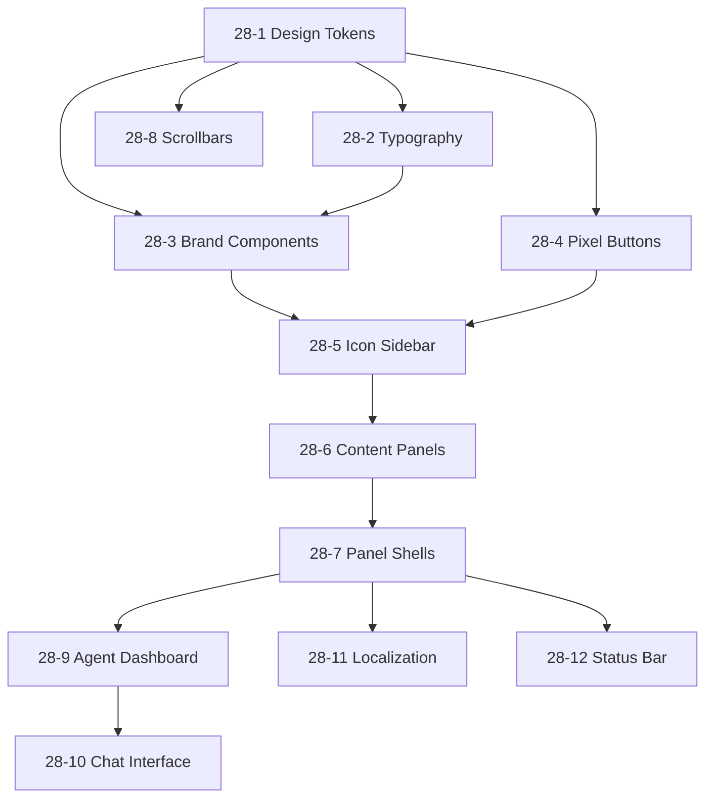

# Epic 28: UX Brand Identity & Design System

## Epic Metadata
- **ID:** 28
- **Title:** UX Brand Identity & Design System
- **Priority:** P0
- **Total Points:** 45
- **Stories:** 12
- **Platform:** Platform B
- **Created:** 2025-12-22
- **Status:** in-progress

## Overview

Transform Via-Gent's current generic ShadcnUI implementation into a premium, non-AI-feel agentic interface with MistralAI-inspired 8-bit gaming aesthetic. This epic absorbs gaps from Epic 23's initial implementation and establishes the foundational design system.

### Vision Statement

> Create a **top-notch, professional design** that looks unique and premium—avoiding generic component library aesthetics. The interface should feel like a **premium developer tool** with retro gaming character, not an AI chatbot wrapper.

### Key Inspiration
- **MistralAI Interface**: Clean, dark, professional with orange accents
- **8-Bit Gaming**: Pixel fonts (VT323, Press Start 2P), hard shadows, squared edges
- **VS Code/Cursor**: Collapsible icon sidebar, activity bar, multi-panel layout
- **NES.css**: Retro UI elements without kitsch

---

## Epic 23 Audit Summary

| Story | Status | Quality Assessment | Action |
|-------|--------|-------------------|--------|
| 23-1 TailwindCSS Installation | ✅ Done | Good - TailwindCSS 4.x working | Keep |
| 23-2 ShadcnUI Initialization | ✅ Done | Generic - Neutral color scheme, oklch colors | **Override** |
| 23-3 Layout Migration | ⏳ Backlog | Not started | **Absorb into 28-5** |
| 23-4 IDE Panel Migration | ⏳ Claimed | Partial - Generic card headers | **Absorb into 28-7** |
| 23-5 Theme Toggle | ✅ Done | Good - next-themes working | Keep |
| 23-6+ | ⏳ Backlog | Not started | Defer until Epic 28 complete |

### Identified Gaps
1. **Colors**: Using oklch blue-tinted neutrals instead of MistralAI orange (#f97316)
2. **Typography**: Default Inter only, missing pixel fonts
3. **Aesthetic**: Generic rounded corners, no pixel shadows
4. **Layout**: No collapsible icon sidebar (VS Code style)
5. **Brand**: No VIA-GENT logo component
6. **Localization**: Incomplete VI translations

---

## Story Breakdown

### Phase 1: Design Foundation (Stories 28-1 to 28-4)

#### Story 28-1: Override Design Tokens with VIA-GENT Brand
**Points:** 5 | **Priority:** P0

Override Epic 23's generic tokens with premium 8-bit aesthetic:

**Color Palette:**
```css
/* VIA-GENT Brand Colors */
--primary: #f97316;           /* Orange - MistralAI inspired */
--primary-foreground: #ffffff;
--background-dark: #0f0f11;   /* Deep black */
--surface-dark: #18181b;      /* Panel background */
--surface-darker: #121214;    /* Sidebar background */
--editor-bg: #09090b;         /* Monaco editor */
--border-dark: #27272a;       /* Borders */
--accent-blue: #3b82f6;       /* Secondary accent */
--accent-green: #4ade80;      /* Success/online */
--accent-red: #f87171;        /* Error/offline */
```

**Tasks:**
- [ ] Create `src/styles/design-tokens.css` with CSS custom properties
- [ ] Override `src/styles.css` `:root` and `.dark` variables
- [ ] Add pixel shadow tokens: `--shadow-pixel: 2px 2px 0px rgba(0,0,0,0.5)`
- [ ] Add `--radius: 0` for squared corners by default
- [ ] Create optional `--radius-sm: 0.125rem` for subtle rounding

---

#### Story 28-2: Configure 8-Bit Typography System
**Points:** 3 | **Priority:** P0

**Font Stack:**
- **Brand/Headings:** VT323 (lightweight pixel font)
- **Heavy Emphasis:** Press Start 2P (chunky 8-bit)
- **Body:** Inter (clean sans-serif)
- **Code:** JetBrains Mono (developer-focused)

**Tasks:**
- [ ] Add Google Fonts link in `src/routes/__root.tsx`
- [ ] Create font-family CSS variables
- [ ] Add Tailwind `@theme` extensions for `font-pixel`, `font-pixel-heavy`
- [ ] Create utility classes `.text-pixel`, `.text-pixel-heavy`
- [ ] Test font rendering at various sizes

---

#### Story 28-3: Create VIA-GENT Brand Components
**Points:** 5 | **Priority:** P0

**Components:**
1. **BrandLogo** - Pixel "V" square + VIA-GENT text
2. **PixelBadge** - Status indicators (ONLINE, OFFLINE, ERROR)
3. **StatusDot** - Pulsing status indicator
4. **SystemBanner** - "SYSTEM ONLINE" retro banner

**Design Pattern (from mockups):**
```tsx
// BrandLogo component
<div className="flex items-center gap-2.5">
  <div className="w-8 h-8 bg-primary flex items-center justify-center text-white shadow-pixel-primary">
    <span className="font-pixel text-2xl">V</span>
  </div>
  <span className="font-pixel text-2xl text-white">
    VIA<span className="text-primary">-</span>GENT
  </span>
</div>
```

**Tasks:**
- [ ] Create `src/components/ui/brand-logo.tsx`
- [ ] Create `src/components/ui/pixel-badge.tsx`
- [ ] Create `src/components/ui/status-dot.tsx`
- [ ] Add size variants (sm, md, lg)
- [ ] Full i18n support
- [ ] Unit tests

---

#### Story 28-4: Implement Pixel Button Variants
**Points:** 3 | **Priority:** P1

Extend ShadcnUI Button with pixel aesthetic variants:

**Variants:**
- `pixel` - Squared, pixel shadow, press effect
- `pixel-primary` - Orange with orange shadow
- `pixel-outline` - Border with pixel shadow
- `pixel-ghost` - Minimal with hover fill

**Animation:**
```css
/* Press effect */
.button-pixel:active {
  transform: translateY(2px);
  box-shadow: none;
}
```

**Tasks:**
- [ ] Extend `src/components/ui/button.tsx` with new variants
- [ ] Add `shadow-pixel` and `shadow-pixel-primary` utilities
- [ ] Create press animation with `active:` states
- [ ] Add `font-pixel` optional text styling
- [ ] Storybook examples (if available)

---

### Phase 2: IDE Layout Revolution (Stories 28-5 to 28-8)

#### Story 28-5: Build VS Code-Style Icon Sidebar
**Points:** 8 | **Priority:** P0

Replace current sidebar with VS Code-style activity bar:

**Structure:**
```
┌────────────────────────────────────────────┐
│  [≡]  VIA-GENT       │ Search...  │ 🔔 ⚙️ 👤 │
├──────┬─────────────────────────────────────┤
│ 📄   │  EXPLORER                           │
│ 🔍   │  ───────────────────────           │
│ 🤖   │  [Folder Tree Content]              │
│ 📊   │                                     │
│ ⚙️   │                                     │
└──────┴─────────────────────────────────────┘
  ^48px   ^280px (collapsible)
```

**Features:**
- 48px icon bar (always visible)
- 280px content panel (collapsible)
- Active icon highlighted with primary color + left border
- Tooltip with keyboard shortcut
- Badge notifications on icons
- LocalStorage persistence

**Navigation Items:**
- Files (Explorer) - `Ctrl+Shift+E`
- Search - `Ctrl+Shift+F`
- Agents - `Ctrl+Shift+A`
- Analytics - `Ctrl+Shift+D`
- Settings - `Ctrl+,`

**Tasks:**
- [ ] Create `src/components/ide/IconSidebar.tsx`
- [ ] Create `src/components/ide/SidebarContent.tsx` container
- [ ] Implement collapse/expand with smooth animation
- [ ] Add keyboard shortcuts handler
- [ ] Persist state to localStorage
- [ ] Wire to IDELayout.tsx
- [ ] Add tooltip component (ShadcnUI)

---

#### Story 28-6: Create Dynamic Content Panels
**Points:** 5 | **Priority:** P0

Panel implementations for sidebar content:

**Panels:**
1. **ExplorerPanel** - Enhanced FileTree wrapper
2. **SearchPanel** - Code search interface
3. **AgentsPanel** - Active agents dashboard
4. **AnalyticsPanel** - Usage metrics
5. **SettingsPanel** - Quick settings

**AgentsPanel Design (from mockups):**
```tsx
<div className="flex flex-col p-3 rounded bg-surface-darker border border-border-dark">
  <div className="flex items-center justify-between mb-2">
    <div className="flex items-center gap-2">
      <div className="w-6 h-6 bg-blue-500/20 text-blue-400 flex items-center justify-center">
        <Code className="w-4 h-4" />
      </div>
      <span className="text-sm font-medium">DevArchitect</span>
    </div>
    <StatusDot status="active" />
  </div>
  <p className="text-xs text-muted-foreground mb-2 truncate">
    Refactoring authentication logic...
  </p>
  <Progress value={75} className="h-1" />
</div>
```

**Tasks:**
- [ ] Create `src/components/ide/panels/ExplorerPanel.tsx`
- [ ] Create `src/components/ide/panels/AgentsPanel.tsx`
- [ ] Create `src/components/ide/panels/SearchPanel.tsx`
- [ ] Create `src/components/ide/panels/SettingsPanel.tsx`
- [ ] Add panel switching logic
- [ ] Animate panel transitions

---

#### Story 28-7: Modernize IDE Panel Shells (Absorbs 23-4 gaps)
**Points:** 5 | **Priority:** P0

Override Epic 23-4's generic card headers with pixel aesthetic:

**Panel Header Design:**
```tsx
<div className="flex items-center justify-between px-4 py-2 bg-surface-darker border-b border-border-dark">
  <h3 className="text-xs font-bold text-white uppercase tracking-wider font-pixel">
    {title}
  </h3>
  <div className="flex gap-2">
    <Button variant="ghost" size="icon-sm">
      <Copy className="h-4 w-4" />
    </Button>
    <Button variant="ghost" size="icon-sm">
      <Maximize2 className="h-4 w-4" />
    </Button>
  </div>
</div>
```

**Tasks:**
- [ ] Create `src/components/ide/PanelShell.tsx` wrapper
- [ ] Add fullscreen toggle support
- [ ] Add panel action slots
- [ ] Update FileTree panel styling
- [ ] Update Editor panel styling
- [ ] Update Terminal panel styling
- [ ] Update Preview panel styling

---

#### Story 28-8: Custom Scrollbar & UI Polish
**Points:** 3 | **Priority:** P1

Premium scrollbar styling matching mockups:

```css
::-webkit-scrollbar {
  width: 10px;
  height: 10px;
}
::-webkit-scrollbar-track {
  background: transparent;
}
::-webkit-scrollbar-thumb {
  background: #3f3f46;
  border-radius: 5px;
  border: 2px solid #18181b;
}
::-webkit-scrollbar-thumb:hover {
  background: #52525b;
}
.no-scrollbar::-webkit-scrollbar {
  display: none;
}
```

**Tasks:**
- [ ] Add scrollbar styles to `globals.css`
- [ ] Create `.no-scrollbar` utility
- [ ] Add Firefox scrollbar support
- [ ] Apply to file tree, editor, terminal, chat

---

### Phase 3: Agent Interfaces (Stories 28-9 to 28-10)

#### Story 28-9: Agent Management Dashboard Components
**Points:** 5 | **Priority:** P1

Components for agent CRUD and monitoring:

**Components:**
- **AgentCard** - Agent summary with status, progress
- **AgentTable** - List view with sort/filter
- **AgentConfigForm** - LLM provider, temperature, tokens
- **AgentMetricsCard** - Tasks, success rate, tokens, cost

**Design Pattern:**
```tsx
<div className="grid grid-cols-4 gap-4">
  <MetricsCard
    title="Total Tasks"
    value="124"
    trend="+12%"
    icon={<Activity />}
  />
  <MetricsCard
    title="Success Rate"
    value="98.5%"
    subtitle="Last 24 hours"
    icon={<CheckCircle />}
  />
  {/* ... */}
</div>
```

**Tasks:**
- [ ] Create `src/components/agent/AgentCard.tsx`
- [ ] Create `src/components/agent/AgentTable.tsx`
- [ ] Create `src/components/agent/AgentConfigForm.tsx`
- [ ] Create `src/components/agent/MetricsCard.tsx`
- [ ] Add to AgentsPanel

---

#### Story 28-10: Enhanced Agent Chat Interface
**Points:** 5 | **Priority:** P1

Premium chat interface matching mockups:

**Features:**
- Agent avatar with pixel styling
- User messages with gradient avatar
- Thinking indicator (bouncing dots)
- Code blocks with syntax highlighting
- Tool execution logs
- Token/latency display
- Model selector badge

**Design Pattern:**
```tsx
<div className="flex gap-3">
  <div className="w-8 h-8 bg-primary/20 border border-primary flex items-center justify-center">
    <Bot className="h-4 w-4 text-primary" />
  </div>
  <div className="flex flex-col gap-1 max-w-[85%]">
    <span className="text-xs font-bold text-primary font-pixel">AGENT</span>
    <div className="p-3 bg-surface-dark border border-border-dark text-sm font-mono">
      {message}
    </div>
  </div>
</div>
```

**Tasks:**
- [ ] Create `src/components/chat/ChatMessage.tsx`
- [ ] Create `src/components/chat/ChatInput.tsx`
- [ ] Create `src/components/chat/TypingIndicator.tsx`
- [ ] Create `src/components/chat/ToolExecutionLog.tsx`
- [ ] Update AgentChatPanel.tsx with new components

---

### Phase 4: Localization & Polish (Stories 28-11 to 28-12)

#### Story 28-11: Complete EN/VI Localization Coverage
**Points:** 5 | **Priority:** P1

Full Vietnamese market support:

**Tasks:**
- [ ] Audit all components for hardcoded strings
- [ ] Add missing keys to `en.json`
- [ ] Create professional VI translations in `vi.json`
- [ ] Add brand terminology glossary
- [ ] Test all UI strings in both languages
- [ ] Handle text length differences in layout

**Key Translation Areas:**
- Sidebar navigation
- Panel titles
- Agent status messages
- Configuration forms
- Error messages
- Tooltips

---

#### Story 28-12: Footer Status Bar
**Points:** 3 | **Priority:** P2

VS Code-style status bar:

```tsx
<footer className="h-6 bg-primary text-white flex items-center justify-between px-3 text-[10px] font-mono">
  <div className="flex items-center gap-4">
    <StatusItem icon={<GitBranch />} label="main*" />
    <StatusItem icon={<Sync />} label="0↓ 1↑" />
    <StatusItem icon={<AlertCircle />} label="0" />
  </div>
  <div className="flex items-center gap-4">
    <span>Ln 24, Col 36</span>
    <span>UTF-8</span>
    <span>TypeScript React</span>
  </div>
</footer>
```

**Tasks:**
- [ ] Create `src/components/ide/StatusBar.tsx`
- [ ] Add git status integration (stub)
- [ ] Add cursor position display
- [ ] Add file type indicator
- [ ] Add notification bell

---

## Dependencies



---

## Success Criteria

1. **Visual Fidelity**: Implementation matches mockups in `_bmad-output/unified_ide_workspace_ux_ui/`
2. **No Generic Feel**: Zero ShadcnUI default rounded buttons or blue primary colors visible
3. **Dark Mode Default**: Dark theme applies on initial load
4. **Localization**: All strings in EN/VI with no console warnings
5. **Performance**: Sidebar collapse/expand <100ms animation
6. **Accessibility**: WCAG AA compliance for all new components

---

## References

- **UI Mockups:** `_bmad-output/unified_ide_workspace_ux_ui/stitch_unified_ide_workspace/`
- **UX Specification:** `_bmad-output/ux-specification.md`
- **Epic 23:** `_bmad-output/epics/epic-23-uxui-modernization-new-course-correction-v6.md`
- **ShadcnUI Sidebar:** [ui.shadcn.com/docs/components/sidebar](https://ui.shadcn.com/docs/components/sidebar)
- **NES.css:** [nostalgic-css.github.io/NES.css/](https://nostalgic-css.github.io/NES.css/)
