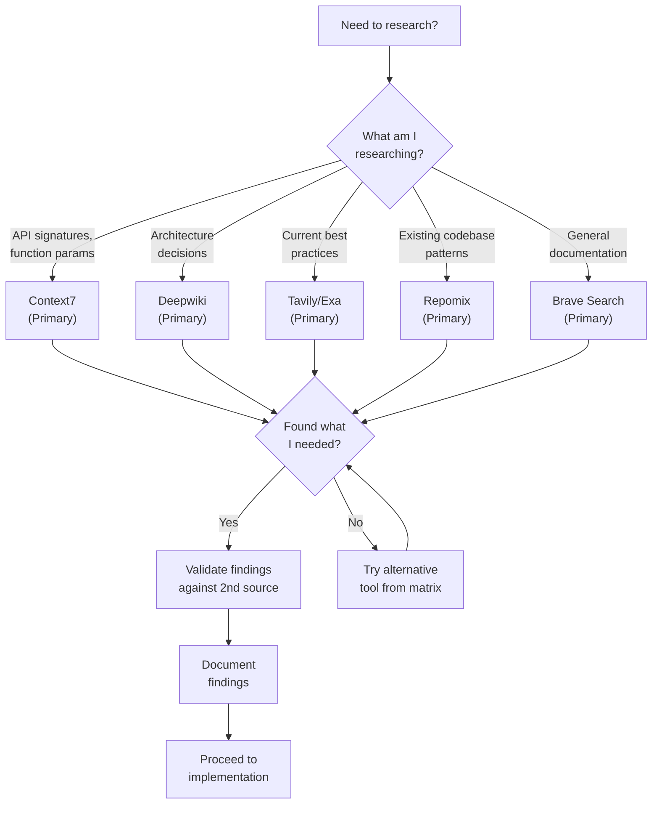
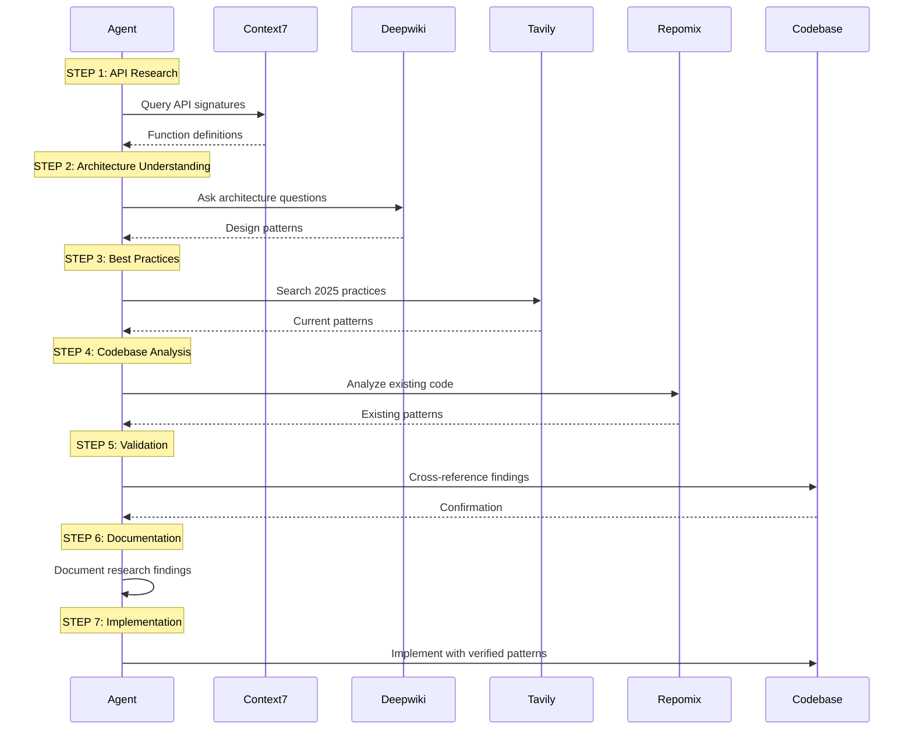
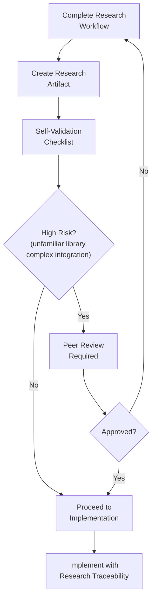
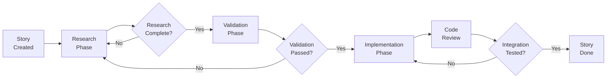

# MCP Research Protocol Enforcement Guidelines

**Version:** 1.0  
**Date:** 2025-12-24  
**Author:** Tech Writer Agent (Paige)  
**Incident Reference:** [INC-2025-12-24-001](file:///Users/apple/Documents/coding-projects/project-alpha-master/_bmad-output/critical-incidents/root-cause-analysis-e2e-validation-failure-2025-12-24.md)  
**Status:** PRODUCTION READY - ENFORCEABLE

---

## Table of Contents

1. [Executive Summary](#1-executive-summary)
2. [Problem Statement](#2-problem-statement)
3. [MCP Tools Overview](#3-mcp-tools-overview)
4. [Tool Selection Decision Tree](#4-tool-selection-decision-tree)
5. [Detailed Tool Usage Guidelines](#5-detailed-tool-usage-guidelines)
6. [Sequential Research Workflow](#6-sequential-research-workflow)
7. [Research Validation Protocol](#7-research-validation-protocol)
8. [Documentation Requirements](#8-documentation-requirements)
9. [Sprint Planning Integration](#9-sprint-planning-integration)
10. [Common Pitfalls and Remediation](#10-common-pitfalls-and-remediation)
11. [Enforcement Mechanisms](#11-enforcement-mechanisms)
12. [Quality Gates](#12-quality-gates)

---

## 1. Executive Summary

This document establishes **mandatory MCP (Model Context Protocol) research protocol enforcement** for all AI agents working on the Via-gent project. Following critical incident INC-2025-12-24-001, which revealed superficial knowledge and API hallucinations due to insufficient research, this protocol ensures agents properly utilize available research tools before implementing unfamiliar patterns.

> [!CAUTION]
> **MANDATORY COMPLIANCE**: Failure to follow this protocol has resulted in production incidents. All agents MUST complete the research workflow before implementing unfamiliar patterns or using libraries for the first time.

### Key Outcomes

- **Eliminate API hallucinations** by verifying all API signatures against official documentation
- **Prevent implementation drift** by understanding architectural decisions from source repositories
- **Ensure 2025 best practices** by researching current industry standards
- **Maintain codebase consistency** by analyzing existing patterns before adding new code

---

## 2. Problem Statement

### Root Cause (INC-2025-12-24-001)

The incident analysis revealed that agents were implementing code based on:
- **Superficial knowledge** from training data rather than current documentation
- **API hallucinations** where function signatures and patterns were guessed rather than verified
- **Pattern assumptions** without analyzing the existing codebase structure
- **Outdated practices** without checking 2025 best practices

### Impact

| Impact Category | Description |
|-----------------|-------------|
| **Non-functional Frontend** | Chat interface mocked, not wired to TanStack AI SDK |
| **Wasted Development Time** | ~8 hours on improperly integrated components |
| **User Trust Damage** | User described situation as "A total disastrous" |
| **E2E Testing Blockage** | Complete testing pipeline blocked |

### Solution

Mandatory use of MCP research tools in a structured workflow with validation checkpoints before any implementation.

---

## 3. MCP Tools Overview

### Available MCP Tools

| Tool | Primary Purpose | Best For |
|------|-----------------|----------|
| **Context7** | Library documentation queries | API signatures, function parameters, return types |
| **Deepwiki** | Repository wikis and architecture | Architectural decisions, design patterns, repo-specific concepts |
| **Tavily** | Semantic web search | 2025 best practices, tutorials, blog posts |
| **Exa** | Advanced semantic search | GitHub repos, technical articles, specific implementations |
| **Repomix** | Codebase structure analysis | Understanding existing patterns, file organization |
| **Brave Search** | General web search | Broad searches, documentation sites, official resources |

### Tool Capabilities Matrix

| Capability | Context7 | Deepwiki | Tavily | Exa | Repomix | Brave |
|------------|:--------:|:--------:|:------:|:---:|:-------:|:-----:|
| API Signatures | ✅ | ⚠️ | ⚠️ | ⚠️ | ❌ | ⚠️ |
| Architecture Decisions | ⚠️ | ✅ | ⚠️ | ⚠️ | ✅ | ❌ |
| 2025 Best Practices | ❌ | ⚠️ | ✅ | ✅ | ❌ | ✅ |
| Codebase Analysis | ❌ | ❌ | ❌ | ❌ | ✅ | ❌ |
| Official Docs | ✅ | ⚠️ | ⚠️ | ⚠️ | ❌ | ✅ |
| Real Examples | ⚠️ | ✅ | ✅ | ✅ | ✅ | ⚠️ |

**Legend:** ✅ Primary Use | ⚠️ Secondary/Limited | ❌ Not Suitable

---

## 4. Tool Selection Decision Tree

Use this decision tree to determine which MCP tool(s) to use:



### Quick Reference: When to Use Each Tool

**Use Context7 when:**
- You need exact API signatures for a library
- You want to verify function parameters and return types
- You're checking what methods are available on an object
- You need type definitions or interface contracts

**Use Deepwiki when:**
- You need to understand why something is designed a certain way
- You're looking for architectural patterns in a specific repo
- You want to understand how components interact in a library
- You need semantic understanding of repo-specific concepts

**Use Tavily/Exa when:**
- You want current 2025 implementation patterns
- You're looking for tutorials or blog posts
- You need multiple implementation approaches to compare
- You want to find production-ready examples

**Use Repomix when:**
- You need to understand existing codebase structure
- You want to find similar patterns in the current project
- You're checking naming conventions and file organization
- You need to analyze dependencies between modules

**Use Brave Search when:**
- You need to find official documentation sites
- You're looking for general technical resources
- You want to verify package names or repository URLs
- You need broad context before diving deep

---

## 5. Detailed Tool Usage Guidelines

### 5.1 Context7: Library Documentation Queries

**Purpose:** Query official library documentation for accurate API signatures.

**Usage Pattern:**
1. Identify the library and version you're working with
2. Query for specific function/method signatures
3. Verify parameters, return types, and optional arguments
4. Check for deprecated APIs or breaking changes

**Query Examples:**
```
# Good: Specific API query
"TanStack AI SDK createOpenaiChat function signature and options"

# Good: Type definition query
"Zustand create function type parameters middleware support"

# Bad: Too vague
"How to use TanStack AI"
```

**Validation Checkpoint:**
- [ ] API signature matches documentation
- [ ] Parameter types are correct
- [ ] Return type is verified
- [ ] Optional parameters identified

**Scoring Guidance:**
- Context7 returns results with scores
- Use results with highest relevance scores (aim for 2 sequential steps per turn based on scoring as noted in project rules)
- Cross-reference low-scoring results with other tools

---

### 5.2 Deepwiki: Repository Architecture Decisions

**Purpose:** Understand architectural decisions and design patterns in specific repositories.

**Usage Pattern:**
1. Provide the GitHub repository URL or Deepwiki link
2. Ask semantic questions about architectural concepts
3. Focus on "why" questions, not just "how"

**Repository Links for Via-gent Dependencies:**

| Dependency | GitHub | Deepwiki |
|------------|--------|----------|
| TanStack AI | [github.com/TanStack/ai](https://github.com/TanStack/ai/) | [deepwiki.com/TanStack/ai](https://deepwiki.com/TanStack/ai) |
| TanStack Devtools | [github.com/TanStack/devtools](https://github.com/TanStack/devtools) | [deepwiki.com/TanStack/devtools](https://deepwiki.com/TanStack/devtools) |
| WebContainer Core | [github.com/stackblitz/webcontainer-core](https://github.com/stackblitz/webcontainer-core) | [deepwiki.com/stackblitz/webcontainer-core](https://deepwiki.com/stackblitz/webcontainer-core) |
| WebContainer API | [github.com/stackblitz/webcontainer-api](https://github.com/stackblitz/webcontainer-api) | [deepwiki.com/stackblitz/webcontainer-api](https://deepwiki.com/stackblitz/webcontainer-api) |
| Dexie.js | [github.com/dexie/Dexie.js](https://github.com/dexie/Dexie.js) | [deepwiki.com/dexie/dexie.js](https://deepwiki.com/dexie/dexie.js) |
| Xterm.js | [github.com/xtermjs/xterm.js](https://github.com/xtermjs/xterm.js) | [deepwiki.com/xtermjs/xterm.js](https://deepwiki.com/xtermjs/xterm.js) |
| Monaco Editor | [github.com/microsoft/monaco-editor](https://github.com/microsoft/monaco-editor) | [deepwiki.com/microsoft/monaco-editor](https://deepwiki.com/microsoft/monaco-editor) |
| Zustand | [github.com/pmndrs/zustand](https://github.com/pmndrs/zustand) | [deepwiki.com/pmndrs/zustand](https://deepwiki.com/pmndrs/zustand) |
| EventEmitter3 | [github.com/primus/eventemitter3](https://github.com/primus/eventemitter3) | [deepwiki.com/primus/eventemitter3](https://deepwiki.com/primus/eventemitter3) |

**Query Examples:**
```
# Good: Architecture question
"How does TanStack AI SDK handle streaming SSE responses internally?"

# Good: Design pattern question
"What is the recommended pattern for WebContainer file system operations?"

# Bad: Implementation question (use Context7 instead)
"What parameters does fs.writeFile take?"
```

**Validation Checkpoint:**
- [ ] Architectural pattern understood
- [ ] Design rationale documented
- [ ] Edge cases identified
- [ ] Integration points clarified

---

### 5.3 Tavily/Exa: 2025 Best Practices Search

**Purpose:** Search for current best practices, tutorials, and production examples.

**Usage Pattern:**
1. Formulate specific search query with year context
2. Filter results for recency and authority
3. Compare multiple approaches before selecting one

**Query Examples:**
```
# Good: Specific with year
"TanStack AI SDK SSE streaming React best practices 2025"

# Good: Pattern comparison
"Zustand vs TanStack Store state management React 2025 comparison"

# Bad: Too generic
"React state management"
```

**Source Authority Hierarchy:**
1. Official documentation sites (highest authority)
2. Library author blog posts
3. Major tech company engineering blogs
4. Well-known developer blogs
5. Stack Overflow accepted answers (with verification)
6. Tutorial sites (verify against #1-4)

**Validation Checkpoint:**
- [ ] Source is authoritative (check hierarchy)
- [ ] Content is from 2024-2025
- [ ] Pattern aligns with project architecture
- [ ] No conflicting information from other sources

---

### 5.4 Repomix: Codebase Structure Analysis

**Purpose:** Analyze current codebase structure, patterns, and conventions.

**Usage Pattern:**
1. Specify the directory or file scope
2. Ask about existing patterns and conventions
3. Identify similar implementations for reference

**Query Examples:**
```
# Good: Pattern analysis
"Analyze existing hook patterns in src/lib/agent/hooks/"

# Good: Convention discovery
"What naming conventions are used for Zustand stores?"

# Good: Dependency analysis
"What components import from src/lib/events/workspace-events.ts?"
```

**When to Use Before Implementation:**
- Before creating a new component: Check existing component patterns
- Before adding a new hook: Review existing hook conventions
- Before creating a store: Analyze existing store implementations
- Before adding utilities: Check existing utils organization

**Validation Checkpoint:**
- [ ] Existing patterns identified
- [ ] Naming conventions documented
- [ ] File organization understood
- [ ] Similar implementations found for reference

---

### 5.5 Brave Search: General Web Search

**Purpose:** Perform broad web searches for documentation and resources.

**Usage Pattern:**
1. Use for finding official documentation URLs
2. Verify package names and repository locations
3. Find official installation instructions

**Query Examples:**
```
# Good: Finding official docs
"TanStack AI SDK official documentation site"

# Good: Package verification
"@tanstack/ai-openai npm package official"

# Bad: In-depth technical query (use specialized tools)
"How to implement TanStack AI streaming"
```

**Validation Checkpoint:**
- [ ] Official source verified
- [ ] URL is current and active
- [ ] Package/library version confirmed

---

## 6. Sequential Research Workflow

### Workflow Diagram



### Step-by-Step Process

#### Step 1: API Research (Context7)
**Objective:** Verify all API signatures and function parameters.

**Actions:**
1. Identify all libraries you'll interact with
2. Query Context7 for each API you'll use
3. Document function signatures, parameters, and return types
4. Note any deprecated APIs or version-specific changes

**Output:** API Reference Notes

#### Step 2: Architecture Understanding (Deepwiki)
**Objective:** Understand why things are designed the way they are.

**Actions:**
1. Identify repositories relevant to your implementation
2. Ask semantic questions about architectural decisions
3. Understand component interactions and data flows
4. Document design rationale and constraints

**Output:** Architecture Understanding Notes

#### Step 3: Best Practices Search (Tavily/Exa)
**Objective:** Find current industry best practices.

**Actions:**
1. Search for 2025 best practices for your specific use case
2. Find production-ready examples
3. Compare multiple approaches
4. Select the most appropriate pattern

**Output:** Best Practices Notes

#### Step 4: Codebase Analysis (Repomix)
**Objective:** Understand existing patterns in the project.

**Actions:**
1. Analyze relevant directories for existing patterns
2. Identify naming conventions and file organization
3. Find similar implementations to use as reference
4. Note any project-specific conventions

**Output:** Codebase Pattern Notes

#### Step 5: Cross-Validation
**Objective:** Ensure all findings are consistent.

**Actions:**
1. Cross-reference API research with architecture understanding
2. Verify best practices align with existing codebase patterns
3. Identify any conflicts or inconsistencies
4. Resolve conflicts by preferring official sources

**Output:** Validated Research Summary

#### Step 6: Research Documentation
**Objective:** Document findings for traceability.

**Actions:**
1. Create research artifact (see Section 8)
2. Include all sources and validation status
3. Note any uncertainties or risks
4. Get research approved before implementation

**Output:** Research Artifact Document

#### Step 7: Validated Implementation
**Objective:** Implement using verified patterns.

**Actions:**
1. Implement using documented patterns
2. Reference research artifact in code comments
3. Test implementation against documented expectations
4. Update research artifact with any learnings

**Output:** Implementation with Research Traceability

---

## 7. Research Validation Protocol

### Pre-Implementation Validation Checklist

Before proceeding to implementation, complete this checklist:

```markdown
## Research Validation Checklist

### API Signatures (Context7)
- [ ] All required APIs documented with function signatures
- [ ] Parameter types verified against official docs
- [ ] Return types confirmed
- [ ] Error handling patterns identified
- [ ] Source: [link to Context7 result]

### Architecture Understanding (Deepwiki)
- [ ] Design patterns understood
- [ ] Component interactions mapped
- [ ] Integration points identified
- [ ] Known limitations documented
- [ ] Source: [link to Deepwiki result]

### Best Practices (Tavily/Exa)
- [ ] 2025 patterns identified
- [ ] Multiple approaches compared
- [ ] Selected approach justified
- [ ] Source authority verified (2024-2025, official/authoritative)
- [ ] Source: [link to search result]

### Codebase Analysis (Repomix)
- [ ] Existing patterns identified
- [ ] Naming conventions documented
- [ ] File organization understood
- [ ] Reference implementations found
- [ ] Source: [link to Repomix analysis]

### Cross-Validation
- [ ] No conflicts between sources
- [ ] Patterns align with codebase
- [ ] Best practices compatible with architecture
- [ ] Uncertainties resolved or documented

### Approval
- [ ] Research artifact created
- [ ] Posted for review (if required)
- [ ] Approved to proceed
```

### Research Artifact Requirements

Every implementation involving unfamiliar patterns MUST have an associated research artifact:

**Required Sections:**
1. **Research Objective**: What you needed to learn
2. **Tools Used**: Which MCP tools were consulted
3. **Findings Summary**: Key discoveries from each tool
4. **Sources**: Links to documentation/sources consulted
5. **Validation Status**: Whether findings were cross-validated
6. **Implementation Decision**: Selected approach with justification
7. **Risks/Uncertainties**: Any unresolved questions

**Template Location:** See [Section 8](#8-documentation-requirements)

### Approval Workflow



### Rollback Procedures

If during implementation you discover research was insufficient:

1. **STOP implementation immediately**
2. **Document the gap** in the research artifact
3. **Return to research workflow** starting at the relevant step
4. **Update research artifact** with new findings
5. **Re-validate** all dependent findings
6. **Resume implementation** only after validation complete

---

## 8. Documentation Requirements

### Research Artifact Template

```markdown
# Research Artifact: [Feature/Pattern Name]

**Date:** YYYY-MM-DD
**Author:** [Agent Name]
**Related Story:** [Story ID if applicable]

---

## 1. Research Objective

[What you needed to learn and why]

---

## 2. MCP Tools Consulted

| Tool | Query | Result Summary |
|------|-------|----------------|
| Context7 | [Query text] | [Brief findings] |
| Deepwiki | [Query text] | [Brief findings] |
| Tavily | [Query text] | [Brief findings] |
| Repomix | [Query text] | [Brief findings] |

---

## 3. Detailed Findings

### API Signatures (Context7)
[Documented API signatures with parameters and types]

### Architecture Patterns (Deepwiki)
[Architectural understanding and design decisions]

### Best Practices (Tavily/Exa)
[2025 best practices with sources]

### Codebase Patterns (Repomix)
[Existing patterns in the project]

---

## 4. Sources

| Source | Authority Level | Last Verified |
|--------|-----------------|---------------|
| [URL] | Official Docs | YYYY-MM-DD |
| [URL] | Author Blog | YYYY-MM-DD |
| [URL] | Deepwiki | YYYY-MM-DD |

---

## 5. Validation Status

- [x] Cross-validated across multiple sources
- [x] No conflicting information
- [x] Patterns align with codebase

---

## 6. Implementation Decision

**Selected Approach:** [Description]

**Justification:** [Why this approach over alternatives]

**Alternatives Considered:**
1. [Alternative 1] - Rejected because [reason]
2. [Alternative 2] - Rejected because [reason]

---

## 7. Risks and Uncertainties

| Risk | Mitigation |
|------|------------|
| [Risk 1] | [Mitigation strategy] |
| [Risk 2] | [Mitigation strategy] |

---

## 8. Approval

- [ ] Self-validated
- [ ] Peer reviewed (if required)
- [ ] Approved to proceed
```

### Research Artifact Location

Store research artifacts in:
```
_bmad-output/research/
├── [feature-name]-research-YYYY-MM-DD.md
```

---

## 9. Sprint Planning Integration

### Story Acceptance Criteria Updates

All stories involving unfamiliar patterns MUST include:

```markdown
### Research Requirements (MANDATORY)

**Pre-Implementation Research:**
- [ ] MCP research workflow completed
- [ ] Research artifact created: `_bmad-output/research/[name].md`
- [ ] API signatures verified (Context7)
- [ ] Architecture patterns understood (Deepwiki)
- [ ] 2025 best practices confirmed (Tavily/Exa)
- [ ] Codebase patterns analyzed (Repomix)

**Research Validation:**
- [ ] Pre-implementation checklist completed
- [ ] Cross-validation passed
- [ ] Peer review completed (if high-risk)
```

### Research Deliverables Per Story

| Story Type | Required Deliverables |
|------------|----------------------|
| New library integration | Full research artifact, API reference, architecture notes |
| New pattern implementation | Research artifact, best practices comparison |
| Existing pattern extension | Codebase analysis, pattern conformance check |
| Bug fix | Root cause research, similar issues search |

### Research Review Gates



### Sprint Status Tracking

Add to `sprint-status.yaml` for each story:

```yaml
story-id:
  status: in-progress
  research:
    status: complete  # not-started | in-progress | complete
    artifact: "_bmad-output/research/feature-research-2025-12-24.md"
    tools_used:
      - context7
      - deepwiki
      - tavily
    validation: passed  # passed | failed | pending
```

---

## 10. Common Pitfalls and Remediation

### Pitfall 1: Skipping Research for "Simple" Changes

**Problem:** Assuming you know the API without verification.

**Symptoms:**
- API calls fail with unexpected errors
- Parameters passed in wrong order/type
- Using deprecated methods

**Remediation:**
- ALWAYS verify API signatures with Context7
- No change is "too simple" for verification
- Document even quick lookups

### Pitfall 2: Using Training Data Instead of Current Docs

**Problem:** Relying on knowledge from training rather than current sources.

**Symptoms:**
- Using patterns from older versions
- API methods that don't exist
- Outdated best practices

**Remediation:**
- Always query MCP tools, even for "known" libraries
- Check version-specific documentation
- Verify with 2024-2025 dated sources

### Pitfall 3: Single-Source Research

**Problem:** Relying on only one MCP tool.

**Symptoms:**
- Incomplete understanding
- Missing edge cases
- Pattern conflicts with codebase

**Remediation:**
- Use minimum 2 tools for cross-validation
- Context7 + Deepwiki for API work
- Tavily + Repomix for pattern work

### Pitfall 4: Not Analyzing Existing Codebase

**Problem:** Implementing without checking existing patterns.

**Symptoms:**
- Inconsistent naming conventions
- Duplicate implementations
- Pattern conflicts

**Remediation:**
- Always run Repomix analysis before new implementations
- Find reference implementations in the codebase
- Follow established conventions

### Pitfall 5: Superficial Research Artifacts

**Problem:** Creating research artifacts without actual research.

**Symptoms:**
- Empty or placeholder sections
- Missing source links
- No validation evidence

**Remediation:**
- Research artifacts must have complete sections
- All sources must be linked
- Validation checklist must be completed honestly

---

## 11. Enforcement Mechanisms

### Pre-Commit Validation

Before any implementation, verify:

1. **Research artifact exists** for unfamiliar patterns
2. **Validation checklist completed** with all items checked
3. **Sources documented** with links
4. **Cross-validation performed** (minimum 2 tools)

### Code Review Requirements

Code reviewers MUST verify:

```markdown
## Research Verification Checklist (For Reviewers)

- [ ] Research artifact linked in PR/story
- [ ] All API usages match documented signatures
- [ ] Patterns align with codebase analysis
- [ ] Best practices sources are authoritative
- [ ] No obvious API hallucinations
- [ ] Implementation matches research decision
```

### Automated Checks

Add to story completion workflow:

```yaml
definition_of_done:
  research:
    required: true
    checklist:
      - artifact_exists
      - validation_passed
      - sources_verified
      - cross_validation_completed
```

### Escalation Path

If research requirements are not met:

1. **Warning:** Story marked as blocked
2. **Explanation:** Identify which research step failed
3. **Resolution:** Complete missing research
4. **Verification:** Re-validate all findings
5. **Approval:** Get sign-off before proceeding

---

## 12. Quality Gates

### Gate 1: Research Completeness

**Criteria:**
- [ ] All required MCP tools consulted
- [ ] Research artifact created with all sections
- [ ] Sources documented and verified

**Enforcement:** Cannot proceed to implementation

### Gate 2: Validation Passed

**Criteria:**
- [ ] Pre-implementation checklist completed
- [ ] Cross-validation performed
- [ ] No unresolved conflicts

**Enforcement:** Cannot proceed to implementation

### Gate 3: Peer Review (High-Risk)

**Criteria:**
- [ ] Research artifact reviewed by peer
- [ ] Approach approved
- [ ] Risks acknowledged

**Enforcement:** Cannot proceed to implementation for high-risk items

### Gate 4: Implementation Traceability

**Criteria:**
- [ ] Code references research artifact
- [ ] Implementation matches documented patterns
- [ ] No undocumented API usages

**Enforcement:** Code review must verify traceability

### Gate 5: Integration Verification

**Criteria:**
- [ ] Manual browser testing performed
- [ ] Integration points verified
- [ ] No API hallucinations in production

**Enforcement:** Story cannot be marked done

---

## Appendix A: Quick Reference Card

### Research Workflow Summary

```
1. Context7  → API signatures
2. Deepwiki  → Architecture decisions
3. Tavily    → 2025 best practices
4. Repomix   → Codebase patterns
5. Validate  → Cross-reference all findings
6. Document  → Create research artifact
7. Implement → Use verified patterns
```

### Tool Selection Quick Guide

| I need to know... | Use this tool |
|-------------------|---------------|
| Function parameters | Context7 |
| Why it's designed this way | Deepwiki |
| Current best practices | Tavily/Exa |
| Existing project patterns | Repomix |
| Official documentation URL | Brave Search |

### Validation Quick Check

Before implementing, answer:
- [ ] Have I verified all API signatures?
- [ ] Do I understand the architectural patterns?
- [ ] Is this the current 2025 best practice?
- [ ] Does this align with the existing codebase?
- [ ] Have I documented my research?

---

## Appendix B: Related Documents

- [Agent Architecture Guidelines](file:///Users/apple/Documents/coding-projects/project-alpha-master/_bmad-output/architecture/agent-architecture-guidelines-2025-12-24.md)
- [Research Synthesis: AI Agent Patterns](file:///Users/apple/Documents/coding-projects/project-alpha-master/_bmad-output/research-synthesis-ai-agent-patterns-2025-12-24.md)
- [Root Cause Analysis: INC-2025-12-24-001](file:///Users/apple/Documents/coding-projects/project-alpha-master/_bmad-output/critical-incidents/root-cause-analysis-e2e-validation-failure-2025-12-24.md)
- [E2E Testing Foundation](file:///Users/apple/Documents/coding-projects/project-alpha-master/_bmad-output/testing/e2e-testing-foundation-2025-12-24.md)

---

**Document Status:** PRODUCTION READY  
**Last Updated:** 2025-12-24  
**Next Review:** After first sprint using this protocol
