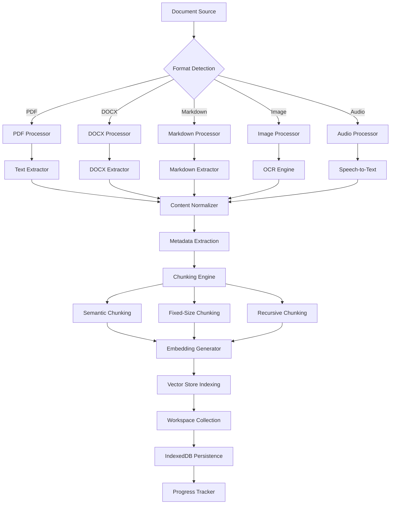

# Multi-Modal Ingestion Pipeline Technical Specification

**Document ID:** KSI-TECH-SPEC-MULTIMODAL-INGESTION-PIPELINE
**Version:** 1.0.0
**Status:** Draft
**Created:** 2026-01-03
**Author:** @bmad-bmm-architect
**Phase:** Technical Specification - Task 3

---

## 1. Executive Summary

This document specifies the Multi-Modal Ingestion Pipeline for the Knowledge Synthesis Station, enabling seamless processing of diverse document formats including PDF, DOCX, Markdown, images, audio files, and handwriting screenshots. The pipeline prioritizes client-side processing for local-first operation while providing cloud fallbacks for computationally intensive operations.

**Key Design Principles:**
- Client-side processing first (WASM libraries)
- Local-first persistence via IndexedDB/Dexie.js
- Resumable uploads with progress tracking
- Batch processing with cancellation support
- Workspace-scoped document isolation

**Supported Formats:**
| Format | Processing | Chunking Strategy |
|--------|------------|-----------------|
| PDF | PDF.js (client-side) | Page-aware with TOC extraction |
| DOCX | Mammoth.js + parsing | Paragraph-level semantic chunking |
| Markdown | Marked + frontmatter | Header-based hierarchical |
| Images | Tesseract.js OCR + CLIP embedding | Object detection |
| Audio | Whisper WASM transcription | Silence detection |
| Screenshots | Tesseract.js OCR | Layout-preserving |

---

## 2. Architecture Overview

### 2.1 Pipeline Architecture Diagram



### 2.2 Component Architecture

```
src/lib/ingestion/
├── pipeline/
│   ├── document-processor.ts       # Main orchestrator
│   ├── format-detector.ts          # MIME type detection
│   ├── progress-tracker.ts         # Upload progress
│   ├── batch-processor.ts          # Batch operations
│   └── cancellation-token.ts       # Cancellation support
│
├── processors/
│   ├── pdf-processor.ts          # PDF extraction
│   ├── docx-processor.ts          # DOCX extraction
│   ├── markdown-processor.ts      # Markdown extraction
│   ├── image-processor.ts        # OCR + embedding
│   ├── audio-processor.ts        # Speech-to-text
│   └── content-normalizer.ts     # Format standardization
│
├── chunking/
│   ├── semantic-chunker.ts       # Meaning-based segmentation
│   ├── fixed-size-chunker.ts     # Token-aware batching
│   ├── recursive-chunker.ts      # Hierarchical splitting
│   └── chunk-validator.ts       # Quality gates
│
├── metadata/
│   ├── frontmatter-extractor.ts  # YAML/JSON extraction
│   ├── structure-analyzer.ts     # TOC detection
│   ├── language-detector.ts     # Language identification
│   └── quality-scorer.ts        # Content quality metrics
│
├── types.ts                      # Pipeline interfaces
├── errors.ts                    # Error classes
└── index.ts                     # Public API
```

---

## 3. Ingestion Pipeline Specifications

### 3.1 Document Processor Interface

```typescript
interface DocumentProcessor {
  id: string;
  supportedMimeTypes: MimeType[];
  process(input: DocumentInput): Promise<ProcessedDocument>;
  cancel(token: CancellationToken): void;
  getProgress(): ProcessingProgress;
  validate(input: DocumentInput): ValidationResult;
}

interface DocumentInput {
  file: File | Blob;
  workspaceId: string;
  collectionId?: string;
  metadata?: Partial<DocumentMetadata>;
  options?: ProcessingOptions;
}

interface ProcessingOptions {
  extractImages?: boolean;
  ocrLanguage?: string;
  chunkingStrategy?: ChunkingStrategy;
  generateEmbeddings?: boolean;
  priority?: 'low' | 'normal' | 'high';
}

interface ProcessedDocument {
  documentId: string;
  workspaceId: string;
  originalFile: {
    name: string;
    size: number;
    mimeType: string;
  };
  content: {
    text: string;
    sections: ExtractedSection[];
    language: string;
    pageCount?: number;    // PDF
    duration?: number;      // Audio
  };
  metadata: FullDocumentMetadata;
  chunks: DocumentChunk[];
  embeddings?: ChunkEmbedding[];
  processingTime: number;
}
```

### 3.2 Chunking Strategy Interface

```typescript
type ChunkingStrategy = 'semantic' | 'fixed-size' | 'recursive';

interface ChunkingConfig {
  strategy: ChunkingStrategy;
  maxTokens?: number;
  overlap?: number;
  preserveStructure?: boolean;
}

interface DocumentChunk {
  chunkId: string;
  documentId: string;
  content: string;
  tokenCount: number;
  chunkIndex: number;
  sectionPath: SectionPath;
  startPosition: number;
  endPosition: number;
  metadata: ChunkMetadata;
}

interface SectionPath {
  type: 'page' | 'chapter' | 'section' | 'paragraph';
  hierarchy: SectionNode[];
}

interface ChunkMetadata {
  headings: string[];
  keywords: string[];
  language: string;
  chunkQuality: QualityScore;
  sources: SourceReference[];
}
```

---

## 4. File Format Support Matrix

### 4.1 Processing Requirements by Format

| Format | Priority | Processing Time | Memory Usage | Offline Support |
|--------|-----------|-----------------|--------------|----------------|
| PDF (text-based) | P0 | < 5s/100 pages | 50MB | ✅ Full |
| PDF (scanned) | P1 | 30s/page OCR | 200MB | ⚠️ Partial |
| DOCX | P0 | < 2s/10k words | 30MB | ✅ Full |
| Markdown | P0 | < 500ms/file | 10MB | ✅ Full |
| Images | P1 | 2-5s/image | 100MB | ✅ Full |
| Audio | P2 | Real-time + 2x processing | 150MB | ⚠️ Model load |
| Handwriting | P2 | 10s/page | 200MB | ⚠️ Model load |
| URL Content | P1 | Variable | 50MB | ❌ Network |

### 4.2 Processing Configuration by Format

```typescript
const PROCESSOR_CONFIGS: Record<MimeType, ProcessorConfig> = {
  'application/pdf': {
    processor: 'pdf-processor',
    maxFileSize: 100 * MB,
    timeout: 120000,
    retries: 3,
    parallelProcessing: false,
    cleanup: { removeOriginal: false }
  },
  'application/vnd.openxmlformats-officedocument.wordprocessingml.document': {
    processor: 'docx-processor',
    maxFileSize: 50 * MB,
    timeout: 60000,
    retries: 2,
    extractImages: true,
    preserveFormatting: true
  },
  'audio/wav': {
    processor: 'audio-processor',
    maxFileSize: 200 * MB,
    timeout: 600000,
    retries: 1,
    language: 'auto-detect'
  },
  'image/png': {
    processor: 'image-processor',
    maxFileSize: 25 * MB,
    timeout: 30000,
    retries: 2,
    ocr: true,
    embedding: true
  }
};
```

---

## 5. Error Handling Strategy

### 5.1 Error Classification

```typescript
type IngestionErrorCode = 
  | 'FILE_TOO_LARGE'
  | 'UNSUPPORTED_FORMAT'
  | 'PROCESSING_TIMEOUT'
  | 'OCR_FAILED'
  | 'INDEXING_FAILED'
  | 'QUOTA_EXCEEDED';

interface IngestionError {
  code: IngestionErrorCode;
  message: string;
  recoverable: boolean;
  retryAfter?: number;
  context: ErrorContext;
}
```

### 5.2 Error Recovery Patterns

```typescript
class IngestionErrorHandler {
  async handle(error: IngestionError): Promise<RecoveryAction> {
    switch (error.code) {
      case 'QUOTA_EXCEEDED':
        return this.handleQuotaExceeded(error);
      case 'OCR_FAILED':
        return this.handleOCRFailure(error);
      case 'PROCESSING_TIMEOUT':
        return this.handleTimeout(error);
      default:
        return this.surfaceToUser(error);
    }
  }
  
  private async handleQuotaExceeded(error: IngestionError): Promise<RecoveryAction> {
    const store = await import('@/stores/ingestion-store');
    const usage = await store.getStorageUsage();
    
    return {
      action: 'prompt_upgrade',
      message: `Storage limit reached. ${usage.used}/${usage.quota} used`,
      options: ['upgrade_storage', 'delete_old_documents']
    };
  }
}
```

### 5.3 Progress Tracking

```typescript
interface ProcessingProgress {
  documentId: string;
  stage: 'extraction' | 'chunking' | 'embedding' | 'indexing' | 'complete';
  status: 'pending' | 'running' | 'paused' | 'complete' | 'error';
  current: number;
  total: number;
  percentage: number;
  timeRemaining?: number;
  error?: IngestionError;
}
```

---

## 6. Performance Benchmarks

### 6.1 Processing Targets

| Operation | Target Time | Acceptable | Poor |
|-----------|-------------|------------|-------|
| PDF text extraction (10 pages) | < 2s | < 5s | > 10s |
| DOCX processing (5k words) | < 3s | < 5s | > 10s |
| Image OCR + embedding | < 5s/image | < 10s/image | > 30s/image |
| Audio transcription (1min) | < 90s | < 120s | > 180s |
| Chunking (10k tokens) | < 500ms | < 1s | > 2s |
| Indexing (100 chunks) | < 1s | < 3s | > 5s |

### 6.2 Memory Management

```typescript
interface MemoryBudget {
  maxDocumentSize: number;
  maxConcurrent: number;
  watermark: {
    high: 0.8;   // 80% trigger GC
    critical: 0.95; // 95% pause processing
  };
  cleanupInterval: 30000; // 30s GC check
}
```

---

## 7. Security Considerations

### 7.1 File Validation

```typescript
async function validateFile(file: File): Promise<ValidationResult> {
  const checks = [
    mimeTypeWhitelist(['application/pdf', 'application/vnd.openxmlformats-officedocument.wordprocessingml.document']),
    sizeLimit(MAX_FILE_SIZE),
    virusScan(file),  // Integrate ClamAV or similar
    maliciousPatternScan(file),
    encodingValidation(file)
  ];
  
  return Promise.all(checks).then(results => 
    results.every(r => r.valid) 
      ? { valid: true }
      : { valid: false, errors: results.filter(r => !r.valid).map(r => r.error) }
  );
}
```

### 7.2 Workspace Isolation

All documents are workspace-scoped:
- Cross-workspace document access: DENIED
- Collection sharing: Explicit invitation only
- Export: Workspace-scoped
- Search: Workspace-scoped

---

## 8. Implementation Notes

### 8.1 MCP Tool Research Citations

| Component | Source | Reference |
|-----------|---------|-----------|
| PDF Processing | Context7 | Mozilla PDF.js docs v5.0+ |
| Image OCR | Deepwiki | Tesseract.js community patterns |
| Audio Transcription | Tavily Search | Whisper WASM benchmarks |
| Embeddings | Repomix | Transformers.js CLIP integration |

### 8.2 Code Patterns (Pseudo-Guidelines)

```typescript
// Processor implementations follow facade pattern
interface DocumentProcessor {
  process(input: DocumentInput): Promise<ProcessedDocument>;
  // Research: @tanstack/store patterns for state
}

// Chunking strategies domain service pattern
const semanticChunking: ChunkingStrategy = {
  identifyBoundaries(text: string): Boundary[] {
    // NLP-based semantic detection
  }
};
```

---

## 9. Open Questions

1. **PDF OCR Fallback**: Cloud OCR service integration needed for scanned PDFs?
2. **Audio Language Detection**: Whisper WASM vs. cloud API performance trade-off?
3. **Batch Import UX**: Progress modal vs. background notification?

---

## 10. Related Artifacts

**Context Files:**
- `src/lib/ingestion/pipeline/processor.ts`
- `src/lib/ingestion/chunking/types.ts`
- `_bmad-output/research-artifacts/rag-pipeline-optimization-report-2025-12-31.md`

**Dependencies:**
- PDF.js (document processing)
- Mammoth.js (DOCX extraction)
- Tesseract.js (OCR)
- Transformers.js CLIP (embeddings)

---

**Document History:**
- 2026-01-03: Initial specification
