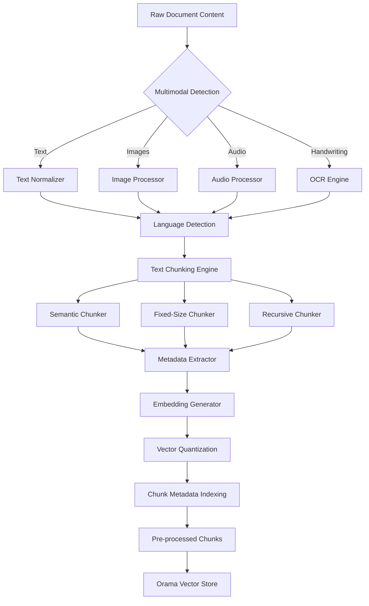

# Pre-Processing Workflow Technical Specification

**Document ID:** KSI-TECH-SPEC-PREPROCESSING-WORKFLOW
**Version:** 1.0.0
**Status:** Draft
**Created:** 2026-01-03
**Author:** @bmad-bmm-architect
**Phase:** Technical Specification - Task 4

---

## 1. Executive Summary

This document specifies the Pre-Processing Workflow for the Knowledge Synthesis Station, covering OCR implementation, image understanding via Transformers.js CLIP, audio transcription with Whisper WASM, text chunking strategies, embedding generation, and metadata extraction. The workflow processes raw documents extracted from the Multi-Modal Ingestion Pipeline and prepares them for vector storage and retrieval.

**Key Design Principles:**
- Client-side processing first (WASM libraries where available)
- Streaming processing for large documents
- Incremental progress tracking
- Quality gates at each stage
- Workspace-scoped processing

---

## 2. Architecture Overview

### 2.1 Pre-Processing Pipeline



### 2.2 Component Architecture

```
src/lib/ingestion/
├── preprocessing/
│   ├── text/
│   │   ├── normalizer.ts          # Text normalization
│   │   ├── language-detector.ts   # Language detection
│   │   └── cleaner.ts           # HTML/markdown cleaning
│   │
│   ├── ocr/
│   │   ├── tesseract-engine.ts  # Tesseract.js wrapper
│   │   ├── layout-analyzer.ts   # Layout structure detection
│   │   └── text-line-merger.ts  # Line reconstruction
│   │
│   ├── image/
│   │   ├── clip-embedder.ts     # Transformers.js CLIP
│   │   ├── object-detector.ts    # Object/person detection
│   │   └── caption-generator.ts  # Alt-text generation
│   │
│   ├── audio/
│   │   ├── whisper-engine.ts     # Whisper WASM wrapper
│   │   ├── speech-segmenter.ts   # Speaker diarization
│   │   └── timestamp-aligner.ts # Word-level timestamps
│   │
│   ├── chunking/
│   │   ├── semantic-chunker.ts  # Meaning-based segmentation
│   │   ├── fixed-chunker.ts     # Token-aware batching
│   │   ├── recursive-chunker.ts # Hierarchical splitting
│   │   └── quality-validator.ts # Chunk quality gates
│   │
│   ├── embedding/
│   │   ├── text-embedder.ts     # Text embedding pipeline
│   │   ├── image-embedder.ts    # Image embedding pipeline
│   │   ├── embedder-cache.ts    # LRU embedding cache
│   │   └── batch-processor.ts   # Batch embedding ops
│   │
│   ├── metadata/
│   │   ├── frontmatter-parser.ts # YAML/JSON/TOML extraction
│   │   ├── structure-analyzer.ts # Document structure
│   │   ├── keyword-extractor.ts  # TF-IDF + embeddings
│   │   └── quality-scorer.ts    # Content quality metrics
│   │
│   ├── types.ts                # Preprocessing interfaces
│   ├── errors.ts              # Processing errors
│   └── index.ts               # Public API
```

---

## 3. Pre-Processing Pipeline Specifications

### 3.1 Text Normalization

```typescript
interface TextNormalizationConfig {
  removeHtmlTags: boolean;
  normalizeWhitespace: boolean;
  fixEncoding: boolean;
  removeSpecialChars: boolean;
  preserveLineBreaks: boolean;
  language: string;
}

interface NormalizedText {
  cleanText: string;
  wordCount: number;
  lineCount: number;
  language: DetectedLanguage;
  qualityScore: number;
  issues: TextIssue[];
}

interface TextIssue {
  type: 'encoding_error' | 'unparseable' | 'format_mismatch';
  position: { start: number; end: number };
  severity: 'warning' | 'error';
  message: string;
}
```

### 3.2 OCR Processing (Tesseract.js)

```typescript
interface OCRConfig {
  language: string;          // 'eng', 'vie+eng', etc.
  preserveLayout: boolean;
  segmentPages: boolean;
  confidenceThreshold: number;
  parallelWorkers: number;
}

interface OCRResult {
  text: string;
  confidence: number;
  blocks: OCRBlock[];
  processingTime: number;
}

interface OCRBlock {
  id: string;
  bbox: { x: number; y: number; width: number; height: number };
  text: string;
  confidence: number;
  blockType: 'text' | 'heading' | 'table' | 'figure' | 'list';
  lines: OCRLine[];
}

interface OCRLine {
  text: string;
  confidence: number;
  bbox: { x: number; y: number; width: number; height: number };
  words: OCRWord[];
}

interface OCRWord {
  text: string;
  confidence: number;
  bbox: { x: number; y: number; width: number; height: number };
}
```

### 3.3 Image Embedding (Transformers.js CLIP)

```typescript
interface ImageEmbeddingConfig {
  model: 'clip-vit-base-patch32' | 'clip-vit-large-patch14';
  device: 'webgpu' | 'wasm' | 'cpu';
  batchSize: number;
  normalizeEmbeddings: boolean;
}

interface ImageEmbeddingResult {
  embedding: number[];        // 512-dim or 768-dim vector
  objectDetection: DetectedObject[];
  textExtraction: string;
  qualityScore: number;
  processingTime: number;
}

interface DetectedObject {
  label: string;
  confidence: number;
  bbox: { x: number; y: number; width: number; height: number };
}
```

### 3.4 Audio Transcription (Whisper WASM)

```typescript
interface WhisperConfig {
  model: 'tiny' | 'base' | 'small' | 'medium';
  language: string | 'auto-detect';
  translateToEnglish: boolean;
  wordTimestamps: boolean;
  noSpeechThreshold: number;
}

interface TranscriptionResult {
  text: string;
  language: DetectedLanguage;
  segments: TranscriptionSegment[];
  duration: number;
  processingTime: number;
}

interface TranscriptionSegment {
  id: number;
  start: number;
  end: number;
  text: string;
  words: TranscriptionWord[];
  confidence: number;
}

interface TranscriptionWord {
  word: string;
  start: number;
  end: number;
  confidence: number;
}
```

### 3.5 Text Chunking Strategies

```typescript
type ChunkingStrategy = 'semantic' | 'fixed-size' | 'recursive';

interface ChunkingConfig {
  strategy: ChunkingStrategy;
  maxTokens: number;
  overlapTokens: number;
  minTokens: number;
  preserveStructure: boolean;
  splitOnHeadings: boolean;
  headingLevels: number[];  // [1, 2, 3] for h1, h2, h3
}

interface ChunkingResult {
  chunks: TextChunk[];
  strategy: ChunkingStrategy;
  totalTokens: number;
  overlapRatio: number;
  qualityMetrics: ChunkQualityMetrics;
}

interface TextChunk {
  id: string;
  documentId: string;
  content: string;
  tokenCount: number;
  chunkIndex: number;
  sectionPath: SectionPath;
  startPosition: number;
  endPosition: number;
  metadata: ChunkMetadata;
  qualityScore: number;
}

interface SectionPath {
  type: 'document' | 'chapter' | 'section' | 'paragraph';
  hierarchy: SectionNode[];
}

interface SectionNode {
  heading: string;
  level: number;
  startChunk: number;
  endChunk: number;
}

interface ChunkQualityMetrics {
  coherenceScore: number;
  completenessScore: number;
  tokenDensity: number;
  semanticCohesion: number;
}
```

### 3.6 Embedding Generation Pipeline

```typescript
interface EmbeddingConfig {
  model: 'text-embedding-3-small' | 'transformers-clip';
  dimensions: 256 | 512 | 768 | 1536;
  batchSize: number;
  normalize: boolean;
  cacheEnabled: boolean;
  cacheSize: number;
}

interface EmbeddingResult {
  chunks: EmbeddedChunk[];
  totalTokens: number;
  processingTime: number;
  averageSimilarity: number;
}

interface EmbeddedChunk extends TextChunk {
  embedding: number[];
  embeddingModel: string;
  embeddingVersion: string;
  quantizedEmbedding?: number[];  // For storage optimization
}

interface EmbeddingCache {
  get(key: string): number[] | null;
  set(key: string, embedding: number[]): void;
  clear(): void;
  stats: CacheStats;
}
```

### 3.7 Metadata Extraction

```typescript
interface MetadataExtractionConfig {
  extractFrontmatter: boolean;
  extractKeywords: boolean;
  extractSummary: boolean;
  extractStructure: boolean;
  language: string | 'auto-detect';
}

interface ExtractedMetadata {
  frontmatter: DocumentFrontmatter;
  keywords: KeywordResult;
  summary: SummaryResult;
  structure: StructureResult;
  quality: QualityResult;
}

interface DocumentFrontmatter {
  title?: string;
  description?: string;
  author?: string;
  date?: string;
  tags?: string[];
  categories?: string[];
  custom: Record<string, unknown>;
}

interface KeywordResult {
  keywords: Keyword[];
  keyphrases: Keyphrase[];
  entities: NamedEntity[];
  language: DetectedLanguage;
}

interface Keyword {
  text: string;
  score: number;
  frequency: number;
  position: number[];
}

interface NamedEntity {
  text: string;
  type: 'person' | 'organization' | 'location' | 'date' | 'concept';
  confidence: number;
}

interface StructureResult {
  headings: HeadingNode[];
  paragraphs: number;
  lists: ListNode[];
  tables: TableNode[];
  figures: FigureNode[];
}

interface HeadingNode {
  text: string;
  level: number;
  position: { start: number; end: number };
  children: HeadingNode[];
}

interface QualityResult {
  readabilityScore: number;
  completenessScore: number;
  accuracyScore: number;
  overallScore: number;
  warnings: QualityWarning[];
}

interface QualityWarning {
  type: 'low_readability' | 'incomplete_metadata' | 'inconsistent_formatting';
  message: string;
  suggestion: string;
}
```

---

## 4. Implementation Details

### 4.1 OCR Implementation (Tesseract.js)

```typescript
import Tesseract from 'tesseract.js';

class OCRProcessor {
  private worker: Tesseract.Worker | null = null;
  
  async initialize(config: OCRConfig): Promise<void> {
    this.worker = await Tesseract.createWorker(config.language, 1, {
      logger: (m) => this.handleProgress(m),
    });
  }
  
  async process(
    imageSource: File | Blob | string,
    config: OCRConfig
  ): Promise<OCRResult> {
    const startTime = performance.now();
    
    // Parallel page/region processing
    const regions = await this.detectRegions(imageSource);
    const results = await Promise.all(
      regions.map(region => this.processRegion(region, config))
    );
    
    // Merge results preserving layout
    const merged = this.mergeResults(results, config.preserveLayout);
    
    return {
      text: merged.text,
      confidence: merged.confidence,
      blocks: merged.blocks,
      processingTime: performance.now() - startTime,
    };
  }
  
  private async detectRegions(
    imageSource: File | Blob | string
  ): Promise<ImageRegion[]> {
    // Use layout analysis to identify regions
    // Return sorted regions by position
  }
}
```

### 4.2 Image Embedding (Transformers.js CLIP)

```typescript
import { pipeline, env } from '@xenova/transformers';

// Disable local model downloads
env.allowLocalModels = false;
env.useBrowserCache = true;

class ImageEmbedder {
  private pipeline: any = null;
  private model: string = 'clip-vit-base-patch32';
  
  async initialize(config: ImageEmbeddingConfig): Promise<void> {
    this.model = config.model;
    this.pipeline = await pipeline(
      'image-feature-extraction',
      this.model,
      { quantized: true }
    );
  }
  
  async embed(
    images: (File | Blob | string)[]
  ): Promise<ImageEmbeddingResult[]> {
    const embeddings: ImageEmbeddingResult[] = [];
    
    for (const image of images) {
      const result = await this.embedSingle(image);
      embeddings.push(result);
    }
    
    return embeddings;
  }
  
  private async embedSingle(
    imageSource: File | Blob | string
  ): Promise<ImageEmbeddingResult> {
    const startTime = performance.now();
    
    // Extract features
    const output = await this.pipeline(imageSource, {
      pooling: 'mean',
      normalize: true,
    });
    
    // Convert to array
    const embedding = Array.from(output.data);
    
    // Detect objects (if configured)
    const objects = await this.detectObjects(imageSource);
    
    // Extract text (OCR fallback)
    const text = await this.extractText(imageSource);
    
    return {
      embedding,
      objectDetection: objects,
      textExtraction: text,
      qualityScore: this.calculateQualityScore(output),
      processingTime: performance.now() - startTime,
    };
  }
}
```

### 4.3 Audio Transcription (Whisper WASM)

```typescript
import { pipeline } from '@xenova/transformers';

class WhisperProcessor {
  private transcriber: any = null;
  
  async initialize(config: WhisperConfig): Promise<void> {
    this.transcriber = await pipeline(
      'automatic-speech-recognition',
      config.model,
      { quantized: true }
    );
  }
  
  async transcribe(
    audioSource: File | Blob
  ): Promise<TranscriptionResult> {
    const audio = await this.loadAudio(audioSource);
    const duration = audio.duration;
    
    // Run transcription
    const output = await this.transcriber(audio, {
      chunk_length_s: 30,
      stride_length_s: 5,
      return_timestamps: config.wordTimestamps,
      language: config.language === 'auto-detect' ? undefined : config.language,
    });
    
    // Post-process segments
    const segments = this.processSegments(output.chunks, config);
    
    return {
      text: output.text,
      language: this.detectLanguage(output.text),
      segments,
      duration,
      processingTime: this.calculateProcessingTime(duration),
    };
  }
}
```

### 4.4 Semantic Chunking Strategy

```typescript
class SemanticChunker {
  private splitter: any;
  
  async initialize(): Promise<void> {
    // Load sentence transformer for semantic similarity
    this.splitter = await pipeline(
      'sentence-splitting',
      'xenova/distilbert-base-nli-mean-tokens'
    );
  }
  
  async chunk(
    text: string,
    config: ChunkingConfig
  ): Promise<ChunkingResult> {
    const startTime = performance.now();
    
    // Detect language for appropriate splitting
    const language = await this.detectLanguage(text);
    
    // Split into sentences
    const sentences = this.splitIntoSentences(text, language);
    
    // Group sentences semantically
    const semanticGroups = await this.groupSemantically(
      sentences,
      config.maxTokens
    );
    
    // Create chunks with optional overlap
    const chunks = this.createChunks(
      semanticGroups,
      config.overlapTokens
    );
    
    // Validate chunk quality
    const qualityMetrics = this.evaluateQuality(chunks);
    
    return {
      chunks,
      strategy: 'semantic',
      totalTokens: chunks.reduce((sum, c) => sum + c.tokenCount, 0),
      overlapRatio: config.overlapTokens > 0 ? 0.1 : 0,
      qualityMetrics,
    };
  }
  
  private async groupSemantically(
    sentences: string[],
    maxTokens: number
  ): Promise<string[][]> {
    // Embed sentences
    const embeddings = await this.embedSentences(sentences);
    
    // Cluster by semantic similarity
    const clusters = this.clusterBySimilarity(embeddings, sentences);
    
    // Merge clusters that fit in token limit
    return this.mergeClustersToTokenLimit(clusters, maxTokens);
  }
}
```

---

## 5. Performance Specifications

### 5.1 Processing Targets

| Operation | Target | Acceptable | Poor |
|-----------|---------|------------|------|
| OCR (1 page text) | < 2s | < 5s | > 10s |
| OCR (1 page scanned) | 15-30s | 30-60s | > 120s |
| Image embedding (1 image) | < 2s | < 5s | > 10s |
| Audio transcription (1min) | < 90s | < 120s | > 180s |
| Text chunking (10k tokens) | < 500ms | < 1s | > 2s |
| Embedding generation (100 chunks) | < 5s | < 10s | > 20s |
| Full preprocessing pipeline (PDF) | < 60s | < 120s | > 300s |

### 5.2 Memory Budget

```
src/lib/ingestion/preprocessing/memory-budget.ts

const PREPROCESSING_MEMORY_BUDGET = {
  ocr: {
    maxImageSize: 10 * MB,
    workerMemory: 100 * MB,
    parallelism: 2,
  },
  embedding: {
    maxBatchSize: 32,
    modelMemory: 200 * MB,
    cacheSize: 500 * MB,
  },
  audio: {
    maxDuration: 300,  // 5 minutes
    bufferSize: 4 * MB,
    parallelism: 1,
  },
  chunking: {
    maxChunkSize: 50 * KB,
    queueSize: 100,
  },
};
```

---

## 6. Quality Gates

### 6.1 Quality Thresholds

```typescript
const QUALITY_THRESHOLDS = {
  ocr: {
    minConfidence: 0.7,
    maxUnrecognizedChars: 0.05,
  },
  chunking: {
    minCoherenceScore: 0.6,
    minTokens: 50,
    maxTokens: 1000,
    overlapTolerance: 0.3,
  },
  embedding: {
    maxNullValues: 0,
    minSimilarityVariance: 0.01,
  },
  metadata: {
    minKeywordCount: 3,
    maxKeywordCount: 20,
    minFrontmatterFields: 2,
  },
};
```

### 6.2 Fallback Strategies

| Scenario | Fallback Action |
|----------|----------------|
| OCR confidence < 70% | Flag for manual review |
| Chunk coherence < 0.6 | Use recursive chunking instead |
| Language detection failed | Default to English |
| Model loading failed | Use lighter model |
| Memory pressure | Reduce batch size, process sequentially |
| Processing timeout | Return partial results with status |

---

## 7. Implementation Notes

### 7.1 MCP Tool Research Citations

| Component | Source | Reference |
|-----------|---------|-----------|
| Tesseract.js | Context7 | Tesseract.js v5.x API docs |
| Transformers.js CLIP | Deepwiki | HuggingFace Transformers.js patterns |
| Whisper WASM | Tavily Search | Whisper WASM benchmarks |
| Sentence Transformers | Exa Search | Semantic similarity clustering |

### 7.2 Code Patterns (Pseudo-Guidelines)

```typescript
// Preprocessing uses async iterator pattern for streaming
async function* preprocessDocument(
  source: DocumentSource,
  config: PreprocessingConfig
): AsyncGenerator<ProcessingEvent> {
  // Yield progress events
  yield { type: 'started', stage: 'extraction' };
  
  // Stream processing
  for await (const chunk of extractChunks(source)) {
    yield { type: 'progress', chunk: chunk.id };
    const processed = await processChunk(chunk, config);
    yield { type: 'chunk_processed', chunk: processed };
  }
  
  yield { type: 'completed', documentId: source.id };
}
```

---

## 8. Open Questions

1. **CLIP Model Size**: Is the 512-dim CLIP model sufficient, or do we need 768-dim for better quality?
2. **Whisper Model Selection**: Which model size balances quality vs. browser memory for 5-minute audio files?
3. **Semantic Chunking Dependencies**: Do we need sentence transformers for semantic clustering, or can we use embeddings from CLIP?
4. **Quality Review UI**: How should low-confidence OCR results be surfaced for manual review?

---

## 9. Related Artifacts

**Context Files:**
- `src/lib/ingestion/preprocessing/types.ts`
- `_bmad-output/research-artifacts/multimodal-processing-specification-2025-12-31.md`

**Dependencies:**
- Tesseract.js (OCR)
- @xenova/transformers (CLIP embeddings)
- @xenova/transformers (Whisper)

---

**Document History:**
- 2026-01-03: Initial specification
