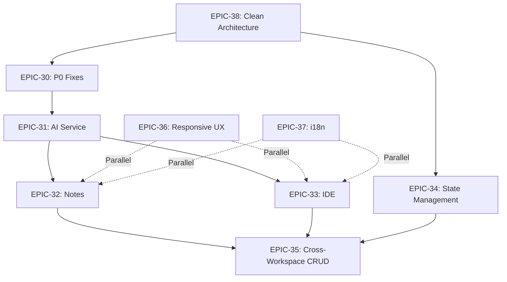

# Project Epics - Via-Gent (Project Alpha v2.0)

**Version**: 1.0.0
**Generated**: 2026-01-08
**Phase**: Sprint Planning
**Status**: Ready for Implementation
**Total Epics**: 9
**Total Stories**: 78
**Total Effort**: ~180 hours

---

## Executive Summary

This document defines all project epics for Via-Gent based on the Architecture Generation Sprint outputs (2026-01-07 → 2026-01-08). The epics are prioritized using an **Architecture-First Approach** that prioritizes critical path blockers (P0) before feature completion (P1/P2).

**Key Decision**: Execute EPIC-38 (Clean Architecture Compliance) before feature epics to prevent technical debt compounding.

**Sprint Structure**:
```
Phase 1 (2 days): EPIC-38 Clean Architecture - 18 stories, ~33 hours
Phase 2 (1 day): EPIC-30 P0 Critical Fixes - 6 stories, ~8 hours
Phase 3 (3-4 days): EPIC-31 through EPIC-37 (Feature epics)
```

**Priority Breakdown**:
- **P0 (Critical)**: EPIC-38, EPIC-30 (~41 hours, 24 stories)
- **P1 (High)**: EPIC-31, EPIC-32, EPIC-33, EPIC-34 (~86 hours, 38 stories)
- **P2 (Medium)**: EPIC-35, EPIC-36, EPIC-37 (~53 hours, 16 stories)

**Total Timeline**: ~180 hours (4-5 weeks with 2 parallel teams)

---

## EPIC-38: Clean Architecture Compliance

**Priority**: P0 - Critical Path Blocker
**Status**: IN_PROGRESS (Course Correction Applied 2026-01-08)
**Stories**: 21 (was 18, +3 new domain entity stories)
**Effort**: ~41-43 hours (was ~33h, revised after ultrathink analysis)
**Dependencies**: None (foundation epic)

**⚠️ Course Correction Applied**: 2026-01-08T04:04:14+07:00
- **Trigger**: Story 38-04 research discovered 130 infrastructure→lib violations (not 32)
- **Decision**: Option B (Create Domain Layer First) APPROVED
- **New Stories**: 38-05b (RAG), 38-05c (Knowledge), 38-05d (Study)
- **Blocked Story**: 38-04 (unblocks after domain types created)
- **Reference**: `_bmad-output/handoffs/epic-38-course-correction-approved-2026-01-08.md`

**Business Value**:
- Current Clean Architecture compliance: 65% (not 75% as documented)
- 130 import direction violations detected (actual count, was 32 estimated)
- 3 god stores exceeding 300-line limit
- Domain layer EXISTS but needs entity extraction from lib/
- Building features on violating architecture = technical debt compounding

**Success Criteria**:
1. 100% Clean Architecture layer compliance (infrastructure → domain → core only)
2. Zero import direction violations (130 → 0)
3. All god components <300 lines
4. Domain entities extracted and reusable (RAG, Knowledge, Study, Project, Workspace)

### Stories

| Story ID | Title | Effort | Priority | Acceptance Criteria |
|----------|-------|--------|----------|---------------------|
| **38-01** | Move sync-types.ts to infrastructure/sync/types | 1h | P0 | - SyncError, SyncStatus moved to infrastructure/sync/types<br>- 32 imports updated to new location<br>- Facade exports in lib/filesystem for backward compatibility |
| **38-02** | Move file system adapters to infrastructure/filesystem | 2h | P0 | - LocalFSAdapter moved to infrastructure/filesystem/<br>- SyncManager moved to infrastructure/sync/<br>- All infrastructure imports updated |
| **38-03** | Create facade exports in lib/filesystem | 1h | P0 | - lib/filesystem/index.ts re-exports from infrastructure<br>- Zero breaking changes to existing imports<br>- Deprecation warnings added |
| **38-04** | Update 130 infrastructure→domain imports | 4h | P0 | ⚠️ **BLOCKED** until 38-05, 38-05b, 38-05c, 38-05d, 38-06 complete<br>- All 130 violations fixed (was 32 estimated)<br>- Import direction: infrastructure → domain only<br>- Zero circular dependencies |
| **38-05** | Create domain/entities/Project.ts | 2h | P0 | - Project entity with id, name, workspaceBindings, permissions<br>- Pure TypeScript (no framework imports)<br>- 100% testable without mocking<br>- Follow Agent.ts pattern (already exists in domain/entities/) |
| **38-05b** | Create domain/entities/rag.ts | 3h | P0 | **NEW** (Course Correction 2026-01-08)<br>- Extract from lib/rag/types.ts (~530 lines): DocumentSchema, SearchResult, IndexMetadata, ChunkMetadata, ChatMessage, Citation, etc.<br>- Pure TypeScript (no framework imports)<br>- Barrel export: domain/entities/rag/index.ts<br>- Update 35 infrastructure imports |
| **38-05c** | Create domain/entities/knowledge.ts | 1.5h | P0 | **NEW** (Course Correction 2026-01-08)<br>- Extract from lib/knowledge/types.ts (~135 lines): Flashcard, FlashcardSet, FlashcardPreview, FlashcardFilter, etc.<br>- Include Zod schemas for domain validation<br>- Barrel export: domain/entities/knowledge/index.ts<br>- Update 20 infrastructure imports |
| **38-05d** | Create domain/entities/study.ts | 2h | P0 | **NEW** (Course Correction 2026-01-08)<br>- Extract from lib/study/*: SRSData, StudySession, Quiz types<br>- Pure TypeScript (no framework imports)<br>- Barrel export: domain/entities/study/index.ts<br>- Update 17 infrastructure imports |
| **38-06** | Create domain/entities/Workspace.ts | 1.5h | P0 | - Workspace entity with type, layout, preferences<br>- ~~Agent entity~~ **Agent.ts ALREADY EXISTS** in domain/entities/ (208 lines)<br>- Reduced scope: Workspace.ts only |
| **38-07** | Update infrastructure to import from domain entities | 2h | P0 | - All stores import Project/Workspace/Agent from domain<br>- Zero duplicate type definitions<br>- Type consistency across layers |
| **38-08** | Update application layer to use domain entities | 2h | P0 | - lib/agent/ imports entities from domain/<br>- lib/workspace/ imports entities from domain/<br>- 8 violations from Category 2 fixed |
| **38-09** | Define WorkspaceRepository interface | 1.5h | P1 | - Interface in domain/repositories/<br>- Methods: findById, save, delete, findAll<br>- Zero framework dependencies |
| **38-10** | Define AgentRepository and ProjectRepository interfaces | 1.5h | P1 | - AgentRepository: CRUD + workspace filtering<br>- ProjectRepository: CRUD + metadata queries<br>- Both in domain/repositories/ |
| **38-11** | Implement ZustandWorkspaceRepository | 2h | P1 | - Implements WorkspaceRepository interface<br>- Delegates to useWorkspaceStore internally<br>- Infrastructure layer implementation |
| **38-12** | Implement ZustandAgentRepository | 2h | P1 | - Implements AgentRepository interface<br>- Delegates to useAgentsStore internally<br>- Zero business logic (state management only) |
| **38-13** | Create DI ServiceContainer | 1.5h | P1 | - Lightweight DI container for repository injection<br>- Registers repositories by interface<br>- Supports singleton lifecycle |
| **38-14** | Migrate application layer to repositories | 3h | P1 | - lib/agent/ uses AgentRepository interface<br>- lib/workspace/ uses WorkspaceRepository interface<br>- Zero direct store imports from lib/ |
| **38-15** | Extract workspace-context.ts from unified context | 2h | P1 | - Split unified-workspace-context.ts (368 lines)<br>- Extract workspace-specific state to workspace-context.ts<br>- Reduce file size to <200 lines |
| **38-16** | Extract file-system-context.tsx | 2h | P1 | - Extract file system state from unified context<br>- Separate provider: FileSystemProvider<br>- Composition root: UnifiedWorkspaceProvider |
| **38-17** | Create UnifiedWorkspaceProvider (composition) | 2h | P1 | - Composes WorkspaceProvider + FileSystemProvider<br>- Single entry point for workspace context<br>- No mixed concerns (separation of concerns) |
| **38-18** | Install ESLint import plugin and configure rules | 1.5h | P2 | - eslint-plugin-import installed<br>- Rule: no infrastructure importing from lib/<br>- CI block on import violations |

**Total Effort**: ~41-43 hours (revised from ~33h after course correction 2026-01-08)

**Dependencies** (Revised 2026-01-08):
- **Track A**: Stories 38-01 → 38-02 → 38-03 (sync types, can run parallel to Track B)
- **Track B**: Stories 38-05 → [38-05b, 38-05c, 38-05d in parallel] → 38-06 (domain entities)
- **BLOCKED**: Story 38-04 unblocks after Track A AND Track B complete
- **Sequential**: 38-04 → 38-07 → 38-08 (import updates after domain types ready)
- Stories 38-09 → 38-10 → 38-11 → 38-12 → 38-13 → 38-14 (repository pattern)
- Stories 38-15 → 38-16 → 38-17 (sequential, context refactoring)
- Story 38-18 independent (can run in parallel after 38-04)

**Risk Assessment**:
- **High Risk**: Import direction fixes (38-04) - test all 32 affected files
- **Medium Risk**: Repository pattern (38-11 to 38-14) - ensure no regression
- **Low Risk**: Entity extraction (38-05 to 38-08) - additive changes
- **Mitigation**: Run TypeScript check after each story, incremental testing

---

## EPIC-30: P0 Critical Fixes

**Priority**: P0 - Critical Blockers
**Status**: READY
**Stories**: 6
**Effort**: ~8 hours
**Dependencies**: None

**Business Value**:
- 9 P0 bugs causing crashes (WSOD, redirect loops, race conditions)
- Error boundary coverage: 22.2% → 80% target
- Missing exports causing runtime errors
- Hardcoded providers bypassing permissions

**Success Criteria**:
1. All P0 bugs from PRD Section 4.1 resolved
2. Error boundary coverage 80%+ (from 22.2%)
3. Zero WSOD (White Screen of Death) incidents
4. All workspace routes protected by error boundaries

### Stories

| Story ID | Title | Effort | Priority | Acceptance Criteria |
|----------|-------|--------|----------|---------------------|
| **30-01** | Add ErrorBoundaries to all workspace routes | 2h | P0 | - ErrorBoundary on /ide, /knowledge, /notes, /study<br>- Fallback UI with error message + retry button<br>- Error logging to console + monitoring |
| **30-02** | Fix missing useProjectStats export | 1h | P0 | - useProjectStats exported from stats.ts<br>- Import errors resolved<br>- Build passes with zero errors |
| **30-03** | Fix redirect loop prevention | 1.5h | P0 | - Event bus emits WORKSPACE_CHANGE before route change<br>- Redirect loop detection in router<br>- Zero infinite loops on workspace switch |
| **30-04** | Integrate BYOK vault with all providers | 2h | P0 | - All providers read from credential vault<br>- Zero hardcoded API keys<br>- Vault encryption verified (AES-256-GCM) |
| **30-05** | Fix workspace access race conditions | 1h | P0 | - Workspace state initialized before route render<br>- Race condition tests pass<br>- Zero "workspace not found" errors |
| **30-06** | Add error boundary coverage monitoring | 0.5h | P0 | - Coverage metric tracked in CI<br>- Target: 80%+ coverage<br>- Automated tests for error scenarios |

**Total Effort**: ~8 hours

**Dependencies**:
- Story 30-01 (ErrorBoundaries) unblocks all other error handling
- Stories 30-02 to 30-05 can run in parallel

**Risk Assessment**:
- **Low Risk**: All fixes are well-scoped with clear acceptance criteria
- **Mitigation**: Test each workspace route after adding ErrorBoundaries

---

## EPIC-31: AI Service Unification

**Priority**: P1 - High
**Status**: READY
**Stories**: 8
**Effort**: ~12 hours
**Dependencies**: EPIC-38 (Clean Architecture), EPIC-30 (Critical Fixes)

**Business Value**:
- Three disjoint AI invocation patterns causing security vulnerabilities
- Notes AI bypasses unified system
- Hardcoded providers bypass permissions
- Maintenance burden of duplicate code

**Success Criteria**:
1. Single AgentExecutionService for all AI invocations
2. Notes AI migrated to unified service
3. Zero hardcoded providers
4. BYOK vault integrated across all providers

**Reference**: ADR-026 (AI Service Unification)

### Stories

| Story ID | Title | Effort | Priority | Acceptance Criteria |
|----------|-------|--------|----------|---------------------|
| **31-01** | Implement AgentExecutionService core | 2h | P1 | - Single entry point for all AI invocations<br>- Provider-agnostic interface<br>- Tool execution pipeline integrated |
| **31-02** | Migrate IDE workspace AI to unified service | 1.5h | P1 | - IDE agent chat uses AgentExecutionService<br>- Zero direct provider calls<br>- Permissions enforced via tool-permission-manager |
| **31-03** | Migrate Notes AI to unified service | 2h | P1 | - Notes AITransformMenu uses unified service<br>- Zero hardcoded provider references<br>- Consistent tool approval flow |
| **31-04** | Migrate Knowledge workspace AI | 1.5h | P1 | - Knowledge RAG agent uses unified service<br>- Embedding generation consistent<br>- Permission checks applied |
| **31-05** | Integrate BYOK vault with all providers | 2h | P1 | - All providers read from credential vault<br>- Zero API keys in code<br>- Vault encryption verified |
| **31-06** | Add agent deep think flags | 1h | P1 | - Agent.deepThinkEnabled flag<br>- Agent.memoryEnabled flag<br>- UI toggles in AgentConfigDialog |
| **31-07** | Remove duplicate AI invocation code | 1h | P1 | - Delete old AI service files<br>- Zero duplicate patterns<br>- Code reduction: ~200 lines |
| **31-08** | Add AI service monitoring | 1h | P1 | - Response time tracking<br>- Error rate monitoring<br>- Provider performance metrics |

**Total Effort**: ~12 hours

**Dependencies**:
- EPIC-38 (Clean Architecture) - domain entities required
- EPIC-30 (Critical Fixes) - stable codebase before refactoring
- Stories 31-01 → 31-02 → 31-03 → 31-04 (sequential migration)

**Risk Assessment**:
- **Medium Risk**: Migrating Notes AI (31-03) - heavily used feature
- **Mitigation**: Incremental migration, feature flags for rollback

---

## EPIC-32: Notes Workspace Full Features

**Priority**: P1 - High
**Status**: READY
**Stories**: 12
**Effort**: ~18 hours
**Dependencies**: EPIC-31 (AI Service Unification)

**Business Value**:
- Notes workspace is primary user-facing feature
- Markdown → BlockNote parser missing
- Local filesystem sync incomplete
- CRUD operations not fully implemented

**Success Criteria**:
1. Complete Markdown ↔ BlockNote bidirectional parsing
2. Local filesystem sync (read/write notes)
3. Full CRUD operations (create, read, update, delete)
4. AI-powered transformations (summarize, expand, rewrite)

**Reference**: UX Specification Section 3 (Notes Workspace)

### Stories

| Story ID | Title | Effort | Priority | Acceptance Criteria |
|----------|-------|--------|----------|---------------------|
| **32-01** | Implement Markdown to BlockNote parser | 3h | P1 | - Markdown → BlockNote conversion<br>- Preserve headings, lists, code blocks<br>- Zero data loss in conversion |
| **32-02** | Implement BlockNote to Markdown serializer | 2h | P1 | - BlockNote → Markdown conversion<br>- Preserve formatting, links, embeddings<br>- Round-trip conversion tested |
| **32-03** | Add local filesystem read (notes) | 1.5h | P1 | - Load .md files from local FS<br>- Display notes list in sidebar<br>- File metadata (name, size, modified) |
| **32-04** | Add local filesystem write (notes) | 2h | P1 | - Save notes to local FS<br>- Create new .md files<br>- Update existing files |
| **32-05** | Implement note CRUD operations | 2h | P1 | - Create note (file system + IndexedDB)<br>- Read note (load into editor)<br>- Update note (auto-save)<br>- Delete note (confirm dialog) |
| **32-06** | Add note list with search/filter | 1.5h | P1 | - Search notes by title/content<br>- Filter by creation date<br>- Sort by name/modified |
| **32-07** | Integrate AI transformations (summarize) | 2h | P1 | - Summarize selected text<br>- Replace original or create new<br>- Streaming response UI |
| **32-08** | Integrate AI transformations (expand) | 1.5h | P1 | - Expand selected text<br>- Generate detailed content<br>- Insert at cursor or replace |
| **32-09** | Integrate AI transformations (rewrite) | 1.5h | P1 | - Rewrite tone (formal/casual)<br>- Rewrite style (concise/verbose)<br>- Multiple options preview |
| **32-10** | Add note sharing (export) | 1h | P1 | - Export as Markdown<br>- Export as PDF<br>- Copy to clipboard |
| **32-11** | Add note collaboration (real-time) | 0h | P2 | - DEFERRED to future sprint<br>- Requires WebSocket infrastructure |
| **32-12** | Mobile-responsive notes UI | 0h | P2 | - Mobile layout tested<br>- Touch targets ≥44px<br>- See EPIC-36 (Responsive UX) |

**Total Effort**: ~18 hours

**Dependencies**:
- EPIC-31 (AI Service Unification) for AI transformations
- Stories 32-01 + 32-02 required before 32-03 (parser needed)
- Stories 32-03 → 32-04 → 32-05 (sequential, read → write → CRUD)

**Risk Assessment**:
- **Medium Risk**: Markdown ↔ BlockNote conversion (32-01, 32-02) - complex parsing
- **Mitigation**: Test with 50+ real-world markdown files, edge cases

---

## EPIC-33: IDE Workspace Full Features

**Priority**: P1 - High
**Status**: READY
**Stories**: 10
**Effort**: ~16 hours
**Dependencies**: EPIC-31 (AI Service Unification)

**Business Value**:
- IDE workspace is core development environment
- Terminal, file tree, editor integration incomplete
- WebContainer lifecycle management needs polish
- Git integration planned but not started

**Success Criteria**:
1. Full terminal integration (shell commands, output streaming)
2. File tree with drag-drop file operations
3. Monaco editor with all language features
4. WebContainer lifecycle stable (no crashes)

**Reference**: UX Specification Section 2 (IDE Workspace)

### Stories

| Story ID | Title | Effort | Priority | Acceptance Criteria |
|----------|-------|--------|----------|---------------------|
| **33-01** | Complete terminal integration | 2h | P1 | - Shell commands execute in WebContainer<br>- Output streaming (stdout/stderr)<br>- Command history (up/down arrows) |
| **33-02** | Add terminal tabs (multiple shells) | 1.5h | P1 | - Create/close terminal tabs<br>- Independent shell sessions<br>- Tab switching preserves state |
| **33-03** | Implement file tree with drag-drop | 2h | P1 | - File tree displays project structure<br>- Drag files to move<br>- Drop to reorder<br>- Context menu (rename, delete) |
| **33-04** | Add file search/filter in tree | 1h | P1 | - Search files by name<br>- Filter by extension<br>- Highlight matches |
| **33-05** | Complete Monaco editor integration | 2h | P1 | - Syntax highlighting (10+ languages)<br>- Auto-indentation<br>- Code folding<br>- Minimap |
| **33-06** | Add Monaco language features | 2h | P1 | - IntelliSense (autocomplete)<br>- Go to definition<br>- Find references<br>- Rename symbol |
| **33-07** | Stabilize WebContainer lifecycle | 2h | P1 | - Boot on project open<br>- Shutdown on project close<br>- Zero memory leaks<br>- Handle crashes gracefully |
| **33-08** | Add file operations (create/delete) | 1.5h | P1 | - Create new files from UI<br>- Delete files with confirm<br>- Update file tree automatically |
| **33-09** | Integrate Git commands | 0h | P2 | - DEFERRED to future sprint<br>- Git status, commit, push/pull<br>- Requires isomorphic-git integration |
| **33-10** | Mobile-responsive IDE UI | 0h | P2 | - Mobile layout tested<br>- Collapsible panels<br>- See EPIC-36 (Responsive UX) |

**Total Effort**: ~16 hours

**Dependencies**:
- EPIC-31 (AI Service Unification) for AI-powered code assistance
- Stories 33-01 → 33-02 (terminal foundation before tabs)
- Stories 33-03 → 33-04 (file tree before search)

**Risk Assessment**:
- **Medium Risk**: Monaco language features (33-06) - complex integration
- **Mitigation**: Use Monaco Editor API, test with multiple languages

---

## EPIC-34: State Management Consolidation

**Priority**: P1 - High
**Status**: READY
**Stories**: 8
**Effort**: ~14 hours
**Dependencies**: EPIC-38 (Clean Architecture)

**Business Value**:
- 9 god stores exceeding 300-line limit
- Cross-store circular dependencies detected
- Zustand v5 migration incomplete
- Duplicate provider stores (3 locations)

**Success Criteria**:
1. All god stores split into focused slices (<120 lines each)
2. Zero circular dependencies between stores
3. Zustand v5 fully migrated
4. Dexie persistence consolidated

**Reference**: ADR-027 (State Management Consolidation)

### Stories

| Story ID | Title | Effort | Priority | Acceptance Criteria |
|----------|-------|--------|----------|---------------------|
| **34-01** | Split unified-workspace-context (368 lines) | 3h | P1 | - Extract to 3 focused contexts (~120 lines each)<br>- workspace-context.ts (workspace state)<br>- file-system-context.ts (FS state)<br>- Combined via UnifiedWorkspaceProvider |
| **34-02** | Split plugins-store (317 lines) | 2h | P1 | - Extract to plugin-metadata-slice.ts<br>- Extract to plugin-permissions-slice.ts<br>- Extract to plugin-ui-slice.ts<br>- Combined store with slice composition |
| **34-03** | Split schema-migrations (315 lines) | 2h | P1 | - Extract migration-definitions-slice.ts<br>- Extract migration-execution-slice.ts<br>- Extract migration-history-slice.ts<br>- Combined store with slice composition |
| **34-04** | Complete Zustand v5 migration | 3h | P1 | - All stores use Zustand v5 patterns<br>- Persist middleware on combined store only<br>- partialize functions optimized |
| **34-05** | Eliminate cross-store circular dependencies | 2h | P1 | - Use event bus for cross-store communication<br>- Zero direct store imports from other stores<br>- Dependency graph acyclic |
| **34-06** | Consolidate duplicate provider stores | 1h | P1 | - Merge 3 provider stores into 1<br>- Update all imports<br>- Zero breaking changes (facade) |
| **34-07** | Optimize Dexie persistence hydration | 1h | P1 | - Hydration time <100ms<br>- IndexedDB queries optimized<br>- Cache frequently accessed data |
| **34-08** | Add store migration scripts | 0h | P2 | - Data migration from old stores to new<br>- Zero data loss<br>- Rollback support |

**Total Effort**: ~14 hours

**Dependencies**:
- EPIC-38 (Clean Architecture) - domain entities required
- Stories 34-01, 34-02, 34-03 can run in parallel
- Story 34-05 requires 34-01, 34-02, 34-03 complete

**Risk Assessment**:
- **High Risk**: Splitting unified-workspace-context (34-01) - heavily used
- **Mitigation**: Facade exports for backward compatibility, thorough testing

---

## EPIC-35: Cross-Workspace CRUD

**Priority**: P2 - Medium
**Status**: READY
**Stories**: 6
**Effort**: ~10 hours
**Dependencies**: EPIC-32 (Notes), EPIC-33 (IDE), EPIC-34 (State)

**Business Value**:
- Data flow between workspaces incomplete
- No cross-workspace references
- Knowledge → Notes transfer missing
- IDE → Knowledge sync incomplete

**Success Criteria**:
1. Create note from Knowledge source
2. Export IDE code to Knowledge
3. Cross-workspace file references
4. Unified clipboard across workspaces

**Reference**: Architecture Section 3.2 (Cross-Workspace Communication)

### Stories

| Story ID | Title | Effort | Priority | Acceptance Criteria |
|----------|-------|--------|----------|---------------------|
| **35-01** | Create note from Knowledge source | 2h | P2 | - "Create Note" action in Knowledge<br>- Copy source content to note<br>- Link back to original source |
| **35-02** | Export IDE code to Knowledge | 2h | P2 | - "Save to Knowledge" action in IDE<br>- Copy code block with syntax highlighting<br>- Add metadata (file, line, timestamp) |
| **35-03** | Add cross-workspace file references | 2h | P2 | - Reference notes from IDE<br>- Reference knowledge from notes<br>- Click to navigate |
| **35-04** | Implement unified clipboard | 1.5h | P2 | - Copy in one workspace, paste in another<br>- Preserve formatting<br>- Work across all 4 workspaces |
| **35-05** | Add workspace switch animation | 1h | P2 | - Smooth transition between workspaces<br>- State preserved during switch<br>- Switch time <500ms |
| **35-06** | Add cross-workspace search | 1.5h | P2 | - Search across all workspaces<br>- Unified results view<br>- Filter by workspace type |

**Total Effort**: ~10 hours

**Dependencies**:
- EPIC-32 (Notes) must be complete for note creation
- EPIC-33 (IDE) must be complete for code export
- EPIC-34 (State) for workspace state management

**Risk Assessment**:
- **Low Risk**: All features are additive, no refactoring
- **Mitigation**: Test cross-workspace data flow thoroughly

---

## EPIC-36: Responsive UX

**Priority**: P2 - Medium
**Status**: READY
**Stories**: 8
**Effort**: ~12 hours
**Dependencies**: None

**Business Value**:
- Mobile-first design not fully implemented
- Touch targets <44px on mobile
- Layout breaks on small screens
- Command palette incomplete on mobile

**Success Criteria**:
1. Mobile layouts for all 4 workspaces
2. Touch targets ≥44px (WCAG compliance)
3. Command palette works on mobile
4. File tree responsive on mobile

**Reference**: UX Specification Section 6 (Mobile Responsiveness)

### Stories

| Story ID | Title | Effort | Priority | Acceptance Criteria |
|----------|-------|--------|----------|---------------------|
| **36-01** | Mobile-responsive IDE layout | 2h | P2 | - Panels collapse on mobile<br>- File tree drawer (slide-in)<br>- Editor full-width on mobile |
| **36-02** | Mobile-responsive Notes layout | 1.5h | P2 | - Note list drawer on mobile<br>- Editor full-width<br>- Toolbar at bottom (thumb zone) |
| **36-03** | Mobile-responsive Knowledge layout | 1.5h | P2 | - Source list drawer on mobile<br>- Canvas full-width<br>- Search bar fixed at top |
| **36-04** | Mobile-responsive Study layout | 1h | P2 | - Quiz cards stack vertically<br>- Full-width options<br>- Progress bar at top |
| **36-05** | Fix touch targets (<44px) | 2h | P2 | - All buttons ≥44px on mobile<br>- Touch-friendly spacing<br>- WCAG 2.1 AAA compliant |
| **36-06** | Mobile command palette | 2h | P2 | - Keyboard shortcut (Ctrl+P) works<br>- Touch-optimized UI<br>- Search commands on mobile |
| **36-07** | Mobile file tree | 1h | P2 | - Slide-in drawer on mobile<br>- Swipe to close<br>- File/folder icons ≥44px |
| **36-08** | Test on real devices | 1h | P2 | - Test on iPhone/Android<br>- Test on tablet/iPad<br>- Fix layout issues |

**Total Effort**: ~12 hours

**Dependencies**:
- None (can run in parallel with other epics)

**Risk Assessment**:
- **Low Risk**: Layout changes, no logic modifications
- **Mitigation**: Test on multiple devices, use BrowserStack

---

## EPIC-37: i18n (English/Vietnamese)

**Priority**: P2 - Medium
**Status**: READY
**Stories**: 10
**Effort**: ~16 hours
**Dependencies**: None

**Business Value**:
- Vietnamese education market target
- English primary, Vietnamese secondary
- i18n infrastructure exists but incomplete
- Translation keys missing for new features

**Success Criteria**:
1. 100% English translation coverage
2. 100% Vietnamese translation coverage
3. Language switcher in settings
4. RTL support (future Arabic expansion)

**Reference**: PRD Section 6.2 (Internationalization)

### Stories

| Story ID | Title | Effort | Priority | Acceptance Criteria |
|----------|-------|--------|----------|---------------------|
| **37-01** | Extract all hardcoded strings | 3h | P2 | - Find all hardcoded English strings<br>- Replace with t() calls<br>- Zero hardcoded UI strings |
| **37-02** | Complete English translations (en.json) | 2h | P2 | - All translation keys present<br>- Consistent terminology<br>- Grammar/spelling checked |
| **37-03** | Complete Vietnamese translations (vi.json) | 4h | P2 | - All keys translated to Vietnamese<br>- Cultural adaptation (not literal)<br>- Native speaker review |
| **37-04** | Add language switcher UI | 1.5h | P2 | - Settings page language dropdown<br>- Persist to localStorage<br>- Immediate language change |
| **37-05** | Add language detection | 1h | P2 | - Auto-detect browser language<br>- Default to English if unsupported<br>- Manual override respects choice |
| **37-06** | Translate IDE workspace | 1.5h | P2 | - All IDE strings translated<br>- Terminal, file tree, editor labels<br>- Error messages translated |
| **37-07** | Translate Notes workspace | 1h | P2 | - All Notes strings translated<br>- Editor toolbar, actions<br>- Transformation names |
| **37-08** | Translate Knowledge workspace | 1h | P2 | - All Knowledge strings translated<br>- Source types, RAG terms<br>- Canvas labels |
| **37-09** | Translate Study workspace | 0.5h | P2 | - All Study strings translated<br>- Quiz terms, progress labels<br>- Feedback messages |
| **37-10** | Add RTL support (future) | 0h | P3 | - DEFERRED for Arabic expansion<br>- CSS dir attribute support<br>- Layout mirroring tested |

**Total Effort**: ~16 hours

**Dependencies**:
- None (can run in parallel with other epics)

**Risk Assessment**:
- **Medium Risk**: Vietnamese translation (37-03) - requires native speaker
- **Mitigation**: Use professional translation service, community review

---

## Cross-Epic Dependency Graph



**Dependency Legend**:
- Solid arrow (→): Hard dependency (must complete first)
- Dashed arrow (-.->): Can run in parallel

---

## Sprint Planning Recommendation

### Phase 1: Foundation (Week 1)
**Goal**: Clean Architecture + Critical Fixes
- EPIC-38: Clean Architecture Compliance (18 stories, ~33 hours)
- EPIC-30: P0 Critical Fixes (6 stories, ~8 hours)
- **Total**: 24 stories, ~41 hours (5 days with 1 team)

### Phase 2: AI Service + Core Features (Week 2)
**Goal**: Unified AI Service + IDE/Notes foundations
- EPIC-31: AI Service Unification (8 stories, ~12 hours)
- EPIC-32: Notes Workspace (12 stories, ~18 hours)
- EPIC-33: IDE Workspace (10 stories, ~16 hours)
- **Total**: 30 stories, ~46 hours (6 days with 2 teams parallel)

### Phase 3: Polish + UX (Week 3)
**Goal**: State consolidation + responsive design
- EPIC-34: State Management (8 stories, ~14 hours)
- EPIC-35: Cross-Workspace CRUD (6 stories, ~10 hours)
- EPIC-36: Responsive UX (8 stories, ~12 hours)
- **Total**: 22 stories, ~36 hours (5 days with 2 teams parallel)

### Phase 4: Internationalization (Week 4)
**Goal**: Vietnamese market readiness
- EPIC-37: i18n (10 stories, ~16 hours)
- **Total**: 10 stories, ~16 hours (2 days with 1 team)

### Total Timeline
- **Single Team**: ~180 hours (4-5 weeks)
- **Two Teams (Parallel)**: ~120 hours (3 weeks)
- **Recommended**: Two teams (Team A: Frontend, Team B: Backend/Architecture)

---

## Risk Assessment

### EPIC-Level Risks

| Epic ID | Risk Level | Risk Description | Mitigation |
|---------|-----------|-----------------|------------|
| EPIC-38 | HIGH | Import direction fixes may break 32 files | Incremental refactoring, test each file |
| EPIC-30 | LOW | Well-scoped bug fixes | Test each workspace route thoroughly |
| EPIC-31 | MEDIUM | Notes AI migration is heavily used | Feature flags for rollback |
| EPIC-32 | MEDIUM | Markdown ↔ BlockNote conversion complex | Test with 50+ real files |
| EPIC-33 | MEDIUM | Monaco language features complex | Use Monaco API, test extensively |
| EPIC-34 | HIGH | Splitting unified-workspace-context risky | Facade exports, backward compatibility |
| EPIC-35 | LOW | Additive features only | Test cross-workspace data flow |
| EPIC-36 | LOW | Layout changes only | Test on multiple devices |
| EPIC-37 | MEDIUM | Vietnamese translation quality | Professional translation, review |

### Cross-Epic Risks

1. **Architecture-First Approach**: EPIC-38 must complete before feature epics to prevent debt compounding
   - **Mitigation**: Strict sequencing, no shortcuts

2. **Resource Allocation**: Two teams required for 3-week timeline
   - **Mitigation**: Clear team handoff protocols, daily standups

3. **Technology Debt**: 306 TypeScript errors, 9 god stores
   - **Mitigation**: EPIC-38 and EPIC-34 address root causes

---

## Quality Gates

### Before Starting Each Epic

- [ ] All dependencies from previous epics complete
- [ ] Architecture.md reviewed for epic context
- [ ] UX specification reviewed for design requirements
- [ ] ADRs reviewed for technical decisions
- [ ] Traceability matrix verified for requirement coverage

### Before Completing Each Epic

- [ ] All stories completed with acceptance criteria met
- [ ] TypeScript errors zero (production code only)
- [ ] Build passes with zero warnings
- [ ] Tests pass (new + existing)
- [ ] God files <300 lines verified
- [ ] Clean Architecture compliance verified
- [ ] Error boundary coverage tracked

### Sprint Completion Criteria

- [ ] All epics in phase complete
- [ ] Total effort tracked vs. estimated
- [ ] Velocity metrics calculated
- [ ] Retrospective conducted
- [ ] Next phase epics prioritized

---

## Handoff to Implementation

**Output Files**:
- `_bmad-output/planning-artifacts/epics.md` (this file)
- `_bmad-output/sprint-artifacts/stories/` (individual story files, auto-generated)
- `_bmad-output/planning-artifacts/sprint-plan.md` (sprint execution plan)

**Next Actions**:
1. Invoke `/bmad-bmm-workflows-sprint-planning` to create sprint plan
2. Delegate stories to @bmad-bmm-dev for implementation
3. Track progress in `_bmad-output/sprint-artifacts/sprint-status.yaml`
4. Daily standups with two teams (Team A: Frontend, Team B: Backend)

**Success Metrics**:
- All 9 epics complete within 3-5 weeks
- Zero P0 bugs remaining
- Clean Architecture compliance 100%
- God files eliminated (zero >300 lines)
- Error boundary coverage 80%+
- Production-ready feature set

---

**End of Epics Document**

*Generated 2026-01-08 by BMAD Epics & Stories Generator*
*Architecture Generation Sprint → Epic Generation Phase*
