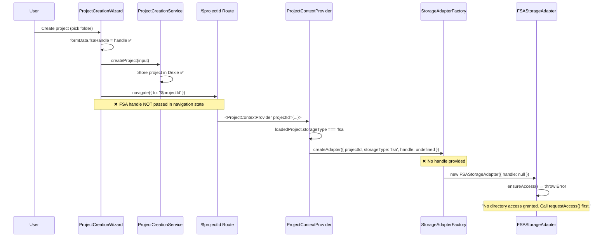

# EPIC-ARCH-04: Complete Architecture Migration & FSA Integration

> **Epic ID**: EPIC-ARCH-04
> **Created**: 2026-01-25T20:00:00+07:00
> **Priority**: P0 (CRITICAL BLOCKER)
> **Status**: READY_FOR_SPRINT_PLANNING
> **Estimated Effort**: 8-12 hours
> **Author**: architect-ext
> **Target**: Complete the project-centric migration per ADR-034

---

## Document Governance

### Parent Documents (MUST READ BEFORE STARTING)

| Document | Path | Purpose |
|----------|------|---------|
| **ADR-034** (Primary) | `_bmad-output/planning-artifacts/adr/ADR-034-project-centric-architecture-2026-01-20.md` | Defines project-centric architecture |
| **ADR-034-AMENDMENT-001** | `_bmad-output/planning-artifacts/adr/ADR-034-AMENDMENT-001-platform-first-2026-01-21.md` | Platform-first plugin selection |
| **new-fundamental-truths.md** | `/new-fundamental-truths.md` | Strategic vision and principles |
| **AGENTS.md** | `/AGENTS.md` | Governance rules |
| **CLAUDE.md** | `/.claude/CLAUDE.md` | Agent behavior guidelines |

### Child Documents (Created by This Epic)

| Document | Path | Purpose |
|----------|------|---------|
| **Sprint Handoff** | `_bmad-output/handoffs/2026-01-25/EPIC-ARCH-04-SPRINT-HANDOFF-2026-01-25.md` | Execution guide for sprint-manager |
| **Story Files** | (To be created by sprint-manager) | Individual story specifications |
| **Completion Report** | (To be created after completion) | Verification evidence |

### Supersedes

| Document | Reason |
|----------|--------|
| `HOOKS-FIX-01` | Absorbed into ARCH-04-01 |
| `HOOKS-FIX-02` | Absorbed into ARCH-04-01 |

---

## Executive Summary

The application is **non-functional** because EPIC-ARCH-01 through EPIC-ARCH-03 created the NEW architecture (ProjectContext, FeaturePlugins, PluginLayout) **without completing the migration** from the OLD architecture.

### Current State

| Component | Status | Location | Problem |
|-----------|--------|----------|---------|
| NEW ProjectContext | EXISTS | `src/infrastructure/context/project-context.tsx` | No FSA handle integration |
| OLD ProjectContext | ARCHIVED | `_bmad-ext/.archive/ProjectContext-2026-01-25.tsx` | Was source of FSA handle logic |
| FSA Handle Persistence | EXISTS | `src/infrastructure/filesystem/handle-persistence.ts` | Not called by NEW context |
| FSA Storage Adapter | EXISTS | `src/infrastructure/filesystem/fsa-storage-adapter.ts` | Receives null handle |
| Permission Overlay | EXISTS | `src/presentation/components/layout/PermissionOverlay.tsx` | Not integrated |

### The Gap

**OLD context had FSA handle lifecycle; NEW context doesn't.**

```
OLD Context (Archived):                    NEW Context (Current):
├── fsaHandle state           ────────>    ❌ Missing
├── restoreHandleAsync()      ────────>    ❌ Missing  
├── handlePersistenceService  ────────>    ❌ Missing
├── Permission Overlay        ────────>    ❌ Missing
└── initialHandle prop        ────────>    ❌ Missing
```

---

## Root Cause Analysis

### The Error
```
Failed to load project: No directory access granted. Call requestAccess() first.
```

### Complete Failure Flow



### Missing Integration Points

| Integration Point | What Should Happen | What Actually Happens |
|-------------------|-------------------|----------------------|
| **Wizard → Route** | Pass `fsaHandle` via navigation state | Handle discarded |
| **Route → Provider** | Extract handle, pass as `initialHandle` prop | No prop exists |
| **Provider Mount** | Call `handlePersistenceService.restoreHandle()` | Never called |
| **Restoration Fail** | Show `PermissionOverlay` | No overlay logic |
| **User Grant** | Store handle, retry initialization | No retry logic |

---

## Strategic Solution

### Principle: Complete the Migration, Don't Patch

This epic completes what ARCH-01/02/03 started by:

1. **Integrating FSA handle lifecycle into NEW ProjectContextProvider**
2. **Connecting wizard to route with handle passing**
3. **Adding permission UI fallback**
4. **Validating end-to-end flows**
5. **Archiving remaining legacy files**
6. **Cleaning deprecated UI elements**

---

## Stories

### Story 1: ARCH-04-01 - Integrate FSA Handle Lifecycle into ProjectContextProvider

> **Priority**: P0 | **Effort**: 3-4 hours | **Dependencies**: None
> **Assigned To**: dev-ext | **Blocking**: ALL other stories

#### Problem Statement

`ProjectContextProvider` (ARCH-02-03) was created without FSA handle lifecycle.
The provider creates `StorageAdapterFactory` with `handle: undefined`, causing all FSA operations to fail.

#### Files to Modify

| File | Lines | Changes |
|------|-------|---------|
| `src/infrastructure/context/project-context.tsx` | ~100 new | Add FSA handle state, restoration, persistence |

#### Key Interfaces to Use

```typescript
// From src/infrastructure/filesystem/handle-persistence.ts
interface HandleRestoreResult {
  success: boolean;
  handle: FileSystemDirectoryHandle | null;
  error?: string;
  requiresUserInteraction: boolean;
  restoredFromMetadata?: StorageHandleMetadata;
}

class HandlePersistenceService {
  persistHandle(projectId: string, handle: FileSystemDirectoryHandle, workspaceId?: 'ide'): Promise<void>;
  restoreHandle(projectId: string): Promise<HandleRestoreResult>;
  deleteHandle(projectId: string): Promise<void>;
}
```

#### Implementation Steps

**Step 1: Add imports**
```typescript
// At top of file (~line 37)
import { handlePersistenceService } from '@/infrastructure/filesystem/handle-persistence';
import type { HandleRestoreResult } from '@/infrastructure/filesystem/handle-types';
```

**Step 2: Add props interface**
```typescript
// Modify Props interface (~line 147)
interface Props {
  projectId: string;
  children: ReactNode;
  initialHandle?: FileSystemDirectoryHandle | null; // NEW: Handle from wizard
}
```

**Step 3: Add state**
```typescript
// After existing useState declarations (~line 166)
const [fsaHandle, setFsaHandle] = useState<FileSystemDirectoryHandle | null>(null);
const [showPermissionOverlay, setShowPermissionOverlay] = useState(false);
```

**Step 4: Add FSA handle restoration in initializeProject()**
```typescript
// After loading project, before creating storageAdapter (~line 200)

// Check for initialHandle from wizard
if (initialHandle) {
  console.log('[ProjectContext] Using initialHandle from props');
  setFsaHandle(initialHandle);
  // Persist for future visits
  await handlePersistenceService.persistHandle(projectId, initialHandle, 'ide');
} else if (loadedProject.storageType === 'fsa') {
  // Try to restore from persistence
  console.log('[ProjectContext] Attempting FSA handle restoration');
  const restoreResult: HandleRestoreResult = await handlePersistenceService.restoreHandle(projectId);
  
  if (restoreResult.success && restoreResult.handle) {
    console.log('[ProjectContext] FSA handle restored successfully');
    setFsaHandle(restoreResult.handle);
  } else if (restoreResult.requiresUserInteraction) {
    console.log('[ProjectContext] FSA handle requires user interaction');
    setShowPermissionOverlay(true);
    setLoading(false);
    return; // Wait for user to grant permission
  } else {
    console.error('[ProjectContext] FSA handle restoration failed:', restoreResult.error);
    setError(`Failed to restore file access: ${restoreResult.error}`);
    setLoading(false);
    return;
  }
}
```

**Step 5: Pass handle to StorageAdapterFactory**
```typescript
// Modify storageAdapterFactory.createAdapter call (~line 207)
const storageAdapter: StorageAdapter = storageAdapterFactory.createAdapter({
  projectId,
  storageType: loadedProject.storageType,
  handle: fsaHandle, // ← ADD THIS
});
```

**Step 6: Add permission overlay render**
```typescript
// After error render, before loading render (~line 328)
if (showPermissionOverlay) {
  return (
    <PermissionOverlay
      projectId={projectId}
      projectName={project?.name || 'Unknown'}
      onPermissionGranted={async (handle: FileSystemDirectoryHandle) => {
        console.log('[ProjectContext] Permission granted, persisting handle');
        setFsaHandle(handle);
        await handlePersistenceService.persistHandle(projectId, handle, 'ide');
        setShowPermissionOverlay(false);
        // Re-run initialization with new handle
        setLoading(true);
        // Note: useEffect will re-run due to state change
      }}
      onCancel={() => navigate({ to: '/' })}
    />
  );
}
```

**Step 7: Import PermissionOverlay**
```typescript
// At top of file
import { PermissionOverlay } from '@/presentation/components/layout/PermissionOverlay';
```

#### Acceptance Criteria

| AC ID | Criterion | Verification Method |
|-------|-----------|---------------------|
| AC-01-1 | ProjectContextProvider accepts `initialHandle` prop | Code inspection |
| AC-01-2 | Provider calls `handlePersistenceService.restoreHandle()` for FSA projects | Console log verification |
| AC-01-3 | If restoration succeeds, handle is used for adapter | Console log + no error |
| AC-01-4 | If restoration requires interaction, shows overlay | Browser test |
| AC-01-5 | If restoration fails, shows error message | Browser test |
| AC-01-6 | Handle is passed to `storageAdapterFactory.createAdapter()` | Code inspection |
| AC-01-7 | TypeScript compiles with 0 errors | `pnpm tsc --noEmit` |

#### Verification Commands

```bash
# TypeScript check
pnpm tsc --noEmit

# Dev server
pnpm dev

# Console should show:
# [ProjectContext] Attempting FSA handle restoration
# [ProjectContext] FSA handle requires user interaction
# OR
# [ProjectContext] FSA handle restored successfully
```

---

### Story 2: ARCH-04-02 - Pass FSA Handle from Wizard to Route

> **Priority**: P0 | **Effort**: 1-2 hours | **Dependencies**: ARCH-04-01
> **Assigned To**: dev-ext

#### Problem Statement

`ProjectCreationWizard` has the FSA handle (line 293-294) but discards it when navigating.
The route receives no handle, so restoration is always required.

#### Files to Modify

| File | Lines | Changes |
|------|-------|---------|
| `src/presentation/components/project/ProjectCreationWizard.tsx` | ~10 | Add handle to navigation state |
| `src/routes/$projectId.tsx` | ~20 | Extract handle, pass to provider |

#### Implementation Steps

**In ProjectCreationWizard.tsx (~line 300):**

```typescript
// BEFORE (current code)
navigate({ to: '/$projectId', params: { projectId } });

// AFTER
navigate({
  to: '/$projectId',
  params: { projectId },
  state: { 
    fsaHandle: formData.fsaHandle 
  } as { fsaHandle?: FileSystemDirectoryHandle },
});
```

**In src/routes/$projectId.tsx:**

```typescript
// Add import
import { useLocation } from '@tanstack/react-router';

// In route component
export function ProjectRoute() {
  const { projectId } = Route.useParams();
  const location = useLocation();
  
  // Extract FSA handle from navigation state
  const initialHandle = (location.state as { fsaHandle?: FileSystemDirectoryHandle })?.fsaHandle || null;
  
  return (
    <ProjectContextProvider 
      projectId={projectId} 
      initialHandle={initialHandle}
    >
      <PluginLayout />
    </ProjectContextProvider>
  );
}
```

#### Acceptance Criteria

| AC ID | Criterion | Verification Method |
|-------|-----------|---------------------|
| AC-02-1 | Wizard passes `fsaHandle` via navigation state | Console log in wizard |
| AC-02-2 | Route extracts `fsaHandle` from state | Console log in route |
| AC-02-3 | Provider receives `initialHandle` prop | Console log in provider |
| AC-02-4 | New project creation requires no permission overlay | Browser test |
| AC-02-5 | TypeScript compiles | `pnpm tsc --noEmit` |

---

### Story 3: ARCH-04-03 - Integrate PermissionOverlay for NEW Architecture

> **Priority**: P0 | **Effort**: 1-2 hours | **Dependencies**: ARCH-04-01
> **Assigned To**: dev-ext

#### Problem Statement

`PermissionOverlay` exists at `src/presentation/components/layout/PermissionOverlay.tsx` but needs verification that it's compatible with NEW context callbacks.

#### Files to Verify/Modify

| File | Purpose |
|------|---------|
| `src/presentation/components/layout/PermissionOverlay.tsx` | Permission grant UI |
| `src/infrastructure/context/project-context.tsx` | Integration point |

#### Implementation Steps

1. **Read current PermissionOverlay props interface**
2. **Verify it accepts `onPermissionGranted(handle: FileSystemDirectoryHandle)`**
3. **Verify it accepts `onCancel()`**
4. **If props mismatch, update overlay or create adapter**
5. **Test overlay displays and functions correctly**

#### Acceptance Criteria

| AC ID | Criterion | Verification Method |
|-------|-----------|---------------------|
| AC-03-1 | PermissionOverlay accepts correct callback props | Code inspection |
| AC-03-2 | "Grant Access" button calls `showDirectoryPicker()` | Browser test |
| AC-03-3 | Successful grant calls `onPermissionGranted(handle)` | Console log |
| AC-03-4 | Cancel navigates to Hub | Browser test |
| AC-03-5 | Overlay follows 8-bit design system | Visual inspection |

---

### Story 4: ARCH-04-04 - Archive Legacy Files and Update Imports

> **Priority**: P1 | **Effort**: 2-3 hours | **Dependencies**: ARCH-04-05
> **Assigned To**: dev-ext

#### Files to Archive

```
ARCHIVE (move to _bmad-ext/.archive/):
├── src/lib/workspace/ProjectContext.tsx (already archived 2026-01-25)

KEEP (still used):
├── src/lib/workspace/fsa-persistence.ts (used by ProjectCreationService)
├── src/lib/workspace/browser-mode.ts (used by ProjectCreationService)
├── src/lib/workspace/temp-project.ts (used by ProjectCreationService)
├── src/lib/workspace/project-repository.ts (may be used)
```

#### Imports to Verify

```bash
# Run this to find any remaining old imports
grep -rn "from '@/lib/workspace/ProjectContext'" src/ --include="*.tsx" --include="*.ts"
# Expected: 0 results

# Check for other workspace imports that may need updating
grep -rn "@/lib/workspace" src/ --include="*.tsx" --include="*.ts" | grep -v ".test."
```

#### Acceptance Criteria

| AC ID | Criterion | Verification Method |
|-------|-----------|---------------------|
| AC-04-1 | No imports from `@/lib/workspace/ProjectContext` | grep verification |
| AC-04-2 | All archived files in `_bmad-ext/.archive/` | File system check |
| AC-04-3 | TypeScript compiles with 0 errors | `pnpm tsc --noEmit` |
| AC-04-4 | Build succeeds | `pnpm build` |

---

### Story 5: ARCH-04-05 - End-to-End Flow Validation

> **Priority**: P0 | **Effort**: 1-2 hours | **Dependencies**: ARCH-04-01, ARCH-04-02, ARCH-04-03
> **Assigned To**: dev-ext OR real-world-validator

#### Test Scenarios

**Scenario 1: FSA Project Creation (New Project)**
```
1. Start dev server: pnpm dev
2. Navigate to Hub (http://localhost:3002)
3. Click "Create Project"
4. Fill name, pick folder (FSA)
5. Click Create
6. Verify:
   ✓ No permission overlay (handle from wizard)
   ✓ Project page loads
   ✓ File tree shows folder contents
   ✓ No console errors
```

**Scenario 2: FSA Project Load (Existing Project)**
```
1. Clear browser storage (simulate fresh session)
2. Navigate directly to existing project URL
3. Verify:
   ✓ Permission overlay appears
   ✓ Click "Grant Access"
   ✓ Folder picker appears
   ✓ Select same folder
   ✓ Project loads with file tree
```

**Scenario 3: FSA Project Silent Restore (Chrome 122+)**
```
1. Create FSA project (Scenario 1)
2. Reload page
3. Verify:
   ✓ No permission overlay
   ✓ Project loads silently
   ✓ Console shows "FSA handle restored successfully"
```

**Scenario 4: IndexedDB Project**
```
1. Create project with IndexedDB storage
2. Verify:
   ✓ No permission overlay needed
   ✓ Project loads
   ✓ File operations work
```

#### Acceptance Criteria

| AC ID | Criterion | Verification Method |
|-------|-----------|---------------------|
| AC-05-1 | Scenario 1 passes | Manual test |
| AC-05-2 | Scenario 2 passes | Manual test |
| AC-05-3 | Scenario 3 passes | Manual test (Chrome 122+) |
| AC-05-4 | Scenario 4 passes | Manual test |
| AC-05-5 | No "Invalid hook call" errors | Browser console |
| AC-05-6 | No "No directory access" errors | Browser console |

---

### Story 6: ARCH-04-06 - Clean Up Deprecated Options in Wizard

> **Priority**: P2 | **Effort**: 1 hour | **Dependencies**: ARCH-04-05
> **Assigned To**: dev-ext

#### Problem Statement

Wizard still shows Knowledge/Study workspace options that are deferred per ADR-034 Phase 4.

#### Changes Required

1. Remove Knowledge/Study workspace binding toggles
2. Auto-detect storage type from platform (don't ask user)
3. Simplify wizard to: Name → Pick Folder (FSA) OR Auto-create (IndexedDB)

#### Acceptance Criteria

| AC ID | Criterion | Verification Method |
|-------|-----------|---------------------|
| AC-06-1 | No Knowledge/Study options in wizard | Visual inspection |
| AC-06-2 | Storage type auto-detected | Code inspection |
| AC-06-3 | Wizard is faster to complete | UX timing |

---

## Implementation Order

```
Phase 1: CRITICAL PATH (App Functional)
├── 1. ARCH-04-01 (FSA Handle Lifecycle) ← START HERE
├── 2. ARCH-04-02 (Handle from Wizard)
├── 3. ARCH-04-03 (Permission Overlay)
└── 4. ARCH-04-05 (E2E Validation) ← APP WORKS

Phase 2: CLEANUP
├── 5. ARCH-04-04 (Archive Legacy)
└── 6. ARCH-04-06 (Wizard Cleanup)
```

---

## Technical Reference

### Key Files Matrix

| File | Purpose | Story | Action |
|------|---------|-------|--------|
| `src/infrastructure/context/project-context.tsx` | NEW context | ARCH-04-01 | MODIFY |
| `src/infrastructure/filesystem/handle-persistence.ts` | Handle lifecycle | ARCH-04-01 | USE |
| `src/infrastructure/filesystem/handle-types.ts` | Handle types | ARCH-04-01 | USE |
| `src/infrastructure/filesystem/fsa-storage-adapter.ts` | Storage adapter | ARCH-04-01 | USE |
| `src/infrastructure/filesystem/StorageAdapterFactory.ts` | Adapter creation | ARCH-04-01 | USE |
| `src/presentation/components/project/ProjectCreationWizard.tsx` | Wizard | ARCH-04-02 | MODIFY |
| `src/routes/$projectId.tsx` | Unified route | ARCH-04-02 | MODIFY |
| `src/presentation/components/layout/PermissionOverlay.tsx` | Permission UI | ARCH-04-03 | VERIFY |

### API Reference

#### HandlePersistenceService

```typescript
// Location: src/infrastructure/filesystem/handle-persistence.ts
export const handlePersistenceService: HandlePersistenceService;

// Methods:
persistHandle(projectId: string, handle: FileSystemDirectoryHandle, workspaceId?: 'ide' | 'notes'): Promise<void>;
restoreHandle(projectId: string): Promise<HandleRestoreResult>;
deleteHandle(projectId: string): Promise<void>;
updatePermissionStatus(projectId: string, status: HandlePermissionState): Promise<void>;
canSilentRestore(projectId: string): Promise<boolean>;
```

#### StorageAdapterFactory

```typescript
// Location: src/infrastructure/filesystem/StorageAdapterFactory.ts
export const storageAdapterFactory: StorageAdapterFactory;

// Method used by ProjectContextProvider:
createAdapter(options: StorageOptions): StorageAdapter;

// StorageOptions:
interface StorageOptions {
  projectId: string;
  storageType?: StorageType;
  handle?: FileSystemDirectoryHandle | null;  // ← THIS IS WHAT'S MISSING
  handleGetter?: FsaHandleGetter;
  directoryPath?: string;
}
```

---

## Success Metrics

| Metric | Before | After |
|--------|--------|-------|
| Project creation works | ❌ No | ✅ Yes |
| Project loading works | ❌ No | ✅ Yes |
| FSA handle persisted | ❌ No | ✅ Yes |
| FSA handle restored | ❌ No | ✅ Yes |
| Silent restore (Chrome 122+) | ❌ No | ✅ Yes |
| Permission overlay works | ❌ No | ✅ Yes |
| TypeScript errors | 0 | 0 |
| Build status | SUCCESS | SUCCESS |

---

## Alignment with Architecture Vision

### ADR-034 Phase 4 Checklist (This Epic)

- [ ] Remove deprecated workspace routes completely
- [ ] Clean remaining legacy files  
- [ ] **Implement proper FSA integration in NEW context** ← Main deliverable
- [ ] Final testing and migration scripts

### new-fundamental-truths.md Alignment

| Principle | Implementation in This Epic |
|-----------|----------------------------|
| Project-centric | Single `/$projectId` route with FSA handle |
| Device separation | Platform detection → FSA vs IndexedDB |
| No workspace modes | Remove IDE/Notes mode concept (ARCH-04-06) |
| Handle persistence | Chrome 122+ silent restore (ARCH-04-01) |

---

## Risk Assessment

| Risk | Likelihood | Impact | Mitigation |
|------|------------|--------|------------|
| PermissionOverlay props mismatch | Medium | Medium | Create adapter if needed |
| Navigation state handle serialization | Low | High | Test with Chrome 129+ structured clone |
| Handle restoration race conditions | Low | Medium | Use proper async/await sequencing |
| IndexedDB projects affected | Low | Low | Separate code path, no FSA needed |

---

## Rollback Plan

If ARCH-04-01 fails:

1. Restore OLD ProjectContext from `_bmad-ext/.archive/ProjectContext-2026-01-25.tsx`
2. Revert NEW context changes
3. Add OLD provider to routes
4. Investigate specific failure

---

## Handoff Signature

```yaml
artifact_id: "epic_arch_04_20260125_v2"
artifact_type: "epic"
created_by: "architect-ext"
created_at: "2026-01-25T20:00:00+07:00"
priority: "P0"
target_agents: ["sprint-manager", "dev-ext"]
estimated_hours: 8-12
stories: 6
blocking: true

parent_documents:
  - "ADR-034-project-centric-architecture-2026-01-20.md"
  - "ADR-034-AMENDMENT-001-platform-first-2026-01-21.md"
  - "new-fundamental-truths.md"

child_documents:
  - "EPIC-ARCH-04-SPRINT-HANDOFF-2026-01-25.md"

supersedes:
  - "HOOKS-FIX-01"
  - "HOOKS-FIX-02"
```
