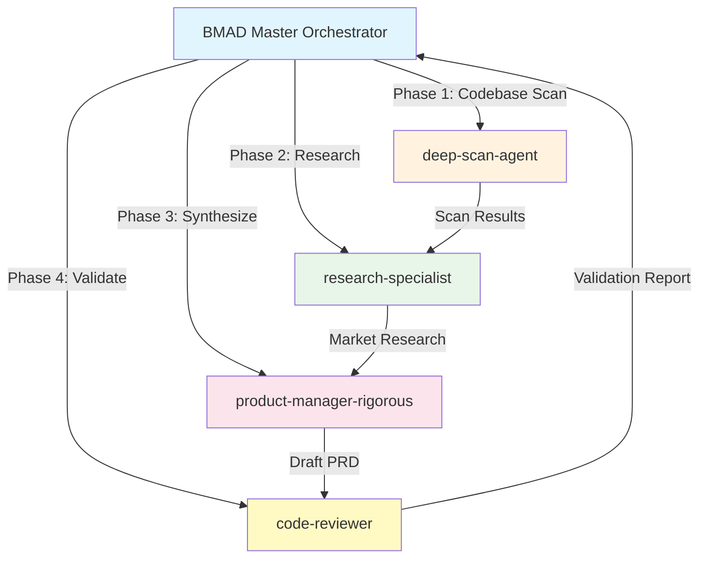
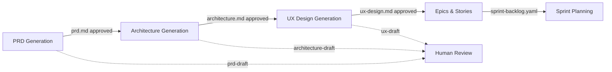

# PRD Generation Execution Plan

**Document Purpose**: High-level guide for autonomous PRD generation through sub-agent delegation, integrating research, codebase analysis, and sprint workflows.

**Status**: Ready for Execution
**Target Output**: `_bmad-output/planning-artifacts/prd.md`

---

## Executive Summary

This plan defines the **orchestration strategy** for generating a fresh Product Requirements Document (PRD) through autonomous sub-agent delegation. The PRD will be **codebase-first** (not relying on problematic brownfield docs) and integrate with existing sprint workflows.

**Key Differentiators from Brownfield Approach**:
- ✅ Codebase reality as source of truth (not old docs)
- ✅ Recent investigation reports as foundational context
- ✅ Sub-agent delegation for autonomous execution
- ✅ MCP tool integration for research quality
- ✅ Sprint workflow integration for continuity

---

## Phase 0: Pre-Execution Validation

### 0.1 Prerequisites Check

```yaml
validation:
  required_files:
    - .agent/workflows/agent-delegation-prd.md (workflow definition)
    - _bmad-output/scans/comprehensive-diagnostic-report.md (current state)
    - _bmad-output/architecture/adr-025-unified-ai-service.md (architectural decisions)
    - _bmad-output/research/ (latest research artifacts)

  optional_files:
    - agent-os/product/mission.md (if exists, use as vision source)
    - package.json (fallback for product context)

  output_preparation:
    - mkdir -p _bmad-output/planning-artifacts/
    - mkdir -p _bmad-output/sprint-artifacts/
    - Archive brownfield: mv _bmad-output/documentation/ _bmad-output/documentation-archived-{date}/
```

### 0.2 Initialize Sprint Status

Create `_bmad-output/sprint-artifacts/sprint-status.yaml`:

```yaml
sprint:
  id: prd-generation-2026-01-07
  name: PRD Generation Sprint
  duration: 2-3 hours
  start_date: 2026-01-07

phase: planning
status: in_progress

goals:
  - Generate fresh PRD from codebase analysis
  - Integrate findings from recent investigations
  - Create sprint-ready backlog
  - Establish baseline for architecture generation

artifacts:
  planned:
    - prd.md: _bmad-output/planning-artifacts/prd.md
    - sprint-status.yaml: _bmad-output/sprint-artifacts/sprint-status.yaml

research_sources:
  - diagnostic_report: _bmad-output/scans/comprehensive-diagnostic-report.md
  - adr_025: _bmad-output/architecture/adr-025-unified-ai-service.md
  - state_reactivity: _bmad-output/research/state-reactivity-gaps-2026-01-07.md
```

---

## Phase 1: Sub-Agent Delegation Strategy

### 1.1 Agent Roles and Routing



### 1.2 Agent Capabilities Mapping

| Agent | Role | Tools Used | Output |
|-------|------|------------|--------|
| **deep-scan-agent** | Codebase state scanner | Grep, Glob, File analysis | Component inventory, route mapping, store catalog |
| **research-specialist** | Market research analyst | Context7, Deepwiki, Tavily, Exa | Industry patterns, competitive analysis |
| **product-manager-rigorous** | Requirements synthesizer | All inputs combined | PRD draft with acceptance criteria |
| **code-reviewer** | Validation gate | TypeScript checks, lint | Validation report, confidence scoring |

### 1.3 Parallel vs Sequential Execution

```yaml
parallel_phases:
  - phase_1_codebase_scan: deep-scan-agent
  - phase_2_research: research-specialist (4 parallel MCP queries)

sequential_phases:
  - phase_3_synthesis: product-manager-rigorous (waits for phases 1&2)
  - phase_4_validation: code-reviewer (validates phase_3 output)
```

---

## Phase 2: Research Orchestration (MCP Tools)

### 2.1 MCP Tool Mapping by Research Domain

```yaml
research_domains:
  product_management:
    tools:
      - Context7: Query product management best practices
      - Tavily: "AI IDE competitive analysis 2026"
      - Exa: "product requirements document patterns"
    queries:
      - "PRD structure for AI coding platforms"
      - "competitive analysis Cursor Windsurf Claude"
      - "product requirements for local development environments"

  technical_architecture:
    tools:
      - Deepwiki: TanStack/ai, TanStack/router
      - Context7: @tanstack/react-router, @webcontainer/api
      - Exa: "AI agent integration patterns"
    queries:
      - "TanStack AI agent best practices"
      - "WebContainer local development patterns"
      - "agent tool permission systems"

  ux_design:
    tools:
      - Context7: shadcn/ui, radix-ui
      - Tavily: "IDE UX design patterns 2026"
      - Exa: "workspace-based IDE UX"
    queries:
      - "IDE workspace switching UX patterns"
      - "8-bit design system implementation"
      - "mobile IDE interface patterns"

  state_management:
    tools:
      - Deepwiki: pmndrs/zustand
      - Context7: Zustand persistence patterns
      - Exa: "Zustand god store remediation 2026"
    queries:
      - "Zustand store architecture best practices"
      - "state management for AI agent systems"
      - "workspace-aware state patterns"
```

### 2.2 Research Workflow Protocol

For each research domain:

```yaml
step_1_query:
  tool: Context7
  library_id: /org/library
  query: "{research question}"
  max_turns: 2
  confidence_threshold: 0.7

step_2_validate:
  tool: Deepwiki or Tavily
  validation_query: "Cross-reference with alternative source"
  confirm_match: true

step_3_synthesize:
  action: Combine findings from multiple sources
  output_format: markdown
  confidence_level: HIGH/MEDIUM/LOW
```

---

## Phase 3: Codebase Analysis Strategy

### 3.1 Repomix Configuration

```yaml
repomix_config:
  output: .repomix-output.txt
  ignore_patterns:
    - "node_modules/"
    - "dist/"
    - ".git/"
    - "*.md"
    - "__tests__/"
    - "*.test.*"
    - ".claude/"
    - ".opencode/"
    - "_bmad/"
    - ".repomix-output*"

  include_patterns:
    - "src/**/*.{ts,tsx}"
    - "routes/**/*.{ts,tsx}"
    - "lib/**/*.{ts,tsx}"
    - "infrastructure/**/*.{ts,tsx}"

  max_file_size: 10000
```

### 3.2 Codebase Analysis Phases

```yaml
analysis_phases:
  phase_1_structure:
    agent: deep-scan-agent
    duration: 5 minutes
    tasks:
      - Map directory structure
      - Count components by workspace
      - Identify entry points
      - Catalog stores and their sizes
      - Document routing patterns
    output: codebase-structure.yaml

  phase_2_features:
    agent: deep-scan-agent
    duration: 10 minutes
    tasks:
      - Search for @epic, @story, TODO markers
      - Identify implemented vs documented features
      - Map user flows through route tracing
      - Document AI integration points
      - Find security boundaries
    output: feature-inventory.yaml

  phase_3_gaps:
    agent: deep-scan-agent
    duration: 5 minutes
    tasks:
      - Compare against investigation reports
      - Identify undocumented capabilities
      - List technical debt markers
      - Find broken user journeys
    output: gap-analysis.yaml
```

### 3.3 Component Inventory Template

```yaml
component_inventory:
  ide_workspace:
    components: []
    entry_points: []
    stores: []
    routes: []

  knowledge_workspace:
    components: []
    entry_points: []
    stores: []
    routes: []

  notes_workspace:
    components: []
    entry_points: []
    stores: []
    routes: []

  study_workspace:
    components: []
    entry_points: []
    stores: []
    routes: []
```

---

## Phase 4: Sub-Agent Execution Commands

### 4.1 Agent 1: Codebase Scanner

```bash
# Delegate to deep-scan-agent
Agent: @bmad/deep-scan-state-scanner (or .opencode/agent/deep-scan-state-scanner)

Handoff Instructions:
1. Scan src/ directory comprehensively
2. Focus on: components, stores, routes, services
3. Output inventory to _bmad-output/planning-artifacts/codebase-scan-results/
4. Include:
   - Component count by workspace
   - Store file sizes (identify god stores >300 lines)
   - Route patterns
   - Entry point mapping
5. Reference recent diagnostic report for known issues

Time Budget: 15 minutes
Validation: Scan coverage >90% of src/
```

### 4.2 Agent 2: Research Synthesizer

```bash
# Delegate to research-specialist
Agent: @bmad/research-specialist (or create via bmm-analyst)

Handoff Instructions:
1. Execute MCP research queries in parallel (4-6 concurrent)
2. Use Context7 for framework documentation
3. Use Deepwiki for semantic codebase understanding
4. Use Tavily/Exa for competitive analysis
5. Synthesize findings into market-research.md
6. Focus on:
   - AI IDE competitive landscape
   - Product management best practices
   - Technical architecture patterns
   - UX design patterns for workspaces

Time Budget: 20 minutes
Validation: Minimum 3 successful research sources
```

### 4.3 Agent 3: PRD Draft Generator

```bash
# Delegate to product-manager-rigorous
Agent: @bmad/product-manager-rigorous (or .opencode/agent/product-manager-rigorous)

Handoff Instructions:
1. Load and synthesize:
   - Codebase scan results
   - Market research findings
   - Recent investigation reports
   - Existing mission/vision (if exists)
2. Generate PRD following structure in agent-delegation-prd.md
3. Include code references (file:line) for all claims
4. Mark confidence levels: HIGH/MEDIUM/LOW
5. Output: _bmad-output/planning-artifacts/prd.md

Time Budget: 30 minutes
Validation: PRD >200 lines, all sections populated
```

### 4.4 Agent 4: Validation Reviewer

```bash
# Delegate to code-reviewer
Agent: @code-reviewer (or comprehensive-review:code-reviewer)

Handoff Instructions:
1. Review generated PRD for:
   - Completeness (all sections filled)
   - Code traceability (references accurate)
   - Confidence scoring consistency
   - Integration with sprint workflows
2. Run validation checks:
   - TypeScript: pnpm typecheck (production files only)
   - Build: pnpm build (dry-run)
3. Generate validation report
4. Flag LOW confidence items for human review

Time Budget: 10 minutes
Validation: Zero blocking issues identified
```

---

## Phase 5: Sprint Workflow Integration

### 5.1 Sprint Status Update

After PRD generation, update sprint-status.yaml:

```yaml
sprint:
  id: prd-generation-2026-01-07
  status: prd-complete

artifacts:
  generated:
    - prd.md:
        path: _bmad-output/planning-artifacts/prd.md
        lines: {count}
        status: draft-complete
        reviewed: false
    - codebase-scan: _bmad-output/planning-artifacts/codebase-scan-results/
    - market-research: _bmad-output/planning-artifacts/market-research.md

next_phases:
  - architecture_generation:
      workflow: agent-delegation-architecture
      input: prd.md (must be approved first)
      output: architecture.md
  - ux_design_generation:
      workflow: agent-delegation-ux-design
      input: prd.md, architecture.md
      output: ux-design.md
  - epics_stories_generation:
      workflow: agent-delegation-epics-stories
      input: prd.md, architecture.md, ux-design.md
      output: epics.md, sprint-backlog.yaml
```

### 5.2 Integration with Existing Workflows

The PRD generation feeds into the **full-planning-cycle** orchestration:



### 5.3 Workflow Init for Next Phases

After PRD approval, trigger workflow-init:

```bash
# Initialize architecture generation
Agent: @bmad-bmm-workflow-init (or .opencode/command/workflow-init)

Input:
  workflow: agent-delegation-architecture
  depends_on: prd.md (approved status)
  output: architecture.md

# Creates story files for architecture generation
```

---

## Phase 6: Error Handling & Recovery

### 6.1 MCP Tool Failures

| Tool Failure | Fallback | Continue? |
|-------------|----------|-----------|
| Context7 timeout | Use brownfield docs as context reference | YES |
| Deepwiki error | Use codebase grep analysis | YES |
| Tavily rate limit | Use Exa backup | YES |
| All MCP fail | Codebase-only analysis | YES |

### 6.2 Sub-Agent Failures

| Agent Failure | Recovery | Escalation |
|--------------|----------|-----------|
| deep-scan timeout | Reduce scan scope | Manual scan via Grep |
| research timeout | Use cached knowledge | BMAD Master synthesis |
| PM timeout | Use template PRD | Human input required |
| validation timeout | Mark as draft-human-review | Human review required |

### 6.3 Validation Gates

```yaml
gate_1_research_complete:
  checks:
    - codebase_scan_results directory exists
    - market_research.md exists with >3 sources
    - investigation_reports loaded
  on_fail: Retry research with alternative tools

gate_2_prd_complete:
  checks:
    - prd.md exists
    - line_count > 200
    - all_sections_populated: true
    - confidence_scores_present: true
  on_fail: Re-run PM agent with adjusted prompt

gate_3_validation_complete:
  checks:
    - validation_report.md exists
    - critical_issues_count: 0
    - confidence_breakdown: present
  on_fail: Flag for human review

gate_4_sprint_ready:
  checks:
    - sprint-status.yaml updated
    - next_phases defined
    - handoff artifacts created
  on_fail: Create manual handoff
```

---

## Phase 7: Execution Command Reference

### 7.1 Full Autonomous Execution

```bash
# Execute all phases sequentially via BMAD Master
@bmad-core-bmad-master

Instructions:
1. Execute PRD Generation Execution Plan
2. Delegate to sub-agents per Phase 4
3. Monitor MCP tool usage
4. Aggregate results
5. Update sprint-status.yaml
6. Generate completion report

Expected Duration: 60-75 minutes
Expected Output:
  - _bmad-output/planning-artifacts/prd.md
  - _bmad-output/planning-artifacts/codebase-scan-results/
  - _bmad-output/planning-artifacts/market-research.md
  - _bmad-output/sprint-artifacts/sprint-status.yaml
```

### 7.2 Phase-Specific Commands

```bash
# Codebase scan only
@deep-scan-agent
Scan src/ directory for PRD context
Output to: _bmad-output/planning-artifacts/codebase-scan-results/

# Research only
@bmm-analyst
Execute MCP research queries for:
  - AI IDE competitive landscape
  - TanStack AI patterns
  - Zustand best practices
Synthesize to: _bmad-output/planning-artifacts/market-research.md

# PRD generation only
@product-manager-rigorous
Load scan results and research
Generate PRD following agent-delegation-prd.md workflow
Output: _bmad-output/planning-artifacts/prd.md
```

### 7.3 Validation Commands

```bash
# TypeScript validation (production files only)
pnpm typecheck

# Build dry-run
pnpm build --dry-run

# Line count validation
wc -l _bmad-output/planning-artifacts/prd.md

# Structure validation
grep "^## " _bmad-output/planning-artifacts/prd.md | wc -l
```

---

## Phase 8: Handoff Protocols

### 8.1 From PRD to Architecture

```yaml
handoff_prd_to_architecture:
  trigger: prd.md status changes to "approved"
  executor: @bmad-core-bmad-master
  target_agent: @bmm-architect
  workflow: agent-delegation-architecture

  context_artifacts:
    - prd.md
    - codebase-scan-results/
    - investigation_reports/

  output_location: _bmad-output/planning-artifacts/architecture.md

  validation_gate:
    - prd status: approved
    - all sections marked with confidence
    - stakeholder signoff: present
```

### 8.2 From Architecture to UX Design

```yaml
handoff_architecture_to_ux:
  trigger: architecture.md status changes to "approved"
  executor: @bmad-core-bmad-master
  target_agent: @bmm-ux-designer
  workflow: agent-delegation-ux-design

  context_artifacts:
    - prd.md
    - architecture.md (component inventory, design tokens)
    - accessibility_requirements.md

  output_location: _bmad-output/planning-artifacts/ux-design.md

  validation_gate:
    - architecture status: approved
    - component inventory complete
    - design tokens defined
```

### 8.3 From UX to Epics

```yaml
handoff_ux_to_epics:
  trigger: ux-design.md status changes to "approved"
  executor: @bmad-core-bmad-master
  target_agent: @bmm-pm
  workflow: agent-delegation-epics-stories

  context_artifacts:
    - prd.md (requirements)
    - architecture.md (technical constraints)
    - ux-design.md (user flows, components)

  output_location:
    - _bmad-output/planning-artifacts/epics.md
    - _bmad-output/sprint-artifacts/sprint-backlog.yaml

  validation_gate:
    - all previous documents approved
    - coverage > 90%
    - dependencies mapped
```

---

## Phase 9: Success Criteria

### 9.1 PRD Quality Metrics

| Metric | Target | Measurement |
|--------|--------|------------|
| Line count | >200 | `wc -l prd.md` |
| Sections complete | 12/12 | Grep for section headers |
| Code references | >20 | Grep for `src/` patterns |
| Confidence scores | All marked | Grep for `HIGH/MEDIUM/LOW` |
| Requirements traceable | >90% | Links to epics planned |

### 9.2 Process Metrics

| Metric | Target | Measurement |
|--------|--------|------------|
| Sub-agent success rate | 100% | All agents complete |
| MCP tool success rate | >80% | At least 4/5 tools succeed |
| Time budget | <75 min | Aggregate agent time |
| Human intervention | Minimal | Only for LOW confidence items |

### 9.3 Integration Metrics

| Metric | Target | Measurement |
|--------|--------|------------|
| Sprint status updated | ✅ | sprint-status.yaml exists |
| Next phases ready | ✅ | Dependencies satisfied |
| Handoff artifacts | ✅ | All 3 handoff protocols ready |
| Validation report | ✅ | Zero blocking issues |

---

## Phase 10: Rollback and Recovery

### 10.1 Rollback Triggers

- PRD generation fails >3 times
- Critical blocking issues in validation
- Human intervention required for >30% of content
- MCP tools completely unavailable

### 10.2 Recovery Actions

| Trigger | Action |
|---------|--------|
| Sub-agent timeout | Increase time budget, reduce scope |
| MCP failure | Proceed with codebase-only analysis |
| Validation failure | Fix issues and re-run |
| Complete failure | Create minimal PRD from template, flag for human completion |

---

## Appendix A: File Templates

### A.1 Sprint Status Template

```yaml
# _bmad-output/sprint-artifacts/sprint-status.yaml
sprint:
  id: prd-generation-2026-01-07
  name: PRD Generation Sprint
  start_date: 2026-01-07T21:30:00+07:00

progress:
  phase: prd-generation
  status: in_progress
  percentage: 0

artifacts:
  generated: []
  in_progress: []

agents:
  active: []
  completed: []

research:
  mcp_tools_used: []
  sources_consulted: []

quality_gates:
  passed: []
  failed: []
  pending: []
```

### A.2 PRD Frontmatter Template

```markdown
---
version: 1.0.0-draft
generated: {timestamp}
agent: delegation-workflow
phase: planning
status: draft
confidence_overall: HIGH/MEDIUM/LOW
stepsCompleted: [context_ingestion, codebase_analysis, research, synthesis, validation]
---

# Product Requirements Document: Via-gent (Project Alpha v2.0)

## Document Control
- **Version:** 1.0.0-draft
- **Generated:** {timestamp}
- **Status:** Draft - Pending Review
- **Generating Agent:** Claude Code Sub-Agent (PRD Delegation)
- **Confidence:** {overall_confidence}
```

---

## Appendix B: Tool Command Reference

### B.1 MCP Tool Usage

```bash
# Context7
mcp__context7__query-docs
  library_id: /org/tanstack/router
  query: "routing best practices for workspace switching"

# Deepwiki
mcp__deepwiki__ask_repository
  repo: TanStack/router
  question: "lazy loading vs file routing performance"

# Tavily
mcp__web-search-prime__webSearchPrime
  search_query: "AI IDE workspace design patterns"
  search_recency_filter: oneMonth

# Exa (via web reader)
mcp__web-reader__webReader
  url: https://example.com/article
  return_format: markdown
```

### B.2 Repomix Usage

```bash
# For codebase analysis
repomix --include "src/**/*.{ts,tsx}" \
        --ignore "**/node_modules/**" \
        --ignore "**/*.test.*" \
        --output .repomix-output.txt

# Then analyze with sub-agent
@bmad-research-specialist
Analyze .repomix-output.txt for:
- Component patterns
- State management usage
- Route organization
- AI integration points
```

---

**End of PRD Generation Execution Plan**

**Next Actions:**
1. ✅ Review and approve this plan
2. Execute `/full-planning-cycle` for complete PRD generation
3. Or execute individual phases via sub-agent delegation
4. After PRD approved, proceed to `/agent-delegation-architecture`

---

**Version:** 1.0.0
**Created:** 2026-01-07T21:30:00+07:00
**Author:** BMAD Core Master (via @bmad-core-bmad-master)
**Status:** Ready for Execution
