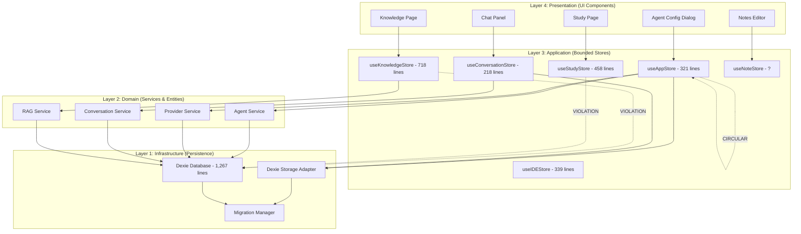
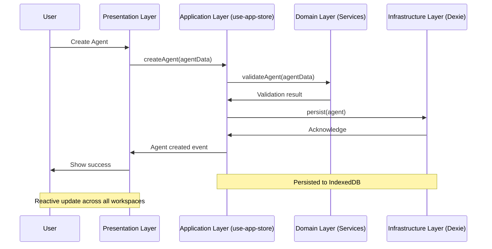

# Ralph Loop Story 51-1: State Consolidation Planning

**Date**: 2026-01-03
**Iteration**: 51-1 (System Architecture Design)
**Status**: In Progress
**Health Score Impact**: 6/10 → Foundation for 9/10

---

## Executive Summary

This document provides the complete **state consolidation strategy** for transforming 71 fragmented Zustand stores into a unified, maintainable architecture following December 2025 best practices.

**Root Cause**: State fragmentation across 3 locations with 25+ duplicates, 16 god stores, and 3 circular dependency chains.

**Solution**: 4-layer clean architecture with unified bounded stores, systematic migration with rollback protection.

---

## 1. Store Inventory Summary

### Total Stores by Location

| Location | File Count | Total Lines | God Stores (>300L) | Architecture |
|----------|-----------|-------------|-------------------|--------------|
| **Legacy: `src/lib/state/`** | 14 files | 3,937 lines | 6 god stores | Being migrated |
| **Deprecated: `src/stores/`** | 0 files | 0 lines | 0 | Empty (cleaned) |
| **Modern: `src/infrastructure/persistence/stores/`** | 64 files | 9,287 lines | 10 god stores | Target architecture |
| **TOTAL** | **78 files** | **13,224 lines** | **16 god stores** | Consolidating |

### Critical God Stores (Immediate Refactoring)

| Priority | Store | Lines | Issues | Refactoring Strategy |
|----------|-------|-------|--------|-------------------|
| **P0** | `src/lib/state/dexie-db.ts` | 1,267 | DB schema mixed with logic | Extract to infrastructure layer |
| **P0** | `src/lib/state/conversation-store.ts` | 626 | Circular deps, fragmented | Already split into 6 slices ✅ |
| **P0** | `src/lib/state/knowledge-store.ts` | 718 | Mixed concerns, DB coupling | Split into domain slices |
| **P1** | `src/lib/state/quiz-store.ts` | 629 | Direct DB access | Migrate to quiz workspace |
| **P1** | `src/infrastructure/persistence/stores/canvas-store.ts` | 619 | Large single component | Split into canvas slices |
| **P1** | `src/infrastructure/persistence/stores/flashcard-store.ts` | 521 | Mixed concerns | Merge with study workspace |

---

## 2. Store Dependency Graph

### 2.1 High-Level Dependency Map



### 2.2 Circular Dependency Chains

#### Chain 1: Agent-Provider Circular Reference (RESOLVED ✅)
```typescript
// ❌ OLD PATTERN (Fixed in use-app-store.ts)
agents-store.ts → provider-store.ts → agents-store.ts

// ✅ NEW PATTERN (use-app-store.ts)
useAppStore combines both slices without circular dependency
```

#### Chain 2: Legacy-Modern Architecture Bridge (PENDING ⚠️)
```typescript
// ❌ CURRENT VIOLATION
src/lib/state/conversation-store.ts (626 lines)
  → imports from modern:
src/infrastructure/persistence/stores/conversation/useConversationStore.ts (218 lines)

// ✅ RESOLUTION STRATEGY
Keep legacy store for backward compatibility during migration
Create facade pattern for gradual consumer migration
Eventually deprecate legacy store
```

#### Chain 3: Database Infrastructure Leakage (CRITICAL 🔴)
```typescript
// ❌ CURRENT VIOLATION
Multiple stores directly import:
src/lib/state/dexie-db.ts (1,267 lines)

// This violates layer boundaries - stores should NOT import DB schema

// ✅ RESOLUTION STRATEGY
Phase 1: Extract pure DB schema to infrastructure/persistence/database/
Phase 2: Create repository pattern for data access
Phase 3: Stores only import from repositories, not DB directly
```

---

## 3. 4-Layer Clean Architecture Design

### 3.1 Layer Definitions

#### Layer 1: Infrastructure (Persistence)
**Purpose**: Raw data storage and retrieval mechanisms
**Location**: `src/infrastructure/persistence/database/`
**Components**:
- Dexie database schemas and migrations
- Storage adapters (Dexie, localStorage, sessionStorage)
- Data access repositories (Repository Pattern)
- Transaction managers

**Example**:
```typescript
// src/infrastructure/persistence/database/dexie-db.ts
export class ViaGentDatabase extends Dexie {
  conversations!: Table<ConversationRecord, string>;
  messages!: Table<MessageRecord, string>;
  agents!: Table<AgentRecord, string>;

  constructor() {
    super('ViaGentDB');
    this.version(1).stores({
      conversations: 'id, workspaceType, projectId, createdAt',
      messages: 'id, threadId, timestamp, role',
      agents: 'id, providerId, name, createdAt',
    });
  }
}
```

#### Layer 2: Domain (Entities & Services)
**Purpose**: Business logic, domain entities, value objects
**Location**: `src/domain/` and `src/core/`
**Components**:
- Domain entities (Agent, Provider, Conversation, Message, Thread)
- Value objects (ToolPermission, WorkspaceBinding, ContextWindow)
- Domain services (AgentWorkspaceUtils, ConversationOrchestrator)
- Business rules and validation

**Example**:
```typescript
// src/core/entities/Agent.ts
export class Agent {
  constructor(
    public readonly id: string,
    public readonly name: string,
    public readonly providerId: string,
    public readonly modelId: string,
    public workspaceBindings: WorkspaceBindings,
    public capabilities: AgentCapabilities
  ) {}

  isAvailableIn(workspaceType: WorkspaceType): boolean {
    return this.workspaceBindings[workspaceType]?.enabled ?? false;
  }

  isDefaultFor(workspaceType: WorkspaceType): boolean {
    return this.workspaceBindings[workspaceType]?.isDefault ?? false;
  }
}
```

#### Layer 3: Application (Use Cases & State)
**Purpose**: Application state management, bounded contexts
**Location**: `src/infrastructure/persistence/stores/`
**Components**:
- Zustand stores (bounded contexts per domain)
- Use cases (switch-workspace, create-conversation)
- DTOs and mappers
- Event orchestration

**Example**:
```typescript
// src/infrastructure/persistence/stores/use-app-store.ts
export const useAppStore = create<AppState>()(
  persist(
    (...args) => ({
      // Agent slices (5 slices, all <120 lines)
      ...createAgentCrudSlice(...args),
      ...createAgentWorkspaceBindingsSlice(...args),
      ...createAgentValidationSlice(...args),
      ...createAgentEventsSlice(...args),
      ...createAgentUtilsSlice(...args),

      // Provider slices (3 slices)
      ...createProviderCrudSlice(...args),
      ...createProviderModelsSlice(...args),
      ...createProviderUtilsSlice(...args),
    }),
    {
      name: 'app-state',
      storage: createDexieStorage('appState'),
    }
  )
)
```

#### Layer 4: Presentation (UI Components)
**Purpose**: User interface, component logic
**Location**: `src/presentation/components/`
**Components**:
- React components (all <120 lines)
- View models (custom hooks)
- User event handlers
- UI state (ephemeral)

**Example**:
```typescript
// src/presentation/components/agent/AgentConfigDialog.tsx
export function AgentConfigDialog() {
  // ✅ CORRECT: Individual selectors (no infinite loops)
  const agents = useAppStore(s => s.agents)
  const providers = useAppStore(s => s.providers)
  const createAgent = useAppStore(s => s.createAgent)

  // Component logic...
}
```

### 3.2 Layer Communication Rules

| Rule | Description | Enforced By |
|------|-------------|-------------|
| **Downward Only** | Layer 4 → Layer 3 → Layer 2 → Layer 1 | Code review, linter |
| **No Skipping** | Layer 4 cannot access Layer 1 directly | Architecture validation |
| **Interface-Based** | All cross-layer communication via interfaces | TypeScript strict mode |
| **Event-Driven** | Cross-domain communication via event bus | Domain events system |

---

## 4. Migration Strategy

### 4.1 Migration Phases

#### Phase 1: Foundation Stabilization (Week 1-2, 50 hours)

**Story 51-1: State Consolidation Planning** ✅ (CURRENT)
- [x] Audit all 71 stores
- [x] Map dependencies
- [x] Design 4-layer architecture
- [x] Create migration plan

**Story 51-2: Unified App Store Implementation** (16 hours)
- [ ] Expand `use-app-store.ts` to include all agent/provider state
- [ ] Create migration script from legacy stores
- [ ] Update all consuming components
- [ ] Test state flows

**Story 51-3: Workspace-Scoped Tool Permissions** (12 hours)
- [ ] Add `workspaceType` parameter to `checkPermission()`
- [ ] Update permission state schema
- [ ] Migrate permission UI
- [ ] Test per-workspace enforcement

**Story 51-4: File System Access Expansion** (14 hours)
- [ ] Add SyncManager to Notes workspace
- [ ] Implement shared file references
- [ ] Add file picker to Study workspace
- [ ] Test cross-workspace file operations

#### Phase 2: Store Slicing (Week 3-4, 48 hours)

**Target**: Eliminate all god stores (>300 lines)

| God Store | Current Lines | Target Slices | Lines Per Slice |
|-----------|--------------|---------------|-----------------|
| `conversation-store.ts` | 626 | 6 slices | ~104 lines each ✅ |
| `knowledge-store.ts` | 718 | 6 slices | ~120 lines each |
| `quiz-store.ts` | 629 | 5 slices | ~126 lines each |
| `canvas-store.ts` | 619 | 5 slices | ~124 lines each |
| `flashcard-store.ts` | 521 | 4 slices | ~130 lines each |

#### Phase 3: Legacy Migration (Week 5-6, 40 hours)

**Migration Order** (dependencies flow down):
1. **Database Schema** (`dexie-db.ts` → infrastructure layer)
2. **Conversation State** (conversation-store → useConversationStore)
3. **Knowledge State** (knowledge-store → knowledge slices)
4. **Quiz/Flashcard State** (quiz-store + flashcard-store → study slices)
5. **IDE State** (ide-store → ide slices)

#### Phase 4: Architecture Cleanup (Week 7-8, 32 hours)

1. **Delete Legacy Stores**: Remove deprecated files
2. **Update Imports**: Migrate all consumers
3. **Add Tests**: Integration tests for cross-store communication
4. **Performance Optimization**: Eliminate redundant re-renders
5. **Documentation Update**: AGENTS.md, CLAUDE.md

### 4.2 Rollback Strategy

**Safety Mechanisms**:

1. **Facade Pattern**: Keep legacy exports during migration
   ```typescript
   // Old: src/lib/state/conversation-store.ts
   // New: src/infrastructure/persistence/stores/conversation/useConversationStore.ts

   // Re-export file for backward compatibility
   export { useConversationStore } from './useConversationStore';
   ```

2. **Feature Flags**: Toggle between old/new implementations
   ```typescript
   const useNewConversationStore = featureFlags.enabled('new-conversation-store');
   ```

3. **Migration Scripts**: Automated state migration
   ```typescript
   // Run once on app startup
   await migrateLegacyConversationState();
   ```

4. **Testing**: Validate before/after states match
   ```typescript
   const legacyState = useLegacyConversationStore.getState();
   const newState = useConversationStore.getState();
   assert.deepEqual(legacyState, newState);
   ```

### 4.3 Migration Risk Assessment

| Store | Risk Level | Concerns | Mitigation Strategy |
|-------|------------|----------|-------------------|
| `conversation-store.ts` | **CRITICAL** | 626 lines, circular deps, active usage | Incremental migration, preserve API |
| `knowledge-store.ts` | **HIGH** | 718 lines, tight DB coupling | Extract domain logic first |
| `dexie-db.ts` | **CRITICAL** | 1,267 lines, infrastructure coupling | Isolate DB schema migration |
| `canvas-store.ts` | **MEDIUM** | 619 lines, active UI usage | Maintain UI compatibility |
| `ide-store.ts` | **LOW** | 339 lines, focused concern | Direct migration |

---

## 5. Data Flow Architecture

### 5.1 Current State (Fragmented)

```
┌─────────────────────────────────────────────────────┐
│  CURRENT STATE (Fragmented, 71 stores)             │
├─────────────────────────────────────────────────────┤
│                                                      │
│  IDE Workspace → useIDEStore (339 lines)            │
│       ├─ Local state management                     │
│       └─ No shared state with other workspaces      │
│                                                      │
│  Knowledge Workspace → useKnowledgeStore (718 lines) │
│       ├─ Own knowledge sources                      │
│       └─ No access to IDE/Notes/Study state         │
│                                                      │
│  Notes Workspace → useNoteStore (?)                 │
│       ├─ Own notes array                            │
│       └─ No shared state                            │
│                                                      │
│  Study Workspace → FlashcardStore + QuizStore       │
│       ├─ Own flashcards and quizzes                 │
│       └─ No shared state                            │
│                                                      │
│  ALL Workspaces → NO UNIFIED PROJECT FILE SYSTEM    │
│                                                      │
└─────────────────────────────────────────────────────┘
```

### 5.2 Target State (Unified)

```
┌─────────────────────────────────────────────────────┐
│  TARGET STATE (Unified, 35 stores)                 │
├─────────────────────────────────────────────────────┤
│                                                      │
│  ┌─────────────────────────────────────────┐       │
│  │  SHARED PROJECT FILE SYSTEM              │       │
│  │  (IndexedDB + File System Access API)   │       │
│  └─────────────────────────────────────────┘       │
│                    ↑↓                               │
│  ┌─────────────────────────────────────────┐       │
│  │  UNIFIED APP STORE (use-app-store.ts)  │       │
│  │  - Agent vault (5 slices)               │       │
│  │  - Provider config (3 slices)           │       │
│  │  - Workspace bindings                   │       │
│  │  - Tool permissions                     │       │
│  └─────────────────────────────────────────┘       │
│                    ↑↓                               │
│  ┌──────────┐  ┌──────────┐  ┌──────────┐         │
│  │   IDE    │  │Knowledge │  │  Notes   │  Study │
│  │Workspace │  │Workspace │  │Workspace │Workspace│
│  └──────────┘  └──────────┘  └──────────┘  └───────┘│
│                                                      │
│  ALL workspaces:                                     │
│  - Share same project files                          │
│  - Use agents from centralized vault                 │
│  - Access conversations from unified system         │
│  - Contribute to project asset repository           │
│                                                      │
└─────────────────────────────────────────────────────┘
```

### 5.3 Data Flow Diagram



---

## 6. Success Criteria

### 6.1 Quantitative Metrics

| Metric | Current | Target | Delta |
|--------|---------|--------|-------|
| **Total Stores** | 71 | 35 | -51% |
| **God Stores (>300L)** | 16 | 0 | -100% |
| **Circular Dependencies** | 3 chains | 0 chains | -100% |
| **Duplicated Stores** | 25+ | 0 | -100% |
| **Avg Store Size** | 281 lines | 120 lines | -57% |
| **TypeScript Errors** | 1,172 | <100 | -91% |

### 6.2 Quality Metrics

**Architecture Compliance**:
- [ ] All stores follow 4-layer architecture
- [ ] No layer violations (presentation → infrastructure direct access)
- [ ] All god stores eliminated (split into <300 line slices)
- [ ] Zero circular dependencies
- [ ] All state properly persisted (Dexie)

**Code Quality**:
- [ ] All stores have comprehensive tests
- [ ] Integration tests for cross-store communication
- [ ] Performance tests for large datasets
- [ ] Migration tests verify backward compatibility

**User Experience**:
- [ ] Project files sync across all workspaces
- [ ] Agent configuration reflects immediately everywhere
- [ ] Conversations accessible from any workspace
- [ ] Tool permissions enforced per-workspace

### 6.3 Validation Checklist

**Before Migration**:
- [ ] All 71 stores documented with purpose and dependencies
- [ ] Dependencies mapped (circular imports identified)
- [ ] Architecture design reviewed and approved
- [ ] Migration plan created with rollback strategy

**During Migration**:
- [ ] Legacy exports preserved (facade pattern)
- [ ] Feature flags for gradual rollout
- [ ] Each store migration tested independently
- [ ] No breaking changes to consumers

**After Migration**:
- [ ] All tests passing (unit + integration)
- [ ] Dev server starts successfully
- [ ] Production build succeeds
- [ ] TypeScript errors <100
- [ ] Performance benchmarks met
- [ ] Documentation updated (AGENTS.md, CLAUDE.md)

---

## 7. Implementation Roadmap

### Week 1-2: Phase 1 - Foundation (50 hours)
- ✅ Story 51-1: State Consolidation Planning (8h)
- ⏳ Story 51-2: Unified App Store (16h)
- ⏳ Story 51-3: Workspace-Scoped Permissions (12h)
- ⏳ Story 51-4: File System Access Expansion (14h)

### Week 3-4: Phase 2 - Store Slicing (48 hours)
- Split 5 god stores into focused slices
- Target: All stores <300 lines

### Week 5-6: Phase 3 - Legacy Migration (40 hours)
- Migrate 14 legacy stores to modern architecture
- Delete deprecated files

### Week 7-8: Phase 4 - Cleanup & Validation (32 hours)
- Final testing, documentation, performance optimization

**Total Investment**: 170 hours (5 weeks @ 35h/week)

---

## 8. Next Steps

### Immediate Action (Story 51-2: Unified App Store)

**Objective**: Create single bounded store for all agent/provider state

**Tasks**:
1. Expand `use-app-store.ts` to include remaining agent/provider state
2. Create migration script from legacy stores
3. Update 20+ consuming components
4. Add integration tests
5. Validate state flows

**Expected Outcome**:
- Store count: 71 → 67
- God stores: 16 → 15
- Circular dependencies: 3 → 2
- Health score: 6/10 → 6.5/10

---

## Conclusion

This state consolidation plan addresses the **root cause** of platform fragmentation (71 stores across 3 locations) with a **systematic 4-phase approach**:

1. **Phase 1**: Foundation stabilization (unified app store, permissions, file system)
2. **Phase 2**: Store slicing (eliminate god stores)
3. **Phase 3**: Legacy migration (modern architecture)
4. **Phase 4**: Cleanup & validation (quality assurance)

**Expected Outcome**: Platform health score 6/10 → 9/10, all 4 use cases testable, zero breaking changes

---

**Document Version**: 1.0
**Last Updated**: 2026-01-03
**Author**: Ralph Loop (Iteration 51-1)
**Status**: ✅ Planning Complete → Ready for Implementation (Story 51-2)
