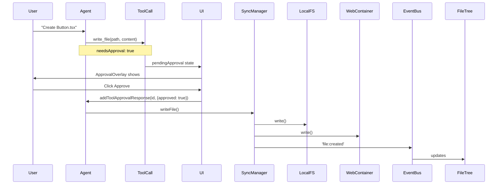

# Comprehensive Coding Agent Architecture Analysis

**Date:** 2025-12-24  
**Status:** DEEP INVESTIGATION  
**Sources:** Roo-code proposals, epic-25-11-06 research, TanStack AI docs, codebase review

---

## The ACTUAL Problem (Not Just "Code is Wired")

### What User Correctly Identified

1. **Sprint Chaos**: 28 epics, scattered statuses, context poisoning
2. **State Management Confusion**: TanStack Store vs Zustand vs IndexedDB vs Dexie
3. **Superficial Implementation**: Chat may stream but tools are NOT wired
4. **No Real Coding Agent Design**: Missing tool groups, modes, approval flow, context management
5. **Cross-Dependencies Broken**: FileTree ↔ SyncManager ↔ EventBus ↔ Monaco not connected

### What The Original Requirements Actually Demanded (epic-25-11-06)

From lines 111-189 of the research request:

```
write_file() COMPLEXITY:
- State Synchronization Chain:
  Agent write_file()
    → SyncManager.writeFile()
    → LocalFSAdapter.write() + WebContainer.fs.writeFile()
    → Event: 'file:changed' emitted
    → FileTree updates via EventEmitter listener
    → Monaco updates IF file is open (check EditorTabStore)
    → IndexedDB updates project metadata

- Concurrency Control:
  User edits file at same time as agent → CRITICAL RACE CONDITION
  Solution: Lock file while agent is writing (show "Agent is modifying...")
```

**THIS IS NOT IMPLEMENTED.** The current code only does chat streaming.

---

## Architecture Gaps

### ⚠️ MAJOR BREAKTHROUGH: Infrastructure is Complete!

After reviewing the source code, the tool infrastructure **IS correctly implemented**:

| File | Lines | Status | Notes |
|------|-------|--------|-------|
| `file-tools-impl.ts` | 172 | ✅ Complete | Wires to SyncManager + EventBus + FileLock |
| `write-file-tool.ts` | 91 | ✅ Complete | **Already has `needsApproval: true`** (line 25) |
| `factory.ts` | 229 | ✅ Complete | `createAgentClientTools()` with proper `clientTools()` wrapper |
| `terminal-tools-impl.ts` | ~150 | ✅ Complete | WebContainer execution with streaming |

### 🎯 ROOT CAUSE IDENTIFIED

**`AgentChatPanel.tsx` lines 144-146:**
```typescript
// Current (BROKEN):
const { ... } = useAgentChatWithTools({
    fileTools: null,     // ← PROBLEM!
    terminalTools: null, // ← PROBLEM!
    eventBus: null,      // ← PROBLEM!
    ...
});
```

**THIS IS A ONE-LINE FIX!** The facades exist, they're just not instantiated and passed.

### The Fix

Need to:
1. Get `localFSAdapter` and `syncManager` from WorkspaceContext
2. Create `FileToolsFacade` using `createFileToolsFacade()`
3. Create `TerminalToolsFacade` using workspace's WebContainer
4. Pass to `useAgentChatWithTools`

**Estimated effort:** 30-60 minutes

### Gap 3: Approval Flow Not Wired to Real Tools

**Current:**
- `ApprovalOverlay.tsx` can render
- `pendingApprovals` extracted from hook
- BUT: No tools have `needsApproval: true` defined

**Required (from Roo-code):**
```typescript
const writeFileDef = toolDefinition({
  name: "write_file",
  needsApproval: true,  // ← THIS IS MISSING
});
```

### Gap 4: Context Management for Agentic Coding

**Required (from epic-25-11-06 lines 340-382):**
```typescript
interface TaskContext {
  projectId: string;
  openFiles: { path: string; isDirty: boolean }[];
  terminalHistory: string[];
  syncStatus: 'idle' | 'syncing';
  permissions: { canRead, canWrite, canExecute };
}
```

**Current:** None of this is passed to the agent. Agent has NO context about workspace state.

---

## What A Real Coding Agent Needs (From Roo-code)

### Tool Groups (From roo-code-tools.md)

| Group | Tools | Via-Gent Status |
|-------|-------|-----------------|
| **Read** | read_file, list_files | ⚠️ Defined but not wired |
| **Edit** | write_file, apply_diff | ⚠️ Defined but not wired |
| **Command** | execute_command | ⚠️ Defined but not wired |
| **Workflow** | ask_followup_question, attempt_completion | ❌ Not implemented |
| **Browser** | browser_action | ❌ N/A for this project |

### Mode-Based Tool Access (From roo-code-modes-agents.md)

```yaml
# Code Mode: Full access
groups: [read, edit, command]

# Ask Mode: Read-only
groups: [read]

# Architect Mode: Design-focused
groups: [read]
```

**Via-Gent MVP:** Start with single "Code" mode with all tools.

### Approval Flow Pattern (Required)



---

## Remediation: What Actually Needs To Be Done

### Phase A: State Consolidation (Day 1)

1. **Audit all stores** - List Zustand, IndexedDB, localStorage usage
2. **Create unified workspace state** - Single source of truth
3. **Deprecate TanStack Store** - Not being used anyway

### Phase B: Tool Facade Wiring (Day 2-3)

1. **Wire FileToolsFacade to SyncManager**
   - File: `src/lib/agent/facades/file-tools-facade.ts`
   - Wire to: `src/lib/filesystem/sync-manager.ts`
   - Emit events to: `src/lib/events/workspace-events.ts`

2. **Wire TerminalToolsFacade to WebContainer**
   - File: `src/lib/agent/facades/terminal-tools-facade.ts`
   - Wire to: `src/lib/webcontainer/manager.ts`

3. **Add `needsApproval: true` to dangerous tools**
   - write_file: approval required
   - execute_command: approval required
   - read_file: no approval

### Phase C: Context Management (Day 3-4)

1. **Create TaskContext** from epic-25 requirements
2. **Pass to useAgentChatWithTools**
3. **Include in system prompt**

### Phase D: UI Integration (Day 4-5)

1. **Wire AgentChatPanel to pass real fileTools/terminalTools**
2. **Subscribe FileTree to agent events**
3. **Update Monaco on agent file changes**

---

## Files Requiring Changes

| File | Change | Priority |
|------|--------|----------|
| `AgentChatPanel.tsx` line 144-146 | Pass real tools not null | P0 |
| `file-tools-facade.ts` | Wire to SyncManager | P0 |
| `src/lib/agent/tools/*.ts` | Add needsApproval | P0 |
| `FileTree.tsx` | Subscribe to agent events | P1 |
| `src/lib/state/` | Audit and consolidate | P1 |

---

## Next Steps

1. Use Repomix to pack full codebase for pattern analysis
2. Map all state stores and their connections
3. Create detailed implementation plan with file-level changes
4. Execute Phase A first before any code changes
