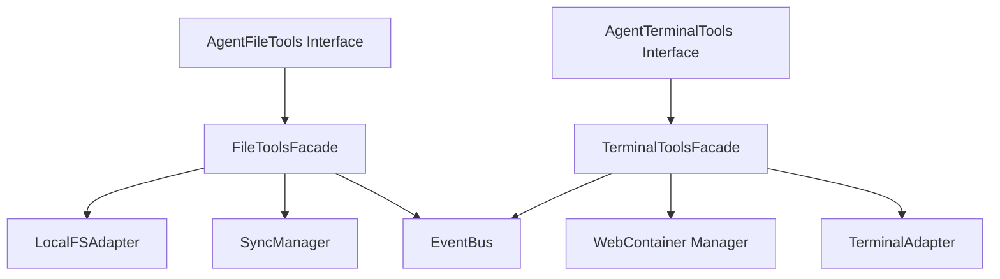
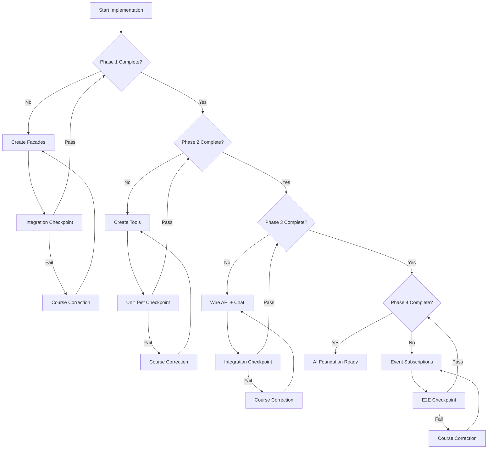

# 🎯 AI Agent Foundation: Master Implementation Plan

**Date**: 2025-12-23  
**Author**: BMad Master + SM (Multi-Agent Collaborative Planning)  
**Project**: Via-Gent Project Alpha  
**Status**: DRAFT - Pending User Review

---

## Executive Summary

This master implementation plan addresses the AI Agent Foundational Phase development - a **heavy, cross-architecture epic** requiring careful orchestration across:
- **Epic 25**: AI Foundation Sprint (6 stories, 34 points) - CORE WORK
- **Epic 12**: Tool Interface Layer (5 stories) - FACADE LAYER
- **Epic 28**: Remaining Event Subscriptions (Stories 28-24/25/26) - UI WIRING

> [!IMPORTANT]
> This implementation follows a **scaffolding-first, integration-verified** approach based on lessons learned from Epic 27 where "done" stories required subsequent integration verification story (27-I).

---

## User Review Required

> [!CAUTION]
> **Decision Point**: This plan proposes a specific implementation route (Option A). Please confirm:
> 1. Proceed with combined Epic 12 + Epic 25 approach?
> 2. Accept the guardrail checkpoints defined below?
> 3. Confirm test commands and verification approach?

---

## Lessons Learned from Epic 27

| Lesson | Application |
|--------|-------------|
| **Integration-Pending Pattern** | Every "infrastructure" story is followed by integration verification before marking complete |
| **Module-Level Patterns** | Use `setEventBus()` for module singletons, not constructor injection |
| **Deferred Optional Work** | Low-priority tasks (T5, T6, T7) can be safely deferred to maintain velocity |
| **Pre-existing Failures** | Document pre-existing test failures separately (2 IDELayout failures) |
| **Brownfield Awareness** | Single-digit epics (1-5) have limited documentation - validate against actual code |

---

## Proposed Changes

### Pre-Implementation: Project Context Update

> [!NOTE]
> The existing [project-context.md](file:///c:/Users/Admin/Documents/coding-project/project-alpha-master/project-alpha-master/_bmad-output/project-context.md) has stale data (TanStack AI 0.0.3, lists idb). Update before implementation.

#### [MODIFY] [project-context.md](file:///c:/Users/Admin/Documents/coding-project/project-alpha-master/project-alpha-master/_bmad-output/project-context.md)
- Update TanStack AI version to 0.1.0
- Replace idb references with Dexie.js
- Add Zustand to state management section
- Add AI Agent tool patterns

---

### Phase 1: Scaffolding Layer (Epic 12 - Days 1-2)

Create the **facade interfaces** that decouple tool logic from implementation details.



#### [NEW] `src/lib/agent/facades/file-tools.ts`
Interface definition for `AgentFileTools`:
- `readFile(path: string): Promise<string | null>`
- `writeFile(path: string, content: string): Promise<void>`
- `listDirectory(path: string, recursive?: boolean): Promise<FileEntry[]>`
- `createFile(path: string, content: string): Promise<void>`
- `deleteFile(path: string): Promise<void>`

#### [NEW] `src/lib/agent/facades/file-tools-impl.ts`
Implementation wrapping LocalFSAdapter + SyncManager + EventBus:
- Path validation (no `..`, no absolute paths)
- Write triggers: Monaco update → LocalFS → WebContainer → Event emission
- ~150 lines per Epic 12 acceptance criteria

#### [NEW] `src/lib/agent/facades/terminal-tools.ts`
Interface definition for `AgentTerminalTools`:
- `runCommand(command: string, args?: string[]): Promise<CommandResult>`
- `streamCommand(command: string, args?: string[], onOutput?: callback): Promise<void>`
- `killProcess(pid: string): Promise<void>`
- `listProcesses(): Promise<Process[]>`

#### [NEW] `src/lib/agent/facades/terminal-tools-impl.ts`
Implementation wrapping WebContainer Manager + TerminalAdapter + EventBus

#### [NEW] `src/lib/agent/facades/index.ts`
Public API exports

---

### Phase 2: Tool Execution Layer (Epic 25-1/2/3 - Days 3-5)

Implement the actual TanStack AI tool definitions using the facades.

#### [NEW] `src/lib/agent/tools/base-tool.ts`
Abstract `BaseTool<TName extends ToolName>` class:
```typescript
abstract class BaseTool<TName extends ToolName> {
  abstract readonly name: TName;
  abstract readonly description: string;
  abstract readonly parameters: z.ZodType;
  abstract execute(params): Promise<ToolResult>;
  toToolDefinition(): TanStackAITool;
}
```

#### [NEW] `src/lib/agent/tools/read-file-tool.ts`
Implements `BaseTool<'read_file'>` using `AgentFileTools`

#### [NEW] `src/lib/agent/tools/write-file-tool.ts`
Implements `BaseTool<'write_file'>` using `AgentFileTools`

#### [NEW] `src/lib/agent/tools/list-files-tool.ts`
Implements `BaseTool<'list_files'>` using `AgentFileTools`

#### [NEW] `src/lib/agent/tools/execute-command-tool.ts`
Implements `BaseTool<'execute_command'>` using `AgentTerminalTools`

#### [NEW] `src/lib/agent/tools/index.ts`
Export all tools + `createAgentTools()` factory

---

### Phase 3: API Route + Chat Integration (Epic 25-1 - Days 5-6)

Wire TanStack AI to the chat interface.

#### [NEW] `src/routes/api/chat.ts`
TanStack Start API route:
- Accept messages from `useChat` hook
- Initialize tools with facades (DI pattern)
- Stream responses with `streamText`
- Handle tool calls with `ToolCallManager`

#### [MODIFY] [src/components/ide/AgentChatPanel.tsx](file:///c:/Users/Admin/Documents/coding-project/project-alpha-master/project-alpha-master/src/components/ide/AgentChatPanel.tsx)
Wire to actual TanStack AI:
- Replace mock [useAgents](file:///c:/Users/Admin/Documents/coding-project/project-alpha-master/project-alpha-master/src/hooks/useAgents.ts#22-94) with `useChat` from `@tanstack/ai-react`
- Connect to `/api/chat` endpoint
- Handle streaming responses

#### [NEW] `src/hooks/useAgentChat.ts`
Custom hook wrapping `useChat` with:
- Project context injection
- Tool execution event handling
- Error boundary integration

---

### Phase 4: Event Bus Wiring (Epic 25-4, 28-24/25/26 - Days 6-7)

Wire tool execution to UI updates.

#### [MODIFY] `src/components/ide/FileTree.tsx` (Story 28-24)
Subscribe to events:
- `file:created` → Add file to tree
- `file:deleted` → Remove from tree
- `file:renamed` → Update path

#### [MODIFY] `src/components/ide/MonacoEditorWrapper.tsx` (Story 28-25)
Subscribe to events:
- `file:modified` (source: agent) → Refresh content

#### [MODIFY] [src/components/ide/XTerminal.tsx](file:///c:/Users/Admin/Documents/coding-project/project-alpha-master/project-alpha-master/src/components/ide/XTerminal.tsx) (Story 28-26)
Subscribe to events:
- `process:output` → Stream to terminal
- `process:exited` → Show exit code

---

### Phase 5: Approval Flow Integration (Epic 25-5 - Day 7)

Connect existing ApprovalOverlay to actual tool execution.

#### [MODIFY] [src/components/chat/ApprovalOverlay.tsx](file:///c:/Users/Admin/Documents/coding-project/project-alpha-master/project-alpha-master/src/components/chat/ApprovalOverlay.tsx)
Wire to real approval flow:
- `needsApproval: true` tools pause for user decision
- Accept triggers tool execution
- Reject cancels with message to AI

---

## Conditional Routing System



### Guardrail Checkpoints

| Checkpoint | Trigger | Pass Criteria | Fail Action |
|------------|---------|---------------|-------------|
| **Integration-1** | After Phase 1 | Facades compile, can be imported | Fix TypeScript errors |
| **UnitTest-2** | After Phase 2 | All tool unit tests pass | Debug failing tests |
| **Integration-3** | After Phase 3 | `/api/chat` returns streaming response | Debug API route |
| **E2E-4** | After Phase 4 | "Create a file" → File appears in FileTree | Trace event path |
| **Approval-5** | After Phase 5 | Write tool shows diff, waits for approval | Debug approval flow |

---

## Verification Plan

### Automated Tests

#### Unit Tests (Per Phase)

| Phase | Test File | Command |
|-------|-----------|---------|
| 1 | `src/lib/agent/facades/__tests__/file-tools.test.ts` | `pnpm test -- file-tools` |
| 1 | `src/lib/agent/facades/__tests__/terminal-tools.test.ts` | `pnpm test -- terminal-tools` |
| 2 | `src/lib/agent/tools/__tests__/read-file-tool.test.ts` | `pnpm test -- read-file-tool` |
| 2 | `src/lib/agent/tools/__tests__/write-file-tool.test.ts` | `pnpm test -- write-file-tool` |
| 2 | `src/lib/agent/tools/__tests__/execute-command-tool.test.ts` | `pnpm test -- execute-command` |
| 3 | `src/routes/api/__tests__/chat.test.ts` | `pnpm test -- chat.test` |

**Run All Tests**:
```bash
pnpm test
```

**Type Check**:
```bash
pnpm exec tsc --noEmit
```

**Build Verification**:
```bash
pnpm build
```

### Integration Tests (End of Each Phase)

**Phase 1 Integration Check**:
```typescript
// test in console
import { FileToolsFacade, TerminalToolsFacade } from '@/lib/agent/facades';
console.log(FileToolsFacade, TerminalToolsFacade); // Should not throw
```

**Phase 3 Integration Check**:
```bash
# Start dev server
pnpm dev

# In browser, open network tab
# Send message in chat panel
# Verify /api/chat returns streaming response
```

**Phase 4 E2E Check**:
```markdown
1. Open Via-Gent in browser at localhost:5173
2. In chat panel, type: "Create a file called test.txt with content 'hello'"
3. Observe:
   - Agent shows "Executing write_file..." badge
   - ApprovalOverlay appears (if enabled)
   - After approval, file appears in FileTree
   - File opens in Monaco Editor
```

### Manual Verification (User)

> [!NOTE]
> The following manual tests require user interaction:

1. **Tool Execution Flow**: Ask agent to create a React component, verify it appears in editor
2. **Approval Workflow**: Ask agent to delete a file, verify approval dialog appears
3. **Error Handling**: Ask agent to read non-existent file, verify graceful error message
4. **Streaming**: Send complex request, verify token-by-token streaming in chat

---

## File Summary

| Action | Count | Files |
|--------|-------|-------|
| [NEW] | 12 | All facade + tool files |
| [MODIFY] | 7 | AgentChatPanel, FileTree, Monaco, XTerminal, ApprovalOverlay, project-context, chat route |

---

## Risk Mitigation

| Risk | Probability | Impact | Mitigation |
|------|-------------|--------|------------|
| TanStack AI API changes | Low | High | Pin version 0.1.0, test before upgrade |
| Event bus race conditions | Medium | Medium | Use debouncing, test async flows |
| WebContainer unavailable | Low | High | Graceful degradation, mock mode |
| Facade complexity growth | Medium | Medium | Strict line limits per Epic 12 |
| Integration failures | High | High | Checkpoint after each phase |

---

## Timeline

| Day | Phase | Stories | Checkpoint |
|-----|-------|---------|------------|
| 1-2 | Phase 1: Scaffolding | 12-1, 12-2 | Integration-1 |
| 3-5 | Phase 2: Tools | 25-2, 25-3 | UnitTest-2 |
| 5-6 | Phase 3: API + Chat | 25-1 | Integration-3 |
| 6-7 | Phase 4: Events | 25-4, 28-24/25/26 | E2E-4 |
| 7 | Phase 5: Approval | 25-5 | Approval-5 |
| 8+ | Buffer / Course Correction | 25-6 (DevTools) | Final |

---

*Generated by BMad Master + SM collaborative planning*
