# 🎯 AI Agent Foundation: Master Implementation Plan

**Date**: 2025-12-23 (Updated: 2025-12-23T18:42:00+07:00)  
**Author**: BMad Master + SM (Multi-Agent Collaborative Planning)  
**Project**: Via-Gent Project Alpha  
**Status**: APPROVED + RESEARCH COMPLETE

---

## 📋 Document Change Log

| Version | Date | Changes |
|---------|------|---------|
| v1.0 | 2025-12-23T03:30 | Initial draft |
| v1.1 | 2025-12-23T18:42 | **RESEARCH COMPLETE**: Added OpenRouter, edge cases, multilingual findings |

---

## Executive Summary

This master implementation plan addresses the AI Agent Foundational Phase development - a **heavy, cross-architecture epic** requiring careful orchestration across:
- **Epic 25**: AI Foundation Sprint (6 stories + 1 NEW, 34+ points) - CORE WORK
- **Epic 12**: Tool Interface Layer (5 stories + 1 NEW) - FACADE LAYER
- **Epic 28**: Remaining Event Subscriptions (Stories 28-24/25/26) - UI WIRING

> [!IMPORTANT]
> This implementation follows a **scaffolding-first, integration-verified** approach based on lessons learned from Epic 27 where "done" stories required subsequent integration verification story (27-I).

---

## ✅ Research Findings (2025-12-23)

### OpenRouter Integration: CONFIRMED COMPATIBLE

```typescript
// TanStack AI OpenAI adapter works with OpenRouter via baseURL
import { openai } from "@tanstack/ai-openai";

const adapter = openai({
  apiKey: process.env.OPENROUTER_API_KEY,
  baseURL: "https://openrouter.ai/api/v1", // ✅ Works!
});
```

**December 2025 Free Models Available:**
- `meta-llama/llama-3.1-8b-instruct:free`
- `google/gemini-2.0-flash-exp:free`
- `x-ai/grok-4-fast:free` (with reasoning)
- `deepseek/deepseek-r1:free`, `deepseek/deepseek-v3:free`

### Tool Edge Cases: MITIGATIONS DEFINED

| Edge Case | Severity | Solution |
|-----------|----------|----------|
| Concurrent user+agent edits | **Critical** | File-level mutex lock with 30s timeout |
| Monaco unsaved changes | **Critical** | 3-option dialog: Allow/Cancel/Merge |
| Agent reads during sync | Medium | Check syncStatus, wait if 'syncing' |
| Binary file detection | Medium | Check MIME type, return base64 |
| Long-running commands | Medium | 2-minute timeout with progress callback |
| Permission denied FSA | Medium | Emit error + trigger re-permission dialog |

### Multilingual (en/vi): DEFERRED TO PHASE 5

LLMs understand Vietnamese natively - no translation layer needed.
- **MVP**: Add `preferredLanguage: 'en' | 'vi'` to CoderAgent config
- **Phase 5**: Full LanguageManager with scoped preferences

---

## 🆕 New Stories Added (from Research)

### Story 12-1B: Add Concurrency Control to FileToolsFacade

**Rationale**: Research identified concurrent edits as critical edge case.

**Scope**:
- Add file-level mutex lock (acquire before write, release after)
- Emit `lockAcquired` timestamp in file events
- 30-second timeout with graceful failure

**Acceptance Criteria**:
- AC-12-1B-1: Write operations acquire lock before modifying
- AC-12-1B-2: Lock timeout after 30s with error event
- AC-12-1B-3: Unit tests cover concurrent write scenario

---

### Story 25-0: Create ProviderAdapterFactory with OpenRouter

**Rationale**: Enable real API testing during development (battle-testing).

**Scope**:
```
src/lib/agent/providers/
├── provider-adapter.ts     # Factory for TanStack AI adapters
├── credential-vault.ts     # IndexedDB + Web Crypto API storage
├── model-registry.ts       # Dynamic model fetching from providers
└── index.ts
```

**Acceptance Criteria**:
- AC-25-0-1: OpenRouter works as OpenAI adapter with baseURL override
- AC-25-0-2: API keys stored encrypted (AES-GCM) in IndexedDB
- AC-25-0-3: Model list fetched dynamically from provider API
- AC-25-0-4: Connection test validates API key before use

---

## Current Progress

### ✅ Story 12-1: DONE (2025-12-23T03:53)
- `src/lib/agent/facades/file-tools.ts` - Interface + types
- `src/lib/agent/facades/file-tools-impl.ts` - Implementation
- `src/lib/agent/facades/index.ts` - Public exports
- **14 tests passing**

---

## Proposed Changes

### Pre-Implementation: Project Context Update

> [!NOTE]
> The existing [project-context.md](file:///c:/Users/Admin/Documents/coding-project/project-alpha-master/project-alpha-master/_bmad-output/project-context.md) has stale data (TanStack AI 0.0.3, lists idb). Update before implementation.

#### [MODIFY] project-context.md
- Update TanStack AI version to 0.1.0
- Replace idb references with Dexie.js
- Add Zustand to state management section
- Add AI Agent tool patterns

---

### Phase 1: Scaffolding Layer (Epic 12 - Days 1-2.5) ⚡ +0.5 day

Create the **facade interfaces** that decouple tool logic from implementation details.

```mermaid
flowchart TD
    A[AgentFileTools Interface] --> B[FileToolsFacade]
    B --> C[LocalFSAdapter]
    B --> D[SyncManager]
    B --> E[EventBus]
    B --> LOCK[FileLock 🆕]
    
    F[AgentTerminalTools Interface] --> G[TerminalToolsFacade]
    G --> H[WebContainer Manager]
    G --> I[TerminalAdapter]
    G --> E
```



| Story | Status | Files |
|-------|--------|-------|
| 12-1: AgentFileTools Facade | ✅ DONE | `facades/file-tools.ts`, `file-tools-impl.ts` |
| **12-1B: Concurrency Control** | ✅ DONE | `facades/file-lock.ts` (28 tests) |
| 12-2: AgentTerminalTools Facade | ✅ DONE | `facades/terminal-tools.ts`, `terminal-tools-impl.ts` (14 tests) |
| 12-3: AgentSyncTools Facade | Backlog | Optional |
| 12-4: AgentGitTools Stub | Backlog | Stub only |

---

### Phase 2: Provider + Tool Layer (Epic 25-0/1/2/3 - Days 3-5.5) ⚡ +0.5 day

#### [NEW] `src/lib/agent/providers/` (Story 25-0)

| File | Purpose |
|------|---------|
| `provider-adapter.ts` | Factory creating TanStack AI adapters |
| `credential-vault.ts` | Encrypted API key storage (Web Crypto) |
| `model-registry.ts` | Dynamic model list from providers |
| `types.ts` | ProviderConfig, ModelInfo, AdapterConfig |

#### [NEW] `src/lib/agent/tools/` (Story 25-2/3)

| File | Purpose |
|------|---------|
| `base-tool.ts` | Abstract BaseTool class |
| `read-file-tool.ts` | ReadFileTool using AgentFileTools |
| `write-file-tool.ts` | WriteFileTool with approval flow |
| `list-files-tool.ts` | ListFilesTool for directory listing |
| `execute-command-tool.ts` | ExecuteCommandTool with streaming |

---

### Phase 3: API Route + Chat Integration (Epic 25-1 - Days 5.5-6.5)

#### [NEW] `src/routes/api/chat.ts`
```typescript
import { chat, ToolCallManager } from "@tanstack/ai";
import { providerAdapter } from "@/lib/agent/providers";

export async function POST({ request }) {
  const { messages, providerId, modelId } = await request.json();
  
  const adapter = providerAdapter.createAdapter({
    providerId,
    apiKey: await credentialVault.getCredentials(providerId),
  });
  
  const stream = chat({
    adapter: adapter(modelId),
    messages,
    tools: agentTools.getDefinitions(),
  });
  
  return new Response(stream, {
    headers: { 'Content-Type': 'text/event-stream' }
  });
}
```

---

### Phase 4: Event Bus Wiring (Epic 25-4, 28-24/25/26 - Days 6.5-7.5)

| Story | Component | Events |
|-------|-----------|--------|
| 28-24 | FileTree | `file:created`, `file:deleted`, `file:renamed` |
| 28-25 | Monaco | `file:modified` (source: agent) |
| 28-26 | Terminal | `process:output`, `process:exited` |

---

### Phase 5: Approval Flow + Multilingual (Epic 25-5 - Day 7.5-8)

#### ApprovalOverlay Integration
- `needsApproval: true` tools pause for user decision
- Accept triggers tool execution
- Reject cancels with message to AI

#### Multilingual MVP (Minimal)
```typescript
interface CoderAgentConfig {
  // ... existing fields
  preferredLanguage: 'en' | 'vi'; // 🆕 MVP
}

const LANGUAGE_PROMPTS = {
  en: "Respond in English. Be professional and clear.",
  vi: "Trả lời bằng tiếng Việt. Sử dụng thuật ngữ kỹ thuật tiếng Anh khi cần."
};
```

---

## TanStack AI Patterns (December 2025)

### Hybrid Tool Definition (Server + Client)

```typescript
import { toolDefinition } from "@tanstack/ai";
import { z } from "zod";

const writeFileDef = toolDefinition({
  name: "write_file",
  description: "Write content to a file",
  inputSchema: z.object({
    path: z.string().describe("File path relative to project root"),
    content: z.string().describe("File content to write"),
  }),
  outputSchema: z.object({
    success: z.boolean(),
    path: z.string(),
  }),
});

// Server implementation
const writeFileServer = writeFileDef.server(async ({ path, content }) => {
  await fileToolsFacade.writeFile(path, content);
  return { success: true, path };
});
```

### Tool Execution Streaming

```typescript
const manager = new ToolCallManager(tools);

for await (const chunk of stream) {
  if (chunk.type === 'tool_call') {
    manager.addToolCallChunk(chunk);
  }
}

if (manager.hasToolCalls()) {
  yield* manager.executeTools(doneChunk);
}
```

### OpenAI Adapter with Custom Endpoint

```typescript
import { openai } from "@tanstack/ai-openai";

const adapter = openai({
  apiKey: process.env.OPENROUTER_API_KEY,
  baseURL: "https://openrouter.ai/api/v1",
});

const stream = chat({
  adapter,
  model: "meta-llama/llama-3.1-8b-instruct:free",
  messages,
  tools,
});
```

---

## Guardrail Checkpoints

| Checkpoint | Trigger | Pass Criteria | Fail Action |
|------------|---------|---------------|-------------|
| **Integration-1** | After Phase 1 | Facades compile, 14+ tests pass | Fix TypeScript errors |
| **Provider-1.5** | After Story 25-0 | OpenRouter connection test passes | Debug API adapter |
| **UnitTest-2** | After Phase 2 | All tool unit tests pass | Debug failing tests |
| **Integration-3** | After Phase 3 | `/api/chat` returns streaming response | Debug API route |
| **E2E-4** | After Phase 4 | "Create a file" → File appears in FileTree | Trace event path |
| **Approval-5** | After Phase 5 | Write tool shows diff, waits for approval | Debug approval flow |

---

## Updated Timeline

| Day | Phase | Stories | Checkpoint |
|-----|-------|---------|------------|
| 1-2 | Phase 1: Scaffolding | 12-1 ✅, **12-1B** 🆕, 12-2 | Integration-1 |
| 3-4 | Phase 2a: Provider | **25-0** 🆕 | Provider-1.5 |
| 4-5 | Phase 2b: Tools | 25-2, 25-3 | UnitTest-2 |
| 5-6 | Phase 3: API + Chat | 25-1 | Integration-3 |
| 6-7 | Phase 4: Events | 25-4, 28-24/25/26 | E2E-4 |
| 7-8 | Phase 5: Approval + i18n | 25-5 + Multilingual MVP | Approval-5 |
| 8+ | Buffer / Course Correction | 25-6 (DevTools) | Final |

---

## Risk Assessment

| Risk | Probability | Impact | Mitigation |
|------|-------------|--------|------------|
| OpenRouter rate limits | Medium | Low | Use free models sparingly in tests |
| Concurrent edit conflicts | Medium | High | File locking + user confirmation (12-1B) |
| Vitest environment issues | Low | Medium | Simplified mock patterns (proven fix) |
| WebContainer boot failures | Low | High | Retry logic + error states |
| TanStack AI API changes | Low | High | Pin version 0.1.0 |

---

## How to Use This Document

**For New Conversations / story-dev-cycle:**

1. **Attach this file** to provide full context
2. **Reference specific sections** by phase/story
3. **Use TanStack AI patterns** section for implementation
4. **Check progress** via Current Progress section
5. **Update** after each story completion

**Story Execution Order:**
```
12-1 ✅ → 12-1B ✅ → 12-2 ✅ → 25-0 ✅ → 25-2 ✅ → 25-3 → 25-1 → 25-4/28-24/25/26 → 25-5
```

---

*Generated by BMad Master + SM collaborative planning • Research by Context7 + Exa + Tavily*

