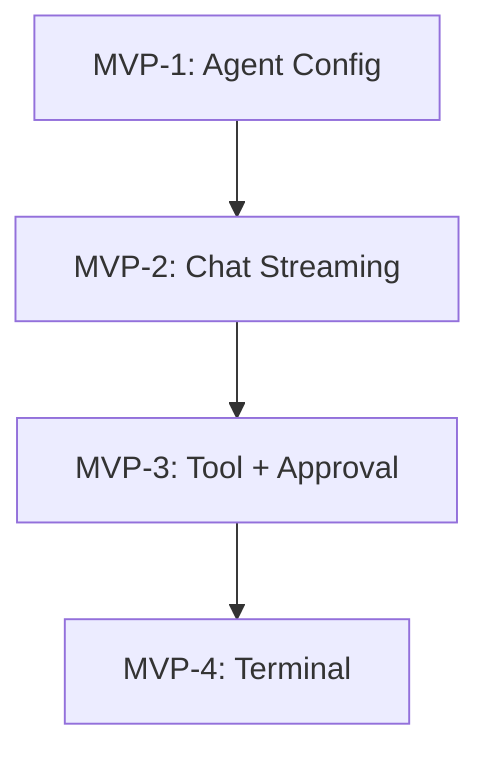

# Epic MVP: AI Coding Agent - Vertical Slice MVP

**Created:** 2025-12-24T18:55:00+07:00  
**Priority:** P0 - Critical  
**Incident:** INC-2025-12-24-001  
**Author:** BMAD Master (Coordinator)  
**Status:** ACTIVE  

---

## Executive Summary

This epic consolidates the scattered work from Epic 25, Epic 28, and Epic 12 into a **single vertical slice MVP**. The goal is to achieve **one working end-to-end flow** before expanding.

### Consolidates:
- **Epic 25:** AI Foundation Sprint (6 stories - all failed E2E)
- **Epic 28:** UX Brand Identity - Chat Components (Stories 28-16 through 28-23)
- **Epic 12:** Tool Interface Layer (Story 12-5)
- **Remediation:** Story 25-R1 (partially complete)

---

## Success Criteria

One working E2E flow demonstrating:

1. ✅ Configure agent with OpenRouter API key → persists after refresh
2. ✅ Send chat message → receive streaming response (NOT mock)
3. ✅ Agent calls tool → ApprovalOverlay shows → Approve → execution visible
4. ✅ File operation visible in FileTree
5. ✅ Terminal command visible in XTerminal

---

## Stories

### MVP-1: Agent Configuration End-to-End

**Status:** `ready-for-dev`  
**Points:** 3  
**Depends on:** None  

**Builds on:** Story 25-R1 Session 3 (agents-store.ts created)

**Acceptance Criteria:**
- [ ] AC-MVP-1-1: Agent persists to localStorage after page refresh
- [ ] AC-MVP-1-2: API key stored (encrypted with credentialVault)
- [ ] AC-MVP-1-3: Model selection from dropdown
- [ ] AC-MVP-1-4: "Test Connection" button validates API key

**Verification Scenario:**
- Open app → Configure agent → Refresh → Agent still configured → Test connection works

---

### MVP-2: Chat Message → Streaming Response

**Status:** `ready-for-dev`  
**Points:** 5  
**Depends on:** MVP-1  

**Builds on:** Story 25-R1 Session 2 (500 error fixed)

**Acceptance Criteria:**
- [ ] AC-MVP-2-1: Message sent via `useAgentChatWithTools.sendMessage()`
- [ ] AC-MVP-2-2: Response streams token-by-token (NOT all at once)
- [ ] AC-MVP-2-3: No mock setTimeout responses
- [ ] AC-MVP-2-4: Typing indicator shows during response
- [ ] AC-MVP-2-5: Error message displays on failure

**Verification Scenario:**
- Send "Hello" → See typing indicator → Response streams in → Completes

---

### MVP-3: Tool Execution with Approval Flow

**Status:** `blocked`  
**Points:** 8  
**Depends on:** MVP-2  

**Builds on:** Stories 25-4, 25-5 (components exist but not wired)

**Acceptance Criteria:**
- [ ] AC-MVP-3-1: Agent calls `write_file` → ToolCallBadge displays
- [ ] AC-MVP-3-2: ApprovalOverlay triggers with file details
- [ ] AC-MVP-3-3: Approve button calls real `approveToolCall()`
- [ ] AC-MVP-3-4: After approval, file appears in FileTree
- [ ] AC-MVP-3-5: Event bus emits `file:created`

**Verification Scenario:**
- Send "Create a file test.txt with Hello World" → See tool call badge → Approval overlay → Approve → File in FileTree

---

### MVP-4: Terminal Command Execution

**Status:** `blocked`  
**Points:** 5  
**Depends on:** MVP-3  

**Builds on:** Story 25-3 (TerminalToolsFacade exists)

**Acceptance Criteria:**
- [ ] AC-MVP-4-1: Agent calls `execute_command` → ToolCallBadge displays
- [ ] AC-MVP-4-2: ApprovalOverlay shows command
- [ ] AC-MVP-4-3: After approval, command runs in XTerminal
- [ ] AC-MVP-4-4: Output visible in terminal
- [ ] AC-MVP-4-5: Agent response includes command result

**Verification Scenario:**
- Send "Run npm --version" → Approve → See output in terminal

---

## Implementation Order

---

## Files to Verify/Modify

### Already Working (from 25-R1 Session 3):
- `src/stores/agents-store.ts` - Zustand + persist ✅
- `src/hooks/useAgents.ts` - Uses persistent store ✅
- `src/routes/api/chat.ts` - Accepts apiKey from body ✅

### Need Verification:
- `src/components/ide/AgentChatPanel.tsx` - Uses real hook?
- `src/lib/agent/hooks/use-agent-chat-with-tools.ts` - Streaming works?
- `src/components/chat/ApprovalOverlay.tsx` - Wired to real pendingApprovals?

### Need Implementation:
- Tool facade wiring in AgentChatPanel
- Event bus subscriptions for FileTree refresh
- Terminal output streaming

---

## Timeline

| Story | Duration | Completion |
|-------|----------|------------|
| MVP-1 | 2 hours | Verify existing |
| MVP-2 | 4 hours | E2E test focus |
| MVP-3 | 6 hours | Integration work |
| MVP-4 | 4 hours | Wiring |

**Total:** ~16 hours (2 days)

---

## References

- [Root Cause Analysis](../_bmad-output/critical-incidents/root-cause-analysis-e2e-validation-failure-2025-12-24.md)
- [Rescoped Requirements](../_bmad-output/requirements-rescoped-e2e-integration-2025-12-24.md)
- [Story 25-R1](./25-R1-integrate-useagentchat-to-chatpanel.md)

---

**Epic Status:** ACTIVE  
**Next Story:** MVP-1 (verify agent persistence)
