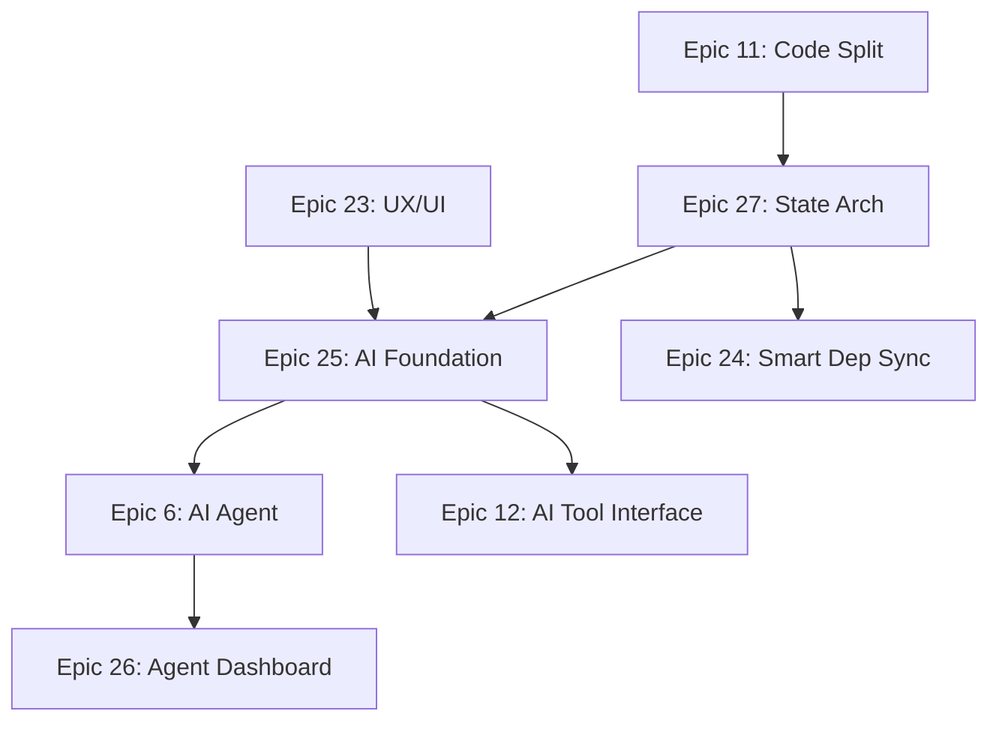

# Epic and Story Completion Audit + Roadmap

**Date:** 2025-12-22T02:10+07:00  
**Scope:** Epic 27 integration, code organization, epic consolidation  
**Status:** 🟡 IN PROGRESS - Phase 1 at 7/13 stories, Phase 2 consolidated


---

## Executive Summary

### Documentation vs Reality (Critical Gap)

| Document | Claims | Reality |
|----------|--------|---------|
| Epic 27 | "5/7 stories done" | Core IDE broken |
| Story 27-I | "done" | All 16 tasks unchecked `[ ]` |
| sprint-status.yaml | "integration-pending" | Correct status, ignored |
| GOVERNANCE-INDEX | "INTEGRATION-DONE" | False |

### Code Organization Violations

| File | Lines | Limit | Violation |
|------|-------|-------|-----------|
| [IDELayout.tsx](file:///c:/Users/Admin/Documents/coding-project/project-alpha-master/project-alpha-master/src/components/layout/IDELayout.tsx) | **526** | 250 | **+276** |
| [sync-manager.ts](file:///c:/Users/Admin/Documents/coding-project/project-alpha-master/project-alpha-master/src/lib/filesystem/sync-manager.ts) | **405** | 250 | **+155** |
| [project-store.ts](file:///c:/Users/Admin/Documents/coding-project/project-alpha-master/project-alpha-master/src/lib/workspace/project-store.ts) | **326** | 250 | **+76** |
| `IDEHeaderBar.tsx` | **264** | 250 | **+14** |
| `routes/index.tsx` | **297** | 250 | **+47** |

| Folder | Files | Limit | Violation |
|--------|-------|-------|-----------|
| `lib/filesystem` | **27** (20 code + 7 tests) | 4 | **+23** |
| `lib/workspace` | **16** (10 code + 6 tests) | 4 | **+12** |
| `components/layout` | **6** | 4 | **+2** |

---

## Part 1: Epic Status Audit

### Epics Marked "DONE" - Verification

| Epic | Sprint Status | Verified | Issues |
|------|---------------|----------|--------|
| Epic 1 | done | ✅ | Core foundation works |
| Epic 2 | done | ⚠️ | pnpm version issue |
| Epic 3 | done | ❌ | Sync stuck, ContextMenu crash |
| Epic 4 | done | ❌ | Editor empty, path mismatch |
| Epic 5 | done | ❌ | Superseded by 27, not migrated |
| Epic 10 | done | ⚠️ | Emissions exist, subscriptions untested |
| Epic 13 | done | ⚠️ | Stories done, but depends on broken sync |

### Epics "IN PROGRESS" - Completion Status

| Epic | Stories Done | Remaining | Blockers |
|------|--------------|-----------|----------|
| Epic 11 (Code Splitting) | 4/7 | 11-5, 11-6, 11-7 | Paused for Epic 13 |
| Epic 21 (Localization) | 4/8 | 21-5 to 21-8 | Platform A |
| Epic 22 (Production) | 8/8 | None | Retrospective pending |
| Epic 23 (UX/UI) | 5/16 | 23-6 to 23-16 | Platform B |
| Epic 27 (State Arch) | 4/7 | 27-3, 27-4, 27-I (real) | Core IDE broken |

---

## Part 2: Epic Consolidation Strategy

### Problem: Fragmented Responsibilities

Current state shows overlapping concerns:

```
Epic 3 (FSA) → Sync bugs
Epic 5 (Persistence) → Superseded by 27
Epic 10 (Event Bus) → Incomplete wiring
Epic 11 (Code Splitting) → Paused, partially solves violations
Epic 13 (Terminal/Sync) → Fixes symptoms, not root cause
Epic 27 (State Arch) → Should consolidate all of above
```

### Proposed Consolidation

#### Option A: Epic 27 Absorbs Related Work

Extend Epic 27 to include:
- **27-5a**: Refactor IDELayout.tsx (526→<250 lines) ← From Epic 11-5
- **27-5b**: Refactor sync-manager.ts (405→<250 lines) ← From Epic 11
- **27-5c**: Refactor project-store.ts (326→<250 lines) ← New
- **27-6**: Reorganize lib/filesystem folder (27→<4 files) ← New
- **27-7**: Reorganize lib/workspace folder (16→<4 files) ← New
- **27-8**: Terminal sync-fail handling ← From user request

#### Option B: Create Epic 28 (Architecture Cleanup)

Keep Epic 27 as-is, create new epic:
- **Epic 28: Code Organization & Refactoring**
  - 28-1: Refactor IDELayout.tsx
  - 28-2: Refactor sync-manager.ts
  - 28-3: Reorganize lib/filesystem
  - 28-4: Reorganize lib/workspace
  - 28-5: Fix remaining Epic 27 integration issues

### Recommendation: Option A

**Rationale:**
1. Epic 27 is already P0 blocking everything
2. Code violations ARE the integration issues
3. No point creating new epic that duplicates work
4. Epic 11 was paused - its remaining work fits here

---

## Part 3: Code Organization Refactoring

### 3.1 IDELayout.tsx (526 lines → multiple files)

**Current structure:**
```
IDELayout.tsx - MONOLITH
├── 1-100: Imports, state initialization
├── 100-300: Boot sequence, sync effects
├── 300-400: Event handlers
├── 400-526: JSX rendering
```

**Proposed refactoring:**
```
components/layout/
├── IDELayout.tsx (120 lines) - Main orchestrator
├── BootSequence.tsx (80 lines) - WebContainer boot
├── SyncEffects.tsx (60 lines) - Sync-related effects
├── IDEPanels.tsx (100 lines) - Panel rendering
└── hooks/
    ├── useIDEBoot.ts (80 lines)
    └── useIDESync.ts (60 lines)
```

### 3.2 sync-manager.ts (405 lines → module split)

**Current structure:**
```
sync-manager.ts - MONOLITH
├── SyncManager class (300+ lines)
├── Helper functions
└── Type definitions
```

**Note:** Epic 11 already extracted:
- 11-3: sync-planner.ts ✅
- 11-4: sync-executor.ts ✅

**Still needed:**
```
lib/filesystem/sync/
├── index.ts (10 lines) - Public exports
├── sync-manager.ts (150 lines) - Orchestrator only
├── sync-config.ts (50 lines) - Configuration
└── sync-events.ts (50 lines) - Event emissions
```

### 3.3 project-store.ts (326 lines)

**Proposed split:**
```
lib/workspace/
├── project-store/
│   ├── index.ts (20 lines)
│   ├── project-store.ts (100 lines) - Core CRUD
│   ├── project-queries.ts (80 lines) - Query functions
│   └── project-persistence.ts (100 lines) - IndexedDB logic
```

### 3.4 lib/filesystem folder (27 files → grouped)

**Current structure (FLAT):**
```
lib/filesystem/
├── __tests__/ (7 files)
├── dir-ops.ts
├── directory-walker.ts
├── exclusion-config.ts
├── file-ops.ts
├── fs-errors.ts
├── fs-types.ts
├── handle-utils.ts
├── index.ts
├── local-fs-adapter.ts
├── path-guard.ts
├── path-utils.ts
├── permission-lifecycle.ts
├── sync-executor.ts
├── sync-manager.ts
├── sync-operations.ts
├── sync-planner.ts
├── sync-types.ts
└── sync-utils.ts
```

**Proposed structure:**
```
lib/filesystem/
├── index.ts (public exports)
├── core/
│   ├── fs-types.ts
│   ├── fs-errors.ts
│   └── path-utils.ts
├── adapter/
│   ├── local-fs-adapter.ts
│   ├── handle-utils.ts
│   └── permission-lifecycle.ts
├── sync/
│   ├── sync-manager.ts
│   ├── sync-planner.ts
│   ├── sync-executor.ts
│   ├── sync-types.ts
│   └── sync-operations.ts
├── util/
│   ├── directory-walker.ts
│   ├── path-guard.ts
│   └── exclusion-config.ts
└── __tests__/ (same, grouped by parent)
```

---

## Part 4: Epic Dependency Analysis

### Current Dependency Chain



### Critical Path Analysis

**To unblock AI Foundation (Epic 25):**
1. Epic 27 must actually complete (not just on paper)
2. Epic 27 completion requires:
   - sync-executor fix (done)
   - Editor wiring fix (pending)
   - Terminal sync-fail handling (pending)
   - Code organization (recommended)

**Stories blocking everything:**
- 27-3: TailwindCSS z-index - **needs-validation** (may not exist)
- 27-4: pnpm version - **needs-validation** (WebContainer issue)
- 27-I: Integration - **NOT DONE** despite status

---

## Part 5: Proposed Roadmap

### Phase 1: Fix Core Functionality (2-3 days)

| Story | Task | Priority |
|-------|------|----------|
| 27-I (real) | Fix sync-executor content extraction | ✅ Done |
| 27-I (real) | Fix ContextMenu hooks violation | ✅ Done |
| 27-I (real) | Debug Editor path mismatch | 🔴 P0 |
| 27-I (real) | Terminal sync-fail warning | 🔴 P0 |
| 27-I (real) | Verify sync completes to 100% | 🔴 P0 |

### Phase 2: Code Organization (1 week)

| Story | Task | From Epic |
|-------|------|-----------|
| 27-5a | Refactor IDELayout.tsx | Epic 11-5 |
| 27-5b | Refactor sync-manager.ts | New |
| 27-5c | Refactor project-store.ts | New |
| 27-6 | Reorganize lib/filesystem | New |
| 27-7 | Reorganize lib/workspace | New |

### Phase 3: Unblock AI Foundation (1 week)

| Story | Task | From Epic |
|-------|------|-----------|
| 25-1 | Set up LangGraph.js | Stack Enhancement |
| 25-2 | Implement BaseTool abstraction | Tech Debt |
| 25-3 | Create file_read, file_write tools | Epic 12 |
| 25-4 | Wire tool execution to UI | Epic 6 |

### Phase 4: New Sync Features (Optional, Epic 24)

| Story | Task | User Request |
|-------|------|--------------|
| 24-1 | Pause/Stop sync button | ✅ |
| 24-2 | Selective file/folder sync | ✅ |
| 24-3 | Dependency sync (node_modules) | analysis/node-module-sync |
| 24-4 | OPFS cache for faster reload | ✅ |

---

## Part 6: Document Updates Required

### Governance Updates

| File | Change |
|------|--------|
| [bmm-workflow-status.yaml](file:///c:/Users/Admin/Documents/coding-project/project-alpha-master/project-alpha-master/_bmad-output/bmm-workflow-status.yaml) L311-324 | Epic 27 status → "in-progress" |
| [GOVERNANCE-INDEX.md](file:///c:/Users/Admin/Documents/coding-project/project-alpha-master/project-alpha-master/_bmad-output/GOVERNANCE-INDEX.md) L62 | Epic 27 → "IN_PROGRESS" |
| [sprint-status.yaml](file:///c:/Users/Admin/Documents/coding-project/project-alpha-master/project-alpha-master/_bmad-output/sprint-artifacts/sprint-status.yaml) L399-408 | Story 27-I → "in-progress" (not done) |
| [epic-27-state-architecture-stabilization.md](file:///c:/Users/Admin/Documents/coding-project/project-alpha-master/project-alpha-master/_bmad-output/epics/epic-27-state-architecture-stabilization.md) L32 | Story 27-I status → "in-progress" |

### Story Updates

| Story | Change |
|-------|--------|
| 27-I | Mark all tasks as incomplete, update progress |
| 27-3, 27-4 | Verify if bugs actually exist |
| 11-5, 11-6, 11-7 | Move to Epic 27 or mark as absorbed |

---

## References

- [node-module-sync-2025-12-21.md](file:///c:/Users/Admin/Documents/coding-project/project-alpha-master/project-alpha-master/_bmad-output/analysis/node-module-sync-2025-12-21.md) - Epic 24 foundation
- [tech-debt-architecture-gaps-report-2025-12-21.md](file:///c:/Users/Admin/Documents/coding-project/project-alpha-master/project-alpha-master/_bmad-output/analysis/tech-debt-architecture-gaps-report-2025-12-21.md) - AI gap analysis
- [stack-enhancement-report-2025-12-21.md](file:///c:/Users/Admin/Documents/coding-project/project-alpha-master/project-alpha-master/_bmad-output/analysis/stack-enhancement-report-2025-12-21.md) - Recommended dependencies
- [sprint-status.yaml](file:///c:/Users/Admin/Documents/coding-project/project-alpha-master/project-alpha-master/_bmad-output/sprint-artifacts/sprint-status.yaml) - Current status (partially incorrect)
