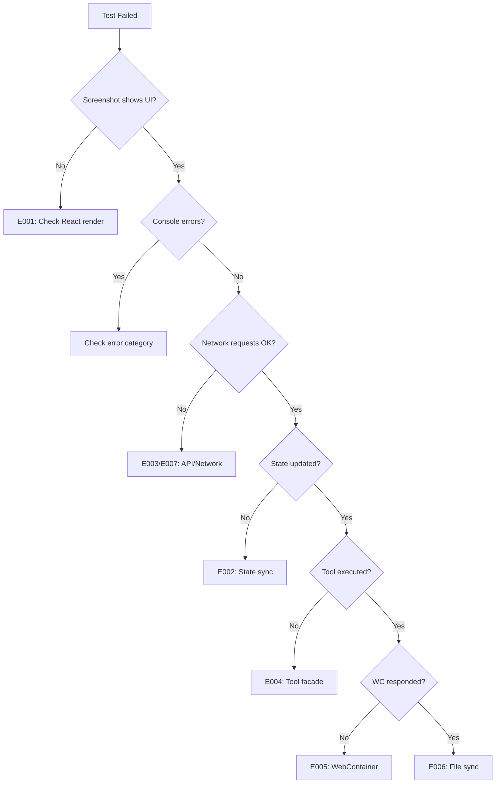

# E2E Testing Foundation with Traceability

**Date**: 2025-12-24  
**Version**: 1.0  
**Incident Response**: INC-2025-12-24-001  
**Author**: BMAD Master coordinating testarch-framework + testarch-test-design workflows

---

## 1. Executive Summary

This document establishes a comprehensive E2E testing foundation for the Via-gent AI coding agent system. It directly addresses the critical incident INC-2025-12-24-001, where Epic 25 stories were marked DONE but the frontend was non-functional due to **component-centric validation** rather than **integration testing**.

### Core Philosophy

> "I must be able to trace back where the cause is and address it systematically when shit happens → meaning I need a very strong and complete foundation to execute end2end real-case test so any failures are always traceable and can be adjusted systematically not having to battle in the dark like it is right now"

### Document Scope

- **Framework**: Playwright (recommended for Via-gent's requirements)
- **User Journey**: Configure → Chat → Execute → Approve → Iterate
- **Stories**: 7 MVP stories with full traceability
- **Scenarios**: 5 detailed E2E test scenarios

---

## 2. Testing Philosophy and Principles

### 2.1 Core Principles

| Principle | Description | Enforcement |
|-----------|-------------|-------------|
| **Integration Over Isolation** | Test how components work together, not just individually | E2E tests required for all stories |
| **Traceability First** | Every test traces to requirements and vice versa | Traceability matrix maintained |
| **Failure Transparency** | When tests fail, root cause is immediately identifiable | Structured logging, screenshots, traces |
| **Browser Verification** | Manual browser testing mandatory before DONE | Screenshot/recording proof required |
| **Systematic Debugging** | Failures lead to actionable debugging paths | Categorized failure types |

### 2.2 Test Pyramid for Via-gent

```
                    ┌─────────────┐
                    │    E2E      │  10% - Critical user journeys
                    │  (Playwright)│
                    ├─────────────┤
                    │ Integration │  30% - Component integration
                    │   (Vitest)  │
                    ├─────────────┤
                    │    Unit     │  60% - Business logic
                    │   (Vitest)  │
                    └─────────────┘
```

### 2.3 Lessons from INC-2025-12-24-001

From [root-cause-analysis-e2e-validation-failure-2025-12-24.md](file:///_bmad-output/critical-incidents/root-cause-analysis-e2e-validation-failure-2025-12-24.md):

| Root Cause | Prevention Measure |
|------------|-------------------|
| Component existence ≠ integration | E2E tests verify integration |
| Unit tests passed but UI broken | Browser E2E mandatory |
| Mock ≠ real implementation | Mock stories clearly labeled |
| No manual verification step | Screenshot proof required |

---

## 3. Systematic Failure Tracing Framework

### 3.1 Traceability Requirements

Every failure must trace through this chain:

```
User Action → UI Component → Hook/Store → API → Tool → WebContainer → Result
     ↓             ↓            ↓          ↓     ↓          ↓           ↓
  [Log ID]     [Component]   [State]    [Request] [Tool]  [Output]   [Assert]
```

### 3.2 Logging Protocol

```typescript
// Structured logging for traceability
interface TraceableLog {
  traceId: string;          // Unique ID for request chain
  timestamp: string;        // ISO timestamp
  layer: 'ui' | 'hook' | 'api' | 'tool' | 'webcontainer';
  component: string;        // Component name
  action: string;           // Action performed
  input?: unknown;          // Input data (sanitized)
  output?: unknown;         // Output data (sanitized)
  duration?: number;        // Milliseconds
  error?: {
    code: string;
    message: string;
    stack?: string;
  };
}

// Example usage in tests
test('should trace file read operation', async ({ page }) => {
  const traceId = crypto.randomUUID();
  
  // Set trace context
  await page.evaluate((id) => {
    window.__TRACE_ID__ = id;
  }, traceId);
  
  // Perform action
  await page.click('[data-testid="read-file-btn"]');
  
  // Collect logs
  const logs = await page.evaluate(() => window.__TRACE_LOGS__);
  
  // Verify trace chain complete
  expect(logs).toContainTraceChain([
    { layer: 'ui', action: 'click' },
    { layer: 'hook', action: 'readFile' },
    { layer: 'tool', action: 'execute' },
    { layer: 'webcontainer', action: 'fs.readFile' }
  ]);
});
```

### 3.3 Failure Categorization

| Category | Code | Description | Action |
|----------|------|-------------|--------|
| **UI_RENDER** | E001 | Component fails to render | Check React errors, CSS |
| **STATE_SYNC** | E002 | State not propagating | Check Zustand stores |
| **API_CALL** | E003 | API request fails | Check /api/chat endpoint |
| **TOOL_EXEC** | E004 | Tool execution fails | Check tool facade |
| **WC_ERROR** | E005 | WebContainer error | Check WC initialization |
| **FS_SYNC** | E006 | File sync failure | Check sync-manager |
| **NETWORK** | E007 | Network request fails | Check provider connection |
| **AUTH** | E008 | Authentication error | Check credential vault |

### 3.4 Debugging Decision Tree



---

## 4. Integration Testing Protocols

### 4.1 Integration Points

| Component A | Component B | Integration Protocol |
|-------------|-------------|---------------------|
| AgentChatPanel | /api/chat | SSE streaming validation |
| AgentConfigDialog | credential-vault | Persistence verification |
| FileToolsFacade | WebContainer FS | File CRUD operations |
| TerminalToolsFacade | WebContainer Shell | Command execution |
| ApprovalOverlay | Tool execution | Approval flow state |
| Monaco Editor | File sync | Real-time updates |
| FileTree | File sync | Status indicators |

### 4.2 WebContainer Integration Testing

```typescript
// tests/e2e/support/fixtures/webcontainer-fixture.ts
import { test as base } from '@playwright/test';

interface WebContainerFixtures {
  wcReady: Promise<boolean>;
  wcFileSystem: {
    read: (path: string) => Promise<string>;
    write: (path: string, content: string) => Promise<void>;
    exists: (path: string) => Promise<boolean>;
  };
}

export const test = base.extend<WebContainerFixtures>({
  wcReady: async ({ page }, use) => {
    const ready = page.waitForFunction(() => {
      return window.__WC_READY__ === true;
    }, { timeout: 30000 });
    await use(ready);
  },
  
  wcFileSystem: async ({ page }, use) => {
    await use({
      read: async (path) => {
        return page.evaluate(async (p) => {
          return window.__WC__.fs.readFile(p, 'utf-8');
        }, path);
      },
      write: async (path, content) => {
        await page.evaluate(async ({ p, c }) => {
          await window.__WC__.fs.writeFile(p, c);
        }, { p: path, c: content });
      },
      exists: async (path) => {
        return page.evaluate(async (p) => {
          try {
            await window.__WC__.fs.stat(p);
            return true;
          } catch { return false; }
        }, path);
      }
    });
  }
});
```

### 4.3 State Management Testing

```typescript
// Verify Zustand store synchronization
test('state syncs across components', async ({ page }) => {
  // Update state in one component
  await page.click('[data-testid="agent-config-btn"]');
  await page.fill('[data-testid="api-key"]', 'test-key-123');
  await page.click('[data-testid="save-config"]');
  
  // Verify state in another component
  const statusText = await page.locator('[data-testid="agent-status"]').textContent();
  expect(statusText).toContain('Ready');
  
  // Verify persistence
  await page.reload();
  const persistedStatus = await page.locator('[data-testid="agent-status"]').textContent();
  expect(persistedStatus).toContain('Ready');
});
```

---

## 5. Traceability Requirements and Matrix

### 5.1 Requirements to Tests Matrix

| Requirement ID | User Story | Test Scenario | Test Priority | Test File |
|----------------|------------|---------------|---------------|-----------|
| REQ-001 | MVP-1 | Agent Configuration | P0 | `scenario-1-config.spec.ts` |
| REQ-002 | MVP-1 | Configuration Persistence | P0 | `scenario-1-config.spec.ts` |
| REQ-003 | MVP-2 | Chat Message Send | P0 | `scenario-2-chat.spec.ts` |
| REQ-004 | MVP-2 | Streaming Response | P0 | `scenario-2-chat.spec.ts` |
| REQ-005 | MVP-3 | File Read Tool | P0 | `scenario-3-tools.spec.ts` |
| REQ-006 | MVP-3 | File Write Tool | P0 | `scenario-3-tools.spec.ts` |
| REQ-007 | MVP-4 | Terminal Execution | P0 | `scenario-3-tools.spec.ts` |
| REQ-008 | MVP-5 | Approval Flow | P0 | `scenario-4-conversation.spec.ts` |
| REQ-009 | MVP-6 | Real-time Updates | P0 | `scenario-4-conversation.spec.ts` |
| REQ-010 | MVP-7 | E2E Integration | P0 | `scenario-5-errors.spec.ts` |

### 5.2 Story to Test Traceability

From [sprint-status-consolidated.yaml](file:///_bmad-output/sprint-artifacts/sprint-status-consolidated.yaml):

| Story | Acceptance Criteria | Test Assertions |
|-------|---------------------|-----------------|
| MVP-1 | API keys stored securely | `expect(localStorage.getItem('agent-config')).toBeTruthy()` |
| MVP-1 | Connection test passes | `expect(connectionStatus).toBe('connected')` |
| MVP-2 | Responses stream in real-time | `expect(streamChunks.length).toBeGreaterThan(1)` |
| MVP-3 | Approval dialog shows file path | `expect(approvalDialog).toContainText(filePath)` |
| MVP-3 | Monaco editor reflects changes | `expect(editorContent).toContain(newContent)` |
| MVP-4 | Output captured in terminal | `expect(terminalOutput).toContain(expectedOutput)` |
| MVP-5 | User can approve/deny | `expect(toolResult).toBe(approved ? 'success' : 'denied')` |

### 5.3 Failure to Root Cause Traceability

```typescript
// Failure traceability helper
class FailureTracer {
  static async trace(page: Page, error: Error): Promise<RootCause> {
    const screenshot = await page.screenshot();
    const consoleErrors = await page.evaluate(() => window.__CONSOLE_ERRORS__);
    const networkErrors = await page.evaluate(() => window.__NETWORK_ERRORS__);
    const stateSnapshot = await page.evaluate(() => window.__STATE_SNAPSHOT__);
    
    return {
      error: error.message,
      screenshot: screenshot.toString('base64'),
      consoleErrors,
      networkErrors,
      stateSnapshot,
      suggestedFix: this.getSuggestedFix(error, consoleErrors, networkErrors)
    };
  }
  
  static getSuggestedFix(error: Error, console: string[], network: NetworkError[]): string {
    if (network.some(n => n.status === 401)) {
      return 'Check API key configuration in credential-vault.ts';
    }
    if (console.some(c => c.includes('WebContainer'))) {
      return 'WebContainer initialization failed - check boot sequence';
    }
    if (error.message.includes('timeout')) {
      return 'Element not found - check component rendering and selectors';
    }
    return 'Manual investigation required';
  }
}
```

---

## 6. Real User Journey Testing Scenarios

Based on [user-journey-definition.md](file:///_bmad-output/consolidation/user-journey-definition.md):

### Scenario 1: Agent Configuration

**User Story**: MVP-1  
**Priority**: P0  
**Duration**: < 2 minutes

```typescript
// tests/e2e/scenarios/scenario-1-config.spec.ts
import { test, expect } from '../support/fixtures';

test.describe('Scenario 1: Agent Configuration', () => {
  test('should configure AI provider and persist settings', async ({ page }) => {
    // Step 1: Open configuration dialog
    await page.goto('/');
    await page.click('[data-testid="agent-config-btn"]');
    await expect(page.locator('[data-testid="config-dialog"]')).toBeVisible();
    
    // Step 2: Select provider
    await page.selectOption('[data-testid="provider-select"]', 'openrouter');
    
    // Step 3: Enter API key
    await page.fill('[data-testid="api-key-input"]', process.env.TEST_API_KEY!);
    
    // Step 4: Select model
    await page.selectOption('[data-testid="model-select"]', 'mistralai/devstral-2512:free');
    
    // Step 5: Test connection
    await page.click('[data-testid="test-connection-btn"]');
    await expect(page.locator('[data-testid="connection-status"]')).toContainText('Connected');
    
    // Step 6: Save configuration
    await page.click('[data-testid="save-config-btn"]');
    await expect(page.locator('[data-testid="config-dialog"]')).not.toBeVisible();
    
    // Step 7: Verify persistence
    await page.reload();
    await page.click('[data-testid="agent-config-btn"]');
    await expect(page.locator('[data-testid="api-key-input"]')).toHaveValue('••••••••');
    await expect(page.locator('[data-testid="agent-status"]')).toContainText('Ready');
  });

  test('should handle invalid API key gracefully', async ({ page }) => {
    await page.goto('/');
    await page.click('[data-testid="agent-config-btn"]');
    await page.selectOption('[data-testid="provider-select"]', 'openrouter');
    await page.fill('[data-testid="api-key-input"]', 'invalid-key');
    await page.click('[data-testid="test-connection-btn"]');
    
    await expect(page.locator('[data-testid="connection-error"]')).toBeVisible();
    await expect(page.locator('[data-testid="connection-error"]')).toContainText('Invalid API key');
  });
});
```

### Scenario 2: Basic Chat Interaction

**User Story**: MVP-2  
**Priority**: P0  
**Duration**: < 3 minutes

```typescript
// tests/e2e/scenarios/scenario-2-chat.spec.ts
import { test, expect } from '../support/fixtures';

test.describe('Scenario 2: Basic Chat Interaction', () => {
  test.beforeEach(async ({ page }) => {
    // Setup: Configure agent first
    await page.goto('/');
    await configureAgent(page);
  });

  test('should send message and receive streaming response', async ({ page }) => {
    // Step 1: Open chat panel
    await page.click('[data-testid="chat-panel-toggle"]');
    await expect(page.locator('[data-testid="chat-panel"]')).toBeVisible();
    
    // Step 2: Send message
    await page.fill('[data-testid="chat-input"]', 'Hello, help me with my React project');
    await page.click('[data-testid="send-message-btn"]');
    
    // Step 3: Verify message appears
    await expect(page.locator('[data-testid="user-message"]').last()).toContainText('Hello');
    
    // Step 4: Verify streaming response
    const responseLocator = page.locator('[data-testid="assistant-message"]').last();
    await expect(responseLocator).toBeVisible({ timeout: 10000 });
    
    // Verify streaming (content length should increase)
    const initialLength = await responseLocator.textContent();
    await page.waitForTimeout(500);
    const laterLength = await responseLocator.textContent();
    expect(laterLength!.length).toBeGreaterThan(initialLength!.length);
    
    // Step 5: Verify response rendering
    await page.waitForFunction(() => {
      const msg = document.querySelector('[data-testid="assistant-message"]:last-child');
      return msg && msg.textContent!.length > 50;
    }, { timeout: 30000 });
  });

  test('should render code blocks with syntax highlighting', async ({ page }) => {
    await page.click('[data-testid="chat-panel-toggle"]');
    await page.fill('[data-testid="chat-input"]', 'Show me a simple React component');
    await page.click('[data-testid="send-message-btn"]');
    
    // Wait for code block
    await expect(page.locator('[data-testid="code-block"]')).toBeVisible({ timeout: 30000 });
    
    // Verify syntax highlighting
    const codeBlock = page.locator('[data-testid="code-block"]').first();
    await expect(codeBlock.locator('.token')).toBeVisible();
  });
});
```

### Scenario 3: Tool Execution

**User Stories**: MVP-3, MVP-4  
**Priority**: P0  
**Duration**: < 5 minutes

```typescript
// tests/e2e/scenarios/scenario-3-tools.spec.ts
import { test, expect } from '../support/fixtures';

test.describe('Scenario 3: Tool Execution', () => {
  test.beforeEach(async ({ page, wcReady }) => {
    await page.goto('/');
    await configureAgent(page);
    await wcReady;
  });

  test('should execute file read with approval', async ({ page, wcFileSystem }) => {
    // Setup: Create test file
    await wcFileSystem.write('/home/project/test.ts', 'export const test = true;');
    
    // Step 1: Request file read
    await page.click('[data-testid="chat-panel-toggle"]');
    await page.fill('[data-testid="chat-input"]', 'Read the file test.ts and explain what it does');
    await page.click('[data-testid="send-message-btn"]');
    
    // Step 2: Wait for tool call
    await expect(page.locator('[data-testid="tool-call-badge"]')).toBeVisible({ timeout: 30000 });
    await expect(page.locator('[data-testid="tool-call-badge"]')).toContainText('readFile');
    
    // Step 3: Verify approval dialog
    await expect(page.locator('[data-testid="approval-overlay"]')).toBeVisible();
    await expect(page.locator('[data-testid="approval-file-path"]')).toContainText('test.ts');
    
    // Step 4: Approve
    await page.click('[data-testid="approve-btn"]');
    
    // Step 5: Verify tool result
    await expect(page.locator('[data-testid="tool-result"]')).toBeVisible();
    await expect(page.locator('[data-testid="tool-result"]')).toContainText('export const test');
  });

  test('should execute file write with diff preview', async ({ page, wcFileSystem }) => {
    await wcFileSystem.write('/home/project/component.tsx', 'export function Old() {}');
    
    await page.click('[data-testid="chat-panel-toggle"]');
    await page.fill('[data-testid="chat-input"]', 'Rename the function in component.tsx to NewFunction');
    await page.click('[data-testid="send-message-btn"]');
    
    // Wait for write tool call
    await expect(page.locator('[data-testid="tool-call-badge"]')).toContainText('writeFile');
    
    // Verify diff preview
    await expect(page.locator('[data-testid="diff-preview"]')).toBeVisible();
    await expect(page.locator('[data-testid="diff-removed"]')).toContainText('Old');
    await expect(page.locator('[data-testid="diff-added"]')).toContainText('NewFunction');
    
    // Approve
    await page.click('[data-testid="approve-btn"]');
    
    // Verify file updated
    const content = await wcFileSystem.read('/home/project/component.tsx');
    expect(content).toContain('NewFunction');
    
    // Verify Monaco editor updated
    await page.click('[data-testid="file-tree-item-component.tsx"]');
    await expect(page.locator('.monaco-editor')).toContainText('NewFunction');
  });

  test('should execute terminal command', async ({ page }) => {
    await page.click('[data-testid="chat-panel-toggle"]');
    await page.fill('[data-testid="chat-input"]', 'Run ls -la in the terminal');
    await page.click('[data-testid="send-message-btn"]');
    
    // Wait for command tool call
    await expect(page.locator('[data-testid="tool-call-badge"]')).toContainText('executeCommand');
    
    // Approve command
    await page.click('[data-testid="approve-btn"]');
    
    // Verify terminal output
    await expect(page.locator('[data-testid="terminal-panel"]')).toContainText('ls -la');
    await expect(page.locator('.xterm')).toContainText('total');
  });
});
```

### Scenario 4: Multi-Step Conversation

**User Story**: MVP-5, MVP-6  
**Priority**: P0  
**Duration**: < 5 minutes

```typescript
// tests/e2e/scenarios/scenario-4-conversation.spec.ts
import { test, expect } from '../support/fixtures';

test.describe('Scenario 4: Multi-Step Conversation', () => {
  test('should complete multi-step workflow', async ({ page, wcReady, wcFileSystem }) => {
    await page.goto('/');
    await configureAgent(page);
    await wcReady;
    
    // Setup project structure
    await wcFileSystem.write('/home/project/package.json', '{"name": "test"}');
    
    // Step 1: Start conversation
    await page.click('[data-testid="chat-panel-toggle"]');
    await page.fill('[data-testid="chat-input"]', 'Create a new React component called Button');
    await page.click('[data-testid="send-message-btn"]');
    
    // Step 2: Approve file creation
    await expect(page.locator('[data-testid="tool-call-badge"]')).toContainText('writeFile');
    await page.click('[data-testid="approve-btn"]');
    
    // Step 3: Verify file created in tree
    await expect(page.locator('[data-testid="file-tree"]')).toContainText('Button');
    
    // Step 4: Continue conversation
    await page.fill('[data-testid="chat-input"]', 'Now add a test file for this component');
    await page.click('[data-testid="send-message-btn"]');
    
    // Step 5: Approve test file
    await expect(page.locator('[data-testid="tool-call-badge"]')).toContainText('writeFile');
    await page.click('[data-testid="approve-btn"]');
    
    // Step 6: Request test run
    await page.fill('[data-testid="chat-input"]', 'Run the tests');
    await page.click('[data-testid="send-message-btn"]');
    
    // Step 7: Approve command
    await expect(page.locator('[data-testid="tool-call-badge"]')).toContainText('executeCommand');
    await page.click('[data-testid="approve-btn"]');
    
    // Verify all steps completed
    expect(await wcFileSystem.exists('/home/project/Button.tsx')).toBe(true);
    expect(await wcFileSystem.exists('/home/project/Button.test.tsx')).toBe(true);
  });
});
```

### Scenario 5: Error Handling

**User Story**: MVP-7  
**Priority**: P0  
**Duration**: < 3 minutes

```typescript
// tests/e2e/scenarios/scenario-5-errors.spec.ts
import { test, expect } from '../support/fixtures';

test.describe('Scenario 5: Error Handling', () => {
  test('should handle invalid API key error', async ({ page }) => {
    await page.goto('/');
    await page.click('[data-testid="agent-config-btn"]');
    await page.selectOption('[data-testid="provider-select"]', 'openrouter');
    await page.fill('[data-testid="api-key-input"]', 'invalid-key');
    await page.click('[data-testid="test-connection-btn"]');
    
    await expect(page.locator('[data-testid="error-message"]')).toContainText('Invalid API key');
    await expect(page.locator('[data-testid="error-recovery"]')).toBeVisible();
  });

  test('should handle file permission denied', async ({ page, wcReady }) => {
    await page.goto('/');
    await configureAgent(page);
    await wcReady;
    
    await page.click('[data-testid="chat-panel-toggle"]');
    await page.fill('[data-testid="chat-input"]', 'Read /etc/passwd');
    await page.click('[data-testid="send-message-btn"]');
    
    await expect(page.locator('[data-testid="tool-call-badge"]')).toBeVisible();
    await page.click('[data-testid="approve-btn"]');
    
    await expect(page.locator('[data-testid="tool-error"]')).toContainText('Permission denied');
  });

  test('should handle WebContainer boot failure gracefully', async ({ page }) => {
    // Simulate WC failure
    await page.route('**/webcontainer/**', route => route.abort());
    
    await page.goto('/');
    await expect(page.locator('[data-testid="wc-error-banner"]')).toBeVisible();
    await expect(page.locator('[data-testid="wc-error-recovery"]')).toContainText('Retry');
  });

  test('should recover from network errors', async ({ page }) => {
    await page.goto('/');
    await configureAgent(page);
    
    await page.click('[data-testid="chat-panel-toggle"]');
    await page.fill('[data-testid="chat-input"]', 'Hello');
    
    // Simulate network failure during send
    await page.route('**/api/chat', route => route.abort());
    await page.click('[data-testid="send-message-btn"]');
    
    await expect(page.locator('[data-testid="network-error"]')).toBeVisible();
    
    // Restore network and retry
    await page.unroute('**/api/chat');
    await page.click('[data-testid="retry-btn"]');
    
    await expect(page.locator('[data-testid="assistant-message"]')).toBeVisible();
  });
});
```

---

## 7. E2E Testing Architecture

### 7.1 Framework Selection: Playwright

**Rationale** (from [instructions.md](file:///_bmad/bmm/workflows/testarch/framework/instructions.md)):

| Criteria | Playwright | Cypress |
|----------|-----------|---------|
| Large repository | ✅ Worker parallelism | ❌ Slower |
| WebContainer support | ✅ Better iframe handling | ⚠️ Limited |
| Multi-browser | ✅ Chromium, Firefox, WebKit | ⚠️ Chrome focus |
| Trace debugging | ✅ Built-in trace viewer | ⚠️ Manual setup |
| Video recording | ✅ Native support | ✅ Supported |

### 7.2 Directory Structure

```
tests/
├── e2e/
│   ├── scenarios/
│   │   ├── scenario-1-config.spec.ts
│   │   ├── scenario-2-chat.spec.ts
│   │   ├── scenario-3-tools.spec.ts
│   │   ├── scenario-4-conversation.spec.ts
│   │   └── scenario-5-errors.spec.ts
│   └── smoke/
│       └── health-check.spec.ts
├── support/
│   ├── fixtures/
│   │   ├── index.ts
│   │   ├── webcontainer-fixture.ts
│   │   └── agent-fixture.ts
│   ├── helpers/
│   │   ├── configure-agent.ts
│   │   ├── wait-for-wc.ts
│   │   └── failure-tracer.ts
│   └── page-objects/
│       ├── chat-panel.ts
│       ├── config-dialog.ts
│       └── approval-overlay.ts
├── README.md
└── playwright.config.ts
```

### 7.3 Playwright Configuration

```typescript
// playwright.config.ts
import { defineConfig, devices } from '@playwright/test';

export default defineConfig({
  testDir: './tests/e2e',
  fullyParallel: true,
  forbidOnly: !!process.env.CI,
  retries: process.env.CI ? 2 : 0,
  workers: process.env.CI ? 1 : undefined,

  timeout: 60 * 1000,
  expect: {
    timeout: 15 * 1000,
  },

  use: {
    baseURL: process.env.BASE_URL || 'http://localhost:3000',
    trace: 'retain-on-failure',
    screenshot: 'only-on-failure',
    video: 'retain-on-failure',
    actionTimeout: 15 * 1000,
    navigationTimeout: 30 * 1000,
  },

  reporter: [
    ['html', { outputFolder: 'test-results/html' }],
    ['junit', { outputFile: 'test-results/junit.xml' }],
    ['list']
  ],

  projects: [
    { name: 'chromium', use: { ...devices['Desktop Chrome'] } },
  ],

  webServer: {
    command: 'pnpm dev',
    url: 'http://localhost:3000',
    reuseExistingServer: !process.env.CI,
    timeout: 120 * 1000,
  },
});
```

---

## 8. Test Environment Setup

### 8.1 Environment Variables

```bash
# .env.test
TEST_ENV=local
BASE_URL=http://localhost:3000
TEST_API_KEY=sk-or-v1-test-key
TEST_PROVIDER=openrouter
TEST_MODEL=mistralai/devstral-2512:free
```

### 8.2 Prerequisites

```bash
# Install Playwright
pnpm add -D @playwright/test

# Install browsers
pnpm exec playwright install chromium

# Create test structure
mkdir -p tests/e2e/scenarios tests/e2e/smoke tests/support/fixtures tests/support/helpers
```

### 8.3 npm Scripts

```json
{
  "scripts": {
    "test:e2e": "playwright test",
    "test:e2e:headed": "playwright test --headed",
    "test:e2e:debug": "playwright test --debug",
    "test:e2e:ui": "playwright test --ui",
    "test:e2e:smoke": "playwright test tests/e2e/smoke",
    "test:e2e:report": "playwright show-report"
  }
}
```

---

## 9. Test Data Management

### 9.1 Test Data Factories

```typescript
// tests/support/fixtures/factories/project-factory.ts
export class ProjectFactory {
  async createTestProject(wcFileSystem: WCFileSystem): Promise<void> {
    await wcFileSystem.write('/home/project/package.json', JSON.stringify({
      name: 'test-project',
      version: '1.0.0',
      scripts: { test: 'vitest' }
    }));
    
    await wcFileSystem.write('/home/project/src/App.tsx', `
      export function App() {
        return <div>Hello World</div>;
      }
    `);
  }
  
  async cleanup(wcFileSystem: WCFileSystem): Promise<void> {
    // WebContainer resets on page reload
  }
}
```

### 9.2 Test Data Isolation

Each test runs with a fresh WebContainer instance. Data cleanup is automatic on page reload.

---

## 10. Test Execution and Reporting

### 10.1 Execution Order

```
1. Smoke Tests (< 2 min) - Health check
2. Scenario 1 (< 2 min) - Configuration
3. Scenario 2 (< 3 min) - Chat interface
4. Scenario 3 (< 5 min) - Tool execution
5. Scenario 4 (< 5 min) - Multi-step workflow
6. Scenario 5 (< 3 min) - Error handling
   ─────────────────────
   Total: < 20 minutes
```

### 10.2 Reporting

**HTML Report**: `test-results/html/index.html`
**JUnit XML**: `test-results/junit.xml`
**Traces**: `test-results/traces/`
**Screenshots**: `test-results/screenshots/`
**Videos**: `test-results/videos/`

### 10.3 CI Integration

```yaml
# .github/workflows/e2e.yml
name: E2E Tests

on:
  push:
    branches: [main]
  pull_request:
    branches: [main]

jobs:
  e2e:
    runs-on: ubuntu-latest
    steps:
      - uses: actions/checkout@v4
      - uses: pnpm/action-setup@v2
      - uses: actions/setup-node@v4
        with:
          node-version: 20
          cache: pnpm
      - run: pnpm install
      - run: pnpm exec playwright install chromium
      - run: pnpm test:e2e
      - uses: actions/upload-artifact@v4
        if: failure()
        with:
          name: test-results
          path: test-results/
```

---

## 11. Integration with Sprint Planning

### 11.1 E2E Verification Gates

From [sprint-status-consolidated.yaml](file:///_bmad-output/sprint-artifacts/sprint-status-consolidated.yaml):

| Story | E2E Gate | Required Evidence |
|-------|----------|-------------------|
| MVP-1 | `scenario-1-config.spec.ts` passes | Screenshot of configured agent |
| MVP-2 | `scenario-2-chat.spec.ts` passes | Recording of streaming response |
| MVP-3 | `scenario-3-tools.spec.ts` (file) passes | Screenshot of diff preview |
| MVP-4 | `scenario-3-tools.spec.ts` (terminal) passes | Screenshot of terminal output |
| MVP-5 | `scenario-4-conversation.spec.ts` passes | Recording of approval flow |
| MVP-6 | Real-time updates verified | Screenshot of synced panels |
| MVP-7 | All scenarios pass | Full test report |

### 11.2 Updated Definition of Done

```yaml
definition_of_done:
  - "Code implementation complete"
  - "TypeScript: pnpm build passes"
  - "Unit tests passing (≥80% coverage)"
  - "E2E scenario test passes"
  - "MANDATORY: Screenshot/recording proof attached to story"
  - "Code review approved"
```

### 11.3 Rollback Procedures

1. **Test Failure**: Revert to last passing commit
2. **Integration Failure**: Identify failing component via trace
3. **WebContainer Failure**: Check WC version compatibility
4. **API Failure**: Verify provider connectivity

---

## 12. Success Criteria and Metrics

### 12.1 Quality Gate Criteria

| Gate | Threshold | Action if Failed |
|------|-----------|------------------|
| P0 Tests | 100% pass | Block deployment |
| P1 Tests | ≥95% pass | Review and fix |
| Test Coverage | ≥80% critical paths | Add tests |
| Execution Time | < 20 minutes | Optimize tests |

### 12.2 Metrics Dashboard

- **Test Pass Rate**: % of tests passing
- **Mean Time to Failure**: Average time before failure
- **Failure Category Distribution**: Which categories fail most
- **Trace Resolution Time**: Time to identify root cause

---

## 13. Implementation Roadmap

### Phase 1: Foundation (Day 1)
- [x] Install Playwright
- [ ] Create directory structure
- [ ] Implement fixtures
- [ ] Create Scenario 1 tests

### Phase 2: Core Scenarios (Day 2-3)
- [ ] Implement Scenario 2 (Chat)
- [ ] Implement Scenario 3 (Tools)
- [ ] Implement Scenario 4 (Multi-step)
- [ ] Implement Scenario 5 (Errors)

### Phase 3: Integration (Day 4)
- [ ] CI pipeline setup
- [ ] Reporting configuration
- [ ] Documentation complete

### Phase 4: Validation (Day 5)
- [ ] Full test suite run
- [ ] Performance benchmarks
- [ ] Demo recording

---

## 14. Troubleshooting Guide

### Common Issues

| Issue | Cause | Solution |
|-------|-------|----------|
| WebContainer timeout | Slow initialization | Increase timeout to 60s |
| Element not found | Component not rendered | Add wait for visibility |
| Network error | API route mismatch | Check baseURL config |
| State not persisting | localStorage cleared | Check test isolation |
| Streaming timeout | SSE connection issue | Check CORS headers |

### Debug Commands

```bash
# Run with debug mode
pnpm test:e2e:debug

# Run specific test
pnpm test:e2e -g "should configure AI provider"

# View trace
pnpm exec playwright show-trace test-results/traces/trace.zip

# Generate report
pnpm test:e2e:report
```

---

## References

- [Root Cause Analysis](file:///_bmad-output/critical-incidents/root-cause-analysis-e2e-validation-failure-2025-12-24.md)
- [Research Synthesis](file:///_bmad-output/research-synthesis-ai-agent-patterns-2025-12-24.md)
- [Agent Architecture Guidelines](file:///_bmad-output/architecture/agent-architecture-guidelines-2025-12-24.md)
- [Sprint Status](file:///_bmad-output/sprint-artifacts/sprint-status-consolidated.yaml)
- [User Journey Definition](file:///_bmad-output/consolidation/user-journey-definition.md)
- [Testarch Framework Instructions](file:///_bmad/bmm/workflows/testarch/framework/instructions.md)
- [Testarch Test Design Instructions](file:///_bmad/bmm/workflows/testarch/test-design/instructions.md)

---

**Document Status**: COMPLETE  
**Next Review**: After MVP-7 completion  
**Owner**: BMAD Master
